# Introduction 
作者在前文考虑了一个新的优化问题：
$$
\min_{\mathbf{x_{1},...,x_{n}} \in \mathbb{R}^{d}} \{ F(\mathbf{x}) := f(\mathbf{x}) + \lambda \psi(\mathbf{x})\}
$$ 
$$
f(\mathbf{x}):= \frac{1}{n}\sum_{i=1}^{n}f_{i}(\mathbf{x_{i}}), \quad \psi(\mathbf{x}):= \frac{1}{2n}\sum_{i=1}^{n}\|\mathbf{x_{i}} - \mathbf{\bar{x}}\|^{2}
$$

Remark：该问题的最优解 $\mathbf{x}^{*} = [\mathbf{x}_{1}^{*},..., \mathbf{x}_{n}^{*}] \in \mathbb{R}^{nd}$ 可以被表示为 $\mathbf{x}^{*}_{i} = \mathbf{\bar{x}}^{*} - \frac{1}{\lambda}\nabla f_{i}(\mathbf{x}_{i}^{*})$，其中 $\mathbf{\bar{x}}^{*} = \frac{1}{n}\sum_{i=1}^{n} \mathbf{x}_{i}^{*}$，该形式与MAML相似。

# Contributions
在这篇论文中，作者给出了求解上述优化问题的通信和局部计算复杂度（迭代次数）的最低界限，并且给出了几种能够达到最低界限的算法。

- lower bound on the communication complexity. 作者证明对于任意一个满足一定假设条件的算法，会有一个L-smooth, $\mu$-strongly convex 局部目标函数 $f_{i}$ 至少需要通信 $O(\sqrt{\frac{\min\{L,  \lambda\}}{\mu}}\log\frac{1}{\epsilon})$ 轮才能得到最优解 $\epsilon$邻域内的解。
- lower complexity bound on the number of local oracle calls. 作者证明对于局部近端梯度下降，至少需要迭代$O(\sqrt{\frac{\min\{L,  \lambda\}}{\mu}}\log\frac{1}{\epsilon})$ 次；对于局部梯度下降，至少需要进行 $O(\sqrt{\frac{L}{\mu}}\log\frac{1}{\epsilon})$ 次迭代；若每个目标函数为 $m$ 个有限和形式（$\tilde{L}$-smooth)，至少需要 $O((m + \sqrt{\frac{m\tilde{L}}{\mu}})\log\frac{1}{\epsilon})$ 次。
  
- 作者讨论了不同的用于求解上述优化问题的算法，这些算法在不同设定下可以达到最优通信复杂度和最优局部梯度复杂度。。首先是加速近端梯度下降算法(APGD)，作者考虑两种不同的应用方式，第一种是：函数 $f$ 采用梯度下降，$\lambda \psi$ 采用近端梯度下降，第二种是反过来。对于第一种情况，当 $L \leq \lambda$ 时，我们可以实现最优通信复杂度和局部梯度复杂度 $O(\sqrt{\frac{L}{\mu}}\log\frac{1}{\epsilon})$；对于第二种情况，当 $L \geq \lambda$ 时，我们可以得到最优通信复杂度和局部近端复杂度 $O(\sqrt{\frac{\lambda}{\mu}}\log\frac{1}{\epsilon})$。 受一篇论文启发，作者提到局部近端可以由局部加速梯度下降 (Local AGD) 近似 (inexactly) 得到，当目标函数为有限和形式，还可以采用 Katyusha算法近似得到。Local AGD 可以得到 $O(\sqrt{\frac{\lambda}{\mu}}\log\frac{1}{\epsilon})$ 的通信复杂度，以及 $\tilde{O}(\sqrt{\frac{L+\lambda}{\mu}})$ 的局部梯度复杂度，当 $L \geq \lambda$（取决于对数因子） 时，两者都能达到最优。同样，当局部采用 Katyusha 时，我们可以得到通信复杂度 $O(\sqrt{\frac{\lambda}{\mu}}\log\frac{1}{\epsilon})$ 和局部梯度复杂度 $\tilde{O}(m\sqrt{\frac{\lambda}{\mu}} + \sqrt{m \frac{\tilde{L}}{\mu}})$，前者当 $L \geq \Lambda$ 时能达到最优，后者当 $m\lambda \leq \tilde{L}$（取决于对数因子） 时达到最优。

- 作者提出了加速的L2SGD+算法-AL2SGD+，该算法可以实现最优通信复杂  度 $O(\sqrt{\frac{\min\{\tilde{L},  \lambda\}}{\mu}}\log\frac{1}{\epsilon})$，以及局部梯度复杂度 $O((m + \sqrt{\frac{m(\tilde{L} + \lambda)}{\mu}})\log\frac{1}{\epsilon})$，当 $\lambda \leq \tilde{L}$ 时最优。但是，两者无法同时实现最优。

  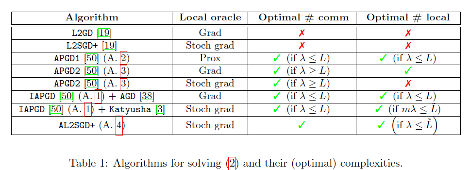

# Lower complexity bounds

## Lower complexity bounds on the communication
  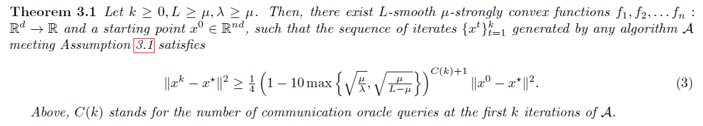
  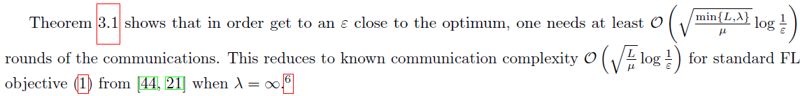

## Lower complexity bounds on the local computation
  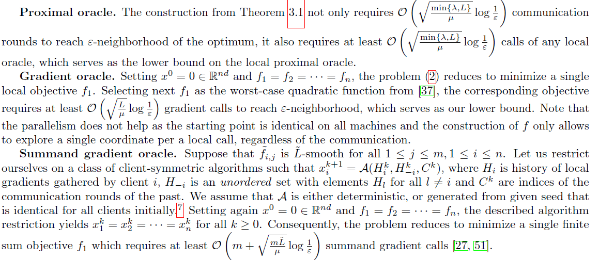

# 优化算法

## Accelerated Proximal Gradient Descent (APGD) for Federated Learning

首先介绍非加速版本的近端梯度下降算法(PGD):
  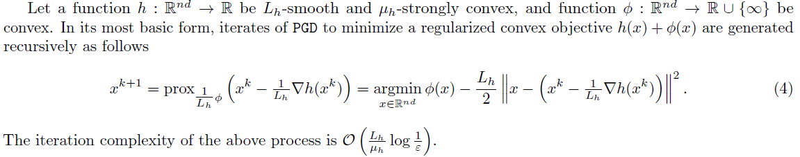

根据另一篇论文，有两种不同的方式可以将梯度下降算法应用到上述优化问题上。最直接的方式是令 $h = f$，$\phi = \lambda\psi$，那么可以得到如下更新步骤：
  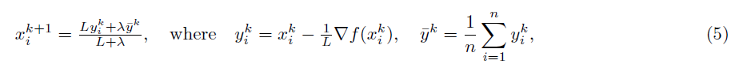

另一种方式是令 $h(\mathbf{x}) = \lambda \phi(\mathbf{x}) + \frac{\mu}{2n}\|\mathbf{x}\|^{2}$， $\phi(\mathbf{x}) = f(\mathbf{x}) - \frac{\mu}{2n}\|\mathbf{x}\|^{2}$。由此得到的更新过程如下：
  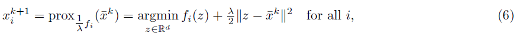

同FedProx算法一致。

由于上述两种情况下，每次迭代都需要进行一轮通信，相应的通信复杂度次优。但是可以结合动量算法，程序(6) 可以结合Nesterov's momentum，能够得到最优通信复杂度，以及最优局部近端复杂度（当 $\lambda \leq L)$，该算法定义为APGD1，具体如下：

  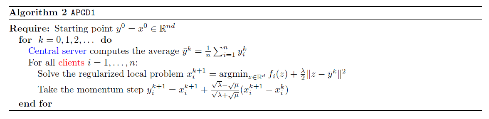

将更新过程(5)和动量结合，可以得到最优通信复杂度以及最优局部近端复杂度（当 $\lambda \geq L）$。将该算法定义为APGD2，具体如下：

  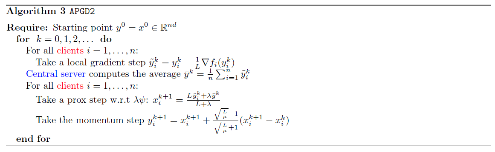

## Beyond proximal oracle: Inexact APGD (IAPGD)

在多数情况下，如果采用局部近端操作，每一步迭代时都需要得到子问题的精确解，这是不实际的。因此，作者提出了一个针对(6) 的加速非精确的算法，每个节点只需要进行局部梯度运算（AGD, Katyusha)：

  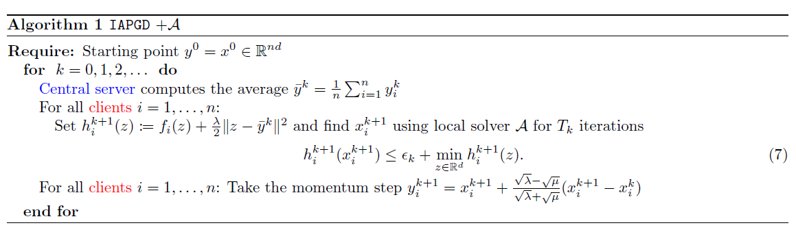

## Accelerated L2SGD+

作者给出L2SGD+算法的一个加速版本-AL2SGD+。作者指出AL2SGD+算法不过是L-Katyusha 算法与非均匀抽样的结合。

  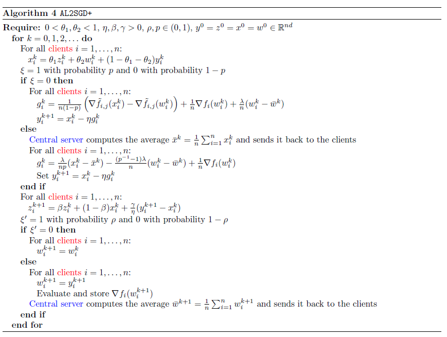

# Experiments

在第一个实验中，作者比较了当局部损失为有限和形式时，算法IAPGD+Katyusha、AL2SGD+以及L2SGD+的收敛速度。结果如下图：

  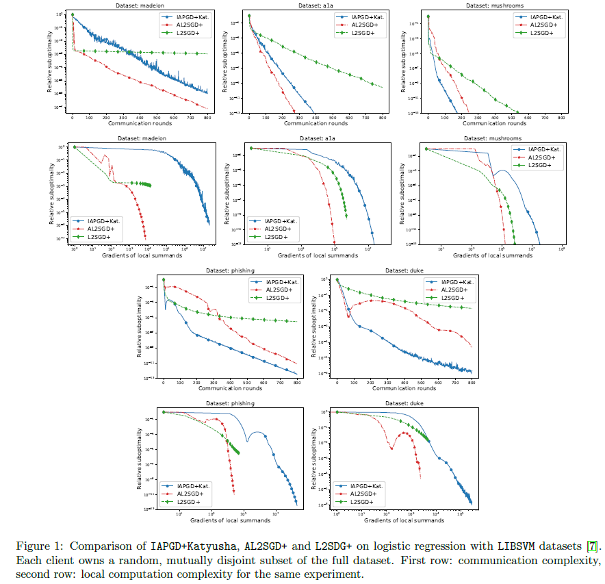

对于通信轮数，IAPGD+Katyusha和AL2SGD+都显著优于L2SGD+；对于局部计算次数，AL2SGD+表现最优，IAPGD+Katyusha不如L2SGD+。

第二个实验中，作者研究了数据异质性对算法的影响，结果如下图所示。可以看出，数据异质性不影响算法的收敛速度，各个算法的表现同第一个实验相似。

  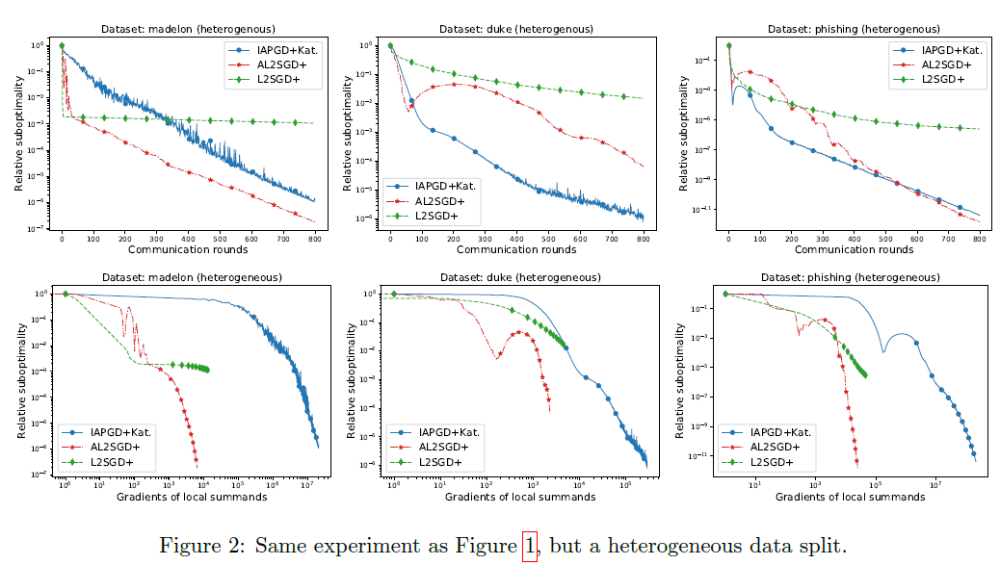

在第三个实验中，作者比较了APGD算法的两种变形：APGD1和APGD2。作者不断改变参数 $\lambda$ 的取值，其余参数保持不变。在理论上，APGD2算法应该不受参数 $\lambda$ 影响，而APGD1 算法的收敛率会随着 $\lambda$ 而增加 ($\sqrt{\lambda}$)。 当 $\lambda \leq L = 1$时，APGD1是最优选择；当 $\lambda > L = 1$ 时，APGD2 应该是最优选择。实验结果如下图所示，结果与理论一致。

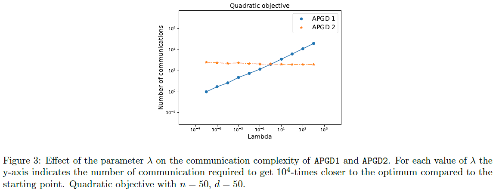

# 参考文献

- Filip Hanzely (KAUST) · Slavomír Hanzely (KAUST) · Samuel Horváth (King Abdullah University of Science and Technology)· Peter Richtarik (KAUST). Lower Bounds and Optimal Algorithms for Personalized Federated Learning.arXiv e-prints. https://ui.adsabs.harvard.edu/abs/2020arXiv201002372H
