# [（20250709）MCP: Build Rich-Context AI Apps with Anthropic](https://www.deeplearning.ai/short-courses/mcp-build-rich-context-ai-apps-with-anthropic/)

### Why Model Context Protocol (MCP)?
Models are only as good as the context provided to them. If the model doesn't have the ability to connect to the outside world and pull in the data and context necessary, it is not as useful as it can possibly be. The model context protocol is an open-source protocol that standardizes how your language model connects and works with your tools and data sources.

Many AI researchers and teams talk to a similar data source but writen in a different way. Instead of building the same integration for a different data source over and over again, depending on the model or the data source, we instead going to build once and use everywhere. The model context protocol borrows a lot of its ideas from other protocols that aim to achieve similar ideas. For example, LSP (language server protocol) developed in 2016 by Microsoft, standardizes how intergrated development environments interact with language-sepcific tools. When you create extensions for particular languages for particular development environments, you don't want to have to write that over and over again for all of those development environments. So that is what MCP trying to do.

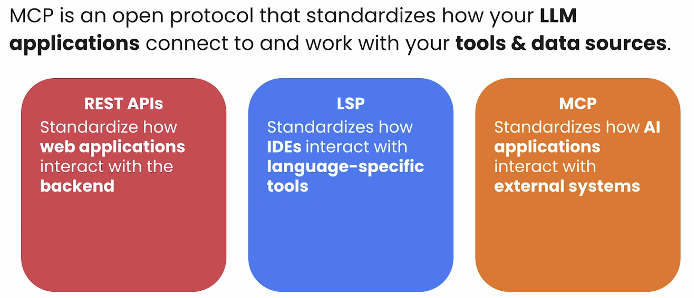

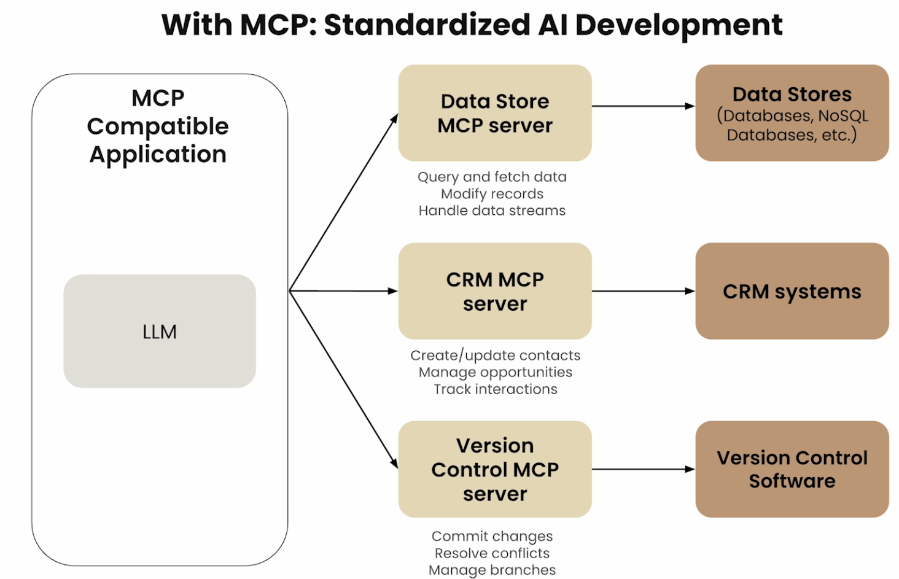

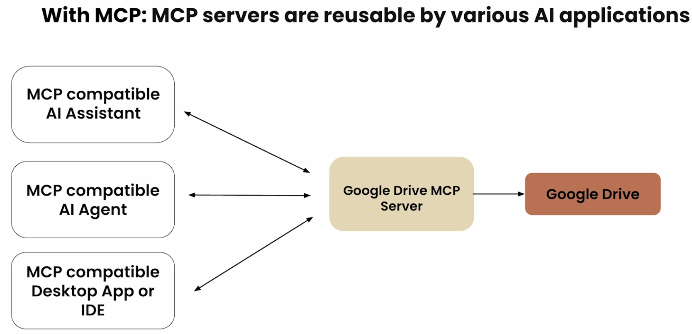

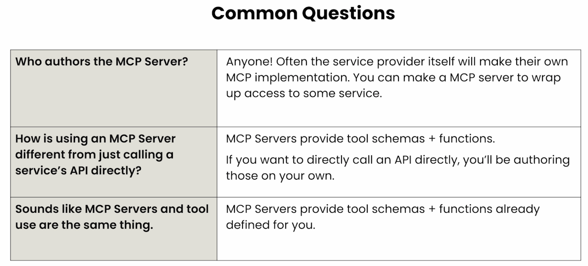

### MCP architecture
MCP is based on a client-server architecture, where the MCP clients maintain a 1 to 1 connection with MCP servers. The way these two communicate with each other is through messages defined by the MCP itself. These clients live inside of a host. The host could be something like Claude desktop or Claude AI. The host is repsonsible for storing and maintaining all of the clients and connections to MCP servers. 

- Hosts are LLM applications that want to access external data and tools through MCP.
  
- MCP servers are lightweight programs that expose the specific capabilities through the protocol.
  
- MCP clients are the components that live inside of the host and connect to the MCP servers.

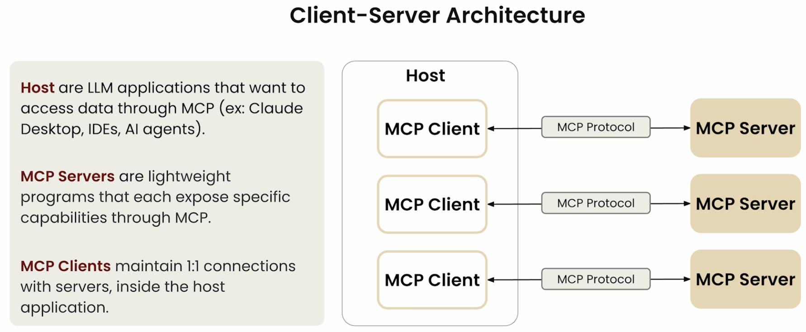

### How does it work?
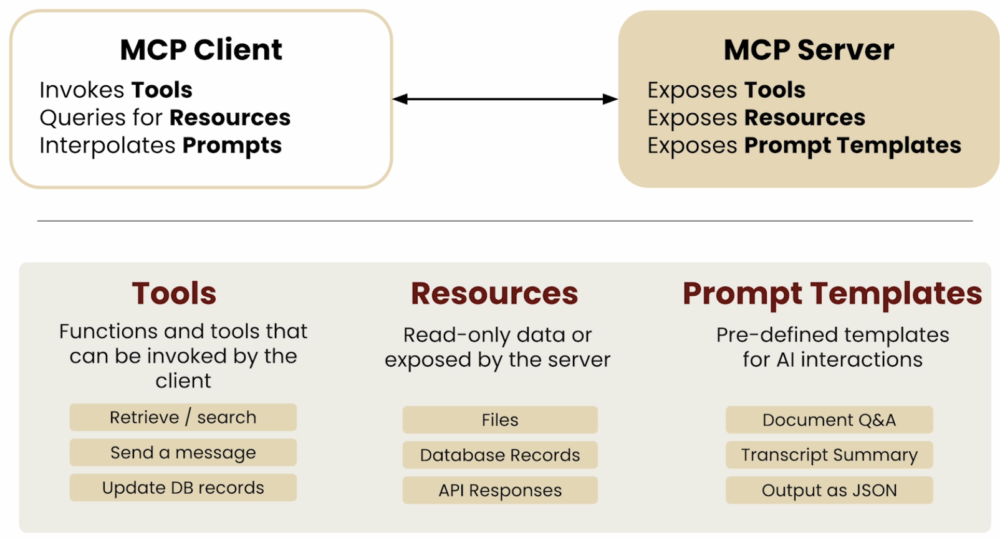

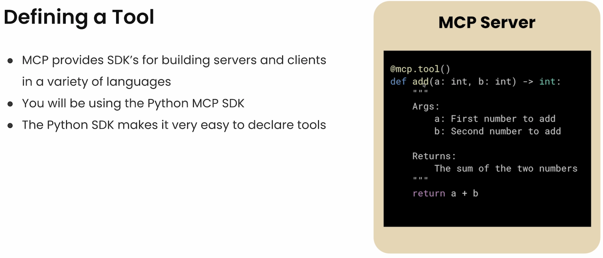

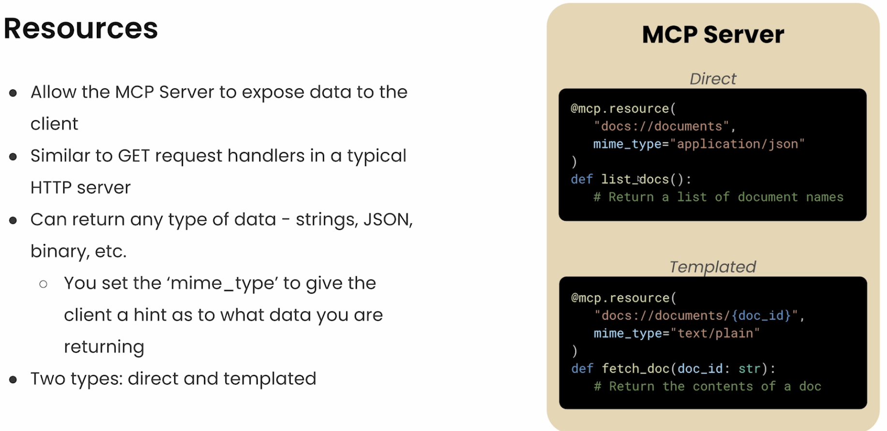

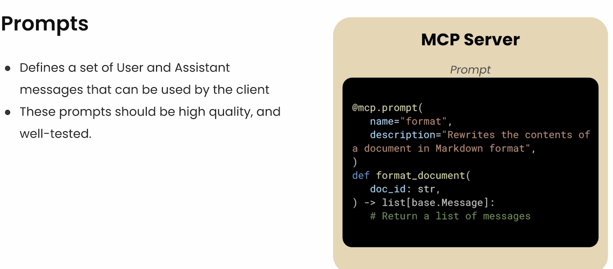

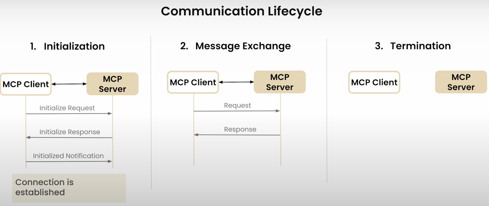

#### The transport 
The transport handles the mechanics of how messages are sent back and forth between the client and server. It depends on how you are running your application, and you will choose one of these different transports. For servers running locally, we are going to be using standard IO or stdin/stdout. For servers running remotely, we are going to be using HTTP and server-side events or using the Streamable HTTP transport. As of this time of recording, Sreamable HTTP is not supported yet across all software development kits (SDKs).

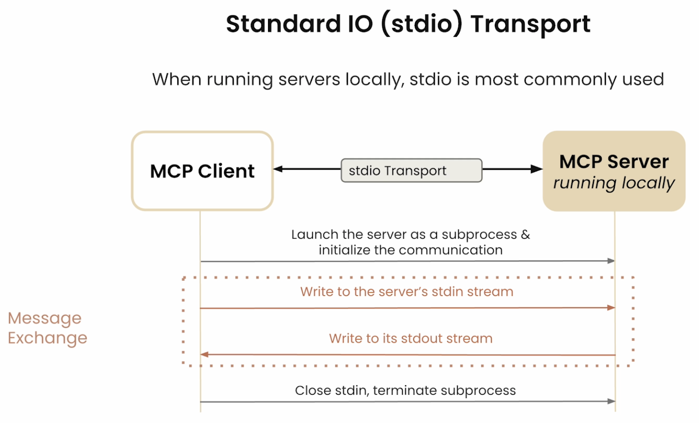

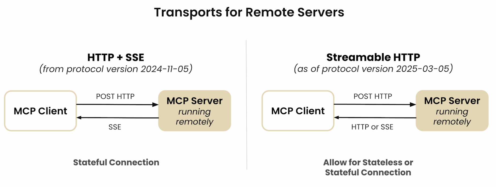

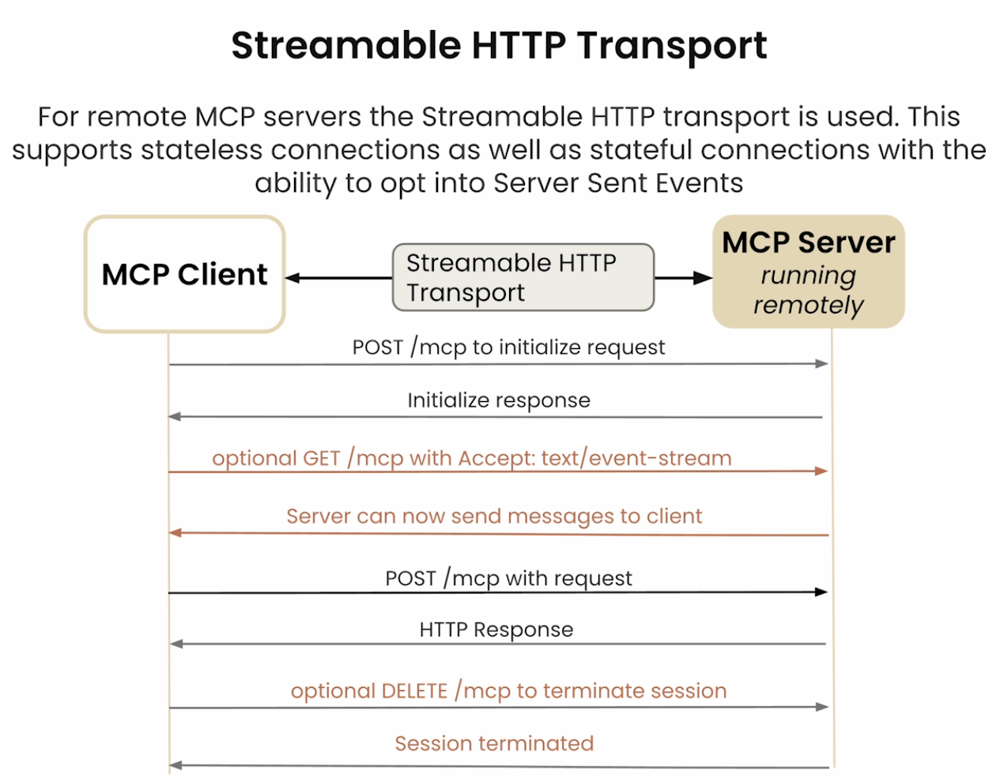

Streamable HTTP 指的是 HTTP 协议支持逐步传输数据流，而不是一次性返回完整的响应。这在传输大数据、实时内容（如视频、聊天、日志）时尤其重要。客户端可以**边接收边处理**数据（如使用 `fetch` 的 `ReadableStream`），降低延迟：不必等到整个资源生成完再返回。

Stateless Connection 是指每个 HTTP 请求都是**独立的**，服务器不会记住客户端的任何历史状态。客户端发送多个请求时，服务器**不会自动记住**登录状态或用户上下文。
Stateful connection 是指服务器在客户端和服务器之间保持连接状态或会话信息，使多个请求之间可以共享上下文。
服务器能够记住客户端的前一个请求或上下文（如登录状态、购物车信息）。

| 特性        | Stateless（无状态） | Stateful（有状态）                |
| --------- | -------------- | ---------------------------- |
| 请求之间是否独立  | 是              | 否                            |
| 服务器是否记住状态 | 否              | 是                            |
| 扩展性       | 高（易于负载均衡）      | 较低（需同步状态）                    |
| 常见协议/技术   | HTTP, REST     | WebSocket, FTP, Telnet, SOAP |
| 应用示例      | API 接口、CDN     | 登录系统、WebSocket 聊天            |

* **Stateful**：用户登录后加入商品，服务器记住用户的购物车状态。
  
* **Stateless**：每次请求都需带上购物车内容（前端负责维护状态）。

# [(20250710) ACP: Agent Communication Protocol](https://www.deeplearning.ai/short-courses/acp-agent-communication-protocol/)

ACP (Agent Communication Protocol) 是一个开源协议，旨在标准化 AI 代理之间的通信方式。它允许不同的 AI 代理在同一系统中进行交互和协作。ACP 的设计目标是使 AI 代理能够更容易地共享信息、协调任务和执行复杂操作。

To build the team of agents that communicate and collaborate through ACP, you can host an agent on an ACP server, which will receive REST requests from an ACP client and forward those requests to the agent to execute the task.
The ACP client can be an agent or any other process, discovers the agents using the endpoints of the ACP servers and then initiates requests.

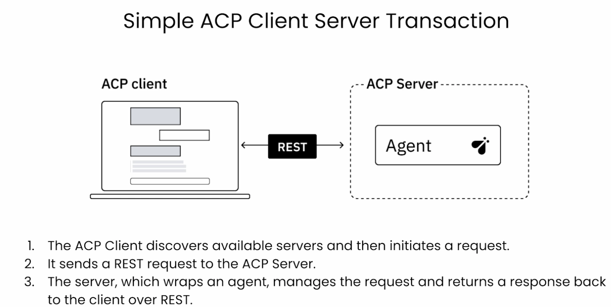

ACP is based on a client-server architecture that uses a simple REST interface. The client is responsible fore initiating communication and ther server responds to the request. In ACP, both the client and server can be an AI agent, a human, or a microservice. The client will always initiate the request and the server will always respond to the request. 

In the following diagram, a client make a request to an ACP server over REST, which wraps an agent. The agent determines it needs to invoke a tool. So it sends a request to an avaible MCP server to execute the tool call and return the result. Once the ACP agent completes its run and returns the output to the ACP client.

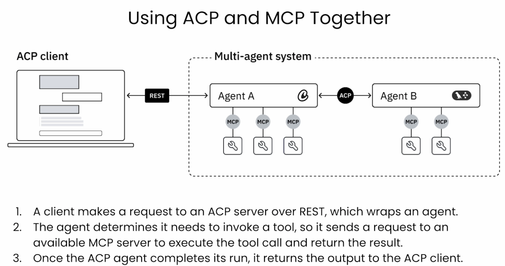

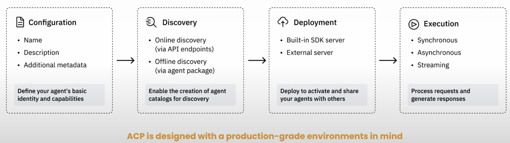

- Agent detail is where you define your agent's basic identity and capabilities. You can specify the agent name, provide description, and add optional information.

- The agent detail enables the agent to be discoverable and usable within the ACP ecosystem. It allows other agents or clients to understand what the agent does and how it can be used. Online discovery occurs when ACP servers are already running and can be accessed through their API endpoints. Offline discovery like at the agent catalog or registry, where agent detail is embedded in the agent package, allowing an user or system to discover the agent without requiring them to be running first. This enables the creation of an agent catalog or directories, where agents can be browsed, selected, and then spawned when needed. 
  
- To activate your agent and enable its online discovery, you need to deploy it.
  
- Once the agent is activated, it's ready for execution, meaning it can actively process requests and generate a response. ACP offers three excution modes: synchronous, asynchronous and streaming. In synchronous mode, the client sends a request and waits for the server to respond with the result. In asynchronous mode, the client sends a request and continues processing without waiting for the server's response. The server will send the response later when it's ready. In streaming mode, the client can receive real-time updates as the agent generated results.
  
### The difference between ACP, MCP and A2A

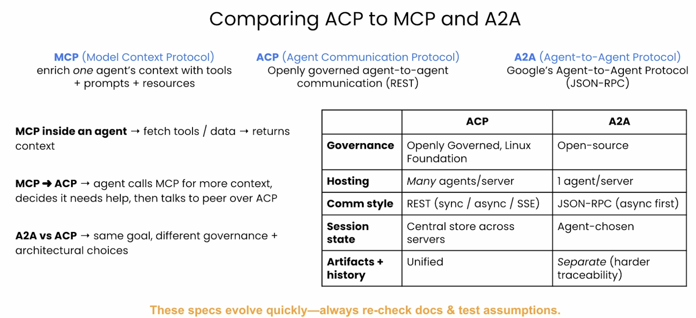

MCP（Model Context Protocol）是用于丰富一个模型上下文的协议，提供工具、资源和提示等。MCP 与 ACP（Agent Communication Protocol）是兼容并互补的：例如一个智能体使用 MCP 发起工具调用，获取上下文后，如果需要与其他智能体交互，则通过 ACP 完成。
MCP 与 ACP 是解耦的，因为 MCP 并不是为智能体之间的通信设计的。当前 MCP 协议不适用于智能体间任务传递或点对点协作。
在共享内存方面，MCP 支持会话管理，可以在请求之间维护客户端信息，但并不处理实际的状态数据。
相比之下，ACP SDK 提供集中式的运行与会话存储，可跨多个服务器保持信息一致。在消息结构上，MCP 不关注消息格式；而 ACP 支持多模态内容，适合自然语言等复杂交互。

Google 的 A2A（Agent-to-Agent）协议 是在 ACP（Agent Communication Protocol） 之后推出的，目标是标准化智能体之间的通信。
两者都支持多智能体系统，但在理念和治理方式上存在差异。

| 特性    | ACP（Agent Communication Protocol） | A2A（Agent-to-Agent Protocol） |
| ----- | --------------------------------- | ---------------------------- |
| 目标    | 标准化智能体通信，支持多智能体系统                 | 同样目标，Google 推出               |
| 开源治理  | 开源，由 Linux Foundation 管理          | 开源                  |
| 部署方式  | 多 Agent 可共用一个服务器                  | 每个 Agent 要单独运行在服务器           |
| 架构风格  | REST 架构，标准化、可扩展                   | JSON-RPC，复杂度更高               |
| 状态处理  | 支持同步、异步、流式模式，使用 SSE               | 动态决定交互方式，支持有/无状态             |
| 可观察性  | 更强（事件顺序易追踪）                       | 较弱（输出与历史分离）                  |
| 客户端要求 | 简化、模式清晰                           | 需灵活处理多种模式                    |
| 适用场景  | 通用、标准化平台                          | 更灵活但运维复杂的系统                  |

ACP 更适合标准化、多智能体集中管理的场景；A2A 更适合灵活、自主、分布式的多智能体系统，但代价是部署和调试更复杂。

# [(20250711) Function-Calling and Data Extraction with LLMs](https://www.deeplearning.ai/short-courses/function-calling-and-data-extraction-with-llms/)

在支持函数调用功能的大语言模型（LLM）中，用户的提示（prompt）可以包含**函数的描述信息**，让模型知道它有哪些“工具”可以调用，以及如何使用它们。这些描述通常包括：

* 函数的功能说明（它是干什么的）
  
* 使用场景（什么时候使用）
  
* 所需参数（参数名、数据类型、含义）

### 函数调用的流程

1. **提示中提供函数说明**。用户或开发者在 prompt 中提供多个可调用函数的说明，LLM 会理解每个函数的作用。

2. **模型分析用户查询**。当用户提出问题时，LLM 会判断是否有某个函数可以解决这个问题。

3. **生成调用参数**。如果需要调用函数，LLM 会从用户的查询中提取参数，自动生成一个调用该函数所需的参数字符串。注意：LLMs 只产生字符串 string，比如图中的 'getTemp(city_name = "New York")'，而不是直接执行函数。

4. **返回调用格式**。LLM 本身并不直接执行函数。它只是**返回一个字符串**（通常是函数名 + 参数）表示“应该调用这个函数”。

5. **外部系统执行函数**。接收到这个“调用建议”后，外部的应用系统（如聊天机器人平台）负责真正执行这个函数，并将结果返回给 LLM 或用户。

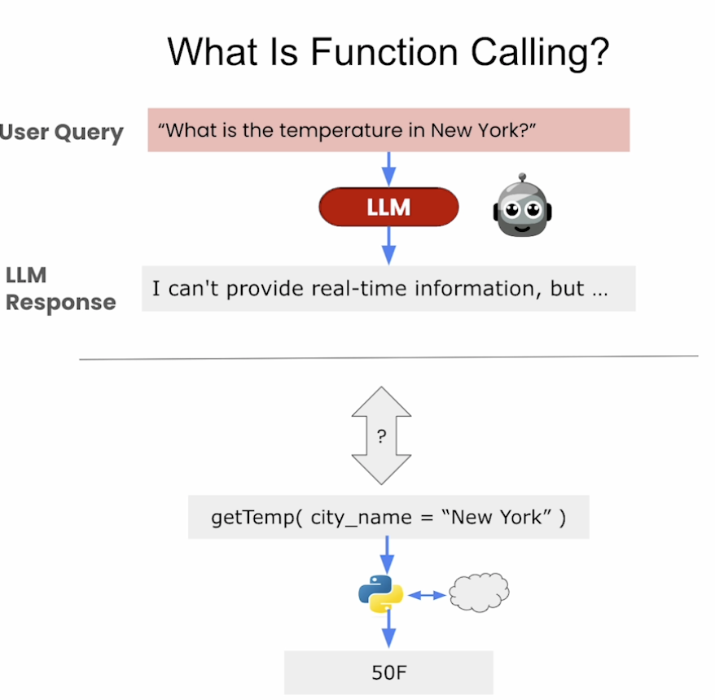

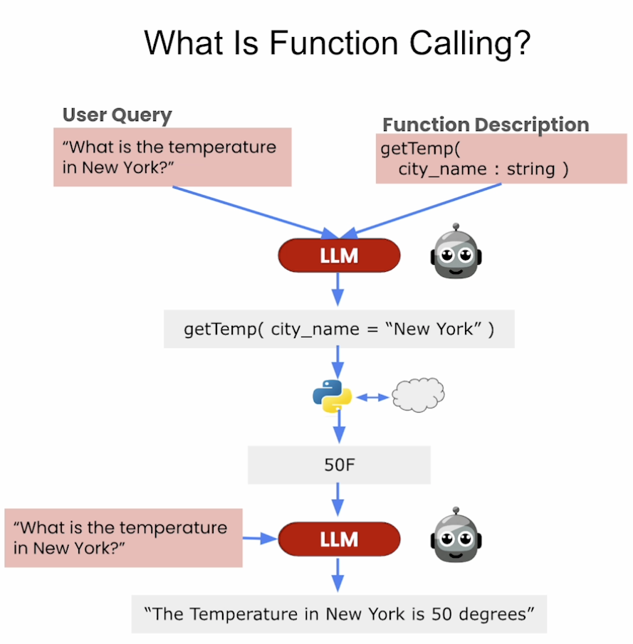

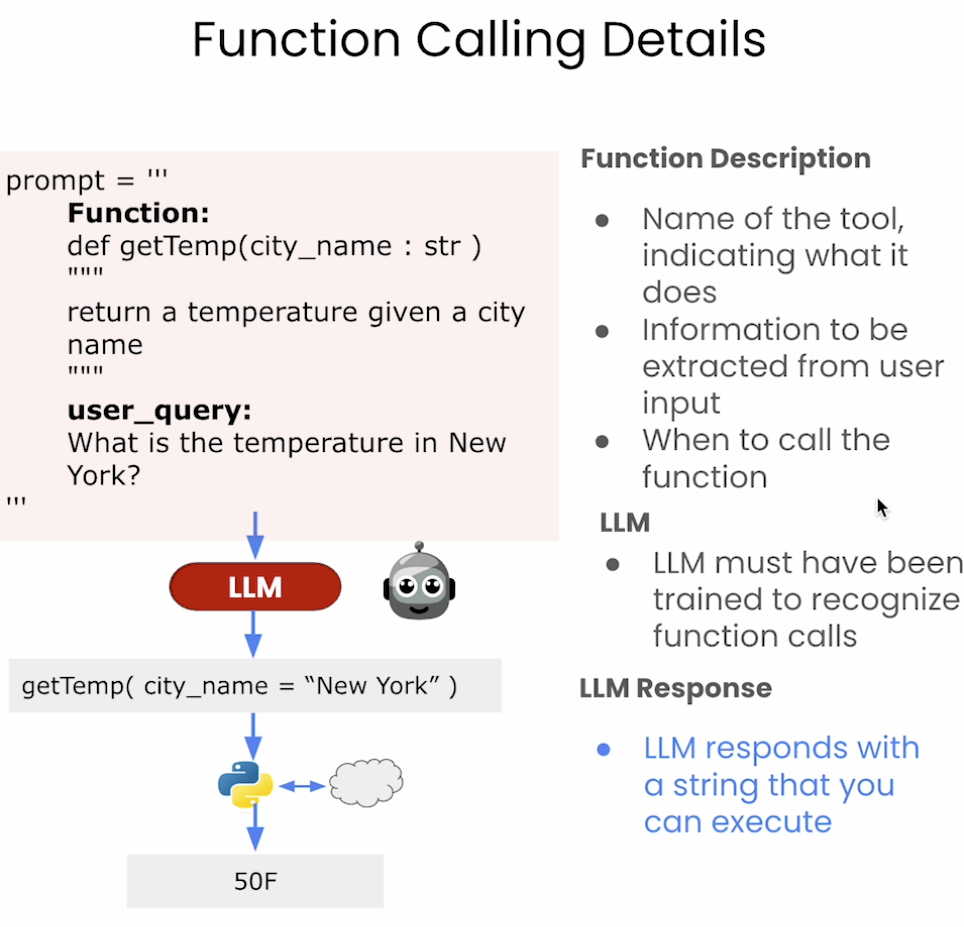


### function calling 和 tools 的区别
- Function calling is the name given to this LLM capability of forming a string containing a function call or structure needed to make a function call.
  
- Tools are the actual functions that can be called by the LLM. They are defined by the user or developer and can be used to perform specific tasks.

### 例子
一般直接调用函数：
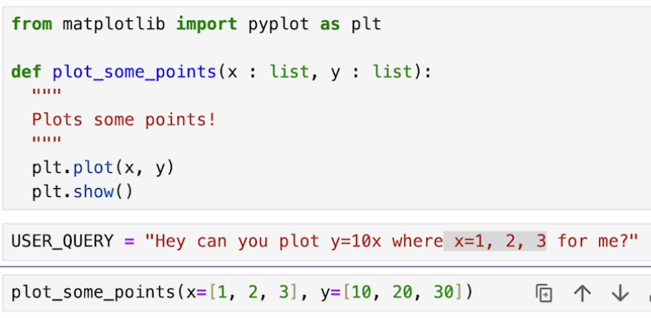

需要根据函数计算出相应的y值。

让LLM通过function calling执行：
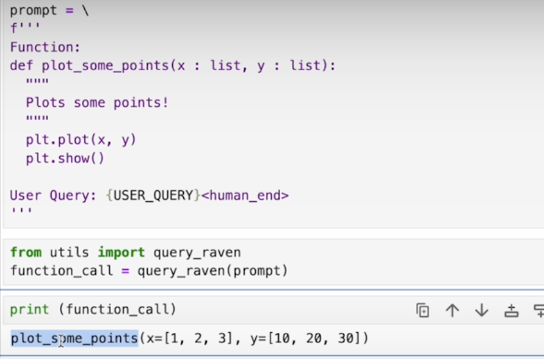

注意 “function call” 只是生成一个字符串，表示应该调用哪个函数以及传入什么参数。执行 “exec(function call)” 则会真正执行这个函数，进行绘图。

openai 示例：
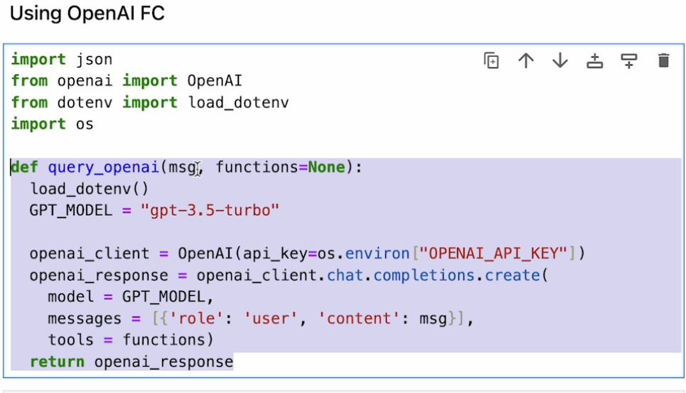
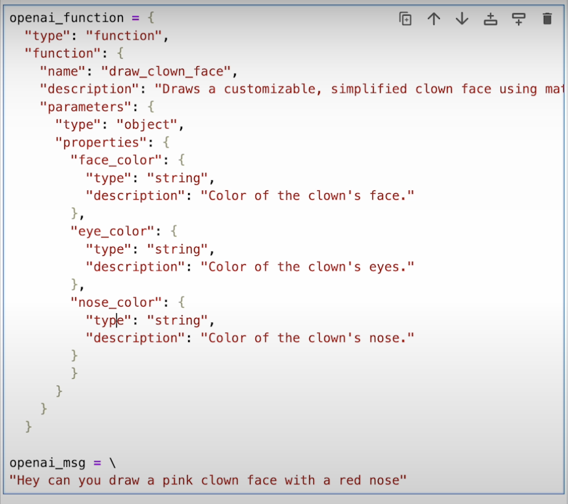
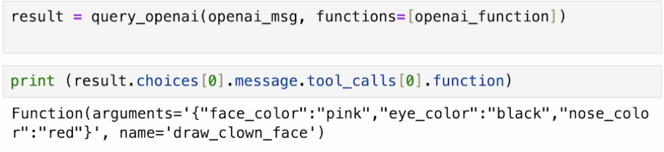

### Multiple functions
可以定义多个函数，比如
```python
Prompt = """
def f1(): ...
def f2(): ...
...
def fn(): ...
"""
```
LLM 可以使用其中一个函数或者它们的任意组合、嵌套。

### 使用外部资源

```python
import requests
def give_joke(category : str):
    """
    Joke categories. Supports: Any, Misc, Programming, Pun, Spooky, Christmas.
    """

    url = f"https://v2.jokeapi.dev/joke/{category}?safe-mode&type=twopart"
    response = requests.get(url)
    print(response.json()["setup"])
    print(response.json()["delivery"])

USER_QUERY = "Hey! Can you get me a joke for this december?"

raven_functions = \
f'''
def give_joke(category : str):
    """
    Joke categories. Supports: Any, Misc, Programming, Dark, Pun, Spooky, Christmas.
    """

User Query: {USER_QUERY}<human_end>
'''
call = query_raven(raven_functions)
```

### 使用函数调用提取结构化信息
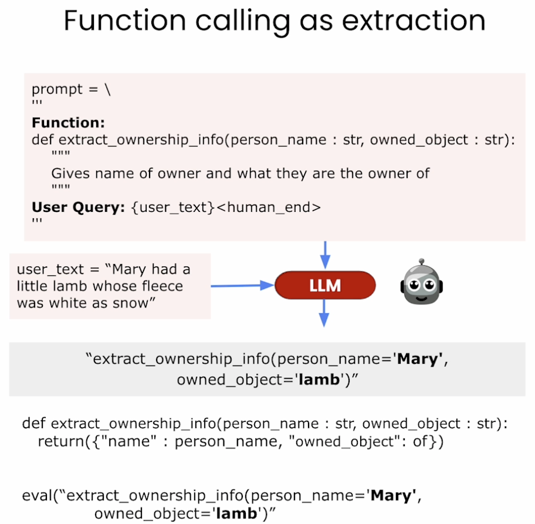

# [Knowledge Graphs for RAG](https://www.deeplearning.ai/short-courses/knowledge-graphs-rag/)


# [Building and Evaluating Advanced RAG Applications](https://www.deeplearning.ai/short-courses/building-evaluating-advanced-rag/)


# [(20250711) Evaluating AI Agents](https://www.deeplearning.ai/short-courses/evaluating-ai-agents/)


# [Long-Term Agentic Memory with LangGraph](https://www.deeplearning.ai/short-courses/long-term-agentic-memory-with-langgraph/)


# [Retrieval Optimization: From Tokenization to Vector Quantization](https://www.deeplearning.ai/short-courses/retrieval-optimization-from-tokenization-to-vector-quantization/)


# [Multi AI Agent Systems with crewAI](https://www.deeplearning.ai/short-courses/multi-ai-agent-systems-with-crewai/)


