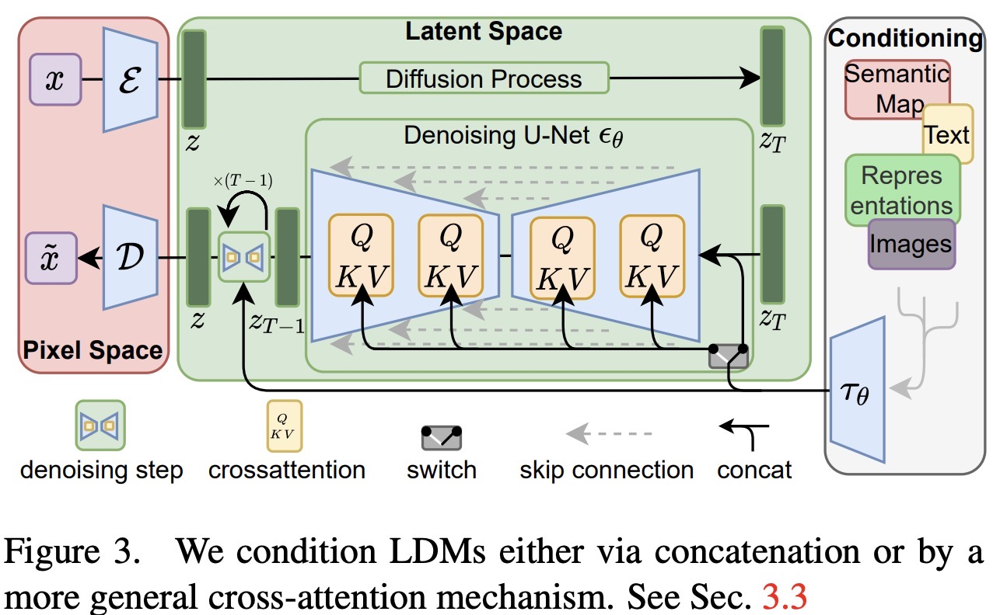
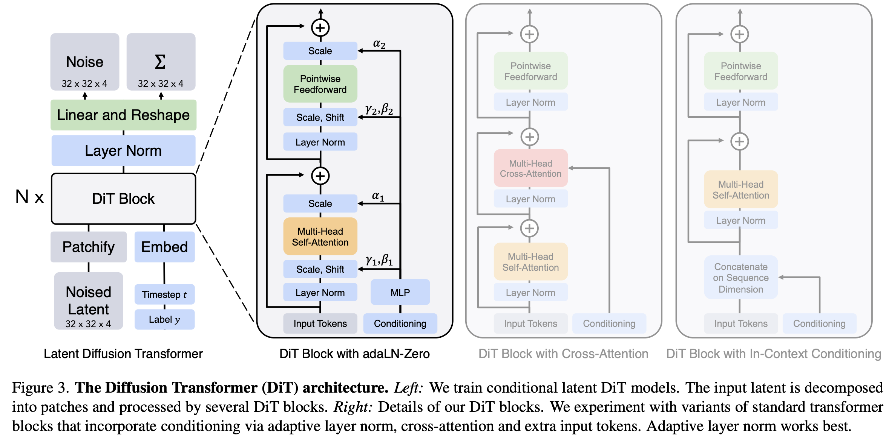
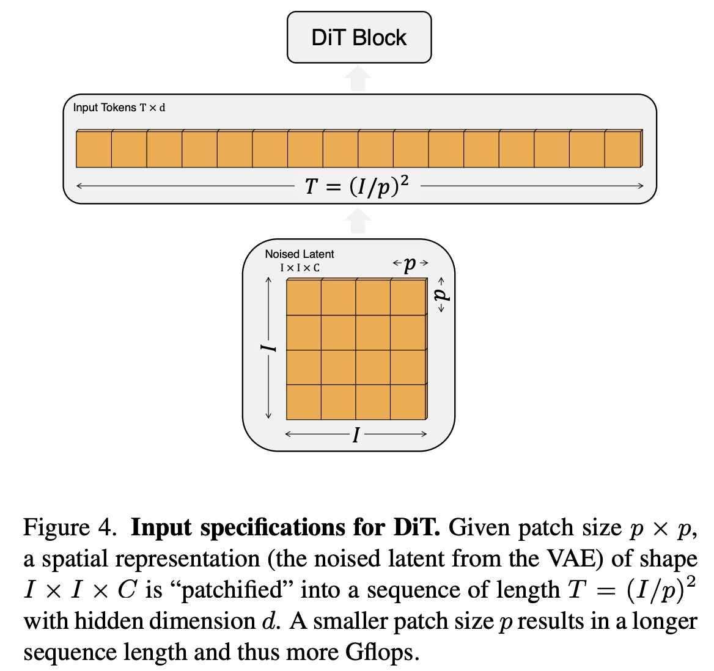

# Latent Diffusion Models
[Official PyTorch Implementation](https://github.com/CompVis/latent-diffusion?tab=readme-ov-file)
LDM 的目标是在不降低生成模型性能的前提下，通过降低训练和采样的计算复杂度来提高 diffusion models 的适用性。具体来说，直接在像素空间 (pixel space)进行扩散过程（如标准扩散模型）需要大量计算资源，而 LDM 通过在一个更低维的潜在表示空间中进行扩散，大幅降低计算需求。论文提到基于似然的生成模型，比如 diffusion models 在学习阶段可以大概分成两个阶段。首先，在阶段 1 的感知压缩（Perceptual Compression）， 模型主要对图像进行感知上的压缩，去掉一些高频细节，即图像中的微笑结构或者纹理信息，比如图片中物体的大致轮廓或颜色等。这些高频细节对人类的感知影响较小，但是计算复杂度高。其次，在阶段 2 的语义压缩（Semantic Compression）环节，模型真正开始学习数据的语义和概念结构，而不仅仅是像素级的信息。对于高分辨率图形，直接在像素空间训练扩散模型是非常昂贵的。为解决这个问题，作者希望找到一个“感知上等效”（Perceptually Equivalent），但计算上更高效的潜在空间（Latent Space）。 在这个更合适的空间中，扩散模型可以更高效地训练，同时保持生成图像的质量。这就是LDM的 motivation，其核心思想可以总结为：
  
- **第一步：训练自动编码器（Autoencoder）**。学习一个低维的、高效的潜在表示（latent representation），在此过程中去除不必要的高频细节，但保留感知上的等效性。也就是说，虽然数据被压缩到更小的维度，但它在视觉上仍然与原始数据相似，不会丢失关键信息。  

- **第二步：在潜在空间中训练扩散模型**。不同于直接在像素空间训练扩散模型，而是在一个感知等效的潜在空间中训练扩散模型，使其学习语义结构，从而进行高效的高分辨率图像合成。  

## 图像感知压缩
对输入的 RGB 图像 $x \in \mathbb{R}^{H \times W \times 3}$，通过编码器 $\Epsilon$ 将其编码到潜在空间 $z = \Epsilon(x)$，$z \in \mathbb{R}^{h \times w \times c}$。解码器从潜在空间重构 image，即 $\tilde{x} = D(z) = D(\Epsilon(x))$。编码器会通过下采样来降低图像分辨率，即$f = \frac{H}{h} = \frac{W}{w}$，$f$是下采样因子，取值为 $f = 2^m,（ m \in \mathbb{N} ）$。 这种方法可以降低计算成本，同时保留足够的感知信息。同时可以看出，编码后仍然保留图像的 2D 结构，避免了 1D 序列化问题，从而保留了更多的空间结构信息。

## Latent Diffusion Models

通过训练感知压缩模型（由编码器 $E$ 和解码器 $D$ 组成），LDM 可以将原始图像转换为低维潜在表示，其中高频的、不可感知的细节被抽象化。  与高维像素空间相比，该潜在空间关注数据的关键语义信息，忽略无关的高频细节， 计算效率更高，可以减少计算资源消耗，更适合基于概率的生成模型。

LDM 在潜在空间中仍然保留图像的空间结构，采用2D 卷积构建 UNet，而不是完全基于 Transformer 的方法。目标函数更加聚焦于感知最相关的信息，具体形式为：
$$
L_{LDM} = \mathbb{E}_{E(x), \epsilon \sim N(0,1), t} [|| \epsilon - \epsilon_{\theta}(z_t, t)||^2_2].
$$

在训练阶段，由于前向过程是固定的，$z_t$ 可以高效地从编码器 $E$ 中获得，避免额外计算开销。 在推理（采样）阶段，从 $ p(z) $采样一个潜在表示 $ z $（扩散过程生成的样本），然后只需单次前向传播通过解码器 $ D $ 即可将 $ z $ 解码回完整图像。  

## Conditional Image Generation with LDMs

扩散模型可以建模条件概率分布 $ p(z | y) $ ，其中 $y$ 代表条件输入，如文本。类似，也可以通过条件去噪自编码器 $\epsilon_\theta(z_t, t, y)$ 使得 LDM 具备可控的合成能力。  

为了使扩散模型成为更灵活的条件图像生成器，LDM 在其 U-Net 结构中加入了Cross-Attention。为了预处理不同模态（如语言提示），LDM 采用领域特定编码器（Domain-Specific Encoder）$\tau_{\theta}$  映射 $  y$  到中间表示：  
$
\tau_\theta(y) \in \mathbb{R}^{M \times d_\tau}
$。 
然后，在 U-Net 的中间层通过交叉注意力层进行融合，其公式如下：  
$$
\text{Attention}(Q, K, V) = \text{softmax} (\frac{Q K^T}{\sqrt{d}}) \cdot V,
$$  
其中，$Q = W_Q^{(i)} \cdot \phi_i(z_t) $，$K = W_K^{(i)} \cdot \tau_{\theta(y)} $，$ V = W_V^{(i)} \cdot \tau_{\theta(y)}$。$\phi_i(z_t) $ 是U-Net 中的中间表示，经过 Flattened 后得到 $\phi_{i}(z_t) \in \mathbb{R}^{N \times d}$。

条件 LDM的目标函数如下：  
$$
\mathcal{L}_{\text{LDM}} = \mathbb{E}_{E(x), y, \epsilon \sim \mathcal{N}(0,1), t} [ || \epsilon - \epsilon_{\theta} (z_t, t, \tau_{\theta(y)}) ||_2^2 ],
$$  
其中，$\tau_{\theta}$ 和 $\epsilon_{\theta} $ 通过优化该目标函数得到，$\tau_{\theta}(y)$ 是条件输入 $y $ 的编码输出。 

# Scalable Diffusion Models with Transformers (DiT)
[Official PyTorch Implementation](https://github.com/facebookresearch/DiT/tree/main?tab=readme-ov-file)

## Diffusion formulation (DDPM)
高斯扩散模型（Gaussian Diffusion Models）假设前向噪声过程逐步向真实数据 $ x_0 $ 添加噪声，该过程定义如下：  
$$
q(x_t | x_0) = \mathcal{N} ( x_t; \sqrt{\bar{\alpha}_t} x_0, (1 - \bar{\alpha}_t)I ),
$$
其中，$\bar{\alpha}_t$ 是预设的超参数。利用重参数化技巧,可以对 $ x_t $ 进行采样：  
$$
x_t = \sqrt{\bar{\alpha}_t} x_0 + \sqrt{1 - \bar{\alpha}_t} \epsilon_t, \quad \epsilon_t \sim \mathcal{N}(0, I).
$$
扩散模型的目标是学习逆过程，即还原前向过程导致的破坏：  
$$
p_\theta (x_{t-1} | x_t) = \mathcal{N} ( \mu_\theta (x_t), \Sigma_\theta (x_t) ),
$$
其中，神经网络用于预测 $ p_\theta $ 的均值和协方差。模型的训练基于变分下界（Variational Lower Bound, VLB）来优化数据的对数似然：  
$$
L(\theta) = -p(x_0 | x_1) + \sum_t D_{KL} ( q^*(x_{t-1} | x_t, x_0) \,\big\|\, p_\theta (x_{t-1} | x_t) ),
$$
其中，$ D_{KL} $ 表示 **Kullback-Leibler 散度**，用于衡量两个分布之间的差异。  
由于 $ q^* $ 和 $ p_\theta $ 都是高斯分布，该散度可以通过均值和协方差计算。

为了优化该目标，我们可以将均值 $ \mu_\theta $ 重新参数化为 **噪声预测网络** $ \epsilon_\theta $，并采用均方误差损失进行训练：  
$$
L_{\text{simple}} (\theta) = \| \epsilon_\theta (x_t) - \epsilon_t \|^2_2,
$$
但如果要训练逆过程的协方差 $ \Sigma_\theta $，则需要优化完整的 $ D_{KL} $ 项。 作者遵循 **Nichol 和 Dhariwal** 的方法：首先用 $ L_{\text{simple}} $ 训练 $ \epsilon_\theta $，然后用完整的 $ L $ 训练 $ \Sigma_\theta $。

在训练完成后，可以通过以下步骤生成新的图像：设定 **初始噪声** $ x_{T} \sim \mathcal{N}(0, I) $，然后依次从后向分布中采样：
$
x_{t-1} \sim p_\theta (x_{t-1} | x_t)
$。
这个过程通过 **重参数化技巧** 实现，最终得到无噪声的高质量图像。

## Diffusion Transformer Design Space

### Patchify
DiT 的输入是一个空间表示 $ z $（对于 $ 256 \times 256 \times 3 $ 的图像，$ z $ 的形状为 $ 32 \times 32 \times 4 $）。DiT 的第一层是 **"Patchify"**，其作用是将空间输入转换为一个长度为 $ T $ 的序列，每个 token 具有维度 $ d $，具体过程如下：  

1. Patchify 过程。通过 linear embedding 将输入的每个 patch 转换为一个 token。patch size 超参数 $ p $ 控制每个 patch 的大小。  

2. 位置编码。Patchify 之后，为所有输入 token 添加位置编码。  

生成的 token 数量 $ T $ 由patch size $ p $ 决定，$ T = \frac{H}{p} \times \frac{W}{p}$。

### DiT block design
在 Patchify 之后，输入 tokens 会经过一系列 Transformer 块处理。除了噪声图像输入外，扩散模型有时还会处理额外的条件信息，如**噪声时间步 $t$、类别标签 $c$、自然语言描述等。DiT 主要探索了四种不同的 Transformer 块变体。具体来说，

- In-context conditioning。直接将时间步 $t $ 和类别标签 $c $ 的向量嵌入作为额外的 token 添加到输入序列中，类似于 ViT 中的 **CLS token** 机制。 

- Cross-attention block。将时间步 $t $ 和类别标签 $c $ 的嵌入向量拼接成一个长度为 2 的独立序列，与图像 token 序列分开处理。修改 Transformer 块，在 self-attention 块之后，额外添加 cross-attention 层。  

- Adaptive Layer Norm, adaLN 块。传统的 LayerNorm 直接学习缩放和偏移参数 $\gamma $ 和 $\beta $，而 adaLN 通过回归计算这些参数。$\gamma, \beta = \text{MLP}(t + c)$，其中，$MLP$ 以时间步 $t $ 和类别标签 $c $ 的嵌入和为输入，回归生成归一化参数。  

- adaLN-Zero 块。在 adaLN 方案的基础上，进一步引入通道维度缩放参数 $\alpha $，并在残差连接之前应用 $\alpha = \text{MLP}(t + c)$。采用零初始化策略，MLP 在初始状态下输出全零向量 $\alpha = 0 $，使得整个 Transformer 块的初始状态等价于恒等映射（identity function）。

### Model size
在 DiT 中，模型由 $ N $ 个 DiT blocks 组成，每个块在隐藏维度大小 $ d $ 上进行计算。DiT 采用与 ViT 类似的 Transformer 配置，即同时缩放 Transformer 块数量 $ N $，隐藏维度大小 $ d $，注意力头数（Attention Heads）。

DiT 提供了四种不同规模的模型配置，分别为：DiT-S（Small），DiT-B（Base），DiT-L（Large），DiT-XL（Extra Large）。 

### Transformer decoder
在 最后一个 DiT 块之后，需要将图像 token 序列解码成输出噪声预测和输出对角协方差预测，以便在扩散模型中还原图像。  

# Exploring Flow and Diffusion-based Generative Models with Scalable Interpolant Transformers (SiT)
[Official PyTorch Implementation](https://github.com/willisma/SiT?tab=readme-ov-file)

[Blog](https://scalable-interpolant.github.io/)

# Representation Alignment for Generation: Training Diffusion Transformers Is Easier Than You Think
[Official PyTorch Implementation](https://github.com/sihyun-yu/REPA)

## ABSTRACT
最近的研究表明，扩散模型中的去噪过程能够在模型内部引入有意义的表征（representations）。尽管这些表征的质量仍然不如最近的自监督学习方法中学到的表征，作者认为，训练大规模扩散模型用于生成的主要瓶颈之一在于如何有效地学习这些表征。此外，训练可以通过引入高质量的外部视觉表征来简化，而不是仅仅依赖扩散模型独立学习这些表征。为此，作者提出了一种简单的正则化方法——表征对齐（REPresentation Alignment，REPA）。该方法将去噪网络中 noisy input hidden states的projections与通过外部预训练视觉编码器获得的 clean image 表征进行对齐。实验结果表明，这种策略在训练效率和生成质量方面都带来了显著的改进，特别是在 DiTs和SiTs上。例如，该方法可以将SiT训练速度提升超过17.5倍，在不到40万步的训练中，达到与一个训练7M步的SiT-XL模型相当的性能（无需 classifier-free guidance）。在最终生成质量方面，该方法通过使用  classifier-free guidance with the guidance interval，达到了FID=1.42的最新结果。

## DESCRIPTIONS FOR DIFFUSION-BASED MODELS
### DENOISING DIFFUSION PROBABILISTIC MODELS (DDPM)
扩散模型通过学习从高斯分布 $N(0, I)$ 到目标分布 $p(x)$ 的逐步去噪过程来建模目标分布 $p(x)$。形式上，扩散模型学习一个反向过程 $p(x_{t-1}|x_t)$，该过程是预定义的前向过程 $q(x_t|x_0)$ 的逆过程，前向过程从 $p(x)$ 开始，逐渐添加高斯噪声，其中加噪步骤 $1 \leq t \leq T$，$T > 0$ 是固定的。

对于给定的 clean data $x_0 \sim p(x)$，前向过程 $q(x_t|x_{t-1})$ 可以形式化定义为：
$$
q(x_t|x_{t-1}) := N(x_t; \sqrt{1 - \beta_t} x_0, \beta_t^2 I),
$$
其中，$\beta_t \in (0, 1)$ 是预定义的超参数。

在 DDPM 中，反向过程 $p(x_{t-1}|x_t)$ 被形式化为：
$$
p(x_{t-1}|x_t) := N (x_{t-1}; \frac{1}{\sqrt{\alpha_t}} (x_t - \frac{\sigma_t^2}{\sqrt{t(1 - \bar{\alpha}_t)}} \epsilon_\theta(x_t, t)), \Sigma_\theta(x_t, t))
$$
其中 $\alpha_t = 1 - \beta_t$，$\bar{\alpha}_t := \prod_{i=1}^t \alpha_i$。那么，$\epsilon_\theta(x_t, t)$ 可以通过简单的去噪自编码器目标进行训练：
$$
L_{\text{simple}} := \mathbb{E}_{x^*, \epsilon, t}[ \| \epsilon - \epsilon_\theta(x_t, t) \|^2_2 ]
$$

对于 $\Sigma_\theta(x_t, t)$，Ho 等（2020）表示可以将其简单地定义为 $\sigma_t^2 I$，其中 $\beta_t = \sigma_t^2$。之后，Nichol 和 Dhariwal（2021）的工作表示如果联合学习 $\Sigma_\theta(x_t, t)$ 和 $\epsilon_\theta(x_t, t)$，效果会更好。他们通过以下目标在 dimension-wise manner 上进行学习：
$$
L_{\text{vlb}} := \exp(v \log \beta_t + (1 - v) \log \tilde{\beta}_t),
$$
其中，$v$ 表示模型输出的每个维度的分量，$\tilde{\beta}_t = \frac{1 - \bar{\alpha}_{t-1}}{1 - \bar{\alpha}_t} \beta_t$。

当 $ T $ 足够大且 $\beta_t$ 的 scheduling 合适时，分布 $ p(x_T) $ 会变得几乎是一个各向同性的高斯分布。因此，可以从一个随机噪声开始，通过执行迭代反向过程 $ p(x_{t-1}|x_t) $，逐步逼近 clean data $ x_0 $。

### STOCHASTIC INTERPOLANTS
与 DDPM 不同，基于 flow 的模型处理的是一个连续时间依赖的过程，其中数据  $x_* \sim p(x)$ 和高斯噪声 $\epsilon \sim N(0, I)$ 定义在 $t \in [0, 1]$上：
$$
x_t = \alpha_t x_0 + \sigma_t \epsilon, \quad \alpha_0 = \sigma_1 = 1, \quad \alpha_1 = \sigma_0 = 0,
$$
其中，$\alpha_t$ 和 $\sigma_t$ 分别是关于 $t$ 的递减和递增函数。存在一个概率流常微分方程（probability flow ordinary differential equation, PF ODE），其速度场 (velocity field) 为：
$$
\dot{x}_t = v(x_t, t).
$$

该 ODE 的 solution 在时间 $t$ 时的分布等于边际分布 $p_t(x)$。

速度 $v(x, t)$表示为以下两个条件期望的和：
$$
v(x, t) = \mathbb{E}[\dot{x}_t | x_t = x] = \dot{\alpha}_t \mathbb{E}[x_* | x_t = x] + \dot{\sigma}_t \mathbb{E}[\epsilon | x_t = x]
$$
可以通过最小化以下训练目标来用模型 $v_\theta(x_t, t)$近似该速度：
$$
L_{\text{velocity}}(\theta) := \mathbb{E}_{x^*, \epsilon, t}[ \left\| v_\theta(x_t, t) - \dot{\alpha}_t x^* - \dot{\sigma}_t \epsilon \right\|^2_2 ]
$$
注意，这也对应于以下反向随机微分方程（SDE）：
$$
dx_t = v(x_t, t)dt - \frac{1}{2} w_t s(x_t, t) dt + \sqrt{w_t} dw_t
$$
其中，得分函数 $s(x_t, t)$ 可以变为条件期望：
$$
s(x_t, t) = -\frac{1}{\sigma_t} \mathbb{E}[\epsilon | x_t = x]
$$
与速度 $v$ 类似，得分函数 $s$ 可以通过模型 $s_\theta(x, t)$ 近似，并采用以下目标：
$$
L_{\text{score}}(\theta) := \mathbb{E}_{x^*, \epsilon, t}[ \| \sigma_t s_\theta(x_t, t) + \epsilon \|^2_2 ]
$$
这里，由于得分函数 $s(x, t)$ 可以通过速度 $v(x, t)$ 在 $t > 0$ 时直接计算为：
$$
s(x, t) = \frac{1}{\sigma_t} ( \alpha_t v(x, t) - \dot{\alpha}_t x ) \bigg/ ( \dot{\alpha}_t \sigma_t - \alpha_t \dot{\sigma}_t ).
$$
因此，仅需要估计这两个向量中的一个即可。

随机插值（Albergo 等，2023）表明，任何满足以下三个条件的 $\alpha_t$ 和 $\sigma_t$ 都是可行的：

1. $\alpha_t^2 + \sigma_t^2 > 0$, 对于所有 $t \in [0, 1]$.

2. $\alpha_t$ 和 $\sigma_t$ 是可微的，对于所有 $t \in [0, 1]$.

3. $\alpha_1 = \sigma_0 = 0$，$\alpha_0 = \sigma_1 = 1$.

这些条件会导致一个没有偏差的过程，可以在 $x_0$ 和 $\epsilon$ 之间插值。因此，可以通过在训练和推理过程中定义简单的插值函数，例如线性插值，其中 $\alpha_t = 1 - t$ 和 $\sigma_t = t$，或者方差保持（VP）插值，其中 $\alpha_t = \cos(\frac{\pi}{2} t)$ 和 $\sigma_t = \cos(\frac{\pi}{2} t)$。随机插值的另一个优点是，扩散系数 $w_t$ 在训练得分模型或速度模型时是独立的。因此，在训练后进行反向 SDE 采样时，$w_t$ 可以被显式选择。

需要注意的是，现有的基于得分的扩散模型，包括 DDPM，可以类似地被解释为一个 SDE 公式。特别地，它们的前向扩散过程可以解释为一个预定义的（离散化的）前向 SDE，在 $t \to \infty$ 时收敛到分布 $N(0, I)$，其中训练是在 $ [0, T] $ 上完成的，且 $T$ 足够大（例如，$T = 1000$），以至于 $p(x_T)$ 变得几乎是各向同性的高斯分布。生成过程是通过求解相应的反向 SDE 来完成的，从一个随机的高斯噪声开始（$x_T \sim N(0, I)$），其中 $\alpha_t$、$\sigma_t$ 和扩散系数 $w_t$ 是从前向扩散过程中隐式选择的，这可能导致得分型扩散模型的设计空间过于复杂。

## REPA: REGULARIZATION FOR REPRESENTATION ALIGNMENT
作者评估了 SiT 模型和自监督学习模型 DINOv2 在表征学习上的差异，特别是从以下三个角度来分析：语义差距、特征对齐进展以及最终的特征对齐。结果表明：（1）SiT模型与最先进的视觉编码器（如DINOv2）之间存在较大的语义差距，SiT模型的表征在语义上尚未达到自监督学习模型的水平。（2）SiT的表征与其他视觉表征存在一定的对齐性，但即便是经过长时间的训练，SiT模型的水平依然低于当前最先进的自监督学习方法。（3）随着模型的增大和训练的延长，对齐性有所改善。

REPA 将模型 hidden states 的每个 patch 的投影与预训练的自监督视觉表示进行对齐。具体来说，使用 clean image 表征作为目标。该正则化的目标是使 diffusion transformer 的隐藏状态能够从包含有用语义信息的噪声输入中预测出不受噪声影响的干净视觉表征。假设 $f$ 是一个预训练的编码器，考虑一个干净的图像 $x_*$。令 $y_* = f(x_*) \in \mathbb{R}^{N \times D}$ 为编码器的输出，其中 $N$ 和 $D$ 分别是 $f$ 的patch 数量和 embedding dimension。REPA将 $h_\phi(h_t) \in \mathbb{R}^{N \times D}$ 与 $y_*$ 进行对齐，其中 $h_\phi(h_t)$ 是 diffusion transformer output $h_t = f_\theta(z_t)$的投影，通过一个可训练的投影头 $h_\phi$ 来实现。在实验中，作者使用 MLP 来参数化 $h_\phi$。具体而言，REPA通过最大化预训练表征 $y_*$ 和隐藏状态 $h_t$ 之间的每个 patch 相似性来实现对齐：

$$
L_{REPA}(\theta, \phi) := - \mathbb{E}_{x_*, \epsilon, t} [ \frac{1}{N} \sum_{n=1}^{N} \text{sim}(y_*^{[n]}, h_\phi(h_t^{[n]})) ],
$$
其中，$n$ 是 patch index，$\text{sim}(\cdot, \cdot)$是预定义的相似度函数。

作者将此项添加到原扩散的基础目标函数中。例如：
$$
L := L_{velocity} + \lambda L_{REPA},
$$
其中 $\lambda > 0$ 是一个超参数，用于控制去噪和表征对齐之间的权衡。作者比较了两种简单的相似度函数：Temperature-scaled Cross Entropy（NT-Xent）或负余弦相似度（cos. sim.）。通过实验证明，NT-Xent在早期阶段（例如50-100K步）具有优势，但随着时间的推移，差距会逐渐缩小。因此，在实验中，作者选择使用负余弦相似度。

# Stable Target Field for Reduced Variance Score Estimation in Diffusion Models

# Nearest Neighbour Score Estimators for Diffusion Generative Models

# Reference

- Rombach, R., Blattmann, A., Lorenz, D., Esser, P., & Ommer, B. (2022). High-resolution image synthesis with latent diffusion models. In Proceedings of the IEEE/CVF conference on computer vision and pattern recognition (pp. 10684-10695).

- Peebles, W., & Xie, S. (2023). Scalable diffusion models with transformers. In Proceedings of the IEEE/CVF international conference on computer vision (pp. 4195-4205).

- Ma, N., Goldstein, M., Albergo, M. S., Boffi, N. M., Vanden-Eijnden, E., & Xie, S. (2024, September). Sit: Exploring flow and diffusion-based generative models with scalable interpolant transformers. In European Conference on Computer Vision (pp. 23-40). Cham: Springer Nature Switzerland.

- Yu, S., Kwak, S., Jang, H., Jeong, J., Huang, J., Shin, J., & Xie, S. (2024). Representation alignment for generation: Training diffusion transformers is easier than you think. arXiv preprint arXiv:2410.06940.

- Xu, Y., Tong, S., & Jaakkola, T. (2023). Stable target field for reduced variance score estimation in diffusion models. arXiv preprint arXiv:2302.00670.

- Niedoba, M., Green, D., Naderiparizi, S., Lioutas, V., Lavington, J. W., Liang, X., ... & Wood, F. (2024). Nearest neighbour score estimators for diffusion generative models. arXiv preprint arXiv:2402.08018.

