# Evaluation
## [(20250518)EWMBENCH: Evaluating Scene, Motion, and Semantic Quality in Embodied World Models](https://arxiv.org/pdf/2505.09694)
尽管具身世界模型（EWM）已有所发展，但一个根本性的问题仍未解决：**“我们如何判断一个视频生成模型是否真正称得上是优秀的具身世界模型，而不仅仅是一个通用的视频生成器？”** 
回答这一问题对于指导模型研发、评估模型在生成物理约束和动作一致性行为方面的能力至关重要。现有的视频生成基准主要关注感知层面的指标，例如视觉逼真度、语言对齐度以及人类偏好，但这些标准不足以衡量 EWM 的性能。
具身生成任务具有独特需求，比如在具身动作上的连贯性和动作执行的合理性。例如，在机器人操作场景中，背景、物体配置以及具身结构（如机器人形态）应保持静态，而只有机器人的姿态和交互行为会随着指令的变化而演化。这种**结构化的真实感**使 EWM 区别于通用视频生成器，并要求采用超越传统标准的评估方式。

论文提出了一个专门的基准——具身世界模型基准（Embodied World Model Benchmark，EWMBENCH），用于系统性评估机器人操作中的具身运动**保真度**与**时空一致性**。
EWMBENCH 的基准测试设置：给定一个初始视频片段，用于指定具身体（如机械臂）及其所处环境，并结合一条操作指令，候选的具身世界模型需要自回归地生成后续帧，展现具身体在完成指令过程中的运动。
论文设计了一套基于三个关键方面的评估协议：（1）视觉场景一致性，确保静态元素（如背景、物体以及具身结构）在运动过程中保持不变；（2）运动正确性，要求生成的具身运动轨迹具有连贯性并与任务目标相一致；（3）语义对齐与多样性，评估模型与语言指令的匹配程度以及在多样化任务中的泛化能力。

### The EWMBENCH Benchmark
#### Overview
本工作的主要目标是建立一个用于具身世界模型生成的综合性评测基准。
EWMBENCH 引入了三个核心组成部分：（1）统一的世界初始化；（2）具身操作任务数据集；（3）系统化的评测指标。
完整的流程如图 2 所示。通过初始场景图像和相应的任务指令进行初始化，其中采样的动作轨迹对于生成模型来说是可选的。在这一统一的输入模态下，各类生成模型被要求生成视频帧，而部分上下文模态则可能根据具体模型而为可选。
所生成的输出结果将通过 EWMBENCH 指标进行评估，这些指标主要关注三个关键因素：场景、运动和语义。这些因素共同构成了机器人任务评估的基础。 

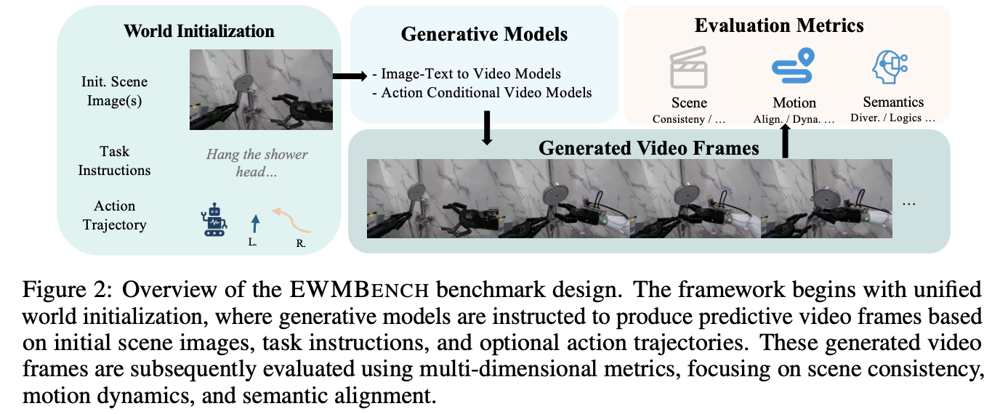

#### 评估指标
##### 场景一致性（Scene Consistency）
场景一致性用于考察视觉布局、物体持久性以及视角连贯性。经过具身数据集微调的 DINOv2 被用于提取帧级的局部 patch level 表征。通过计算相邻帧与初始帧 patch embeddings 之间的余弦相似度，可以量化逐帧的一致性。分数越高，表明视频在场景结构和视角保持方面越稳定和连贯。
具体来说，为了在具身操作场景中增强任务相关视觉特征的提取，论文在 Agibot-World 数据集上对 DINOv2 进行了 20,000 次无监督训练的微调，并使用 dinov2-vitb14-reg4 checkpoint 作为初始化。
论文对比可视化了三种模型变体的特征图：(1) 原始 DINO （ViT-B/16，用于 VBench），(2) 预训练的 DINOv2，以及 (3) 微调后的 DINOv2。实验发现，只有微调后的 DINOv2 能够持续聚焦于任务相关的主体和操作工具，而其他模型要么未能突出关键的前景区域，要么表现出前景与背景纠缠的情况。这证明了将基础模型适配到具身任务领域的必要性。

##### 运动质量评估
生成运动的质量通过**基于轨迹的评估（Trajectory-Based Evaluation）**进行衡量，该方法将生成的轨迹与真实轨迹进行对比。轨迹用于捕捉物理一致性、任务逻辑和交互约束。
论文采用末端执行器（EEF）的轨迹作为评估对象，EEF 由微调的检测器进行检测。

注：End-effector （末端执行器，EEF)，在机器人学中，末端执行器是安装在机械臂末端、直接与环境交互的部分。根据任务不同，末端执行器可能是机械手爪、吸盘、工具头、焊枪、手术刀等。它是机器人执行抓取、操作、移动物体等动作的关键部件。
EEF trajectory （末端执行器轨迹） 指的是末端执行器在三维空间中随时间变化的运动路径。轨迹通常由位姿（位置 + 姿态）随时间的序列表示。

为保证公平性，要求生成模型在每个任务中生成三条候选轨迹，并基于 Hausdorff 距离选择最佳轨迹。论文考虑三种计算指标：
###### 对称 Hausdorff 距离一致性（HSD Consistency）
对称 Hausdorff 距离（SymH）用于衡量生成轨迹与对应真实轨迹之间的最大空间偏差。该距离表示两个轨迹点集之间“最小距离中的最大值”，也就是在所有点的最小匹配距离中取最大者。HSD 在评估生成轨迹与真实轨迹的空间对齐情况时特别有用，它确保生成的路径遵循预期的运动模式，不会与真实动作轨迹发生显著偏离。为了使该指标与一致性呈正相关，论文取其倒数来作为得分：
$$
HSDscore = \frac{1}{dsymH(G, P)},
$$
其中，$G$ 表示真实轨迹，$P$ 表示生成轨迹。

具体来说，Hausdorff 距离的核心思想是：如果你有两条轨迹（或点集），先看每个点和对方点集的最短距离，再挑出其中最远的那一个作为整体距离。

###### 归一化动态时间规整距离一致性（NDTW Consistency）
NDTW 用于评估轨迹整体形状的相似性以及时间上的对齐情况。与关注空间偏差的 HSD 不同，NDTW 强调的是轨迹的整体形状，以及生成动作在时间顺序和节奏上与真实动作的契合程度。该指标特别适用于捕捉模型应从真实轨迹中学习到的时间因果关系与任务顺序。通过同时对齐轨迹的空间和时间维度，NDTW 能够评估生成序列在时序和顺序上是否与真实轨迹匹配。最终的相似度得分同样通过取倒数计算：
$$
NDTWscore = \frac{1}{NDTW(G, P)}
$$

DTW 最初用在语音识别里，用来比较**两个时间序列的相似性**，即使它们在速度或节奏上有所不同。当我们把轨迹（真实轨迹 $G$ 和生成轨迹 $P$）看作时间序列时：
HSD 只看空间偏差（点和点之间最远的距离），关注“最坏情况”。DTW 则会尝试逐步对齐轨迹点，评估整体形状和顺序的相似度。NDTW（Normalized DTW） 是对 DTW 距离做了归一化，让得分更可比。
这样，NDTW 可以回答两个问题：
1. 形状是否相似？（生成轨迹是不是沿着真实轨迹走？）
2. 时间顺序是否一致？（动作执行的先后顺序是否和真实轨迹一致？）

举个直观例子：假设真实轨迹是人走楼梯的动作序列：**上台阶 → 抬手 → 推门**

* 如果生成轨迹是：**上台阶 → 抬手 → 推门**（顺序一致，形状也类似） → NDTW 分数高。
  
* 如果生成轨迹是：**推门 → 抬手 → 上台阶**（顺序乱了） → 即使空间点差不多，但时间对齐错误 → NDTW 分数会低。

###### 动态一致性（DYN）
在机器人控制中，速度和加速度是至关重要的组成部分，它们直接影响生成动作的物理可行性。为了评估预测轨迹与真实运动特性的匹配程度，论文从预测轨迹和真实轨迹中分别提取二维速度与加速度的时间序列，然后计算它们分布之间的 Wasserstein 距离，以量化两者的差异。Wasserstein 距离能够捕捉序列间的全局分布对齐，它支持柔性匹配而不需要严格的时间对齐，因此在刻画整个轨迹的连续运动趋势时更加稳健和适用。为了增强该指标在不同运动幅值下的鲁棒性，论文借鉴 IoU 的计算思路，引入了幅值归一化因子。具体来说，速度的幅值归一化因子（VR）和加速度的幅值归一化因子（AR）分别通过真实值和预测值的最大值与最小值之差来构造比例关系：

$$
VR = \frac{\min\left(\max(v_{gt}) - \min(v_{gt}), \max(v_{pred}) - \min(v_{pred})\right) + \epsilon}{\max\left(\max(v_{gt}) - \min(v_{gt}), \max(v_{pred}) - \min(v_{pred})\right) + \epsilon}
$$

$$
AR = \frac{\min\left(\max(a_{gt}) - \min(a_{gt}), \max(a_{pred}) - \min(a_{pred})\right) + \epsilon}{\max\left(\max(a_{gt}) - \min(a_{gt}), \max(a_{pred}) - \min(a_{pred})\right) + \epsilon}
$$
其中， $\epsilon = 1 \times 10^{-8}$。通过这种方式，能够消除运动幅值差异带来的影响。最终的动态一致性得分定义为：

$$
DYNscore = \alpha \cdot VR \cdot \frac{1}{W(v)} + \beta \cdot AR \cdot \frac{1}{W(a)}, \quad \alpha = 0.007, \beta = 0.003,
$$
其中，$W(\cdot)$ 表示 Wasserstein 距离，VR 和 AR 分别是速度与加速度的幅值归一化因子。这些修正确保了低幅值轨迹不会引入数值放大效应，从而保证动态一致性评估的准确性。

##### 语义评估
语义评估主要关注两个方面：(1) 任务指令与生成视频之间的对齐程度，以及 (2) 任务空间内的多样性。

对于语义对齐，论文使用生成视频的语言 caption 作为中间表示，并将其与真实标注进行比较，从而计算对齐分数。caption 在三个层级上进行提取。

- 全局视频 caption 表示：在全局层面，一个视频多模态大语言模型（MLLM）会生成一个紧凑的 caption 来总结整个视频。这个 caption 会与原始任务指令进行比较，并使用 BLEU 分数来评估任务目标与生成视频内容之间的整体一致性。
  
- 关键步骤描述：机器人任务通常包含多个关键步骤，而这些步骤可能在全局表示中丢失。为了解决这个问题，视频 MLLM 会生成任务关键步骤的详细分解描述。这些描述会与由 MLLM 生成的真实步骤描述（GT）进行比较，并使用 CLIP 分数进行评估。
  
- 逻辑错误惩罚：逻辑错误（如幻觉或空间不一致）在机器人应用中至关重要，因为它们可能导致不安全的结果。MLLM 会评估生成视频中的常识性错误，并明确惩罚诸如虚构的物体操作或不合理的空间关系等错误。这些惩罚机制确保模型能够优先生成现实且连贯的任务执行过程。

对于语义多样性，论文使用 CLIP 模型提取全局视频特征，并将多样性得分计算为 **1 - 相似度**。这一指标反映了模型在泛化和生成多样化输出方面的能力。

## [WorldEval: World Model as Real-World Robot Policies Evaluator](https://arxiv.org/abs/2505.19017v1)

## [LIBERO: Benchmarking Knowledge Transfer for Lifelong Robot Learning](https://arxiv.org/pdf/2306.03310)
本文聚焦于决策领域的终身学习（LLDM），指出与图像和文本等传统终身学习主要关注“陈述性知识”（如概念与实体）不同，机器人决策还需要学习和迁移“程序性知识”（如动作与行为）。为推动该方向研究，作者提出了一个新的机器人操作终身学习基准 LIBERO。该基准围绕五个关键问题展开：如何高效迁移不同类型的知识、如何设计有效的策略架构、如何开发高效算法、模型对任务顺序变化的鲁棒性，以及预训练对终身学习的影响。 为此，作者构建了一个可扩展的程序化任务生成框架，理论上可生成无限任务，并设计了包含 130 个任务的四个任务套件用于评测。同时提供高质量的人类遥操作示范数据，以支持样本高效学习。实验结果揭示了一些重要结论：顺序微调在前向迁移 (leverage prior knowledge to facilitate learning new tasks) 上优于现有终身学习方法；不存在在所有知识迁移类型中都表现最优的视觉编码器；而简单的监督预训练反而可能对后续的终身学习性能产生负面影响。这些发现为 LLDM 研究提供了新的见解与挑战。

LIBERO 基准包含四类任务集：LIBERO-SPATIAL、LIBERO-OBJECT、LIBERO-GOAL 和 LIBERO-100。其中前三类任务集各包含 10 个任务，旨在分别研究不同类型知识的迁移能力：空间信息（陈述性知识）、物体类别（陈述性知识）以及任务目标（程序性知识）。具体而言，LIBERO-SPATIAL 中的任务要求机器人在相同物体集合中将碗放到盘子上，但存在位置不同的相同碗，因此需要持续学习和记忆空间关系；LIBERO-OBJECT 要求机器人执行不同物体的抓取与放置，需要不断学习新的物体类别；LIBERO-GOAL 则在相同物体和固定空间关系下，仅改变任务目标，因此要求机器人学习新的动作和行为策略。相比之下，LIBERO-100 包含 100 个更复杂的任务，涉及多样的物体交互和运动技能，其中进一步划分为 90 个短时序任务（LIBERO-90）用于预训练，以及 10 个长时序任务（LIBERO-LONG）用于评估终身学习算法的泛化能力。

# Method and Model
## [DreamVLA: A Vision-Language-Action Model Dreamed with Comprehensive World Knowledge](https://arxiv.org/pdf/2507.04447v1)
近期在视觉-语言-动作（VLA）模型上的进展表明，将图像生成与动作预测相结合能够提升机器人操作中的泛化与推理能力。然而，现有方法依赖于困难的图像预测，信息冗余且缺乏对动态、空间和语义等全面关键世界知识的建模。为此，我们提出 DreamVLA，一种新颖的 VLA 框架，通过世界知识预测实现逆动力学建模，建立感知–预测–行动闭环。

机器人训练中关于未来世界知识的学习越来越受到关注，其目标是实现 action-forecasting loop。早期方通常依赖于通用世界模型，先进行图像或状态的预测，再将其输入机器人策略模型进行逆动力学学习。这种 two-stage 训练策略实现简单，但性能受到世界模型的限制。更先进的方法则将预测与动作规划端到端结合，使策略能够同时预测动作与未来状态，从而在性能和泛化能力上更具优势。然而，这些方法预测的未来状态往往局限于冗余的视觉信息或单一的状态表达。与之不同，DreamVLA 提出通过高效（动态区域）且有效（全面知识）的未来知识预测方式来提升表现与泛化能力，展现出更强的竞争力。
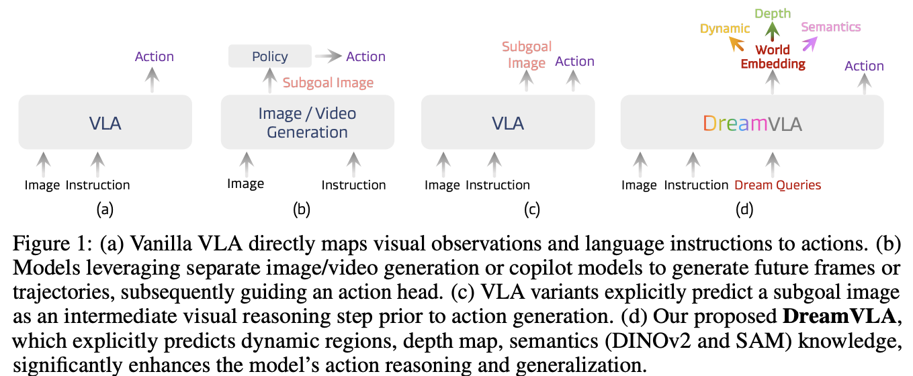

### Methodology
####  Model Architecture
在每个时间步 $t$，机器人会接收三类信号：自然语言指令 $l$、原始视觉帧 $o_t$，以及其本体状态 $s_t$。为了引入前瞻性推理，定义了一组特殊的标记，称为 $\langle dream \rangle$ queries，并将所有输入拼接为一个序列。模型 $M$ 将这些输入映射为一个紧凑的潜在表示，称之为**世界嵌入**（world embedding）：
$$
w_{t+n} = M(l, o_t, s_t \mid \langle dream \rangle). \tag{1}
$$

接下来，世界嵌入预测了综合性的世界知识，该知识结合了运动线索、空间细节和高层语义。具体而言，一组预测器 $P$ 外推 $n$ 步未来：
$$
\hat{p}_{t+n} = P(w_{t+n}) = (\hat{f}_{t+n}, \hat{d}_{t+n}, \hat{c}_{t+n}), \tag{2}
$$

其中 $\hat{f}_{t+n}$ 表示动态区域，$\hat{d}_{t+n}$ 编码单目深度，而 $\hat{c}_{t+n}$ 可选地存储高层语义特征。

在获得世界嵌入 $w_{t+n}$ 之后，$\langle action \rangle$ queries 被模型 $M$ 映射为潜在的动作嵌入，用于聚合相关的动作信息。随后，一个去噪扩散 Transformer $D$ 基于该潜在特征生成一个 $n$ 步动作：

$$
\hat{a}_{t:t+n-1} = D(M(l, o_t, s_t, \langle dream \rangle \mid \langle action \rangle)), \tag{3}
$$

从而完成了一个在训练与推理阶段均一致的感知–预测–行动闭环。

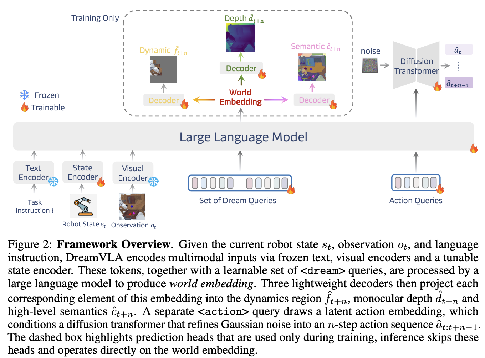

DreamVLA 框架在统一的 Transformer 架构下由三个核心模块组成。首先，输入——包括自然语言指令 $l$、视觉观测 $o_t$ 以及本体感知状态 $s_t$——分别通过模态特定的编码器进行处理。语言指令由 CLIP 文本编码器提取特征，视觉帧通过 Masked Autoencoder 获取时空 patch 表示，而本体感知信号则经由若干卷积层与全连接层编码。完成编码后，一组可学习的查询标记 `<dream>` 与 `<action>` 会被附加到这些多模态嵌入中，其中 `<dream>` 包含三个子查询（动态、深度与语义），可用于预测特定知识。

随后，基于 GPT-2 的大型语言模型，在精心设计的因果与非因果注意力机制下，整合并跨模态关注这些嵌入与查询（见图 4）。这一过程有效地将低层感知信号融合为紧凑且语义一致的世界状态表示。最后，专门设计的轻量级输出头（由浅层卷积层组成）负责将世界嵌入解码为显式预测结果：预期动态区域重建、单目深度以及语义特征。

在推理阶段，DreamVLA 完全跳过解码器，从而大幅节省计算量。模型直接输出一个能够同时蕴含未来动态、深度与语义预测的世界嵌入，而无需像素级重建，既保持了未来状态推理带来的精度提升，又能实现低延迟。与此同时，采用 **Denoising Diffusion Transformer** 将潜在的动作嵌入解码为可执行的机器人动作序列。整体而言，这些组件协同作用，使 DreamVLA 能够在端到端范式下实现稳健的、具有预测性的视觉–语言–动作推理。

####  Comprehensive World Knowledge Prediction
相比于简单地复现未来原始帧，**预测未来中真正重要的部分更具价值**。DreamVLA 显式预测与操作任务最相关的未来世界知识，包括：(i) 以运动为中心的动态区域、(ii) 三维深度几何信息，以及 (iii) 高层语义特征。这些互补信号为原始像素提供了紧凑且结构化的替代表示，并为策略提供面向未来的上下文，用于逆动力学规划。

**运动中心的动态区域重建。** 动态区域的预测能够告诉机器人场景中哪些部分即将发生运动，从而使模型捕捉当前场景、语言指令与实现预测运动所需动作之间的统计联系。首先利用 **CoTracker** 提取动态区域，即随机器人末端执行器或其他可移动物体发生运动的像素，然后训练 DreamVLA 仅重建这些区域。此外，采用 **非对称 tokenizer** 来生成重建目标可以进一步提升性能。

从 **离散变分自编码器（dVAE）** 的角度来看，整体优化目标是最大化对数似然 $P(x_i|\tilde{x}_i)$ 的 ELBO。设 $x$ 表示原始图像，$\tilde{x}$ 表示被掩码的运动区域，$z$ 表示重建目标，则生成建模过程可以描述为：

$$
\sum_{(z_i,\tilde{z}_i)\in D} \log P(x_i|\tilde{x}_i) \geq 
\sum_{(x_i,\tilde{x}_i)\in D} \Bigg( 
\mathbb{E}_{z_i \sim Q_\phi(z|x_i)} \log P_{\psi(x_i|z_i)}
- D_{\mathrm{KL}}\big( z, P_\theta(z|\hat{z}_i) \big),
\Bigg), \tag{4}
$$
其中，$P_\psi(x|z)$ 为 tokenizer 解码器，用于恢复原始数据；$\hat{z}_i = Q_\phi(z|\tilde{x}_i)$ 表示来自被掩码数据的运动区域 token；而 $P_\theta(z|\hat{z}_i)$ 则以自编码方式重建被掩码 token。在此任务中，$P_\theta(z|\hat{z}_i)$ 设为零，因此动态区域的预测损失可以表述为：

$$
\mathcal{L}_{\text{dyn}} = \frac{1}{|D|} \sum_{x_i \in D} \mathbb{E}_{z \sim Q_\phi(z|x_i)} [- \log P_\psi ((x_i)^{M}| z)], \tag{5}
$$
其中 $(x_i)^{M}$ 表示图像中对应掩码运动区域的部分。

**深度预测。** 预测未来的深度场变化能够告诉机器人下一步该如何移动，从而引导其朝向自由空间并避开潜在障碍物。如果有深度传感器可用，使用 **真实深度图** 来监督 DreamVLA；而在缺乏深度感知的低成本平台上，则通过单目 RGB 流“幻化”未来几何信息。为此，将 **Depth-Anything** 的预测结果作为自监督教师，并训练一个专门的深度查询（depth query）来回归对齐的未来深度图 $\hat{d}_{t+n}$。其目标函数是尺度归一化的均方误差：
$$
\mathcal{L}_{\text{depth}} = \frac{1}{HW} \sum_{i,j} 
\Big( \hat{d}^{(i,j)}_{t+n} - \alpha d^{(i,j)}_{t+n} \Big)^2, \tag{6}
$$
其中，尺度因子 $\alpha$ 用于消除单目方法无法解决的全局尺度歧义：

$$
\alpha = \frac{\sum_{i,j} \hat{d}^{(i,j)}_{t+n} d^{(i,j)}_{t+n}}{\sum_{i,j} (d^{(i,j)}_{t+n})^2}. \tag{7}
$$

在实践中，这一简单的损失已经足够有效：教师模型提供度量上合理的深度估计，而尺度归一化项则鼓励模型保持 **序深度关系**（ordinal depth relationships）——这是抓取合成与碰撞检测中的关键属性——同时忽略任意的全局尺度偏移。

**对比式语义预测。** 预测未来语义信息能够告诉机器人哪些物体或区域将在任务中起关键作用，从而提供高层次的上下文（例如物体类别、可供性），以指导目标选择和抓取决策。为学习语义预测，DreamVLA 利用 **DINOv2 \[65]** 和 **SAM \[66]** 提取的特征 $\hat{c}_{t+n}$，并通过 **InfoNCE 损失 \[107, 62]** 进行优化：真实的未来特征作为正样本，而空间上偏移的特征作为负样本。这种方式鼓励模型在预测时进行判别性选择，从多个可能但错误的未来中挑选正确的物体语义：
$$
\mathcal{L}_{\text{sem}} = - \log 
\frac{\exp(\hat{c}^\top_{t+n} c_{t+n} / \tau)}
{\sum_k \exp(\hat{c}^\top_{t+n} c_k / \tau)}, \tag{8}
$$
其中，$k$ 表示空间维度上的 token 数量，$\tau$ 为温度参数。

**结构化注意力实现跨类型知识解耦。**
为了保持不同类型未来知识的清晰边界，`<dream>` 查询被分解为三个子查询（动态、深度和语义）。如果这些子查询能够相互自由关注，那么高频的 flow details 可能会污染深度推理，语义线索也可能渗入运动特征，从而产生噪声混合表示。为避免这种情况，论文在注意力机制中对它们的相互关注进行掩蔽：**每个子查询仅能关注共享的视觉、语言和状态 token，而三者之间的直接连接被禁用**，从而保持其潜在特征的解耦性并避免跨类型干扰。

如图 4 所示，`<dream>` 与 `<action>` 查询均采用 **因果注意力（causal attention）**，并限制在过去上下文中，这保证了时间因果性。该有组织的注意力模式类似于 **专家混合（Mixture-of-Experts, MoE）网络** 中的专门路由策略。通过避免跨模态信息泄漏，结构化注意力能够为动作预测提供 **干净的未来世界知识**，从而提升模型的鲁棒性并保持时间一致性。

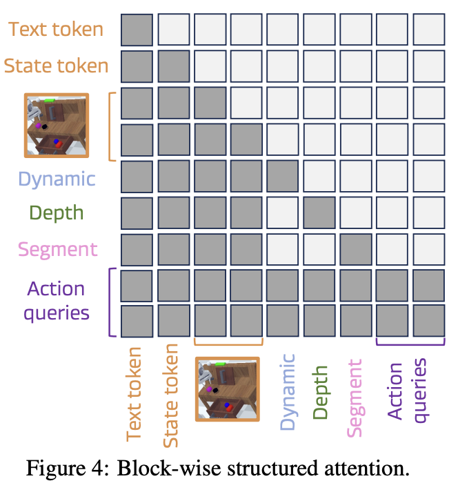

#### Inverse Dynamics via Denoising Diffusion Transformer

在经典逆动力学中，给定两个有序观测 $o_t$ 与 $o_{t+1}$，任务是推断中间的动作 $\hat{a}_t$。论文在此基础上进行了扩展：DreamVLA 不仅推断单步动作，而是预测 **完整的动作序列** $\hat{a}_{t:t+n-1}$，其条件为当前观测 $o_t$ 以及未来的潜在世界嵌入 $w_{t+n}$。

具体而言，DreamVLA 首先通过专门的 **action query** 和模型的因果注意力，将包含未来动态、深度与语义预测的世界嵌入聚合为紧凑的 **动作嵌入**。由于世界嵌入与动作嵌入共享相同的潜在空间并具有相似的统计特性，简单的 MLP 输出头难以有效解耦模态特定信息或利用其跨模态相关性。因此，我们采用 **Denoising Diffusion Transformer (DiT)** 作为动作预测头。

在条件化的动作嵌入下，DiT 通过迭代的 **自注意力与去噪过程**，将感知预测与控制先验相融合，并逐步将高斯噪声转化为 $n$ 步动作轨迹 $\hat{a}_{t:t+n-1}$，从而生成 **连贯、多样且物理合理** 的动作序列。其训练目标函数为：
$$
\mathcal{L}_{\text{DiT}} = \mathbb{E}_{\tau, \epsilon} \Bigg[ 
\Big\| \epsilon - \epsilon_\theta \Big( \sqrt{\bar{\alpha}_\tau} \, a_{t:t+n-1} + 
\sqrt{1 - \bar{\alpha}_\tau} \, \epsilon, \, \tau, \, c \Big) \Big\|_2^2 \Bigg], \tag{9}
$$
其中，$\epsilon_\theta$ 为 DiT 去噪器，$\epsilon \sim \mathcal{N}(0, I)$，$\bar{\alpha}_\tau$ 服从余弦噪声调度，$c$ 表示由大语言模型获得的潜在动作嵌入。

在推理阶段，模型从高斯分布采样，并通过学习到的 反向扩散过程 生成动作轨迹，从而实现 多样化但物理上合理 的规划，最终闭合了感知–预测–动作循环。

## [WorldVLA: Towards Autoregressive Action World Model](https://arxiv.org/abs/2506.21539v1)
### Introduction
VLA（视觉-语言-动作）模型在机器人任务中表现出较强的泛化能力。然而，一个显著的局限仍然存在：这些模型通常缺乏对“动作”的全面理解。具体而言，动作仅被视为输出结果，而未被作为输入信息加以整合，从而限制了模型对行为语义的深入分析。与之相比，世界模型（World Models）能够基于当前观测和动作预测未来的视觉状态，从而在视觉信息与行为动态之间形成双重理解。尽管世界模型具备这一优势，但其无法直接生成动作输出，这种功能上的缺陷限制了其在需要明确动作规划的场景中的应用。

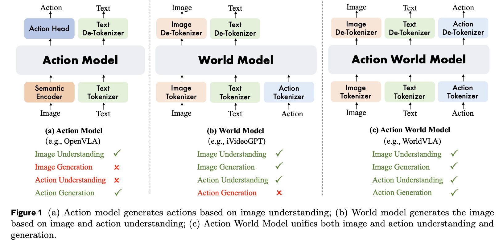

为了解决视觉-语言-动作（Vision-Language-Action，简称 VLA）模型和世界模型（world model）各自固有的限制，我们提出了 **WorldVLA** ——一种用于统一动作与图像理解和生成的自回归动作世界模型。如图 1 所示，WorldVLA 采用了三个独立的分词器（tokenizer）分别对图像、文本和动作进行编码。来自不同模态的 tokens 共享相同的词汇表，从而使跨模态的理解与生成能够在单一的大语言模型（LLM）架构中实现统一。在该模型中，**世界模型组件**通过根据输入的动作生成视觉表征来捕捉环境的底层物理动态。这一过程的核心在于对动作的解释与环境物理规律的学习，它是实现有效决策能力的关键。同时，WorldVLA 内嵌的**动作模型**会反向促进对视觉数据的理解，从而提升世界模型在图像生成任务中的精度。这种双向增强机制使得模型在理解与生成动作和图像两方面都更加稳健和全面。

研究表明，动作分块（action chunking）和并行解码（parallel decoding）对动作模型的性能有显著影响。然而，我们发现，在自回归模型中顺序生成多个动作会导致性能下降。其主要原因在于，预训练的多模态语言模型主要接触的是图像和文本数据，而非动作数据，因此其动作泛化能力有限。在自回归生成中，后续动作依赖于先前的预测结果，一旦早期预测出现错误，这些错误就会随着序列传播并累积，导致性能显著下降。为缓解这一问题，我们提出了一种**动作注意力掩码策略（action attention masking）**，在当前动作生成过程中有选择地屏蔽部分先前动作的信息。该方法有效地抑制了错误传播问题，并在动作分块生成任务中取得了显著的性能提升。

### Problem Formulation
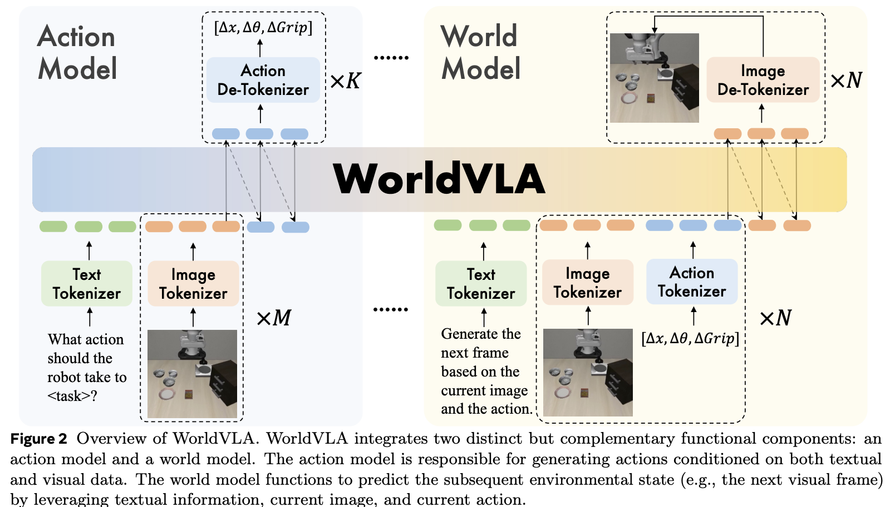

本研究探讨了如何学习一个能够同时执行**动作预测（action prediction）**和**世界状态预测（world state forecasting）**的统一模型。具体而言，定义两个主要组件：动作模型（或策略模型）$\pi_{\theta}$ 与世界模型 $f_{\phi}$。其中，动作模型 $\pi_{\theta}$ 负责在给定历史图像观测序列 $\{o_{t-h}, o_{t-h+1}, \ldots, o_t\}$ 以及语言指令 $l$ 的条件下，生成当前时刻的动作 $a_t$。这一过程可形式化表示为：
$$
a_t = \pi_{\theta}(a_t \mid o_{t-h:t}, l).
$$

与此同时，世界模型 $f_{\phi}$ 用于根据过去的观测序列 $\{o_{t-h}, o_{t-h+1}, \ldots, o_{t-1}\}$ 以及对应的动作序列 $\{a_{t-h}, a_{t-h+1}, \ldots, a_{t-1}\}$，预测下一帧的观测 $o_t$。该关系可形式化表示为：

$$
o_t = f_{\phi}(o_t \mid o_{t-h:t-1}, a_{t-h:t-1}).
$$

目标是开发一个统一的**动作-世界模型（action-world model）** $M_{\psi}$，使其能够同时执行动作生成与未来状态预测两种功能。形式上，统一模型 $M_{\psi}$ 定义为：
$$
\begin{align*}
M_{\psi} :
\begin{cases}
a_t &= M^{\text{policy}}_{\psi}(a_t \mid o_{t-h:t}, l), \\
o_t &= M^{\text{world}}_{\psi}(o_t \mid o_{t-h:t-1}, a_{t-h:t-1}),
\end{cases}
\end{align*}
$$
其中，$M^{\text{policy}}_{\psi}$ 表示模型中的策略生成组件，而 $M^{\text{world}}_{\psi}$ 表示世界状态预测组件。通过学习这样一个统一模型，期望构建一个紧凑且高效的框架，在决策制定与环境建模任务之间共享表示，从而提升整体学习与推理的能力。

### Training Strategy

我们将**动作模型数据**与**世界模型数据**混合训练，以优化统一模型 **WorldVLA**。引入世界模型数据来增强动作生成能力主要有以下三个原因。首先，世界模型通过学习基于当前状态和已执行动作来预测未来观测，从而获得对环境物理规律的理解，这种对环境动力学的建模能力对操作任务非常有帮助。其次，世界模型能够模拟和评估候选动作的潜在结果，从而帮助系统避免导致不良状态的动作。第三，世界模型需要对动作输入进行精确的语义理解，这反过来促进了动作模型生成更有效且语境相关的动作。另一方面，动作模型的引入增强了视觉理解能力，从而提升了世界模型的视觉生成性能。

动作模型的目标是在给定**文本指令**和**图像观测**的条件下生成动作。文本输入的形式为：

> “What action should the robot take to + 任务指令 + ?”

整体的 token 序列如下所示：

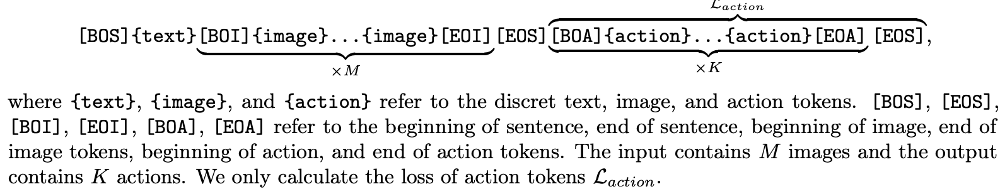

世界模型的目标是根据**当前图像观测**和**动作**生成**下一帧图像**，无需任务指令，因为动作本身即可决定下一个状态。文本输入为：

> “Generate the next frame based on the current image and the action.”

整体 token 序列如下：
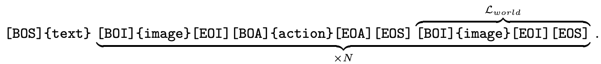

#### 注意力掩码（Attention Mask）

在自回归模型中，标准注意力机制通常使用**因果注意力掩码（causal attention mask）**，即当前 token 只能访问先前的 token，不能访问未来信息，如图 3(a) 所示。然而，这种标准掩码在生成**动作片段（action chunks）**时并不理想。尽管底层多模态语言模型（MLLM）在图像与文本领域具有强大的泛化能力，但在动作领域的泛化能力相对较弱，因而早期动作的错误会在后续动作生成中累积并放大。

为了解决这一问题，我们提出了一种**专为动作生成设计的注意力掩码**（见图 3(b)），该掩码使当前动作只能依赖文本与视觉输入，而无法访问先前生成的动作，从而实现多个动作的并行生成。这种设计与 (Kim et al., 2025; Black et al., 2024) 的方法一致。另一方面，世界模型部分仍采用标准的因果注意力掩码，如图 3(c) 所示。
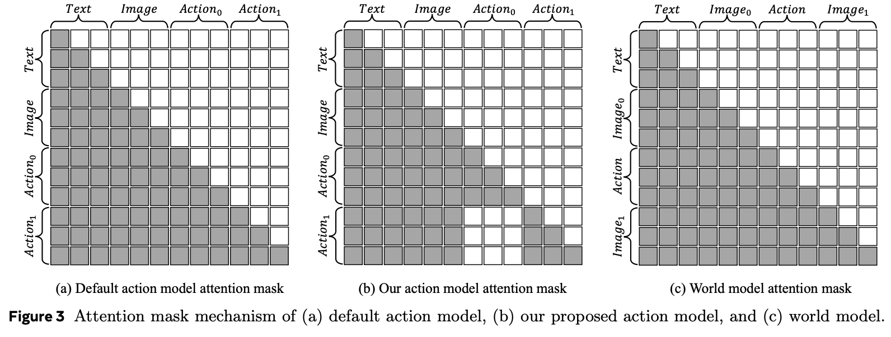

我们将动作模型数据与世界模型数据混合训练，使自回归的动作-世界模型能够同时具备两种功能。总体损失函数定义为：

$$
L = L_{\text{action}} + \alpha L_{\text{world}},
$$
其中，(L_{\text{action}}) 与 (L_{\text{world}}) 分别表示动作模型数据与世界模型数据的交叉熵损失。由于图像 token 数量远多于动作 token（例如，(256 \times 256) 图像对应 256 个 token，而 (512 \times 512) 图像对应 1024 个 token，而动作仅有约 7 个 token），因此我们引入平衡系数 (\alpha) 来调节两部分损失的贡献。

## [Unified Vision-Language-Action Model](https://arxiv.org/pdf/2506.19850)

[知乎](https://zhuanlan.zhihu.com/p/1930312584613074483)

## [FLARE: Robot Learning with Implicit World Modeling](https://arxiv.org/abs/2505.15659)

论文提出了一种轻量但高效的方法——未来潜在表征对齐（Future LAtent REpresentation Alignment, FLARE），用于扩展扩散（diffusion）或流匹配（flow-matching）策略模型。该方法通过在潜空间中引入世界建模，并采用未来对齐目标（future alignment objective），从而无需进行完整帧的重建。其核心思想是让 FLARE 从动作去噪网络（action denoising network）的隐藏状态中预测机器人未来观测的紧凑潜表示。

FLARE 的工作流程分为两个主要阶段。首先，预训练一个紧凑且具备动作感知能力的观测嵌入模型。虽然也可以使用通用的嵌入模型来生成未来目标表示，但我们发现，显式针对下游任务优化的动作感知嵌入能够在性能与效率上取得更佳平衡，因为它既紧凑又与任务目标更契合。接下来，在训练扩散式 Transformer 时引入少量额外的 token，用于预测未来的观测嵌入，从而在保持模型轻量化的同时，实现高效的未来潜在表征建模。

### Background

本研究采用 flow matching 作为学习目标，用于从人类示范数据中拟合机器人动作。设 $o_t$ 表示机器人的观测输入，包括来自一个或多个视角的图像输入以及语言指令；$q_t$ 表示机器人的本体（proprioceptive）状态；而 $A_t = (a_t, \ldots, a_{t+H})$ 表示从专家示范中提取的动作片段（action chunk）。将观测通过视觉语言编码器（Vision-Language Encoder）映射为视觉语言 embedding $\phi_t = VL(o_t)$。

给定视觉语言 embedding $\phi_t$、动作片段 $A_t$、流匹配时间步 $\tau \in [0,1]$，以及从标准高斯分布中采样的噪声 $\epsilon \sim \mathcal{N}(0, I)$，构造加噪的动作片段如下：
$$
A_t^{\tau} = \tau A_t + (1 - \tau)\epsilon.
$$

模型 $V_{\theta}(\phi_t, A_t^{\tau}, q_t)$ 被训练来预测去噪方向（denoising direction）$\epsilon - A_t$，即模型要学会在潜空间中将噪声样本逐渐引导回专家动作。其训练目标为流匹配损失（flow-matching loss）：
$$
\mathcal{L}_{\text{fm}}(\theta) = \mathbb{E}*{\tau} [|V_{\theta}(\phi_t, A_t^{\tau}, q_t) - (\epsilon - A_t)|_2^2].
$$
时间步 $\tau$ 依据如下分布进行采样：$p(\tau) = \text{Beta}!(\frac{s - \tau}{s};, 1.5,, 1)$，其中 $s = 0.999$。

在推理阶段，通过 K 步去噪（K-step denoising）的方式生成动作片段。首先，从高斯分布采样初始动作片段：$A_t^{0} \sim \mathcal{N}(0, I)$，然后通过前向欧拉积分（forward Euler integration）迭代优化：
$$
A_t^{\tau + 1/K} = A_t^{\tau} + \frac{1}{K} V_{\theta}(\phi_t, A_t^{\tau}, q_t).
$$

在所有实验中，论文按照 GR00T N1 的设置，将步数固定为 $K = 4$。此外，模型 $V_{\theta}$ 采用与 Diffusion Transformer（DiT）相同的架构设计，即在 Transformer 结构中交替堆叠交叉注意力（cross-attention）与自注意力（self-attention）层，以在生成过程中充分利用机器人的视觉语言嵌入 $\phi_t$。

### Method
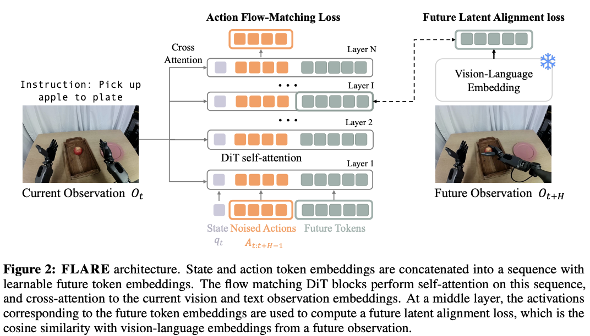

#### 通过未来潜在表征对齐的潜在世界建模（Latent World Modeling through Future Latent Representation Alignment）
为了让 Diffusion Transformer（DiT） 模块内部的潜表示能够预测未来的潜在状态，论文在输入序列中加入了 M 个可学习的未来 token（future token embeddings）。因此，模型的输入序列包含以下三个组成部分：

(1) 当前的本体状态 $q_t$，通过状态编码器（state encoder）编码；

(2) 加噪后的动作片段 $A_t^{\tau} = { \tau a_t + (1 - \tau)\epsilon }_{t}^{t+H}$，通过动作编码器（action encoder）编码；

(3) 一组 $M$ 个可学习的未来 token。

接着，在 DiT 的某一中间层 $L$ 取出对应于这 $M$ 个未来 token 的中间表示，通过一个多层感知机（MLP）进行特征投影，并将这些投影结果与冻结的未来观测视觉语言嵌入$\phi_{t+H}$ 进行对齐（如图 2 所示）。

该方法与 **Representation Alignment（REPA）** 用于改进文本到图像扩散模型的思想相似，但在潜世界建模的场景下有几个关键区别：

1. **对齐目标不同**：将 DiT 策略网络与**未来观测嵌入**进行对齐，而不是与当前观测的嵌入对齐。
   
2. **结构设计不同**：我们在模型中引入了可学习的未来 token，使得 流匹配（flow matching） 与 表示对齐（alignment） 可以在 DiT 的不同子流中并行进行，并通过自注意力机制（self-attention）交互。

这种设计使得 DiT 模块在保持动作预测能力的同时，能够在潜空间中内部推理（internally reason）未来潜状态，从而实现隐式的世界建模。

设 $B$ 表示 batch 大小，$D$ 表示嵌入维度。我们将潜表示对齐目标（latent alignment objective）定义为：

$$
\mathcal{L}_{\text{align}}(\theta)
= - \mathbb{E}_{\tau}[\cos (f_{\theta}(\phi_t, A_t^{\tau}, q_t), g(\phi_{t+H}))],
$$
其中：

* $f_{\theta} : \mathbb{R}^{B \times M \times D}$ 表示在层 $L$ 处 DiT 对应未来 token 的输出表示；
  
* $g : \mathbb{R}^{B \times M \times D}$ 表示未来观测 $\phi_{t+H}$ 的编码器输出。

最终的整体损失函数定义为：
$$
\mathcal{L} = \mathcal{L}_{\text{fm}} + \lambda \mathcal{L}_{\text{align}}.
\tag{3}
$$
实验发现超参数 $\lambda = 0.2$ 能够取得最佳效果。这种结合了动作流匹配与未来潜表示对齐的训练策略，使模型能够在潜空间中同时学习**动作生成**与**未来预测**，实现高效的隐式世界建模。

#### 动作感知未来嵌入模型（Action-aware Future Embedding Model）
尽管未来潜表示对齐框架（Future Latent Alignment Framework）能够兼容多种嵌入模型，但我们发现，引入动作感知（action-aware）的未来嵌入能够在性能与效率上带来进一步提升。为此，我们提出了一种专为策略学习优化的、紧凑的视觉语言嵌入模型（vision-language embedding model），用于表示机器人的当前观测。采用 SigLIP-2 [12] 的视觉编码器和文本编码器，分别对机器人的图像观测与语言指令进行编码。编码后的 token 序列通过 四层自注意力 Transformer 模块进行跨模态融合，以捕获视觉与语言之间的语义关联。随后，我们使用一个 Q-former 模块将融合后的序列压缩为 32 个可学习的查询 token，从而获得一个紧凑、固定长度的潜在表示，该表示能够自然适应多摄像头输入场景。为了使嵌入具备动作感知能力，我们将该视觉语言嵌入模型与动作流匹配（action flow-matching）目标端到端联合训练。在嵌入模型后接入 8 个 DiT 模块，直接预测机器人的动作。通过这种方式，所有与任务执行相关的信息都被有效编码进潜在 token 表示中，保证了嵌入对策略学习的适配性与可解释性。

## [EnerVerse: Envisioning Embodied Future Space for Robotics Manipulation](https://arxiv.org/pdf/2501.01895)
## [DreamGen: Unlocking Generalization in Robot Learning through Video World Models](https://arxiv.org/abs/2505.12705)
## [Do Vision-Language Models Have Internal World Models? Towards an Atomic Evaluation](https://arxiv.org/abs/2506.21876)
## [ThinkAct: Vision-Language-Action Reasoning via Reinforced Visual Latent Planning](https://arxiv.org/pdf/2507.16815v2)
## [V-JEPA 2: Self-Supervised Video Models Enable Understanding, Prediction and Planning](https://arxiv.org/abs/2506.09985v1)
## [Planning with Reasoning using Vision Language World Model](https://arxiv.org/abs/2509.02722)
## [F1: A Vision-Language-Action Model Bridging Understanding and Generation to Actions](https://arxiv.org/abs/2509.06951)

## [(20251028, Cosmos) World Simulation with Video Foundation Models for Physical AI](https://arxiv.org/abs/2511.00062)

论文介绍了新一代物理 AI 基础模型 Cosmos-Predict2.5。该模型基于流式架构，将 Text2World、Image2World 和 Video2World 三种生成能力统一到一个模型中，并结合视觉语言模型 Cosmos-Reason1，实现更强的文本语义理解与更精细的世界模拟控制。通过在 2 亿条精选视频数据上训练，并结合强化学习进行后训练优化，Cosmos-Predict2.5 在视频生成质量和指令对齐方面相较于上一代 Cosmos-Predict1 有显著提升，同时提供 2B 和 14B 两种规模版本。这些能力使其在合成数据生成、策略评估以及机器人与自动驾驶的闭环仿真中更加可靠。此外，研究还推出了 Cosmos-Transfer2.5，用于仿真到现实（Sim2Real）及现实到现实（Real2Real）的转换任务，在模型规模缩小至原来的约三分之一的情况下，实现了更高保真度和更稳定的长时序视频生成。整体而言，这些模型为具身智能的发展提供了强有力的工具支持。

### Method
#### Flow Matching
高分辨率数据（比如高清图像）往往具有很强的冗余性，也就是说相邻像素之间高度相关。如果在训练过程中加入的噪声太小，这种相关性不会被有效破坏，模型就容易“依赖原有结构”，而不是学会真正的底层数据分布。这会导致模型难以学习到更有意义、更通用的结构信息。

为了解决这个问题，作者提出在训练时**有意让模型更频繁地接触高噪声数据**。具体做法是：先从一个 logit-normal 分布中采样一个变量 $t$，这个 $t$ 可以理解为“噪声强度”或“时间步”。然后，对这个$t$做一个单调变换，得到新的$t_s$：
$$
t_s = \frac{\beta t}{1 + (\beta - 1)t},
$$
这里的 $\beta$ 是一个超参数，用来控制“偏移程度”。这个变换的作用是**重新分配 $t$ 的分布，使其更偏向较大的值（也就是更高噪声）**。直观来说，$\beta$ 越大，采样得到的$t_s$ 越倾向于接近 1，对应更强的噪声水平。

这样做的好处是：模型在训练中会更频繁地面对被严重破坏（高噪声）的输入，从而被迫学习如何在强干扰下恢复原始信号。这有助于模型更好地理解数据结构，而不是仅仅依赖局部相关性。当 $\beta = 1$ 时，这个变换不会产生任何效果，此时 $t_s = t$，也就是没有对原始分布进行偏移。

#### Network Architecture

在文本编码器的选择上，作者没有使用传统方法中常见的 T5 编码器（如 CosmosPredict1 中所用），而是采用了更先进的 Cosmos-Reason1。与标准做法只使用 Transformer 某一层的输出不同，这里对每个 token（词或子词）都会收集多个 Transformer block 的激活结果，并将这些来自不同层的信息拼接（concatenate）起来，然后再映射到一个 1024 维的向量空间。这种设计受到相关研究的启发，其核心目的是同时保留浅层的局部语义信息和深层的全局语义信息。通过这种方式，最终得到的是一组更丰富的文本嵌入序列（embedding vectors），能够更全面地表达语言中的上下文关系，而不仅仅是单一层所捕捉的信息。在训练过程中，这些文本嵌入会通过交叉注意力（cross-attention）机制注入到去噪模型中，使得文本提示（prompt）可以直接影响视频生成的过程。换句话说，模型在逐步生成或还原视频帧时，会不断参考这些文本特征，从而让生成内容更符合输入描述。此外，Cosmos-Reason1 中的视觉编码器还支持额外的视觉条件输入（例如风格图像），可以用于控制生成视频的风格。不过这一能力在当前工作中还没有被深入使用，而是被作为一个未来值得探索的方向。

在 Image2World 和 Video2World 任务中，模型采用了一种“帧替换策略”。具体来说，在生成一段新的视频序列时，并不是完全从头生成所有帧，而是会将生成序列的前几帧，直接用输入的条件帧（例如输入图像或输入视频的前几帧）进行替换。也就是说，输出视频的开头部分是“真实给定的”，而不是模型预测出来的。 这种做法有两个主要作用。第一，它提供了更高的灵活性，因为可以根据具体任务需要，自由调整“使用多少帧作为条件输入”。例如，有的任务可能只需要一张图作为起点（Image2World），而有的任务可以输入多帧视频（Video2World），这个策略都能适配。第二，它可以显著增强时间一致性（temporal consistency），因为视频最开始的几帧是完全忠实于输入的，这就相当于给整个生成过程提供了一个稳定、可靠的起点。由于前几帧是固定且真实的，这些帧中的视觉信息（比如物体外观、布局、运动趋势等）会在后续生成过程中逐渐传播，从而引导后面的帧保持一致性。最终效果就是：生成的视频在时间维度上更加平滑连贯，不容易出现闪烁、形变或内容突变，从而得到更“像一个真实世界延续”的结果。

#### Training
论文采用了一种渐进式（progressive）的训练策略，在训练效率和模型性能之间取得平衡。整个过程首先从多阶段预训练开始，在这一阶段中，训练难度会沿着两个维度逐步提升：一是图像的分辨率，从低分辨率逐渐过渡到高分辨率；二是任务的多样性，从简单、单一的任务逐渐扩展到更加复杂、多样的任务。通过这种“由易到难”的方式，模型可以稳定地学习基础能力，并逐步适应更复杂的场景。

在完成预训练之后，会进行监督微调（SFT）。这一阶段使用的是经过精心筛选的高质量 Physical AI 数据集，目的是强化模型在特定领域中的能力，使其在一些专业任务上表现更加可靠。随后，会将这些在不同数据或任务上训练得到的能力进行融合，形成一个统一的模型。

最后，在这个融合后的模型基础上，进一步引入强化学习（RL）算法，对生成结果进行优化。通过强化学习，可以根据某些评价标准（例如质量、一致性或符合物理规律的程度）对模型进行反馈和调整，从而进一步提升整体生成效果。

## [Cosmos Policy: Fine-Tuning Video Models for Visuomotor Control and Planning](https://arxiv.org/pdf/2601.16163)

这篇论文关注的是一个很重要的问题：如何把大规模视频生成模型转化为真正可用的机器人控制策略。传统视觉语言动作模型（Vision-Language-Action model, VLA）通常依赖静态图像—文本预训练或大量机器人动作数据来学习控制策略，而视频生成模型本身已经从海量视频中学习到了时间演化、物理交互和运动模式。因此，一个自然的问题是：能否直接利用视频模型的时空先验，让它既能预测机器人动作，又能预测动作执行后的未来状态，甚至还能评估未来状态的价值。

已有一些工作已经尝试把视频模型用于机器人策略学习，但往往需要复杂的多阶段训练、新增动作头、额外世界模型或单独的价值函数。Cosmos Policy 的动机正是简化这一过程：作者希望用一个统一的视频扩散模型，同时承担 **policy、world model 和 value function** 三种角色，而不是分别训练多个模块。论文基于 **Cosmos-Predict2-2B-Video2World**，这是一个 latent video diffusion model，原本输入起始图像和文本描述，输出后续视频帧。作者将其改造成机器人策略模型，用单阶段后训练完成从视频生成模型到具身控制模型的迁移。

这里的value指的是：某个未来状态的预期累计回报，即如果从这个未来状态继续执行任务，最终成功的可能性/任务回报有多高。作用是给不同候选 action chunk 的 imagined future 打分，帮助模型选择更可能成功的动作。
### 核心方法

Cosmos Policy 的关键方法叫 **Latent Frame Injection**。原始视频模型只能处理图像 latent sequence，但机器人控制还需要处理机器人本体状态、动作、未来状态和价值估计。作者没有修改视频模型结构，而是把这些新模态也编码成“latent frames”，直接插入到视频模型原有的 latent diffusion 序列中。这样，原本的视频扩散模型不仅可以生成未来图像，也可以在同一个 latent 序列中生成动作 chunk、未来机器人状态和未来价值。

具体来说，对于一个包含多相机观测的机器人平台，latent sequence 中可以依次放入当前机器人状态、腕部相机图像、第三视角图像、动作 chunk、未来机器人状态、未来图像和未来价值等内容。机器人 proprioception、action chunk 和 value 等非图像模态，会被归一化后复制填充到 latent volume 中，从形式上伪装成视频模型可以处理的 latent frame。这样做的好处是，不需要额外设计动作预测头、世界模型头或价值函数头，而是复用视频模型原本的 latent diffusion denoising 机制。

训练时，Cosmos Policy 通过不同的 conditioning mask 来训练三种功能。作为 policy 时，模型根据当前观测和任务描述生成 action chunk；作为 world model 时，模型根据当前状态和动作预测未来状态；作为 value function 时，模型预测未来状态对应的期望累计奖励。论文中每个训练 batch 会混合 demonstration data 和 rollout data：一部分用于训练 policy，一部分用于训练 world model，另一部分用于训练 value function。初始阶段，rollout dataset 可以等同于 demonstration dataset 或包含 replay 失败的 demonstration；之后，作者还会收集 policy rollout data 来进一步 fine-tune world model 和 value function，使其更适合模型自身策略所访问到的状态分布。([arXiv][2])

### 训练与规划策略

Cosmos Policy 既可以作为直接策略使用，也可以作为带规划能力的模型使用。直接策略模式下，模型只需要生成 action chunk，未来状态和价值预测可以丢弃，因此可以采用并行解码，速度更快。规划模式下，作者使用 autoregressive decoding 获得更高质量的未来状态和价值预测。

在模型规划阶段，作者使用 **best-of-N sampling**。流程是：首先从 policy model 中采样多个候选 action proposals；然后用 planning model 预测每个 action proposal 导致的未来状态和对应价值；最后选择 predicted value 最高的 action chunk 执行。为了让 planning model 更可靠，作者将基础 Cosmos Policy 在 policy rollout data 上继续微调，并且在这个阶段更强调 world model 和 value function 的训练。论文中还使用了多次采样和 “majority mean” 聚合策略，减少 value prediction 中异常值或双峰分布带来的干扰。

这套设计的关键意义在于：Cosmos Policy 不只是一个行为克隆模型。它同时具备“生成动作”“想象未来状态”和“评价未来状态价值”的能力，因此可以在测试时通过内部世界模型进行候选动作搜索。这一点和传统 VLA 很不同，后者通常只负责从当前观测直接输出动作，而不显式预测未来状态和价值。

### 实验设置与结果

论文在三个层面进行评测：LIBERO 仿真、RoboCasa 仿真和真实 ALOHA 双臂机器人任务。LIBERO 包含 Spatial、Object、Goal 和 Long 四个任务套件，每个套件有 10 个任务、每个任务 50 条 demonstration。RoboCasa 包含 24 个厨房操作任务，作者为了考察数据效率，只使用每个任务 50 条人类遥操作 demonstration，而不是使用更多 MimicGen 数据。真实机器人部分使用 ALOHA 双臂平台，包括放置物体、折叠衣服、把糖果放入碗中、把糖果放入拉链袋等高精度或多模态动作任务。

LIBERO 训练时预测 16 timesteps，并在 test time 执行 full chunk。在 LIBERO 上，Cosmos Policy 达到 98.5% 平均成功率，超过 Diffusion Policy、Dita、π0、UniVLA、OpenVLA-OFT、CogVLA 等强基线。其中四个子集结果分别为 Spatial 98.1%、Object 100.0%、Goal 98.2%、Long 97.6%。这说明视频模型预训练带来的时空先验不仅能支持短任务，也能支持长时序任务。

RoboCasa 训练预测 32 timesteps，执行 16 steps before requerying。在 RoboCasa 上，Cosmos Policy 使用每个任务 50 条 demonstration，取得 67.1% 平均成功率，超过多个使用更多数据的强方法。例如 GR00T-N1.5 使用 300 条 demonstration 达到 64.1%，Video Policy 使用 300 条 demonstration 达到 66.0%，FLARE 使用 300 条 demonstration 达到 66.4%，而 Cosmos Policy 仅用 50 条 demonstration 达到 67.1%。这个结果强调了视频模型预训练在数据效率上的优势。

ALOHA 任务预测 50 timesteps，full chunk execution。真实 ALOHA 实验中，Cosmos Policy 在四个双臂操作任务上取得最高平均表现。论文指出，相比一些 fine-tuned VLA，Cosmos Policy 在高动作多模态和高精度抓取任务中更稳定。例如在“把糖果放进碗里”这类任务中，动作分布高度多模态，简单 L1 回归容易预测到两个糖果之间的平均位置，而 Cosmos Policy 借助扩散模型能更好地建模多峰动作分布。在“把糖果放进拉链袋”任务中，毫米级抓取精度很重要，其他方法容易抓不住拉链袋滑块，而 Cosmos Policy 更可靠。

论文还做了消融实验。去掉辅助预测目标会导致 LIBERO 平均成功率下降约 1.5 个百分点；从随机初始化训练而不是使用视频模型预训练，会下降约 3.9 个百分点。这说明两个因素都重要：一是预训练视频模型本身的物理和时序先验，二是同时预测动作、未来状态和价值带来的多任务监督。

最后，作者验证了 model-based planning 的价值。由于直接策略在 LIBERO 和部分真实任务上已经很强，论文重点在 ALOHA 中更难的两个任务上测试规划效果。作者收集 648 条 policy rollout 数据，对 world model 和 value function 进行微调，然后用 best-of-N planning 选择高价值动作。结果显示，model-based planning 在两个挑战任务上带来 12.5 分的平均提升，并且优于直接学习 Q-value 的 model-free planning 变体。作者认为，在 rollout 数据有限时，通过 world model 预测未来状态再评估 state value，比直接学习高维输入下的 Q function 更稳健。

### 总结

Cosmos Policy 的核心贡献在于，它证明了大规模视频生成模型可以被直接改造成机器人控制策略，而且不需要复杂架构修改。通过 **Latent Frame Injection**，动作、未来状态和价值都被统一表示成视频扩散模型中的 latent frames，使一个模型同时具备 policy、world model 和 value function 三种能力。它在 LIBERO、RoboCasa 和真实 ALOHA 任务上都取得强结果，尤其展示了视频模型预训练对于物理交互、多模态动作分布和高精度操作的价值。

不过，论文也承认目前的 model-based planning 推理速度较慢，例如生成一个 action chunk 可能需要约 5 秒，因此更适合相对静态的操作任务，而不适合高速动态环境。此外，有效规划仍依赖一定数量的 policy rollout data 来改善 world model 和 value function。总体来看，这篇工作的重要意义在于提出了一种更统一的机器人策略学习范式：**不再把 policy、world model 和 value function 分开设计，而是把它们都放进一个预训练视频模型的 latent diffusion process 中统一学习。**


## [(20260217, WAM) World Action Models are Zero-shot Policies](https://arxiv.org/pdf/2602.15922)
DreamZero 提出了一种基于预训练视频扩散模型的世界动作模型（WAM），旨在解决视觉-语言-动作模型（VLA）在新环境中对未知物理运动泛化能力不足的问题。与 VLA 不同，WAM 通过预测未来世界状态和动作，将视频作为描述世界动态变化的密集表示，从而学习物理规律。DreamZero 通过联合建模视频与动作，能够从多样化的机器人数据中高效学习技能，而无需依赖重复示范。在真实机器人实验中，其在新任务和新环境上的泛化能力相比现有最先进 VLA 模型提升超过 2 倍。同时，通过模型与系统优化，实现了一个 140 亿参数的自回归视频扩散模型以 7Hz 频率进行实时闭环控制。此外，DreamZero 还展示了跨具身迁移能力：仅利用 10 至 20 分钟的人类或其他机器人视频演示即可使未知任务表现提升超过 42%，并且只需约 30 分钟的少量交互数据即可完成新具身的快速适应，同时保持零样本泛化能力。

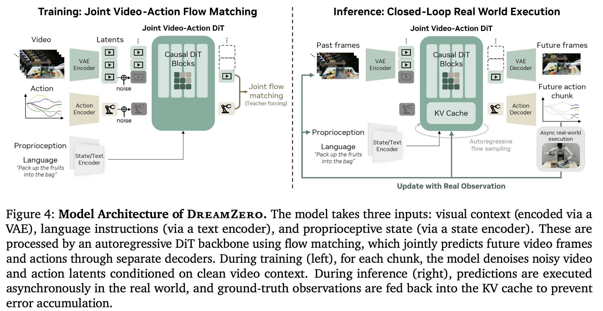

[世界模型 EP01：对话高深远——DreamZero&DreamDojo 世界模型与机器人智能的新范式](https://mp.weixin.qq.com/s/7CbHuCTeDRhyY_CoDJtQzA)

## [(20260323, Fast-WAM) Fast-WAM: Do World Action Models Need Test-time Future Imagination?](https://arxiv.org/pdf/2603.16666)
本文探讨了世界动作模型（WAMs）在具身控制中的作用，特别是其在测试阶段是否必须依赖显式的未来想象。传统 WAM 通常采用“先生成未来视频再执行动作”的范式，这种方法虽然有效，但由于需要迭代式视频去噪，导致推理延迟较高。作者提出 Fast-WAM，用于区分训练阶段的视频建模与测试阶段的未来生成的作用：该方法在训练时保留视频联合训练，但在推理时不再生成未来观测，从而实现实时控制。实验结果表明，Fast-WAM 在多个仿真与真实任务中依然能够达到与主流方法相当甚至接近的性能，同时显著降低延迟（约 190 毫秒，比传统方法快 4 倍以上）。进一步对比分析发现，模型性能下降主要来自于去除训练阶段的视频共训练，而非去掉测试时的未来想象。这说明 WAM 的关键收益更多来自于视频建模对表征学习的提升，而非推理阶段的显式未来生成。

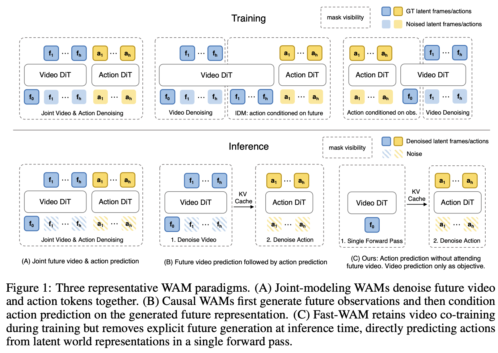

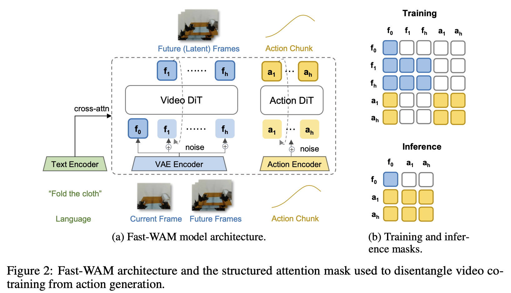

## [DiT4DiT: Jointly Modeling Video Dynamics and Actions for Generalizable Robot Control](https://arxiv.org/abs/2603.10448)

**视觉-语言-动作（VLA）模型虽在机器人学习中展现出潜力，但其表征大多来源于静态图文预训练，缺乏对物理动态的建模能力，因而不得不依赖有限的动作数据进行补充学习。相比之下，生成式视频模型天然蕴含丰富的时空结构与隐式物理规律，为机器人操作提供了更优的建模基础。** 为此，本文提出 DiT4DiT，一种统一的端到端视频-动作模型（VAM），通过双 Diffusion Transformer（DiT）架构，将视频生成与动作预测耦合在同一框架中。具体而言，模型在视频去噪过程中提取未来帧生成的中间潜在特征，并将其作为具有时间一致性的条件用于动作学习，使策略能够直接依赖于视觉动态所刻画的物理交互过程。同时，提出基于双流匹配（dual flow-matching）的联合训练方法，为视频与动作模块分别设置独立的时间步与噪声尺度，实现两者的协同或解耦优化，并将多阶段去噪得到的视频潜变量有效传递至动作空间。该设计避免了传统多阶段训练的割裂问题，显著提升训练效率与收敛速度。在仿真与真实环境中，DiT4DiT 均取得了领先性能，在 LIBERO 和 RoboCasa 等基准上达到更高成功率，并在真实机器人上表现出更强的泛化能力，同时显著降低数据需求并加快收敛。

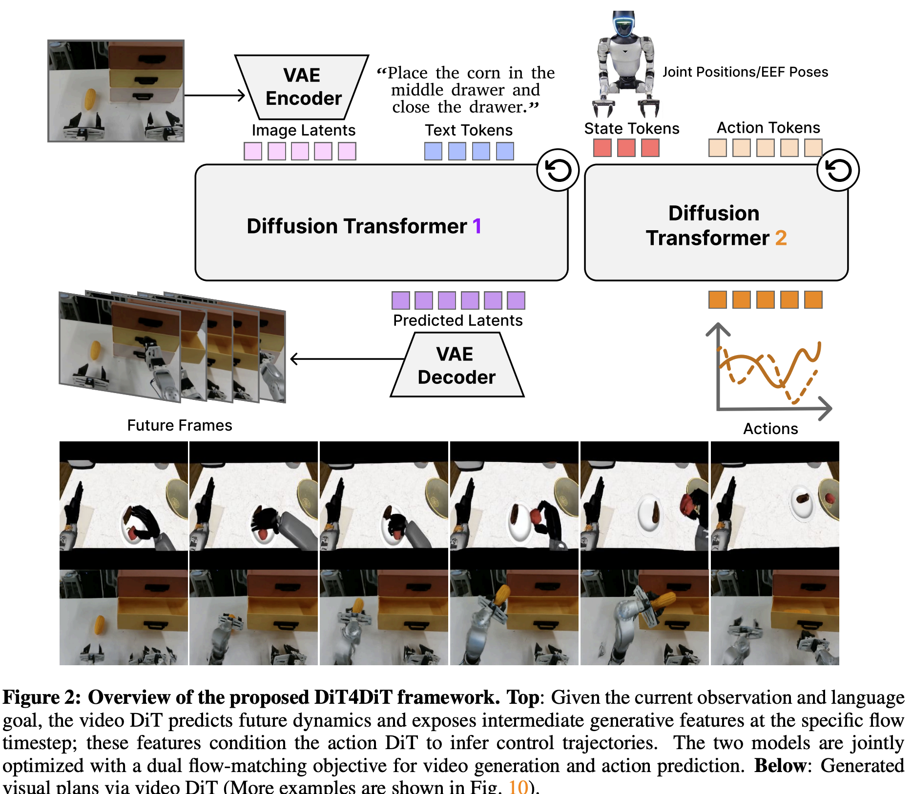

## [Do World Action Models Generalize Better than VLAs? A Robustness Study](https://arxiv.org/pdf/2603.22078)
###  Abstract
现实世界中的机器人动作规划不仅需要理解当前环境状态，还需要预测其在执行动作后的演化。视觉-语言-动作（VLA）模型通过复用大规模视觉语言模型生成机器人动作，在多种任务中取得了良好效果，但其性能受限于训练数据规模，在未见场景和复杂扰动下泛化能力有限。近年来，基于世界模型的世界动作模型（WAM）重新受到关注，这类方法利用大规模视频数据学习未来视觉状态的动态预测，并将其潜在表示解码为机器人动作。得益于显式的动态建模能力以及从互联网视频中获得的时空先验，WAM 在泛化方面表现出更强优势。本文对当前先进的 VLA 方法与 WAM 进行系统对比，在 LIBERO-Plus 和 RoboTwin 2.0-Plus 基准及多种视觉和语言扰动下进行评估。结果表明，WAM 具有更强的鲁棒性，例如 LingBot-VA 在 RoboTwin 2.0-Plus 上达到 74.2% 成功率，Cosmos-Policy 在 LIBERO-Plus 上达到 82.2%。相比之下，部分 VLA 方法虽在特定任务上表现接近，但通常依赖大量多样化数据和复杂训练策略。融合视频动态建模的混合方法表现居中，说明视频先验的引入方式至关重要。总体来看，WAM 在鲁棒性与泛化能力上更具潜力，但在实际部署中仍面临挑战。

## [WIMLE: Uncertainty‑Aware World Models with IMLE for Sample‑Efficient Continuous Control](https://openreview.net/pdf?id=mzLOnTb3WH)

为什么基于模型的强化学习（MBRL）在历史上一直很难超越强大的无模型（Model-free）基线算法。其核心痛点在于“复合展开误差”，即 AI 在利用内部模型进行多步未来推演时，预测误差会像滚雪球一样不断累积，最终导致训练产生偏差并误导策略的学习。作者将这种致命误差的根源归结为两个关键问题：第一，由于环境存在信息不全（部分可观测性）、密集的物理接触或固有的随机性，相同的“状态-动作”组合往往会产生不同甚至相互冲突的结果反馈，这让标准的预测模型难以应对；第二，模型在进行预测时缺乏对“不确定性”的感知能力，导致它在面对自身不熟悉或物理规律极度复杂的区域时表现得盲目自信。因此，尽管学术界曾进行过多次尝试来修正这些缺陷，但在实际操作中，MBRL 至今仍然无法稳定且持续地击败那些表现强劲的无模型算法。

这篇论文的核心逻辑：**既然模型“想象（推演）”出的未来数据不一定靠谱，那我们就根据模型对预测的“自信程度”来决定多大程度上相信这些数据。**

### 1. 核心思想 (The Key Idea)
在模型进行推演 (rollout) 时，它不仅会预测下一个状态，还会输出一个**预测不确定性 (Predictive Uncertainty)**，记为 $\sigma(s, a)$。
* 如果模型对这一步预测非常有把握（$\sigma$ 小），在训练时就给这条数据**高权重**。
* 如果模型对这一步预测很没底（$\sigma$ 大），在训练时就给这条数据**低权重**。
* **自然衰减：** 因为在连续推演中，误差会累积，越往后的预测模型自然越不确定。因此，这种机制会自动降低推演轨迹中靠后步骤的权重，有效遏制了复合误差的负面影响。

### 2. 不确定性的计算 (Uncertainty Estimation)
在基于模型的强化学习（MBRL）中，判断“什么时候该相信模型的预测”是防止策略跑偏的关键。WIMLE 并没有像以往的方法（例如直接截断不可靠推演的 Infoprop）那样采取一刀切的策略。相反，它选择了一种更平滑、更优雅的方式：**为模型生成的每一步虚拟推演计算一个“置信度（不确定性）”，并将这个置信度直接作为权重，融入到强化学习的优化目标中。** 这样一来，既保留了宝贵的推演数据，又有效抑制了糟糕预测带来的偏差。

#### 怎么计算不确定性？（集成 + 采样）
WIMLE 使用一个单一的标量 $\sigma(s, a)$ 来反映模型对预测下一步的“没底程度”。
为了得到这个值，作者采用了两层机制：

1. **模型集成 (Ensemble)：** 同时维护 $K$ 个独立的 IMLE 世界模型。
   
2. **潜在采样 (Latent Sampling)：** 对于每一个模型，输入 $m$ 个不同的随机潜在噪声（Latent samples）来生成预测。

把这 $K \times m$ 个预测结果汇总起来，计算它们的**标准差 (Standard Deviation)**，就得到了不确定性指标：
$$\sigma(s, a) = \text{std}_{k,j} \left[g_{\theta_k}(s, a, z_j) \right]$$

#### 理论深度：方差的优雅拆解
这段内容最精彩的理论贡献在于，它利用“全方差定律 (Law of total variance)”，将总的预测方差 $\sigma^2(s, a)$ 拆解成了两个本质完全不同的部分：

$$\sigma^2(s, a) = \underbrace{\text{Var}_k \left[ \mathbb{E}_z \left[g_{\theta_k}(s, a, z) \right] \right]}_{\text{模型集成 / 认知不确定性}} + \underbrace{\mathbb{E}_k \left[ \text{Var}_z \left[g_{\theta_k}(s, a, z) \right] \right]}_{\text{潜在采样 / 偶然不确定性}}$$

* **认知不确定性 (Epistemic Uncertainty)：** 左侧代表由于“见识少”带来的不确定性。当训练数据不足时，几个不同的集成模型（模型 $k$ 之间）会产生分歧，导致方差变大。随着数据喂入，这部分不确定性是可以被消除的。
  
* **偶然不确定性 (Aleatoric Uncertainty)：** 右侧代表“世界固有的随机性”。物理环境本身可能是多模态的（同一个动作可能有多种合理结果），这部分方差是通过输入不同的隐变量 $z$ 来捕捉的，即使模型训练得再完美，这部分客观存在的随机性也无法消除。

通过这种方式，WIMLE 的不确定性估计不仅在工程上极具指导意义（对应平方误差损失下的贝叶斯风险），在统计学基础上也十分严谨。

### 3. 权重的数学设计
理论上（基于异方差回归的统计学原理），最优的权重应该与方差的倒数成正比（即 $\propto 1/\sigma^2$）。但在实际的深度学习训练中，直接用倒数很容易导致权重过大，引发“梯度爆炸”。

为了保证训练的稳定性，作者设计了一个有界的替代公式：
$$w(s, a) = \frac{1}{\sigma(s, a) + 1}$$
* **精妙之处：** 当不确定性 $\sigma = 0$（完全确定）时，权重 $w = 1$（满分信任）。随着 $\sigma$ 增大，权重逐渐向 $0$ 递减。这既保留了“越不确定权重越小”的排序关系，又将权重严格限制在了 $(0, 1]$ 的区间内，非常安全。

### 4. 结合到强化学习的损失函数中
算出了每一步的权重 $w_i$ 后，怎么用在强化学习的训练里呢？作者修改了 Critic 网络（评估状态价值的网络）的时间差分（TD）损失函数（公式 15）：
$$\mathcal{L}_{\text{critic}} = \mathbb{E}_{(s_i, a_i, r_i, s'_i) \sim \mathcal{D}} \left[w_i \cdot \delta_i^2 \right]$$
* 这里的 $\delta_i$ 是标准的 TD 误差。
* 在计算每一条**合成数据（模型想象出来的数据）**的损失时，直接乘上前面算出的权重 $w_i$。
* **特别注意：** 论文提到，如果这条数据是来自**真实环境**的交互，因为它是绝对真实的，不存在模型预测的误差，所以直接强制令权重 $w_i = 1$。

这种做法的优势：它允许算法继续享受 MBRL “利用合成数据提高样本效率” 的巨大红利，同时又给 TD 更新上了一把安全锁。那些高方差、不确定的“糟糕想象数据”对神经网络参数更新的影响被大幅削弱了，从而在不丢弃任何数据、也不引入人为偏差的情况下，驯服了那些充满噪音的更新信号。

## [Uncertainty-Aware Robotic World Model Makes Offline Model-Based Reinforcement Learning Work on Real Robots](https://arxiv.org/pdf/2504.16680)

Static datasets are often biased toward the behavior policy that generated them and cover a narrow subset of the state-action space. These issues lead to distribution shift, where deployed policies encounter states outside the dataset’s support, making predictions unreliable. Some model-free offline RL methods mitigate this by enforcing strict constraints to keep the policy within the dataset’s support, but at the cost of limiting generalization beyond observed transitions. In contrast, model-based RL (MBRL) tackles the problem by learning a predictive dynamics model and applying techniques such as uncertainty-aware modeling and uncertainty-penalized policy optimization to reduce the risk of unreliable predictions. While these methods have shown success in controlled simulation benchmarks, their reliable deployment in real robotics remains challenging, as noisy, biased, and partially observed datasets demand both accurate long-horizon modeling and stable policy learning, thereby constraining the applicability of existing methods to the real world.

### 研究背景

离线强化学习（Offline Reinforcement Learning, Offline RL）的核心设定是：智能体不能像在线强化学习那样与环境持续交互，而只能依赖一个已经收集好的固定数据集进行训练。这个数据集通常由一个或多个行为策略采集而来，包含有限数量的状态、动作、奖励和下一状态转移样本。由于数据集是静态的，智能体在训练过程中无法主动探索新的状态和动作，也无法通过试错来修正自身策略。因此，离线强化学习的性能很大程度上取决于已有数据的质量、覆盖范围以及数据分布是否足够接近未来部署时智能体会遇到的真实环境分布。

然而，静态数据集往往存在明显的偏差。因为数据是由特定的行为策略生成的，所以它天然更集中于这些行为策略曾经访问过的状态和动作区域，而无法全面覆盖整个状态—动作空间。如果数据集中的行为策略本身能力有限、探索不足，或者采集环境过于单一，那么最终得到的数据就会只覆盖真实环境中的一小部分情况。这会导致一个关键问题：当训练好的策略被部署到真实环境中时，它可能会遇到训练数据中很少出现甚至完全没有出现过的状态或动作组合。此时，价值函数、策略函数或动力学模型都需要对数据集支持范围之外的区域进行预测，而这些预测往往是不可靠的。这种训练数据分布与部署时实际访问分布不一致的问题，通常被称为分布偏移（distribution shift）。

分布偏移是离线强化学习中的核心难点之一。在线强化学习可以通过不断与环境交互来发现错误、修正估计并收集新数据，而离线强化学习没有这种机会。一旦策略在训练过程中学到了某些看似高价值、但实际上位于数据分布之外的动作，它就可能在部署时产生严重的外推误差（extrapolation error）。这类误差会被策略优化过程进一步放大，因为策略会倾向于选择模型或价值函数错误高估的动作，从而导致最终策略偏离真实可行的行为范围。

#### 现有方法一：模型无关离线强化学习及其局限性

一类主流方法是模型无关离线强化学习（model-free offline RL）。这类方法不显式学习环境的动力学模型，而是直接从固定数据中学习价值函数或策略。为了应对离线数据带来的分布偏移问题，许多模型无关方法采用保守约束或行为克隆式约束，使学习到的策略尽量不要偏离数据集中已有行为策略的支持范围。换句话说，这些方法会限制策略只能选择那些在数据集中出现过、或者与数据集中动作比较接近的行为。

这种思路的优点是相对安全。由于策略被约束在数据分布附近，它不太容易选择完全没有数据支撑的动作，因此可以减少外推误差和价值过估计问题。在数据质量较高、行为策略本身较强的情况下，这类方法往往能够稳定地学习出不错的策略。

但它的局限性也很明显。过强的保守约束会限制策略的泛化能力。也就是说，智能体虽然可以避免做出数据之外的危险动作，但也很难发现比原始行为策略更优的行为。如果数据集中的行为策略本身表现一般，或者数据只包含有限的轨迹，那么模型无关离线强化学习方法往往只能在已有经验附近做小幅改进，而难以真正超越数据中观察到的转移模式。因此，这类方法在安全性和泛化性之间存在明显矛盾：约束越强，策略越稳定，但越难泛化；约束越弱，策略可能更有潜力，但也更容易产生分布外错误。

#### 现有方法二：基于模型的强化学习及其优势

另一类方法是基于模型的强化学习（Model-Based Reinforcement Learning, MBRL）。与模型无关方法不同，MBRL 会先学习一个预测环境动态的模型，也就是通常所说的世界模型或动力学模型。这个模型用于预测在某个状态下采取某个动作之后，环境会转移到什么状态、获得什么奖励。学习到动力学模型之后，智能体可以在模型内部进行“想象式”训练，也就是通过模型生成合成轨迹，再利用这些虚拟交互数据来优化策略。

在离线强化学习场景中，MBRL 的吸引力在于它可以在不真实接触环境的前提下扩展有效训练数据。静态数据集本身覆盖范围有限，但如果模型能够较准确地学习环境规律，那么智能体就可以利用模型模拟更多状态转移，从而在一定程度上缓解数据稀缺和覆盖不足的问题。这使得 MBRL 相比纯模型无关方法具有更强的样本效率和潜在泛化能力。它不只是被动模仿已有数据，而是尝试从已有数据中学习环境结构，并基于这种结构推演新的可能轨迹。

尤其是在离线任务中，MBRL 可以通过短步长模型 rollout、模型集成、不确定性估计等方式，在一定程度上平衡探索性和安全性。它既不完全受限于原始数据轨迹，又可以通过模型不确定性来判断哪些区域可能不可靠，从而避免过度依赖错误预测。

#### 现有方法三：不确定性感知建模与不确定性惩罚策略优化

为了降低模型预测错误带来的风险，许多基于模型的离线强化学习方法引入了不确定性感知建模（uncertainty-aware modeling）。这类方法通常会估计模型对不同状态—动作区域的预测置信度。如果某些状态或动作附近有大量数据支撑，模型预测通常更可靠；如果某些区域远离训练数据分布，模型的不确定性就会升高。通过显式估计这种不确定性，智能体可以知道哪些模型预测更可信，哪些预测可能存在较大风险。

在策略优化阶段，研究者还会使用不确定性惩罚（uncertainty penalty）。具体来说，当策略选择的动作会把智能体带到模型高度不确定的区域时，算法会降低这些动作或轨迹的价值估计，从而鼓励策略留在模型较有把握的区域。这种方法并不是像模型无关保守方法那样简单地把策略限制在数据集支持范围内，而是通过模型的不确定性来进行更细粒度的风险控制。它允许策略在一定程度上泛化到未完全观察过的区域，但同时避免过度依赖模型无法可靠预测的区域。

这类方法的优势在于，它比严格的数据支持约束更灵活，也比完全自由的模型 rollout 更安全。它试图在“利用模型进行泛化”和“避免模型错误累积”之间取得平衡。因此，在许多受控仿真基准中，这类方法已经展现出较好的效果。

#### 基于模型方法的核心局限性

尽管 MBRL 在理论上能够缓解离线数据覆盖不足的问题，但它自身也面临严重挑战。最主要的问题是模型误差会在长时序预测中不断累积。即使模型在单步预测上表现不错，当它连续预测很多步之后，小的误差也可能逐渐放大，最终导致合成轨迹偏离真实环境。这种错误轨迹如果被用于策略优化，就会引入偏差，甚至让策略学到在真实环境中不可行或危险的行为。

这一问题在长时序任务中尤其突出。强化学习任务通常不是只关注下一步预测，而是关注一连串动作带来的长期回报。如果模型不能准确预测长时间范围内的状态演化，那么基于模型生成的训练数据就可能误导策略学习。因此，准确的长时序建模是 MBRL 在离线强化学习中能否成功的关键。

此外，模型不确定性估计本身也并不容易。模型可能在某些区域表现出过度自信，即虽然预测是错误的，但不确定性估计却很低。相反，模型也可能对一些实际上可行的区域过度保守，导致策略错失潜在的高价值行为。因此，不确定性感知方法虽然能够减少风险，但并不能完全解决模型误差问题。

#### 真实机器人场景中的挑战
在受控仿真环境中，数据往往相对干净，状态可观测性较强，环境动力学较稳定，任务边界也更清晰。因此，许多离线 MBRL 方法可以在这些 benchmark 上取得较好结果。但真实机器人场景要复杂得多。真实数据通常存在噪声、偏差、传感器误差、动作执行误差以及部分可观测问题。机器人采集到的数据可能并不能完整反映环境真实状态，而只是一些受传感器限制的观测结果。

同时，真实机器人的动力学往往更复杂。接触、摩擦、物体形变、执行器延迟、环境变化等因素都会增加建模难度。一个在仿真中表现良好的模型，迁移到真实机器人时可能会因为现实环境中的细微差异而失效。更重要的是，机器人任务对安全性和稳定性要求很高。如果策略在真实环境中因为模型误差采取了错误动作，可能造成硬件损坏、任务失败，甚至带来安全风险。

因此，虽然基于模型的离线强化学习为解决静态数据偏差和分布偏移提供了一条有前景的路径，但其真实部署仍然受到明显限制。要让这类方法真正适用于真实机器人系统，不仅需要更准确的长时序动力学建模，还需要更可靠的不确定性估计、更稳定的策略优化机制，以及能够处理噪声、偏差和部分可观测数据的鲁棒学习框架。

#### the trade-off between policy improvement and model reliability
It is essential to balance the trade-off between policy improvement and model reliability: leveraging model-based imagination to explore high-return policies beyond the support of the dataset while mitigating the risk of policy degradation due to overfitting to model errors in regions with high uncertainty.

Policy improvement 指的是：学出来的策略不能只是复制数据集里的行为策略，而是要比原来的行为策略更好。policy improvement 需要策略有一定探索和外推能力。Model reliability 指的是：世界模型 / 动力学模型预测出来的状态转移、奖励和长期结果是否可信。model reliability 要求策略尽量待在模型有把握的区域里。

想提升策略，就要尝试数据之外可能更优的动作；想保证模型可靠，就要避免进入数据之外不确定的区域。如果太追求 policy improvement，允许策略在模型中大胆 imagination，它可能会找到一些看起来回报很高的轨迹。但这些高回报可能不是真实存在的，而是模型在不熟悉区域犯错造成的“假高分”。

例如模型错误地预测：机器人手臂用某个奇怪角度移动，可以瞬间抓住物体，而且不会碰撞。

策略看到这个预测后，就会不断利用这个“漏洞”。在模型里它表现很好，但放到真实机器人上可能直接失败。这就是 overfitting to model errors：策略不是学到了真实世界的好动作，而是学会了钻模型错误的空子。反过来，如果你太强调 model reliability，强行让策略只在数据集支持范围内行动，那么模型预测确实更可信，但策略只能接近原始数据中的行为，难以发现更好的策略。这样就牺牲了 policy improvement。

总之，这种权衡产生的原因在于，策略改进通常需要智能体利用模型生成的 rollout，探索离线数据集经验支持范围之外的潜在高回报行为；然而，这些分布外区域恰恰是学习到的动力学模型最不可靠的地方，因为模型在这些区域缺乏足够的训练样本。因此，过于激进的策略优化可能会过拟合模型的错误预测，使策略在想象环境中表现良好，但在真实环境中退化。相反，过于保守的约束虽然可以通过让策略接近数据分布来提高模型预测可靠性，却会限制策略发现优于数据集中行为策略的新行为。

### 基于不确定性感知的机器人世界模型与离线策略优化
论文提出了 Uncertainty-Aware Robotic World Model，简称 RWM-U。它的核心思想是在原有 Robotic World Model，简称 RWM，的动力学模型基础上显式引入不确定性估计，使模型不仅能够预测下一步观测，还能够判断自己对预测结果是否有把握。这样，策略在利用世界模型进行想象式训练时，就可以根据模型的不确定性调整优化方向，避免在高不确定区域中被错误预测误导。RWM-U 的目标是设计一个不确定性估计器，同时捕捉两类不确定性：认知不确定性和偶然不确定性。认知不确定性，epistemic uncertainty，主要来自训练数据不足。当某些状态--动作区域在离线数据集中很少出现，模型对这些区域的预测就会缺乏把握。偶然不确定性，aleatoric uncertainty，则来自环境本身的随机性。即使训练数据充足，真实环境也可能由于传感器噪声、执行误差或环境随机变化而表现出不可消除的不确定性。

为了同时建模这两类不确定性，RWM-U 引入了 bootstrap ensemble 的结构。具体来说，模型首先通过一个共享的循环特征提取器，例如 GRU，对历史观测和动作信息进行编码，得到隐藏特征表示。随后，在观测预测头部分使用多个 ensemble 成员，每个成员独立地预测下一步观测的高斯分布参数。对于第 $b$ 个 ensemble 成员，其预测形式为：

$$
o_{t+k}^{\prime b} \sim \mathcal{N}
\left(
\mu_{o_{t+k}}^{b},
\sigma_{o_{t+k}}^{2,b}
\right),
\tag{3}
$$
其中，$\mu_{o_{t+k}}^{b}$ 表示第 $b$ 个 ensemble 成员预测的下一时刻观测均值，$\sigma_{o_{t+k}}^{2,b}$ 表示对应的预测方差。这里的方差项主要用于刻画偶然不确定性，也就是模型认为环境本身存在多大随机波动。

这种设计可以理解为：同一个历史状态和动作输入会被送入多个预测头，每个预测头都会给出自己对未来观测的预测。如果多个预测头给出的结果比较接近，说明模型整体比较有把握；如果不同预测头之间分歧很大，说明模型对当前区域缺乏足够训练证据，也就是认知不确定性较高。

在训练阶段，模型的目标函数是对所有 ensemble 成员的损失取平均。这样，每个成员都参与动力学学习，但由于 bootstrap ensemble 的机制，不同成员会形成略有差异的预测结果。这种差异正好可以在推理阶段用于估计认知不确定性。

### 推理阶段的不确定性估计

在推理阶段，RWM-U 使用所有 ensemble 成员预测均值的平均值作为最终的下一步观测预测结果。具体公式为：

$$
o_{t+1}^{\prime}
=\mathbb{E}_{b}\left[\mu_{o_{t+1}}^{b}\right]. \tag{4a}
$$
也就是说，最终预测不是直接采用某一个单独模型的结果，而是把多个 ensemble 成员的预测均值进行平均，从而得到更稳定的预测。

同时，RWM-U 使用不同 ensemble 成员预测**均值**之间的方差来估计认知不确定性：

$$
u_{t+1}=u_{p_{\phi}}\left(o_{t-M+1:t},a_{t-M+k:t}\right)=\mathrm{Var}_{b}\left[\mu_{o_{t+1}}^{b} \right]. \tag{4b}
$$

其中，$u_{p_{\phi}}$ 表示由世界模型 $p_{\phi}$ 产生的不确定性估计，$o_{t-M+1:t}$ 表示一段历史观测序列，$a_{t-M+k:t}$ 表示对应的动作序列。$\mathrm{Var}_{b}[\cdot]$ 表示在不同 ensemble 成员之间计算方差。

这个公式的含义非常重要：如果多个 ensemble 成员对下一步观测的预测差异很大，那么 $\mathrm{Var}_{b}$ 就会较大，说明模型对这个状态--动作区域没有足够把握；如果多个成员预测比较一致，那么不确定性就较低，说明该区域更接近训练数据分布，模型预测更可靠。因此，RWM-U 不只是一个普通的动力学预测模型，而是一个能够判断自身预测可靠性的世界模型。通过显式量化认知不确定性，模型可以在长时序 rollout 过程中持续传播不确定性信息，使后续策略优化能够区分“可信的想象轨迹”和“不可信的想象轨迹”。

### 基于不确定性惩罚想象的策略优化
在获得不确定性感知的世界模型之后，论文进一步提出了基于不确定性惩罚想象的策略优化方法，即 MOPO-PPO。它可以理解为将 MOPO 框架中的不确定性惩罚思想，与 PPO 的策略优化机制结合起来。在离线 MBRL 中，策略通常会利用世界模型生成的 imagined rollouts 进行训练。这样做的好处是，策略可以不局限于原始离线数据，而是通过模型想象探索更高回报的行为。但是，问题也随之出现：如果某些想象轨迹处于模型高不确定性区域，模型给出的高回报预测可能是错误的。策略如果直接最大化这些预测回报，就可能过拟合模型错误，从而在真实环境中表现很差。因此，MOPO-PPO 对原始奖励函数进行了修改，在奖励中加入一个由模型不确定性决定的惩罚项。修改后的奖励函数为：

$$
\tilde{r}(o_t, a_t)=r_t(o_t, a_t)-\lambda u_{p_{\phi}}\left(o_{t-M+1:t},a_{t-M+k:t}\right),\tag{5}
$$

其中，$\tilde{r}(o_t, a_t)$ 表示经过不确定性惩罚后的奖励，$r_t(o_t, a_t)$ 表示原始奖励，$u_{p_{\phi}}(\cdot)$ 表示世界模型估计出的认知不确定性，$\lambda$ 是控制惩罚强度的超参数。

这个公式的直观含义是：如果某个状态--动作转移的模型不确定性很高，那么即使模型预测它有较高奖励，最终用于策略优化的奖励也会被扣减。$\lambda$ 越大，说明算法越保守，越不愿意相信高不确定区域中的模型预测；$\lambda$ 越小，说明算法越激进，更愿意利用模型想象去探索数据集之外的高回报策略。

因此，MOPO-PPO 的关键作用是让策略更关注世界模型高置信度区域中的行为，而不是盲目追逐模型在不可靠区域中预测出的虚假高回报。它并不是完全禁止策略走出数据集分布，而是允许策略进行谨慎泛化：当模型对某些区域仍然有较高置信度时，策略可以利用这些模型生成的轨迹进行改进；当模型不确定性较高时，策略会受到惩罚，从而减少对这些区域的依赖。

### 为什么这种设计能够缓解离线强化学习中的分布偏移

离线强化学习中的分布偏移问题，本质上来自训练数据和策略实际访问状态之间的不一致。传统保守型离线 RL 方法通常通过约束策略接近行为策略来降低风险，但这会限制策略提升空间。RWM-U 和 MOPO-PPO 的设计则提供了一种更灵活的方式：不是简单要求策略永远待在数据分布内部，而是让模型告诉策略哪些区域可靠、哪些区域不可靠。

当策略在世界模型中进行 rollout 时，RWM-U 会持续输出预测观测和对应的不确定性。如果策略进入了训练数据覆盖较好的区域，不同 ensemble 成员的预测会比较一致，不确定性较低，惩罚较小，策略可以正常利用这些轨迹进行优化。如果策略进入了训练数据稀疏、模型预测分歧较大的区域，不确定性会升高，奖励会被惩罚，策略就不容易被这些不可靠预测吸引。

因此，这一方法在 policy improvement 和 model reliability 之间建立了一个动态平衡。一方面，模型想象允许策略探索数据集支持范围之外的潜在高回报行为，从而实现比行为策略更好的性能；另一方面，不确定性惩罚可以抑制策略对模型错误的过拟合，避免策略在高不确定区域中获得虚假的高回报信号。

整体来看，RWM-U 和 MOPO-PPO 的流程可以概括为：首先使用离线数据训练一个带有 ensemble 预测头的机器人世界模型，使其能够预测未来观测分布；然后在推理和 rollout 阶段，使用 ensemble 均值作为下一步观测预测，并使用 ensemble 成员之间的预测方差作为认知不确定性估计；接着，在模型生成的想象轨迹中，根据不确定性对奖励进行惩罚；最后，使用 PPO 在这些经过不确定性惩罚的 imagined rollouts 上进行策略优化。这种方法的核心贡献不只是提高模型预测能力，而是把不确定性显式接入到策略优化过程中。也就是说，世界模型不再只是一个用于生成未来轨迹的模拟器，而是一个带有置信度判断的模拟器。策略也不再单纯最大化模型预测回报，而是在考虑模型可靠性的前提下进行优化。

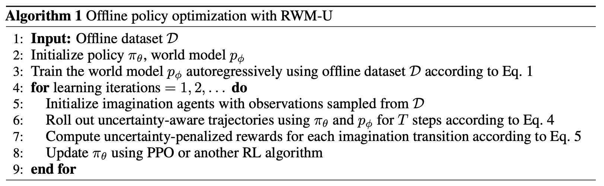

## [Mixture of Horizons in Action Chunking](https://arxiv.org/pdf/2511.19433)
现有 VLA 模型通常会预测一个固定长度的 action chunk：$A_t=(a_t,a_{t+1},...,a_{t+H-1})$

这里的 (H) 就是 action horizon / chunk horizon。论文发现，VLA 对这个 (H) 非常敏感：短 horizon 更适合精细控制，但缺少长程规划能力；长 horizon 能提供更强的全局 foresight，但会降低短期动作精度。论文在 LIBERO 上比较 (H=10,20,30)，发现不同 task suite 的最优 horizon 不一样，固定单一 horizon 会造成泛化瓶颈。论文摘要也明确指出：longer horizons provide stronger global foresight but degrade fine-grained accuracy, shorter ones sharpen local control but struggle on long-term tasks。

所以这篇工作的核心问题是：

> 能不能让一个模型同时具备短 horizon 的精细控制能力和长 horizon 的长程规划能力？

### 方法核心：Mixture of Horizons, MoH

论文提出 **Mixture of Horizons，MoH**。它的思路是：不要只训练一个固定 horizon，而是把同一个 action chunk 切成多个不同长度的 horizon 分支，让它们共享 action transformer，并通过一个轻量 gate 融合不同 horizon 的预测。

假设最大 horizon 是：$H$, 候选 horizon 集合是：$\mathcal{H}={h_1,h_2,...,h_N}, \quad h_N=H$, 对于真实 action chunk：$A_t=(a_{t,1},...,a_{t,H})$, 对每个候选 horizon (h)，构造一个截断版本：$A_t^{(h)}=(a_{t,1},...,a_{t,h})$。训练时，不同 horizon 共享同一个视觉语言上下文和同一个 action transformer。为了并行计算，短 horizon 会 padding 到最大长度 (H)，并用 horizon-specific attention mask 把超过该 horizon 的位置屏蔽掉。论文强调，VLM prefix 只计算一次，而 action transformer 比较轻，因此训练和推理开销很小。

### Gated Mixture：如何融合不同 horizon？

每个 horizon 分支都会输出自己的动作预测：$\hat{A}^{(h)}_t=(\hat{a}^{(h)}_{t,1},...,\hat{a}^{(h)}_{t,h})$，然后使用一个很轻的 linear gate head，对每个 step (k) 和 horizon (h) 产生权重：
$\alpha_{t,k,h}$. 只有满足 $k \le h$ 的 horizon 才对第 $k$ 步有效。最终第 (k) 步动作是不同 horizon 预测的加权和：

$\hat{a}_{t,k} = \sum_{h \in \mathcal{H}: k\le h} \alpha_{t,k,h}\hat{a}^{(h)}_{t,k}$

这个设计的含义是：第一个动作既可以参考短 horizon 分支，也可以参考长 horizon 分支；而越靠后的动作只能由覆盖到该时间步的长 horizon 分支提供。论文说这个 gate head 只有约 2k 额外参数，几乎不增加模型规模。

### 训练目标

MoH 不是替换原来的 VLA 训练目标，而是兼容原本的 policy loss。如果底层是 flow-matching policy，例如 $\pi_0$、$\pi_{0.5}$，那么它的基础训练目标仍然是 flow-matching loss。论文中标准 flow-matching 是：从 Gaussian noise chunk $\epsilon$ 到真实 action chunk $A_t$ 做线性插值，学习速度场：

$\mathcal{L}_{fm}(\theta)=\mathbb{E}_{\epsilon,\tau}\left[\left |v_\theta(A_t^{(\tau)},\tau,V_t,h_{<t},T,s_t) - u(\epsilon,A_t)\right |_2^2 \right]$

如果底层是 one-step regression policy，则可以用 L1 regression loss：

$\mathcal{L}_{reg} = \sum_{k=1}^{H}\sum_{d=1}^{d_a}|\hat{A}_{t,k,d}-A_{t,k,d}|$

MoH 最终训练目标由三部分组成：
$\mathcal{L} = \mathcal{L}_{mix}+\lambda_{ind}\mathcal{L}_{ind}+\lambda_{bal}\mathcal{L}_{bal}$

其中：
* $\mathcal{L}_{mix}$：融合后动作预测的主损失；
* $\mathcal{L}_{ind}$：每个 horizon 分支自己的预测损失；
* $\mathcal{L}_{bal}$：balance loss，防止 gate 只依赖某几个 horizon，导致其他 horizon 退化。

论文中 $\lambda_{ind}=1$，$\lambda_{bal}=10^{-3}$。

### Dynamic Inference：推理时如何自适应执行？

MoH 不只是在训练中融合多 horizon，它还提出了一个 **dynamic inference via cross-horizon consensus**。

推理时，不同 horizon 分支都会给出对未来动作的预测。论文把每个 horizon 看作一个 voter。如果多个 horizon 对某一步动作预测一致，说明这一步比较稳定，可以执行；如果不同 horizon 的预测分歧变大，说明后面的动作不可靠，应该截断当前 chunk，后续留给下一次重新规划。

具体来说，对每个 step (k)，计算 fused action 和各个 horizon-wise action 的加权 L1 disagreement：

$\bar{d}_k = \sum_{h\in \mathcal{H}_k} \alpha_k|\hat{a}-\hat{a}_k|$

然后用前 (n) 步的平均 disagreement 乘以 scaling ratio (r) 得到阈值。接着从第 (n+1) 步开始，如果：$\bar{d}_k > \text{threshold}$ 或者可用 horizon 数量不足，就停止，把前面一致的动作作为 executable prefix 执行。论文称这会形成一个 **self-truncating executable chunk**：只执行跨 horizon 一致的前缀，把不确定的后缀留到下一次重规划。

直观理解：

> 多个 horizon 都同意的动作，可以放心执行；
> 不同 horizon 开始分歧的位置，就是应该停止并重新规划的位置。

### 实验结果

论文在 **LIBERO、RoboTwin2.0 和真实机器人任务** 上评估，并使用了三类底层 policy：flow-based $\pi_0$、$\pi_{0.5}$，以及 one-step regression policy $\pi_{reg}$。

在 LIBERO 上，MoH 提升很明显。论文表 1 中：

* $\pi_{reg}$：平均成功率从 95.2% 提升到 96.4%；
* $\pi_0$：平均成功率从 93.8% 提升到 95.1%；
* $\pi_{0.5}$：平均成功率从 97.7% 提升到 99.0%；
* $\pi_{0.5}$ with MoH 在 LIBERO-Object 达到 100%，LIBERO-Long 达到 98.4%。
  
论文还强调，$\pi_{0.5}$ with MoH 在 mixed-task setting 下只训练 30k iterations 就达到 LIBERO 平均 99% 成功率，声称达到新的 state-of-the-art。

在 dynamic inference 方面，论文报告 MoH 可以在提高 throughput 的同时保持高成功率。比如在 LIBERO-Long 上，dynamic inference 即使把 throughput 提高到默认 5-step 设置的 2.5×，仍然超过 baseline $\pi_{0.5}$。图 7/8 显示，MoH 在决策点和精细操作附近选择短 chunk，在平滑低风险运动中选择长 chunk。

真实机器人实验中，作者在 7-DoF 单臂平台上测试了 “put bread in bowl”“pour milk into cup”“put pen in drawer and close drawer”等任务。每个任务采集 30 条专家示范，训练 10k iterations，默认执行 predicted chunk 的前 5 个动作。实验显示 MoH 在三个真实任务和两个 base models 上都带来稳定提升，并减少犹豫和反复移动行为。

## [Adaptive Action Chunking at Inference-time for Vision-Language-Action Models](https://arxiv.org/pdf/2604.04161)

在 VLA 模型中，**action chunking** 指的是：模型一次生成一段未来动作序列，然后机器人连续执行其中若干步，而不是每一步都重新推理。

例如模型一次预测：$a_{t:t+H}$，如果执行 16 步，就是 chunk size = 16；如果执行 4 步，就是 chunk size = 4。

很多VLA中训练和推理使用相同 chunk size，例如 16 步。也有很多方法会训练模型预测较长动作序列，但推理时只执行前面一部分。模型训练时看到更长的未来动作结构，但执行时保持更高的闭环反馈频率。但是后面预测出来的动作没有被充分使用，长 horizon 训练能力被浪费了一部分。一般不会让推理执行长度超过训练长度。训练时的 action chunk size 决定模型能预测多长的动作序列；推理时的 chunk size 决定机器人实际连续执行多少步。理想的方向是：训练时学习足够长的 action horizon，推理时根据当前任务阶段自适应选择执行长度。


注意：在 VLA 中，训练时的 action chunk size 和 inference-time 执行的 chunk size 可以一样，也可以不一样。
问题是，固定 chunk size 很难适配所有任务。论文指出，大 chunk size 可以提升动作连续性和推理效率，但会降低模型对新观测的响应能力；小 chunk size 可以更频繁重新规划，但容易造成动作不连续、抖动。论文发现，不同任务对最优 chunk size 的需求不同，因此固定经验值往往是次优选择。

论文提出 **AAC**，即在推理阶段根据当前预测动作的不确定性，自适应决定本次执行多少个动作。

它的直觉是：

> 如果模型当前预测动作很确定，说明这一段动作比较可靠，可以执行更长的 chunk；

> 如果模型当前预测动作不确定，说明当前场景可能复杂或关键，需要执行更短的 chunk，并更快重新观察和规划。

论文用 **action entropy** 作为动作不确定性的度量。对于连续动作，例如机械臂的平移和旋转，使用高斯微分熵来计算不确定性；对于离散动作，例如夹爪开合，使用离散熵来计算不确定性。为了估计这些熵，AAC 会并行采样多个候选 action chunks，然后统计不同候选动作之间的分布差异。

假设机器人是 7-DoF 控制，包括：

```text
3-DoF translation
3-DoF rotation
1-DoF gripper
```

模型在当前观测下并行生成多组候选 action chunks。AAC 对每个未来时间步分别计算：

```text
translation entropy
rotation entropy
gripper entropy
```

然后对于不同候选 chunk size，计算平均 action entropy。接着，AAC 找到平均熵变化最大的点，并结合一个最小动作幅度约束，确定当前最优 chunk size。论文把这个过程总结为 Algorithm 1：先计算每个时间步的连续动作熵和离散夹爪熵，再计算不同 chunk size 下的平均熵，最后选择最合适的执行长度。

简单理解就是：

```text
动作预测稳定 → 熵低 → 执行更长 chunk

动作预测不稳定 → 熵高 → 执行更短 chunk，尽快重新规划
```

这和人类操作也类似：搬运阶段比较稳定，可以连续做很多动作；接近抓取、插入、按钮按压等关键阶段时，需要更频繁观察和微调。

这篇工作的一个重要特点是：

> **AAC 不需要额外训练，也不修改模型结构，只在 inference-time 工作。**

论文使用 **GR00T N1.5** 作为主要 VLA backbone。GR00T N1.5 是一个带有 flow-matching action head 的 VLA 模型，由 VLM 提取视觉语言特征，再由 Diffusion Transformer / flow-matching action head 生成动作 chunk。训练阶段仍然使用标准的 flow-matching loss，让 action head 学习从噪声中生成真实动作序列。

也就是说，原始 VLA 模型的训练方式不变：

```text
视觉观测 + 语言指令 + 机器人状态 → 预测未来 action chunk
```

AAC 只在推理阶段插入：

```text
生成多个候选 action chunks
→ 计算 action entropy
→ 自适应选择执行多少步
```

因此，它不是一个新的训练框架，而是一个 **training-free inference strategy**。

推理时，流程大致是：

1. 输入当前视觉观测、语言指令和机器人状态；
   
2. VLA 模型并行采样多个候选 action chunks；
   
3. 对这些候选动作计算 translation、rotation 和 gripper 的 action entropy；
   
4. 根据平均 action entropy 的变化趋势选择当前 chunk size；（“平均熵前后差”的意义：找到不确定性突然变大的边界，然后执行边界之前的动作。如果直接选平均熵最低的 chunk, 通常会偏向最小 h）
   
5. 执行前 (k) 个动作；
   
6. 重新获得新观测，再重复上述过程。

因此，chunk size 不再是固定的 4、8、16，而是随当前场景变化。

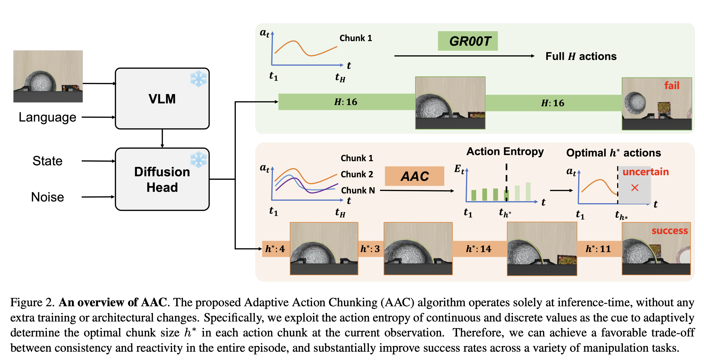

### 实验结果和结论

论文在 RoboCasa、LIBERO 和真实机器人任务上验证 AAC。实验显示，固定 chunk size 在不同任务上的表现差异明显，例如 LIBERO-Spatial 最适合的 chunk size 和 LIBERO-Goal 最适合的 chunk size 并不相同。AAC 则能够在不同任务中自适应选择更合适的执行长度。

在 RoboCasa 和 LIBERO 上，GR00T+AAC 获得了整体最优或接近最优的成功率。例如表 1 中，GR00T+AAC 在 RoboCasa 平均成功率为 62.0%，在 LIBERO 平均成功率为 95.0%，优于默认固定 chunk 的 GR00T。

论文还分析了计算成本。AAC 需要多个候选 action chunks 来估计熵，因此相比固定 chunk 会增加一些计算量。但由于候选动作可以 batch parallel 生成，额外开销较小。实验中，在单张 A800 GPU 上，样本数从 1 增加到 20 时，推理时间从 83.0ms 增加到 106.0ms，仍然可接受。

## [Open-Loop Planning, Closed-Loop Verification: Speculative Verification for VLA](https://arxiv.org/pdf/2604.02965)
这篇论文要解决的问题是：**VLA 模型推理很慢，但机器人控制需要高频反馈。**

传统有两种极端做法：

**第一种：每一步都调用大 VLA。**
这最稳，因为每一步都能根据最新观测重新决策；但代价太高，推理延迟大，不适合实时控制。

**第二种：action chunking。**
大 VLA 一次预测一长段动作：$A_t = [a_t, a_{t+1}, ..., a_{t+K-1}]$，然后机器人连续执行这段动作。这样推理次数少、效率高，但问题是中间不看新观测，属于 open-loop execution。一旦物体位置变化、抓取偏了、执行误差累积，后续动作仍然按照旧观测继续执行，容易失败。论文指出，当 chunk size 很大，例如 (K=64) 时，这种 temporal drift 和 error accumulation 会更严重。

这篇工作的核心思想是：

> **用大的 VLA 低频做 open-loop macro planning，用轻量 verifier 高频做 closed-loop verification。**

也就是：**计划可以低频，验证必须高频。**

###  什么是 Speculative Decoding？

**Speculative Decoding** 最早是大语言模型里的推理加速方法。它的基本思路是：

1. 用一个小模型，也叫 **draft model**，快速生成多个候选 token；
2. 再用一个大模型，也叫 **target model**，并行验证这些 token；
3. 如果候选 token 被大模型接受，就一次性前进多步；
4. 如果不接受，就回退或重新生成。

可以简单理解为：

> 小模型先“猜一串答案”，大模型再“快速检查是否靠谱”。

在语言模型中，这个方法有效，是因为 token 的验证只依赖文本上下文。候选 token 序列生成后，大模型可以在同一个上下文里并行打分，不需要外部环境反馈。论文也明确指出，标准 speculative decoding 中，draft model 生成候选序列后，heavy target model 可以并行验证，因为验证所需的上下文已经在 drafted sequence 中。

####  为什么 Speculative Decoding 不能直接用于机器人/VLA？

机器人控制和语言生成不同。语言生成里，下一个 token 是否合理，只取决于文本上下文；但机器人动作是否合理，取决于动作执行后真实环境发生了什么。

比如机器人计划：

```text
靠近杯子 → 夹住杯子 → 抬起杯子 → 放进篮子
```

在执行第一步后，真实情况可能是：

```text
杯子被碰歪了
```

那么后续“夹住杯子”的动作就不再合理。下一个观测 $I_{t+1}$ 是由当前观测、动作和真实环境动力学共同决定的。未来动作是否有效，必须等真实执行后拿到新观测才能判断，不能像语言 token 一样提前并行验证。

所以这篇论文认为：标准 speculative decoding 用在 VLA 上会有一个根本问题——它仍然基于 stale observation，也就是过期观测来验证和执行动作。

### 论文提出的方法：Speculative Verification / SV-VLA

SV-VLA 的设计可以概括为：

> **Open-loop planning, closed-loop verification.**

也就是：

**大 VLA 负责低频规划：**
在每个 planning boundary，重型 VLA 根据当前视觉观测、语言指令和机器人状态，生成一段 macro action chunk，并提取一个 planning context feature：

$(A_{\text{macro}}, F_0) = \pi_\theta(I_0, L, s_0)$

其中：$A_{\text{macro}} = [a_0, a_1, ..., a_{K-1}]$ 是未来动作序列，$F_0$ 是从重型 VLA 的倒数第二层 Transformer 中提取的上下文特征，用来总结任务意图和场景信息。

**轻量 verifier 负责高频验证：**
执行过程中，每一步拿到最新观测 $I_t$，用轻量视觉编码器提取特征：$E_t = \phi_{\text{vit}}(I_t)$，然后把当前视觉特征和原始 planning context feature 拼接融合：$Z_t = FC[E_t \Vert F_0]$.

轻量 verifier 根据 $Z_t$ 预测一个 reference action：$a^{\prime}_t = \pi_{\text{verify}}(Z_t)$.

注意，这个 $a^{\prime}_t$**不是直接执行的动作**，而是一个“参考动作”，用来判断原本 macro chunk 里的动作 $a_t$ 是否还适合当前真实状态。

### Deviation-based Replanning：如何判断是否重规划？

SV-VLA 用 verifier 预测的 reference action  $a^{\prime}_t$ 和原计划动作 $a_t$  做比较。

它用归一化 L1 距离计算偏差：$E_t = \text{norm}(|a'_t - a_t|_1)$

如果偏差小于阈值：$E_t \leq \tau$，说明原计划动作仍然和当前真实观测一致，于是继续执行 $a_t$。

如果偏差大于阈值：$E_t > \tau$, 说明当前执行已经偏离原始计划，剩下的动作不再可靠，于是丢弃原 action chunk 的剩余部分，重新调用重型 VLA 从当前状态规划新 chunk。论文的执行规则正是这样定义的。

因此，SV-VLA 不是让轻量 verifier 取代大 VLA，而是让 verifier 作为在线监控器：

> **当前动作还符合原计划，就继续执行；不符合，就触发大模型重规划。**

### 训练策略是什么？
训练阶段，**重型 VLA 保持冻结**，只训练轻量 verifier。论文使用 OpenVLA-OFT 作为 heavy VLA，chunk size 设为 64；训练在 4 张 A100 上进行，验证在单张 V100 上进行。优化器是 AdamW，学习率为 $8 \times 10^{-4}$，batch size 为 64。

训练目标是让 verifier 学会预测一个和当前观测相匹配的 reference action。对于 macro chunk 中后续每一步 $t=1,...,K-1$，verifier 输入当前观测 $I_t$ 和规划上下文 $F_0$，预测参考动作 $a^{\prime}_t$，并用 ground-truth action $\hat{a}_t$ 做 L1 回归监督：

$\mathcal{L}_{verify}=\frac{1}{K-1}\sum_{t=1}^{K-1}|a^{\prime}_t- \hat{a}_t|_1$

这样 verifier 学到的是：

> 在原始高层计划上下文 $F_0$ 下，结合当前真实观测 $I_t$，什么动作才是局部合理的。

论文强调，这种做法兼容已有预训练 VLA，因为大模型和视觉编码器都可以冻结，只需要训练轻量 verifier。

###  推理流程

推理时流程如下：

首先，大 VLA 从当前观测生成一个长 action chunk 和 planning context feature。然后执行第一个动作，获得新观测。

之后，对于 chunk 中的每个后续动作，轻量 verifier 都会：

1. 读取最新观测；
2. 结合 planning context feature；
3. 预测 reference action；
4. 与原计划动作比较；
5. 如果偏差小，继续执行原动作；
6. 如果偏差大，停止当前 chunk，调用大 VLA 重新规划。

论文 Algorithm 1 也明确写出：SV-VLA 在每个循环中先做 macro planning，然后在高频验证阶段逐步判断是否接受 planned action 或触发 replanning。

### 实验结果

论文主要在 **LIBERO** 上评估，包括 LIBERO-Goal、LIBERO-Object 和 LIBERO-Spatial 三个 task suites。它比较了：

* BASE (K=8)：短 chunk，频繁调用大 VLA；
* BASE (K=64)：长 chunk，open-loop 执行；
* Speculative Decoding；
* Speculative Verification，即 SV-VLA。

主要结果如下。

**平均成功率方面：**

* BASE (K=8)：96.0%，但速度基准为 1.00；
* BASE (K=64)：79.5%，速度 3.15×；
* Speculative Decoding：81.7%，速度 1.36×；
* SV-VLA：90.9%，速度 2.17×。

这说明 SV-VLA 虽然没有短 chunk (K=8) 那么高的成功率，但显著快；同时相比长 chunk (K=64)，成功率从 79.5% 提升到 90.9%，说明在线验证能恢复长 chunk open-loop 丢失的鲁棒性。

**各任务子集上：**

在 LIBERO-Goal 上，SV-VLA 从 open-loop (K=64) 的 93.2% 提升到 94.4%。

在 LIBERO-Object 上，从 77.2% 提升到 95.3%。

在 LIBERO-Spatial 上，从 68.0% 提升到 83.0%。

**推理时间方面：**

BASE (K=8) 每个 episode 平均调用 macro-planner 14.5 次，平均耗时 15.9 秒，成功率 96.0%。

BASE (K=64) 平均调用 macro-planner 4.2 次，平均耗时 5.7 秒，但成功率只有 79.47%。

SV-VLA 平均调用 macro-planner 6.7 次，额外调用 verifier 13.3 次，平均耗时 8.8 秒，成功率 90.90%。由于 verifier 每次只需 0.081 秒，而 heavy macro-planner 每次约 1.373 秒，因此频繁 verifier 的代价远低于频繁调用大 VLA。

**消融实验方面：**

在 LIBERO-Spatial 上，完整 SV-VLA 成功率为 83.0%。去掉 planning context feature 后降到 73.7%；去掉当前观测后降到 63.7%；去掉 replanning 后只有 15.5%。这说明当前实时观测、原始规划上下文和重规划机制都很关键，其中没有 replanning 时性能崩得最厉害，说明 verifier 的核心作用不是替代大 VLA，而是触发及时恢复。

## [When to Trust Imagination: Adaptive Action Execution for World Action Models](https://arxiv.org/pdf/2605.06222v1)

现有 **World Action Model，WAM** 不仅会预测动作，还会预测未来视觉观测。也就是说，给定当前观测和语言指令，WAM 会同时输出：
$(\hat{A}_{t+1:t+H}, \hat{O}_{t+1:t+H}) = \pi_\theta(o_t, \ell)$, 
其中，$\hat{A}$ 是未来动作 chunk，$\hat{O}$ 是未来视觉 token。论文基于 Motus 这个 WAM backbone，并用 action prediction loss 和 video prediction loss 联合训练。
问题是，传统 WAM 执行时通常固定执行一个 action chunk，比如每次执行 16、32 或 64 步，再重新调用模型。固定短 chunk 比较安全但推理成本高；固定长 chunk 更高效，但如果现实环境偏离模型想象，就会错误累积，尤其在接触丰富或高精度操作阶段容易失败。

论文提出 **FFDC-WAM**。它不是重新设计一个新的 WAM，而是在 WAM 上加一个轻量级 verifier，叫：**Future Forward Dynamics Causal Attention，FFDC。**

它的作用是判断：

> 当前 WAM 预测出来的剩余动作序列，还能不能继续相信？

执行过程中，机器人会比较：

* WAM 预测的未来视觉动态；
  
* 当前真实观测；
  
* 剩余计划动作；
  
* 语言指令。

如果它们仍然因果一致，机器人继续执行当前 chunk；如果出现不一致，就停止执行并从最新真实观测重新规划。论文把这个过程形式化为 verifier 输出置信度 $e_t$，当 $e_t \geq 0.5$ 时继续执行，否则重新规划。

### FFDC 的结构

FFDC 的输入包括：

$$
X_t = [L, \hat{O}_{tp}, O_t, \hat{O}_{tf}, \hat{A}_t, [CLS]]
$$

其中：

* $L$：语言指令相关语义 token；
  
* $\hat{O}_{tp}$：WAM 预测的历史视觉 token；
  
* $O_t$：当前真实观测 token；
  
* $\hat{O}_{tf}$：WAM 预测的未来视觉 token；
  
* $\hat{A}_t$：剩余未来动作片段；
  
* [CLS]：用于聚合全局信息。

FFDC 使用一个带结构化可见性 mask 的 Transformer。这个 mask 让未来视觉 token 和未来动作 token 只能关注时间上因果合理的历史和局部未来信息，避免信息泄漏，同时让模型学习“动作—视觉变化—真实观测”之间是否一致。最后用 [CLS] 的输出经过 MLP 和 sigmoid 得到置信度 $e_t$。

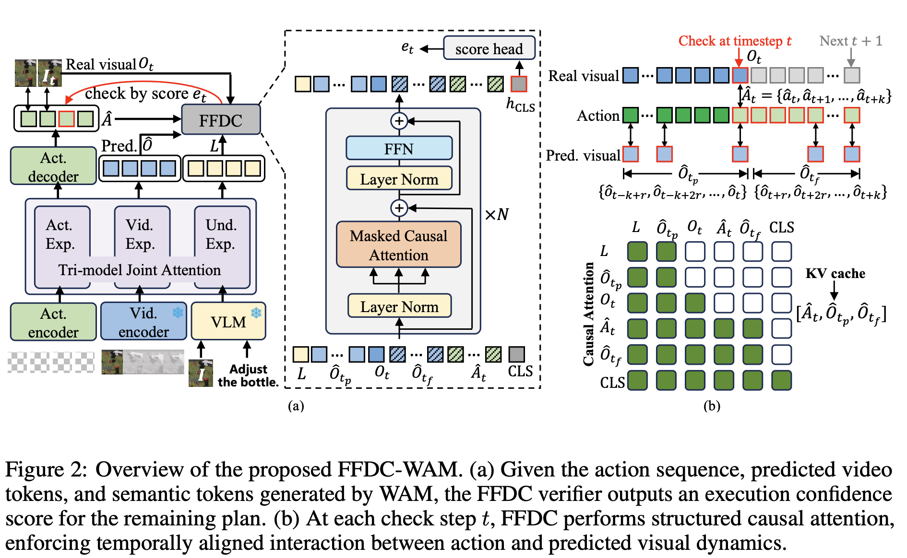

### 训练策略一：Mixture-of-Horizon Training

为了让 WAM 更适合长时序推理，论文提出 **Mixture-of-Horizon Training**。

普通训练可能偏向 episode 前半段，导致模型在后期状态或长 horizon 情况下覆盖不足。论文做法是：在一条长度为 $T$ 的轨迹中，均匀采样任意一个 conditioning timestep $s$，然后从这个位置开始采样未来 $H$ 步 action 和低频视觉帧。如果超出 episode 末尾，就重复最后一个有效动作或帧进行 padding。这样可以让训练覆盖 episode 中不同阶段，包括后期状态，减少模型只学早期前缀的偏置。

###  训练策略二：构造 FFDC 二分类验证数据

FFDC 被训练成一个二分类器，判断剩余 action segment 是否可执行：$y=1$表示这个片段可靠、可以继续执行；$y=0$表示这个片段容易导致失败，需要重新规划。

正样本来自：
* demonstration 中的有效片段；
  
* 少量 successful rollouts 中的有效片段。

负样本来自：

* 少量 failed rollouts；
  
* 从成功示范中合成出来的 corrupted action segments。

论文使用的合成 corruption 包括：

* temporal swap：交换动作顺序；
  
* gripper flip：翻转夹爪动作维度；
  
* late-stage Gaussian noise：对后半段动作加入高斯噪声；
  
* tail scaling：缩放动作序列尾部。

最后用二分类交叉熵训练 FFDC。

### 推理时怎么执行？

推理流程可以理解为：

WAM 先根据当前观测和语言指令生成一段长动作 chunk 和对应未来视觉 token。机器人开始执行动作，但不是盲目执行完整 chunk。每隔一段时间，FFDC 用当前真实观测与 WAM 之前预测的未来视觉 token、剩余动作和语言指令做比较。

如果 FFDC 置信度高：

> 说明现实仍然符合 WAM 的想象，继续执行，节省 WAM 推理次数。

如果 FFDC 置信度低：

> 说明现实已经偏离想象，停止当前 chunk，重新调用 WAM 生成新计划。

所以有效 action chunk size 不再是人工固定的超参数，而是由 **future–reality consistency** 自动决定。论文总结为：世界可预测时执行长一点，现实偏离时执行短一点。

###  实验结论

- 固定 baseline：执行 16 / 32 / 48 / 64 个动作。
  
- FFDC-WAM：一次预测最多 64 个动作，但实际执行多少步由 verifier 动态决定，不是固定 action chunk size。

论文在 RoboTwin 和真实机器人上验证。RoboTwin 包含 50 个操作任务，并设置 clean 和 random 两种环境；random setting 会引入背景变化、桌面杂物、高度扰动和光照变化，用来测试分布偏移下的泛化能力。
结果显示，FFDC-WAM 在鲁棒性和效率之间取得了更好的平衡。在 RoboTwin 上，它相较 Base-Motus 减少了 69.10% 的 WAM forward passes，同时在 hard tasks 上显著提高成功率，例如 Rand.hard 从 54.20% 提升到 76.40%，Clean.hard 从 57.80% 提升到 76.00%。在 easy tasks 上，它能保持相近成功率并减少任务完成时间。

真实机器人实验中，FFDC-WAM 在两个 pick-and-place 任务上把平均成功率从 LC-16 的 45% 提升到 80%。论文认为这是因为 FFDC 能在线检测执行漂移，并在真实场景偏离预测 rollout 时触发重新规划。

## [Speedup Patch: Learning a Plug-and-Play Policy to Accelerate Embodied Manipulation](https://arxiv.org/pdf/2603.20658)
### 研究背景：为什么需要 Speedup Patch？

当前很多具身策略，比如 **ACT、Diffusion Policy、VLA/Vision-Language-Action model**，都采用 **action chunking**。也就是策略不是每次只输出一个动作，而是一次输出一段动作序列：

$A_t=(a_t,a_{t+1},...,a_{t+n-1})$

这种方式可以减少 compounding error，也能提高推理效率。但是这些策略通常是从人类遥操作示范中学习的，而人类示范往往比较慢、动作比较密、包含大量冗余步骤。结果是，训练出来的机器人策略也会继承这种“慢节奏”，输出过于密集的动作序列，导致任务执行时间长，不利于真实部署。论文明确指出，当前 embodied policies 虽然具备不错的操作能力，但执行速度仍然较慢，一个重要原因是它们继承了人类示范中的 slow pacing 和 temporal redundancy。

已有加速方法通常有明显代价：要么需要重新整理/下采样数据并重新训练策略，要么需要新的动作预测机制，要么依赖昂贵的在线交互来保证任务成功。这对大规模 VLA foundation model 尤其不友好，因为 fine-tuning 成本很高。于是论文提出一个问题：**能不能只用离线数据，在不重新训练原始策略的情况下，给已有策略加一个 plug-and-play 的加速补丁？** 

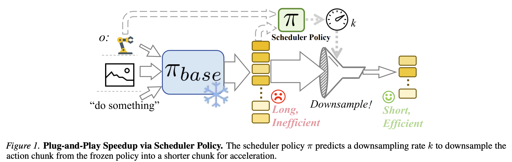

### 核心思想：冻结原策略，只学一个外部 scheduler

SuP 的核心是训练一个轻量级 **scheduler policy**。原始策略 $\pi_{\text{base}}$ 保持冻结，仍然照常输出一个 action chunk：$A_t \sim \pi_{\text{base}}(\cdot \mid I_t,o_t)$，其中 $I_t$ 是视觉观测，$o_t$ 是机器人状态。SuP 不修改这个 base policy，而是在外面加一个 scheduler：$\pi(k \mid o_t,A_t)$

这个 scheduler 根据当前状态和 base policy 输出的 action chunk，选择一个 **downsampling rate** $k$。然后系统把原 action chunk 下采样成更短的动作序列：$A_t^k$。最后执行的是下采样后的动作序列，而不是原始完整 chunk。论文把这个设计称为 plug-and-play scheduler，它可以在不重训原策略的情况下实现 state-dependent execution speedup。

直观理解是：

> 原策略说：“我准备用 20 个小动作完成这段移动。”
> SuP 判断：“这段是粗粒度移动，可以跳着走，用 10 个动作就够。”
> 但如果是抓取、接触、对位阶段，SuP 会选择较小的下采样率，避免破坏精度。

### 方法形式化：把加速建模成 CMDP

论文把 scheduler 的学习建模为一个 **Constrained Markov Decision Process, CMDP（约束马尔可夫决策过程）**。

目标是：

> 最大化执行效率，同时不损害任务成功率。

scheduler 的动作空间是离散的 downsampling rates：$K={k_{\min},...,k_{\max}}$

奖励函数很直接：$r(s_t,k_t)=k_t$。也就是说，选更大的下采样率，获得更高奖励，因为执行更快。论文将 speedup learning 建模为在 CMDP 中优化 scheduler policy，以最大化 acceleration gain，同时保持任务性能。

但问题是，怎么知道某个 $k$ 会不会导致任务失败？理想情况下应该用任务成功率或 value function 来判断。但在离线训练中，不能真实执行每个下采样动作，也不能在线评估成功率。因此论文引入了一个关键替代指标：**World Model-based state deviation**。

### 关键技术：用世界模型估计 state deviation 作为安全约束

SuP 训练一个 **Recurrent World Model, RWM（循环世界模型）**，用于预测机器人状态轨迹，而不是重建高维图像。这样模型更轻量，也更适合离线大量评估。论文中的 RWM 根据当前状态和动作序列预测未来低维状态，并采用多步 MSE loss 训练：

$\mathcal{L}(\theta)= \mathbb{E} \left[\sum_{i=1}^{L} |\hat{o}*{t+i}-o*{t+i}|_2^2 \right]$

有了世界模型后，SuP 可以离线模拟两种轨迹：

1. 原始 action chunk $A_t$ 导致的未来状态轨迹；
2. 下采样 action chunk $A_t^k$ 导致的未来状态轨迹。

然后比较这两条轨迹的末端执行器位置是否偏离太多。论文定义 state deviation 为两条轨迹中 end-effector 位置最大差异：

$E(s_t,k_t)=\max_i d(\text{EEF}(o_{t+i}),\text{EEF}(\hat{o}^{k}_{t+i}))$

如果：$E(s_t,k_t) > \epsilon$, 就认为这个下采样率太激进，会破坏原始策略的运动意图，记为 violation。论文通过实验发现，state deviation violation 越多，任务成功率越低，因此它可以作为离线安全约束的代理指标。

这点很关键：SuP 不直接问“任务会不会成功”，而是问：

> 下采样后的轨迹是否仍然接近原策略本来想走的轨迹？

如果接近，就认为加速安全；如果偏离太大，就认为风险高。

### 训练流程：三阶段

论文的训练流程很清楚，分成三步。

第一阶段，训练 Recurrent World Model。用离线 demonstration 数据采样不同长度的动作序列，监督世界模型预测未来状态。训练目标是多步状态预测 MSE。

第二阶段，合成 scheduler 的离线 RL 数据。对于离线数据中的每个 transition 和 action chunk，枚举不同的下采样率 (k)，用世界模型预测下采样后轨迹，并计算 state deviation 和 violation。然后给每个候选 $k$ 赋予奖励：

$$r'(s,k)=\begin{cases}
k, & h_E(s,k)=0 \
-\Omega, & h_E(s,k)=1
\end{cases}
$$

也就是说，安全的加速动作奖励为 $k$，越快越好；不安全的下采样动作给予一个很大的负惩罚。论文还给出条件，说明只要 (\Omega) 足够大，最优策略会避免 violation。

第三阶段，用 **IQL（Implicit Q-Learning）** 训练 scheduler。IQL 学习 $Q(o,A^k)$ 和 $V(o)$，推理时选择：$\pi_\phi(o,A)=\arg\max_k Q_\phi(o,A^k)$

也就是在当前状态和候选下采样 chunk 中，选一个预期收益最高且不违反安全约束的下采样率。

### 推理时怎么运行？

推理时流程很简单：

1. 原始 policy $\pi_{\text{base}}$ 输出 action chunk；
2. scheduler 读取当前状态和 action chunk；
3. scheduler 输出 downsampling rate $k$；
4. 系统把 action chunk 下采样为更短的 $A_t^k$；
5. 执行下采样后的动作；
6. 下一次再重复。

这个 scheduler 是外接模块，不需要修改 base policy，因此它被称为 **Speedup Patch**。

### 实验结果

论文在 **Bigym、LIBERO 和真实机器人任务** 上评估 SuP。Bigym 覆盖 20 个厨房/家务类 humanoid manipulation tasks，LIBERO 覆盖 4 个 task suite 共 40 个任务；base policy 包括 ACT、Diffusion Policy、$\pi_0.5$ 和 VLA-Adapter。

在 **LIBERO** 上，SuP 对 $\pi_0.5$ 的平均成功率从 0.969 提升到 0.973，同时实现 **1.35× speedup**；相比 naive downsampling (-ds2)，SuP 的成功率明显更稳，因为 (-ds2) 虽然达到 1.72× speedup，但平均成功率下降到 0.928。对 VLA-Adapter，SuP 也实现 1.34× speedup，并基本保持原始性能，而 naive downsampling 下降明显。

在 **Bigym** 上，SuP 对 ACT 实现约 **2.01× speedup**，同时保持甚至略微提升成功率；对 Diffusion Policy，SuP 达到 **1.48× speedup**，并避免了普通下采样导致的性能崩塌。论文强调 SuP 在 ACT、DP、VLA 等不同架构上都有较强通用性。

在 **真实机器人实验** 中，任务包括 Arrange Table、Fold Towel、Stack Plates。SuP 在 (\pi_0.5) 上实现平均 **2.17× speedup**，同时平均成功率为 0.611，略高于 base policy 的 0.589，也高于 DemoSpeedup 的 0.600。相比之下，激进的 naive downsampling (ds3) 虽然达到 2.19× speedup，但成功率崩到 0.356，说明盲目加速会严重破坏操作能力。([arXiv][1])

在计算效率方面，SuP 只有 **5.12M trainable parameters**，训练时间约 **2 小时**，推理开销约 **1ms**，而 DemoSpeedup 需要训练 4B 参数并耗时约 20 小时。论文指出 scheduler 的推理开销相对 $\pi_0.5$ 的 50ms 推理延迟几乎可以忽略。

## [World Action Verifier: Self-Improving World Models via Forward-Inverse Asymmetry](https://arxiv.org/pdf/2604.01985)
这篇论文提出的方法叫 **WAV（World Action Verifier）**，核心目标是：**让 action-conditioned world model 能够自己发现哪些状态转移是它当前预测不好的，并主动选择这些高价值交互数据来提升自身世界模型质量。**

### 研究背景：为什么需要 World Action Verifier？

机器人世界模型通常被定义为一个 **action-conditioned forward dynamics model**，也就是给定当前状态和动作，预测下一状态：
$s_{t+1} = f(s_t, a_t)$

这类模型很重要，因为它可以用于：

* policy evaluation；
* model-based planning；
* imagination-based policy learning；
* action-conditioned future prediction。

但论文指出，世界模型和普通策略学习不一样。策略学习主要关心“专家或最优动作附近”的分布，而世界模型必须对更广泛的动作分布都可靠，包括次优动作、探索动作、随机动作，甚至失败动作。问题是，大规模收集 action-labeled robot interaction data 很贵、很慢，而且真实机器人中还可能不安全。现在很多方法会用两类数据训练世界模型：少量带动作标签的机器人交互数据，以及大量没有动作标签的视频数据。没有动作标签的视频通常覆盖更广泛的状态变化，但无法直接告诉模型“哪个动作导致了这个变化”。因此，一个核心问题是：**如何利用大量 action-free video data 来帮助 action-conditioned world model 学会更广泛、更可靠的动作条件动态？**

### 论文核心思想：不要直接估计世界模型误差，而是做“验证”

如果我们想提升世界模型，最理想的做法是找到那些当前世界模型预测误差最大的交互样本，然后优先收集或标注这些样本。

也就是说，对于候选动作 (a)，如果当前世界模型预测：$\hat{s}_{t+1} = f(s_t, a)$, 但真实环境结果 $s_{t+1}$ 和它差很多，那么这个样本最值得加入训练。

问题是：**在真正执行动作之前，真实下一状态并不知道，所以无法直接计算世界模型误差。**

已有方法通常会用：

* epistemic uncertainty；
* ensemble disagreement；
* learning progress；

来估计“哪些样本更有价值”。但论文认为，这些方法依赖当前世界模型自己的判断，而当前世界模型在 under-explored regimes 中本来就不可靠，所以这些估计也可能不准。WAV 的做法是换一个角度：不直接问“世界模型预测误差多大”，而是把正确的 action-conditioned prediction 拆成两个更容易验证的问题：

1. **State Plausibility：预测的未来状态是否像真实世界中可能出现的状态？**
   
2. **Action Reachability：这个未来状态是否真的可以由给定动作从当前状态到达？**

论文认为，一个正确的世界模型预测必须同时满足这两个条件：未来状态本身要合理，同时这个状态变化要和给定动作一致。

### 方法组成：Subgoal Generator + Sparse Inverse Dynamics Model + World Model

WAV 主要由三个模块组成。

#### Subgoal Generator：生成合理的未来状态

第一个模块是 **subgoal generator**。它从大量 action-free video data 中学习“环境中可能出现的状态变化”。由于视频数据不需要动作标签，所以规模可以比机器人交互数据大得多。

给定当前状态 $s_t$，subgoal generator 会生成多个候选未来状态：$s_g \sim v(s_t)$, 

这些 $s_g$ 可以理解为：

> “从当前状态出发，真实世界中看起来合理的未来状态。”

它的作用是检查 **state plausibility**：候选未来状态是否在真实视频数据支持的动态流形上。论文强调，action-free video data 提供了比少量 action-labeled data 更广的状态转移覆盖，因此可以作为更强的未来状态先验。

#### Sparse Inverse Dynamics Model：从状态变化中反推出动作

第二个模块是 **sparse inverse dynamics model，Sparse IDM**。

普通 inverse dynamics model 学的是：$a_t = h(s_t, s_{t+1})$

也就是根据当前状态和下一状态反推出中间动作。

但论文认为，在机器人任务中，动作往往只影响状态的一小部分关键变量，例如：

* end-effector pose；
* gripper state；
* manipulated object motion；
* agent-centric proprioception。

因此，没有必要用完整高维图像或完整状态来反推动作。WAV 使用 **sparse inverse model**，学习一个 mask，只选择动作相关的状态特征，再从这些低维特征中推断动作。论文称这种方式利用了 **dimensionality asymmetry**：反推动作通常比完整预测未来状态更低维、更容易学习。

这一步对应 **action reachability**：

> 如果 subgoal generator 生成了一个未来状态，那么 Sparse IDM 尝试反推“什么动作能导致这个未来状态”。

#### World Model：验证这个动作是否真的能达到 subgoal

第三个模块就是当前正在训练的 action-conditioned world model：$s_p = f(s_t, a)$, 其中 $a$ 是 Sparse IDM 根据 $s_t$ 和 $s_g$ 反推出的动作。

然后 WAV 比较：$s_p$ 和 $s_g$

如果二者差距很大，说明：

> subgoal generator 认为这个未来状态是合理的，Sparse IDM 也能推断出一个动作，但当前 world model 执行这个动作后却预测不到这个状态。

这就说明当前 world model 在这个区域存在缺口。于是这类样本就是高价值探索样本，应该优先收集真实交互数据来更新世界模型。

### 算法部分：WAV-Guided Exploration

论文中的 Algorithm 1 可以概括为一个 **反向验证循环**。

传统思路可能是：
$\text{sample action} \rightarrow \text{world model rollout} \rightarrow \text{inverse model check}$

但论文认为这种 forward-first cycle 很脆弱，因为早期世界模型可能会生成 off-manifold 的不真实状态，这时 inverse model 也不可靠。

WAV 反过来做：$\text{sample plausible subgoal} \rightarrow \text{infer action} \rightarrow \text{forward rollout} \rightarrow \text{compare}$

具体算法如下：
#### Step 1：从当前状态采样多个 plausible subgoals

给定当前状态 (s)，subgoal generator (v) 采样 (K) 个候选未来状态：$s_g^{(1)}, s_g^{(2)}, \dots, s_g^{(K)}$, 这些状态来自 action-free video prior，因此它们通常是物理上合理、视觉上可信的未来状态。

#### Step 2：用 Sparse IDM 为每个 subgoal 反推动作

对每个候选 subgoal：$a^{(i)} = h^{-1}(s, s_g^{(i)})$

也就是问：

> 如果我想从当前状态 $s$ 到达 $s_g^{(i)}$，可能需要什么动作？

这里的 (h) 是 sparse inverse dynamics model，只关注动作相关的低维状态特征。

#### Step 3：用 world model 预测执行该动作后的结果

对每个候选动作 $a^{(i)}$，world model 预测：$s_p^{(i)} = f(s, a^{(i)})$. 这一步是在测试当前世界模型是否真的能把动作 (a^{(i)}) 映射到 subgoal generator 认为合理的未来状态附近。

#### Step 4：计算 mismatch score

对每个候选：$\text{score}^{(i)} = d(s_g^{(i)}, s_p^{(i)})$, 如果 $s_g^{(i)}$ 和 $s_p^{(i)}$ 差距越大，说明这个候选越可能暴露当前 world model 的缺陷。

#### Step 5：选择最高 mismatch 的候选去真实环境采样

选择：$i^* = \arg\max_i d(s_g^{(i)}, s_p^{(i)})$, 然后真正执行对应动作：$s_n = \text{env.step}(a^{(i^*)})$, 得到真实交互数据：$(s, a^{(i^*)}, s_n)$.

#### Step 6：把新数据加入数据集并更新模型

将新采集的 transition 加入 action-labeled dataset：$D \leftarrow D \cup {(s, a^{(i^*)}, s_n)}$. 然后更新：

* world model $f$；
* sparse inverse dynamics model $h$。

这就形成一个 self-improving cycle：世界模型越能发现自己的短板，就越能收集对自己最有用的数据；新数据再反过来提升世界模型。论文的算法伪代码也正是这个流程：sample subgoals、inverse actions、predict outcomes、score disagreement、select max surprise、collect data、update models。

### 实验设置
论文先在 **MiniGrid** 上做控制实验，再在更复杂的机器人操作任务上验证。

### MiniGrid
MiniGrid 中包括：Key Delivery；Ball Delivery；Object Matching。

作者收集了 50k interaction sequences，其中一半用于训练 action-free subgoal generator，另一部分作为 exploration pool。初始 action-labeled seed set 只有 200 条，unlabeled candidate set 有 20k 条。论文还通过改变物体数量和引入 noisy floor tiles 来测试复杂度和随机性下的鲁棒性。
### RoboMimic 和 ManiSkill

机器人操作任务包括：

**RoboMimic：** Lift；Can；Square。

**ManiSkill：** * PullCube；* PokeCube；* LiftPeg。

论文使用 expert demonstrations 和不同训练阶段的 diffusion policy 生成多样化轨迹。world model 采用 **Dreamer-v3** 风格的 latent recurrent state-space model，Sparse IDM 使用 CLAM 的 backbone 并进一步加入 sparse latent action selection。

### 实验结果
#### WAV 的 verification score 更接近 Oracle
论文用 Spearman rank correlation 衡量不同方法对样本“信息价值/困难程度”的排序是否接近 Oracle。Oracle 是用真实动作标签和真实 prediction loss 得到的上界排序。结果显示，WAV 的 verification score 与 Oracle 的排序相关性最高，说明它比 uncertainty、progress、random 等方法更能识别真正有价值的样本。

#### WAV 提升世界模型学习效率
在 MiniGrid 中，作者从 200 条 labeled transitions 开始，每轮只增加 100 条 transition。结果表明，WAV 和 Oracle 显著优于其他 baseline。论文解释说，很多复杂交互动作在数据中很稀疏，而 random 很难采到这些关键事件；progress 容易选择冗余样本；uncertainty 在早期 warm-up 慢。而 WAV 能显式筛出 interaction-rich transitions，因此低数据预算下效果更好。
在 RoboMimic 和 ManiSkill 中，论文用 held-out test set 上的 next-observation MSE 衡量 world model 质量。结果显示，WAV 在不同数据预算下都优于 baseline，尤其在 low-data regime 中提升明显。

#### 改进后的 world model 能提升下游策略学习

论文最后验证：更好的 world model 是否真的能帮助 policy learning。他们采用 SAILOR 的评估方式，用 world model 在 latent imagination 中做 online search / policy refinement。reward model 则根据 latent states 与 expert behavior 的相似度进行打分。实验结果显示，使用 WAV 改进后的 world model，可以让下游 policy 获得更高 reward。整体上，WAV 比最强 baseline 平均高 **18% average reward**，仅次于可以访问 privileged ground-truth actions 的 Oracle。在 contact complexity 更高、状态歧义更大的任务上，例如 Can、Square、PokeCube，WAV 的优势更加明显。论文认为这是因为这些任务更依赖准确的 latent dynamics，而 WAV 正好提升了 world model 对关键交互动态的建模能力。

# Safety of World Models
## [(20260408, Safety) Safety of Vision-Language-Action Models: A Survey from Lifecycle Perspectives](https://www.authorea.com/doi/full/10.22541/au.177524426.60806944/v1) 
VLA 近年来已成为具身智能的一种范式，使机器人能够通过一个端到端策略，在多模态观测下执行复杂动作。随着 VLA 模型在现实环境中的日益部署，确保其安全性变得至关重要，因为其失效或恶意行为可能导致严重的物理伤害以及广泛的社会影响。尽管关于 VLA 安全性的研究不断增多，现有工作大多集中于单一方面，例如特定的攻击面、鲁棒性或可靠性，而缺乏对 VLA 系统全生命周期安全风险的统一理解。为弥补这一空白，论文从整体生命周期的视角，对 VLA 模型的安全挑战及其缓解策略进行了系统性综述。具体而言，论文将 VLA 的开发流程划分为三个关键阶段：数据准备、模型训练和系统部署。对于每个阶段，论文从两个互补的角度系统分析安全问题：一是对抗性场景，即有意攻击试图破坏系统安全；二是非对抗性情境，即由于模型固有局限或外部因素导致系统可靠性下降，从而引发不安全行为。最后，论文还探讨了构建安全 VLA 系统的前沿研究方向。为支持研究人员和从业者推动 VLA 系统的安全应用，维护了一个持续更新的 VLA 安全文献资源库：https://github.com/hi-weiyuan/VLA-Safety-Papers。

## [(20260203, Safety) Modular Safety Guardrails Are Necessary for Foundation-Model-Enabled Robots in the Real World](https://arxiv.org/pdf/2602.04056)

在人与机器人交互的场景中，安全要求不仅仅是“物理上不出事”（比如不撞人），还包括更高层次的要求，例如语义是否合适（做的事情是否合理）、是否符合人类意图，以及是否遵守社会规范。这些不同层面的要求会带来多种不同类型的失败情况，而且这些失败是无法通过单一机制解决的。例如，物理安全过滤器可以防止碰撞，但无法判断“递刀”这种行为在特定情境下是否危险；而语义推理模块虽然可以理解上下文是否合理，却缺乏实时控制能力，无法阻止即时的物理事故。因此，没有一种单一的安全机制能够同时覆盖所有这些问题。

一种直观的想法是训练一个端到端的统一安全模型，把物理、语义和意图全部一起建模。但在实际中，这种“单体式（monolithic）”方案往往很脆弱。因为现实环境是不断变化的（任务、环境和安全要求都会变化），这种模型容易在分布变化下失效，还需要不断引入额外的安全模块进行补丁式修复。此外，真实数据中往往很少包含严重的安全事故（因为这些事件本来就罕见），导致模型在训练时对最关键的危险情况学习不足，从根本上限制了这种端到端安全方法的可靠性和长期有效性。

因此，作者提出采用一种**模块化安全设计**。这种设计包含两个层面的“模块化”：

一方面是**外部模块化（external modularity）**，即将安全机制从基础模型（FM）中分离出来，避免模型本身的不确定性直接影响安全；另一方面是**内部模块化（internal modularity）**，即把安全拆分为多个针对不同失败模式的子机制。

基于此，作者提出一个三维安全分类框架：包括**动作安全**（是否满足物理约束）、**决策安全**（语义和上下文是否合理）、以及**以人为中心的安全**（是否符合人类意图和社会规范）。他们认为，在真实世界中，由于安全需求会变化、难以提前完全定义，而且事故虽然少见但后果严重，非模块化方法在本质上是脆弱的。

为了解决这些问题，论文提出了一种**两层的模块化安全架构**：第一层是“监测与评估层”，负责在整个系统中评估风险；第二层是“干预层”，通过在决策层进行筛选（gating）以及在动作层进行过滤（filtering）来强制执行安全约束。这种模块化设计的优势在于：可以在不同层之间进行协同设计（例如统一表示、合理分配保守性），从而实现更精确、不过度保守的安全控制，同时也支持各个模块独立验证、灵活更新、组合不同方法，并系统性地覆盖所有安全维度。

###  Safety Definitions and Specifications for FM-enabled Robotics
首先，**动作安全（Action Safety）**关注的是机器人在物理层面的执行是否始终处于明确的安全约束之内，尤其是在真实环境中。例如常见的约束包括避免碰撞、遵守关节运动范围限制，以及在人机交互时控制合适的力或阻抗。这一层面的安全问题相对成熟，通常可以通过基于模型的控制理论方法来解决，也就是说，它主要是一个“物理可行性 + 控制稳定性”的问题。

其次，**决策安全（Decision Safety）**是在动作安全之上的扩展，它引入了语义和上下文层面的合理性。在开放世界环境中，尤其是当大语言模型（LLM）被集成进机器人系统后，安全不再只是“能不能做”，还包括“该不该做”。例如，“不能把毛绒玩具放在热炉上”或者“倒咖啡不能太快”这样的规则，都是依赖常识和任务语义的约束，这些是单纯依靠底层物理限制无法表达的。因此，决策安全本质上是在判断行为是否符合常识、语境和任务目标。

最后，**以人为中心的安全（Human-centered Safety）**关注的是机器人行为在长期人机交互中，是否会被人类感知为可预测、可理解和值得信任。即使机器人在动作层面没有违规、在决策层面也符合语义，如果它的行为不符合人类预期，或者随着时间推移让人产生误解、不信任，依然可能被认为是不安全的。例如，人类的期望会变化（非静态）、信任可能被高估或低估，这些都会带来认知和社会层面的风险。

总结来说，这三层安全是逐级递进的：从“物理上安全”（动作安全），到“语义上合理”（决策安全），再到“人类感知上可靠”（以人为中心的安全）。只有同时覆盖这三个层面，机器人在真实世界中的行为才可以被认为是全面安全的。

# VLN
## [(20251125, VLN) FSR-VLN: Fast and Slow Reasoning for Vision-Language Navigation with Hierarchical Multi-modal Scene Graph](https://arxiv.org/pdf/2509.13733)
本文提出了一种用于视觉-语言导航（VLN）的新方法 FSR-VLN，旨在解决现有方法在长距离空间推理能力弱以及推理延迟高的问题。该方法结合了层级多模态场景图（HMSG）与快速-慢速导航推理机制（FSR）。其中，HMSG 通过分层地图结构支持从房间级粗定位到目标视角及物体的细粒度检索，增强了对复杂室内环境的表达能力。在此基础上，FSR-VLN 采用“快到慢”的两阶段推理流程：首先通过快速匹配在特征空间中筛选候选房间、视角和物体，然后在必要时使用 VLM 进行慢速精细验证与最终决策，从而在效率与准确性之间取得平衡。

实验在多个由人形机器人采集的室内数据集上进行，涵盖 87 条多类别指令。结果表明，FSR-VLN 在所有数据集上均达到当前最优性能（SOTA），以检索成功率（RSR）衡量显著优于 HOVSG 和 MobilityVLA，同时在保持高成功率的情况下，将响应时间降低约 82%。此外，该系统还被集成到 Unitree-G1 人形机器人中，结合语音交互、规划与控制模块，实现了自然语言驱动的实时导航能力。总体而言，该方法通过引入层级场景图和快慢双重推理机制，有效提升了长距离视觉语言导航的效率与鲁棒性。
