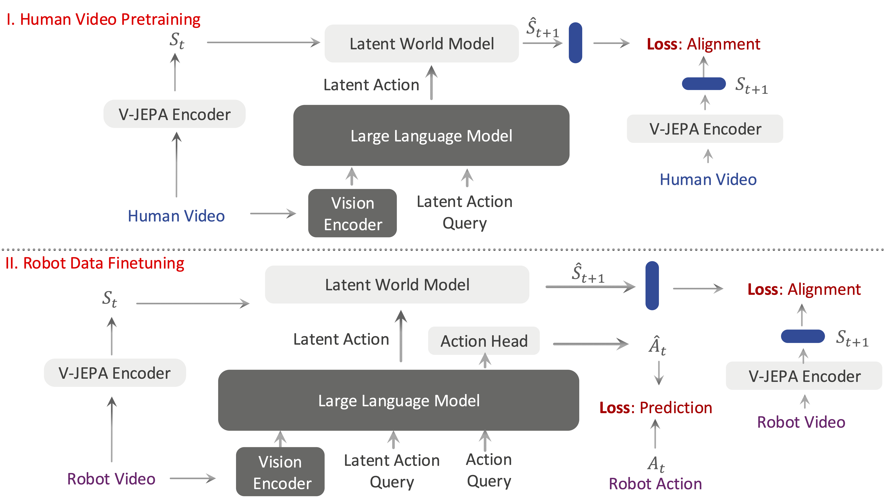
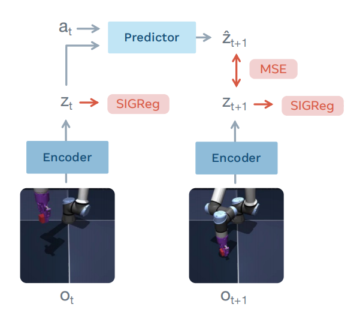
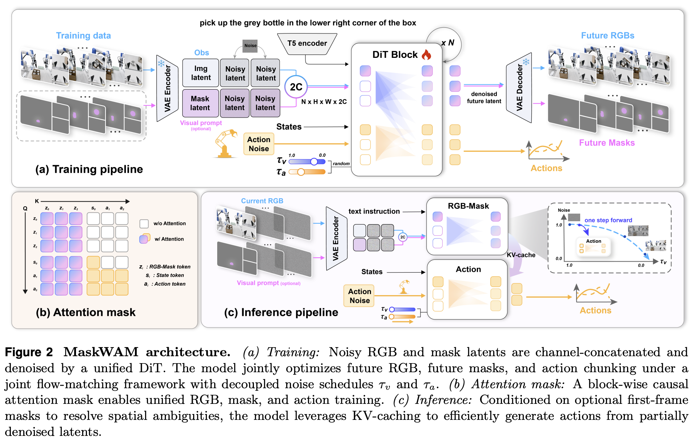

# Vison Language Action Models
## [SimVLA: A Simple VLA Baseline for Robotic Manipulation](https://arxiv.org/pdf/2602.18224)
过去一年，Vision-Language-Action（VLA）模型发展非常迅速。从 OpenVLA、π0、GR00T 到各种引入 3D 几何、空间先验、记忆模块和世界模型的工作，VLA 架构变得越来越复杂。然而作者发现一个有趣现象：许多新方法同时修改了模型结构、训练数据、训练策略和超参数，最终虽然性能提升了，但很难回答一个核心问题——这些提升究竟来自新架构，还是来自训练细节的优化？《SimVLA: A Simple VLA Baseline for Robotic Manipulation》的出发点正是重新建立一个透明、简单且可复现的基线，让社区能够更清楚地理解 VLA 的性能来源，而不是不断堆叠复杂模块。

SimVLA 的核心思想可以概括为“Simple but Strong”。作者并没有引入新的世界模型、空间推理模块或者复杂记忆机制，而是尽可能保留当前主流 VLA 的标准范式：预训练视觉语言模型作为感知骨干，语言指令作为任务条件，再通过动作头预测机器人动作。论文认为，许多工作报告的大量提升其实来自训练配方（training recipe）、数据清洗、动作表示设计和优化细节，而非复杂结构创新。因此 SimVLA 试图构建一个极简框架，在统一训练设置下重新评估 VLA 的真实能力。

从框架上看，SimVLA 仍然遵循典型的 VLA 流程：输入当前图像观测和语言指令，利用预训练视觉语言模型提取多模态表示，再通过动作解码器预测机器人动作。与许多近期工作不同，它没有额外引入世界模型、未来状态预测、3D 点云分支或复杂规划模块，而是把重点放在构建稳定可靠的训练流水线。作者的观点是，在讨论更复杂的设计之前，社区首先需要知道一个经过充分优化的“简单 VLA”到底能达到什么水平。

实验部分主要围绕多个机器人操作基准展开，并与 OpenVLA、π 系列以及近期各种增强型 VLA 方法进行比较。作者特别强调统一训练设置和可复现性，希望消除不同论文之间由于数据规模、训练步数和实现细节差异带来的影响。实验结果表明，一个经过认真设计和优化的简单 VLA 基线已经能够达到与许多复杂模型相当甚至更好的性能。这意味着部分近期工作的性能提升可能并非完全来自新提出的结构，而是来自训练细节和工程优化。

从研究定位来看，SimVLA 并不是提出新的机器人能力，而更像是一篇“反思性论文”。它提醒社区，在 VLA 快速发展的阶段，复杂结构创新固然重要，但建立透明、强大且可复现的基线同样重要。对于后续工作而言，SimVLA 提供了一个清晰参照系：未来提出新的空间先验、世界模型或规划模块时，需要证明其增益确实超越了一个经过充分优化的简单基线，而不是仅仅受益于更好的训练配方。

## [VLA-JEPA: Enhancing Vision-Language-Action Model with Latent World Model](https://arxiv.org/pdf/2602.10098)

VLA-JEPA 关注的是当前 VLA 预训练中一个很核心但容易被掩盖的问题：大家都希望利用大规模互联网视频或人类视频来弥补机器人动作数据稀缺，但很多 latent action 方法实际学到的并不是“可控状态转移”，而是像素变化的压缩表示。比如 LAPA、UniVLA、Moto 等路线会从相邻帧、光流或未来片段中抽取 latent action，再把它迁移到机器人控制中；这条路线的吸引力在于不需要每段视频都有机器人动作标签，但风险也很明显：背景运动、相机抖动、光照变化和未来帧泄漏都可能让 latent action 退化成“未来图像摘要”，而不是对动作语义有用的动态变量。

VLA-JEPA 的核心思路是把 latent action 学习改写成一个 JEPA 风格的 latent world modeling 问题。它不要求模型重建像素，也不把未来帧作为学生路径的输入，而是用冻结的 V-JEPA2 编码器把未来视频编码成 latent state target；学生侧只看到当前观测、语言指令和一组可学习的 latent action tokens，再通过一个自回归 latent world model 去预测未来状态表征。这样，未来信息只作为监督目标出现，不能被模型直接读入，从机制上减少 information leakage；同时，因为预测发生在语义 latent space 而不是 RGB pixel space，模型更倾向于关注与交互有关的状态变化，而不是背景纹理或无关运动。

从架构上看，VLA-JEPA 使用 Qwen3-VL-2B 作为 VLM backbone，并在词表中加入 latent action tokens 和 embodied action token。对于没有动作标签的人类视频，模型用 V-JEPA2 encoder 提取多视角 world state 表征，再让 VLM 产生 latent action 表示，条件化 latent world model 去预测后续状态 chunk；对于有机器人动作标签的数据，模型在同一个框架中额外接入 flow-matching action head，用 latent action 和 embodied action token 作为条件生成连续末端执行器动作。训练流程因此被压缩成“latent world model 预训练 + 动作头微调”的两阶段形式，比许多需要先学视觉表征、再学 latent action、再做动作对齐的多阶段方法更直接。

论文的一个重要细节是，它并不把人类视频神化为可以直接提供机器人动力学的万能数据。预训练阶段使用 Something-Something-v2 的 22 万条人类视频和 DROID 的 7.6 万条机器人示范，微调阶段在 LIBERO/LIBERO-Plus、SimplerEnv 以及真实 Franka 任务上评估。消融结果显示，在 LIBERO 和 SimplerEnv 这类更依赖高质量专家示范或 real-to-sim 适配的设置中，去掉人类视频并不会总是明显变差；但在 LIBERO-Plus 的扰动场景下，人类视频会显著提升鲁棒性，尤其是语言、光照、背景和布局变化。这说明人类视频更多是在增强已有技能的稳定性和泛化，而不是直接教会机器人新的精确控制动力学。

实验结果整体支持这种定位。在 LIBERO 上，VLA-JEPA 的平均成功率达到 **97.2%**，略高于 OpenVLA-OFT 的 97.1% 和 π0.5 的 96.9%；在 SimplerEnv 中，Google Robot 平均成功率为 **65.2%**，WidowX Robot 平均为 **57.3%**，其中 Google Robot 设置下优于列出的基线；在 LIBERO-Plus 鲁棒性评测中，VLA-JEPA 平均成功率为 **79.5%**，高于 OpenVLA-OFT 的 69.6%、π0-Fast 的 61.6% 和 UniVLA 的 42.9%，并在 7 类扰动中的 5 类取得最好结果。真实机器人实验也显示，VLA-JEPA 在 ID 和物体布局 OOD 设置下表现最好，并出现了重复抓取失败后重新张开夹爪再尝试的行为，作者认为这类时序技能可能来自人类视频中丰富的重复尝试模式。

从研究价值看，VLA-JEPA 并不是把 VLA 彻底变成显式规划式 WAM，而是在 VLA 内部加入一个更干净的 latent world model 预训练目标。它与 Motus、MaskWAM 这类工作一样，都在回应同一个趋势：机器人策略不能只依赖“当前图像到动作”的直接映射，而需要学习更稳定的世界变化表示。VLA-JEPA 的贡献在于把这个目标落到一个 leakage-free 的 JEPA 训练机制上，让 latent action 更接近动作相关的状态转移语义。它的局限也比较清楚：真实机器人上仍然存在细粒度语言理解不足、可能抓错目标的问题，而且人类视频主要提升鲁棒性而不是自动解决 embodiment gap。因此它更像是一条可扩展的预训练路线，而不是完整替代机器人数据或显式规划的最终方案。

# World Action Models

## [Adaptive Action Chunking for Robotic Imitation Learning](https://www.mdpi.com/2313-7673/11/5/316)

固定长度的 action chunk 很难同时兼顾效率和精细控制。传统 ACT 或 diffusion-based imitation policy 通常一次预测固定长度的动作序列并 open-loop 执行。短 chunk 可以提高反馈频率，适合接触、对齐和放置等精细阶段，但会带来动作抖动和执行低效；长 chunk 可以让远距离移动更平滑、更高效，却容易在关键接触阶段因缺少闭环修正而累积误差。作者认为，最优 chunk size 不应是固定超参数，而应根据当前视觉上下文动态决定。

论文提出一个端到端的 **Adaptive Action Chunking** 框架，用于双臂机器人视觉模仿学习。模型采用双分支结构：首先用共享的 ViT-Base 视觉编码器融合全局相机和腕部相机图像，得到场景特征；随后一个 action prediction head 预测最大长度的未来动作序列，另一个 chunk-size prediction head 输出当前时刻最合适的离散 chunk length。最后，一个 deterministic gating module 根据预测出的 chunk size，从长动作序列中截取对应长度的前缀动作并执行。训练时，模型同时最小化动作预测误差和 chunk-size 分类误差，使策略不仅学习“怎么动”，也学习“当前应该连续执行多长”。

实验在两个真实双臂操作任务上进行。第一个是 **transport-and-place**，机器人需要双臂抓取方块、长距离搬运并精确放入目标区域。该任务天然包含“长距离运输需要长 chunk”和“末端放置需要短 chunk”的矛盾。实验中，模型学到明显的阶段切换策略：抓取阶段使用中等 chunk，运输阶段切换到最大 chunk，进入精确放置阶段后迅速降到最小 chunk。最终自适应方法达到 **100% 成功率** 和 **32.2 ± 2.3 秒**平均完成时间，优于所有固定 chunk baseline。

第二个任务是更困难的 **bimanual alternating flip-and-handover**，机器人需要通过多次双臂交接完成物体 180° 翻转，任务中长期存在接触不确定性、滑移风险和姿态约束。与第一个任务的阶段切换不同，模型在该任务中几乎持续选择最小 chunk size，形成高频闭环调整策略。该方法取得 **90% 成功率**，而最好的固定 chunk baseline 只有 **25%**，说明自适应机制在高不确定、接触丰富任务中尤其重要。

总体来看，这篇工作的贡献在于把 action chunk length 从人工固定超参数变成由视觉上下文驱动的动态决策变量。它不依赖预定义子任务、技能库或额外层级规划，而是通过双分支网络在模仿学习框架内同时预测动作和执行长度。实验结果表明，自适应 chunking 能在不同任务结构下自动形成不同策略：在阶段清晰的任务中进行长短 chunk 切换，在持续高不确定任务中保持短 chunk 高频反馈。这为后续 VLA/WAM 中的 adaptive action execution 提供了一个直接而可解释的参考。

## [AHA-WAM:Asynchronous Horizon-Adaptive World-Action Modeling with Observation-Guided Context Routing](https://serene-sivy.github.io/aha-wam/static/aha-wam.pdf)
# AHA-WAM：让长程规划和实时控制真正解耦

随着 Cosmos-Policy、Motus、GigaWorld 等 World Action Model（WAM）的出现，机器人开始从“看到状态直接输出动作”的 VLA 范式，逐渐转向“先想象未来，再决定动作”的世界模型范式。然而现有 WAM 普遍面临一个矛盾：高质量未来预测通常需要长时间范围的视频规划，但长 horizon 视频生成成本极高；另一方面，机器人控制又要求高频闭环更新，必须快速响应环境变化。如果每执行一步动作都重新生成长 horizon 未来视频，推理成本会非常高；如果长期复用旧的未来规划，又会因为环境变化导致规划逐渐失效。AHA-WAM 的核心问题正是：如何同时获得长程规划能力和高频闭环控制能力。

AHA-WAM 的核心思想是将传统 WAM 中耦合的世界建模和动作生成彻底解耦。论文将系统分成两个时间尺度：一个低频运行的 Video Planner 和一个高频运行的 Action Executor。Video Planner 负责建模较长 horizon 的未来视觉动态，例如未来 64 步内场景可能如何变化；Action Executor 只负责生成较短 horizon 的可执行动作 chunk，例如未来 16 步动作。这样，机器人不需要每一步都重新生成完整未来视频，而是让昂贵的长程规划低频运行，让廉价的动作生成高频运行，从而同时兼顾规划能力和推理效率。

具体来说，Video Planner 使用 Video Diffusion Transformer 建模未来视频 latent，并产生一组长期规划上下文（planner context）。这些 planner context 本质上是 Video DiT 各层产生的 Key/Value 状态，可以理解为压缩后的“未来世界计划”。Action Executor 则是一个 Action Diffusion Transformer，它在生成动作时不仅关注当前观测和机器人状态，还会通过 Joint Attention 读取 planner context。这样，动作生成始终受到长程未来规划的指导，而不是仅依赖当前观测进行局部决策。

但真正有意思的问题出现在这里：由于 Video Planner 更新频率远低于 Action Executor，同一个 planner context 会被连续多个动作 chunk 复用。当机器人已经执行了若干步动作后，当前状态可能已经位于原始规划窗口的中后段。例如 planner 在时刻 $t$ 生成了一份未来 $64$ 步规划，而机器人执行到 $t+8$ 时仍在使用这份规划。此时 Action Executor 面临的挑战是：如何知道自己当前处于长期规划的哪个阶段？

AHA-WAM 的解决方案有两个。首先是 Observation-Conditioned Visual Context Routing（OVCR）。每次动作生成前，当前观测都会作为 Query 去重新访问 planner context，对原始规划进行状态对齐和重路由，从而得到当前时刻专属的 planner context。换句话说，Action Executor 实际使用的不是 Planner 在过去生成的原始未来计划，而是经过当前观测校正后的计划表示。

其次是论文最核心的 Horizon-Adaptive Offset Training。训练阶段，作者故意随机打乱 Action Executor 与 Planner 的时间对齐关系。假设 Planner 的 horizon 为 64，Action chunk 长度为 16，那么训练时会随机采样一个 offset $\delta \in [0,15]$，让动作 chunk 从规划窗口中的不同位置开始学习。这样模型会反复看到“我位于长期计划开始阶段”“我位于长期计划中间阶段”“我位于长期计划末尾阶段”等各种情况。经过这种训练后，Action Executor 学会了根据当前观测和 planner context 自动判断自己处于长期规划的哪个阶段，并生成对应动作。需要强调的是，AHA-WAM 并不会动态选择动作 horizon 或执行步长，动作 chunk 长度始终固定；真正自适应的是 Action Executor 对长期规划不同相位（phase offset）的理解能力。

训练方面，AHA-WAM 使用统一的 Flow Matching 框架，同时优化视频分支和动作分支。Video Planner 学习未来视觉动态，Action Executor 学习动作生成，两者共享当前观测、机器人状态和语言指令。训练完成后，推理阶段不再需要频繁解码未来视频，只保留 Planner Context 作为长程指导信号，从而显著降低计算开销。

实验主要在 RoboCasa 和 RoboMimic 等机器人操作基准上进行。结果表明，相比传统同步式 WAM，AHA-WAM 在保持长程规划能力的同时显著降低推理延迟。在 RoboCasa 长程任务上，AHA-WAM 能够获得更高成功率，尤其是在需要多阶段操作和长期目标跟踪的任务中优势明显。消融实验进一步证明，OVCR 和 Offset Training 都是关键组件：去掉 OVCR 后，旧规划与当前状态逐渐失配；去掉 Offset Training 后，Action Executor 难以适应异步执行过程中的相位偏移，性能明显下降。

从研究定位来看，AHA-WAM 并不是提出一个更大的世界模型，而是提出了一种新的系统架构。过去的 WAM 更多关注“如何预测未来”，而 AHA-WAM 开始思考“如何高效利用未来”。它证明了长 horizon 世界建模和短 horizon 动作控制并不一定需要同步运行，只要通过 Planner Context、OVCR 和 Offset Training 建立连接，机器人就能够在保持长期规划能力的同时实现高频闭环控制。这种 Planner–Executor 解耦思路也为后续世界模型系统提供了一个重要方向：未来的机器人世界模型未必需要更大的模型规模，而可能需要更合理的时间尺度组织方式。

## [Is the Future Compatible? Diagnosing Dynamic Consistency in World Action Models](https://arxiv.org/pdf/2605.07514)

近一年，机器人领域出现了一个非常明显的趋势：研究重点正在从传统 Vision-Language-Action（VLA）模型逐渐转向 World Action Model（WAM）。相比于 VLA 直接根据当前图像和语言指令输出动作，WAM 试图让机器人在行动之前先“想象未来”。它不仅预测下一步应该执行什么动作，还同时预测执行动作后世界会变成什么样子。这样一来，机器人在决策时就不再只是简单地输出控制命令，而是能够像人一样进行一定程度的后果预演。因此，Cosmos-Policy、Fast-WAM、Motus、GigaWorld 等一系列工作都开始将未来状态预测纳入机器人控制框架之中。

然而，这些工作默认了一个重要前提：模型想象出来的未来是可信的。现实情况却未必如此。一个世界模型完全可能生成一段看起来合理的视频，但这段未来并不一定真的对应当前动作会导致的结果。换句话说，未来状态可能“看起来合理”，却并非“由这个动作产生”。作者认为，目前社区过于关注未来预测是否逼真、任务最终是否成功，却很少讨论一个更基础的问题：模型预测的未来状态是否真的与其预测的动作相匹配。于是论文提出了一个新的可靠性维度——Action-State Consistency（动作-状态一致性），并尝试回答这样一个问题：当世界模型说“执行这个动作会得到这个未来”时，这个未来究竟有多可信？

论文首先从理论角度重新审视了 World Action Model。作者指出，目前主流 WAM 大致分为两类。第一类是 Joint-Prediction WAM，例如 Cosmos-Policy 和 Fast-WAM。这类模型直接学习未来状态和未来动作的联合分布，即同时生成未来视频和动作序列。由于动作和未来状态是在同一个模型内部共同生成的，因此动作与未来状态之间的兼容性是通过共享隐空间隐式学习得到的。第二类是 Inverse-Dynamics WAM，例如 LingBot-VA 和 GigaWorld。这类模型先预测未来状态，再通过逆动力学模块推断实现该未来所需的动作。在这种框架下，动作与未来状态之间的关系更加显式，因为动作本质上是根据未来状态反推出的。论文选择 Cosmos-Policy 作为联合预测模型代表，选择 LingBot-VA 作为逆动力学模型代表，对两种主流 WAM 进行系统分析。

基于这种分析，作者提出了 Action-State Consistency 的定义。其核心思想非常直观：如果模型预测执行动作 $a$ 后会到达未来状态 $\hat{o}_{t+1}$，那么真正执行该动作后获得的真实观测 $o_{t+1} $应该与 $\hat{o}_{t+1}$ 接近。若二者接近，则说明模型的未来预测与动作产生的实际结果一致；若二者差异较大，则说明模型虽然生成了一个看似合理的未来，但这个未来并不对应所预测动作能够达到的结果。作者将这种一致性定义为预测未来状态与真实未来状态之间的距离函数，并采用潜空间中的 MSE 作为度量方式，而不是直接比较像素级图像。这样做的原因在于像素空间容易受到纹理、光照和渲染误差影响，而潜空间更能反映结构层面的语义一致性。
$$
c_t(\hat{o}_{t+\delta},o_{t+\delta}) = \exp(-\alpha * d(\hat{o}_{t+\delta},o_{t+\delta})).
$$

论文最有意思的地方在于，它并不是提出一个新的世界模型，而是在研究世界模型内部究竟学到了什么。作者系统分析了 Consistency Score 与任务成功率之间的关系。实验发现，无论是 Joint-Prediction WAM 还是 Inverse-Dynamics WAM，成功轨迹通常具有更高的一致性分数，而失败轨迹则往往表现出更低的一致性。这意味着一致性不仅仅反映预测质量，还反映了模型对于真实动力学的理解程度。更进一步地，作者发现仅利用 episode-level consistency score 就能够有效区分成功和失败轨迹，ROC AUC 分别达到 0.77 和 0.88。这说明一致性实际上携带了与任务成功高度相关的决策信息。

接下来，论文进一步研究了一致性的边界条件，也就是在什么情况下这种指标会失效。作者发现了一种非常有代表性的失败模式，并将其称为 Background Collapse。当机器人执行失败时，某些轨迹会进入一种近乎静止的状态。例如机械臂没有真正接触目标物体，场景基本保持不变，整个视频几乎没有明显运动。这种情况下，未来状态变得异常容易预测，因为模型只需要继续生成一张几乎不变的背景图即可。结果就是，即使任务失败，这种轨迹仍然会获得较高的一致性分数。换句话说，模型虽然预测对了未来，但预测对的是一个“什么都没发生”的未来。作者进一步分析发现，这种现象与时间维度上的 latent transition magnitude 密切相关。**当场景运动量极低时，一致性分数会失去区分成功与失败的能力。**

在发现这一现象之后，作者进一步思考：既然一致性能够区分成功与失败，那么是否可以利用它来指导测试时决策？于是论文提出了一种 Consistency-Guided Test-Time Selection 框架。与很多 Test-Time Scaling 工作依赖额外 Value Head、Reward Model 或 Verifier 不同，这个方法完全不需要额外训练。其基本思想是：世界模型在测试阶段生成多个候选未来，每个候选未来对应一条动作轨迹。然后利用一致性分数来评估这些候选轨迹的可靠性，最终选择一致性最高的方案执行。作者提出了两种具体实现方式。第一种称为 Consistency-Exploring，通过环境探索获得真实下一状态，再计算一致性分数。第二种称为 Future Consensus，不直接依赖奖励函数，而是利用多个未来预测之间的一致程度进行投票和筛选。由于这些方法完全基于世界模型自身的预测结构，因此作者将其称为一种 Value-Free Planning 方法。

实验部分主要在 RoboCasa 和 RoboTwin 2.0 两个当前主流机器人基准上进行。RoboCasa 更强调厨房环境中的长期家务操作任务，例如开抽屉、放置物体、操作厨房设备等；RoboTwin 2.0 则更强调双臂机器人操作和强随机化环境下的鲁棒性测试。作者分别使用 Cosmos-Policy 和 LingBot-VA 的官方实现作为实验对象，并严格遵循原始论文的推理和评测设置。

实验结果首先验证了论文最核心的发现：Action-State Consistency 与任务成功率高度相关。无论在 RoboCasa 还是 RoboTwin 2.0 中，成功轨迹通常都具有更高的一致性得分。进一步地，当使用一致性分数构建简单分类器时，可以较准确地区分成功与失败轨迹。这说明一致性并非只是一个视觉预测指标，而是反映了世界模型是否真正理解动作与环境动态之间关系的内部信号。

随后，作者将一致性与价值函数（Value Function）进行比较。结果发现，两者在成功轨迹和失败轨迹上的变化趋势非常接近。这意味着一致性在某种程度上承担了类似价值估计的作用：高一致性的轨迹往往更有可能成功，而低一致性的轨迹则更容易失败。这一发现非常重要，因为价值函数通常需要额外训练，而一致性分数则可以直接从世界模型内部获得。

在测试时选择实验中，一致性指导策略进一步证明了自己的价值。在 RoboCasa 上，平均成功率从 66.6% 提升到 67.3%；在 RoboTwin 2.0 上，则从 90.2% 提升到 93.0%。虽然绝对提升幅度并不算巨大，但值得注意的是，这些提升完全来自测试阶段的选择策略，而不需要额外训练 Reward Model、Value Head 或 Verifier。换句话说，作者发现了一个隐藏在世界模型内部的“免费价值信号”。

从研究定位来看，这篇论文最大的贡献并不在于提出一个更强的世界模型，而是在于提出了一种新的评估视角。过去社区讨论世界模型时，往往关注未来视频是否逼真、任务是否完成、奖励是否提高，但这些指标都无法回答一个更根本的问题：模型想象出来的未来到底是不是由当前动作导致的。Action-State Consistency 正是在这一层面上补上了空白。它关注的是未来预测与动作之间的动态兼容性，而不是未来本身是否好看。作者证明了这种一致性不仅能够揭示世界模型内部的可靠性，还能够作为一种无需奖励函数的测试时规划信号。
从更大的发展趋势来看，这篇工作实际上与 Motus、GigaWorld、Fast-WAM 等新一代 World Action Model 形成了很好的互补关系。Motus 试图统一动作预测和世界建模，GigaWorld 关注大规模动作中心世界模型，而这篇论文则开始讨论一个更深层的问题：即使模型已经能够预测未来，我们又如何判断这个未来是否值得相信？作者给出的答案是，不仅要看未来是否合理，还要看未来是否与动作动态一致。未来的世界模型或许不仅需要输出动作和未来状态，还需要同时输出自己对于这些预测的可信度估计。Action-State Consistency 可以被看作朝着这一方向迈出的第一步。

## [Motus: A Unified Latent Action World Model](https://arxiv.org/pdf/2512.13030)
Motus 这篇工作的核心问题可以概括为一句话：一个真正通用的具身智能体，不应该把“看懂场景”“理解指令”“想象未来”“预测动作后果”和“输出机器人动作”拆成彼此孤立的模块，而应该在同一个模型中统一完成这些能力。现有机器人基础模型往往各自解决一个局部问题：VLA 模型从视觉和语言直接预测动作，World Model 根据动作预测未来观测，IDM 从前后状态反推动作，Video Generation Model 根据初始图像和语言生成未来视频，而 Video-Action Joint Prediction Model 则同时预测未来视频和动作。Motus 的出发点是，这些能力本质上不应该割裂，因为一个具身智能体在执行任务时，必须先理解当前场景和语言目标，再想象可能发生的未来变化，最后把这种预测转化为可执行动作。因此，Motus 试图用一个统一的 latent action world model，把视觉语言理解、视频生成、世界建模、逆动力学推断和动作预测放进同一个生成框架中。

这篇工作的研究背景来自具身智能中的两个核心瓶颈。第一个瓶颈是模型能力碎片化。很多方法要么擅长理解语言和图像，但缺少对物理交互过程的生成能力；要么擅长视频预测，却不能直接输出机器人动作；要么可以控制机器人，但严重依赖特定机器人的有标注轨迹数据。第二个瓶颈是数据利用效率低。真实机器人轨迹很贵，而且不同机器人之间的 action space 差异很大，例如机械臂的关节结构、末端执行器控制方式、夹爪维度、动作范围都可能不同。因此，一个机器人上的真实 action label 很难直接迁移到另一个机器人上。与此同时，互联网视频、人类第一视角视频和仿真视频中包含大量物体运动和物理交互信息，但这些视频通常没有机器人动作标签。Motus 要解决的关键问题就是：如何从这些没有 action label 的视频中提取可用于机器人动作学习的运动知识。

Motus 的一个重要答案是 optical flow。Optical flow 不是 latent embedding，也不是机器人动作本身，而是两帧图像之间每个像素的显式运动场。简单说，如果第一帧中杯子在画面左侧，第二帧中杯子被推到了右侧，那么 optical flow 会在杯子对应的像素区域显示向右的位移；如果背景没有动，那么背景区域的 flow 接近零。它通常可以表示为一个 $H \times W \times 2$ 的二维位移场，其中每个像素都有水平方向和垂直方向的位移。相比 RGB 图像，optical flow 更直接描述“画面里什么东西发生了运动、往哪里运动、运动了多少”，因此更接近动作带来的视觉后果。Motus 把 optical flow 看成一种跨 embodiment 的通用运动表达：人手移动杯子、Aloha 机械臂移动杯子、另一个双臂机器人移动杯子，它们的真实控制信号可能完全不同，但画面中的物体运动模式可能具有相似性。

在 Motus 中，latent action 正是从 optical flow 中进一步压缩得到的。具体流程是，模型先取连续两帧图像 $o_t$ 和 $o_{t+1}$，然后使用 DPFlow 计算两帧之间的 optical flow。得到的 optical flow 仍然是高维像素级表示，不能直接作为机器人动作使用，因为它的维度通常远大于真实机器人 action space。比如一张 $224 \times 224$ 的图像，对应的 optical flow 可能有十万维左右，而真实机器人 action 往往只有 7 维、14 维或几十维。因此，Motus 使用 deep convolutional variational autoencoder，也就是 DC-AE / DC-VAE，对 optical flow 进行压缩和重建。DC-AE 的 encoder 会把 optical flow 编码成四个 512 维 token，随后一个轻量级 encoder 将这 $4 \times 512$ 的特征进一步投影成 14 维向量。这个 14 维向量就是 Motus 所说的 latent action，它不是原始光流，也不是机器人真实控制量，而是一种从视觉运动中提取出的低维“类动作”隐变量。
这个过程并不是简单调用一个现成 VAE 就结束。Motus 借用了预训练的 DC-AE 作为基础压缩模型，也使用现成的 DPFlow 来估计 optical flow，但真正让 latent action 具有机器人动作意义的，是后续的重建训练和动作分布对齐。训练 latent action VAE 时，Motus 混合使用两类数据：一类是没有真实动作标签的视频数据，另一类是带有真实 action label 的机器人轨迹数据。无标签数据占 90%，用于自监督 optical flow reconstruction；有标签轨迹占 10%，用于弱动作监督。也就是说，对于没有 action label 的视频，模型只能学习“从 optical flow 压缩成 latent，再从 latent 重建回 optical flow”；而对于有真实 action label 的机器人数据，模型还会额外学习让 latent action 或其预测动作靠近真实机器人 action。

这里的 $L_{recon}$，也就是 optical flow 重建损失，是 latent action 学习中最基础的一项约束。它的作用是要求 encoder 压缩出来的 latent action 必须保留足够的运动信息，使 decoder 能够根据这个低维 latent 还原出原来的 optical flow。可以直观理解为，如果机械臂把杯子向右推，真实 optical flow 中杯子区域应该向右移动；如果 latent action 真的捕捉到了这个动作造成的视觉变化，那么 decoder 重建出的 optical flow 也应该显示杯子区域向右移动。此时真实 optical flow 和重建 optical flow 之间的差距小，$L_{recon} $就小。反过来，如果重建结果显示杯子没动、往错误方向动，或者整张图的运动场混乱，那么 $L_{recon}$ 就会变大。因此，$L_{recon}$ 的核心作用不是让 latent action 直接等于真实动作，而是保证 latent action 至少是一个有效的运动表示。

Motus 的 latent action 训练损失由三部分组成：第一部分是 optical flow reconstruction loss，也就是 $L_{recon}$，用来保证 latent action 能重建原始光流；第二部分是 action alignment loss，用少量真实 action label 约束 latent 表示靠近真实机器人动作分布；第三部分是 KL regularization，用来正则化 latent space，使隐空间更平滑、更稳定。这里最关键的区别是，$L_{recon}$ 保证 latent action 像“运动”，而 action alignment loss 保证 latent action 更像“机器人动作”。如果只有重建损失，latent action 可能只是一个普通视频运动特征，不一定能和机器人控制空间对应；如果加入少量真实 action 监督，它就会被锚定到可执行动作附近，从而成为视觉动态和机器人控制之间的桥梁。

基于这种 latent action 设计，Motus 的训练框架分为三个阶段。第一阶段是 Learning Visual Dynamics，也就是学习视觉动态。这个阶段主要适配视频生成专家，让它从多机器人轨迹和人类视频中学习物体运动、机械臂交互和未来画面变化。此时模型重点学的是“给定当前图像和语言指令，未来画面可能如何变化”，还没有真正要求输出目标机器人的真实动作。第二阶段是 Learning Action Representations，也就是学习动作表示。这个阶段会训练完整的 Motus，但冻结 VLM，并使用视频、语言和 latent actions 进行统一训练。这里的 action 不是机器人真实控制量，而是前面通过 optical flow、DC-AE 和轻量 encoder 得到的 latent action。它的作用是让 action expert 也能像 VLM 和 VGM 一样进行大规模预训练，从无标签视频和多机器人数据中吸收通用运动先验。第三阶段是 Specializing for the Target Robot，也就是针对目标机器人进行动作微调。这个阶段使用 target-robot task trajectory data，训练目标从 latent action 切换到真实 action，使模型最终能够输出目标机器人真正可执行的控制命令。因此，Stage 2 的 latent action 和 Stage 3 的真实 action 有本质区别。Stage 2 的 latent action 来源于视频帧之间的 optical flow，是从视觉运动中压缩出来的隐式动作表示，通常不能直接控制机器人。它回答的是“从画面变化来看，这里发生了什么样的运动”。Stage 3 的 action 则来自目标机器人示范轨迹，是数据采集时机器人控制系统真实记录下来的控制量，例如末端执行器位姿增量、旋转增量、夹爪开合、双臂控制量或关节控制量。它回答的是“这个具体机器人下一步应该执行什么控制命令”。一句话说，Stage 2 学的是动作造成的视觉变化规律，Stage 3 学的是如何把这些规律落到具体机器人的可执行控制上。

在模型架构上，Motus 使用 Mixture-of-Transformers，也就是 MoT。它不是从零训练一个巨大 Transformer，而是把三个专家模型连接起来：视频生成专家、动作专家和视觉语言理解专家。视频生成专家提供未来画面生成和物理动态先验，动作专家负责建模 latent action 或真实 action，理解专家来自预训练 VLM，提供语言理解、场景理解和空间语义能力。三者通过 Tri-model Joint Attention 进行信息交互。每个专家保留自己的 Transformer 模块和功能角色，但在多头自注意力层面实现跨模态融合。这样做的好处是，模型既不会完全破坏已有 VLM/VGM 的预训练能力，又能让“理解、想象和行动”之间真正交换信息。

Motus 还使用了 UniDiffuser-style scheduler，使同一个模型能够灵活切换不同推理模式。这里需要区分 rectified flow timestep 和 optical flow。Optical flow 是图像两帧之间的像素运动场，而 rectified flow timestep 是生成模型训练中的噪声时间步。Motus 同时生成视频和动作，但视频和动作的维度、噪声尺度、分布形态不同，因此它给视频生成专家和动作专家分配不同的 rectified flow timestep 和 noise scale。这样一来，当模型只根据当前观测和语言预测动作时，它可以表现得像 VLA；当模型根据动作预测未来观测时，它可以表现得像 World Model；当模型根据前后观测反推动作时，它可以表现得像 IDM；当模型只生成未来视频时，它可以表现得像 Video Generation Model；当模型同时预测未来视频和动作时，它又变成 Video-Action Joint Prediction Model。Motus 的统一性正体现在这里：它不是为每种能力训练一个独立模型，而是在同一生成框架中覆盖这些不同的条件分布和联合分布。

Motus 的数据设计也服务于这种统一训练目标。论文提出了一个六层 embodied data pyramid，从底层到高层依次包括 web data、egocentric human videos、synthetic data、task-agnostic data、multi-robot task trajectory data 和 target-robot task trajectory data。越底层的数据规模越大，但和目标机器人动作之间的对应关系越弱；越高层的数据越贴近目标机器人，但规模更小、采集成本更高。Optical flow-based latent action 的作用，就是让模型能够利用底层和中层的大量无动作标签视频数据，把其中的运动知识转化为 action expert 可学习的信号。随后，第三阶段再用少量目标机器人数据进行落地适配，使通用运动先验转化为具体机器人可执行的动作策略。

实验方面，Motus 在仿真和真实机器人两类场景中进行了验证。仿真实验主要使用 RoboTwin 2.0，这是一个偏向双臂机器人操作和强 domain randomization 的 benchmark。论文从 RoboTwin 2.0 中选取 50 个代表性操作任务，并分别在 clean 和 heavily randomized 两种环境下测试。clean 设置中，每个任务使用 50 条示范轨迹；randomized 设置中，每个任务使用 500 条示范轨迹。随机化因素包括背景、桌面杂乱程度、桌高扰动和光照变化。评价指标是每个任务 100 次执行的 success rate。对比方法包括 π0.5、X-VLA、无预训练 Motus、只经过 Stage 1 预训练的 Motus，以及完整三阶段训练的 Motus。
RoboTwin 2.0 的结果显示，完整 Motus 在 clean 设置下平均成功率达到 88.66%，在 randomized 设置下达到 87.02%。相比之下，π0.5 在 clean 和 randomized 中分别为 42.98% 和 43.84%，X-VLA 分别为 72.80% 和 72.84%，无预训练版本为 77.56% 和 77.00%，Stage 1 版本为 82.26% 和 81.86%。这个结果说明，Motus 的提升不是单纯来自更强的 backbone，而是来自统一架构、视频动态预训练、latent action 预训练以及目标机器人动作微调的组合。尤其是 Stage 2 的 latent action pretraining 带来了明显增益，说明 action expert 确实可以通过 optical flow-based latent actions 从大规模异构数据中学习到更通用的运动和交互先验。
真实机器人实验进一步验证了 Motus 的实际价值。论文在 AC-One 和 Agilex-Aloha-2 两个双臂机器人平台上测试，任务包括折毛巾、用咖啡机冲咖啡、用研磨机磨咖啡豆、从饮水机接水、把方块放进盘子、按指定键盘键、把面包放进烤箱等。这些任务不仅要求视觉理解，还涉及长程规划、双臂协作、精细操作和柔性物体交互。由于部分任务可以分解为多个子目标，论文采用 partial success rate 来评估完成程度，而不是只看最终是否完全成功。结果显示，Motus 在 AC-One 平台上的平均 partial success rate 为 63.22%，明显高于 π0.5 的 14.79% 和无预训练版本的 25.86%；在 Agilex-Aloha-2 平台上，Motus 平均为 59.30%，也高于 π0.5 的 48.60% 和无预训练版本的 26.60%。这些结果说明，Motus 的 latent action pretraining 不仅在仿真中有效，也能帮助真实机器人处理复杂长程任务。

总体来看，Motus 的贡献不只是提出一个新的 VLA，也不只是做一个视频预测模型，而是提出了一条更系统的具身基础模型路线。它用 MoT 架构把 VLM、VGM 和 action expert 连接起来，用 Tri-model Joint Attention 实现理解、生成和行动之间的信息交互，用 UniDiffuser-style scheduler 支持多种条件生成和联合生成模式，再用 optical flow-based latent action 把大量没有动作标签的视频转化为动作专家可以学习的预训练信号。尤其是 latent action 的设计，是 Motus 区别于传统机器人策略学习的重要部分：它先通过 optical flow 捕捉像素级运动，再通过 DC-AE/VAE 和轻量 encoder 压缩成低维动作隐变量，随后通过 optical flow 重建和少量真实 action 监督进行训练与对齐，最后在目标机器人数据上切换为真实 action 微调。这样，Motus 既能利用大规模无标签视频中的运动知识，又能最终输出具体机器人可执行的动作。
从更大的研究趋势看，Motus 代表了一种从“直接模仿动作”走向“先学习世界运动规律，再适配具体机器人动作”的路线。它承认不同机器人的真实控制空间难以直接统一，但认为视觉运动模式可以作为中间桥梁。Optical flow 提供了跨 embodiment 的显式运动表示，latent action 则把这种运动压缩为可训练、可对齐、接近动作空间的隐变量。通过这种方式，Motus 让 action expert 也获得了类似 VLM 和 VGM 的大规模预训练机会。最终，模型不只是学会“看到图像后输出动作”，而是学会在视觉、语言、未来想象、物理变化和机器人控制之间建立统一映射。这也是 Motus 这篇工作的核心价值所在。

## [图灵奖得主 LeCun，关于大模型的下一步来了](https://mp.weixin.qq.com/s/Zau10ioTWzhj0KOImpasNg)

### VLA 失败的四个层面
VLA 的失败并非单一原因，而是四个相互关联的层面共同作用的结果。
#### 1. 可靠性层面
VLA 的不可靠并非抽象判断，而是被大规模实证研究所证实的现实。2025 年发表于软件工程顶级会议 FSE 的研究《VLATest》提出了首个面向 VLA 模型的模糊测试框架，对七个代表性 VLA 模型在机器人操作任务上的表现进行了系统评估。该研究通过自动生成多样化的操作场景，考察 VLA 模型在面对不同相机视角、光照条件、物体遮挡和未见物体时的表现。结论直指要害：当前 VLA 模型缺乏实际部署所需的鲁棒性。研究进一步发现，混淆物体的数量、光照条件、相机姿态和未见物体等因素，均能显著影响模型性能。在 VLATest 之后，另一项系统性鲁棒性研究《LIBERO-Plus》于 2025 年发布，对多个最先进 VLA 模型进行了更全面的脆弱性分析。研究者在七个维度上引入可控扰动：物体布局、相机视角、机器人初始状态、语言指令、光照条件、背景纹理和传感器噪声。结果令人警醒：VLA 模型对扰动表现出极端敏感性，尤其在相机视角和机器人初始状态方面，适度扰动即可使成功率从 95%骤降至 30%以下。更值得注意的是，模型对语言变化的响应却极其微弱——后续实验表明，VLA 模型在相当程度上忽略了语言指令，更多依赖视觉线索进行决策。这一现象从侧面揭示，VLA 的泛化能力本质上停留在视觉模式匹配层面，而非真正建立起指令与动作之间的因果关联。

为什么会出现"忽略语言"的现象？一个合理的解释在于训练数据的结构性偏差：语言指令在演示数据中往往与特定视觉场景高度绑定，模型因此学会了"看图行事"，而非理解指令的语义内容。这也暴露了当前 VLA 更深层的问题——它本质上是在做”模式匹配“，而非物理世界建模。它能识别训练分布内的视觉场景并复现对应动作，但一旦场景或指令稍有偏移，便难以推断应有的行为。而在真实物理世界中，这种脆弱性的代价与语言模型完全不同：LLM 的输出错了可以重试、可以修正，代价可逆；机器人的动作直接作用于物理环境，错误往往不可撤回。

#### 2. 数据成本层面
LLM 的预训练数据具有普遍的迁移性，在互联网文本上学到的语言能力，可以被微调到无数下游任务。但 VLA 的模仿学习数据没有这种迁移性。每个新任务、每个新环境、每个新操作对象，往往都需要重新收集演示数据。扩展到新任务时，成本不是次线性的，而是线性甚至超线性增长。

#### 3. 泛化层面
VLA 的泛化能力瓶颈已被多项研究系统性地揭示。2026 年发表于 ICLR 的论文《From Seeing to Doing》指出，当前 VLA 模型虽然建立在通用视觉-语言模型之上，但由于具身数据集的稀缺性和异质性，“仍然无法实现鲁棒的零样本性能”。这一判断与 LeCun 对模仿学习泛化能力的质疑完全吻合。FSD 方法虽然提出了通过空间关系推理生成中间表征来改进 VLA 的方案，但其最佳模型的零样本泛化——72%的成功率，距离工业部署的可靠性要求仍有巨大差距。如果“模仿学习 + 大规模数据”足以产生真正的泛化智能，那么数百万小时的驾驶数据早该产出 L5 级自动驾驶了。事实是它没有。问题不在数据量，差距在于学习范式本身。VLA 学到的本质上是“条件反射式”的行为映射：给定当前视觉场景和语言指令，输出最可能的动作序列。这不是数据量能解决的问题，这是架构的泛化天花板。
#### 4. 规划层面
VLA 沿袭了 LLM 的核心推理范式：自回归的、逐词元的预测。在动作空间中，这意味着系统只能问“下一个动作应该是什么”，而无法问“如果我这样做会怎样”。LeCun 在访谈中清晰地区分了这两种范式——大语言模型没有预测其行动后果的能力，也没有任何规划能力，因为推理是通过预测下一个词元来完成的，而不是通过寻找。VLA 继承了这一缺陷。它无法进行显式的多步规划，无法在行动之前模拟不同选择的结果，无法进行反事实评估。但是这些能力恰恰是智能体在真实世界中可靠运作所必需的。

### 从 JEPA 到世界模型：让预测服务于规划
JEPA 的数学框架非常简洁：考虑一个数据样本的两个不同视角，通常为视频的前几帧与后几帧，或图像的可见 patch 与掩码 patch。下面为便于理解，我们考虑视频的当前帧和后一帧，分别记为 $O_t$ 和 $O_{t+1}$ ，则：$$Z_t=Enc( O_t ), Z_{t+1}=Enc(O_{t+1})$$这里 $Enc(\cdot )$ 是编码器，通常是一个 ViT 或 Transformer，将原始输入映射到潜在向量。注意 $O_t$ 和 $O_{t+1}$ 共享同一个编码器，因此称为联合嵌入。
接下来，预测器 $Pred(\cdot )$ 接收 $O_t$ 以及额外的动作条件信息 $a_t$（例如动作指令、空间位置、掩码 token），尝试预测 $O_{t+1}$ 的表征：$$\widehat{Z}_{t+1} = Pred( Z_t, a_t ) .$$

LeWorldModel 编码器编码器采用 Vision Transformer（ViT）架构，具体配置为 ViT-Tiny（约 500 万参数）：Patch size: 14×1412 层 Transformer3 个注意力头隐藏层维度：192 输入是一张 RGB 图像，输出是一个低维的潜在表示向量。具体流程：图像被切分为 14×14 的 patches 每个 patch 通过线性投影转换为 tokenTransformer 处理所有 token 提取最后一层的 [CLS] token 作为全局表示通过一个 1 层 MLP + Batch Normalization 的投影头得到最终的潜在表示。
注意：投影步骤中使用了 Batch Normalization 而非 Layer Normalization，这是因为 LayerNorm 会限制表示分布的方差，使得 SIGReg 正则化难以有效优化。4

LeWorldModel 预测器预测器是一个 Transformer（约 1000 万参数）：6 层 Transformer16 个注意力头 $10\%$ dropout 动作条件通过自适应层归一化（AdaLN）注入到预测器的每一层中。AdaLN 的参数初始化为零，确保在训练初期动作条件的影响是渐进式的，而不是剧烈改变预测器的行为。预测器接收历史 N 帧的潜在表示，通过时间因果掩码（temporal causal masking）自回归地预测下一帧的表示。LeWorldModel 双损失训练：预测损失 + SIGRegWorldModel 的训练目标是让预测表征逼近真实表征，在浅层特征上学习因果结构，而不是在像素层面（如 Diffusion Model）或 token 层面（场景的 LLM）去做预测。

LeWorldModel 和 WorldModel 的训练目标是基本一致的。
$$ \begin{aligned} L&= \underbrace{\parallel Pred(Enc(O_{t}), a_{t} )-Enc(y) \parallel^{2}}{预测损失}+ \underbrace{ \lambda·SIGReg(Z)}\ \ &= \underbrace{\parallel \widehat{Z}{t+1}-Z} \parallel^{2}{预测损失}+ \underbrace{ \lambda·SIGReg(Z)}\ \end{aligned} $$
上面的目标函数除了预测损失项用来反向传播优化编码器和预测器，另外还使用了 SIGReg（草图各向同性高斯正则化） 来防止表征坍塌。\表征坍塌是指：编码器将不同输入映射到高度相似、低多样性的表征，这些表征聚集在特征空间的一个狭窄低维区域，表征的有效维度（可用 PCA 检验）远低于其名义维度（向量维度），丧失了区分不同输入所需的信息量。

当 JEPA 扩展到动作条件 $a_t$ 时，就从表征学习工具变成了世界模型：给定当前状态表征 + 候选动作 → 预测未来状态表征。有了这个，智能体就可以通过搜寻来规划：在想象的行动空间中迭代，找到能将系统带到目标状态的行动序列。这正是 LeCun 强调的"objective-driven AI"架构。

## [MaskWAM: Unifying Mask Prompting and Prediction for World-Action Models](https://arxiv.org/pdf/2606.13515)

随着 DreamZero、Motus、FastWAM 等 World Action Model（WAM）的出现，机器人控制开始从传统的 Vision-Language-Action（VLA）范式转向“先预测未来世界，再生成动作”的范式。相比直接从图像和语言生成动作，WAM 通过未来视频预测学习物理动态，因此通常具有更强的运动泛化能力。然而，作者指出，现有 WAM 普遍存在一个被忽视的空间感知瓶颈：模型虽然能够预测未来视频，但并不一定真正知道“任务目标是谁”。在复杂场景中，当桌面同时存在多个相似物体时，文本指令中的“拿起红色杯子”或“移动左边的盒子”往往存在指代歧义；另一方面，即使未来视频预测正确，RGB 视频本身也包含大量背景、光照和无关物体信息，导致世界模型学习到的表示容易受到任务无关区域干扰。

MaskWAM 的核心观点非常直接：既然 WAM 本质上是视觉驱动模型，那么相比语言提示，一个显式的目标掩码（mask）更适合作为任务条件。作者认为，现有方法过于依赖语言作为空间定位信号，而语言本身并不是最自然的空间监督方式。对于机器人而言，一个明确标出目标物体位置的 mask，实际上比一句“抓住左边那个杯子”更精确。因此，MaskWAM 提出 Object-Centric World Action Model，将 mask 同时作为输入条件和预测目标，从而让世界模型围绕目标对象而不是整张图像进行建模。

整个框架最有意思的地方在于它同时解决了“输入阶段”和“预测阶段”的空间对齐问题。首先，在输入端，MaskWAM 不再仅使用语言指令，而是在第一帧中引入目标物体 mask。这个 mask 作为明确的空间锚点（spatial anchor），告诉模型“未来所有规划都围绕这个物体展开”。这样，当场景中出现多个相似物体时，模型无需依赖模糊语言推断目标位置，而是直接获得精确目标区域。作者称之为 Mask Prompting。相比语言提示，这种方式能够显著减少 referential ambiguity，即指代歧义问题。

但作者认为，仅仅在输入端提供 mask 还不够。现有 WAM 的另一个问题在于未来预测通常只监督 RGB 视频，而 RGB 重建目标会鼓励模型关注背景纹理、桌面颜色和光照变化等与任务无关的信息。于是 MaskWAM 进一步提出 Future Mask Prediction，让模型在预测未来 RGB 视频的同时，也预测未来目标物体的 mask。换句话说，世界模型不仅要回答“未来画面会变成什么样”，还要回答“未来目标物体会在哪里”。通过这种方式，模型被迫持续跟踪目标对象，而不是把容量浪费在背景建模上。作者认为，这种联合 RGB-Mask 预测实际上提供了一种更强的 object-centric world modeling 监督。

从架构角度来看，MaskWAM 延续了近期 WAM 中常见的 Mixture-of-Transformers（MoT）设计思想。系统由视频生成分支、动作生成分支和 mask 分支共同组成。其中视频分支负责未来 RGB 视频生成，动作分支负责机器人动作预测，而 mask 分支则负责未来目标区域预测。与传统 WAM 不同的是，mask 不再只是额外监督，而是贯穿整个生成过程：输入时作为显式空间提示，预测时作为未来状态的一部分。这样一来，世界模型内部表示天然具有目标对象中心（object-centric）结构，而不是传统 RGB-centric 结构。

从更深层的角度理解，MaskWAM 实际上是在重新定义 WAM 中“世界状态”的表示方式。过去的世界模型默认未来状态就是未来 RGB 图像，而 MaskWAM 认为未来状态应该由两部分组成：未来视觉观测和未来目标对象状态。RGB 告诉模型未来世界长什么样，Mask 告诉模型任务相关对象在哪里。这种设计与之前 Action-State Consistency、AGRA 等工作有相似之处：它们都在尝试让世界模型关注真正与动作相关的区域，而不是仅仅追求生成逼真的未来视频。

实验部分主要在 LIBERO、RoboTwin 2.0 和真实机器人平台上展开。LIBERO 包含大量多任务操作场景，是当前评估机器人泛化能力的重要基准；RoboTwin 2.0 更强调双臂操作和强随机化环境；真实机器人实验则专门设计了语言明确（language-clear）和语言歧义（language-ambiguous）两类任务，以验证 Mask Prompting 是否真正缓解了目标定位问题。

实验结果表明，MaskWAM 在几乎所有基准上都优于现有 WAM 和 VLA 方法。在 LIBERO 上，作者将其与 WorldVLA、GR00T-N1、π0、π0.5、Motus 和 FastWAM 等方法进行比较，MaskWAM 获得了最高成功率。尤其是在存在多个相似物体的任务中，其优势更加明显。作者发现，传统语言驱动 WAM 经常选择错误目标，而 Mask Prompting 能显著降低这种错误。

真实机器人实验进一步验证了这一点。在语言清晰任务中，MaskWAM 相比基线已经具有稳定优势；而在语言歧义任务中，提升更加显著。论文指出，在存在多个相似物体、语言描述无法唯一确定目标的场景下，Mask Prompting 带来的相对提升可达到 60% 以上。这说明其收益并不仅来自更强的视觉编码器，而是真正来自目标对象的显式空间对齐。

作者还进行了多组消融实验。仅使用 RGB 预测、不预测未来 mask 时性能明显下降；只使用输入 mask 而不进行未来 mask 预测时性能也有所退化。这说明 Mask Prompting 和 Future Mask Prediction 两部分是互补关系：前者解决目标定位问题，后者解决目标跟踪问题。进一步的 mask corruption 实验表明，即使输入 mask 存在侵蚀、膨胀、位置偏移或局部缺失等噪声，MaskWAM 仍然能够保持较好的性能，说明其并不过度依赖精确像素级标注。

从研究定位来看，MaskWAM 并没有重新设计世界模型的生成机制，也没有引入新的规划算法。它关注的是一个更加基础但长期被忽略的问题：世界模型究竟应该围绕什么对象进行建模。过去的 WAM 默认世界状态等于 RGB 视频，因此学习目标天然偏向视觉重建；而 MaskWAM 认为，对于机器人操作而言，更重要的是目标对象本身。通过统一 Mask Prompting 和 Future Mask Prediction，MaskWAM 将世界建模从 scene-centric 推向 object-centric，使未来预测不仅描述“未来会发生什么”，还明确描述“目标物体未来会在哪里”。这一思想与近期 WAM 社区从单纯追求视觉真实性转向关注动作相关性、目标对齐和决策可用性的趋势高度一致。

一句话总结，MaskWAM 的核心贡献不是让世界模型预测得更逼真，而是让世界模型始终知道自己应该关注谁。通过把 mask 同时作为输入提示和未来预测目标，它将目标对象显式地嵌入世界模型的表示与推理过程，从而显著提升了复杂场景中的目标定位能力、抗干扰能力和跨场景泛化能力。
