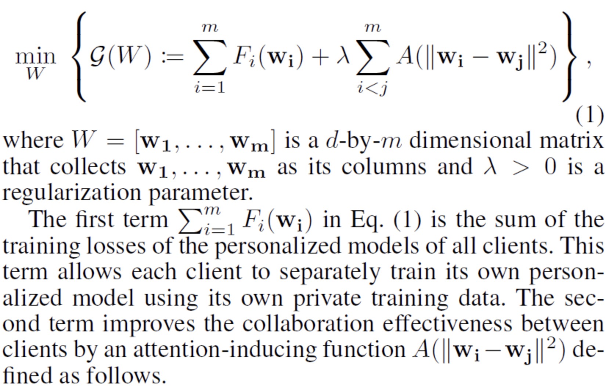

# [AAAI21] Personalized Cross-Silo Federated Learning on Non-IID Data

该算法的目标函数为：
    
其中，第二项$A(\|\omega_{i} - \omega_{j}\|^{2})$的作用是使不同节点进行信息交流。该函数的定义如下：
.png)

作者提出了一个求解上述目标函数的算法-FedAMP，具体如下
：
    .png)

注意到，函数$A(\cdot)$中的变量为$\|\omega_{i} - \omega_{j}\|^{2}$，由于是子模型参数距离二范数的平方，在式(3)进行求导时，会出现$(\omega_{i} - \omega_{j})$项，进而式(3)可以表示为模型参数 $\omega_{1}^{k-1},...,\omega_{m}^{k-1}$的线性组合：

  .png)

我们可以将 $u_{i}$ 看作是节点 $i$ 在云端子模型的参数，可以聚合各个节点的参数$\omega_{1}^{k-1},..., \omega_{m}^{k-1}$信息。计算得到 $u_{i}^{k}$ 后，我们可以根据公式（4）在节点 $i$ 上更新 $\omega_{i}^{k}$:

  .png)

借助于$u_{i}$聚合其他节点的参数，节点$i$可以获取其他节点的信息。在云端优化完$A(W)$后，对于每个节点，再利用式(6)优化损失函数$F_{i}(w)$。

  .png)

  .png)

在聚合其他节点参数时，式(5)中不同节点参数的权重为
$$
\xi_{i,j} = \alpha_{k}A'(\|\omega_{i}^{k-1} - \omega_{j}^{k-1}\|^{2}), \quad (i \ne j)
$$
根据定义1，在$[0, \infty)$上，$A$是一个increasing and concave 函数，函数A的导数$A'$在$(0, \infty)$上为non-negative and non-increasing 函数，所以$A'(\|\omega_{i}^{k-1} - \omega_{j}^{k-1}\|^{2})$相当于一个相似度函数，如果两个节点的参数$w_{i}^{k-1}$和$w_{j}^{k-1}$的欧氏距离小，那么这两个节点的相似度要高，对应到$u_{i}^{k}$和$u_{j}^{k}$中，它们的权重更高，因而$u_{i}^{k}$和$u_{j}^{k}$更接近，进一步，$w_{i}^{k}$和$w_{j}^{k}$更接近。

# [AAAI21] TornadoAggregate: Accurate and Scalable Federated Learning via the Ring-Based Architecture

在这篇文章中，作者提出一种可以提高精度和稳定性的聚合方式，并且讨论了当前已有的各种聚合方式。

  

作者指出STAR 这种全局聚合结构的稳定性差，相较而言，RING 结构通过移除全局聚合，解决了STAR稳定性差的问题。但是，RING 结构在FL中不切实际，假设共 $|N|$ 个节点，RING需要进行的通信轮数是 STAR结构的 $|N|$ 倍数。 除此之外，作者也总结讨论了其他已有聚合结构：STAR-stars, STAR-rings, RING-stars, RING-rings。

作者基于RING结构提出了两种新的聚合结构，通过减少RING结构带来的方差，提高了稳定性和精度。

# [ICML20] FedBoost: Communication-Efficient Algorithms for Federated Learning

作者借助集成的思想以减少FL中的通信成本。一些预先训练好的弱模型可以通过可获得的公共数据集训练。假设我们有 $q$ 个已经训练好的弱模型 $H = (h_{1},...,h_{q})$，本文的目标是学习组合权重 $\alpha = \{ \alpha_{1}, ..., \alpha_{q}\}$，从而得到 $\sum_{k=1}^{q} \alpha_{k}h_{k}$ 使得损失最小化。

  .png)

# [ICML20] FetchSGD: Communication-Efficient Federated Learning with Sketching

作者提出一个新的算法，算法思想为： 在每一轮，每个节点基于自己的局部信息计算得到一个梯度，然后在进行聚合前，作者使用一种叫做Count Sketch的数据结构对梯度进行压缩。中心端保留momentum和error accumulation Count Sketches，每轮更新的权重参数根据error accumulation sketch得到。

# [ICML20] Federated Learning with Only Positive Labels

# [ICML20] From Local SGD to Local Fixed-Point Methods for Federated Learning

# [NIPS20] Lower Bounds and Optimal Algorithms for Personalized Federated learning
L2SGD
# [NIPS20] Federated Bayesian Optimization
# [NIPS20] Federated Multi-Task Learning
 MOCHA
# [NIPS20] FedSplit: An algorithmic framework for fast federated optimization
作者首先讨论了两种已有算法FedSGD和FedProx算法，作者证明这两种算法都不具有可行的收敛理论保证，因为它们得到的稳定点都不是它们预先要求解的目标函数的解。因此，作者提出FedSplit算法，该算法得到的稳定点是优化问题的最优解。

# [NIPS20] An Efficient Framework for Clustered Federated Learning
作者提出一个迭代的聚类算法，论文假设所有的节点都能够被划分为若干类。由于每个节点所属类别未知，该算法可以交替估计每个节点所属的类别，并且通过梯度下降优化模型参数。论文中的算法可以解决数据分布的异质性问题。但是需要预先给定聚类个数 $k$。
  .png)

# [NIPS20] Group Knowledge Transfer: Federated Learning of Large CNNs at the Edge
作者提出一种新的交替最小化算法，该算法在每个节点上先训练较小的CNN网络，然后通过信息迁移训练一个较大的中心端CNN网络。
.jpg)

上图展示了每个节点有一个特征提取器和分类器，可以在单个节点上进行模型训练。进行局部训练后，每个节点生成同样的张量，将其特征输出到中心端进行训练，然后借助于最小化预测标签和真实标签的KD 损失函数训练参数。为了提升节点模型的表现，中心端会将其预测的标签发送给每个节点，然后每个节点可以基于其预测标签和中心端预测结果的损失函数训练子模型。

  .png)
# [NIPS20] Personalized Federated Learning with Moreau Envelopes
为了解决异质性问题，作者考虑给每个节点的损失函数添加正则项：
$$
f_{i}(\theta_{i}) + \frac{\lambda}{2}\|\theta_{i} - w\|^{2}，
$$

优化问题表示为：

  .jpg)

# [NIPS20] Tackling the Objective Inconsistency Problem in Heterogeneous Federated Optimization

大多数论文在分析算法的收敛性时，往往会假设每个节点上进行局部更新的次数相同，它们的工作表明算法能够达到全局目标函数的稳定点。事实上，论文指出当不同节点局部更新次数不一致时，算法收敛到的稳定点不是原始目标函数的最优解，而是另一个目标函数。

解决这个问题的最简单想法就是固定每个节点的局部更新次数，在进行新的一轮迭代前，要等所有节点进行迭代完才能开始。这种方法能够保证目标函数的一致性，但是会带来训练成本。一些算法比如FedProx, VRLSGD以及SCAFFOLD用于处理non-IID问题，可以减少目标函数的不一致问题，但是要么有较慢的收敛速度，要么需要额外的通信成本和内存。

本文作者提出FedNova算法，可以保证目标函数的一致性问题。

# [NIPS20] Throughput-Optimal Topology Design for Cross-Silo Federated Learning

# [NIPS20] Federated Principal Component Analysis
# [NIPS20] Ensemble Distillation for Robust Model Fusion in Federated Learning

# [NIPS20] Differentially-Private Federated Linear Bandits

# [NIPS20] Inverting Gradients - How easy is it to break privacy in federated learning?

# [NIPS20] Distributionally Robust Federated Averaging

# [ICLR20] FAIR RESOURCE ALLOCATION IN FEDERATED LEARNING

作者提出 q-FFL 算法，目的是解决FL中的公平问题：不同节点上的精度均匀。通过最小化一个加权的损失函数，具有较高损失的节点具有较高的权重。

  .png)

目标函数：

  .png)

具体算法略。
# [ICLR20] DIFFERENTIALLY PRIVATE META-LEARNING

# [ICLR20] DBA: DISTRIBUTED BACKDOOR ATTACKS AGAINST FEDERATED LEARNING

# [ICLR20] GENERATIVE MODELS FOR EFFECTIVE ML ON PRIVATE, DECENTRALIZED DATASETS

# [ICLR20] ATTACK-RESISTANT FEDERATED LEARNING WITH RESIDUAL-BASED REWEIGHTING