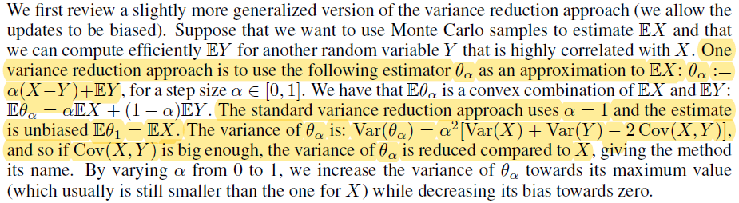

# [SVRG2013] Accelerating Stochastic Gradient Descent using Predictive Variance Reduction

## Introduction 

考虑如下优化问题 
$$
\min P(\omega) = \frac{1}{n}\psi_{i}(\omega)
$$

- 如果采用平方损失，最小二乘回归；
- 考虑正则项，令 $\psi_{i}(\omega) = \ln(1 + \exp(-\omega^{T}x_{i}y_{i})) + 0.5\lambda\omega^{T}\omega, y_{i} \in \{-1,1\}$，regularized logistic regression。
  
梯度下降算法更新过程：
$$
\omega^{(t)} = \omega^{(t-1)} - \eta_{t}\nabla P(\omega^{(t-1)}) = \omega^{(t-1)} - \frac{\eta_{t}}{n}\sum_{i=1}^{n}\nabla \psi_{i}(\omega^{(t-1)})
$$

但是，在每一步，GD都需要计算 $n$ 个一阶偏导，计算量大。所以，一个改进就是随机梯度下降SGD：在每一步迭代时，随机从 $\{1,...,n\}$ 中抽取 $i_{t}$，然后
$$
\omega^{(t)} = \omega^{(t-1)} - \eta_{t}\nabla \psi_{i_{t}}(\omega^{(t-1)})
$$

期望 $E[\omega^{(t)}|\omega^{(t-1)}]$ 同梯度更新的结果一致。 SGD的更一般表达形式为
$$
\omega^{(t)} = \omega^{(t-1)} - \eta_{t}g_{t}(\omega^{(t-1)},  \xi_{t})
$$

$\xi_{t}$ 为一个依赖于 $\omega^{(t-1)}$ 的随机变量， 并且期望 $E[g_{t}(\omega^{(t-1)},  \xi_{t})|\omega^{(t-1)}] = \nabla P(\omega^{(t-1)})$。 

SGD的优势就是每步迭代只需要计算一个梯度，因此计算成本是GD的 $\frac{1}{n}$。但是，SGD的一个缺点就是随机性引入了方差：虽然 $g_{t}(\omega^{(t-1)},  \xi_{t})$ 的期望等于梯度 $\nabla P(\omega^{(t-1)})$，但是每个$g_{t}(\omega^{(t-1)},  \xi_{t})$ 是不同的。方差的出现导致收敛速度变慢。 对于SGD，由于随机取样带来的方差，一般都会要求其步长 $\eta_{t} = O(1/t)$，从而得到一个 sub-linear 收敛率 $O(1/t)$。

- GD: 每步迭代计算慢，收敛快。
- SGD：每步迭代计算快，收敛慢。

为了改进SGD，一些学者开始设计算法以减少方差，从而可以使用较大的步长 $\eta_{t}$。有一些算法被提出来，比如：SAG(stochastic average gradient)，SDCA。但是这两个算法需要存储所有的梯度，一些情况下不太实际。因此作者提出了一个新的算法，该算法不需要存储所有的梯度信息，并且有较快的收敛速度，可以应用于非凸优化问题。

## Stochastic Variance Reduced Gradient (SVRG)
为了保证收敛，SGD的步长必须衰减到0，从而导致收敛率变慢。需要较小步长的原因就是SGD的方差。作者提出一个解决方案。每进行 $m$ 次SGD迭代后，记录当前参数 $\tilde{\omega}$ 以及平均梯度：
$$
\tilde{\mu} = \nabla P(\tilde{\omega}) = \frac{1}{n}\sum_{i=1}^{n} \nabla \psi_{i}(\tilde{\omega}).
$$

然后接下来的更新为：

$$
\omega^{(t)} = \omega^{(t-1)} - \eta_{t}(\nabla \psi_{i_{t}}(\omega^{(t-1)}) - \nabla \psi_{i_{t}}(\tilde{\omega}) + \tilde{\mu})
$$

注意到：
$$
E[\omega^{(t)}|\omega^{(t-1)}] = \omega^{(t-1)} - \eta_{t}\nabla P(\omega^{(t-1)})
$$

算法如下：

  

更新步骤中梯度的方差是减小的。当 $\tilde{\omega}$ 和 $\omega^{(t)}$ 收敛到最优参数 $\omega_{*}$，$\tilde{\mu} \to 0$， $\nabla\psi_{i}(\tilde{\omega}) \to \nabla \psi_{i}(\omega_{*})$，有
$$
\nabla\psi_{i}(\omega^{(t-1)}) - \nabla\psi_{i}(\tilde{\omega
}) + \tilde{\mu} \to \nabla\psi_{i}(\omega^{(t-1)}) - \nabla\psi_{i}(\omega_{*}) \to 0
$$

SVRG的学习率不需要衰减，因此能有较快的收敛速度。作者提到，参数 $m$ 应该 $O(n)$， 比如对于凸问题：$m = 2n$，非凸问题：$m = 2n$。

# [SAGA2015] SAGA: A Fast Incremental Gradient Method With Support for Non-Strongly Convex Composite Objectives

考虑最小化函数：
$$
f(x) = \frac{1}{n}\sum_{i=1}^{n}f_{i}(x)
$$

作者提出了一个叫做SAGA的算法，在目标函数为强凸函数时，SAGA的收敛速度优于SAG和SVRG。算法如下：

  

  本文给出了variance reduction算法的一个解释：
   

 几种算法比较：
   

# [Variance Reduced Stochastic Gradient Descent with Neighbors 2015]

# [Katyusha 2017] Katyusha: The First Direct Acceleration of Stochastic Gradient Methods

Nesterov's momentum 通常用于加速梯度下降算法，但是，对于随机梯度下降，Nesterov's momentum 可能无法对算法进行加速，即使优化目标为凸函数。因此，针对SGD，作者提出 Katyusha 算法，借助于动量Katyusha momentum实现加速SGD。

考虑如下优化问题：

$$
\min_{x \in \mathbb{R}^{d}} \{F(x) = f(x) + \psi(x) = \frac{1}{n}\sum_{i=1}^{n} f_{i}(x) + \psi(x)\}
$$
其中 $f(x) = \frac{1}{n}\sum_{i=1}^{n} f_{i}(x)$ 为凸函数，并且是 $n$ 个凸函数的有限平均。$\psi(x)$ 为凸函数，可为近端函数。大多数假设 $\psi(x)$ 为 $\sigma$-strongly，并且 $f_{i}(x)$ L-smooth。

作者提出一个可以求解上述优化问题的加速随机梯度下降算法-Katyusha：

   

其中，$\tilde{x}$ 为snapshot point，每经过 $n$ 次迭代更新一次。$\tilde{\nabla}_{k+1}$ 为variance reduction 中的梯度形式。$\tau_{1}$，$\tau_{2} \in[0,1]$ 为两个动量参数，$\alpha = \frac{1}{3\tau_{1}L}$。

## Our New Technique – Katyusha Momentum

最novel的部分是 $x_{k+1}$ 的更新步骤，是 $y_{k}$, $z_{k}$ 以及 $\tilde{x}$ 的凸组合。理论建议参数 $\tau_{2} = 0.5$，$\tau_{1} = \min\{\sqrt{n\sigma/L}, 0.5\}$。

对于传统的加速梯度下降算法，$x_{k+1}$ 仅仅是 $y_{k}$ 和 $z_{k}$ 的凸组合，$z_{k}$ 起到了一个“动量”的作用，即将历史加权的梯度信息添加到 $y_{k+1}$ 上。比如假设 $\tau_{2} = 0, \tau_{1} = \tau$, $x_{0} = y_{0} = z_{0}$，我们可以得到：

   

由于 $\alpha$ 通常大于 $1/3L$，上述递推过程意味着随着迭代进行，梯度 $\tilde{\nabla}_{t}$ 的贡献越高。比如，$\tilde{\nabla}_{1}$ 的权重不断增大 ($\frac{1}{3L} < ((1-\tau)\frac{1}{3L} + \tau\alpha) < ((1 - \tau)^{2}\frac{1}{3L} + (1 - (1 - \tau)^{2})\alpha)$)。这就是一阶加速方法的核心思想。

在Katyusha算法中，作者认为 $\tilde{x}$ 同等重要，它能保证 $x_{k+1}$ 不要太远离 $\tilde{x}$。$\tilde{x}$ 的添加可以看作是一个 “negative momentum”，使 $x_{k+1}$ back to $\tilde{x}$，抵消一部分前面迭代时的 positive momentum”。

当 $\tau_{1} = \tau_{2} = 0.5$ 时，Katyusha同SVRG几乎一致。

# [L-SVRG, L-Katyusha 2019] Don’t Jump Through Hoops and Remove Those Loops: SVRG and Katyusha are BetterWithout the Outer Loop

SVRG和Katyusha算法的共同关键结构就是两者都包含一个外层循环 (outer loop)。最初先在outer loop上使用所有样本计算梯度，然后计算出来的结果再用于内层循环 (inner loop)，结合新的随机梯度信息，构造variance-reduced 梯度估计量。作者指出，由于SVRG和Katyusha算法都包括一个outer loop，所以存在一些问题，比如：算法很难分析；人们需要决定内部循环的次数。对于SVRG，理论上内部循环的最优次数取决于 $L$和 $\mu$，但是 $\mu$ 通常未知。由于这些问题存在，人们只能选择次优的inner loop size，通常设置内部循环次数为 $O(n)$ 或者 $n$。

在这篇论文中，作者将外层循环 (outer loop) 丢弃，在每次迭代时采用掷硬币技巧决定是否计算梯度，从而解决了上述问题。作者证明，新提出的算法和原始两个算法具有同样的理论性质。

   
   

# [L-SVRG, L-Katyusha 2019] L-SVRG and L-Katyusha with Arbitrary Sampling

# 参考文献

- Johnson, R. and Zhang, T. Accelerating stochastic gradient descent using predictive variance reduction. In Advances in Neural Information Processing Systems 26, pp. 315–323, 2013a.  
- Defazio, A., Bach, F., and Lacoste-Julien, S. SAGA: a fast incremental gradient method with support for non-strongly convex composite objectives. In Advances in Neural Information Processing Systems, pp. 1646–1654, 2014.  
- Hofmann, T., Lucchi, A., Lacoste-Julien, S., and McWilliams, B. Variance reduced stochastic gradient descent with neighbors. In Advances in Neural Information Processing Systems, pp.2305–2313, 2015.  
- Allen-Zhu, Z. Katyusha: The first direct acceleration of stochastic gradient methods. In Proceedings of the 49th Annual ACM SIGACT Symposium on Theory of Computing, pp.1200–1205. ACM,2017.
- Kovalev, D., Horváth, S., and Richtárik, P. Don’t jump through hoops and remove those loops: SVRG and Katyusha are better without the outer loop. In Proceedings of the 31st International Conference on Algorithmic Learning Theory, 2020.
- Qian, X., Qu, Z., and Richtárik, P. L-SVRG and L-Katyusha with arbitrary sampling. arXiv preprint arXiv:1906.01481, 2019a.