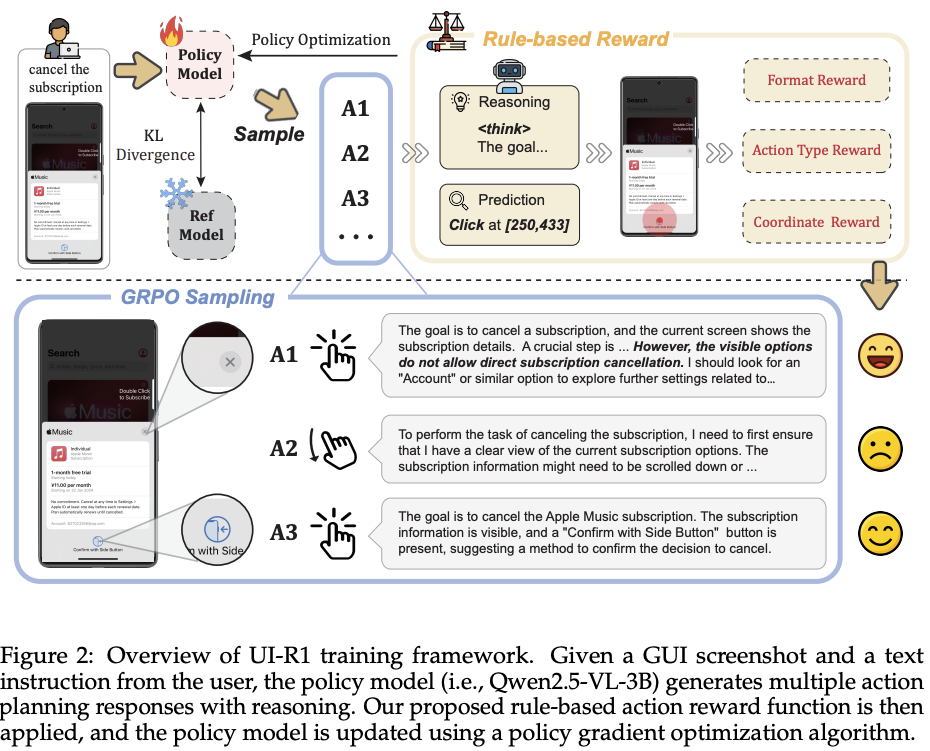
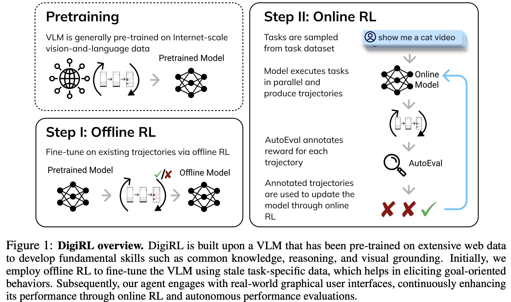
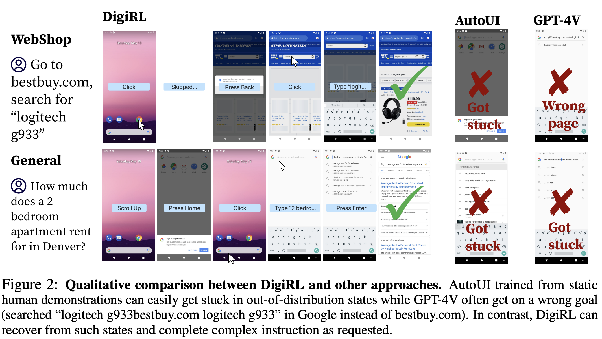
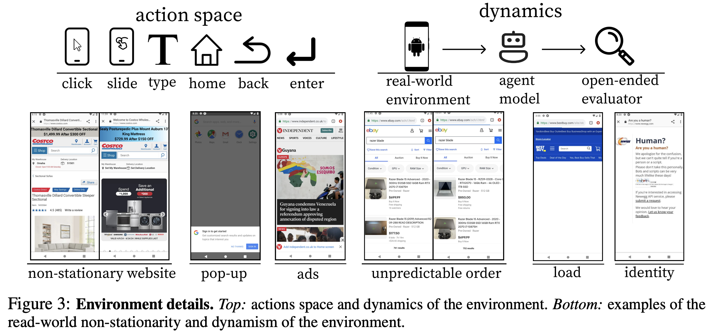
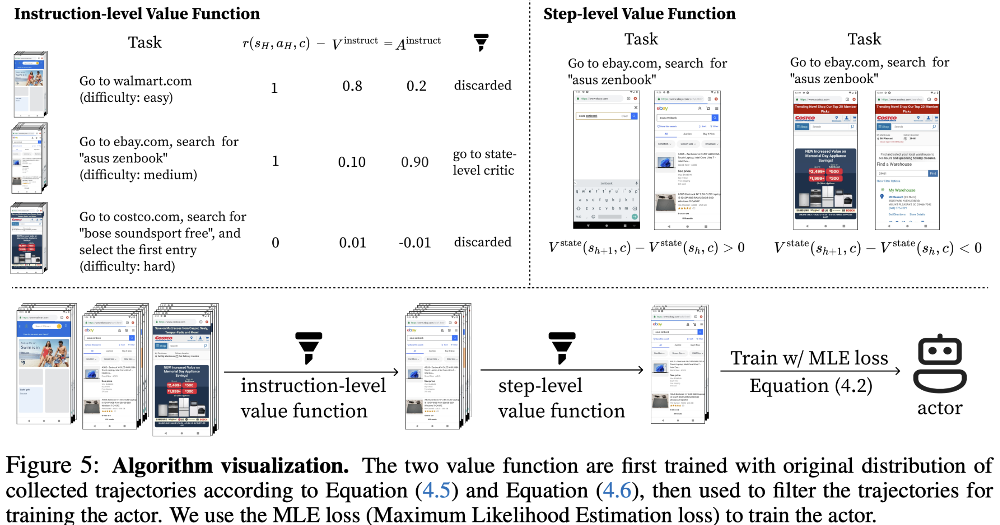
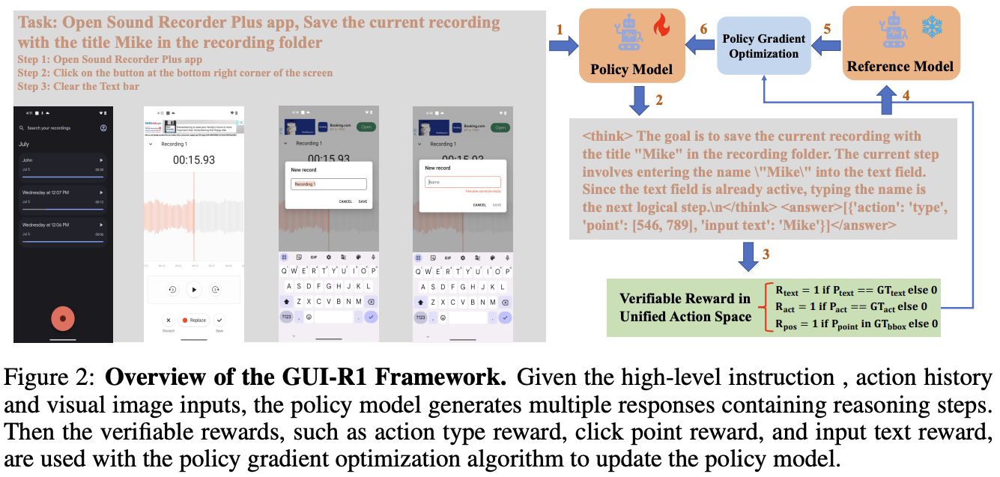
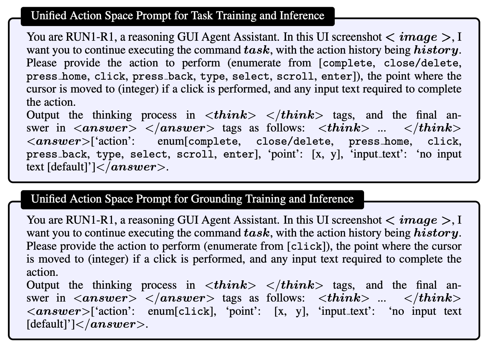
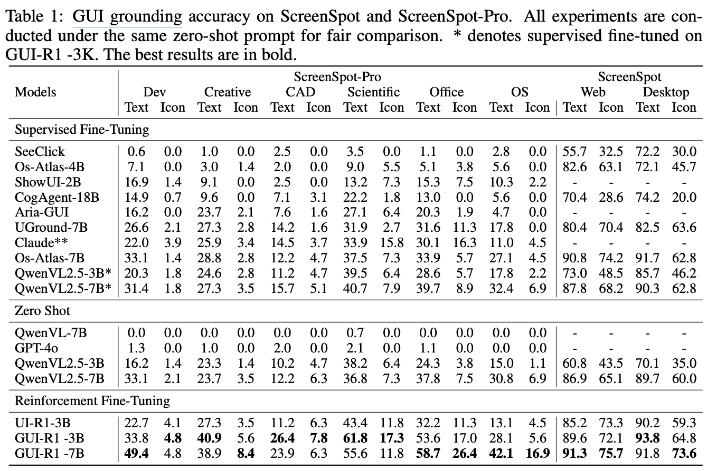
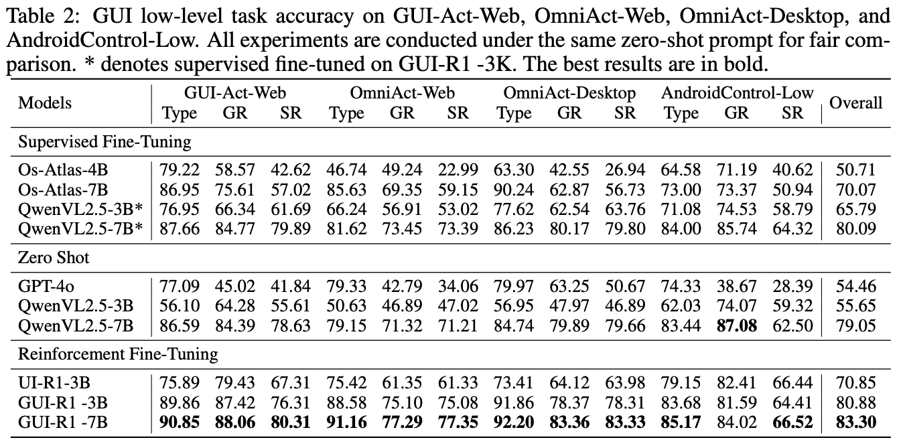
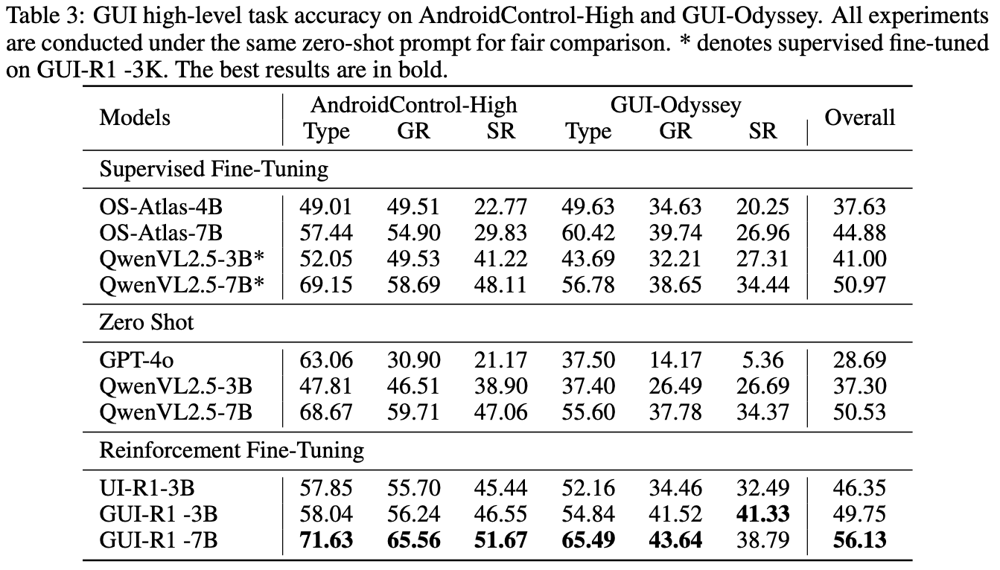

# [(201805)(HRL) Data-Efficient Hierarchical Reinforcement Learning](https://arxiv.org/abs/1805.08296)

# [(RL, 单步决策） UI-R1: Enhancing Efficient Action Prediction of GUI Agents by Reinforcement Learning](https://arxiv.org/pdf/2503.21620)
近期，DeepSeek-R1 展示了通过基于规则的强化学习（RL）训练大语言模型（LLMs）后推理能力的显著提升。尽管其在语言任务中取得了成功，其在多模态领域，特别是图形用户界面（GUI）代理任务中的应用仍鲜有探索。为了填补这一空白，本文提出了 UI-R1 ——首个探索基于规则的强化学习如何提升多模态大语言模型（MLLMs）在 GUI 动作预测任务中推理能力的框架。UI-R1 引入了一种新颖的规则型动作奖励机制，用以指导模型在执行预测时更具推理能力和策略性。该奖励系统基于预定义的 GUI 操作规则，可明确判断模型动作的合理性与有效性。采用 **Group Relative Policy Optimization（GRPO）** 策略优化算法，通过对比学习方式强化正确操作序列，提升多模态模型的决策能力。构建了一个包含 **136 个具有挑战性的任务**的小规模数据集，涵盖移动设备中常见的五种操作类型，用于训练和验证 UI-R1 的有效性。

# [(RL, 复杂任务） DigiRL: Training In-The-Wild Device-Control Agents with Autonomous Reinforcement Learning](https://arxiv.org/pdf/2406.11896)
即使是最强大的专有视觉语言模型（VLM），如 GPT-4V 和 Gemini 1.5 Pro，在设备上完成复杂任务时仍难以生成正确的操作。因此，大多数构建设备 agent 的前期工作通过将专有 VLM 与提示、搜索或工具使用相结合，围绕其构建了复杂的封装层。虽然构建提示或检索封装层以提升现有 VLM 的决策性能在短期内有效，但由于不更新模型权重，**所得 agent 的有效性本质上受限于基础模型的能力**。另一种解决方案是通过模仿学习在演示数据上对模型进行微调。然而，网络和设备具有动态特性，训练过时数据中操作的模型会随着生态系统的变化而表现不佳。

若能构建一种交互式方法，使视觉语言模型（VLM）通过在设备和互联网上的自身经验直接适应与学习，则无需依赖专有模型的封装层即可打造鲁棒可靠的设备控制 agent。这种基于学习的方法需满足以下核心需求：

- 在线交互数据驱动：静态演示数据无法覆盖部署后的真实任务场景。例如，仅在网页导航场景中，野外网站的动态特性就意味着 agent 会频繁遇到与训练数据差异显著的页面版本，需在视觉外观变化和干扰因素存在的情况下保持可靠行为。

- 动态错误过滤与学习：实时学习依赖模型自身的多轮交互数据（其中包含大量失败案例），需设计机制自动筛选正确操作并过滤错误行为。

如图 1 所示，本文提出自主强化学习方法 DigiRL（RL for Digital Agents），用于训练设备控制 agent，在多项安卓设备控制任务中实现 SOTA 性能。其训练流程分为两个阶段：

- 离线 RL 初始化阶段：利用现有数据预训练 agent，奠定基础策略；
  
- 离线 - 在线 RL 优化阶段：基于离线阶段模型，通过在线交互数据进一步微调。

## Problem Setup and Preliminaries
### 问题定义与研究范围  
本文聚焦于**基于像素级交互的虚拟设备控制**，以安卓设备为研究对象。相较于仅关注网页导航的传统学习环境，安卓环境更具挑战性与通用性——网页浏览器仅是其中一个应用。

**任务流程**：

1. **初始化**：每次训练从模拟器 home screen 开始；  
   
2. **任务输入**：从预定义语言指令集中选取任务，例如 “What’s on the menu of In-n-Out?” 或 “Go to newegg.com, search for razer kraken, and select the first entry”；  
   
3. **交互动作**：agent 可以通过以下操作控制模拟器：
   
   - **坐标操作**：基于归一化坐标（0-1）的点击（Tap）和滑动（Swipe）； 
   
   - **文本输入**：可变长度的文本输入； 
   
   - **系统按钮**：HOME、BACK、ENTER 等特殊按键（如图 3 所示）。  

**数据来源**：训练与测试指令来自 AitW 数据集的“通用”和“网络购物”子集，涵盖信息查询、电商购物等多类任务。  

### 真实环境中的随机性挑战  
与模拟环境相比，真实设备会面临三类独特随机性挑战：  

1. **应用与网站的非平稳性**：频繁更新导致在线观测与离线数据存在显著差异（如界面布局变化、功能按钮位置调整）；例：某购物应用更新后，“搜索栏”从屏幕顶部移至底部，静态训练数据无法覆盖此类变化。  

2. **不可预测的干扰因素**：弹出广告、登录请求、搜索结果顺序随机变化等动态干扰；例：网页加载时随机出现的验证码或权限请求，可能阻断 agent 的预设操作流程。  

3. **技术故障与延迟**：网页加载不完整、特定站点临时访问限制等偶发问题；例：因网络延迟导致按钮点击无响应，需 agent 重复尝试或调整策略。  

### 可靠且可扩展的在线强化学习（RL）设置  
由于自主强化学习需要将数据收集与训练过程交织进行，为了在随机性环境中最大化学习效率，构建实时数据收集管道以获取足够经验用于梯度更新至关重要。然而，受限于单线程安卓模拟器环境的延迟问题，传统方法难以实现这一目标。为此，作者通过**并行化安卓模拟器**并结合了错误处理机制。  

#### 并行化环境架构  
- **多实例并发**：支持同时运行** 64 个安卓模拟器实例**，通过分布式计算框架实现数据收集的并行化，将单位时间内的交互样本量提升 64 倍；  
  
- **实时错误处理**：集成自动重启机制，当某个模拟器实例出现崩溃或无响应时，系统自动重启该实例并恢复任务，确保数据收集的连续性。  

#### 基于 Gemini 1.5 Pro 的自主评估器  
环境需通过判断当前观测是否表明 agent 成功完成任务来提供奖励信号。为使评估器适用于广泛任务，作者扩展了 Pan 等人提出的端到端自主评估框架，无需访问模拟器的内部状态或为每个任务手动编写验证规则，突破了传统方法依赖人工定义执行函数的局限；采用 Gemini 1.5 Pro 作为评估器主干，通过**少样本演示（few-shot rollouts）**和人工标注的成功指标对模型进行初始化，使其能够基于屏幕截图、任务指令等多模态输入，自主判断任务完成状态。  

#### 评估流程与泛化能力  
1. **输入数据**：  
   
   - agent 当前交互的屏幕截图；  
  
   - 任务原始指令（如“在亚马逊搜索笔记本电脑”）； 
   
   - 可选的中间操作日志（如已执行的点击坐标序列）。  
  
2. **评估逻辑**：  
   
   - Gemini 1.5 Pro 通过视觉-语言联合推理，判断截图内容是否满足任务目标（如截图显示亚马逊搜索结果页且首条为笔记本电脑）；
    
   - 输出二值奖励信号（成功=+1，失败=0），或连续值奖励（如根据任务完成进度打分）。  
  
3. **泛化优势**：单一评估器可覆盖 AitW 数据集中的所有任务类型（包括信息查询、购物、应用操作等），避免了传统方法中为每个任务定制评估规则的繁琐流程，显著提升系统扩展性。  

## DigiRL: Autonomous RL for Building a Strong Device-Control Agent
### Device control and GUI navigation as a MDP
将自然语言指令引导的设备控制任务抽象为有限时域马尔可夫决策过程（MDP），表示为 $M = \{S, A, T, \mu_0, R, H\}$，并通过策略梯度算法求解该 MDP。初始状态 $s_0$ 和自然语言指令 $c$ 从初始状态分布 $\mu_0$ 中采样得到。若 agent 最终通过评估器判定成功完成任务，则获得奖励 $1$，否则为 $0$。轨迹在 agent 完成任务或达到最大交互步数 $H$ 时终止。状态由最近两帧屏幕截图表示。为详细说明方法，引入强化学习中的标准定义：策略 $\pi$ 的 $Q$ 函数表示在当前步骤执行特定动作 $a_h$ 并遵循策略 $\pi$ 后的期望长期回报：  
$$
Q^\pi(s_h, a_h, c) = \mathbb{E}_\pi [\sum_{t=h}^H r(s_t, a_t, c)],
$$  
价值函数 $V^\pi(s_h, c)$ 是策略 $\pi$ 下动作 $a_h$ 的 $Q$ 值均值，优势函数 $A^\pi(s_h, a_h, c)$ 则通过 $Q$ 值与值函数的差值计算：  
$$
A^\pi(s_h, a_h, c) = Q^\pi(s_h, a_h, c) - V^\pi(s_h, c).
$$

### Backbone of Our Approach: Off-Policy RL via Advantage-Weighted Regression
作者选择以优势加权回归（AWR）算法作为方法的起点。该算法表明，通过将策略向奖励函数诱导的指数化优势方向回归，可在可靠优化策略梯度的同时保持与先前策略的接近性，其优化目标为：  
$$
\arg\max_\pi  \mathbb{E}_\nu [\log \pi(a|s, c) \cdot \exp ( \frac{A(s, a, c)}{\beta} ) ], \tag{4.1}
$$  
其中，$\beta$ 为正参数，$\nu$ 为历史经验分布，$A(s, a, c)$ 表示给定上下文 $c$ 时状态-动作对 $(s, a)$ 的优势。为避免调优超参数 $\beta$，借鉴先前研究，采用对优势进行“硬过滤”而非计算指数的替代方法，得到用于模型微调的损失函数：  
$$
L(\pi) = -\mathbb{E}_{\text{filter}(\nu)} [ \log \pi(a|s, c) ]. \tag{4.2}
$$  
通常，这些优势通过在环境中运行蒙特卡洛（MC）展开来估计给定状态-动作对的价值，并从中减去由学习到的值估计器单独提供的状态价值估计。然而，鉴于设备生态系统的随机性会影响 MC 展开，该方法可能产生高方差的优势估计。

### Obtaining Reliable Advantage Estimates from Doubly-Robust Estimators
为在显著的环境随机性中可靠识别有利动作，作者受双稳健估计器启发，构建了单步优势估计器：  
$$
A_{\text{step}}(s_h, a_h, c) := \lambda^{H-h} r(s_H, a_H, c) + (1 - \lambda^{H-h} r(s_H, a_H, c)) ( V_{\text{step}}(s_{h+1}, c) + r(s_h, a_h, c) - V_{\text{step}}(s_h, c) ), \tag{4.3}
$$  
其中，$\lambda$ 为加权超参数。该优势估计器是广义优势估计（GAE）的简化版本，因问题中无中间奖励，故仅使用下一步优势估计与最终步优势估计。此构造平衡了两类估计器：

1. 高方差蒙特卡洛估计项 $\lambda^{H-h} r(s_H, a_H, c)$：受环境随机性影响，依赖最终奖励的估计具有高方差；  
   
2. 高偏差值函数估计项 $V_{\text{step}}(s_{h+1}, c) + r(s_h, a_h, c) - V_{\text{step}}(s_h, c)$：因值函数拟合不完美，基于相邻状态值差的估计存在偏差。  

实验表明，结合高方差与高偏差估计器可在性能上取得平衡。为实现单步硬过滤，仅需对双稳健估计器设置阈值 $A_{\text{step}}(s_h, a_h, c) > 1/H$，以判断哪些动作有助于目标推进。

###  Automatic Curriculum using an Instruction-Level Value Function
尽管优势加权回归（AWR，公式 4.1）结合稳健优势估计器（公式 4.3）在标准强化学习任务中已足够有效，但在初步实验中，作者发现其对设备控制任务的效果不足。这通常是由于任务集包含难度高度可变的任务，导致 agent 在已熟练的任务上收集过多数据，负面地影响了样本效率。相反，通过在训练中让 agent 体验最具信息价值的任务，可以获取最大的学习信号。为此，设计了**指令级价值函数** $V^{\text{instruct}}(c)$，以评估给定的轨迹是否能提供有效的学习信号：  
$$
A^{\text{instruct}}(s_h, a_h, c) := \sum_{t=h}^H r(s_t, a_t, c) - V^{\text{instruct}}(c) = r(s_H, a_H, c) - V^{\text{instruct}}(c), \tag{4.4}
$$  
其中，$\sum_{t=h}^H r(s_t, a_t, c)$ 是 $Q(s_h, a_h, c)$ 的蒙特卡洛估计。由于 MDP 建模仅在轨迹结束时提供奖励，上述等式成立。直观而言，若某轨迹的 $A^{\text{instruct}}(s_h, a_h, c)$ 值较高，表明价值函数 $V^{\text{instruct}}$ 较小，即该轨迹代表 agent 完成困难任务的宝贵经验，因此应优先处理，这与优先经验回放 [32] 或层级回放 [11] 的思想类似。在使用历史离策略数据缓冲区训练策略时，我们首先通过过滤步骤筛选出 $A^{\text{instruct}}$ 最高的前 $p\%$ 数据点，然后将其与双稳健优势估计器（公式 4.3）结合用于 AWR 更新（公式 4.1）。  

**实现细节**：作者使用基于轨迹奖励蒙特卡洛估计的交叉熵目标函数训练两类价值函数：  
$$
L(V^{\text{traj}}) = -\mathbb{E}_\nu [ r(s_H, a_H, c) \log V^{\text{traj}}(c) + (1 - r(s_H, a_H, c)) \log(1 - V^{\text{traj}}(c)) ], \tag{4.5}
$$  
$$
L(V^{\text{step}}) = -\mathbb{E}_\nu [ r(s_H, a_H, c) \log V^{\text{step}}(s_h, a_h, c) + (1 - r(s_H, a_H, c)) \log(1 - V^{\text{step}}(s_h, a_h, c)) ]. \tag{4.6}
$$  

**最终算法**：如图 5 所示，指令级价值函数通过公式 4.5 的损失训练，用于估计轨迹价值；单步价值函数通过公式 4.6 的损失训练，用于估计状态价值。训练策略时，首先利用公式 4.4 和公式 4.3 的价值函数过滤轨迹和状态，然后在过滤后的数据上使用公式 4.2 的最大似然估计（MLE）损失更新策略。该方法通过动态 prioritization 困难任务与稳健优势估计的结合，显著提升了设备控制 agent 在高随机性环境中的样本效率与决策可靠性。

# [(20250213) Digi-Q: Learning VLM Q-Value Functions for Training Device-Control Agents](https://arxiv.org/pdf/2502.15760)

# [(202504) GUI-R1 : A Generalist R1-Style Vision-Language Action Model For GUI](https://arxiv.org/abs/2504.10458v1)
论文将 GUI 智能体在 high level 指令任务中的目标定义为：理解并执行低层次操作指令，以完成高层次任务 $Q$，其决策依赖于当前界面图像 $I$ 和执行历史 $H$。具体地，给定输入 $Q$、$I$ 和 $H$，模型生成一组候选响应 $O = \{o_1, o_2, \ldots, o_N\}$，每个响应 $o_i$ 包含以下三个要素：

* **动作类型 $o^{\text{act}}$**：表示要执行的低层操作（如点击、输入等）；
  
* **输入文本 $o^{\text{text}}$**：若该操作涉及文本输入；
  
* **交互坐标 $o^{\text{point}}$**：若该操作为基于坐标的交互。

每个响应都会通过一个统一的动作空间奖励函数进行评估，得到对应的奖励值集合 $\{r_1, r_2, \ldots, r_N\}$。随后，应用 GRPO 框架对策略模型进行优化，在 KL 散度约束下计算各响应的优势（advantage），用于引导策略更新。其中，第 $i$ 个响应的相对优势 $A_i$ 计算公式为：
$$
A_i = \frac{r_i - \text{mean}(\{r_1, r_2, \ldots, r_N\})}{\text{std}(\{r_1, r_2, \ldots, r_N\})}
$$
其中，mean 和 std 分别表示奖励集合的均值和标准差。该优势值反映了当前响应相对于整体候选中的优劣程度，用于强化高质量响应、抑制低质量响应，从而提升模型策略的整体表现。

### 统一行动空间中的可验证奖励
论文采用统一动作空间建模策略，将不同平台上的动作类别进行抽象提取并整合为一个统一的动作空间。这一策略确保所有高层任务指令都可被分解为一系列子动作，从而解决多平台联合训练中的动作空间冲突问题。在此统一动作空间的基础上，论文设计了可验证的奖励函数，用于评估模型预测动作的准确性，并引导强化学习过程。具体的奖励设计如下：
#### 1. 格式奖励（Format Reward）
借鉴已有研究，论文在训练过程中引入格式奖励，用于衡量模型输出是否符合预期的结构格式，包括语法和语义上的有效性。格式奖励指导模型生成具有结构化的推理过程与最终答案，有助于模型的自我学习和强化微调中的迭代优化。

#### 2. 准确性奖励（Accuracy Reward）
模型的输出包括三个部分：$o^{\text{act}}$：动作类型（如点击、滚动）；$o^{\text{point}}$：点击点坐标；$o^{\text{text}}$：输入文本。整体准确性奖励 $R_{\text{acc}}$ 由以下三项组成：
$$
R_{\text{acc}} = R_{\text{act}} + R_{\text{point}} + R_{\text{text}}
$$

##### 2.1 动作类型奖励 $R_{\text{act}}$
通过比较预测动作类型 $o^{\text{act}}$ 与真实动作类型 $gt^{\text{act}}$：
$$
R_{\text{act}} =
\begin{cases}
1, & \text{if } o^{\text{act}} = gt^{\text{act}} \\
0, & \text{otherwise}
\end{cases}
$$

##### 2.2 点击点奖励 $R_{\text{point}}$
比较预测点击坐标 $o^{\text{point}} = [x, y]$ 是否位于真实目标区域（边界框）$gt^{\text{bbox}} = [x_1, y_1, x_2, y_2]$ 内：
$$
R_{\text{point}} =
\begin{cases}
1, & \text{if } o^{\text{point}} \in gt^{\text{bbox}} \\
0, & \text{otherwise}
\end{cases}
$$

##### 2.3 文本输入奖励 $R_{\text{text}}$
比较预测文本 $o^{\text{text}}$ 与真实文本 $gt^{\text{text}}$ 的语义相似度，采用 F1 分数计算：
$$
R_{\text{text}} =
\begin{cases}
1, & \text{if } \text{F1}(o^{\text{text}}, gt^{\text{text}}) > 0.5 \\
0, & \text{otherwise}
\end{cases}
$$

#### 3. 最终响应奖励（Response Reward）
综合格式奖励与准确性奖励，最终的响应奖励定义为：

$$
R_o = \alpha R_f + \beta R_{\text{acc}}
$$

其中，$R_f$ 为格式奖励，$R_{\text{acc}}$ 为准确性奖励，$\alpha, \beta$ 为对应的加权系数。

### 数据收集和过滤
#### 数据过滤
为提高强化微调（RFT）的效率，论文采用 Qwen2.5VL-7B 模型，对每个样本生成 10 个响应，并使用一个基于统一动作空间建模的规则化奖励函数对其进行评估。通过该评估，过滤掉那些估算准确率为 0 或 1 的样本，以避免训练过程中的极端数据干扰，从而保证模型训练的稳定性。
经过筛选后，保留了约 14 万条低层级数据和 1500 条高层级数据。由于低层级数据数量远超高层级数据，从中随机采样 1500 条低层级数据，并与全部高层级数据合并，最终构建出一个均衡的、高质量训练集，共计 3000 条样本，命名为 GUI-R1-3K。

### 实验
#### 训练与推理细节
在监督微调（SFT）阶段，论文选用 QwenVL2.5-3B 和 QwenVL2.5-7B 作为基础模型，并采用 LLaMA Factory 框架 \[25] 进行训练。为了防止过拟合，SFT 仅训练一个 epoch。在强化微调（RFT）阶段，使用 EasyR1 框架，共训练 9 个 epoch。推理阶段，为确保各方法间公平对比，统一使用简单统一的 prompt，并全部在 **zero-shot 设置下**进行实验。所有实验均在 8 × NVIDIA A100-80G GPU 上完成。

#### 评估基准
论文在三个平台的八个智能体基准任务上对模型进行评估，包括：AndroidControl-Low, AndroidControl-High, GUI-Odyssey,
ScreenSpot, ScreenSpot-Pro, GUI-Act-Web, OmniAct-Web, and OmniActDesktop。仅使用这些基准任务的 **测试集** 进行评估。

#### 评估指标
参考 Os-Atlas，采用 GUI 智能体评估中常用的三个指标：

1. **Type（动作类型预测准确率）：** 衡量预测的动作类型（如 click、scroll）是否与真实标签完全一致。

2. **Grounding（点击点预测准确率）：** 评估模型在 GUI 定位任务中的表现，即预测坐标是否落入目标区域。

3. **SR（步骤成功率，Step-wise Success Rate）：** 某一步骤被视为成功，需满足预测的动作类型及其附加参数（如点击点或输入文本）均正确。

#### 实验结果

# [Verl: Volcano Engine Reinforcement Learning for LLMs](https://github.com/volcengine/verl)

# [SEAgent: Self-Evolving Computer Use Agent with Autonomous Learning from Experience](https://www.arxiv.org/pdf/2508.04700)
论文提出 **SEAgent**，一种具备自我进化能力的智能体框架。在该框架中，计算机使用智能体（CUAs）能够进入此前不熟悉的软件环境中进行自主探索与经验学习。要实现这种自我进化，需要解决两个关键挑战：（1）在陌生软件环境中生成可执行任务；（2）准确评估任务是否成功，并精确定位失败发生的步骤。为此，引入 **世界状态模型（World State Model）**，用于环境状态描述与逐步轨迹评估，同时设计了 **课程生成器（Curriculum Generator）**，依托动态更新的软件指南记忆库，持续生成多样化、难度递增的任务，从而形成课程式学习范式。智能体的策略通过从成功与失败中进行经验学习不断优化：失败部分通过对抗模仿学习改进，成功部分则结合 GRPO（Group Relative Policy Optimization） 进行强化。在奖励信号的准确性方面，论文发现现有计算机操作任务的奖励模型在判断精度和奖励密度上均存在不足。借助先进 LVLMs 的长上下文处理能力，论文将智能体的完整状态轨迹输入奖励模型，并基于 Qwen2.5-VL 微调得到 **世界状态模型**，在 AgentRewardBench 上相比基线模型提升了 7.5% 的精度，接近商业模型 GPT-4o 的水平，从而能够为自进化系统提供高质量的逐步奖励信号。此外，SEAgent 支持智能体进化为单一软件的专家型，或多个软件的通用型。针对直接训练通用型智能体表现不如专家型的问题，论文提出一种“专家到通用”的训练策略，不仅解决了这一不足，甚至在多软件应用上超越了单一专家的表现。

SEAgent 的目标是使计算机使用智能体（CUA）能够自主探索环境，并通过基于经验的强化学习在新的软件应用中逐步实现自进化。主要由三大核心组件构成：

(1) **Actor 模型 $\pi$**：策略 $\pi(a|s_t, I)$ 用于在时间步 $t$ 上，根据当前状态 $s_t$ 和任务指令 $I$，定义执行动作 $a$ 的概率，从而驱动智能体进行探索性操作。

(2) **世界状态模型 $M_{state}$**：这是一个经过微调的多模态视觉语言模型（LVLM），能够对环境状态进行细致描述，并评估 Actor 模型所执行轨迹中的每一步，生成任务完成与否的判断结果 $J$。同时，它通过对软件 GUI 状态变化的描述 $C$ 辅助训练，从而提升评估的准确性。

(3) **课程生成器 $M_{task}$**：由强大的大语言模型驱动，负责自动生成新的探索任务。它会根据 $M_state$ 在交互中提供的状态变化描述 $C$ 与轨迹判断 $J$，不断维护和更新软件指南 $U$。随着指南 $U$ 的逐渐丰富，$M_{task}$ 能够生成更具多样性与挑战性的任务，从而形成一个渐进式的课程学习体系。

# [MOBILERL: Advancing Mobile Use Agents with Adaptive Online Reinforcement Learning]()

# [COMPUTERRL: Scaling End-to-End Online Reinforcement Learning for Computer Use Agents]()

