# [（202402）SeeClick: Harnessing GUI Grounding for Advanced Visual GUI Agents](https://arxiv.org/abs/2401.10935)
本文主要介绍了一种新型的基于视觉 (screenshot) 的图形用户界面 (Graphical User Interface, GUI) -- SeeClick。传统的 GUI 智能体通常依赖于结构化文本 (structured text) 与环境进行交互。但是这种方式有三种主要的局限，具体来说，

- 在一些场景下，比如 ios 或桌面应用中，结构化文本可能无法直接获取。

- 结构化文本冗长，同时缺乏布局、图片、图标等视觉信息。

- 结构化文本格式繁多，比如 html, dom 等，导致需要根据不同任务设计不同的行为。

针对上述问题，作者提出了一种基于大型视觉语言模型 (Large Vision-Language Models, LVLMs) 的 视觉 GUI 智能体。它可以根据指令定位截图上的元素，进而执行任务，无需结构化文本。具体对比如 Figure 1 所示。
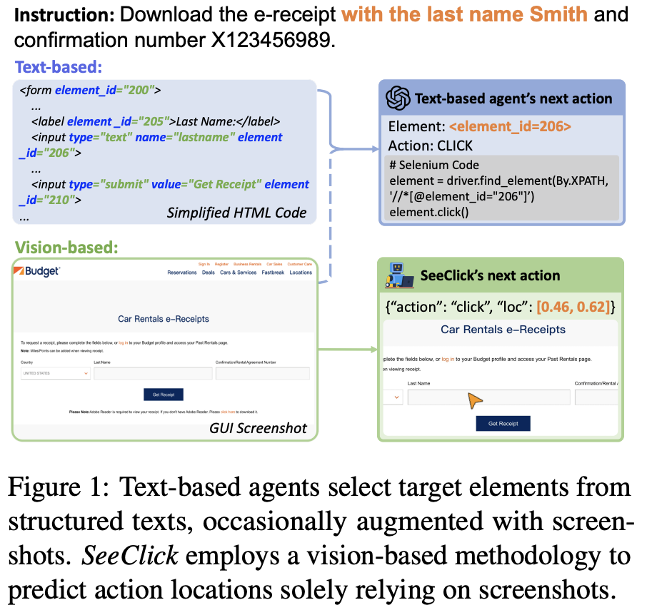

尽管目前 LVLMs 具有在自然图像中定位元素的能力，但是 GUI 的截图和自然图像存在显著差异，比如 GUI 图像包含大量密集文本，图标、控件较多。这些特点使得视觉 GUI 智能体面临的一个核心挑战是 GUI grounding，即如何根据指令准确定位屏幕中元素。

## GUI grounding for LVLMs
作者首先通过预训练 LVLM 生成关于元素位置的文本描述。给定界面截图 $s$ 和一组数据 ${(x_i, y_i)} (i = 0,...)$，目标是预测元素位置 $y$，即计算 $p(y | s, x)$。传统方法是将图片进行划分为若干个 bins，然后通过 tokenization 来表示元素 $x$ 以及位置 $y$。在这个工作中，作者直接将坐标视作语言生成文本，通过构造 prompt，例如：“In the UI, where should I click if I want to view the new album of Jony J?”，ground truth 为：“click (0.49, 0.40)”。利用交叉熵损失优化 LVLM，对每个 token 的预测概率求 log 并加总，优化模型输出序列与真实坐标文本之间的一致性。

## Data Construction
作者构建了三个数据集，分别是：web UI data、mobile UI data 以及通用的视觉-语言指令数据。

### Web Data
作者从开源的网页抓取数据库 Common Crawl 中提取了约 30 万个网页。对于每个网页 $s$，作者从其 HTML 中收集两类元素，分别是（1）可见文本元素，（2）带有 title 属性的元素，即该属性在鼠标悬停时会显示描述性文字。具体示例可见 Figure 3。通过这种方式，作者构建了大量的训练数据：（文本描述 x, 目标位置 y)。除了基本的 grounding 任务 $p(y∣s,x)$（给文本找位置），作者还引入了 Web OCR 任务 $p(x∣s,y)$ （根据坐标位置预测对应的文本内容）。这样可以让模型从两种方向理解网页 UI，提升对界面内容的理解能力。

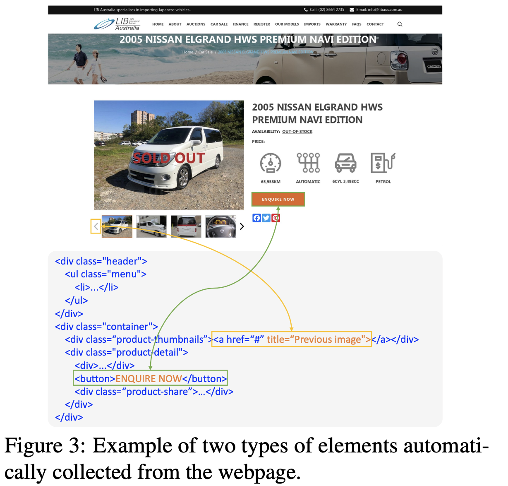

***忽视全局信息***

### Mobile Data
对于移动端 UI，作者考虑了三类数据，分别是
- 控件描述：Widget Captioning。例如音乐播放器中播放按钮对应的描述是 “play music”。作者使用了 Li 等人（2020b）提供的数据集训练集部分，包含约 2 万张截图、4 万个控件和 10 万条描述。用于 $p(x∣s,y)$ 任务。

- UI 定位：UI grounding。作者通过“反转”控件描述的过程构建 UI grounding 数据。把描述语句视为“指令”，把对应控件当作“目标位置”，这样就能形成类似于 $p(y | s, x)$ 的任务样本。为了提高多样性，作者还使用了移动 UI 大型公开数据集 RICO 数据集中自动提取的控件与说明。

- UI 总结：UI summarization。作者加入了 Wang 等人（2021）提出的移动 UI 总结数据，用于增强模型对整个界面的理解能力。

### General Data
为了维持大型视觉语言模型（LVLM）在自然图像上的通用理解能力，作者还使用了来自 LLaVA（Liu et al., 2023a）的通用图文指令跟随数据，其中包括对话、详细描述以及复杂推理等任务。

## Training Details
作者使用 Qwen-VL 模型，Qwen-VL 具有 grounding 功能和更高的分辨率（$448 \times 448$）。在训练过程中，作者使用 LoRA 来微调视觉编码器和 LLM。

# [(202411) (android control) On the Effects of Data Scale on UI Control Agents](https://arxiv.org/pdf/2406.03679)
近年来，能够自主控制用户界面以完成任务的智能体逐渐兴起，特别是利用大型语言模型（LLMs）驱动此类智能体的研究引发广泛关注。然而，如果不在人工收集的任务演示数据上进行微调，这些模型在真实界面控制中的表现仍然较弱。为此，研究者提出并发布了一个新数据集——ANDROID CONTROL，包含 15,283 条 Android 应用中的日常任务演示。与现有数据集相比，ANDROID CONTROL 的每个任务实例都包含 high level 和 low level 的人类指令，支持对任务复杂度的系统研究。该数据集在多样性方面具有显著优势，涵盖 14,548 个独特任务、涉及 833 个 Android 应用，使得模型在域内和跨域的泛化能力得以深入评估。实验发现，在 in domain 场景下，经过微调的模型显著优于零样本和少样本方法，其性能随着数据规模的增加而持续提升，表明通过收集更多数据有望获得稳健表现。然而，在 out of domain 场景下，性能提升幅度明显放缓，尤其在处理 high level 任务时，单纯依赖微调和数据扩展可能不足以实现强泛化能力。

# [（202410）AutoGLM: Autonomous Foundation Agents for GUIs](https://arxiv.org/abs/2411.00820)
作者指出构建 GUI 基础智能体面临的核心挑战：**现有预训练数据中缺乏决策类信息**。尽管互联网上有大量人类知识，但这些信息大多是静态的，难以反映人类在动态环境中的决策行为和交互模式。为了解决这一问题，必须通过两种方式增强基础智能体的动态知识：1. 真实环境交互。 2. 学习合成的决策轨迹。此外，研究还强调了**渐进式用户部署**的重要性。基础智能体的目标不是替代人类，而是**增强人类能力**。通过与用户的真实互动，智能体能学习如何更好地协助人类，用户也能逐步适应智能体的帮助。

为应对基础智能体在图形用户界面场景中的挑战与机遇，研究团队提出了基于 ChatGLM 模型系列的 AUTOGLM 系列智能体，专注于网页浏览与安卓设备控制两个核心应用场景。针对决策类数据稀缺的问题，AUTOGLM 采用多种训练技术与用户部署基础设施，并提出两项关键创新：一是设计中间接口，将规划与执行行为解耦，前者强调灵活性与错误恢复，后者注重动作准确性，从而提升系统开发效率与性能；二是引入自我演化的在线课程强化学习框架，通过“从弱到强”的渐进式策略，使智能体在实际环境中持续学习与优化，弥补传统离线训练在错误恢复与数据缺乏方面的不足，推动智能体能力不断增强。

## Insight 1: Intermediate Interface Design
研作者设计一个“中间接口”对于将“规划（Planning）”与“执行/落地（Grounding）”行为解耦。通过将这两个过程拆分为独立的模块，可以分别优化它们的性能——提升规划的灵活性，同时确保执行的准确性，彼此不会互相干扰。如下图所示，在解耦后的结构中：Planner 负责理解任务，生成自然语言描述（例如“点击右下角的提交按钮”）；Grounder 根据描述在图像中找到目标元素坐标（即 GUI 上的具体位置）。这样做的好处：规划与执行可以分别训练优化；错误定位更明确，可以知道是“指令理解错”还是“坐标找错”；更容易构造训练数据：通过环境中的自动观测，可以自动生成大量 Grounding 数据，提升 Grounder 的表现。

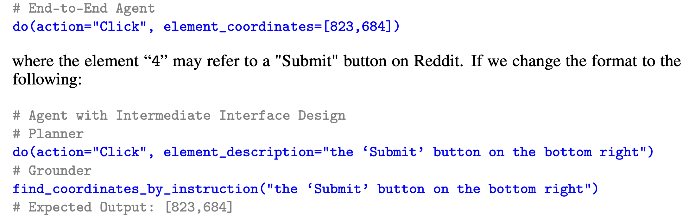

## Insight 2: Self-Evolving Online Curriculum RL
尽管通过中间接口可以缓解执行（grounding）过程中的准确性问题，但在规划（planning）阶段，问题仍然突出。特别是目前很多智能体系统依赖于闭源的 LLM/LMM API，这些模型无法通过训练进一步优化其规划能力。因此，AUTOGLM 决定自行训练可持续优化的 Planner，采用强化学习（RL）方法构建智能体。研究团队开发了名为 **WebRL** 的在线课程强化学习框架，用于在真实任务环境中训练智能体。以 WebArena 环境为例，他们采用了经典的 **Actor-Critic 架构**，并重点解决了两个关键挑战：
### 任务数据稀缺（Task Data Scarcity）
- 开始时仅依赖约 1000 条来自 VisualAgentBench 的行为克隆（BC）数据，GLM-4-9B 模型起始成功率为 22.4%。

- 数据不足后，采用**自我演化技术**来生成新任务：自动修改失败的任务指令，使其更复杂或更简单；使用 Critic 模块筛选有效的自生成任务，再用于下一轮训练；

这种方式实现了**边训练边扩充数据集**，解决了缺少专家示范的困境。

VAB-WebArena-Lite 是一个用于评估人工智能（AI）智能体在网页浏览任务中表现的基准测试环境。它是原始 WebArena 的精简版本，包含 165 个经过人工验证的任务，旨在加速评估过程并确保评判的准确性。

### 策略分布漂移（Policy Distribution Drift）
课程学习过程中，策略会逐步强化，但也可能导致模型偏离早期数据分布，影响泛化能力。为此，研究引入：
  - KL 约束的策略更新（限制策略变化范围）；
  - 基于信心度的经验重放机制（只用可信数据做回放）；

消融实验表明：这些机制是保证训练效果持续提升的关键。

# [（ICLR 2025）OS-ATLAS: A Foundation Action Model for Generalist GUI Agents](https://osatlas.github.io/)
当前构建 GUI 智能体的工作在很大程度上依赖于商业视觉语言模型（VLM），如 GPT-4o 和 GeminiProVision。然而，由于开源 VLM 在 GUI grounding 和 OOD 任务上的性能明显落后，实践者往往不愿使用它们。为推动该领域的研究发展，作者提出了 OS-Atlas —— 一个专注于 GUI grounding 和 OOD 智能行为任务的基础模型，结合了数据构建和模型设计上的创新。该团队开发出一个支持 Windows、Linux、macOS、Android 和 Web 等多个平台的开源 GUI grounding 数据合成工具包，并据此发布了开源跨平台 GUI grounding 数据集，涵盖超过 1300 万个 GUI 元素。结合先进的模型训练方法，OS-Atlas 能够有效理解 GUI 截图，并具备良好的泛化能力，适应此前未见的界面。通过在移动端、桌面端和网页端的六项基准测试中广泛评估，OS-Atlas 在多个任务上显著超越现有最先进模型。

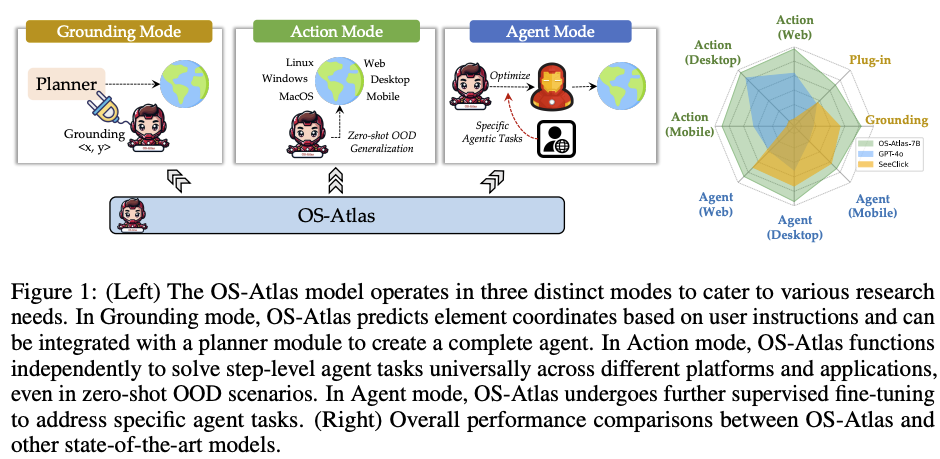

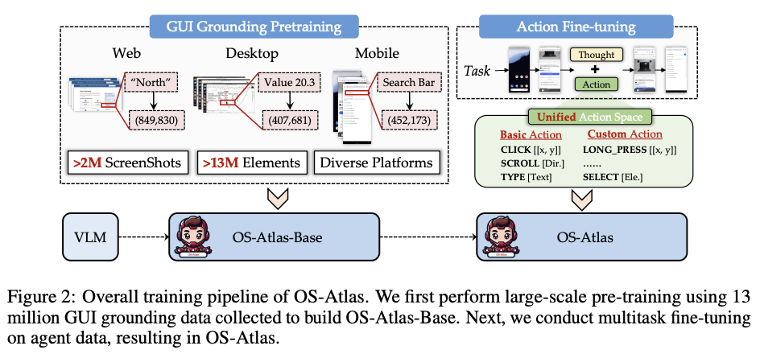

研究的训练流程分为两个阶段：

- （1）GUI grounding 预训练，旨在使视觉语言模型具备理解 GUI 截图并识别屏幕元素的能力；

- （2）动作微调阶段，将自然语言指令转化为可执行的 GUI 操作。
  
第一阶段的 GUI grounding 预训练依赖于大量高质量、跨平台的三元组数据 <截图、元素指代表达或指令、元素坐标>，坐标可表示为点或 bounding boxes。模型需根据截图与指令预测对应元素的位置。为支持大规模预训练，研究者构建了迄今为止最大的多平台 GUI 参考语料库，并使用 VLM 合成了一批指令 grounding 数据，涵盖五大平台，包含超过 230 万个截图和 1300 多万个 GUI 元素。该阶段训练后的模型被称为 OS-Atlas-Base。
第二阶段为动作微调，为实现模型在操作系统任务中的执行能力，研究者整合现有多任务智能体模仿学习数据集，训练模型根据 <截图，任务指令，**动作历史**> 三元组预测下一步操作。每个动作进一步表示为 <思考，动作类型，动作参数（如坐标）> 的三元组。然而，**初步实验发现多个数据集混合训练可能引发动作冲突，影响性能。为此，研究者提出在训练中引入统一动作空间以缓解此问题。**

在多任务微调中，研究者发现不同数据源的动作定义存在冲突，盲目混合使用会严重影响模型性能。例如，桌面环境中的“click”操作在逻辑上等同于移动设备中的“tap”，但若不加区分地训练，会导致模型混淆。为解决此问题，研究团队提出了统一动作空间（Unified Action Space），用于规范所有数据集的动作格式。
统一动作空间包括两类：基础动作和自定义动作。基础动作在所有平台上通用，当前设计包含 click、type 和 scroll 三种，确保了训练过程中的一致性并有助于跨平台共享知识。自定义动作则用于支持各平台或设备上特有的操作，如 open app（打开指定应用）和 drag（拖动物体至另一位置）。自定义动作的设计对于 OS-Atlas 在分布外任务中的表现尤为关键，因为它们支持用户按需扩展新任务与操作能力，从而提升模型的泛化能力。

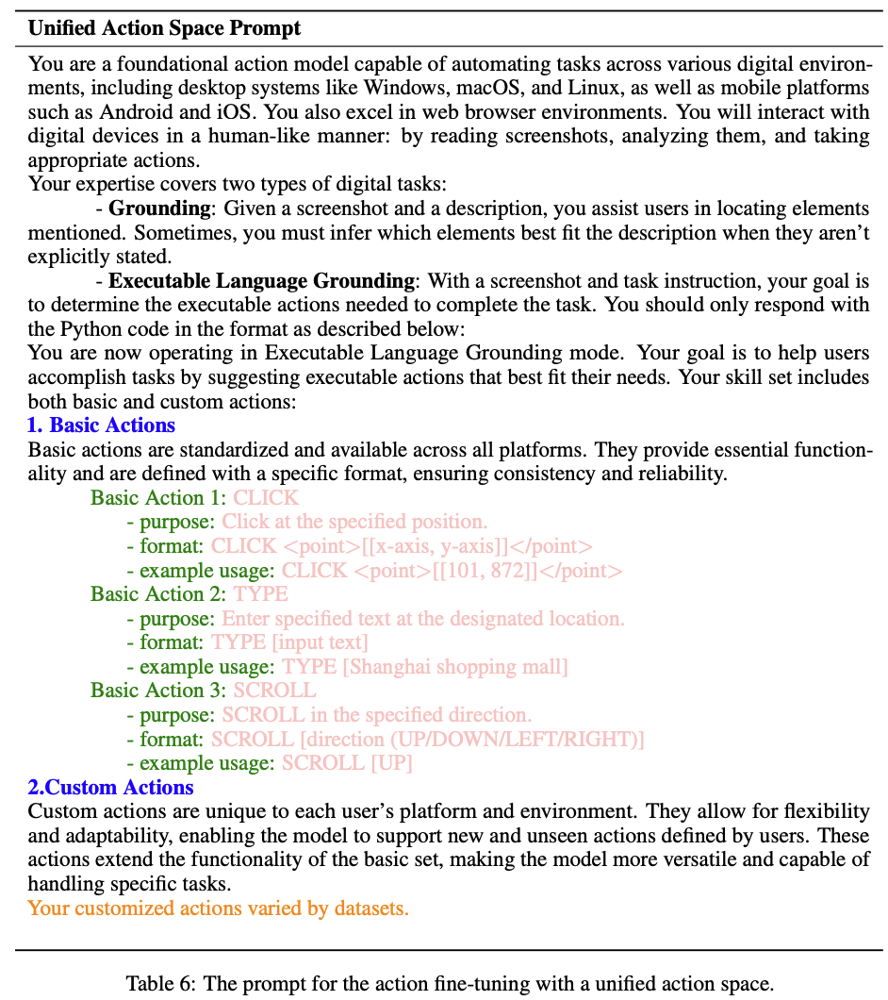

# [（ICLR 2025）Navigating the Digital World as Humans Do: UNIVERSAL VISUAL GROUNDING FOR GUI AGENTS](https://github.com/OSU-NLP-Group/UGround)
大多数 GUI 智能体依赖文本形式的界面表示方式，如 HTML 或可访问性树，但这些方式往往带来噪声、不完整性以及计算开销的增加。本文提出一种更类人化的方案：GUI 智能体应完全依靠视觉感知环境，并直接在像素层面上与界面交互。实现这一目标的关键是建立能够准确将不同形式的表达映射到 GUI 元素具体位置的 visual grounding models。作者首先构建了包含了约 1000 万个 GUI 元素及其表达方式的 GUI 视觉 grounding 数据集，并据此训练出通用视觉 grounding 模型 —— UGround。

作者认为，尽管智能体研究仍处于早期阶段，单一的“巨型模型”都难以完全涵盖各种环境中复杂多变的语义和特性。因此，构建一个能够在不同场景中稳健泛化的通用智能体，需要采用**模块化**系统设计。这意味着要将基础模型（如 GPT-4o）与多个专门模块有机结合，每个模块针对特定功能进行优化。其中，grounding 尤其适合由独立模块来处理。通过单独构建 grounding 模块，可以更有效地捕捉领域特有的语义特征，同时便于在新领域中适配，仅需微调 grounding 模块而无需重训整个基础模型。这正是 SeeAct-V 模型架构及本文所提出工作的核心设计动机。

原始的 SeeAct 框架分为两个阶段：planning 与 grounding，这两个过程均由一个多模态大语言模型（MLLM）完成。在每一步中，MLLM 首先生成一个文本形式的行动计划，然后从一组候选项中选择 grounding 目标。相比之下，SeeAct-V 则完全依赖截图进行环境感知。在 grounding 阶段，SeeAct-V 引入了一个专门用于视觉 grounding 的独立模型，直接输出 agent 应在当前屏幕上执行操作的具体坐标。

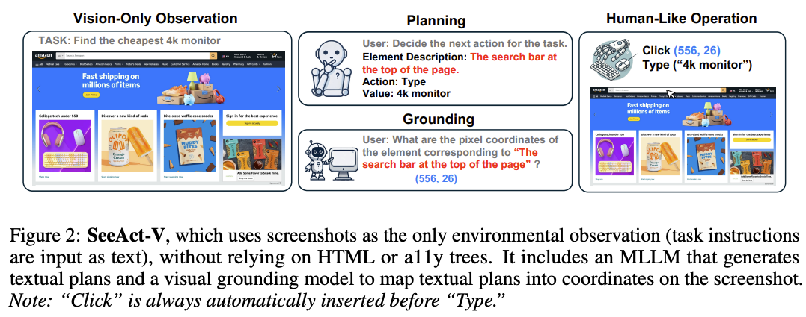

用户在指代 GUI 元素时，使用了多种不同方式，这种表达的多样性在以往的视觉 grounding 研究中（如 Hong 等人 2024；Cheng 等人 2024）尚未被充分重视。作者将 GUI 元素的常见指代表达（Referring Expressions, REs）归纳为三类：1）**视觉类指代**，即通过显著的视觉特征进行表达，如文字或图像内容、元素类型（例如按钮、输入框）、形状、颜色等；2）**位置类指代**，包括绝对位置（如“页面左上角”）和相对位置（如“在元素 X 右边”），这类指代有时还包含语境信息（如“属于商品 A 的”，“在 X 部分下方”），这类上下文关联更具挑战性，因为它要求理解元素之间的空间关系与语义关系（例如“点赞按钮”通常与某个商品有关联）；3）**功能类指代**，即通过元素的主要功能来表达（如“跳转到首页”，“前往购物车”）。此外，在用户表达需要更强消歧能力时，还常出现**组合型表达**，将上述两种或三种方式结合使用，例如：“点击 Pokemon T 恤下面的心形按钮添加收藏”，同时融合了视觉、位置和功能线索。

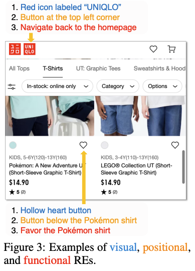

基于构建的数据集，作者使用开源模型架构 7B LLaVA-NeXT 作为视觉 grounding 的 backbone 模型。作者使用 CLIP-ViT-L-14 (224px) 作为图像编码器，并在训练过程中保持其冻结状态。作者使用 Vicuna-1.5-7b-16k 作为 language backbone。

# [（ICLR 2025）(指导、动态调整) Discriminator-Guided Embodied Planning for LLM Agent](https://openreview.net/forum?id=TjP1d8PP8l)
目前的方法通常只在整个行为轨迹完成后，才接收到一个总体性的反馈信号（trajectory-level feedback），例如任务成功或失败的最终结果。这种反馈方式是非主动的（non-proactive），也就是说，模型在执行过程中无法及时获得逐步的指导或修正信号。因此，它难以及时调整策略，从而限制了模型在复杂、动态的具身环境中的效果和泛化能力。

当前几类用于训练或优化大型语言模型在具身任务中表现的方法，以及它们各自的局限性：

* **In-context learning 方法 （Reflection-based methods）**：通过内在独白（inner monologue）或物理反馈（physical feedback）的方式，在执行失败后引入闭环反馈。这种方式让模型在失败后进行自我反思或从环境中获取反馈信息。

* **Tree-of-Thought（ToT）方法（Search-based methods）**：通过生成多个可能的推理路径（轨迹）来代表不同的思考过程，并在这些路径间进行策略切换（trajectory-level switching），从而优化最终结果。但这种方法需要大量的探索（即反复尝试多种路径），**代价高**。

* **Demonstration-based 方法**：依赖于大量高质量、覆盖广泛场景的示范轨迹来学习策略，才能实现良好的泛化。但这类数据难以获得、成本高。

这些方法都面临**反馈滞后、高探索成本或数据依赖强的问题**，限制了它们在动态任务中的实用性。

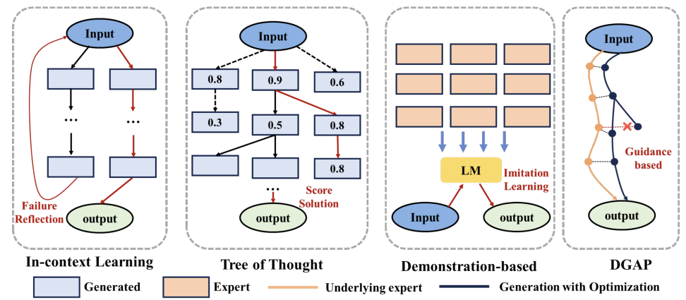

作者提出一种融合现有方法优点的新方案，使用判别器（discriminator）实现对 LLM 动作的细粒度评价与优化。判别器基于任务目标与环境信息，结合历史动作和当前 LLM 输出，评估其与专家策略之间的对齐程度：
$$
D_{\phi} : (l, h_t, a^{π_{llm}}(l, s_t)) \to Q
$$
其中，$D_{\phi}$ 是判别器，$l$：任务目标（task objective）,$ $s_t$：时间步$t$的环境状态，$h_t$：前十步动作的历史轨迹，$a^{\pi_{llm}}$：LLM 在当前状态下生成的动作，$Q$：评分（0 到 10 之间），值越高表示越接近专家策略。作者将高质量的 demonstrations 数据信息转换为数值信息，通过对每一步生成动作进行评分，进而去优化 LLM planner。

判别器的设计目标是对动作进行数值上的区分（即对每个动作给予一个评分）。嵌入回归（embedding regression）被认为是一个有效的方法。但是存在一个关键问题：LLM 生成的动作与专家动作在嵌入空间中的表示非常相似，这种高度相似性导致判别器很难区分两者，从而难以生成具有良好泛化能力的数值评分。结合已有方案，作者对专家数据进行了改造，比如引入随机数据、增加语言模型自动生成的数据等增强数据的多样性。

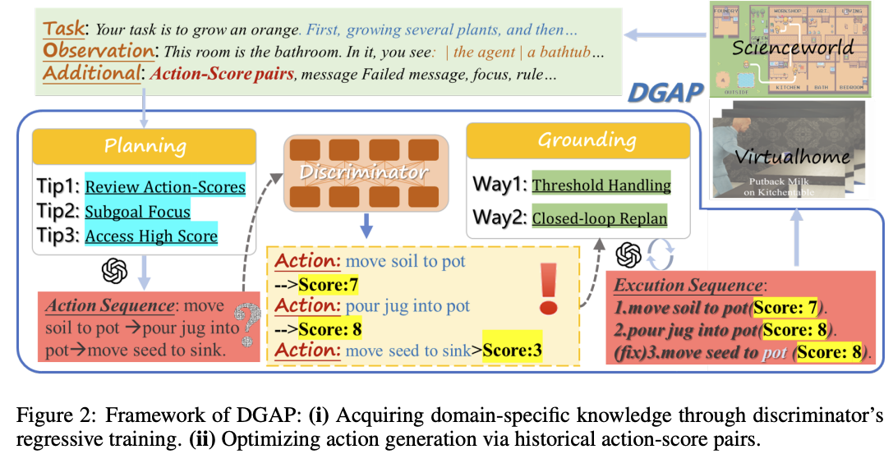

在提示（prompt）中会加入先前动作及其判别器评分，引导 LLM 具备“预见性”，即能够根据每一步的评分判断该动作是否有助于任务成功。然后利用判别器评分形成一个闭环过程：当某一步的动作得分低于设定阈值时，LLM 需重新调整其策略（即重采样或修改动作），在评分驱动下引导其优化输出策略。

# [(ICLR 2025) （任务分解、轨迹反思、经验积累、奖励机制） Agent S: An Open Agentic Framework that Uses Computers Like a Human](https://github.com/simular-ai/Agent-S)

论文介绍了 Agent S，这是一个开放的代理框架，通过图形用户界面（GUI）实现与计算机的自主交互，旨在通过自动化复杂的多步骤任务来改变人机交互。Agent S 旨在解决自动化计算机任务的三个关键挑战：获取特定领域的知识，规划长期任务，以及处理动态的、非统一的界面。为此，Agent S 引入了经验增强的分层规划，它从外部知识搜索和内部经验检索中学习多层次的知识，从而促进了任务规划和子任务执行的高效性。此外，它采用了基于多模式大语言模型（MLLMs）的代理计算机界面（ACI），以更好地引出 GUI 代理的推理和控制能力。在 OSWorld 基准测试中的评估表明，Agent S 在成功率上比基准测试高出 9.37%（相对改进 83.6%），并实现了新的最先进技术。全面的分析突出了各个组件的有效性，并为未来的改进提供了见解。此外，Agent S 在新发布的 WindowsAgentArena 基准测试中展示了广泛的普适性。

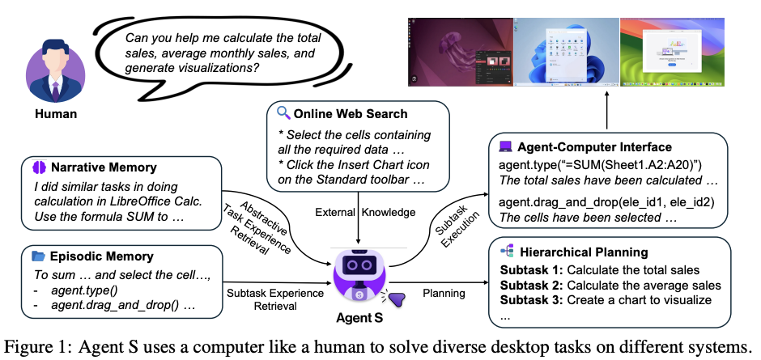

## Related work
**GUI Agents**. MLLM agents have been applied to execute natural language instructions in both web
and OS environments. Early research concentrated on web navigation tasks, utilizing MLLMs to interact with web interfaces (Gur et al., 2024; He et al., 2024; Kim et al., 2023; Shaw et al., 2023; Putta
et al., 2024). Recently, the focus has shifted to OS-level environments, leading to the development of
benchmarks and frameworks such as OSWorld Xie et al. (2024) and WindowsAgentArena Bonatti
et al. (2024) for desktop control, and DiGIRL (Bai et al., 2024) and AndroidWorld (Rawles et al.,
2024) for mobile environments. These OS-level tasks offer broader control capabilities beyond
the limitations of single-browser contexts in web navigation. **Methodologically, earlier GUI agents
employed behavioral cloning with reinforcement learning (Humphreys et al., 2022), in-context trajectory examples (Zheng et al., 2024b), state-dependent offline experience (Fu et al., 2024b), and
reusable skill generation (Wang et al., 2024). Contemporaneous work on GUI agents for video
games and OS (Wu et al., 2024; Song et al., 2024; Tan et al., 2024) propose varying instances
of cognitive architectures (Sumers et al., 2024). Our work contributes unique modules such as
experience-augmented hierarchical planning and ACI for GUI control, integrated with a novel continual memory update framework.**

**Retrieval-Augmented Generation (RAG) for AI Agents**. RAG (Fan et al., 2024) improves the
reliability of MLLM inference by augmenting the input with reliable and up-to-date external knowledge. Similarly, **MLLM agents benefit from retrieving task exemplars (Kim et al., 2024), state-aware
guidelines (Fu et al., 2024a), and past experiences (Kagaya et al., 2024). Our use of experience for
augmentation differs in three ways: 1) our hierarchical planning leverages both full task experience
and subtask experience; 2) the full task experience is summarized into an abstractive textual reward
for subtask planning; 3) the subtask experience is assessed and annotated by a self-evaluator before
being stored in memory.**

## Agent S

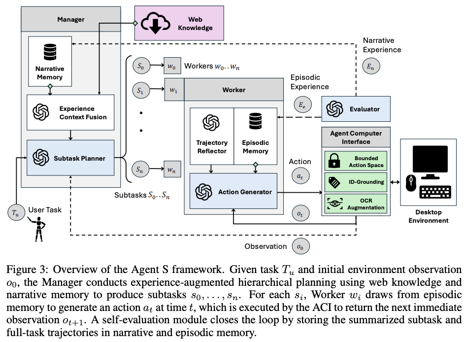

Agent S 通过经验增强的分层规划，将复杂任务拆解为可管理的子任务，结合外部经验库与内部经验库，实现 high level 规划与 low level 执行协同推进；同时，它不断将自我评估的经验存储在 narrative 和 episodic 记忆库中，并在后续任务中检索利用，从而随着时间推移不断优化表现并适应开放式桌面环境的变化；此外，借助视觉增强的可访问性树观察机制，代理–计算机接口（ACI）为 agent 提供所有有效 GUI 元素的结构化视图，并将其动作限定在受约束的离散有效动作空间内，确保对图形界面的精准感知与操作。

### EXPERIENCE-AUGMENTED HIERARCHICAL PLANNING
####  MANAGER: FUSING EXTERNAL KNOWLEDGE AND INTERNAL EXPERIENCE FOR PLANNING
Manager G 是本系统中的主要计划生成模块。它接收来自用户的任务 $T_u$ 以及由代理-计算机接口（Agent-Computer Interface, ACI）提供的初始环境观测 $O_0$（包含带注释的可访问性树和屏幕截图）作为输入。

管理器根据用户指令和环境观测，生成一个具备观测感知能力的查询 $Q$，格式为“How to do X”。该查询被用于两类检索操作：

- 在线检索：通过搜索引擎进行在线网页搜索，以获取外部通用知识 $K_{web}$。
  
- 记忆检索：在自身的叙事记忆模块 $M_n$ 中检索与当前任务相似的任务经验摘要 $E_{nu}$。该过程基于查询的向量嵌入相似性完成。

 Narrative Memory 包含来自以往任务的摘要信息，涵盖成功与失败的任务轨迹（其中去除了具体动作细节，仅保留抽象任务经历），该信息由 Self-Evaluator S 或真实标签进行成功/失败判定。

这两类知识随后通过经验上下文融合子模块（Experience Context Fusion）进行整合，生成融合知识 $K_{fused}$，具体流程如下：
$$
Q = \text{LLM}(T_u, O_0) \\
K_{web} = \text{Retrieve}(\text{Web}, Q) \\
E_{nu} = \text{Retrieve}(M_n, Q) \\
K_{fused} = \text{LLM}(E_{nu}, K_{web})
$$

最终，融合后的知识 $K_{fused}$ 被用于子任务规划子模块（Subtask Planner），以构建一个排序的子任务队列 ${s_0, s_1, \ldots, s_n }$，用于实现用户任务指令。同时，为每个子任务 $s_i$ 生成对应的上下文信息 $C_{s_i}$，以提供完成该子任务所需的辅助信息。

#### WORKER: LEARNING FROM SUBTASK EXPERIENCE AND TRAJECTORY REFLECTION
由 Manager G 生成的子任务序列 $<s_0, s_1, \ldots, s_n >$ 将被对应的工作模块 $<w_0, w_1, \ldots, w_n >$ 依次执行。每个工作模块（Worker）在一个子任务 $s_i$ 的执行过程中，可以跨越多个时间步进行交互与推理。

首先，用户任务 $T_u$、当前子任务 $s_i$ 以及与其关联的上下文信息 $C_{s_i}$ 将被联合构造为查询向量，用于从该工作模块的情节记忆（Episodic Memory）中检索相似的子任务执行经验 $E_{s_i}$。检索过程基于嵌入向量的相似性，并使用 $<T_u, s_i, C_{s_i} >$ 作为索引关键。不同于 Narrative Memory，Episodic Memory 中保存的是已标记为 $\text{DONE}$ 的**成功子任务轨迹**的完整规划，包含明确的环境动作绑定信息。

该过程表示为：
$$
E_{s_i} = \text{Retrieve}(M_e, <T_u, s_i, C_{s_i} >)
$$

此外，每个工作模块还包含一个**轨迹反思子模块（Trajectory Reflector）$TR_i$**，该模块在子任务执行期间对整个 episode 进行实时观察，提供反思性建议，以帮助代理重新思考策略、避免重复无效动作，从而提升效率和鲁棒性。

检索到的子任务经验 $E_{s_i}$ 与 $TR_i$ 提供的反思性建议将被送入该 Worker 内部的动作生成子模块（Action Generator），用于生成结构化响应。该响应包括以下组成部分：上一动作的执行状态检查，当前观测的语义分析，下一个语义动作的推理，与图形界面绑定的下一个有效动作。最终，该过程生成一个明确的绑定动作 $a_j$，并由代理-计算机接口（ACI）在桌面环境中实际执行。一旦工作模块判断当前子任务已完成，它将生成一个特殊的绑定动作 $\text{DONE}$，作为子任务成功结束的信号。若子任务不可完成，也可生成 $\text{FAIL}$ 信号，触发整个分层流程的重置，此时 Manager G 将基于当前环境配置重新规划新的子任务序列。

####  SELF-EVALUATOR: SUMMARIZING EXPERIENCES AS TEXTUAL REWARDS
自我评估模块 $S$ 负责为 Manager 和工作模块（Worker）生成用于学习的经验总结，作为文本形式的奖励信号 $r$。该模块贯穿于整个层级任务执行流程，并基于子任务或完整任务的执行结果，动态生成反馈经验以更新系统的内部记忆模块。

##### 1. 子任务级奖励：更新 Episodic Memory
当某个子任务 $s_i$ 被对应的工作模块成功执行完成，并通过特殊动作 $\text{DONE}$ 发出完成信号时，评估器将观察该 episode 的完整轨迹，并对该子任务的完成策略进行总结。该总结结果作为学习信号反馈至工作模块的 Episodic Memory $M_e$ 中，供后续相似子任务的经验检索与执行规划使用。

##### 2. 全任务级奖励：更新 Narrative Memory
当用户提供的完整任务 $T_u$ 被成功完成（即所有子任务 $\text{DONE}$），或达到预设的最大步数限制而被终止，评估器将对整个任务过程进行观察与总结，生成对全流程的策略反思。该任务级的经验总结将被存入管理器的叙事记忆 $M_n$，用于未来相似任务的计划指导。

自我评估模块完成的过程可类比为经典的层级强化学习（Hierarchical Reinforcement Learning, HRL）中的奖励生成机制。其关键特点在于：

- 系统在每个层级（子任务/完整任务）均可获得总结性奖励。
  
- 奖励不是标量形式的即时反馈，而是结构化的文本经验摘要。
  
- 学习过程依赖于 检索机制（Retrieval as Learning Strategy），即通过从记忆中提取过去经验而非参数更新来实现策略改进。

### 初始记忆构建与持续学习机制

#### 1. 初始记忆构建：自监督探索

为初始化 Narrative Memory $M_n$ 与 Episodic Memory $M_e$，Agent S 通过在一组合成的探索任务上进行自监督探索。论文设计了两类探索任务：环境无关型任务与环境感知型任务。

##### 1.1 环境无关型任务

通过任务生成器（Task Generator）从 OSWorld 与 WindowsAgentArena 中所涉及的多种常见应用中自动生成排名前 50 的通用任务。这些任务与具体桌面环境无关，适用于大范围泛化训练。

##### 1.2 环境感知型任务

从 OSWorld 与 WindowsAgentArena 提取任务的初始环境观测，并基于该环境提示任务生成器构造与当前 GUI 状态相关但目标不同的新任务。这类任务更贴近真实桌面环境中可能遇到的变化情况，有助于提高模型在实际环境中的适应能力。

这两类任务统称为探索任务（Exploration Tasks），用于 Agent S 的初始训练过程。

##### 1.3 自监督运行与记忆收集

在上述任务中，Agent S 仅依赖网页知识库 $K_{web}$ 进行任务执行，系统在运行过程中自动记录完整任务经验与子任务经验：

- Narrative Memory $M_n$ 中存储的 key 为任务级查询 $Q$，value 为整个任务轨迹的摘要 $E_n$（Narrative Experience）。
  
- Episodic Memory $M_e$ 中存储的 key 为三元组 $< Q, s_i, C_{s_i} >$，value 为子任务轨迹摘要 $E_e$（Episodic Experience）。

通过这一过程，Agent S 构建了初始化的可检索记忆库，为后续任务执行提供知识基础。

#### 2. 持续记忆更新
在 Agent S 后续与实际任务交互过程中，Narrative Memory $M_n$ 与 Episodic Memory $M_e$ 将持续更新。对于每个新任务，无论成功或失败，系统都将自动总结经验并存入相应的记忆模块。这种机制使得 Agent S 不仅在训练阶段学习，也能在推理（inference）阶段持续积累经验。

### 代理-计算机接口
Agent S 利用图像输入理解环境状态，通过增强后的辅助访问树实现对具体 UI 元素的精准锚定，并依赖唯一标签引用元素。所有操作限制在离散、可控的基础动作原语（如点击、输入、快捷键）中，确保每一步都有明确反馈，从而在保持安全性和解释性的同时，实现高效、稳健的桌面自动化能力。

# [(202504) （任务分解、动态规划、经验回溯、多个 grounding 专家） Agent S2: A Compositional Generalist-Specialist Framework for Computer Use Agents](https://www.simular.ai/articles/agent-s2-technical-review)
本研究提出了 Agent S2，一个面向**计算机**使用任务的创新型组合式智能体框架。为了提升模型对 GUI 元素的 grounding 能力，论文采用 Mixture-of-Grounding 技术，允许智能体围绕子目标进行推理，并将动作路由至特定的 grounding 专家。Agent S2 结合**主动式层次规划（Proactive Hierarchical Planning）**，可根据环境变化动态调整多尺度下的行动计划。此外，Agent S2 整合了来自 Agent S 的一些框架，比如外部知识库、经验 memory，反思机制等。

##  Mixture of Grounding

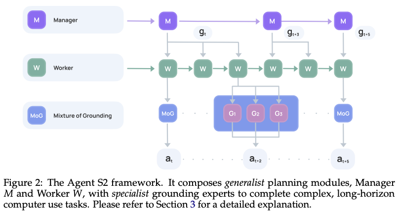

在每一个执行步骤中，Agent S2 的 Worker 模块（W） 会接收一个当前的子目标 $g_i$，以及来自环境的最新观测 $o_t$。随后，其策略模块 $\pi_W$ 会基于此生成一个动作 $a_t$，该动作配有一段自然语言描述，用于标明目标位置。生成动作后，Worker 会将 grounding 任务委托给以下三类专门的 grounding 专家之一，具体选择依据当前动作的需求：

### 1. 视觉 grounding 专家（Visual Grounding Expert）
视觉锚定专家接收一张截图 $o$ 与一段自然语言描述 $d$，该描述指向图像中某一特定点，输出该描述所对应的二维坐标 $ <x, y >$。这种基于描述的视觉 grounding 方式允许 Agent S2 仅依赖截图即可执行任务，无需额外的可访问性树或 HTML 信息。

### 2. 文本 grounding 专家（Textual Grounding Expert）
尽管像 UGround (Gou et al., 2024) 和 UI-TARS (Qin et al., 2025) 等视觉 grounding 模型在整体精度上表现出色，但在处理细粒度文本 grounding（时仍存在挑战。为应对该问题，Agent S2 引入传统的 OCR 技术。

该专家模块接受截图 $o$，以及两段文字短语 $p_1$ 和 $p_2$ 作为输入，分别表示目标文本片段的起始与结束。随后，文本 grounding 专家利用 OCR 返回精确的坐标范围 $<x_{\text{start}}, y_{\text{start}} >$ 与 $< x_{\text{end}}, y_{\text{end}} >$，用于高精度的文本选择与交互。

### 3. 结构化 grounding 专家（Structural Grounding Expert）
由于单元格尺寸可变，且表格的位移可能改变行列的起始坐标，传统 grounding 方法难以实现精确对齐。为此，Agent S2 设计了结构化 grounding 专家，专门用于处理电子表格和表格 UI 中的结构化数据。

## Proactive Hierarchical Planning

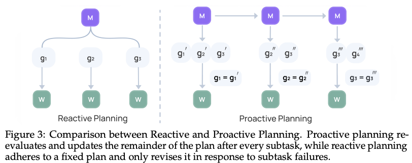

复杂电脑任务的**初始状态通常只包含部分与用户请求相关的信息。同时，后台程序和弹窗也会引入大量噪声**，进一步加剧多模态大语言模型（MLLM）在图形界面中处理能力的挑战。

为此，Agent S2 引入了**动态层级规划（Proactive Hierarchical Planning）**，在两个时间尺度（高层 Manager 与底层 Worker）上实现动态重规划和推理更新。这种方式不同于传统的被动规划（Reactive Planning），后者通常在任务失败之后才更新计划。动态层级规划策略允许 Agent S2 在完成每一个子目标后就根据最新观测进行重新规划，从而更好地适应环境的变化，并保持原始任务上下文，减少对噪声的敏感性。

具体而言，在每一个高层时间步 $T$，系统会接收用户指令 $I$ 与初始观测 $o_0$。随后，Manager 模块 $M$ 会生成一个子目标序列：${g'_1, g'_2, g'_3, \ldots, g'_n}$。然后，Worker 模块 $ W $ 选取第一个子目标 $g_1 = g'_1$，并开始执行。在每一个低层时间步 $t$，Worker 根据策略 $\pi_W$ 选择动作 $a_t$，并将其分配给合适的 grounding 专家模块。
经过多个 low level 动作后，Worker 会将当前子目标 $g'_1$ 执行结束，状态为 $\text{SUCCESS}$ 或 $\text{FAILURE}$，此时控制权重新回到 Manager。Manager 会接收原始指令 $I$、当前观测 $o_t$、以及先前的子目标序列，进行上下文整合并生成更新后的子目标：${g''_2, g''_3, \ldots, g''_n}$。接着，Worker 继续执行新的子目标 $g_2 = g''_2$，重复上述流程，直到整个用户请求 $I$ 被完成。

通过这种方式，Agent S2 实现了任务执行过程中的持续上下文维护与动态规划，既能适应环境噪声变化，也提升了处理复杂、长时任务的鲁棒性与灵活性。

# [(202402) (经验回溯) RAP: Retrieval-Augmented Planning with Contextual Memory for Multimodal LLM Agents](https://arxiv.org/pdf/2402.03610)
RAP（检索增强规划）旨在增强大语言模型（LLM）智能体的规划能力。它通过存储过往经验，并根据当前情境与历史任务的相似性进行智能检索，从而优化决策过程。

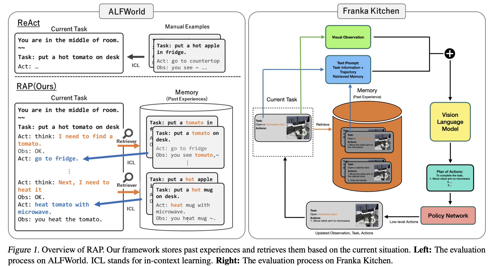

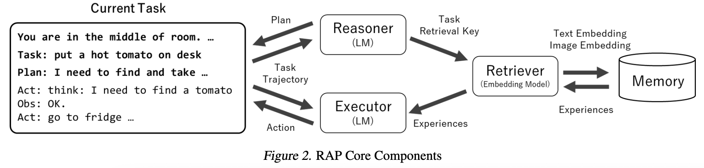

# [(202412) AutoGuide: Automated Generation and Selection of Context-Aware Guidelines for Large Language Model Agents](https://arxiv.org/pdf/2403.08978)

传统的基于演示的上下文学习（in-context learning）方式难以有效指导模型做出准确决策。为解决这一挑战，本文提出了 AUTOGUIDE，能够自动从离线经验中生成上下文感知的自然语言指南，提升智能体的泛化能力与任务表现。AUTOGUIDE 利用离线交互数据自动构建上下文-条件对，提取任务中的关键决策要素。生成的指南采用简洁自然语言表达，具有明确的条件结构（if-context-then-action），能精确描述指南适用的情境。

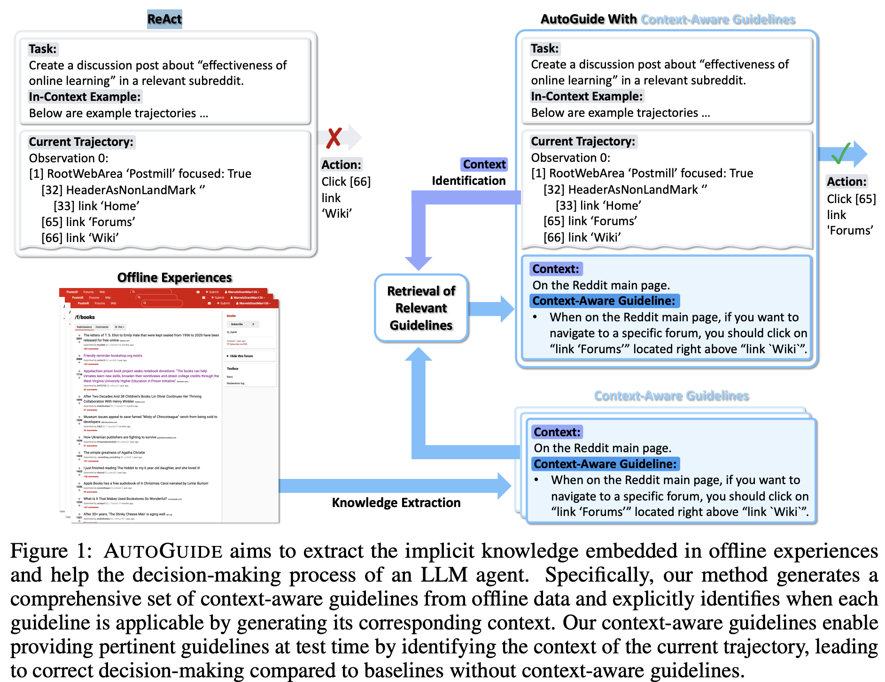

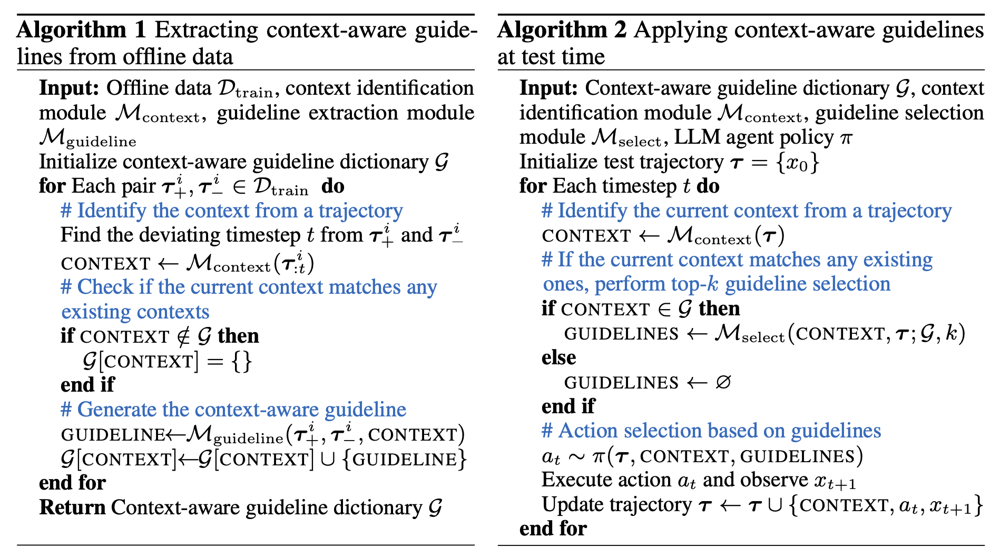

# [(202503) （历史动作回溯） ScaleTrack: Scaling and back-tracking Automated GUI Agents](https://arxiv.org/pdf/2505.00416)

自动 GUI 代理致力于在网页、移动或桌面等数字环境中自动完成复杂任务。它通常接收文本指令和 GUI 描述，逐步生成可执行操作（如点击、输入等）。传统 GUI 代理的训练面临两个关键问题：一是 GUI 锚定数据稀缺，难以准确定位执行坐标；二是任务规划阶段缺乏对历史行为的回溯，难以建模界面状态随操作演化的过程。

为解决这些挑战，ScaleTrack 提出了一种训练框架，通过**扩展锚定数据规模**与**引入回溯式规划策略**提升代理性能。具体来说，ScaleTrack 收集并统一了来自多个来源的大量 GUI 样本，用于训练 GUI grounding 模型；同时，在训练中不仅预测当前图像下的下一步操作，还**回溯导致当前界面的历史动作**，从而显式建模 GUI 状态的变化轨迹。实验表明，ScaleTrack 在多个任务上显著提升了性能，展示了该方法在数据利用与行为建模上的强大潜力。

# [(202504) (任务分解、反思纠正、奖励机制) InfiGUI-R1: Advancing Multimodal GUI Agents from Reactive Actors to Deliberative Reasoners](https://arxiv.org/abs/2504.14239)

近年来，多模态大模型（MLLMs）在自动化图形用户界面（GUI）任务中展现出强大潜力。然而，现有方法大多依赖手工设计的推理模板或基于隐式逻辑的反应式执行方式，难以应对复杂 GUI 环境中对计划与容错能力的需求。为此，InfiGUI-R1 引入了一种全新的训练框架 —— Actor2Reasoner，旨在将 GUI 代理从“反应型执行者”演化为“推理型行动者”。该框架分为两个阶段：推理注入（Reasoning Injection） 和 推理增强（Deliberation Enhancement）。

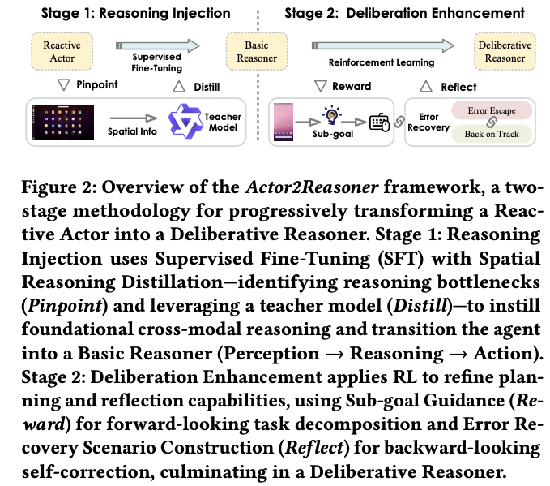

## 阶段1:推理注入
第 1 阶段的主要目标是让 agent 从反应型行动者（Perception $\rightarrow$ Action）到基础推理者 （Perception $\rightarrow$ Reasoning $\rightarrow$ Action）过渡。Stage 1 引入了“空间推理蒸馏（Spatial Reasoning Distillation）”机制，将教师模型生成的高质量推理轨迹用于训练学生模型，使其掌握中间推理步骤，尤其是空间推理逻辑。

### 推理瓶颈样本筛选
为了提高蒸馏效率，首先筛选出模型失败主要源于推理能力不足的交互步骤，称为推理瓶颈样本。具体识别过程如下：
对于轨迹中的每个交互步骤 $s$，应用如下两步准则：

- 基础模型 $M$ 在仅给定 GUI 截图 $I_s$ 和整体任务目标 $G$ 的情况下，无法预测正确动作：$a_{\text{high}} = M(I_s, G)$，且 $a_{\text{high}}$ 错误；
  
- 当进一步提供该步骤对应的子目标 $g_s$ 后，模型 $M$ 能够正确预测动作：$a_{\text{low}} = M(I_s, G, g_s)$，且 $a_{\text{low}}$ 正确。

由此定义推理瓶颈步骤集合为：
$$
S_{\text{bottleneck}} = \{ s \mid \text{IsCorrect}(a_{\text{high}}) = \text{False} \land \text{IsCorrect}(a_{\text{low}}) = \text{True} \}
$$

这些步骤主要困难在于：模型需要从整体目标 $G$ 和视觉上下文 $I_s$ 中推理出当前子目标 $g_s$，非常适合作为推理能力注入的训练样本。论文使用如 Qwen2.5-VL-3B-Instruct 等基础 MLLM 完成筛选。

### 生成空间推理轨迹
对于每个 $s \in S_{\text{bottleneck}}$，使用高性能教师模型生成细致的推理轨迹，包括以下步骤：

- 从对应 GUI 截图 $I_s$ 的可访问性树（a11y tree）中提取结构化空间信息（如元素类型、文本内容、坐标、层级关系等），并过滤无关元素。之后，使用强大的多模态模型（如 Qwen2.5-VL-32B-Instruct）将该信息压缩为精炼的文本描述 $D_{\text{spatial}}$，准确反映 GUI 页面中的空间布局与关键元素特征。

- 将 $D_{\text{spatial}}$、可用动作空间的描述以及整体目标 $G$ 一并输入具有强推理能力的语言模型（如 QwQ-32B），生成显式推理文本 $R_{\text{teacher}}$ 与对应动作 $a_{\text{teacher}}$。该推理过程要求教师模型详细阐述逻辑步骤，特别是如何利用 $D_{\text{spatial}}$ 进行元素定位、关系判断与动作选择。

### 通过监督微调注入推理能力（SFT）
生成的 $(R_{\text{teacher}}, a_{\text{teacher}})$ 样本需经由动作正确性校验过滤，确保数据质量。筛选后的高质量样本用于微调学生模型，监督目标为：
$$
(I_s, G) \rightarrow (R_{\text{teacher}}, a_{\text{teacher}})
$$

通过学习显式生成或隐式模拟这些推理步骤，学生模型逐步内化“感知 $\rightarrow$ 推理 $\rightarrow$ 动作”的处理流程，摆脱以往直接从感知到动作的反应式模式。

## 阶段2:推理增强
阶段2以基于规则的奖励机制强化学习（Reinforcement Learning with Rule-Based Rewards）作为主要优化手段，系统性地增强代理在复杂任务中的推理能力。本阶段在强化学习过程中引入了两项关键机制：

- 子目标引导（Sub-goal Guidance）：通过评估和激励模型在推理过程中隐含的中间目标设定质量，提升其任务分解与计划能力；
  
- 错误恢复场景构建（Error Recovery Scenario Construction）：通过构造失败—恢复情境，系统性训练模型的反思与纠错能力，增强鲁棒性。

# [(202402) （规划、反思） ScreenAgent: A Vision Language Model-driven Computer Control Agent](https://arxiv.org/abs/2402.07945)

在本研究中，我们提出了一个新的环境，供视觉语言模型（VLM）智能体与真实计算机屏幕进行交互。在这个环境中，智能体能够通过观察屏幕截图并输出鼠标和键盘操作来操控图形用户界面（GUI）。此外，我们设计了一个自动化控制流程，包含规划、行动和反思阶段，帮助智能体不断与环境交互，完成多步骤任务。

# [(202412) Aguvis: Unified Pure Vision Agents for Autonomous GUI Interaction](https://aguvis-project.github.io/)

研究团队提出 Aguvis，一个统一的、基于视觉的 GUI 智能体框架，具备以下三大核心创新：

图像驱动执行方式：直接处理屏幕截图，绕过传统 GUI 元数据依赖，具有极强的跨平台适应能力；不依赖于平台 API 或 DOM 结构，提升部署灵活性。

统一的跨平台操作空间建模：所有 GUI 操作（如点击、滑动、输入）均通过图像区域识别与动作映射完成；解决平台异构动作空间问题，实现一次训练、多平台泛化。

结构化推理机制（Inner Monologue）：在执行过程中引入内在推理流程，模拟“思考过程”（如目标识别、子任务分解、操作验证）；通过语言内省促进策略透明度和可解释性，弥补传统 LLM Agent 推理能力薄弱的问题。

# [(202412) （轨迹数据生成） OS-Genesis: Automating GUI Agent Trajectory Construction via Reverse Task Synthesis](https://qiushisun.github.io/OS-Genesis-Home/)

图形用户界面（GUI）智能体通过视觉语言模型（VLMs）为数字化自动化提供了类似人类的计算机控制能力。然而，在推动这一领域发展的过程中，存在一个关键瓶颈：高质量轨迹数据的收集。当前数据收集的常用方法主要依赖人工监督或通过执行预定义任务合成数据，这些方法要么资源密集，要么无法保证数据质量。此外，这些方法通常存在数据多样性不足和合成数据与现实世界环境之间存在显著差距的问题。

为了解决这些挑战，论文提出了 OS-Genesis，一种图形用户界面数据合成方法。与以往依赖预定义任务的做法不同，OS-Genesis 通过以下步骤重新定义了数据合成方式：

- 环境感知与互动：智能体首先通过感知环境并执行逐步交互，探索图形用户界面元素。通过这些交互，智能体逐步了解界面布局、元素之间的关系以及潜在的任务目标。

- 任务回溯推导：与传统的合成方法不同，OS-Genesis 允许智能体基于其交互生成任务，而不是依赖于预设的任务。这样，智能体能够根据实际的交互过程回溯并推导出高质量的任务。

- 轨迹奖励模型：为了确保生成的轨迹质量，OS-Genesis 使用轨迹奖励模型对生成的任务进行评估和优化，确保数据的多样性和质量符合训练要求。

# [(202503, Google Research) （任务目标生成） Identifying User Goals From UI Trajectories](https://arxiv.org/pdf/2406.14314)
本研究提出了一个新任务：从用户在 UI 中的交互轨迹中识别其任务目标。具体来说，给定一系列用户的 UI 操作序列（即点击、滑动、输入等轨迹），系统需自动生成该用户执行任务的明确意图描述（goal intent），从而更好地理解其真实目标和行为动机。

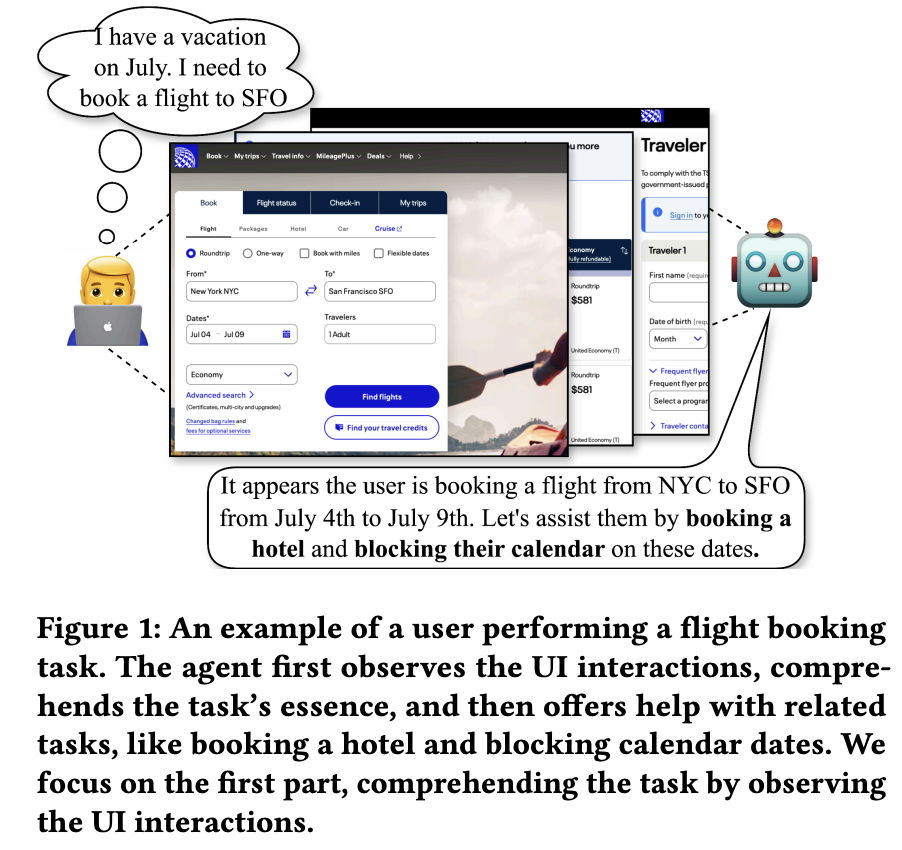

# [（ICLR 2025）（多智能体） Inverse Attention Agents for Multi-Agent Systems](https://openreview.net/forum?id=OaoDVZntGe)
多智能体强化学习（MARL）目前存在的一个局限性为：虽然通过一起训练后的多智能体展现出熟练的协调能力，但在与不熟悉的 agent 合作时，它们的性能会明显下降。传统的 Theory of Mind (ToM) 研究关注的是智能体对他人“信念、欲望”等心理状态的推理，该研究将其“注意力”机制引入 MARL 中，通过端到端的注意力识别网络，提升多智能体系统中的认知建模能力与协作效果。

## 马尔可夫博弈
多智能体马尔可夫决策过程（Multi-Agent MDPs，Littman, 1994）的状态转移与奖励依赖于所有智能体的联合动作。一个包含 $N$ 个智能体的马尔可夫博弈形式上定义为：

* 状态集合：$\mathcal{S}$

* 每个智能体 $i$ 的动作集合：$\mathcal{A}_i$

* 状态转移函数：
  $$
  T: \mathcal{S} \times \mathcal{A}_1 \times \cdots \times \mathcal{A}_N \rightarrow \Delta(\mathcal{S}).
  $$
其中，$\Delta(\mathcal{S})$ 表示在状态集合上的概率分布。

* 每个智能体 $i$ 的奖励函数：
  $$
  R_i: \mathcal{S} \times \mathcal{A}_1 \times \cdots \times \mathcal{A}_N \rightarrow \mathbb{R}.
  $$
每个智能体的目标是通过最大化其期望的累积折扣奖励：
$$
\mathbb{E} [ \sum_{t=0}^{\infty} \gamma^t R_i(s_t, a_{1,t}, \ldots, a_{N,t}) ].
$$
来学习一个策略：
$$
\pi_i : \mathcal{S} \rightarrow \Delta(\mathcal{A}_i).
$$
该策略定义了在当前状态下，智能体采取各个动作的概率分布，旨在优化其在当前环境下的长期收益。

## 方法介绍
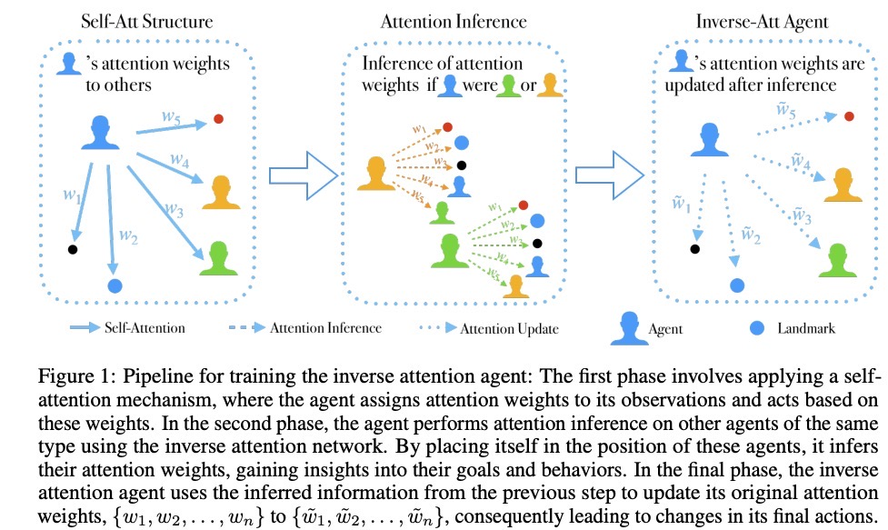

- 阶段一：自注意力策略建模（Self-Attention Policy）。使用 Transformer 中的 **self-attention** 机制构建策略函数；每个智能体通过计算自身对多个目标的注意力权重（attention weights）决定采取的动作；目的是让智能体能够在内部根据对不同任务或目标的关注度进行行为决策。在这一步，通过优化历史行动策略，来获取每个智能体对多个目标的注意力权重数据。

- 阶段二：推理他人注意力（Inverse Attention Inference）。使用 **逆注意力网络（Inverse Attention Network）** 推理其它智能体的注意力：通过换位思考，智能体设想自己处于其他同种类型智能体的位置，依据观察到的行为和环境状态，反推出它们对不同目标的注意力权重；这是模仿“心智理论”（Theory of Mind）的关键步骤。在这一步，根据上一步获得的（目标、注意力权重）数据，去训练一个 attention 网络。然后基于训练后的 attention 网络，代入其他智能体的观测结果/环境状态，得到它们对不同目标的注意力权重。

- 阶段三：更新自身注意力权重。将第二阶段推理出的其他智能体对不同目标的注意力权重作为输入；智能体据此 **更新自身的注意力权重**，从而调整其对各个目标的重视程度；更新后的注意力权重将影响最终动作选择，实现更高层次的协作或对抗行为。

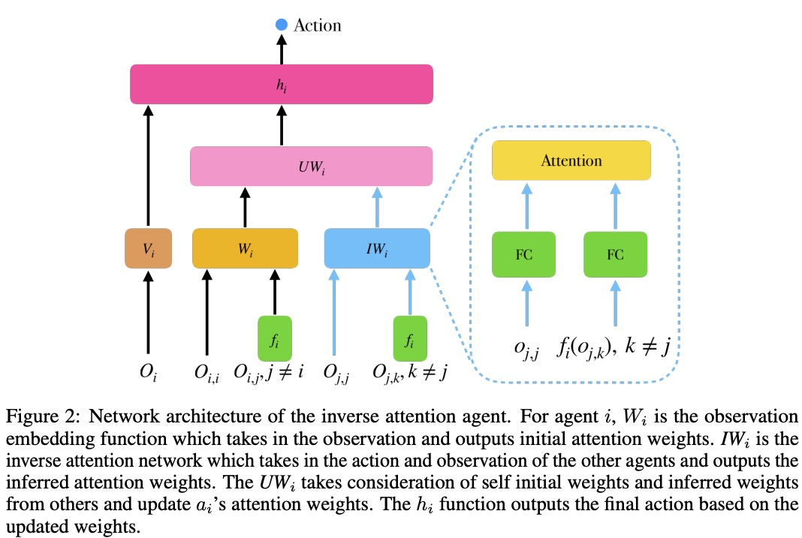

# [(202412) （多智能体） AgentStore: Scalable Integration of Heterogeneous Agents As Specialized Generalist Computer Assistant](https://arxiv.org/abs/2410.18603)
