# Generative Models

## Autoregressive Models, GAN, Flow-based Models, VAE

GAN: refer to [From GAN to WGAN](https://lilianweng.github.io/lil-log/2017/08/20/from-GAN-to-WGAN.html)

VAE: refer to [From Autoencoder to Beta-VAE](https://lilianweng.github.io/lil-log/2018/08/12/from-autoencoder-to-beta-vae.html)

Flow-based Models: refer to [Flow-based Deep Generative Models](https://lilianweng.github.io/lil-log/2018/10/13/flow-based-deep-generative-models.html)

Autoregressive Models: refer to [Autoregressive Models](https://lrjconan.github.io/UBC-EECE571F-DL-Structures/)

Reference: [CS236 - Fall 2023 Deep Generative Models](https://deepgenerativemodels.github.io/syllabus.html)

Reference: [EECE 571F (2023 Winter Term 1): Deep Learning with Structures](https://lrjconan.github.io/UBC-EECE571F-DL-Structures/)

## Energy-based Models (EBMs)

### Parameterizing probability distributions
In generating models, we want to learn a probability distribution $p_{\theta}(x)$, which closely matches the true data distribution $p_{data}(x)$. The probability should satisfy the following two conditions:

- non-negative: $p_{\theta}(x) \geq 0$.
  
- sum to one: $\int p_{\theta}(x)dx = 1$ or $\sum_{x}p(x) = 1$.

It's not hard to choose a non-negative function, for example, given any function $f_{\theta}(x)$, we can choose $g_{\theta}(x) = f_{\theta}(x)^2, g_{\theta} = \exp(f_{\theta}(x)), g_{\theta}(x) = |f_{\theta}(x)|$, etc. However, $g_{\theta}(x)$ might not sum to one. The solution is to normalize $g_{\theta}(x)$ by dividing the sum of $g_{\theta}(x)$ over all possible $x$.
$$
p_{\theta}(x) = \frac{g_{\theta}(x)}{\sum_{x}g_{\theta}(x)} = \frac{g_{\theta}(x)}{\int g_{\theta}(x) \text{d}x} = \frac{g_{\theta}(x)}{Z(\theta)},
$$
where $Z(\theta)$ is called the Partition function / Normalization constant.

Example:

- Gaussian: $g_{(\mu, \sigma)}(x) = e^{-\frac{(x-\mu)^2}{2 \sigma^2}}$, volume is $Z(\mu, \sigma) = \int e^{-\frac{(x-\mu)^2}{2 \sigma^2}} \text{d}x = \sqrt{2 \pi \sigma^2}$.
  
- Exponential: $g_{\lambda}(x) = e^{-\lambda x}$, volume is $Z(\lambda) = \int_0^{\infty} e^{-\lambda x} \text{d}x = 1/\lambda$.
  
- Exponential family: $g_{\theta}(x) = h(x) e^{\theta^T T(x)}$, volume is $Z(\theta) = \int h(x) e^{\theta^T T(x)} \text{d}x$.
  
- Beta, Poisson, Gamma, Dirichlet, etc.
  
Generally, we can choose $g_{\theta}(x)$ so that $Z(\theta)$ is analytically. But how about using the models that $Z(\theta)$ is not easy to compute analytically? 

### Energy-based Models

EBMs has the following form:
$$
p_{\theta}(x) = \frac{1}{\int \exp(f_{\theta}(x)) \text{d}x}e^{f_{\theta}(x)} = \frac{1}{Z(\theta)} e^{f_{\theta}(x)}.
$$

Why do we choose $f_{\theta}(x)$ as the form of $e^{f_{\theta}(x)}$?

- We want to capture large variations in probability. We usually to use log-probability.
- Exponential families. Many distributions can be written in this form.
- Some physical meaning. $- f_{\theta}(x)$ is called the energy.

Pros:

- We can use any function $f_{\theta}(x)$ to parameterize the probability distribution.
- Stable training.
- Relatively high sample quality.
  
Cons:

- Sampling from $p_{\theta}(x)$ is hard.
- Evaluating and optimizing likelihood is $p_{\theta}(x)$ is hard.
- Curse of dimensionality. Computing $Z(\theta)$ numerically scales exponentially with the dimensionality of $x$.

#### EBMs with Discrete Observable Variables and Discrete Latent Variables: Restricted Boltzmann machine(RBM)

Suppose we have binary visible units $x$, binary hidden units(latent variables) $h$, the energy function is:
$$
E(x, h) = - a^T x - b^T h - x^T W h
$$
where $a, b, W$ are parameters.

The probability distribution is:
$$
p(x, h) = \frac{1}{Z} e^{-E(x, h)} = \frac{1}{Z} e^{a^T x + b^T h + x^T W h}
$$
where $Z = \sum_{x, h} e^{-E(x, h)}$.

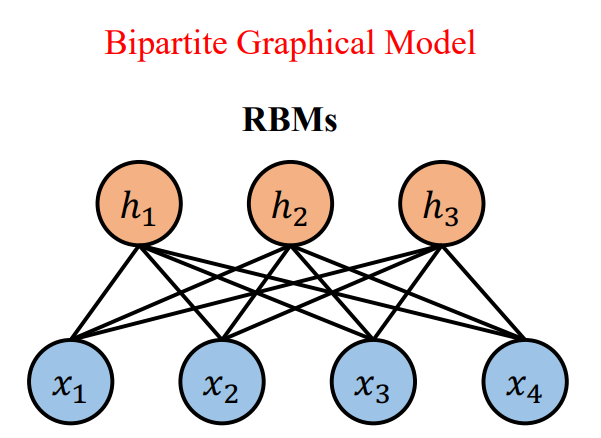
Why restricted?
- Only one layer of hidden units.
- No connections between hidden units.

Bipartite graph: conditional independence
$$
\begin{aligned}
p(x|h) &= \prod_{i=1}^D p(x_i|h) \\
p(h|x) &= \prod_{j=1}^H p(h_j|x)
\end{aligned}
$$

Formally, we have
$$
\begin{aligned}
p(x|h = \tilde{h}) \propto \exp(- E_{\theta}(x, h = \tilde{h})) \propto \exp(-\tilde{a}^Tx) = \prod_{i} \exp(-\tilde{a}_i x_i)
\end{aligned}
$$

#### Inference: Gibbs Sampling
In inference, we want to compute the maximum a posterior(MAP) $p(h|x)$ and computing the marginals $p(x)$. 

- Due to the conditional independence, we can compute $p(h|x)$ in parallel.
- But, the marginal $p(x)$ is intractable. We need to use Markov Chain Monte Carlo(MCMC) to sample from $p(x)$.
  
Gibbs sampling is a special case of MCMC. It can draw samples from $p(x_1, x_2,...,x_n)$ by iteratively sampling from the conditional distributions $p(x_i|x_1, x_2,...,x_{i-1}, x_{i+1},...,x_n)$.

In RBM, we do not iterative over individual variables. Instead, we do block-Gibbs sampling, i.e., sampling a block of variables conditioned on the other block.

>Given initial sample $(x^{(0)}, h^{(0)})$,
>
>for $t = 1, 2, ..., T$:
>
>$$
\begin{aligned}
h^{(t)} &\sim p(h|x = x^{(t-1)}), \\
x^{(t)} &\sim p(x|h = h^{(t)}),
\end{aligned}
>$$
>
>Return $(x^{(T)}, h^{(T)})$.

For both $p(h|x)$ and $p(x|h)$, we can sampling in parallel.

Remark: **the Gibbs sampler can generate random variables from a (marginal) distribution indirectly.** After sampling many iterations, $(x^{(T)}, h^{(T)})$ follows the distribution $p(x, h)$, $x^{(T)}$ follows the marginal distribution $p(x)$, and $h^{(T)}$ follows the marginal distribution $p(h)$. For more detials:

[Explaining the Gibbs sampler](https://uh.edu/~cmurray/courses/econ_7395/Explaining%20the%20Gibbs%20Sampler.pdf)

[Markov Chain Monte Carlo.Gibbs Sampler.](https://edisciplinas.usp.br/pluginfile.php/7733433/mod_resource/content/1/aula9slidesT.pdf#:~:text=%E2%80%9CThe%20Gibbs%20sampler%20is%20a,this%20scheme%20may%20seem%20mysterious.)

#### Learning: Contrastive Divergence

In RBMs, we want to learn the parameters $\theta$ by maximizing the summed log-likelihood of the training data $\log p_{\theta}(x)$. The problem is that the partition function $Z(\theta)$ is intractable. Contrastive divergence(CD) is a method to approximate the gradient of the log-likelihood.

Since
$$
\begin{aligned}
    \frac{\partial p_{\theta}(x)}{\partial \theta} &= \frac{1}{p_{\theta}(x)} \frac{\partial p_{\theta}(x)}{\partial \theta} \\
    &= \frac{1}{p_{\theta}(x)} \frac{\partial \int p_{\theta}(x, h)\text{d}h}{\partial \theta} \\
    &= \frac{1}{p_{\theta}(x)} \int \frac{\partial p_{\theta}(x, h)}{\partial \theta}\text{d}h \\
    &=  \frac{1}{p_{\theta}(x)} \int \frac{\frac{1}{Z} \exp(-E_{\theta}(x, h))}{\partial \theta} \text{d}h \\
    &= \frac{1}{p_{\theta}(x)} \int (-\frac{1}{Z^2} \exp(-E_{\theta}(x, h)) \frac{\partial Z}{\partial \theta} - \frac{1}{Z} \exp(-E_{\theta}(x, h)) \frac{\partial E_{\theta}(x, h)}{\partial \theta}) \text{d}h \\
    &= -\frac{1}{p_{\theta}(x)} \int \frac{1}{Z} \frac{\partial  Z}{\partial \theta} p_{\theta}(x, h) \text{d}h  - \frac{1}{p_{\theta}(x)}  \int  \frac{\partial E_{\theta}(x, h)}{\partial \theta} p_{\theta}(x, h) \text{d}h \\
    &= - \int \frac{1}{Z} \frac{\partial  Z}{\partial \theta} p_{\theta}(h | x) \text{d}h  - \int \frac{\partial E_{\theta}(x, h)}{\partial \theta} p_{\theta}(h | x) \text{d}h  \\
    &= - \frac{1}{Z} \frac{\partial  Z}{\partial \theta} - \int \frac{\partial E_{\theta}(x, h)}{\partial \theta} p_{\theta}(h | x) \text{d}h  \\
    &= - \frac{1}{Z} \frac{\partial  \int \int  \exp(-E_{\theta}(x, h)) \text{d}x \text{d}h}{\partial \theta} - \mathbb{E}_{p_{\theta}(h|x)}[\frac{\partial E_{\theta}(x, h)}{\partial \theta}] \\
    &=  -\int \int   (-\frac{\partial E_{\theta}(x, h)}{\partial \theta}) p_{\theta}(x,h) \text{d}x \text{d}h - \mathbb{E}_{p_{\theta}(h|x)}[\frac{\partial E_{\theta}(x, h)}{\partial \theta}] \\
    &= \mathbb{E}_{p_{\theta}(h|x)}[-\frac{\partial E_{\theta}(x, h)}{\partial \theta}] - \mathbb{E}_{p_{\theta}(x, h)}[-\frac{\partial E_{\theta}(x, h)}{\partial \theta}]  \\
\end{aligned}
$$
Here we don't know the distribution $p_{\theta}(h|x)$. Maximizing the summed log-likelihood of the training data $\log p_{\theta}(x)$ is equivalent to minimizing the KL divergence between the real data distribution $p_{data}(x)$ and the model distribution $p_{\theta}(x)$:
$$
\begin{aligned}
    \min_{\theta} \text{KL}(p_{data}(x) || p_{\theta}(x)) = \min_{\theta} \int p_{data}(x) \log p_{data}(x) \text{d}x - \int p_{data}(x) \log p_{\theta}(x) \text{d}x.
\end{aligned}
$$
Since the entropy of $p_{data}(x)$ is:
$$
\begin{aligned}
    H(p_{data}(x)) &= - \int p_{data}(x) \log p_{data}(x) \text{d}x 
\end{aligned}
$$
The cross-entropy of $p_{data}(x)$ and $p_{\theta}(x)$ is:
$$
\begin{aligned}
    H(p_{data}(x), p_{\theta}(x)) &= -\int p_{data}(x) \log p_{\theta}(x) \text{d}x \\
\end{aligned}
$$
And $H(p_{data}(x), p_{\theta}(x)) = H(p_{data}(x)) + \text{KL}(p_{data}(x) || p_{\theta}(x))$.

The entropy of $p_{data}(x)$ is a constant, so minimizing the KL divergence is equivalent to minimizing the cross-entropy of $p_{data}(x)$ and $p_{\theta}(x)$, which is equivalent to maximizing：
$$
\begin{aligned}
    \max_{\theta} \int p_{data}(x) \log p_{\theta}(x) \text{d}x.
\end{aligned}
$$

We can use stochastic gradient ascent to maximize the above equation. The gradient is:
$$
\begin{aligned}
    \frac{\partial}{\partial \theta} \int p_{data}(x) \log p_{\theta}(x) \text{d}x &= \int p_{data}(x) \frac{\partial}{\partial \theta} \log p_{\theta}(x) \text{d}x \\
    &= \mathbb{E}_{p_{\theta}(h|x)p_{data}(x)}[-\frac{\partial E_{\theta}(x, h)}{\partial \theta}] - \mathbb{E}_{p_{\theta}(x, h)}[-\frac{\partial E_{\theta}(x, h)}{\partial \theta}].
\end{aligned}
$$
We can use Monte Carlo to approximate the above equation. 

- For the first expectation $\mathbb{E}_{p_{\theta}(h|x)p_{data}(x)}[-\frac{\partial E_{\theta}(x, h)}{\partial \theta}]$, we can first sample $x$ from $p_{data}(x)$ (we don't know the distribution of real data, but we have training data.), then sample $h$ from $p_{\theta}(h|x)$. 
- For the second expectation $\mathbb{E}_{p_{\theta}(x, h)}[-\frac{\partial E_{\theta}(x, h)}{\partial \theta}]$, we can use **finite-step** Gibbs sampler.

In this way, we don't need to compute the partition function $Z(\theta)$. This method is called Contrastive Divergence(CD).

#### EBMs with Continuous Observable Variables and Discrete Latent Variables: GRBMs

Here, we consider continuous observable variables $v$ and binary units (latent variables) $h$. The energy function is:
$$
E_{\theta}(v, h) = \frac{1}{2} (\frac{v-\mu}{\sigma})^T(\frac{v-\mu}{\sigma}) - (\frac{v}{\sigma^2}) W h - b^T h.
$$
The conditional independence still holds:
$$
\begin{aligned}
p(v|h) &= \mathcal{N}(v | Wh + \mu, \text{diag}(\sigma^2)) \\
p(h_j = 1|v) &= [\text{Sigmoid}(W^T \frac{v}{\sigma^2} + b)]_j
\end{aligned}
$$

### Modern EBMs

#### EBMs with Learnable Energy Functions
For RBMs, we designed the energy function in advance, and it implied conditional independence. But, in general, it's hard to design the energy function in advance.Thus, we want to learn the energy function $E_{\theta}(x)$ from data. 

One way is to use deep neural networks to parameterize the energy function $E_{\theta}(x)$. For example, we can use U-Net architecture：

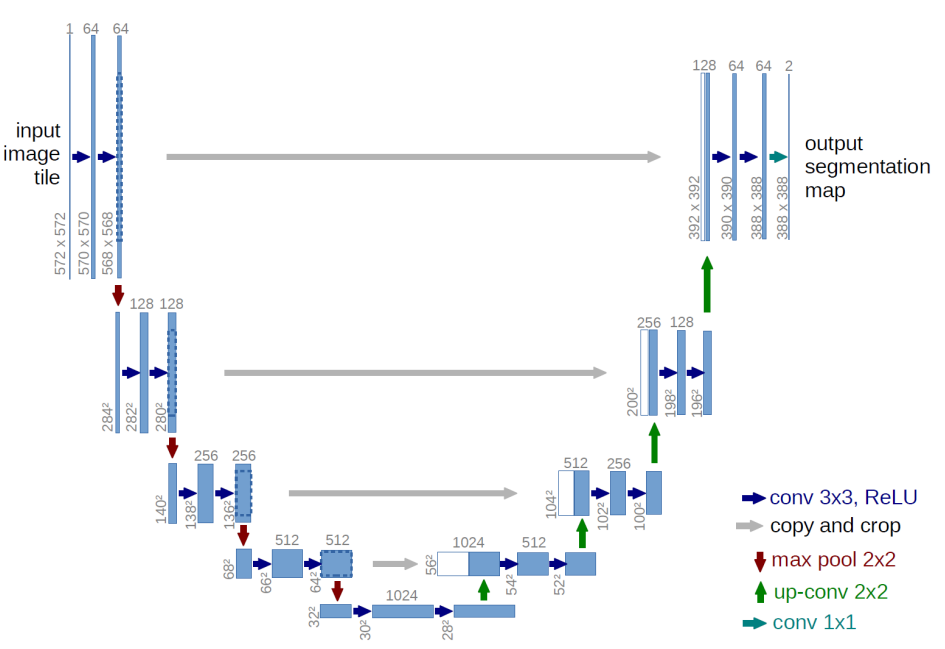

The energy obtained by the energy function is a scalar and the output of the U-Net is a tensor. Thus, we need to design some readout choices to get the scalar energy. For example, 
$$
\begin{aligned}
    E_{\theta}(x) &= x^T f_{\theta}(x), \\
    E_{\theta}(x) &= (x - f_{\theta}(x))^2, \\
    E_{\theta}(x) &= f_{\theta}(x)^2 .\\
\end{aligned}
$$
Empirically, the first choice is better.
 
#### Inference:  Langevin Monte Carlo
After learning the energy function $E_{\theta}(x)$, how to sample from
$$p_{\theta}(x) = \frac{1}{Z}\exp(-E_{\theta}(x))$$

One way is to use Langevin Monte Carlo(LMC). The stochastic differential equation(SDE) of LMC is:
$$
\begin{aligned}
    \text{d}x = \nabla \log p_{\theta} (x) \text{d}t + \sqrt{2} \text{d} B_t
\end{aligned}
$$
where $B_t$ is a standard Brownian motion. The first term $\nabla \log p_{\theta} (x) \text{d}t$ is called the drift term, which dominates the movement of the particle. The second term $\sqrt{2} \text{d} B_t$ is called the diffusion term, which includes the stochasticity of the process.

One can prove Langevin diffusion is irreducible, strong Feller, and aperiodic. Thus, **the stationary distribution of the Langevin diffusion is $p_{\theta}(x)$, and we can use Langevin diffusion to sample from $p_{\theta}(x)$.**

To turn the Langevin diffusion into a sampling algorithm, we need to discretize the SDE. The simplest way is to use Euler-Maruyama discretization:
$$
\begin{aligned}
    \text{d}x &= \nabla \log p_{\theta} (x) \text{d}t + \sqrt{2} \text{d} B_t \\
    x_{t+\eta} &= x_t + \nabla \log p_{\theta} (x_t) (t+\eta - t) + \sqrt{2} (B_{t+\eta} - B_t) \\
    &= x_t + \eta \nabla \log p_{\theta} (x_t) + \sqrt{2 \eta} \epsilon, \quad \epsilon \sim N(0, I)
\end{aligned}
$$
where $\eta$ is the step size. 

- If we ignore the noise term, we are using gradient ascent to maximize the density, this means we are trying to fing the 'mode' of $x$. The 'mode' is the mean of the distribution. In order to generate more samples, we add noise term.

Sampling algorithm:
- Given initial sample $x^{(0)}$ and step size $\eta$.
  - for $t = 1, 2, ..., T$:
    $x^{(t)} = x^{(t-1)} + \eta \nabla \log p_{\theta} (x^{(t-1)}) + \sqrt{2 \eta} \epsilon, \quad \epsilon \sim N(0, I)$
- Return $x^{(T)}$.
  
In EBMs, the score function $\nabla \log p_{\theta} (x)$ is the derivative of the energy function $\log p_{\theta} (x)$ with respect to $x$, and 
$$
\nabla_x \log p_{\theta} (x) = \nabla_x (-E_{\theta}(x) - \log Z)= -\nabla E_{\theta}(x).
$$
here, $Z$ doesn't depend on $x$.

Noticed that there is another score function $\nabla \log p_{\theta} (x)$, which is the derivative of the probability distribution $\log p_{\theta} (x)$ with respect to $\theta$. 

#### Learning: Contrastive Divergence
Similar to RBMs, we can use contrastive divergence to update $\theta$. The gradient is
$$
\int p_{data} \frac{\partial \log p_{\theta}(x)}{\partial \theta} \text{d} x = \mathbb{E}_{p_{data}(x)}[- \frac{\partial E_{\theta}(x)}{\partial \theta}] - \mathbb{E}_{p_{\theta}(x)}[-\frac{\partial E_{\theta}(x)}{\partial \theta}].
$$

For the second expectation, we can use Langevin Monte Carlo sampling to sample from $p_{\theta}(x)$, and then estimate the expectation.

#### Score Matching
In contrastive divergence, **at each training iteration**, we use Langevin Monte Carlo to sample from $p_{\theta}(x)$, and then estimate the expectation. However, the Langevin Monte Carlo sampling is not efficient, expecially in high-dimensional space. Thus, we need to train the model without sampling.

Score matching is a method to train the model without sampling. The idea is to minimize the difference between the score function $\nabla \log p_{\theta} (x)$ and the score function of the data distribution $\nabla \log p_{data} (x)$.

The (stein) score function is:
$$
s_{\theta}(x) = \nabla \log p_{\theta} (x) = -\nabla E_{\theta}(x),
$$
which is independent of the partition function $Z(\theta)$ and needs **the pdf is differentiable**.

**Fisher divergence** between two distributions $p(x)$ and $q(x)$ is:
$$
D_F(p(x), q(x)) = \frac{1}{2} \mathbb{E}_{x \sim p(x)}[||\nabla_x \log p(x) - \nabla_x \log q(x)||_2^2].
$$
Score matching is to minimize the Fisher divergence between $p_{\theta}(x)$ and $p_{data}(x)$:
$$
\begin{aligned}
    \min_{\theta} D_F(p_{\theta}(x), p_{data}(x)) &= \min_{\theta} \frac{1}{2} \mathbb{E}_{x \sim p_{data}(x)}[||\nabla_x \log p_{data}(x) - s_{\theta}(x)||_2^2] \\
    &= \min_{\theta} \frac{1}{2} \mathbb{E}_{x \sim p_{data}(x)}[||\nabla_x \log p_{data}(x) - (-\nabla_x E_{\theta}(x) )||_2^2]
\end{aligned}
$$
Since we don't know the real data distribution, we need to deal with $\nabla_x \log p_{data}(x)$. Assume that $ p_{data}(x)$ decays to 0 sufficiently rapidly as $x \rightarrow \pm \infty$, one can derive the following equation:
$$
\begin{aligned}
   &\frac{1}{2} \mathbb{E}_{x \sim p_{data}(x)}[||\nabla_x \log p_{data}(x) - \nabla_x \log p_{\theta}(x)||_2^2] \\
    =&\mathbb{E}_{x \sim p_{data}(x)}[\frac{1}{2} ||\nabla_x \log p_{\theta}(x)||^2_2 + \text{tr}(\nabla^2_x \log p_{\theta}(x))] + \text{const},
\end{aligned}
$$
where $tr(\nabla^2_x \log p_{\theta}(x))$ is the trace of the Hessian matrix of $\log p_{\theta}(x)$. Therefore, we can use monte carlo to estimate the above loss:
$$
\begin{aligned}
   &\mathbb{E}_{x \sim p_{data}(x)}[\frac{1}{2} ||\nabla_x \log p_{\theta}(x)||^2_2 + \text{tr}(\nabla^2_x \log p_{\theta}(x))], \\
   =& \frac{1}{n} \sum_{i=1}^n [\frac{1}{2} ||\nabla_x \log p_{\theta}(x_i)||^2_2 + \text{tr}(\nabla^2_x \log p_{\theta}(x_i))] \\
   =& \frac{1}{n} \sum_{i=1}^n [\frac{1}{2} ||\nabla E_{\theta}(x_i)||^2_2 + \text{tr}(\nabla^2_x \log p_{\theta}(x_i))] \\
\end{aligned}
$$
Then, we can use stochastic gradient descent to minimize the above loss.

Note: computing the trace of the Hessian matrix $\text{tr}(\nabla^2_x \log p_{\theta}(x))$ is expensive.

Conclusions:

- we have used two distances for training EBMs:
  - KL divergence, which is equal to maximum likelihood. (contrastive divergence).
  - Fisher divergence, which is equal to score matching.
- Energy-based models are very felxible probabilistic models with intracable partition functions.
- Sampling is hard and requires MCMC.
- Computing the likelihood is hard.
- Comparing the likelihood/probability of two different points is tractable.
- Contrastive divergence is a good approximation to maximum likelihood. But, it needs sampling for each iteration.
- Sampling free methods: score matching, noise contrastive estimation, adversarial optimization, etc.
  

## Score-Based Models

How to represent probability distribution function $p(x)$ in different models:

- GAN: min-max loss
- Autoregressive models: $p_{\theta}(x) = \prod_{i=1}^{d} p_{\theta}(x_i | x_{<i})$

- Flow-based models: $p_{\theta}(x) = p(z) |\det(J_{f_{\theta}}(x))|$, $z = f_{\theta}(x)$.
- VAE: use ELBO obj and latent variables
- EBMs: $p_{\theta}(x) = \frac{1}{Z}\exp(-E_{\theta}(x))$

Pros: except for GAN, these models are maximizing the likelihood.

Cons: They need special atchitectures or surrogate losses.
 
Remember that the score function is:
$$
s_{\theta}(x) = \nabla \log p_{\theta} (x).
$$
As shown in the following figure, score function is the gradient of the log probability function $\log p_{\theta}(x)$ and the direction of the score function is the vector to the mode of the distribution. This means that the score function directly models the vector field of gradients.

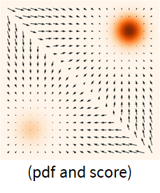

Score matching is not limited to EBMs. We can use score matching to train other models, such as autoregressive models, flow-based models, etc.

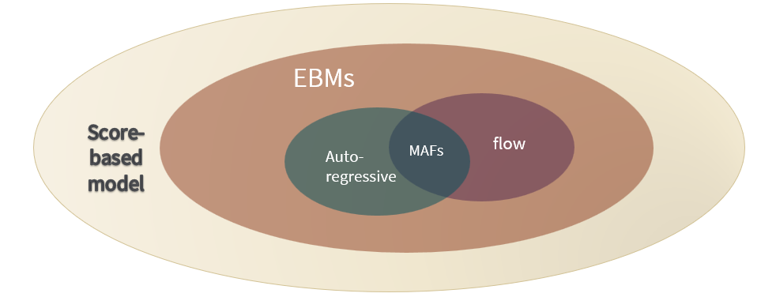

We want to train a score-based model $s_{\theta}$ to estimate the score $\nabla_{x} \log p_{data}(x)$, we use the average Euclidean distance between the score function $s_{\theta}(x)$ and the score $\nabla_{x} \log p_{data}(x)$ over the whole space as the loss function:
$$
\begin{aligned}
    \frac{1}{2} \mathbb{E}_{x \sim p_{data}(x)}[||s_{\theta}(x) - \nabla_{x} \log p_{data}(x)||_2^2],  (\text{Fisher divergence})
\end{aligned}
$$
which is equal to minimize:
$$
\begin{aligned}
    \mathbb{E}_{x \sim p_{data}(x)}[\frac{1}{2} ||s_{\theta}(x) ||^2_2 + \text{tr}(\nabla_x s_{\theta}(x))],  (\text{Score matching})
\end{aligned}
$$

We need to compute the value of the score function $s_{\theta}(x)$ and the trace of the Jacobian matrix $\text{tr}(\nabla_x s_{\theta}(x))$. Thus, the score model must be efficient to evaluate. Since the score models is not scalable, computing the trace of the Jacobian matrix $\text{tr}(\nabla_x s_{\theta}(x))$ in the backpropagation is order of $O(d)$, where $d$ is the dimension of $x$. We need to find an efficient way to train the score model.

### Denoising Score Matching
Consider the perturbed distribution:
$$
q_{\sigma}(\tilde{x}|x) = \mathcal{N}(\tilde{x}|x, \sigma^2 I), \qquad q_{\sigma}(\tilde{x}) = \int p(x)q_{\sigma}(\tilde{x}|x) \text{d}x.
$$
Instead of estimating $\nabla_x \log q_{\theta}(x)$, we can estimate $\nabla_{\tilde{x}} \log q_{\sigma}(\tilde{x})$. It's easier to estimate and when the noise level is small, $q_{\sigma}(\tilde{x}) \approx p(\tilde{x})$.

Therefore, we can use denoising score matching to match the score of a noise-perturbed distribution:
$$
\begin{aligned}
    &\frac{1}{2}E_{\tilde{x} \sim q_{\sigma}}[\|\nabla_{\tilde{x}}\log q_{\sigma}(\tilde{x}) - s_{\theta}(\tilde{x})\|_2^2] \\
    =& \frac{1}{2} E_{x \sim p_{data}(x), \tilde{x} \sim q_{\sigma}(\tilde{x}|x)}[\|s_{\theta}(\tilde{x})- \nabla_{\tilde{x}} \log q_{\sigma}(\tilde{x}|x)\|_2^2] + \text{const}.
\end{aligned}
$$
In this form, we don't need to compute the trace of the Jacobian matrix $\text{tr}(\nabla_x s_{\theta}(x))$. Since $q_{\sigma}(\tilde{x}|x) = \mathcal{N}(\tilde{x}|x, \sigma^2 I)$, $\nabla_{\tilde{x}} \log q_{\sigma}(\tilde{x}|x) = -\frac{\tilde{x} - x}{\sigma^2}$. It's more efficient to optimize for high dimensional data.

Con: notice that, we use score function to estimate the noise-perturbed distribution, which means **we cannot estimate the score of the clean data**.

#### Denoising

Denoising: after training a score model, we can use langevin MC sampling to get noise samples from $q_{\sigma}(\tilde{x})$. According to Tweedie's formula:
$$
E_{x \sim p(x|\tilde{x})}[x] = \tilde{x} + \sigma^2 \nabla_x \log q_{\sigma}(\tilde{x}) \approx \tilde{x} + \sigma^2 s_{\theta}(\tilde{x}).
$$
[remember $s_{\theta}(\tilde{x}) = \nabla_{\tilde{x}}\log q_{\sigma}(\tilde{x})$]

 Langevin MCMC: from scores to samples:

- Given initial sample $x^{(0)}$.
- for $t = 1, 2, ..., T$:
- $\qquad z^{(t)} \sim \mathcal{N}(0, I)$
- $\qquad\tilde{x}^{(t)} = \tilde{x}^{(t-1)} + \frac{\epsilon}{2} \nabla s_{\theta}(\tilde{x}) + \sqrt{\epsilon} z^t$
- Return $\tilde{x}^{(T)}$.

If noise $\epsilon \to 0$ and $T \to \infty$, $\tilde{x}^{(T)} \sim p_{data}(x)$.

#### Multi-scale Noise Perturbation

When using the denoising score matching, we only use the observed samples to estimate the scores. Thus, the estimated scores in low density regions are not accurate. Moreover, langevin MCMC converges very slowly.

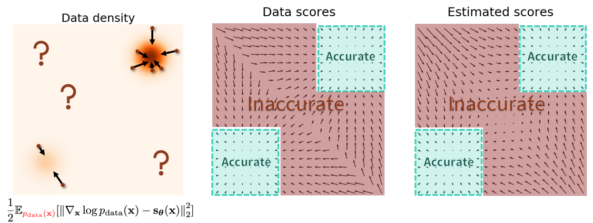

One way to improve the accuracy of the estimated scores in low density regions is to increase the noise level $\sigma$. As shown in the following figure, the estimated scores in low density regions are more accurate when the noise level $\sigma$ is large.

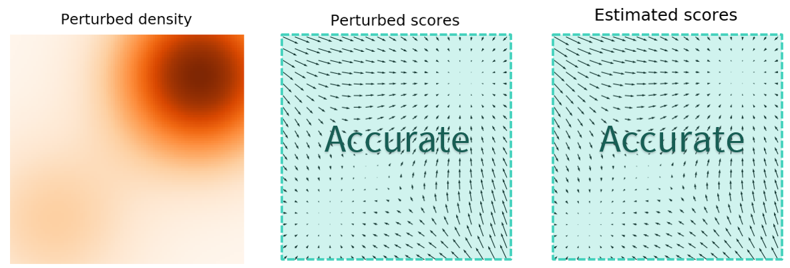

- High noise provides useful directional information for Langevin dynamics.
- But perturbed density no longer approximates the true data density.

Multi-scale noise perturbation: perturb data with different levels of noise simulteanously, and aggregate the information from all noise levels.

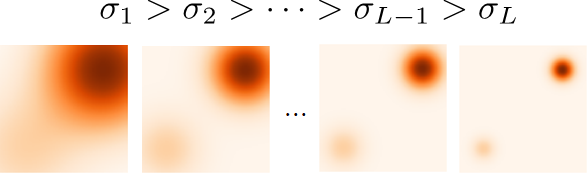

If the noise levle $\sigma$ is large, the perturbed data quality is worse, but the estimated score is more close to the perturbed scores. It's a trade-off between the data quality and estimated score accuracy.

When the noise is small, the perturbed distribution is close to the original data distribution, but the estimation errors in low density regions are still high.

When we add larger and larger noise, the estimation score is close to the perturbed data score, but the perturbed data score differs from the original data score.

In order to achieve the best data quality and estimation accuracy at the same time, we should consider all perturbations jointly instead of focusing on only one perturbation.

**Training procedure**: 
Assume we have $L$ noise levels $\sigma_1, \sigma_2, ..., \sigma_L$ and corresponding perturbed data distributions $q_{\sigma_1}(\tilde{x}), q_{\sigma_2}(\tilde{x}), ..., q_{\sigma_L}(\tilde{x})$. For each perturbed data distribution, we can easily sample from them, and use score estimation to estimate the corresponding scores. However, this method requires a large number of separate score models to be learned independently, which is very costly, exspecially when the number of noise levels $L$ is large.

One way is to train a single conditional score network for all noise levels. The score model will take $\sigma$ as an input. This model is named the **Noise Conditional Score Network**.

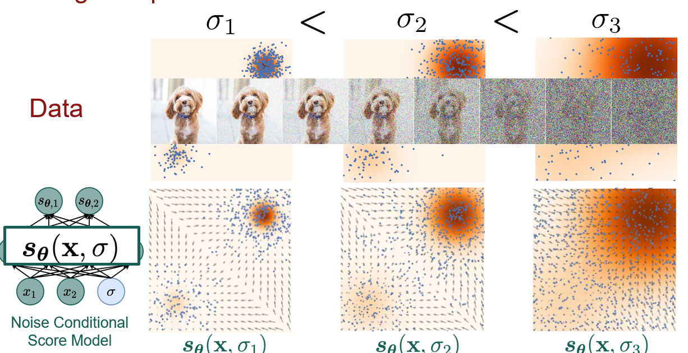

The loss function is a weighted combination of denoising score matching loss with different noise levels:
$$
\begin{aligned}
    &\frac{1}{L}\sum_{l=1}^L \lambda(\sigma_i) E_{\tilde{x} \sim q_{\sigma_i}}[\|\nabla_{\tilde{x}}\log q_{\sigma_i}(\tilde{x}) - s_{\theta}(\tilde{x}, \sigma_i)\|_2^2]  \\
    =& \frac{1}{L}\sum_{l=1}^L \lambda(\sigma_i)
    E_{x \sim p_{data}(x), z \sim N(0, I)}[\|s_{\theta}(x+\sigma_i z, \sigma_i) + \frac{z}{\sigma_i}\|_2^2] + \text{const}.
\end{aligned}
$$

[compute the loss in parallel?]

About the weighting function $\lambda(\sigma_i)$, we can set $\lambda(\sigma_i) = \sigma_i^2$.

About choosing the noise level $\sigma_i$:

- The largest noise level $\sigma_1$ approximates the maximum pairwise distance between data points.
  
- The smallest noise level $\sigma_L$ should be small enough so that the noise in final samples is negligible.

- Adjacent noise scales should have sufficient overlap to facilitate transitioning across noise scales in annealed Langevin dynamics. One way is to use geometric sequence:
  $$
  \frac{\sigma_1}{\sigma_2} = \frac{\sigma_2}{\sigma_3} = ... = \frac{\sigma_{L-1}}{\sigma_L},  \quad \sigma_1 > \sigma_2 > ... > \sigma_L.
  $$

**Sampling procedure**: we use annealed Langevin dynamics to sample from the noise conditional score network using scores of different noise levels.

We first use Langevin dynamics to sample from the most perturbed data distribution. Then, the resulting samples will be used as initial samples for sampling from the next noise level. We continue in this fashion and finally use Langevin dynamics to sample from the least perturbed data distribution.

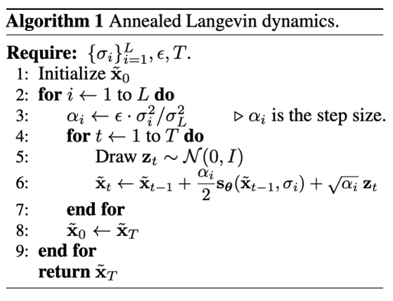

**$s_{\theta}$ is shared at each iteration, since we only have one network.**

Conclusions:

- Gradients of distributions (scores) can be estimated easily
- Flexible architecture choices — no need to be normalized/invertible
- Stable training — no minimax optimization
- Better or comparable sample quality to GANs
- Exact likelihood computation

## Introduction about diffusion model

Reference: [What are Diffusion Models?](https://lilianweng.github.io/posts/2021-07-11-diffusion-models/)

### DDPM: Denoising Diffusion Probabilistic Models

Diffusion model is a generative model:

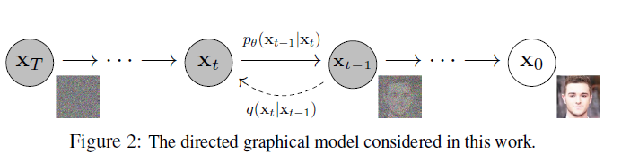

- diffusion process: add noise to a real image, finally we get a noise image.
- reverse process: from noise image to generate real image.

(1) training phase
from a real image datasets ---> through diffusion process ---> noise images ---> through reverse process ---> real images

(2) inference phase

sampling noise images from a gaussian distribution, then use the pre-trained reverse process to generate images. 

#### Diffusion process

add noise to a clean image $X_0$ and then we get noisy image $X_1, X_2, ..., X_T$.

Now, we focus on the process from image $X_{t-1}$ to $X_t$.
$$
X_t = \sqrt {1 - \beta_t}X_{t-1} + \sqrt {\beta_t} Z_{t}, \quad Z_t \sim N(0, I)
$$
>Remark: the noise scale $\beta_t$ will be increased gradually.  $ \beta_t$ increases from $10^{-4}$ to $2*10^{-2}$ linearly. $T = 2000$.

Let $1 - \beta_t = \alpha_t$, then we have 
$$
X_t = \sqrt{\alpha_t}X_{t-1} + \sqrt{1 - \alpha_t} Z_t \\
X_{t-1} = \sqrt{\alpha_{t-1}}X_{t-2} + \sqrt{1 - \alpha_{t-1}} Z_{t-1} \\
$$
Combine these two equlities, we have 
$$
\begin{aligned}
X_t &= \sqrt{\alpha_t}X_{t-1} + \sqrt{1 - \alpha_t} Z_t \\
&= \sqrt{\alpha_t}(\sqrt{\alpha_{t-1}}X_{t-2} + \sqrt{1 - \alpha_{t-1}} Z_{t-1})+ \sqrt{1 - \alpha_t} Z_t \\
&= \sqrt{\alpha_t \alpha_{t-1}}X_{t-2} + \sqrt{\alpha_t(1 - \alpha_{t-1})} Z_{t-1}+ \sqrt{1 - \alpha_t} Z_t \\
& = \sqrt{\alpha_t \alpha_{t-1}}X_{t-2} + + \sqrt{1 - \alpha_t \alpha_{t-1}} Z,   \quad Z \sim N(0, I) \\
&= ... \\
&= \sqrt{\alpha_t \alpha_{t-1}...\alpha_1}X_{0} + + \sqrt{1 - \alpha_t \alpha_{t-1}... \alpha_{1}} Z \\
&= \sqrt{\bar{\alpha}_t}X_{0} + + \sqrt{1 - \bar{\alpha}_t} Z,   \qquad \bar{\alpha}_t = \prod_{i = 1}^{t}\alpha_i.
\end{aligned}
$$

#### The relation between DDPM and SDE

DDPM: $x_i = \sqrt{1 - \beta_i} x_{i-1} + \sqrt{\beta_i}z_{i-1}$

SDE: $\text{d}x = f(x, t)\text{d}t + g(x, t)\text{d}w$,

the solution is 
$$
x_t = x_0 + \int_0^t f(x, t)dt + \int_0^t g(x, t)dw
$$
where $w$ is a Brownian motion.

How to get the mean and convariance of $x_t$ ?

We can use FPK equation. See more on [FPK equation](https://users.aalto.fi/~ssarkka/course_s2014/handout3.pdf).

The problem is the mean and covariance of $x_t$ is dependent on the expectation of $p(x(t))$, which we don't know.

#### DDPM / Variance preserving SDE

$$x_i = \sqrt{1 - \beta_i} x_{i-1} + \sqrt{\beta_i}z_{i-1}$$

Let $\beta(t=i/N) = N \beta_i, X(t = i/N) = x_i, Z(i/N) = z_i, \Delta t = 1/N$.

Then we have
$$
\begin{aligned}
    X(t + \Delta t) &= \sqrt{1 - \beta(t+\Delta t)\Delta t}X(t) + \sqrt{\beta(t+\Delta t)\Delta t}Z(t) \\
    & \approx X(t)  - \frac{1}{2} \beta(t) \Delta t X(t) + \sqrt{\beta(t)\Delta t}Z(t) \\
\end{aligned}
$$

$$
\text{d} x = - \frac{1}{2} \beta(t) x(t) dt + \sqrt{\beta(t)} \text{d} w,
$$
where $w$ is a Brownian motion.

The mean and covariance of $x_t$ is
$$
\begin{aligned}
    \mathbb{E}[x(t)] &= \mathbb{E}[x(0)]e^{-\frac{1}{2}\int_0^t \beta(s)ds} \\
    \text{cov}[x(t)] &= I -  I \times e^{-\frac{1}{2}\int_0^t \beta(s)ds} \leq I.
\end{aligned}
$$

#### SCORE-based model / Variance Exploding SDE

$$x_i = x_{i-1} + \sqrt{\sigma_{i}^2 - \sigma^2_{i-1}}z_{i-1}$$

Let $X(t = i/N) = x_i$, $\sigma(t = i/N) = \sigma_i, Z(t = 1/N) = z_i, \Delta t = 1/N$.

$$
\begin{aligned}
    X(t + \Delta t) &= X(t) + \sqrt{\sigma(t+\Delta t)^2 - \sigma(t)^2}Z(t) \\ 
    & \approx X(t) + \sqrt{\frac{\Delta \sigma(t)^2}{\Delta t} \Delta t}Z(t) \\
\end{aligned}
$$
where $w$ is a Brownian motion.
$$
d x = \sqrt{\frac{d \sigma(t)^2}{dt}} d w
$$

The mean and covariance of $x_t$ is
$$
\begin{aligned}
    \mathbb{E}[x(t)] &= \mathbb{E}[x(0)]  \\
    \text{cov}[x(t)] &= \sigma^2(t) I.
\end{aligned}
$$
Here, $\sigma^2(t)$ is non-decreasing variance. Thus, the variance will be exploded.

## Evaluating Generative Models

### Model families

- Probability density/mass functions
  
   - Autoregressive models: $p_{\theta}(x) = \prod_{i=1}^{d} p_{\theta}(x_i | x_{<i})$.
  - Normalizing flow models: $p_{\theta}(x) = p(z) |\det(J_{f_{\theta}}(x))|$, $z = f_{\theta}(x)$.
  - Latent variable models(VAEs): $p_{\theta}(x) = \int p_{\theta}(x|z)p(z) \text{d}z$.
  - Energy-based models: $p_{\theta}(x) = \frac{1}{Z}\exp(-E_{\theta}(x))$.
  
- Sample generation processes
   - GANs: $x = G_{\theta}(z)$, $z \sim p(z)$.
- Score functions
   - Score-based models: $s_{\theta}(x) = \nabla_x \log p_{\theta} (x)$.

### Distances of probability distributions

- KL divergence(maximum likelihood): $D_{KL}(p||q) = \int p(x) \log \frac{p(x)}{q(x)} \text{d}x$
  
   - Autoregressive models.
   - Normalizing flow models.
   - ElBO in VAEs.
   - Contrastive divergence in EBMs.
  
-  f-divergences, Wasserstein distances
   - GANs (f-GANs, WGANs)
  
- Fisher divergence(score matching): denoising score matching, sliced score matching
  
   - Score-based models
   - Energy-based models
  
- Noise-contrastive estimation
   - Energy-based models

### Evaluation - Density estimation

We can use likelihood as a matric for density estimation:

- Split dataset into train, validation, test sets.
- Learn model $p_{\theta}(x)$ using the train set.
- Tune hyperparameters using the validation set.
- Evaluate likelihood on the test set: $\mathbb{p_{data}}[\log p_{\theta}(x)]$.

However, the likelihood is intractable for many models. Not all models have tractable likelihoods. For example, GANs, VAEs, EBMs, etc.

For VAEs, we can compare the ELBO to log-likelihood. But, how about GANs and EBMs?

 In general, unbiased estimation of probability density functions from samples is impossible. We can use approximation methods, such as kernel density estimation.

#### Kernel density estimation:

Given an intractable density model $p_{\theta}(x)$ and limited samples $S = \{x_i\}_{i=1}^n$, we can use kernel density estimation to estimate the density function $p_{\theta}(x)$. For a new data point $x$, we can estimate the density of $x$ as:
$$
\hat{p}_{\theta}(x) = \frac{1}{n} \sum_{i \in S} K(\frac{x - x_i}{\sigma}),
$$
where $K$ is a kernel function, $\sigma$ is the bandwidth.

- Gaussian kernel: $K(x) = \frac{1}{\sqrt{2\pi}}\exp(-\frac{1}{2}x^2)$.
- A kernel is a function that satisfies the following properties:
  - $K(x) \geq 0$.
  - $\int K(x) \text{d}x = 1$.
  - $K(x) = K(-x)$.
- Bandwidth $\sigma$ controls the smoothness of the density estimate.
  - Small $\sigma$: undersmoothed
  - Large $\sigma$: oversmoothed
  - $\sigma$ is a hyperparameter. We can use cross-validation to choose $\sigma$.
- KDE is very unreliable in higher dimensions.

### Importance sampling for latent variable models

For likelihood $p(x)$, we can use likehood weighting to estimate the likelihood:
$$p(x)= \mathbb{E}_{p(z)}[p(x|z)].$$

Monte Carlo sampling is one way to estimate the expectation. However, if $p(z)$ is far from $p(z|x)$, the variance of the likehood weighting is very large. For example, the probability of $p(z)$ is very small, but the probability of $p(z|x)$ is very large at some regions. Thus, we need another distribution $q(z)$, which is close to $p(z|x)$, to estimate the expectation.

Importance sampling is another way to estimate the expectation. The idea is to sample from a proposal distribution $q(z)$, then
$$
\begin{aligned}
\mathbb{E}_{p(z)}[p(x|z)] = \int p(z) p(x|z) \text{d}z = \int q(z) \frac{p(z)}{q(z)} p(x|z) \text{d}z = \mathbb{E}_{q(z)}[\frac{p(z)}{q(z)} p(x|z)].
\end{aligned}
$$
Then, we can use Monte Carlo sampling to estimate the expectation.

Pros:

- Still unbiased.
- We can choose $q(z)$ to have lower variance. One can prove that $q(z)$ should be high where $|p(z)p(x|z)|$ is high.

Cons:

- We need to choose a good proposal distribution $q(z)$.
- It's unreliable in high dimensions.
  
When to use importance sampling?

- $p(z)$ is difficult to sample from.
- We can evaluate $p(z)$.
- $q(x)$ is easy to evaluate and sample from.
- We can choose $q(z)$ to be high where $|p(z)p(x|z)|$ is high.

Annealed importance sampling is another method to estimate the likelihood.

### Sample quality

#### Inception score (IS)

Inception score is a metric for evaluating the quality of generated images. The idea is to use a pretrained Inception network to classify the generated images.

Assumption 1: we are evaluating sample quality for generative models trained on labeled datasets.

Assumption 2: We have a good probabilistic classifier $c(y|x)$ for predicting the label $y$ of any point $x$.

(A classifier can be trained on a large dataset, such as ImageNet.)

We want a good generative model to satisfy two properties:

- Sharpness: the generated images should be sharp.
  
    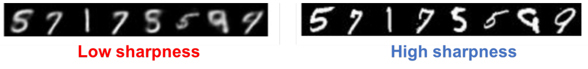

  $$S = \exp(E_{x \sim p}[\int c(y | x)\log c(y|x) \text{d}y])$$
  High sharpness implies classifier is confident in making predictions for generated images, and $c(y|x)$ has low entropy.

- Diversity: the generated images should be diverse.
  
    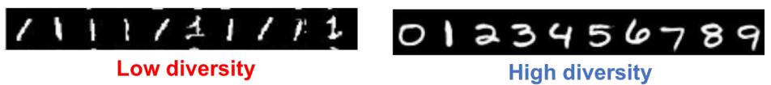

  $$D = \exp(E_{x \sim p}[\int c(y|x) \log c(y) \text{d} y]), \qquad c(y) = E_{x \sim p} [c(y|x)]$$

  High diversity implies the generated images are diverse, and $c(y)$ has high entropy.

Inception score combines these two properties:
$$
IS = D \times S.
$$

Higher IS implies better sample quality.

#### Frechet inception distance (FID)

Inception score only considers the samples from $p_{\theta}(x)$, but ignores the real data distribution $p_{data}(x)$. 

FID is a metric for evaluating the quality of generated images. The idea is to use a pretrained Inception network to extract features from the generated images and real images. Then, we can compute the Frechet distance between the two feature distributions.

- Let $\mathcal{G}$ be the generated samples and $\mathcal{T}$ be the test dataset.
- Compute feature representations $F_{\mathcal{G}}$ and $F_{\mathcal{T}}$.
- Fit a multivariate Gaussian to $F_{\mathcal{G}}$ and $F_{\mathcal{T}}$. Let $\mu_{\mathcal{G}}$ and $\mu_{\mathcal{T}}$ be the mean vectors and $\Sigma_{\mathcal{G}}$ and $\Sigma_{\mathcal{T}}$ be the covariance matrices.
- FID is defined as the Wasserstein-2 distance between the two Gaussians:
  $$
  FID(\mathcal{G}, \mathcal{T}) = ||\mu_{\mathcal{G}} - \mu_{\mathcal{T}}||_2^2 + \text{tr}(\Sigma_{\mathcal{G}} + \Sigma_{\mathcal{T}} - 2(\Sigma_{\mathcal{G}}\Sigma_{\mathcal{T}})^{1/2}).
  $$

Lower FID implies better sample quality.

#### Kernel inception distance (KID)

Maximum mean discrepancy (MMD) is a two-sample test statistic that measures the distance between two distributions by computing differences in their moments. Using the kernel trick, we can compute the MMD between two distributions:
$$
MMD(p, q) = E_{x, x' \sim p} [K(x, x')] + E_{y, y' \sim q} [K(y, y')] - 2E_{x \sim p, y \sim q} [K(x, y)].
$$

Kernel inception distance (KID) is a metric for evaluating the quality of generated images. The idea is to use a pretrained Inception network to extract features from the generated images and real images. Then, we can compute the MMD between the two feature distributions.

FID VS. KID:

- FID can only be positive, and it's biased, KID is unbiased.
- The computation time of FID is $O(n)$, but the computation time of KID is $O(n^2)$.

### Evaluation - latent representations

What is a good latent representation? For downstream tasks, we can evaluate the quality of latent representations by evaluating the performance of the downstream tasks, such as reconstruction, classification, etc.

For unsupervised learning, there is no one-size-fits-all metric for evaluating the quality of latent representations. We can use the following metrics to evaluate the quality of latent representations:

#### clustering

Representations that can be grouped into clusters are potentially useful. For example, the representations of a generated model for MNIST can be grouped into different clusters, where each cluster corresponds to one or more digits.

For labelled datasets, there are many evaluation metrics. The lables are only used for evaluation, not for clustering.

    from sklearn.metrics.cluster import completeness_score, homogeneity_score, v_measure_score

#### compression or reconstruction

Latent representations can be evaluated based on the maximum compression they can achieve without significant loss in reconstruction quality.

Some metrics: Mean Squared Error (MSE), Peak signal-to-noise ratio (PSNR), Structural similarity (SSIM), etc.

#### disentanglement

We want representations that disentangle independent and interpretable factors of variation in the observed data.

Some quantitative metrics:

- Beta-VAE metric: accuracy of a linear classifier that predicts a fixed factor of variation.
- Factor-VAE, Mutual Information Gap (MIG), SAP score, DCI disentanglement, Modularity, etc.
  

## Reference

- [SDE BOOK](https://users.aalto.fi/~asolin/sde-book/sde-book.pdf)
- [Denoising Diffusion Probabilistic Models. Jonathan et al.](https://arxiv.org/abs/2006.11239)
- [Generative Modeling by Estimating Gradients of the Data Distribution](https://yang-song.net/blog/2021/score/)
- [What are Diffusion Models?](https://lilianweng.github.io/posts/2021-07-11-diffusion-models/)

- [CS236 - Fall 2023 Deep Generative Models](https://deepgenerativemodels.github.io/syllabus.html)

- [EECE 571F (2023 Winter Term 1): Deep Learning with Structures](https://lrjconan.github.io/UBC-EECE571F-DL-Structures/)

- [How to Train Your Energy-Based Models. Yang Song and Durk Kingma.](https://arxiv.org/abs/2101.03288)

- [Importance sampling](https://glizen.com/radfordneal/ftp/ais-rev.pdf)
