# Introduction

## 1.1 Federated learning

  联邦学习的目标函数：
  $$
  \min_{\mathbf{x} \in \mathbb{R}^{d}} \frac{1}{n}\sum_{i=1}^{n}f_{i}(\mathbf{x})
  $$
其中 $n$表示参与训练的节点个数，$\mathbf{x} \in \mathbb{R}^{d}$为全模型优化变量。 $f_{i}(\mathbf{x})$为节点$i$上的损失函数。

# Contributions

- 提出了新的FL优化形式，尝试学习全局模型和局部模型的混合。
- 给出了新的优化形式的理论性质。作者证明了最优局部模型以$O(1/ \lambda)$收敛到传统的全局模型；作者证明了在局部模型上得到的损失不高于全局模型上的损失(定理3.1)；作者指出局部模型的最优解等于所有局部模型最优解的平均值减去对应局部模型上损失函数的一阶梯度，这一点和MAML一致。
- Loopless LGD：作者提出了一个随机梯度算法 — Loopless Local Gradient Descent (L2GD)（算法1）来解决提出的优化问题。该算法不是一个标准的SGD，它可以看作是一个关于损失函数和惩罚项的不均匀抽样。当抽到损失函数部分时，每个节点执行一次随机梯度下降；当抽到惩罚项时，进行信息聚合。
- 收敛理论。假设函数 $f_{i}$ 为 $L-smooth$，并且为 $\mu-strong \, convex$，可以得到抽样概率 $p^{*} = \frac{\lambda}{\lambda + L}$，固定期望局部更新次数为 $1 + \frac{L}{\lambda}$，作者证明通信 (communication) 复杂度为（通信次数上界）为 $\frac{2\lambda}{\lambda + L}\frac{L}{\mu}\log\frac{1}{\epsilon}$。当 $\lambda \to 0$时，通信次数非常小；当 $\lambda \to \infty $时，根据新优化问题得到的解收敛到全局模型最优解，并且L2GD 算法的通信上界为 $O(\frac{L}{\mu}\log\frac{1}{\epsilon})$。
- 推广。部分连接，局部SGD，variance reduction（variance来自三部分：非均匀抽样，部分连接，从节点样本随机抽样）。
- 可用于异质数据。
- 经验表现不错。
  
# 新的优化问题

$$
\min_{\mathbf{x_{1},...,x_{n}} \in \mathbb{R}^{d}} \{ F(\mathbf{x}) := f(\mathbf{x}) + \lambda \psi(\mathbf{x})\}
$$ 
$$
f(\mathbf{x}):= \frac{1}{n}\sum_{i=1}^{n}f_{i}(\mathbf{x_{i}}), \quad \psi(\mathbf{x}):= \frac{1}{2n}\sum_{i=1}^{n}\|\mathbf{x_{i}} - \mathbf{\bar{x}}\|^{2}
$$

- Local model ($\lambda = 0$)
- Mixed model ($\lambda \in (0, \infty)$)
- Global model ($\lambda = \infty$)
  
# L2GD: Loopless Local GD

在这一部分中，作者给出一个算法求解上述优化问题，该算法可以看作是一个非均匀SGD，要么抽取 $\nabla f$，要么抽取 $\nabla \psi$ 估计 $\nabla F$。令 $0 < p < 1$，定义一个随机梯度如下：
$$
G(\mathbf{x}):= \begin{cases} \frac{\nabla f(\mathbf{x})}{1-p}, & \text {概率 $1-p$} \\ \frac{\lambda \nabla \psi(\mathbf{x})}{p}, & \text{概率 $p$ } \end{cases}
$$
显然，$G(\mathbf{x})$为 $\nabla F(\mathbf{x})$的无偏估计量。
每步的更新为:
$$
\mathbf{x}^{k+1} = \mathbf{x}^{k} - \alpha G(\mathbf{x}).
$$

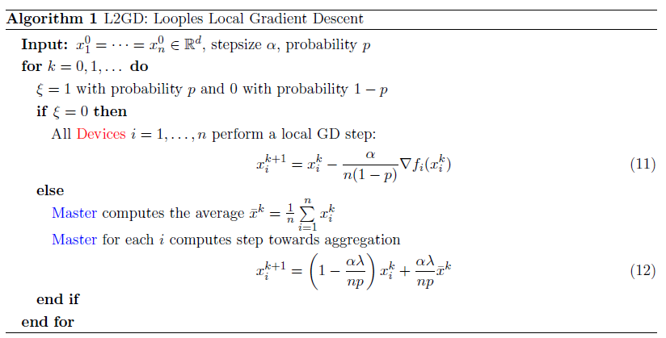

$\textbf{Lemma 4.2}$  经过 $k$ 步迭代后，期望的通信次数为 $p(1-p)k$。

## 收敛理论
作者首先证明梯度估计量$G(\mathbf{x})$的期望具有光滑性质，然后证明了算法L2GD的收敛性质。（$\mathbf{x(\lambda)}$为最优解，定理4.4 表明，L2GD算法只能收敛到最优解邻域。）
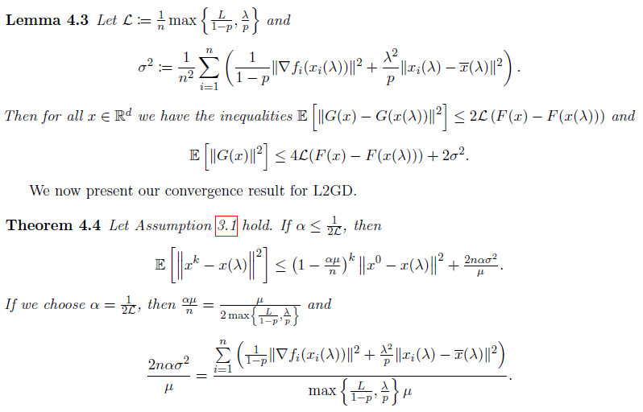

## 收敛率优化
作者给出最优抽样概率 $p^{*} = \frac{\lambda}{L + \lambda}$，步长 $\alpha$ 要满足 $\frac{\alpha\lambda}{np} \leq \frac{1}{2}$.
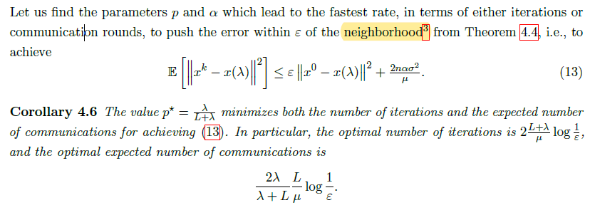

# Loopless Local SGD with Variance Reduction

L2GD算法仅线性收敛到最优解的邻域，无法收敛到最优解。假设每个子目标函数具有有限和形式，作者提出了一个算法L2SGD+，在每个节点上进行随机梯度下降，并且具有线性收敛速度。L2SGD是一个具有variance reduction 的局部SGD算法，关于SGD的variance reduction，见另一篇博客：SGD with variance reduction.

## 问题设置

假设 $f_{i}$ 具有有限和结构：
$$
f_{i} = \frac{1}{m}\sum_{j=1}^{m}f_{i,j}(\mathbf{x}_{i})
$$

那么目标函数变为：
$$
F(\mathbf{x}) = \frac{1}{n}\sum_{i=1}^{n}(\frac{1}{m}\sum_{i=1}^{m}f_{i,j}(\mathbf{x}_{i})) + \lambda\frac{1}{2n}\sum_{i=1}^{n}\|\mathbf{x}_{i} - \mathbf{\bar{x}}\|^{2}
$$

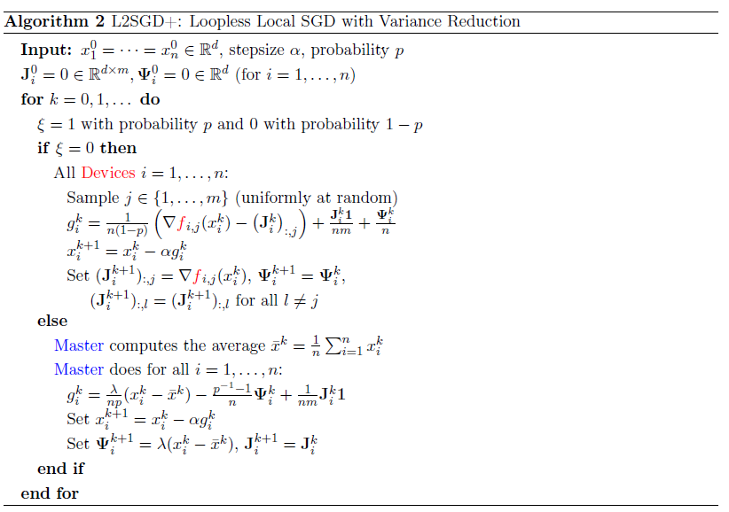

L2SGD算法仅在两次抽样不同时才会发生通信，经过 $k$ 次迭代后，需要进行 $p(1-p)k$ 次聚合平均。但是，L2SGD算法还需要通信控制变量 $\mathbf{J_{i}I,  \Psi_{i}}$，因此通信次数变为原来的3倍。在附录中，作者给出了一个高效的L2SGD+，不需要通信控制变量。

## 理论

作者给出了L2SGD算法的理论性质，并且给出最优抽样概率 $p^{*}$。

  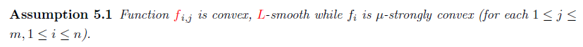
  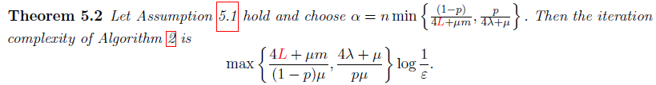
  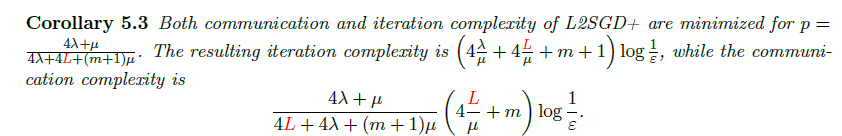

# Experiments

作者考虑Logistic回归问题，数据为LibSVM data(Chank & Lin, 2011)。数据首先进行normalized，以使得 $f_{ij}$ 为1-smooth。步长根据定理5.2确定。每个数据集被划分为不同个数的节点，具体参数设置如下：
  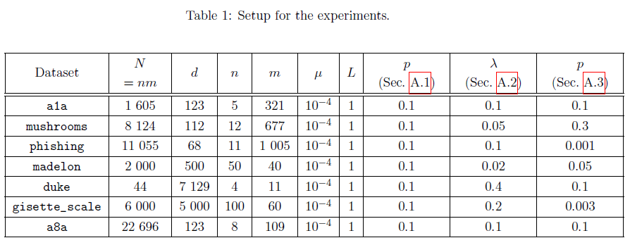

作者考虑三种算法：L2SGD+, L2SGD(L2GD with local SGD), L2SGD2(L2GD with local subsampling and control variates constructed for $\Psi$)。根据理论分析，L2SGD+线性收敛到最优解，而L2SGD和L2SGD2收敛到最优解邻域。

作者考虑了两种数据分割方式。对于homogeneous data, 首先将观测样本随机打乱，然后按照打乱后的数据划分到不同节点上；对于heterogeneous data, 首先根据观测样本的标签将样本排序，然后将排序后的数据依次划分到不同节点上 (the worst-case heterogeneity)。

  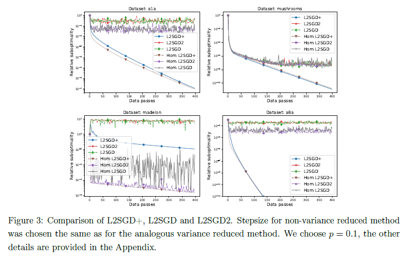

结果表明
- L2SGD+ (Full variance reduction)可以收敛到最优解，而 L2SGD(without variance reduction)和 L2SGD2(with partial variance
reduction) 只收敛到最优解邻域。
- 进行variance reduction是非常有必要的。它可以保证较快的全局收敛。
- 数据异质性对算法收敛性没有影响。

# 附录

## Experimental Setup and further experiments

- 参数 $p$ 如何影响算法L2SGD+的收敛速度
- 参数 $\lambda$ 如何影响算法L2SGD+的收敛速度

## 其余算法

- Local GD with variance reduction
  
  当每个节点采用梯度下降算法，且考虑variance reduction时，

  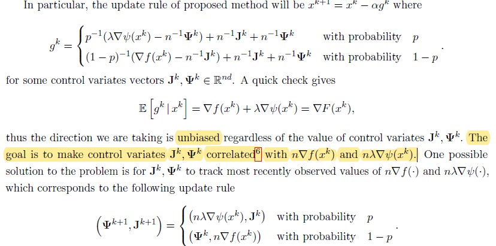
  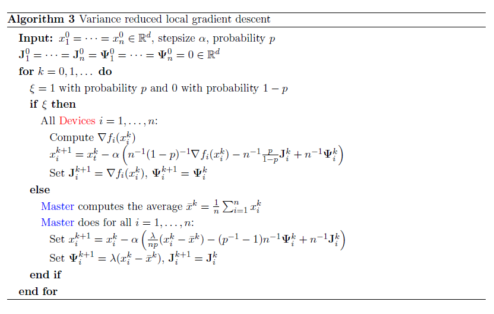

- Efficient implementation of L2SGD+
  考虑到L2SGD+需要通信控制变量，增加了通信次数。作者给出了一个高效的版本，不需要通信控制变量，$k$次迭代只需要通信 $p(1-p)k$次。

  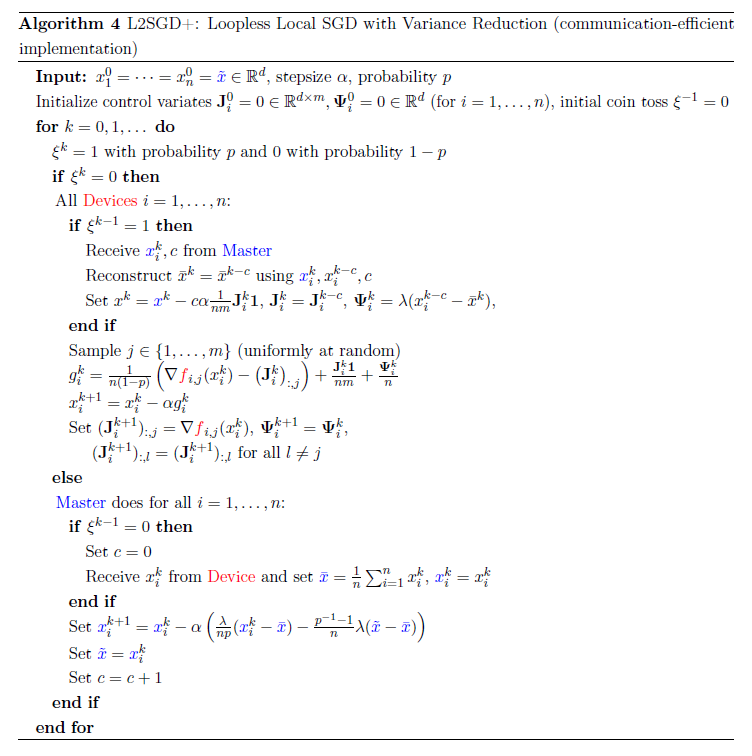

- Local SGD with variance reduction – general method
  在这部分中，作者给出了一个使用性更广的版本。每个节点上目标函数可以包含一个非光滑正则项：

   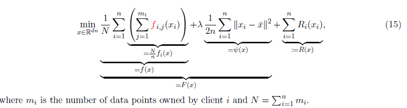

  另外，该版本算法允许从所有节点中任意抽样，允许节点结构任意（比如节点数据集大小，目标函数光滑程度，每个节点抽样方式任意）。

  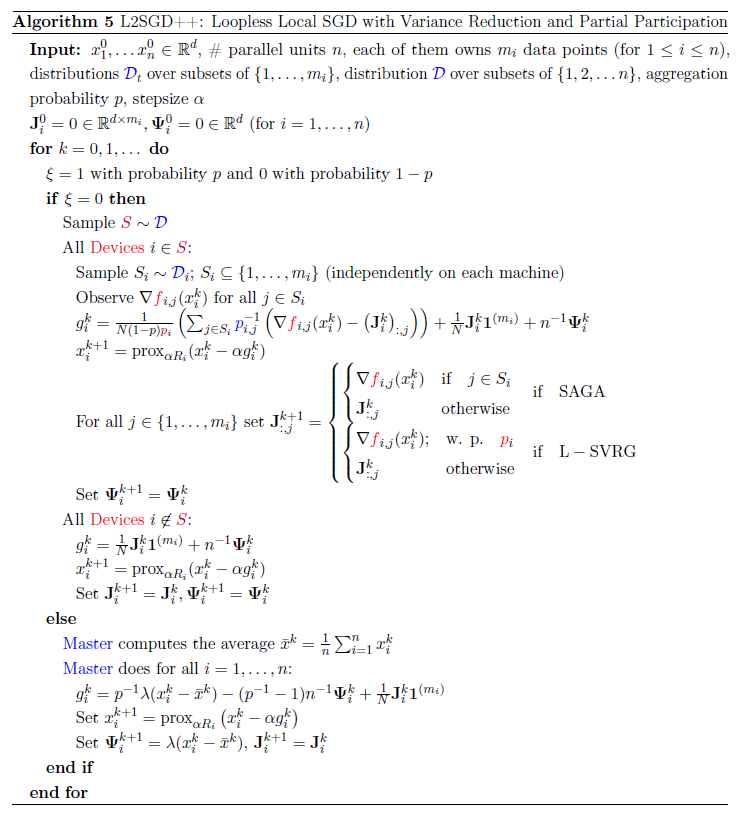

- Local stochastic algorithms

  在这部分中，作者给出两个简单算法，不考虑variance reduction的Local SGD(算法6)以及只考虑部分variance reduction的Local SGD (算法7)。

  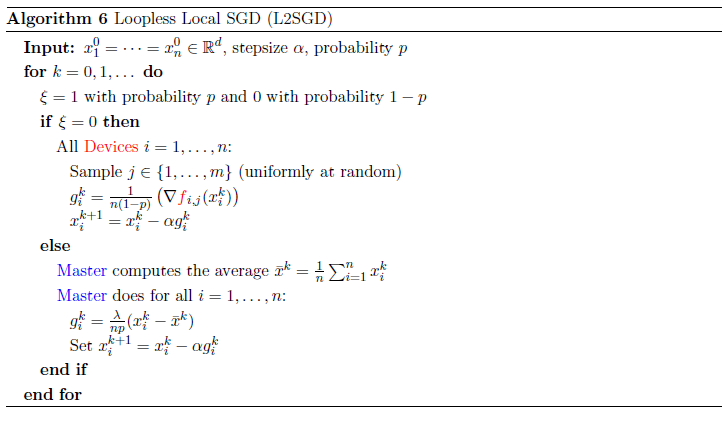

  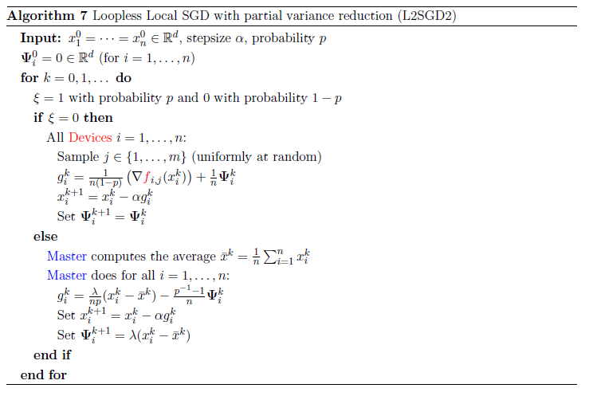

# 参考文献

- Hanzely, F. , & Richtárik, Peter. (2020). Federated learning of a mixture of global and local models.