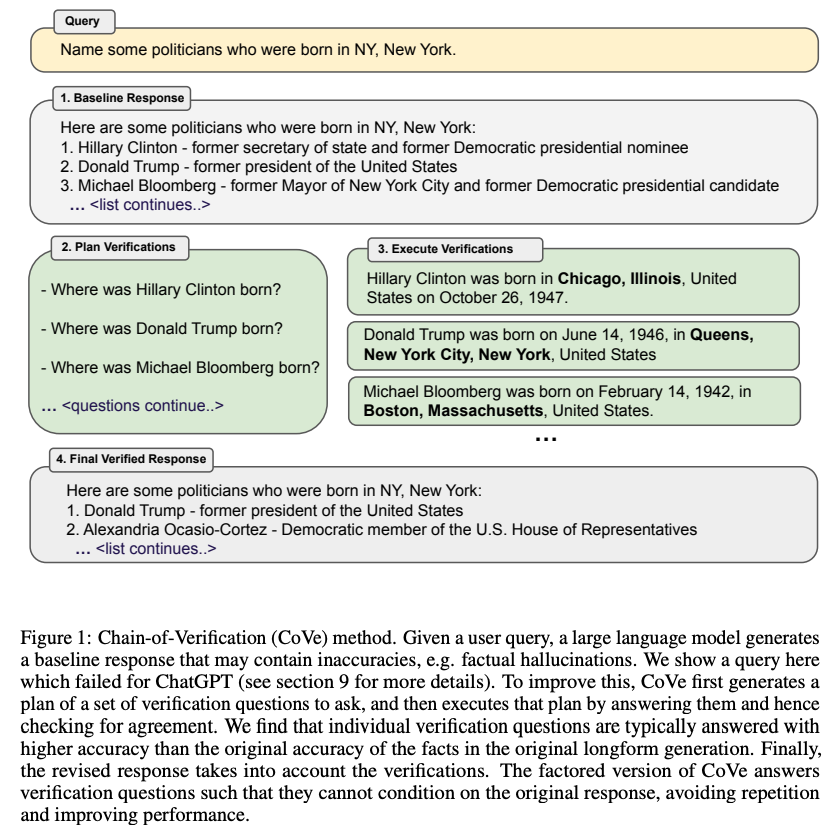
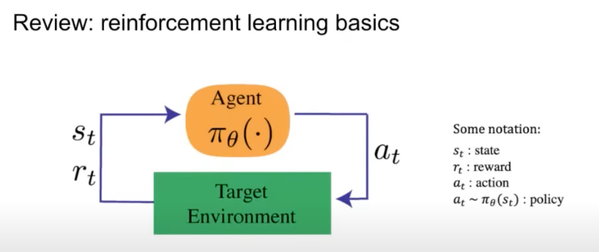
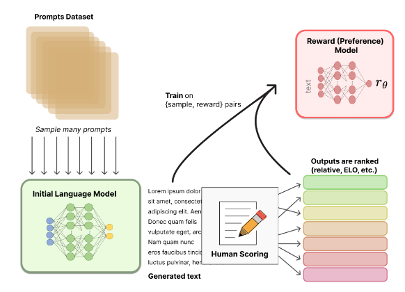
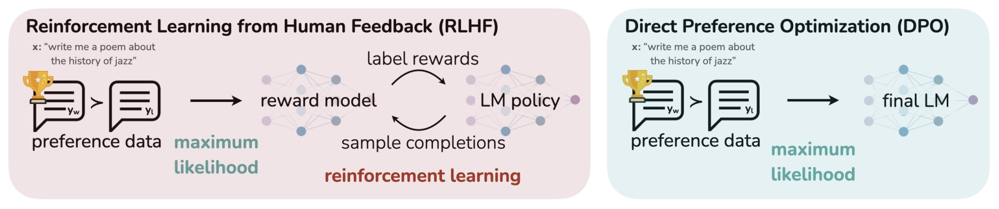
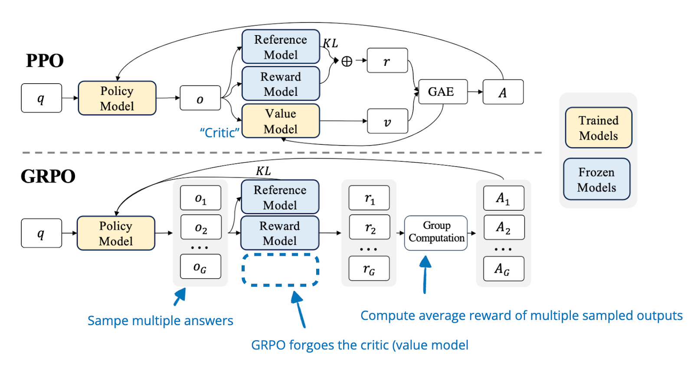
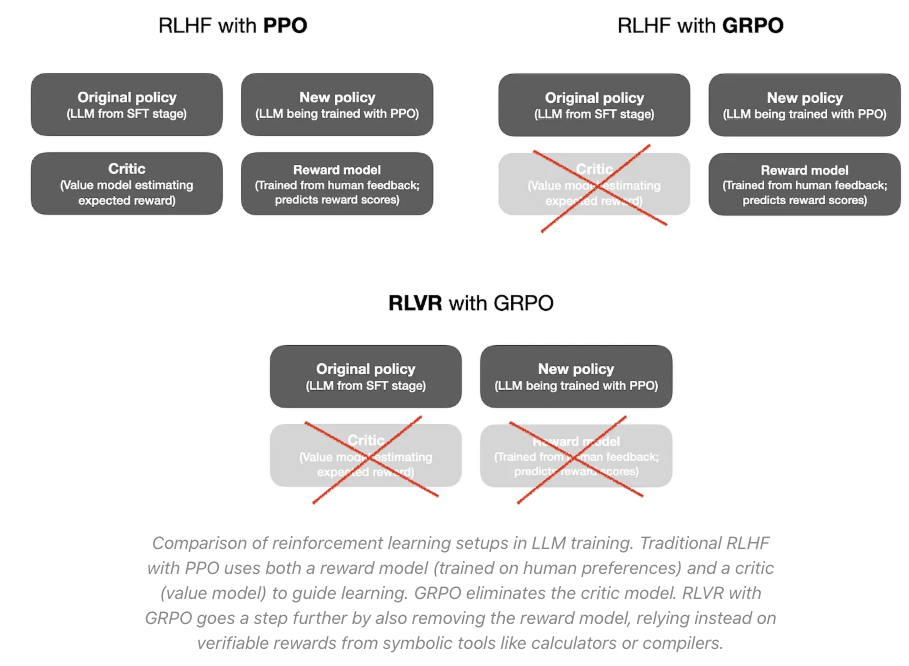
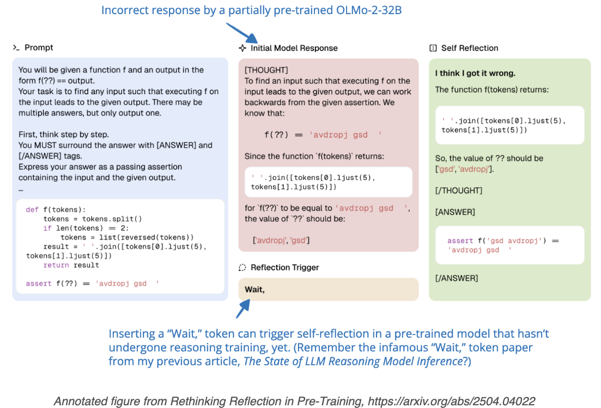
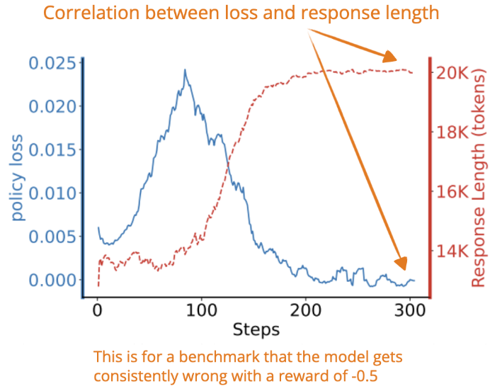

## LLM 的幻觉问题

Great thanks to this blog: [NLP • Hallucination Mitigation](https://aman.ai/primers/ai/hallucination/)

AI 文本生成中的**幻觉**现象指的是模型生成的文本虽然在语法上可能是正确的，并且看起来合理，但与输入内容并不一致，甚至可能是事实错误的。这种问题在像 GPT-3 这样的系统中尤为常见，生成的细节可能会偏离甚至与输入内容相矛盾。

### 幻觉产生的原因

造成幻觉的原因可以归结为以下几个方面：

**1. 训练数据不足**：如果模型在训练中没有接触到多样化的数据，它可能无法准确地建立输入与合适输出之间的关联，从而导致幻觉内容的产生。
   
**2. 模型过拟合**：过拟合于训练数据会导致模型生成的输出过于依赖训练集，但在面对新的或不同的输入时与实际不符。

**3. 监督不足**：如果没有充分的指导，模型可能会过度依赖其内部逻辑，导致生成的内容出现“幻觉”。

**4. 知识截止**：像 ChatGPT 这样的语言模型有知识截止日期，因此对于截止日期之后的信息一无所知。在这种情况下，它可能在不知情的情况下提供过时或不再相关的回答。

### 如何解决幻觉

#### 训练阶段
**Reinforcement Learning from Human Feedback (RLHF)**。使用 RLHF 来减少幻觉的核心思想是让人类提供有关模型响应准确性和相关性的反馈。通过将这些反馈融入训练过程，模型可以逐步学习区分准确信息和不准确信息，从而降低产生幻觉的可能性。此外，RLHF 还能帮助模型理解其输出带来的影响，进而提高生成相关且符合事实的回应能力。

#### 训练之后
在对 LLM 进行训练之后，可以使用 **Prompting** 减轻幻觉。

**1. Retrieval Augmented Generation（RAG）**。 通过在生成过程中提供额外的上下文信息，有助于消除大语言模型中的幻觉问题。幻觉现象通常发生在 LLM 基于训练数据中的模式生成响应，而不是依赖真实知识时，尤其当模型缺乏特定领域的信息或难以识别其知识边界时更容易出现。RAG 通过将外部知识源整合到生成过程中来解决这一问题。它使 LLM 能够在生成响应时访问来自外部数据库的最新或特定上下文的数据。这种方法为模型注入了更多的上下文信息，帮助其更好地理解主题，降低幻觉出现的概率。例如，在设计用于提供汽车信息的聊天机器人中，RAG 可以从外部数据库中检索产品的具体细节和上下文信息，以补充用户的输入。这样，LLM 可以接收到更全面和详细的提示，从而生成更准确和相关的响应。

**2. Contextual Prompting**。旨在通过为模型提供明确的上下文或背景信息来改善其生成的输出。这种方法通过在提示（prompt）中包含相关的上下文信息，帮助模型更好地理解任务，并生成更准确、相关性更高的回答或内容。在给大语言模型（LLM）提供问题和上下文时，附加的上下文段落通常是来自维基百科文章、书籍章节等的摘要。这些上下文片段通过在句末插入唯一标识符进行标记，例如“(source 1234)”或“(source 4567)”。例如：

- “巴黎是法国的首都。(source 1234)”
- “法国位于西欧。(source 4567)”

  这些来源标签是与原始上下文片段中的特定句子相对应的唯一编号。具体来说，Contextual Prompting 涉及将一段上下文或背景知识与问题或任务一起输入模型。这段上下文可以是来自外部知识库的文本、前面对话中的信息、或任何与当前任务相关的数据。上下文为模型提供了额外的信息，使其能够更好地理解用户的意图，并在生成内容时参考这些背景知识。在使用这些带标签的上下文提示 LLM 时，研究方法还会在问题后附加指令，例如“提供细节并在答案中包含来源。” 通过这种方式，LLM 在生成响应时被引导引用这些标记的来源。这些标签为验证 LLM 的响应是否基于提供的上下文信息提供了参考。如果响应中包含匹配的来源标签，就表明 LLM 依赖于提供的上下文，而不是凭空生成（幻觉）的内容。

**3. Chain of Verification （CoVe）**。CoVe 方法让大语言模型（LLM）在生成初始回答后，经过多个步骤来提升准确性：(1). 生成初始回答，可能包含不准确或幻觉。(2). 规划验证问题——模型生成一系列验证问题以自我查证。(3). 执行验证——模型独立回答这些验证问题 (Verification questions are often answered more accurately than facts stated in long passages)。(4). 基于验证结果修正初始回答，生成最终答案。



## LLM 对齐
Great thanks to this blog: [LLM Alignment](https://aman.ai/primers/ai/llm-alignment/)

### Overview

- 2017 年，OpenAI 在其论文 [Deep reinforcement learning from human preferences](https://arxiv.org/abs/1706.03741) 中提出了一种开创性的机器学习方法，称为 "从人类反馈出发的强化学习" (RLHF)，特别关注人类偏好。这一创新概念自此激发了该领域的进一步研究和发展。
- RLHF 概念：使用一个预先训练好的语言模型，由人类评估员对其输出进行排序。然后，这种排序会让模型对某些类型的回答产生偏好，从而产生更可靠、更安全的输出。
- RLHF 可以有效利用人类反馈来提高语言模型的性能。它将强化学习算法的优势与对人类输入的细微理解相结合，促进了模型的持续学习和改进。结合人类反馈，RLHF 不仅能提高模型的自然语言理解和生成能力，还能提高其在文本分类或翻译等特定任务中的效率。此外，RLHF 在解决语言模型中的偏差方面也发挥着至关重要的作用。通过允许人工输入来指导和纠正模型的语言使用，它可以促进更加公平和包容的交流。不过，在这一过程中，必须注意人为因素可能导致的偏差。

### Reinforcement Learning 强化学习基础概念


如图所示，agent 采取一定的 action，对于当前的 action，环境会反馈其状态 state 以及 给出 reward。其中，reward 是要优化的目标，state 是环境当前的状态，policy 用于根据 state 选择 action.

### Reinforcement Learning from Human Feedback (RLHF)
LLM 的最初目标是准确地预测下一个 token。但是，这种方式无法保证输出的结果是有用、无害且诚实的，有可能产生不符合人类道德或安全标准的内容。为解决这一问题，需要有一种方式来引导模型输出符合人类价值观的结果。


图中给出了使用 RLHF 训练 LM 的三个步骤，具体来说，

1. Collect Demonstration Data, and Train a Supervised Policy. 首先，从 prompts 中选择一个 prompt；然后人类标注者给出希望得到的输出；最后这些经过标注后的数据用于对 LM 进行 supervised fine-tune.

2. Collect Comparison Data, and Train a Reward Model. 首先，选取一个 prompt，模型给出几个可能的输出结果；标注者根据有用性、准确性等准则对结果进行从好到差的排序；这些排序后的数据用来训练一个 reward model. Reward model 用来评估模型输出结果的质量。

3. Optimize a Policy Against the Reward Model Using Reinforcement Learning. 产生新的 prompt, 基于当前的 policy, model 得到新的输出 response; Reward model 评估 response，然后得到 reward；基于得到的 reward 以及一些强化学习算法，比如 PPO，对 policy 进行更新。调整 policy 是为了增加未来产生 higher-reward outputs 的可能性。

Chip Huyen provides a zoomed out view of how the overall process works in her flowchart below:


#### REWARD MODEL
Reward model 的主要功能是评估给定的输入（如文本序列）并产生 scalar reward。这种 reward 量化了输出与人类偏好或期望行为的一致程度。



Reward 模型的结构包括
- LM 分类器：一个二元分类器微调的 LLM，可对哪种反应更符合人类偏好进行评分。
- value networks：一个回归模型，根据输入预测人类偏好评分。
- 评论生成器：经过训练的 LM，可生成评价性评论，解释哪种回答更好以及原因。该评论可用于指令调整。

#### Optimizing the Policy

**策略（policy）**：在强化学习中，策略是一组规则或决策机制，指导智能体（agent）根据它所处的环境状态或观察结果来选择行动。也就是说，策略定义了智能体如何在不同的情境下采取什么样的行为。

**PPO（Proximal Policy Optimization，邻近策略优化）**：是一种常用的强化学习算法。在 PPO 中，策略是通过反复迭代来优化的。其目标是最大化奖励，即让智能体的行为逐步改善，获得更高的回报。
但是，PPO 会确保策略的更新不会发生剧烈变化。这是通过引入一种约束，使更新后的策略保持与之前的策略相似性，以避免不稳定性或训练失败的情况。

**DPO（Direct Preference Optimization，直接偏好优化）**：是一种不同的策略优化方法。在 DPO 中，策略直接基于人类偏好进行优化。具体来说，它通过二元交叉熵损失函数（binary cross entropy loss），增加模型生成的优选输出的相对对数概率，而减少非优选输出的概率。这种方法直接根据人类的反馈进行优化，旨在使模型生成更符合人类期望的输出。
与此同时，DPO 也通过 KL 散度约束来保持平衡，防止策略发生过大的偏离。

#### Training Llama 2


以下是 Llama 2 的主要训练阶段的介绍：

1. **预训练阶段**（Pretraining）：
   - 在最初的预训练阶段，Llama 2 使用大量数据通过**自监督学习**进行训练。这一阶段让模型学习语言模式和上下文的基本结构，使其能够理解语言的基本规则和含义。
   - 自监督学习的方式通常是通过预测文本中隐藏的部分（如下一句话或遮盖的单词）来训练模型，帮助它积累广泛的语言知识。

2. **有监督微调阶段**（Supervised Fine-Tuning）：
   - 在此阶段，模型进一步通过**指令数据**进行有监督微调。具体来说，模型会根据特定的指令进行训练，学习如何对不同的提示做出合适的响应。
   - 这个过程使模型能够在实际应用中根据明确的要求或任务生成准确、相关的回答。

3. **奖励模型创建（RLHF 步骤 1）**（Reward Models Creation - RLHF Step 1）：
   - 为了进一步优化模型输出的质量，Llama 2 创建了两个**奖励模型**，一个针对**帮助性（helpfulness）**，另一个针对**安全性（safety）**。
   - 这些奖励模型通过**人类偏好数据**训练，预测在两种不同的输出中哪一个更符合人类的判断。此阶段基于二元比较，模型通过评估每对输出的优劣来学习。

4. **边际损失与排名**（Margin Loss and Ranking）：
   - Llama 2 使用二元比较数据集来优化排名。在每次比较中，标注者只需要选择两种响应中的一个，并通过**边际标签**来表示偏好的强度。这种边际标签可以用于进一步计算**排名损失**，提高模型对不同偏好的敏感性。

5. **拒绝采样与 PPO 对齐（RLHF 步骤 2）**（Rejection Sampling and PPO - RLHF Step 2）：
   - 在最后一步，Llama 2 使用**拒绝采样**和**邻近策略优化（PPO）**来进一步优化模型。
   - 拒绝采样是指从模型生成的多个输出中，选择**奖励最高**的输出用于更新梯度，从而增强模型生成高质量输出的能力。
   - 之后通过 PPO 算法对模型进行进一步对齐，使其生成的回答更加安全且有帮助，同时确保优化过程中策略更新的稳定性。

总的来说，Llama 2 的训练流程结合了大规模的自监督学习、基于指令的有监督微调，以及基于人类偏好的强化学习，通过一系列精细的步骤来提升模型的语言理解、输出的帮助性和安全性。

#### Proximal Policy Optimization (PPO)

建议先阅读以下两篇优秀博客：
- [详解策略梯度算法](https://www.cnblogs.com/xingzheai/p/15826847.html)
- [详解近端策略优化](https://www.cnblogs.com/xingzheai/p/15931681.html)

**PPO-clip**: 在 PPO（邻近策略优化）中，代理损失函数（surrogate loss） 是通过当前策略和参考策略下执行同一动作的概率比率来定义的。这一比率用于引导策略向那些能够获得更高奖励的动作倾斜，同时确保策略更新的幅度不会过大，从而保持训练的稳定性。为防止策略的更新幅度过大，PPO 引入了剪裁，限制比率在一定范围内。通过在一定阈值外“剪裁”比率的变化，模型可以避免发生过大的更新，从而保证训练过程的稳定性。

定义 $\pi_{\theta}$为当前策略（参数为 $\theta$ 的一个网络），$\pi_{ref}$ 是实际的、可参考的策略空间。$A(s_t, a_t)$为在状态 $s_t$ 下采取行为 $a_t$ 时得到的奖励。近端策略优化裁剪函数为：
$$
L(\theta) = E_{(s_t, a_t) \sim \pi_{ref}} \min{(\frac{p_{\theta}(a_t | s_t)}{p_{\pi_{ref}}(a_t|s_t)} A(s_t, a_t), clip(\frac{p_{\theta}(a_t | s_t)}{p_{\pi_{ref}}(a_t|s_t)}, 1-\epsilon, 1+\epsilon)A(s_t, a_t))},
$$
$\epsilon$ 是一个超参数，要需要我们调整的，一般设置为 0.1 或 0.2。

**PPO-penalty**: 在 PPO 中，除了使用剪裁目标函数（clipped objective）外，另一种常见的方法是直接在目标函数中加入 KL 散度惩罚项。这意味着算法会根据新策略与参考策略的偏离程度对目标函数进行惩罚。具体损失函数为：
$$
L(\theta) = E_{(s_t, a_t) \sim \pi_{ref}} \frac{p_{\theta}(a_t | s_t)}{p_{\pi_{ref}}(a_t|s_t)} A(s_t, a_t) - \beta KL(\pi_{ref}||\pi_{\theta}),
$$

通过**最大化目标函数**得到最优策略。对于大规模语言模型（LLM）来说，这个目标函数反映了模型对齐的目标，比如生成**有帮助**、**真实**、**无害**的回答。

**参考策略 (Reference Policy)**：参考策略是训练过程中用作**基准**或**对照**的一套策略。它通常是一个**稳定的策略**，模型可以从这个基准出发，或者在训练过程中参考该策略来指导学习。它确保最优策略的更新不会偏离初始策略太远，防止训练过程中产生剧烈变化或不稳定的行为。

### Reinforcement Learning with AI Feedback (RLAIF)
RLAIF 使用 AI 生成的偏好（而不是人工标注的偏好）来训练大规模语言模型（LLMs）。这种方法通过利用强大的预训练模型（如 GPT-4）生成反馈，为训练其他 LLM 提供高效、成本更低的替代方案。在 RLAIF 中，反馈生成的语言模型相当于充当了“虚拟人工标注者”的角色。它评估训练中的模型生成的多个输出，选择优选响应或提供改进建议。

#### Direct Preference Optimization (DPO)
本文前面讨论的 RLHF 主要包括两个阶段：根据人类偏好标签训练奖励模型，然后使用强化学习（RL）对 LM 进行微调，使其与这些偏好保持一致。然而，RLHF 存在复杂性和不稳定性问题，它需要拟合一个奖励模型，然后训练一个策略来优化该奖励，这就容易产生稳定性问题。

DPO 算法摆脱了传统 RL 方法中的两个阶段。通过定义新的损失函数来训练 LLM，以避免不稳定性问题。
DPO 使用一种特殊格式的数据集，形式为：<prompt, worse completion, better completion>（即“提示，较差的完成，较好的完成”）。在训练过程中，DPO 的损失函数鼓励模型增加较好完成的概率，同时降低较差完成的概率。这个过程是通过加权实现的，权重基于隐含的奖励模型。这里的关键在于，LLM 本身充当了奖励模型，因此不再需要一个显式的奖励模型。下图给出了 DPO 和 RLHF 的区别。



**Binary Cross-Entropy Loss**
DPO 通过使用二元交叉熵（Binary Cross-Entropy, BCE）损失函数来优化语言模型以更好地与人类偏好对齐的训练方法。对于每个输入，模型会生成两个响应，并由人类标注者指明他们的偏好（哪个响应更好）。DPO 通过比较模型生成的响应对（即优选响应和不优选响应）与人类偏好进行训练。

损失定义如下：
$$
L_{DPO}(\theta) = -E_{(x, y_w, y_l) \sim D} [\log \sigma (\beta \log\frac{\pi_{\theta}(y_w| x)}{\pi_{ref}(y_w|x)} - \beta \beta \log\frac{\pi_{\theta}(y_l| x)}{\pi_{ref}(y_l|x)})],
$$
其中，$\pi_{\theta}$ 为要训练的策略模型， $\pi_{ref}$ 是参考的策略模型；$y_w$ 和 $y_l$ 分别表示优选 response 和 不优选的 response. $\beta$ 控制待训练模型与参考策略模型的接近程度。$\sigma$ 为 logistic 函数。

- DPO 标志着语言模型训练方法的转变，通过将强化学习与人类反馈（RLHF）过程整合为**单个的端到端**优化步骤，简化了模型的训练。

**DPO 的训练过程**
- 选择一个已经经过基础指令调优的语言模型作为参考模型，这个模型提供了良好的基础。
- 使用不同的采样/解码方法（例如不同的温度设置）对同一提示生成成对输出，并让人类选择他们喜欢的哪一个。这一过程将产生一个人类偏好/反馈的数据集。
- 在 LLM 上添加一个线性层，使得模型能够输出一个标量值。这一层将帮助模型在训练过程中产生更具体的数值输出。
- 使用 DPO 损失，该损失函数基于二元交叉熵损失。计算参考模型和正在调优模型的标量输出的对数比率，并乘以一个散度参数，以调整模型的输出。
- 在训练完成后，去掉最后的线性层，这样就得到了一个基于人类反馈微调的 LLM。

通过以上步骤，DPO 方法通过简化 RLHF 过程，去掉了复杂的强化学习步骤和专门的奖励模型，使得模型训练更为高效和直接。这样，最终得到的模型能够更好地反映人类的偏好，提供更优质的输出

#### Kahneman-Tversky Optimization (KTO)
人类在面对不确定事件时，由于‘厌恶损失’，往往会做出无法最大化期望值的决策。直接以人的偏好指导大模型的训练，其训练的数据中包含了大量的人类偏好，往往无法做出期望最大的决策。KTO 是一种对齐手段，将重点从传统训练目标（如下一个标记预测或拟合配对偏好数据）转向直接优化被**认为有价值或可取**的输出。

KTO 消除了对配对偏好排名或比较数据的需求，显著简化了数据要求。它只需要二元标签，指示某个 LLM 输出是可取的还是不可取的。这种二元偏好数据的需求使 KTO 在现实场景中更为实用，因为收集详细的偏好数据往往比较困难。

**前景理论 (prospect theory)**

KTO 的灵感来自 Daniel Kahneman 和 Amos Tversky 提出的决策行为模型，特别是他们的前景理论 (prospect theory)。KTO 将这些概念调整为损失函数，通过捕捉人类的偏差（如损失规避和风险敏感性），使 LLM 与人类反馈保持一致。

在前景理论中，人类在不确定性下的决策行为偏离了预期效用最大化的原则，主要是因为一些心理偏差，如损失厌恶（loss aversion）和非线性概率加权（nonlinear probability weighting）。这些概念是 KTO 损失函数的基础。

**1. 价值函数 (Value Function)**：前景理论中的价值函数用于描述人们如何看待收益和损失的差异。它具有以下特征：

- **对收益的凹性**：当收益增加时，价值函数是凹的，这意味着人们在获得相同金额的收益时，所感受到的价值增加会逐渐减小。这反映了人们在面对收益时的风险厌恶（risk aversion）。
  
- **对损失的凸性**：当面临损失时，价值函数是凸的，这意味着在损失相同金额时，所感受到的损失会逐渐增大，反映了人们在面对损失时的风险寻求（risk-seeking）行为。

- **损失的影响大于收益**：损失对人们的情感影响通常大于收益，这一点通过损失厌恶参数 $\lambda$ 来建模。该参数通常大于 1，意味着人们在面对损失时的感受强于获得相同金额收益时的感受。

**2. 数学表达式**. 价值函数 $v(x)$ 可以用以下公式表示：
$$
v(x) = \begin{cases} 
x^\alpha & \text{if } x \geq 0 \\
-\lambda (-x)^\beta & \text{if } x < 0 
\end{cases}
$$
其中：

- $ \alpha \in (0,1)$ 和 $\beta \in (0,1)$ 控制对收益和损失的减敏感性（diminishing sensitivity）。这意味着随着收益或损失的增加，人们的感知效应会逐渐减弱。
- $ \lambda $ 是损失厌恶因子，通常大于 1，这表示人们对损失的反应比对收益更为强烈。

**3. 概率加权函数 (Probability Weighting Function)**: 人们在判断概率时，往往会倾向于高估小概率事件和低估大概率事件。尽管这一元素并非 KTO 的核心部分，但它强调了主观不确定性感知如何影响决策。这种加权使得人们在面对不确定性时的决策并不是完全理性的，而是受到了心理因素的影响。

Kahneman-Tversky Optimization (KTO) 的损失函数是基于前景理论构建的，其设计目标是直接最大化语言模型生成输出的效用。以下是 KTO 损失函数的关键要素及其解释：

**KTO‘s loss function**

- KTO 使用了一个 **逻辑函数 $\sigma$**，而不是经典前景理论中的分段价值函数。这种逻辑函数保持了对收益的**凹性**和对损失的**凸性**，反映了人类对风险的感知。
- **风险厌恶参数 $\beta$** 被纳入模型中，用于控制风险厌恶程度。这一参数影响价值函数饱和的陡峭程度，进而影响模型如何感知收益和损失。

- 在 KTO 中，传统的损失厌恶参数 $\lambda$ 被替换为两个独立的超参数：**$\lambda_D$**（用于积极反馈的输出）和 **$\lambda_U$**（用于消极反馈的输出）。允许模型根据输出类型的不同（积极或消极），以更细致的控制方式来处理反馈，从而更好地反映人类的风险厌恶特性。

- 模型的参考点通过 **KL 散度** 来定义，表示当前模型策略 $\pi_\theta$ 与参考策略 $\pi_{\text{ref}}$ 之间的差异。KL 散度项控制当前模型输出与预训练参考模型的偏离程度，并作为优化中评估收益和损失的参考点 $z_0$。

KTO（Kahneman-Tversky Optimization）损失函数的数学公式如下：
$$
L_{KTO}(\pi_\theta, \pi_{\text{ref}}) = \mathbb{E}_{x,y \sim D}[\lambda_y - v(x,y)], \\
\quad \\
v(x,y) =
   \begin{cases}
   \lambda_D \sigma(\beta(r_\theta(x,y) - z_0)), & \text{if } y \sim \text{desirable} \\
   \lambda_U \sigma(\beta(z_0 - r_\theta(x,y))), & \text{if } y \sim \text{undesirable}
   \end{cases}
$$

其中：
- **$\mathbb{E}_{x,y \sim D}$**：表示对数据集 $D$ 中的样本进行期望计算，其中 $x$ 是输入，$y$ 是模型生成的输出。
- **$\lambda_y$**：代表与输出 $y$ 相关的损失厌恶参数，可以是 **$\lambda_D$**（用于积极输出）或 **$\lambda_U$**（用于消极输出），用于表示人类对损失的厌恶程度。
- **$r_\theta(x,y)$**：
  $
   r_\theta(x,y) = \log \frac{\pi_\theta(y|x)}{\pi_{\text{ref}}(y|x)}.
  $
 该函数表示在当前策略 $\pi_\theta$ 下生成输出 $y$ 的对数概率与参考策略 $\pi_{\text{ref}}$ 下生成同一输出的对数概率之比。它衡量了当前模型与参考模型在生成特定输出时的相对表现。

- **$z_0$**： $z_0 = KL(\pi_\theta(y'|x) \| \pi_{\text{ref}}(y'|x))$. 这里量化当前策略 $\pi_\theta$ 和参考策略 $\pi_{\text{ref}}$ 之间的差异。它作为评估当前策略与参考策略偏离程度的参考点。

- **$v(x,y)$**：价值函数，依赖于输出 $y$ 的性质。**$\sigma$**：逻辑函数，用于对价值函数进行调整，使其保持凹性（对于收益）和凸性（对于损失），模型就会在收益时更加规避风险，在损失时更加追求风险。**$\beta$**：风险厌恶参数，控制风险厌恶的程度。增加 $\beta$会增加收益时的风险规避行为和损失时的风险追求行为。
 
### PPO, DPO 以及 KTO 的对比

| Aspect     | PPO     | DPO    | KTO   |
|---------------------------|-----------------------------------------------------------------------|-----------------------------------------------------------------------|-----------------------------------------------------------------------|
| 目标  | 最大化预期奖励，同时防止策略更新过大（目标函数 clip）。  | 根据人类偏好直接优化策略，使用二元分类目标（使用 KL 散度约束）。 | 通过最大化 LLM 生成的效用对齐模型，基于前景理论，不需要详细的偏好对。 |
| 输入 | 来自环境的状态和奖励。| 来自环境的状态和人类偏好反馈。| 带有二元标签（可取或不可取结果）的 LLM 输出。    |
| 输出  | 在环境中采取的行动。 | 在环境中采取的行动，与人类偏好对齐。 | 与简化人类效用函数对齐的 LLM 生成结果。                    |
| 学习机制  | 使用 clip 替代目标的策略梯度来更新策略和价值网络。  | 在人类偏好数据上进行二元交叉熵优化，更新单个策略网络。  | 基于 LLM 输出与二元反馈的对齐进行优化，无需复杂的偏好模型。    |
| 网络结构 | 独立的策略网络和价值网络。  | 单个策略网络。    | 针对 KTO 方法学调整的 LLM 框架。                           |
| 反馈机制  | 使用来自环境的奖励作为学习的反馈。 | 使用人类偏好数据作为直接反馈进行学习。   | 利用对 LLM 输出的二元反馈来指导对齐，无需复杂的偏好数据。    |
| 稳定性    | 目标函数中的剪辑机制保持策略更新的稳定性。| 通过直接优化偏好，利用动态逐例重要性加权实现内在稳定性。 | 通过简化反馈机制和聚焦于效用最大化来实现稳定的对齐。          |
| 复杂性   | 由于双网络结构和奖励最大化与策略更新稳定性之间的平衡，较复杂。   | 更简单，因为它绕过显式的奖励建模，直接从人类偏好优化政策。 | 通过消除对详细偏好建模的需求，专注于二元效用优化，降低复杂性。 |
| 适用性   | 适用于各种 RL 环境，其中奖励信号可用。  | 在与人类偏好对齐至关重要的场景中特别有效。 | 在快速和简化对齐人类反馈的场景中尤为有用。  |

### GRPO
Group Relative Policy Optimization (GRPO) 是 PPO 的一种变体，目的是增强模型的推理能力，同时优化内存使用。GRPO 不需要学习 value model，它采用了一种更简单的方法，即从 policy 模型中抽取多个 answer，并利用它们的相对 quality 来计算优势，而不是依靠额外的模型来计算估计 reward。PPO 和 GRPO 的具体区别可见 DeepSeekMath 中的示意图。


### 对齐可能引入的偏差以及解决策略
在讨论 **强化学习人类反馈（RLHF）** 和 **强化学习人工反馈（RLAIF）** 时，一个重要的问题是：这些方法是否会给模型引入偏见？答案是肯定的，正如任何依赖人类输入的机器学习方法，RLHF 也有引入偏见的潜力。

**可能引入的不同形式的偏见**

1. **选择偏见**：RLHF 依赖于人类评估者的反馈，这些评估者可能会有自己的偏见和偏好，因此他们的反馈可能局限于他们能够关联的主题或情境。这可能导致模型没有接触到其在现实世界中将遇到的行为和结果的真实范围。

2. **确认偏见**：人类评估者可能更倾向于提供确认他们已有信念或预期的反馈，而不是根据代理的表现提供客观反馈。这可能导致模型在某些行为或结果上受到强化，而这些行为或结果在长远来看可能并不理想或可取。

3. **评分者间的差异**：不同的人类评估者可能对代理表现的质量有不同的看法或判断，导致 agent 收到的反馈不一致。这使得有效训练 agent 变得困难，并可能导致次优表现。

4. **反馈有限**：人类评估者可能无法对 agent 表现的所有方面提供反馈，导致 agent 学习的缺口，可能在某些情况下表现不佳。

**缓解策略**

1. **多样化评估者选择**：选择具有不同背景和视角的评估者可以帮助减少反馈中的偏见，就像在工作场所中一样。这可以通过从不同的人口群体、地区或行业招募评估者来实现。

2. **共识评估**：使用共识评估，即多个评估者对同一任务提供反馈，可以减少个体偏见的影响，提高反馈的可靠性。这几乎就像是对评估进行“归一化”。

3. **评估者的校准**：通过提供培训和指导来校准评估者，帮助提高反馈的质量和一致性。

4. **反馈过程的评估**：定期评估反馈过程，包括反馈质量和培训过程的有效性，可以帮助识别和解决可能存在的偏见。

5. **agent 表现的评估**：定期评估 agent 在各种任务和不同环境中的表现，可以确保其没有过拟合于特定示例，并且能够推广到新的情境。

6. **平衡反馈**：将人类评估者的反馈与其他反馈来源（如自我对话或专家演示）进行平衡，有助于减少反馈中的偏见影响，提高训练数据的整体质量。

### TRL - Transformer Reinforcement Learning

**TRL**（Transformer Reinforcement Learning）库可用于通过 **监督微调（SFT）**、**奖励建模（RM）**、**近端策略优化（PPO）** 以及 **直接偏好优化（DPO）** 等方法，对转换器语言模型和扩散模型进行微调和对齐。 

### RL reward modeling: from RLHF to RLVR
DeepSeek 团队在训练其 R1 和 R1-Zero 模型的推理能力时，采用了一种类似于强化学习（RLHF）的方法，但他们并没有依赖人工偏好和训练奖励模型，而是使用了**可验证的奖励**，这种方法被称为**基于可验证奖励的强化学习（RLVR）**。与传统的 RLHF 方法不同，RLVR 跳过了对奖励模型的训练过程，也不需要人工标注的偏好数据，而是通过确定性的工具提供直接的二元反馈（正确或错误）作为监督信号，比如在数学问题中使用计算器，或在代码生成任务中使用编译器。这种方法的一个动机是避免人类标注或学习得到的奖励信号带来的噪声或高成本；另一个动机是使用这些“便宜”的工具（如符号验证器）替代原本需要训练的复杂奖励模型。通常奖励模型本身就是整个预训练模型加一个 regression head，这使得其训练开销很大。因此 RLVR 方法通过直接使用工具输出的结果来判断答案的对错，显著提高了训练效率。DeepSeek-R1 使用了 GRPO 强化学习算法结合 RLVR，不仅去除了奖励模型，同时也不需要价值模型（Critic），从而减少了两个成本高昂的模型组件。


## Noteworthy research papers on training reasoning models
### [1. Kimi k1.5: Scaling Reinforcement Learning (And Context Length)](https://arxiv.org/abs/2501.12599)
本文介绍了一种使用强化学习训练的多模态大语言模型（LLM），与 DeepSeek-R1 类似，该方法没有使用过程奖励模型（PRM），而是采用了可验证的奖励机制。PRM 是一种评估不仅仅关注最终答案，还会考虑推理过程步骤的奖励模型，常用于 LLM 的强化学习训练中。

这项工作的一个核心理念是通过扩展上下文长度（最多可达 128k tokens），使模型在推理过程中能够更好地规划、反思和自我修正。在奖励机制方面，除了与 DeepSeek-R1 类似的正确性奖励外，还引入了长度奖励机制：鼓励简短且正确的回答，同时对冗长但错误的回答给予更大的惩罚。此外，作者提出了一种名为 long2short 的方法，用于将长链式思维（long-CoT）的能力提炼到更高效的短链式思维（short-CoT）模型中。该方法通过模型融合、最短拒绝采样（shortest rejection sampling）、直接偏好优化（DPO）以及一轮更强长度惩罚的强化学习，将长回答模型中的有效推理能力迁移到更短的回答中。

### [2. OpenAI, Competitive Programming with Large Reasoning Models](https://arxiv.org/abs/2502.06807)
首先，该论文中的模型训练采用了基于结果的强化学习（outcome-based RL），而非基于过程的奖励模型（process-based reward models），这一方法与 DeepSeek-R1 和 Kimi 等项目类似。

一个有趣的发现是，模型 o3 在推理阶段（也就是实际使用模型进行回答或解决问题的时候），能够自主学习和采用一些策略来提高解题的准确性，而不需要人类提前告诉它怎么做。其中一个典型的策略是：它会先写出一个简单但正确的暴力解法，虽然这种解法可能运行速度慢、效率低，但它的优点是容易确保正确性。接着，模型再生成一个更高效但可能更复杂的解法，然后用前面那个暴力版本来验证这个高效解法的输出是否正确。值得注意的是，这种策略并非人为设计，而是模型自主“发明”的。

因此，论文主张，通过扩展通用强化学习的规模，模型能够在无需人工启发式规则或特定领域推理系统的前提下，自主形成复杂的推理与验证机制，说明它具备一定的自我策略生成和验证能力。这个现象也体现了大规模 RL 训练可以让模型发展出复杂的推理行为，而不是单纯模仿训练数据。相较之下，早期模型（如 o1-ioi）则依赖大量手工设计的测试阶段策略，例如对成千上万的样本进行聚类再重排序，这些方法既繁琐又需要精细调参。

### [3. Exploring the Limit of Outcome Reward for Learning Mathematical Reasoning](https://arxiv.org/abs/2502.06781)

这篇论文研究了在只使用 binary “correct” or “wrong” feedback（类似于 DeepSeek-R1 的方式）进行强化学习的情况下，模型在解决数学问题方面究竟能达到什么程度。为此，作者首先使用 Best-of-N 采样方法收集正确的示例，然后对这些高质量示例进行行为克隆（behavior cloning）。他们从理论上论证了：仅使用这种方式，就已经足够优化策略。

为了应对奖励稀疏的问题——特别是在长链推理中，可能存在部分正确但整体错误的情况——他们引入了一个**基于 token 的奖励模型**。这个模型能够学习如何为推理过程中不同的步骤分配“重要性权重”，从而引导模型在训练时更加关注那些关键步骤。这种机制提升了模型的学习效率和最终表现，使其在只有二值反馈的条件下也能逐步学会复杂的数学推理能力。

### [4. Logic-RL: Unleashing LLM Reasoning with Rule-Based Reinforcement Learning](https://arxiv.org/abs/2502.14768)
这篇论文延续了 DeepSeek-R1 在数学与编程任务上的研究方向，但这次重点放在**逻辑谜题**上，训练了一个 7B 参数规模的模型。

研究者采用了与 DeepSeek-R1 类似的**基于规则的强化学习框架**，但做了一些关键调整：

- 引入了严格的格式奖励机制：对“走捷径”的行为进行惩罚，确保模型在回答中用明确的 `<reasoning>` 和 `<final_answer>` 标签来区分推理过程和最终答案，强调结构清晰、逻辑分明的作答方式。
  
- 使用系统提示（system prompt）：明确要求模型在给出最终答案前，必须逐步推理整个问题，引导其形成链式思维。

尽管训练数据只有 5000 条合成的逻辑题，模型仍然学到了强大的推理能力，并且这种能力很好地泛化到了更难的数学基准测试上，比如 AIME 和 AMC。这表明，即便在数据量有限的情况下，只要训练方式合理，模型依然可以掌握深入的逻辑推理技能。

### [5. L1: Controlling How Long A Reasoning Model Thinks With Reinforcement Learning](https://arxiv.org/abs/2503.04697)

本文提出了一种名为“Length Controlled Policy Optimization（LCPO）”的方法，用于解决当前推理模型在生成链式思维（Chain-of-Thought）过程中输出较长、但缺乏对长度控制的问题。LCPO是一种简单的强化学习方法，能够在优化回答准确性的同时，引导模型生成符合用户指定长度的输出。其核心思想类似于GRPO，但引入了长度控制的自定义奖励函数，形式为
```
reward = reward_correctness - α * |target_length - actual_length|，
```
其中target_length由用户在提示中提供。该方法能够鼓励模型尽量精确地输出指定长度的文本。作者还提出了LCPO的变体LCPO-Max，该变体不强制模型匹配目标长度，而是鼓励其不超过最大长度限制，奖励函数为：
```
reward = reward_correctness * clip(α * (target_length - actual_length) + δ, 0, 1)
```
基于LCPO方法，作者训练了一个1.5B参数规模的模型L1，具备根据提示动态调整输出长度的能力，使用户能够在任务中根据需求在计算资源和准确性之间做出权衡。更有趣的是，实验发现长文本生成模型擅长于短文本推理任务，在相同token长度下甚至超过了如GPT-4o等更大规模的模型。

### [6. Understanding R1-Zero-Like Training: A Critical Perspective](https://arxiv.org/abs/2503.20783)
这篇论文探讨了 DeepSeek-R1-Zero 所采用的纯强化学习（RL）方法为何能够在推理任务中有效提升模型表现。作者发现，一些基础模型（如 Qwen2.5）在未经过任何 RL 微调的情况下，已经展现出较强的推理能力，甚至能自然地表现出所谓的 “Aha moment”（即模型在思考过程中突然得出关键结论的时刻）。这表明，**这种深层推理能力可能并非由 RL 训练带来的，而是在预训练阶段就已内化和形成**，从而对“RL 是实现推理能力的关键因素”的观点提出了挑战。

论文还指出了当前广泛使用的 GRPO（Generalized Reweighted Policy Optimization）方法中存在的两个偏差问题：

1. **响应长度偏差（Response-length bias）**：GRPO 中在计算优势（advantage）时会将其除以响应长度。这导致对于较长的错误回答，惩罚变得较小，模型反而倾向于生成冗长却不正确的答案。

2. **难度级别偏差（Difficulty-level bias）**：GRPO 会对每个问题的奖励进行标准差归一化。这样一来，那些奖励方差较小的题目（通常是非常容易或非常困难的问题）会被模型赋予更大的权重，导致训练过程中的偏向。

为解决这两个问题，作者提出了一种改进版本，称为 **Dr. GRPO（Debiased and Regularized GRPO）**。该方法在 GRPO 的基础上进行了以下调整：

- **取消响应长度的归一化处理**，避免错误回答因过长而逃避惩罚；
- 
- **移除问题级别的奖励标准差归一化**，使每个问题在训练中的权重更均衡。

这些改进带来了更加高效、稳定的训练过程，并有效减少了模型生成冗长无效回答的倾向。尤其在模型预测错误时，Dr. GRPO 不再鼓励其生成长篇幅的“假推理”，从而提升了整体推理质量与鲁棒性。

### [7. Rethinking Reflection in Pre-Training](https://arxiv.org/abs/2504.04022)
基于 DeepSeek-R1 论文中的一个关键观点——即通过纯强化学习（RL）赋予基础模型推理能力，我们通常认为大模型的推理能力是在 RL 阶段“涌现”的。然而，这篇论文却带来了一个“反转”：**自我纠错能力其实早在预训练阶段就已开始显现**。具体来说，作者在任务中故意引入错误的思维链（chain-of-thought），以测试模型是否能够识别并纠正这些错误。结果发现，不论是显式（如明确指出错误）还是隐式（通过调整答案）形式的**反思与纠错能力，都在预训练过程中逐渐涌现**。

这一现象不仅出现在大型模型中，也在中小规模的模型和早期 checkpoint 中有所体现。随着预训练计算量的增加，这种自我修正能力不断增强，表明它是模型语言理解和推理能力进化过程中的自然副产物，而非完全依赖 RL 微调阶段的结果。这项研究颠覆了“推理能力仅源于RL”的传统理解，并强调了**预训练阶段的策略和数据质量在模型认知能力形成中的关键作用**。



### [8. Concise Reasoning via Reinforcement Learning](https://arxiv.org/abs/2504.05185)
众所周知，推理型大模型往往生成较长的回答，这不仅提高了计算成本，也引发了人们对其“是否真的需要这么长”这一问题的关注。最新的一篇论文对此进行了深入剖析，并指出：**这种长回答行为并不是因为准确率提升的需要，而是强化学习过程本身在训练中引发的副作用。**

作者发现，这种现象主要出现在使用 PPO（Proximal Policy Optimization）算法训练的模型中。当模型在某一回答上获得**负奖励（即答错了）**时，由于 PPO 的损失函数结构，**较长的回答会稀释每个 token 所受到的惩罚**。换言之，即使答案错误，如果响应更长，**每个 token 分摊到的“错误惩罚”就会更小，从而降低了整体损失值**，让模型“误以为”这是更好的策略。这种机制无形中鼓励了模型生成越来越长的回答——哪怕这些额外的 token 并不能真正帮助模型获得更正确的结果。于是，我们看到模型出现所谓的“aha moment”或冗长的推理链条，并非一定是模型真的“在思考”，而可能是出于规避损失惩罚的学习偏差。

值得注意的是，这一分析是**特定于 PPO 的**。论文也明确指出：“我们当前的分析并不适用于 GRPO，关于这类方法的精确分析将在未来研究中探讨。”

此外，作者还发现，通过第二轮强化学习（fine-tuning），即便仅使用少量样本（其中一部分任务模型可能可以解出），也可以**有效缩短模型的回答长度，同时保持甚至提升推理准确性**。这为模型在实际部署场景中的**推理效率提升**提供了可行路径和重要启示。换句话说，我们或许可以“教”模型在保持聪明的同时，少说废话。


### [9. A Sober Look at Progress in Language Model Reasoning: Pitfalls and Paths to Reproducibility](https://arxiv.org/abs/2504.07086)
DeepSeek-R1 论文指出，尽管对蒸馏后的模型应用强化学习（RL）可以带来一定的性能提升，但这些提升往往被**夸大**了，实际效果并不如早期研究中声称的那样显著。论文作者认为，这值得进一步探讨，因此仅报告了简单 SFT 蒸馏模型的结果，而没有过多强调 RL 微调带来的增益。
作者进一步分析发现，在像 AIME24 这样的**小型基准测试集上，评估结果非常不稳定**：仅仅是更换一个随机种子，就可能导致分数相差几个百分点。这说明此前 RL 带来的“大幅提升”在很多情况下可能只是评估过程中的“噪声”，而非真实的泛化能力增长。

在更受控、标准化的评估条件下，使用 RL 微调后的模型所表现出的**性能提升大多非常有限，甚至经常没有统计显著性**。尽管某些 RL 训练的模型确实在特定任务上有一定改进，但这些提升通常**比不上监督微调（SFT）带来的效果**，而且很难推广到新的任务或基准上。因此，该研究呼吁社区对 RL 带来的增益保持理性看待，并强调**建立更严格的评估标准和统一的比较框架**，以便更准确地理解哪些方法真正有效，哪些只是实验设置或评估偏差造成的错觉。这对于指导未来训练小模型和提高推理性能具有重要意义。


# Reference
[Distilled AI](https://aman.ai/primers/ai/)

[The State of Reinforcement Learning for LLM Reasoning](https://magazine.sebastianraschka.com/p/the-state-of-llm-reasoning-model-training)

[DeepSeekMath: Pushing the Limits of Mathematical Reasoning in Open Language Models](https://arxiv.org/abs/2402.03300)