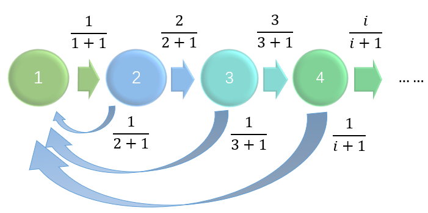
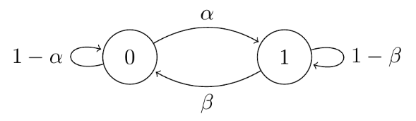

# Markov Chains: Definitions and Representations

A stochastic process $X = \{ x(t): t\in T\}$ is a collection of random variables.

There are two elements:

- Time $t$: 
  * discrete time ($T$ is a countably infinite set; under this case, we call 'Markov chain') 
  * continuous time (under this case, we call 'Markov process')
- Space $\Omega$:
  * discrete space ($X_{t}$ comes from a countably infinite set) 
  * continuous space.

Markov chain is a **discrete-time** process for which the future behaviour, given the past and the present, only depends on the present and not on the past. 

Markov process is the **continuous-time** version of a Markov chain.

**Definition 1. [Markov chain]** A discrete time stochastic process $ X_0, X_1, X_2, $. . . is a Markov chain if
$$
P(X_{t} = a_t | X_{t-1} = a_{t-1}, X_{t-2} = a_{t-2}, ..., X_0 = a_0) = P(X_{t} = a_t | X_{t-1} = a_{t-1}) = P_{a_{t-1},  a_{t}}
$$

***Remark 1:*** This is time-homogeneous markov chain, for $\forall t$, for $\forall a_{t-1}, a_{t} \in \Omega$, the transition probability $P_{a_{t-1}, a_{t} }$ is the same.

***Remark 2:*** In DDPM, it is not a  time-homogeneous chain, as the transition probability at t is obtained by a network(t).

The state $X_{t}$ depends on the previous state $X_{t-1}$ but is independent of the particular history $X_{t-2}, X_{t-3},...$. This is called the **Markov property** or **memoryless property**.

The Markov property does not imply that $X_{t}$ is independent of the random variables $X_{0}$, $X_{1}$,..., $X_{t-2}$; it just implies that **any dependency of $X_{t}$ on the past is captured in the value of $X_{t-1}$**.

The Markov chain is **uniquely** defined by the one-step transition probability matrix P:
$$
P = 
\begin{pmatrix}
P_{0,0} & P_{0, 1} & \cdots & P_{0, j} & \cdots\\
\vdots & \vdots & \ddots & \vdots& \vdots\\
P_{i,0} & P_{i, 1} & \cdots & P_{i, j} & \cdots\\
\vdots & \vdots & \ddots & \vdots& \vdots\\
\end{pmatrix}
$$
where $P_{i,j}$ is the probability of transition from state $i$ to state $j$. $P_{i,j} = P(X_{t} = j| X_{t-1} = i), i,j \in \Omega$. For $\forall i$, $\sum_{j \geq 0} P_{i,j} = 1$.

#  Classification of States
For simplicity, we assume that the state space $\Omega$ is finite.
## Communicating class

**Definition 2. [Communicating class]** A state $j$ is reachable from state $i$ if there exists a positive integer $n$ such that $P_{i,j}^{(n)} > 0$. We write $i \rightarrow j$. If $j$ is reachable
from $i$, and $i$ is reachable from $j$, then the states $i$ and $j$ are said to **communicate**, denoted by $i \leftrightarrow j$. A communicating class $C$ is a **maximal** set of states that communicate with each other. **No state in $C$ communicates with any state not in $C$.**

## Irreducible

**Definition 3.** A Markov chain is **irreducible** if all states belong to **one** communicating class.

This means that **any state can be reached from any other state**. For $\forall i, j \in \Omega$, $P_{i,j} > 0$.

**Lemma 1.** A finite Markov chain is irreducible if and only if its graph representation is a strongly connected graph.

### Transient vs Recurrent states

Let $r_{i,j}^{t}$ denote the probability that the chain, starting at state $i$, **the first time** transition to state $j$ occurs at time $t$. That is,
$$
r_{i,j}^{t} = P(X_{t} = j, X_{s} \neq j, \forall 1 \leq s \leq t-1 | X_{0} = i)
$$

**Definition 4.** A state is **recurrent** if $\sum_{t \geq 1} r_{i,i}^{t} = 1$ and it is **transient** if $\sum_{t \geq 1} r_{i,i}^{t} < 1$. A Markov chain is recurrent if every state in the chain is recurrent.

- If state i is recurrent then, once the chain visits that state, it will (with probability 1)
eventually return to that state. Hence the chain will visit state $i$ over and over again,
**infinitely** often.

- A transient state has the property that a Markov chain starting at this state returns to this state only **finitely often**, with probability 1.
  
- If one state in a communicating class is transient (respectively, recurrent) then all states in that class are transient (respectively, recurrent).

**Definition 5.** An irreducible Markov chain is called recurrent if at least one (equivalently, every) state in this chain is recurrent. An irreducible Markov chain is called transient if at least one (equivalently, every) state in this chain is transient.

Let $\mu_{i} = \sum_{t \geq 1} t \cdot r_{i,i}^{t}$ denote the expected time to return to state $i$ when starting at state $i$.

**Definition 6.** A state $i$ is **positive recurrent** if $\mu_{i} < \infty$ and **null recurrent** if $\mu_{i} = \infty$.

Here we give an example of a Markov chain that has null recurrent states. Consider the following markov chain whose states are the positive integers.

  

Starting at state 1, the probability of not having returned to state 1 within the first $t$ steps is
$$
\prod_{j=1}^{t} \frac{j}{j+1} = \frac{1}{t+1}.
$$
The probability of never returning to state 1 from state 1 is 0, and state 1 is
recurrent. Thus, the probability of the first time transition to state $1$ occurs at time $t$ is
$$
r_{1,1}^{t} = \frac{1}{t} \cdot \frac{1}{t+1} = \frac{1}{t(t+1)}.
$$
The expected number of steps until the first return to state 1 when starting at state 1 is
$$
\mu_{1} = \sum_{t = 1}^{\infty} t \cdot r_{1,1}^{t} = \sum_{t = 1}^{\infty} \frac{1}{t+1} = \infty.
$$
State 1 is recurrent but null recurrent.

**Lemma 2.** In a finite Markov chain: 

>1. at least one state is recurrent; and

>2. all recurrent states are positive recurrent.

Thus, all states of a finite, irreducible Markov chain are positive recurrent.

### Periodic vs Aperiodic states
**Definition 7.** A state $j$ in a discrete time Markov chain is **periodic** if there exists an integer $k>1$ such that $P(X_{t+s}= j | X_t = j) = 0$ unless $s$ is divisible by $k$. A discrete time Markov chain is periodic if any state in the chain is periodic. A state or chain that is not periodic is **aperiodic**.

A state $i$ is periodic means that for $s = k, 2k, 3k,...$, $P(X_{t+s}= j | X_t = j) > 0$.

**NB: k > 1**

### Ergodic
**Definition 8.** An **aperiodic**, **positive recurrent** state is an **ergodic** state. A Markov chain is ergodic if all its states are ergodic.

**Corollary 1.** Any finite, irreducible, and aperiodic Markov chain is an ergodic chain.

### Stationary distribution

Consider the two-state “broken printer” Markov chain:

  

There are two state (0 and 1) in this Markov chain, and assume that the initial distribution is
$$
P(X_0 = 0) = \frac{\beta}{\alpha+\beta}, \qquad P(X_0 = 1) = \frac{\alpha}{\alpha+\beta}.
$$
Then, according to the transition probability matrix $P$, after one step, the distribution is
$$
\begin{align*}
P(X_1 = 0) &= P(X_0 = 0)P(X_1 = 0 | X_0 = 0) + P(X_0 = 1)P(X_1 = 0 | X_0 = 1) \\
&= \frac{\beta}{\alpha+\beta} \cdot (1-\alpha) + \frac{\alpha}{\alpha+\beta} \cdot \beta = \frac{\beta}{\alpha+\beta}, \\
P(X_1 = 1) &= P(X_0 = 0)P(X_1 = 1 | X_0 = 0) + P(X_0 = 1)P(X_1 = 1 | X_0 = 1) \\
&= \frac{\beta}{\alpha+\beta} \cdot \alpha + \frac{\alpha}{\alpha+\beta} \cdot (1-\beta) = \frac{\alpha}{\alpha+\beta}.
\end{align*}
$$
Apparently, the distribution of $X_1$ is the same as the initial distribution. Similarly, we can prove that the distribution of $X_t$ is the same as the initial distribution for any $t$. Here, $\pi = (\frac{\beta}{\alpha+\beta}, \frac{\alpha}{\alpha+\beta})$ is called **stationary distribution**.

**Definition 9.** A probability distribution $\pi = (\pi_i)$, $\sum_{i \in \Omega} \pi_i = 1$(**row vector**)  on the state space $\Omega$ is called a **stationary distribution** (or an equilibrium distribution) for the Markov chain with transition probability matrix $P$ if $\pi = \pi P$, equivalently, $\pi_j = \sum_{i \in \Omega}\pi_i P_{i,j}$ for all $j \in \Omega$.

- One interpretation of the stationary distribution: if we started off a **thousand** Markov chains, choosing each starting position to be state $i$ with probability $\pi_i$, then(roughly) **$1000 \pi_j$** of them would be in state $j$ 
at any time in the future – but not necessarily the same ones each time.

- If a chain ever reaches a stationary distribution then it maintains that distribution for all future time, and thus a stationary distribution represents a steady state or an equilibrium in the chain’s behavior.
  
#### Finding a stationary distribution
 Consider the following no-claims discount Markov chain with state space $\Omega = \{1,2,3\}$ and transition matrix
$$
P =
\begin{pmatrix}
\frac{1}{4} & \frac{3}{4} & 0\\
\frac{1}{4} & 0 & \frac{3}{4}\\
0 & \frac{1}{4} & \frac{3}{4}
\end{pmatrix}
$$

- Step 1: 
  Assume $\pi = \{\pi_1, \pi_2, \pi_3\} $ is a stationary distribution. According to the definition 9 of stationary distribution, we need to solve the following equations:
$$
\begin{align*}
\pi_1 &= \frac{1}{4}\pi_1 + \frac{1}{4}\pi_2, \\
\pi_2 &= \frac{3}{4}\pi_1 + \frac{1}{4}\pi_3, \\
\pi_3 &= \frac{3}{4}\pi_2 + \frac{3}{4}\pi_3.
\end{align*}
$$
Adding the normalising condition $\pi_1 + \pi_2 + \pi_3 = 1$, we get four equations in three unknown parameters. 

- Step 2: 
  Choose one of the parameters, say $\pi_1$, and solve for the other two parameters in terms of $\pi_1$. We get
$$
\pi_1 = \frac{1}{4}\pi_1 + \frac{1}{4}\pi_2 \Rightarrow \pi_2 = 3\pi_1, \qquad \pi_3 = 3\pi_2 = 9\pi_1.
$$
- Step 3: 
  Combining with the normalising condition, we get
$$
\pi_1 + 3\pi_1 + 9\pi_1 = 1 \Rightarrow \pi_1 = \frac{1}{13}, \qquad \pi_2 = \frac{3}{13}, \qquad \pi_3 = \frac{9}{13}.
$$
Finally, we get the stationary distribution $\pi = (\frac{1}{13}, \frac{3}{13}, \frac{9}{13})$.

#### Existence and uniqueness
Given a Markov chaine, how can we know whether it has a stationary distribution? If it has, is it unique? At this part, we will answer these questions.

Some notations:

- Hitting time to hit the state $j$: $H_{j} = \min \{ t \in \{0, 1, 2,...\}: X_t = j\}$. Note that here we  include time $t = 0$.

- Hitting probability to hit the state $j$ staring from state $i$: $h_{i,j} = P(X_t = j, \text{for some} \ t \geq 0 | X_0 = i) = P(H_{j} < \infty | X_0 = i) = \sum_{t \geq 0} r_{i,j}^{t}$. 
  
Note that this is different from $r_{i,j}^{t}$, which denotes the probability that the chain, starting at state $i$, the **first** time transition to state $j$ **occurs at time $t$**.

We also have
$$
h_{i,j} =
\begin{cases}
\sum_{k \in \Omega}P_{i,k}h_{k,j} & , & \text{if} \quad j \ne i, \\
1 & , & \text{if} \quad  j = i.
\end{cases}
$$

- Expected hitting time: $\eta_{i,j} = E(H_{j} | X_0 = i) = \sum_{t \geq 0} t \cdot r_{i,j}^{t}$. The expected time until we hit state $j$ starting from state $i$.
We also have
$$
\eta_{i,j} =
\begin{cases}
1 + \sum_{k \in \Omega}P_{i,k}\eta_{k,j} & , & if j \ne i, \\
0 & , & if j = i.
\end{cases}
$$
(For the first case, we add 1 because we need to consider the first step from state $i$ to state $k$.)

- Return time: $M_i = \min \{ t \in \{1, 2,...\}: X_t = i\}$. It is different from $H_{i}$, as we exclude time $t = 0$. It is the first time that the chain returns to state $i$ after $t = 0$.

- Return probability: $m_{i} = P(X_t = i  \ \text{for some} \ n \geq 1 | X_0 = i) = P(M_i < \infty | X_0 = i) = \sum_{t>1}r_{i,i}^{t}.$

- Expected return time: $\mu_{i} = E(M_i | X_0 = i) = \sum_{t \geq 1} t \cdot r_{i,i}^{t}$. The expected time until we return to state $i$ starting from state $i$.
$$
m_{i} = \sum_{j \in \Omega} P_{i,j}h_{j,i},  \qquad \mu_{i} = 1 + \sum_{j \in \Omega} P_{i,j}\eta_{j,i}.
$$

**Theorem 1.** Consider an irreducible Markov chain (**finite or infinite**), (1) if it is **positive recurrent**, $\exists$ an unique stationary distribution $\pi$, such that $\pi_i = \frac{1}{\mu_{i}}$. (2) if it is **null recurrent** or **transient**, no stationary distribution exists.

***Remark 3:*** If the chain is **finite** irreducible, it must be positive recurrent, thus it has an unique stationary distribution.

***Remark 4:*** If the Markov chain is not irreducible, we can decompose the state space into several communicating classes. Then, we can consider each communicating class separately.

- If none of the classes are positive recurrent, then no stationary distribution exists.

- If exactly one of the classes is positive recurrent (and therefore closed), then there exists a unique stationary distribution, supported only on that closed class.

- If more the one of the classes are positive recurrent, then many stationary distributions will exist.

Now, we give the proof of Theorem 1. We first prove that if a Markov chain is irreducible and positive recurrent, then there **exists** a stationary distribution. Next, we will prove the stationary distribution is **unique**. Since the second part with the null recurrent or transitive Markov chains is less important and more complicated, we will omit it. If you are interested in it, you can refer to the book [Markov Chains](https://www.statslab.cam.ac.uk/~james/Markov/) by James Norris.

Proof. 
(1) Suppose that $(X_0, X_1 ...)$ is a recurrent Markov chain, which can be positive recurrent or null recurrent. Then we can desigh a stationary distribution as follows. (If we can desigh a stationary distribution, then it must be existed.)

Let $\nu_i$ be the expected number of visits to $i$ before we return back to $k$, 
$$
\begin{align*}
\nu_i &= \mathbb{E}(\# \text{visits to $i$ before returning to } k | X_0 = k) \\
&= \mathbb{E}\sum_{t=1}^{M_k} P(X_t = i | X_0 = k) \\
&= \mathbb{E}\sum_{t = 0}^{M_k - 1} P(X_t = i | X_0 = k)
\end{align*}
$$
The last equation holds because of $ P(X_0 = i | X_0 = k)  = 0$ and $ P(X_{M_k} = i | X_0 = k)  = 0$.

If we want design a stationary distribution, it must statisfy $\pi P = \pi$ and $\sum_{i \in \Omega}\pi_i = 1$. 

(a) We first prove that $\nu P = \nu$. 
$$
\begin{align*}
\sum_{i \in \Omega} \nu_i P_{i,j} &= \mathbb{E}\sum_{i \in \Omega} \sum_{t = 0}^{M_k - 1} P(X_t = i, X_{t+1} = j | X_0 = k) \\
&= \mathbb{E}\sum_{t = 0}^{M_k - 1}  \sum_{i \in \Omega}  P(X_t = i, X_{t+1} = j | X_0 = k) \\
&=  \mathbb{E} \sum_{t = 0}^{M_k - 1} P(X_{t+1} = j | X_0 = k) \\
&= \mathbb{E} \sum_{t = 1}^{M_k } P(X_{t} = j | X_0 = k) \\
&= \mathbb{E} \sum_{t = 0}^{M_k - 1} \nu_i \\
&= \nu_j.
\end{align*}
$$
(b) Next, what we need to do is to normalize $\nu$ to get a stationary distribution. We have
$$
\sum_{i \in \Omega} \nu_i = \sum_{i \in \Omega} \mathbb{E} \sum_{t = 0}^{M_k - 1} P(X_t = i | X_0 = k) =\mathbb{E} \sum_{t = 0}^{M_k - 1}  \sum_{i \in \Omega}  P(X_t = i | X_0 = k) = E(M_k | X_0 = i) = \mu_k.
$$
Thus, we can define $\pi_i = \nu_i/\mu_k$, $\pi = \{\pi_i, i \in \Omega\}$ is one of the stationary distribution.

(2) Next, we prove that if a Markov chain is irreducible and positive recurrent, then the stationary distribution is **unique** and is given by $\pi_j = \frac{1}{\mu_j}$.
Given a stationary distribution $\pi$, if we prove that for all $i$, $\pi_j == \frac{1}{\mu_j}$, then we prove that the stationary distribution is unique. 

Remember that the expected hitting time:
$$
\eta_{i,j} = 1 + \sum_{k \in \Omega}P_{i,k}\eta_{k,j},  j \ne i  \qquad (eq:1)
$$
We multiply both sides of (eq:1) by $\pi_i$ and sum over $i (i \ne j)$ to get
$$
\sum_{i \ne j} \pi_i \eta_{i,j} = \sum_{i \ne j} \pi_i + \sum_{i \ne j} \sum_{k \in \Omega} \pi_i P_{i,k}\eta_{k,j} 
$$
Since $\eta_{j,j} = 0$, we can rewrite the above equation as
$$
\sum_{i \in \Omega} \pi_i \eta_{i,j} = \sum_{i \ne j} \pi_i + \sum_{i \ne j} \sum_{k \in \Omega} \pi_i P_{i,k}\eta_{k,j}. \qquad (eq:2)
$$

(The above equality lacks $j$, and we also want to design $\pi_j = 1/\mu_j$.)
Remember that the expected return time:
$$ \mu_{j} = 1 + \sum_{i \in \Omega} P_{j,i}\eta_{i,j}. \qquad (eq:3) $$
We multiply both sides of (eq:2) by $\pi_j$ to get
$$
 \pi_j \mu_{j} =\pi_j +  \sum_{k \in \Omega} \pi_j P_{j,k}\eta_{k,j} \qquad (eq:4)
$$
Adding (eq:2) and (eq:4), we get
$$
\begin{align*}
  \sum_{i \in \Omega} \pi_i \eta_{i,j} + \pi_j \mu_{j} &= \sum_{i \in \Omega} \pi_i + \sum_{i \in \Omega} \sum_{k \in \Omega} \pi_i P_{i,k}\eta_{k,j} \\
  &= 1 + \sum_{k \in \Omega} \sum_{i \in \Omega}  \pi_i P_{i,k}\eta_{k,j} \\
  &= 1 +  \sum_{k \in \Omega} \pi_k \eta_{k,j}  \qquad (\text{since} \sum_{i \in \Omega} \pi_i P_{i,k} = \pi_k) \\
\end{align*}
$$
**Since the Markov chain is irreducible and positive recurrent, that means all states belong to a communication class and  the expected return time of each state is finite. Thus, the space $\Omega$ is a finite dimensional space.** We can substract $\sum_{k \in \Omega} \pi_k \eta_{k,j}$ and $\sum_{i \in \Omega} \pi_i \eta_{i,j} $ (equal) from both sides of the above equation to get
$$
\pi_j \mu_{j}=1,
$$
which means $\pi_j = 1/\mu_j$. Similarly, we can prove that $\pi_i = 1/\mu_i$ for all $i \in \Omega$.

**Theorem 2. (Limit theorem)** Consider an irreducible, aperiodic Markov chain (maybe infinite), we have $\lim\limits_{t \to \infty} P_{i,j}^{t} s= \frac{1}{\mu_{j}}$. Specially,

(1) Suppose the Markov chain is positive recurrent. Then $\lim\limits_{t \to \infty} P_{i,j}^{t} = \pi_j = \frac{1}{\mu_{j}}$.

(2) Suppose the Markov chain is null recurrent or transient. Then there is no limite probability.

Three conditions for convergence to an equilibrium probability distribution: irreducibility, aperiodicity, and positive recurrence. The limit probability 
$$
P =
\begin{pmatrix}
\pi_1 & \pi_2 & \cdots & \pi_N\\
\pi_1 & \pi_2 & \cdots & \pi_N\\
\vdots & \vdots & \ddots & \vdots\\
\pi_1 & \pi_2 & \cdots & \pi_N\\
\end{pmatrix}
$$
where each row is identical.

Define $V_{i,j}^{t} = |\{ n < t | X_n = j\}|$. 
$V_{i,j}^{t}$ is the number of visits to state $j$ before time $t$ starting from state $i$. Then we can interpret  $V_{i,j}^{t}/t$ as the proportion of time up to time $t$ spent in state  $j$.

**Theorem 3. [Ergodic theorem]** Consider an irreducible Markov chain, we have $\lim\limits_{t \to \infty} V_{i,j}^{t}/t = \frac{1}{\mu_{j}}$ **almost surely**. Spectially,

(1) Suppose the Markov chain is positive recurrent. Then $\lim\limits_{t \to \infty}  V_{i,j}^{t}/t = \pi_j = \frac{1}{\mu_{j}}$ **almost surely**.

(2) Suppose the Markov chain is null recurrent or transient. Then $ V_{i,j}^{t}/t \to 0$ **almost surely** for all $j$.

**almost surely** means that the convergence probability of the event is 1.

**Theorem 4. [Detailed balance condition]** Consider a finite, irreducible, and ergodic Markov chain with transition matrix $P$. If there are nonnegative numbers $\bar{\pi} = (\pi_0, \pi_1, ..., \pi_n)$ such that $\sum_{i=0}^{n} \pi_i = 1$ and if, for any pair of states $i, j$,
$$
\pi_i P_{i,j} = \pi_{j} P_{j,i},
$$
then $\bar{\pi}$ is the stationary distribution corresponding to $P$.

Proof. 
$$
\sum_{i} \pi_i P_{i,j} = \sum_{i}\pi_{j} P_{j,i} = \pi_{j}
$$
Thus, $\bar{\pi} = \bar{\pi}P$. Since this is a finite, irreducible, and ergodic Markov chain, $\bar{\pi}$ must be the unique stationary distribution of the Markov chain.

***Remark 5:*** Theorem 2 is a sufficient but not necessary condition.

## Reference

- Mitzenmacher, M., & Upfal, E. (2005). Probability and Computing. Cambridge University Press.
- [Recurrence and transience](https://mpaldridge.github.io/math2750/S09-recurrence-transience.html)
- [Class structure](https://mpaldridge.github.io/math2750/S07-classes.html)
- [Stationary distributions](https://mpaldridge.github.io/math2750/S10-stationary-distributions.html)
- Stirzaker, David. [Elementary Probability](https://www.ctanujit.org/uploads/2/5/3/9/25393293/_elementary_probability.pdf)