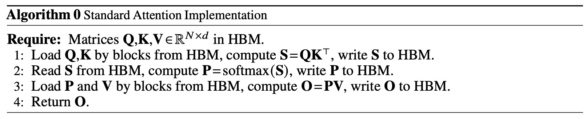
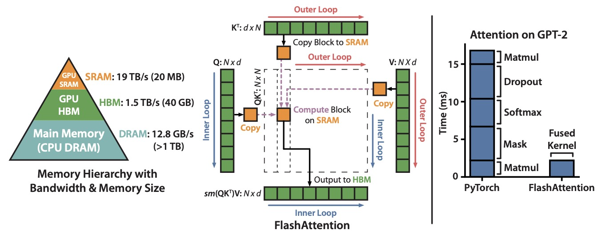
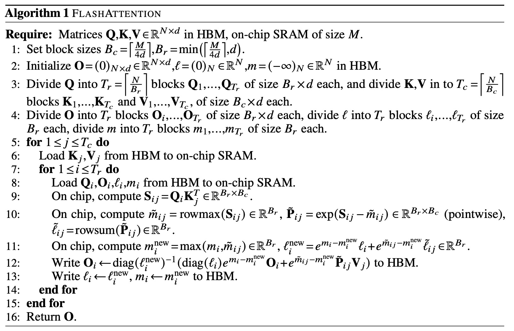
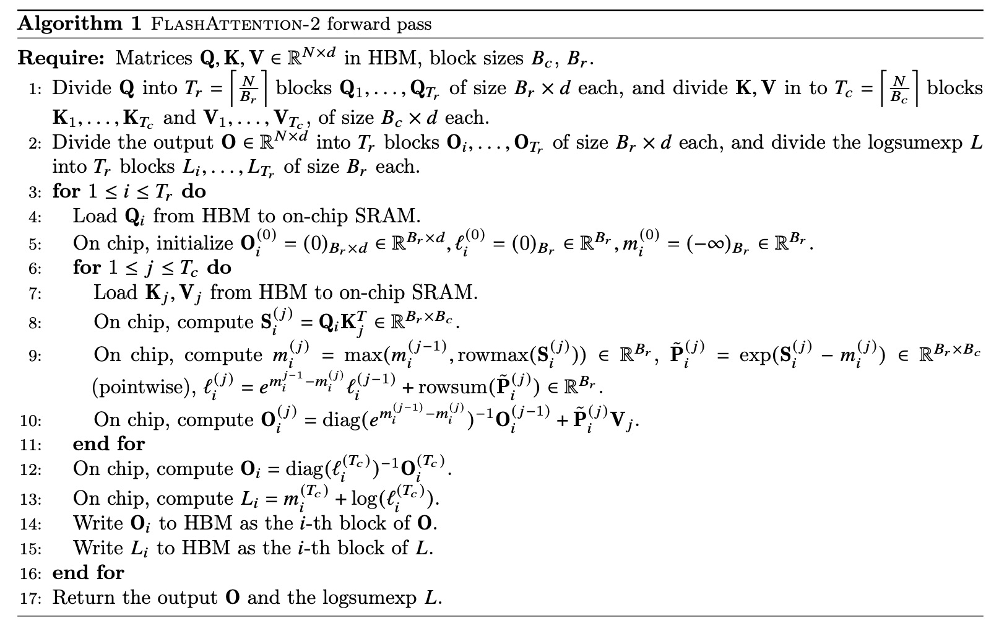
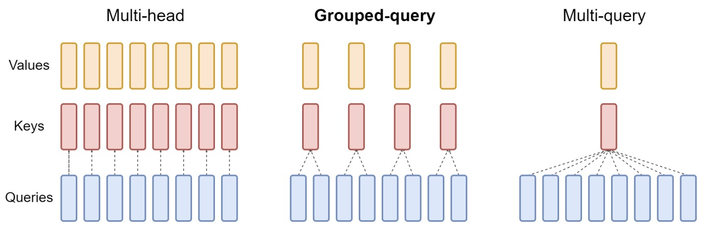

# Training Optimizations
## FlashAttention
[FlashAttention: Fast and Memory-Efficient Exact Attention with IO-Awareness](https://arxiv.org/abs/2205.14135)

由于 self-attention 的时间和内存复杂度是序列长度的平方，因此 Transformers 在长序列上运行缓慢且占用内存。
存在一些近似注意力方法试图通过牺牲模型质量来降低计算复杂度，从而解决这一问题。

FlashAttention 的核心创新是通过 **IO-aware（输入/输出感知）** 和 **精确计算** 的方式，利用 **tiling**（块处理）技术来重组注意力计算，从而减少 GPU 高带宽内存（HBM）和 GPU 片上 SRAM 之间的数据交换量。通过这些改进，FlashAttention 能够显著提升速度，并将内存使用从通常的 **O(N^2)** 降低到 **O(N)**，其中 $N$ 是序列长度。

传统的 attention 层计算过程：

由于 HBM 的读写速度很慢，FlashAttention 使用分块技术避免在 HBM 上传输整个 $N \times N$ 注意力矩阵。

分块处理的具体步骤包括：

1. **外层循环（红色箭头）**：FlashAttention 在计算时对 $K$ 和 $V$ 矩阵进行分块处理。首先将 $K$ 和 $V$ 矩阵分成小块，每块包含的数据量足够放入片上缓存（SRAM）中。每次处理一块时，将其从 HBM 加载到 SRAM。
   
2. **内层循环（蓝色箭头）**：对于每个 $K$ 和 $V$ 块，FlashAttention 对 $Q$ 矩阵也进行分块处理。

   - 每次从 $Q$ 矩阵加载一个小块到片上缓存，并与当前的 $K$ 和 $V$ 块进行计算。

   - 在块内完成的计算包括：对 $Q$ 和 $K$ 的局部块执行矩阵乘法 $Q K^T$，得到局部注意力得分矩阵。

   - 接着，对得分矩阵进行 softmax 操作，得到归一化后的注意力权重。

3. **结果写回 HBM**：对当前块计算完成后，将结果写回 HBM 中，存储为最终的注意力输出。

通过上述分块方法，FlashAttention **不需要存储完整的 $N \times N$ 注意力矩阵**，而是逐块处理并写回计算结果。这避免了大规模的 HBM 读写操作，从而显著提升了计算效率。与传统注意力计算方法不同，FlashAttention 不会在 HBM 中生成和存储整个注意力矩阵，而是逐步在 SRAM 中完成小块计算。

右图展示了 FlashAttention 的加速效果。FlashAttention 实现了对 PyTorch 中 GPT-2 注意力计算的 **7.6 倍加速**。性能提升的核心在于：

- 减少了大规模的 HBM 数据传输。

- 利用了快速的 SRAM 进行局部计算，避免了反复从 HBM 中调取大块数据。

这种方法有效地优化了长序列情况下的注意力计算，极大减少了对内存带宽的需求，并在大型语言模型（例如 GPT-2）上展现出显著的加速效果。

下面给出了算法的实现过程，具体推导细节可见论文。

## FlashAttention-2
[FlashAttention-2: Faster Attention with Better Parallelism and Work Partitioning](https://arxiv.org/abs/2307.08691)

尽管 FlashAttention 在内存和速度上实现了显著优化，但其性能仍然未能达到 GPU 的理论计算速度上限，尤其是与 GEMM 操作相比。具体来说，
- FlashAttention 中虽然也涉及矩阵计算，但由于其复杂的分块、循环机制和动态的内存管理操作，它的计算模式比 GEMM 更复杂，导致执行效率偏低。尤其是在大规模计算的场景中，FlashAttention 的结构性处理操作（如加载和处理不同的矩阵块）会产生一定的开销，这些开销限制了其最高计算性能。

- 由于 FlashAttention 的设计需要进行大量的内存加载、分块和小规模计算，因此每秒执行的浮点运算数（FLOPs/s）通常只有 GPU 理论上限的 25-40% 左右。这意味着 FlashAttention 虽然比传统的注意力计算更高效，但在计算密集型任务上仍远逊于最优化的 GEMM。

**FlashAttention-2** 是在 FlashAttention 基础上的优化版本，旨在通过更优的工作分配来解决效率问题。原始的 FlashAttention 在 GPU 上线程块和线程组（warps）之间的工作划分较差，导致了低占用率或不必要的共享内存读/写。为了解决这些问题，Dao 及其团队对算法进行了以下改进：

1. **减少非矩阵乘法的 FLOPs**：通过优化算法结构，减少了与矩阵乘法无关的浮点运算次数，从而使计算更高效。

2. **并行化注意力计算**：针对单个 attention head 的计算，FlashAttention-2 通过不同的线程块并行化，以增加 GPU 的占用率（occupancy），充分利用 GPU 的计算资源。

3. **减少共享内存通信**：在每个线程块内，将工作分配到不同的线程组（warps）中，以尽量减少线程间通过共享内存进行的通信，从而降低延迟。

这些改进使得 FlashAttention-2 的速度相比于 FlashAttention 提升了约两倍，在 NVIDIA A100 GPU 上达到了 50-73% 的理论最高浮点运算速度 (FLOPs/s)，接近于高度优化的矩阵乘法（GEMM）操作的效率。

##  Multi-Query Attention (MQA)
[Fast Transformer Decoding: One Write-Head is All You Need](https://arxiv.org/pdf/1911.02150)

在标准的多头注意力中，每个注意力头（head）都会分别拥有自己的“键”（keys）和“值”（values）向量，这在训练中不会带来太大问题，因为可以并行处理整个序列。然而，在增量推理阶段（如在语言模型中逐步生成文本的过程中），这种机制导致了性能瓶颈。由于每个新的生成步骤都需要反复加载这些巨大的“键”和“值”张量，频繁的数据传输会消耗大量的内存带宽，从而导致较低的推理速度。

在 MQA 中，所有注意力头共享同一个“键”和“值”张量，这意味着不再为每个注意力头生成独立的“键”和“值”，从而显著减少了张量的大小和存储需求。这一共享机制降低了增量推理中的内存带宽消耗，使模型推理更为高效。

MQA的做法其实很简单。在MHA中，input embedding 分别经过 $W_Q$, $W_K$, $W_V$ 变换后，会被划分为 $n$ 份 (n = head number)，相应的，维度降低为 $d_{head} = d_{model}/n$。然后分别进行不同的 attention head 计算，最后再拼接为维度为 $d_{model}$的 embedding。而对于 MQA，在线性变换之后，只对 query 进行切分，对于 key 和 value，直接在线性变换时把维度降到了 $d_{head} $。然后这 $n$ 个 query 分别和同一个 key和value进行计算，最后把结果拼接为维度为 $d_{model}$的 embedding。

## Grouped-Query Attention (GQA)
[GQA: Training Generalized Multi-Query Transformer Models from
Multi-Head Checkpoints](https://arxiv.org/pdf/2305.13245)

MQA 仅使用单一的 key-value 头，大幅提升了解码器的推理速度。然而，MQA 可能会导致模型质量下降。GQA 提出了一个折中的办法，既能减少MQA效果的损失，又相比MHA需要更少的缓存。

在 GQA 中，query 的划分不变。由于使用一套 key 和 value 的效果不好，因此可以划分多套 key-value，但是其数量仍然少于 query。然后，将 query 的多个头划分到不同的 group, 同一个 group 内的 query 共享同一套 key-value。

从实验结果上看，GQA 的速度相比 MHA 有明显提升，而效果上比 MQA 也好一些，能做到和 MHA 基本没差距。

## Longformer
[Longformer: the Long-Document Transformer](https://arxiv.org/abs/2004.05150)

# Inference Optimizations
## KV Cache: Key-Value Cache
在解码过程中，随着每个新 token 的生成，模型需要不断地计算新的 Key 和 Value 来更新注意力机制。这些新的 Key 和 Value 将被 缓存，以便下次使用，不需要每次都重新计算。通过缓存键（Key）和值（Value）张量，模型可以在后续步骤中重用这些张量，而无需重新计算它们。这显著减少了计算开销，特别是在处理长序列时，能够有效提高计算效率。

推荐博客：[解码中的KV Cache](https://www.linsight.cn/3dc22f96.html#%E8%A7%A3%E7%A0%81%E4%B8%AD%E7%9A%84kv-cache)

- KV 缓存只存储 Key 和 Value 的表示，因为这些表示不随时间变化，每个 token 的 Key 和 Value 可以在计算时重用。而 Query 是动态变化的，每个时间步的 Query 都是与输入的当前 token 和历史 tokens 的组合相关，因此它不需要缓存。

# References:

- [Distilled A](https://aman.ai/primers/ai/model-acceleration/)

- [理解Attention:从起源到MHA,MQA和GQA](https://www.linsight.cn/3dc22f96.html)

