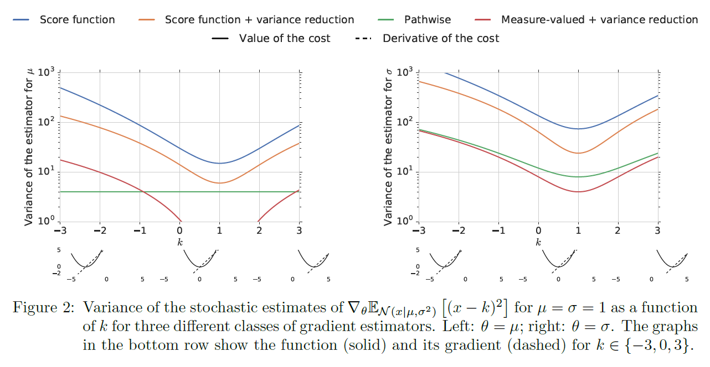
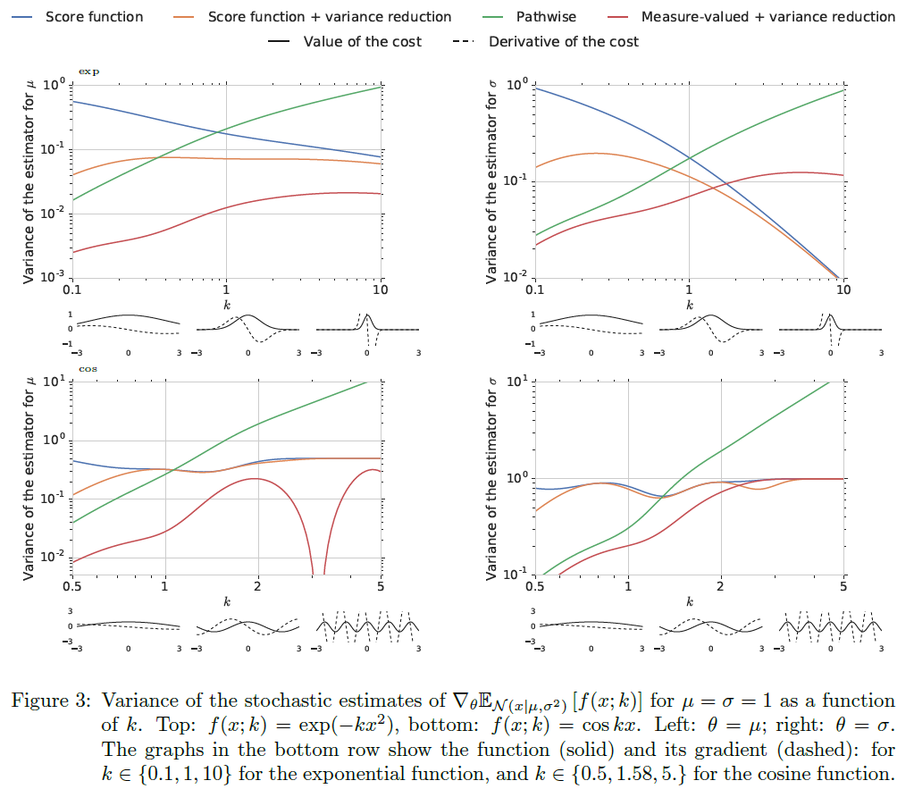
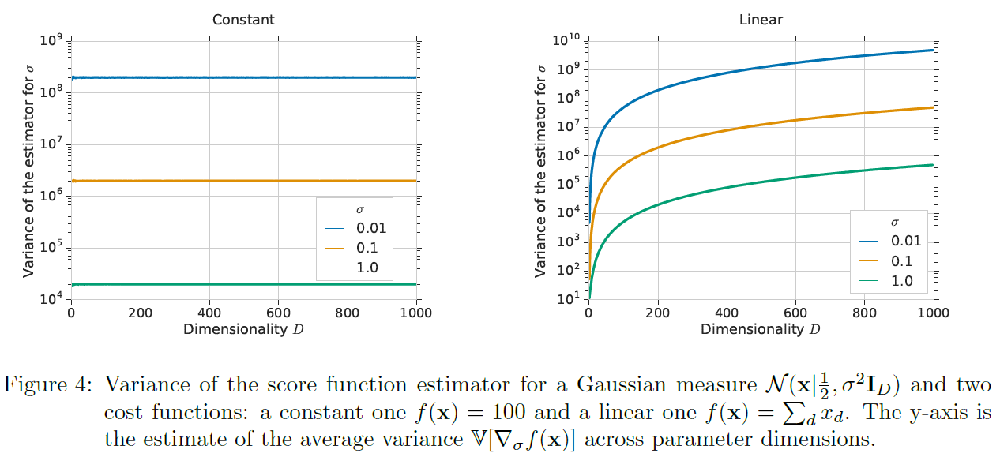
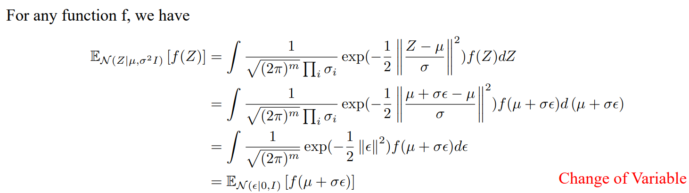
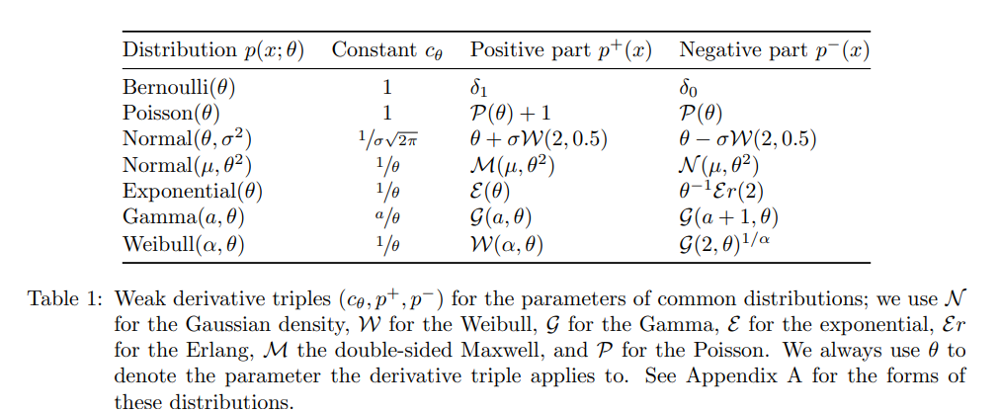
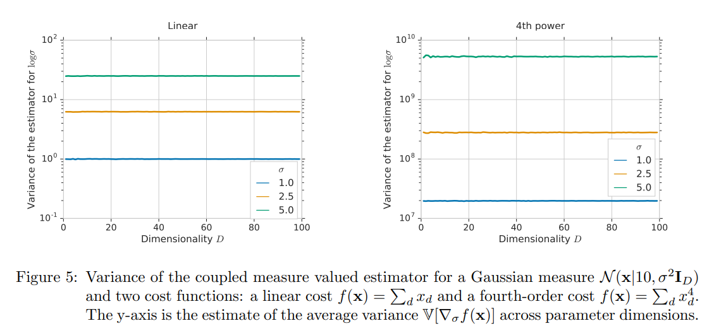

# Monte Carlo Methods and Stochastic Optimisation
The mean-value analysis problem:
$$
\mathcal{F}(\theta) := \int p(x; \theta) f(x; \phi) \text{d}x = \mathbb{E}_{p(x; \theta)} f(x; \phi),  \enspace (1)
$$
where $f(x; \phi)$ is the cost with parameters $\phi$, $p(x;\theta)$ is the measure, a probability distribution that is continuous in its domain and differentiable with $\theta$.

This objective is very common in variational inference, reinforcement learning, etc.

To learn the distribution parameter $\theta$, we need to consider the gradient:
$$
\eta := \nabla_{\theta} \mathcal{F}(\theta) = \nabla_{\theta} \mathbb{E}_{p(x; \theta)} f(x; \phi). \enspace  (2)
$$
$\eta$ is called the sensitivity analysis of $\mathcal{F}$.

Problems:

- not able to evaluate the expectation in closed form;
- $x$: high-dimensional, $\theta$: high-dimensional;
- the cost funtion may not be differential or a black-box function.

## Monte Carlo Estimators

We can numerically evaluate the integral by first drawing **independent**  samples $\hat{x}^{(1)}, ..., \hat{x}^{(N)}$ from the distribution $p(x; \theta)$, and then computing the averaged of the function evaluated at these samples:
$$
\bar{\mathcal{F}}_N = \frac{1}{N} \sum_{n=1}^{N} f(\hat{x}^{(n)}), \qquad \hat{x}^{(n)} \sim p(x; \theta), \quad n = 1,..., N.
$$
$\bar{\mathcal{F}}_N$ is a random variable and is called Monte Carlo estimator of eq. (1).

Remark 1. As long as we can write an integral in the form of eq. (1) (a product of a function and a distribution that we can easily sample from), we can apply the Monte Carlo method.

### Four Properties

- Consistency. As $N \to \infty$, the estimator $\bar{\mathcal{F}}_N \to \mathbb{E}_{p(x; \theta)} f(x; \phi)$. This can be easily satisfied according to the strong law of large number.
- Unbiasedness. 
$$
\mathbb{E}_{p(x; \theta)} [\bar{\mathcal{F}}_N] = \mathbb{E}_{p(x; \theta)} [\frac{1}{N} \sum_{n=1}^{N} f(\hat{x}^{(n)})] = \frac{1}{N} \sum_{n=1}^{N} \mathbb{E}_{p(x; \theta)} [f(\hat{x}^{(n)})] = \mathbb{E}_{p(x; \theta)}[f(x)].
$$
(if we repeat the estimation process many times, the estimate is centered on the the actual value of the integral on average)

- Minimum variance.  If we consider two **unbiased** estimators using the same number of sampling $N$, we will prefer the estimator that has lower variance. [**if MC estimator has the minimum variance?**]
- Computational efficiency. for example: a computational cost linear in the number of parameters, can be computed in parallel.

### The central role of Gradient Estimation eq. (2)

some examples in different areas.

#### Variational Inference

Variational inference is a general method for approximating complex and unknown distributions by the closest distribution within a tractable family. Consider a generic probabilistic model $p(x|z)p(z)$ that defines a generative process in which observed data $x$ is generated from a set of unobserved variables z using a data distribution $p(x|z)$ and a prior
distribution $p(z)$. The posterior distribution of this generative process $p(z|x)$ is unknown, and is approximated by a variational distribution $q(z|x; \theta)$ with variational parameters $\theta$. The objective is 
$$
\max_{\theta, \phi} \mathbb{E}_{q(z|x;\theta)} [\log p(x|z;\phi) - \log \frac{q(z|x;\theta)}{p(z)}].
$$
Optimising the distribution $q$ requires the gradient of the objective with respect to the variational parameters $\theta$:
$$
\eta = \nabla_{\theta}\mathbb{E}_{q(z|x;\theta)} [\log p(x|z;\phi) - \log \frac{q(z|x;\theta)}{p(z)}].
$$

#### Reinforcement Learning
Model-free policy search is an area of reinforcement learning where we learn a policy|a distribution over actions|that on average maximises the accumulation of long-term rewards. Through interaction in an environment, we can generate trajectories $\tau = (s_1, a_1, s_2, a_2, ... , s_T , a_T )$ that consist of pairs of states st and actions at for time period
$t = 1, ... , T$. A policy is learnt by following the policy gradient:

$$
\eta = \nabla_{\theta} \mathbb{E}_{p(\tau;\theta)} [\sum_{t=0}^{T} \gamma^t r(s_t,a_t)]
$$
The cost is the return over the trajectory, which is a weighted sum of rewards obtained at each time step $r(s_t, a_t)$, with the discount facthor $\gamma \in [0, 1]$. The measure is the joint distribution over states and actions $p(\tau;\theta) = \prod_{t=0}^{T-1} [p(s_{t+1}|s_t, a_t)p(a_t|s_t; \theta)]p(a_T |s_T ; \theta)$.

## Intuitive Analysis of Gradient Estimators

The gradients $\nabla_{\theta} \mathbb{E}_{p(x;\theta)}[f(x)]$ can be computed in two ways:

- Derivatives of Measure. The gradient can be computed by differentiation of the measure $p(x; \theta)$. Gradient estimators in this class include the score function estimator and the measure-valued gradient.
  
- Derivatives of Paths. The gradient can be computed by differentiation of the cost $f(x)$, which
encodes the pathway from parameters $\theta$, through the random variable $x$, to the cost value, such as the pathwise gradient, harmonic gradient estimators and finite dfferences, and Malliavin-weighted estimators.

We focus on three classes of gradient estimators: the score function, pathwise and measure-valued gradient estimators. **All three estimators satisfy two desirable properties: consistent and unbiased; but they differ in their variance behaviour and in their computational cost.**

### Intuitive comparision

Consider the stochastic gradient problem (2) that uses Gaussian measures for three simple families
of cost functions, quadratics, exponentials and cosines:
$$
\eta = \nabla_{\theta} \int \mathcal{N}(x | \mu, \sigma^2) f(x; k) \text{d}x; \quad \theta \in \{\mu, \sigma \}; \quad f \in \{ (x-k)^2, \exp(-kx^2), \cos(kx)\}.
$$

The computational cost:

- Both of the score-function and pathwise estimators can be computed using a single sample in the Monte Carlo estimator (N = 1), even for multivariate distributions, making them computationally cheap.
  
- The measure-valued derivative estimator will require 2D evaluations of the cost function for D dimensional parameters, and for this the reason will typically not be preferred in high-dimensional settings.
  
- If the cost function is not differentiable, then the pathwise gradient will not be applicable.

Several criteria to be judged when choosing
an unbiased gradient estimator:

- computational cost;
- implications on the use of differentiable and
non-differentiable cost functions;
- the change in behaviour as the cost itself changes;
- the availability of effective variance reduction techniques to achieve low variance.

# Score Function Gradient Estimators (likelihood ratio method, REINFORCE estimator) 

## Score function
The score function is the derivative of the log-probability of the distribution $\nabla_{\theta} \log p(x; \theta)$ with respect to its parameters $\theta$:
$$
\nabla_{\theta} \log p(x; \theta) = \frac{\nabla_{\theta} p(x; \theta)}{p(x; \theta)}.
$$

properties:
1, Its expectation is zero: 
$$\mathbb{E}_{p(x; \theta)} [\nabla_{\theta} \log p(x; \theta)] = \int p(x; \theta) \frac{\nabla_{\theta} p(x; \theta)}{p(x; \theta)} \text{d}x =  \nabla_{\theta} \int p(x; \theta) \text{d}x = \nabla_{\theta} 1 = 0.$$

2, Its variance is the Fisher information matrix.

Using the score function, we can derive a general-purpose estimator for the sensitivity analysis of eq. (2):
$$
\begin{aligned}
\eta &= \nabla_{\theta} \mathbb{E}_{p(x; \theta)} [f(x)] \\
&= \nabla_{\theta} \int p(x; \theta) f(x) \text{d}x \\
&= \int f(x) \nabla_{\theta} p(x; \theta) \text{d}x \\
&= \int p(x; \theta) f(x) \nabla_{\theta} \log p(x; \theta) \text{d}x \\
&= \mathbb{E}_{p(x; \theta)} [f(x) \nabla_{\theta} \log p(x; \theta)]. 
\end{aligned}
$$
The form is what we need - a product of a distribution we can sample from and a function we can evaluate. Then, use the Monte Carlo estimator, we have
$$
\bar{\eta} = \frac{1}{N} \sum_{n=1}^{N} f(\hat{x}^{(n)}) \nabla_{\theta} \log p(\hat{x}^{(n)}; \theta), \quad \hat{x}^{(n)} \sim p(x; \theta).
$$

**Notice that, in the third line, we have exchanged the order of the integral and the derivative. We will discuss the validity of this exchange later.**

## Estimator Properties

### Unbiasedness

When the interchange between differentiation and integration is valid, we will obtain an
**unbiased** estimator of the gradient. Intuitively, since differentiation is a process of limits, the validity of the interchange will relate to the conditions for which it is possible to exchange limits and integrals, in such cases most often relying on the use of the **dominated convergence theorem or the Leibniz integral rule** (Flanders, 1973; Grimmett and Stirzaker, 2001). The interchange will be valid if the following conditions are satisfied:

 (a) The measure $p(x; \theta)$ is continuously differentiable with respect to $\theta$;

 (b) The product $f(x) p(x; \theta)$ is both integrable  and differentiable for $\theta$;

 (c) There exists an integrable function $g(x)$ such that $\sup_{\theta} \|f(x) \nabla_{\theta} p(x; \theta) \|_1 \leq g(x)$ for $\forall x$.

These assumptions usually hold in machine learning applications.

### Abosolute Continuity

- Example (Bounded support). Consider the score-function estimator for a cost $f(x) = x$ and distribution $p(x; \theta) = \frac{1}{\theta} 1_{0 < x < \theta}$, which is differential in $\theta$ when $x \in (0, \theta)$; the score function is $\nabla_{\theta} \log p(x; \theta) = -\frac{1}{\theta}$. 
  The true gradient is: $\nabla_{\theta} \mathbb{E}_{p(x;\theta)} [x] = \nabla_{\theta} (\frac{1}{\theta} \int_{0}^{\theta} \frac{x^2}{2}) = \frac{1}{2}$.
  The score-funtion gradient is: $\mathbb{E}_{p(x;\theta)} [x \frac{-1}{\theta}] = -\frac{\theta/2}{\theta} = -\frac{1}{2}$.
  
  Why the score-function estimator fails to provide the correct gradient? The reason is that the measure is not absolutely continuous with respect to $\theta$ at the boundary of the support.

Let's explain the absolute continuity in detail.
$$
\begin{aligned}
  \nabla_{\theta} \mathbb{E}_{p(x;\theta)}[f(x)] &= \int \nabla_{\theta} p(x;\theta) f(x) \text{d}x \\
&= \int \lim_{h \to 0} \frac{p(x; \theta + h) - p(x;\theta)}{h} f(x) \text{d}x \\
&= \lim_{h \to 0} \frac{1}{h} \int p(x; \theta) \frac{p(x; \theta + h) - p(x;\theta)}{p(x;\theta)} f(x) \text{d}x\\
&= \lim_{h \to 0} \frac{1}{h} \int p(x; \theta) (\frac{p(x; \theta + h)}{p(x;\theta)}-1) f(x)  \text{d}x\\
&= \lim_{h \to 0} \frac{1}{h} (\mathbb{E}_{p(x;\theta)}[\omega(\theta, h) f(x)] - \mathbb{E}_{p(x;\theta)}[f(x)])   
\end{aligned}
$$
where the ratio $\omega(\theta, h) := \frac{p(x; \theta+h)}{p(x;\theta)}$. The estimator makes an implicit assumption of absolute continuity, where **we require $p(x; \theta+h) > 0$ for all points where $p(x; \theta) > 0$.** Not all distributions of interest satisfy this property, and failures of absolute continuity can result in a biased gradient.

### Estimator Variance
Define the estimator mean as $\mu(\theta) := \mathbb{E}_{p(x;\theta)}[\bar{\eta}_N]$, for $N=1$, The variance of the score function estimator is:
$$
\begin{aligned}
\text{Var}_{p(x;\theta)}(\bar{\eta}_1) &= \mathbb{E}_{p(x;\theta)}[(f(x) \nabla_{\theta} \log p(x; \theta))^2] - \mu(\theta)^2,
\end{aligned}
$$
or 
$$
\begin{aligned}
\text{Var}_{p(x;\theta)}(\bar{\eta}_1) &= \lim_{h \to 0} \frac{1}{h} \mathbb{E}_{p(x;\theta)}[(\omega(\theta, h) - 1)^2f(x)^2] - \mu(\theta)^2, \\
& \geq \sup_{h} \frac{(\mu(\theta + h) - \mu(\theta))^2}{\mathbb{E}_{p(x;\theta)}[\omega(\theta, h) - 1]^2}.
\end{aligned}
$$
Three sources of variance:

- importance ratio $\omega(\theta, h)$ (the need for absolute continuity);

- The dimensionality of the parameters $x$;

- The variance of the cost function $f(x)$.

### Computational Cost

The computational cost of the score function estimator is low, it is the order of $O(N(D+L))$ for $N$ samples, $D$ dimensional distributional parameters $\theta$ and $L$ is the cost of evaluating the cost function.

### Conclusion

- The score funtion only need the final value of the cost in its computation and it makes no assumptions about the internal structure of the cost function. Any type of cost function can be used.

- The measure must be differentiable with respect to the parameters $\theta$, and we can easily sample from the measure. It is applicable to both discrete and continuous distributions.

- The estimator can be implemented using only a single sample, making it computationally efficient.

- There are too many sources of variance, we can use some variance reduction techniques to reduce the variance.

# Pathwise Gradient Estimators

## Sampling Paths (sampling process)
For continuous distribution, the alternative way to generate samples $\hat{x}$ from the distribution $p(x; \theta)$ is to sample from a simpler base distribution $p(\epsilon)$ which is independent of the parameters $\theta$, and then transform the samples through a deterministic **path** $g(\epsilon;  \theta)$:
$$
\hat{x} \sim p(x; \theta) \quad \equiv \quad \hat{x} = g(\epsilon; \theta), \quad \epsilon \sim p(\epsilon).
$$

This transformation is described by the rule for the change of variables for probability:
$$
p(x; \theta) = p(\epsilon) |\nabla_{\epsilon} g(\epsilon;\theta)|^{-1}.
$$

### One-liners [Reparameterization Trick]
One whidely-known example is sampling from a multivariate Gaussian distribution $p(\bf x; \bf \theta) = \mathcal{N}(\mathbf x|\mathbf \mu, \mathbf \Sigma)$:

1. First sample from a standard Gaussian distribution $p(\mathbf \epsilon) = \mathcal{N}(\mathbf \epsilon|\mathbf 0, \mathbf I)$;
2. Then transform the samples through the local-scale transformation $g(\epsilon; \theta) = \mu + \mathbf L \epsilon$, where $\mathbf{LL}^T = \mathbf \Sigma$.

$$
\hat{x} = \mu + \mathbf L \epsilon, \quad \epsilon \sim \mathcal{N}(\mathbf 0, \mathbf I), \quad \mathbf L \mathbf L^T = \mathbf \Sigma.
$$

Many such transformations exist for common distributions, including Dirichlet, Gamma, and many others. These types of transformations are called **one-liners** because they can be implemented in a single line of code.

The expectation of eq. (1) is then:
$$
\begin{aligned}
\mathbb{E}_{p(x; \theta)} [f(x)] = \mathbb{E}_{p(\epsilon)} [f(g(\epsilon; \theta))]
\end{aligned}
$$
It is often used in Monte Carlo methods, and is called **reparameterisation** trick.

## Gradient Estimators

Assume that we have a distribution $p(x; \theta)$ with known **differentiable** sampling path $g(\epsilon; \theta)$ and base distribution $p(\epsilon)$. The gradient estimator for the sensitivity analysis of eq. (2) is:
$$
\begin{aligned}
\eta &= \nabla_{\theta} \mathbb{E}_{p(x; \theta)} [f(x)] \\
&= \nabla_{\theta} \int p(\epsilon) f(g(\epsilon; \theta)) \text{d}\epsilon \\
&= \mathbb{E}_{p(\epsilon)}[\nabla_{\theta} f(g(\epsilon; \theta))]\\
\bar{\eta} &= \frac{1}{N} \sum_{n=1}^{N} \nabla_{\theta} f(g(\hat{\epsilon}^{(n)}; \theta)), \quad \hat{\epsilon}^{(n)} \sim p(\epsilon).   \qquad (3)
\end{aligned}
$$

### Decoupling Sampling and Gradient Computation

The pathwise estimator (3) is limited to those distributions for which we simultaneously have a differential path and use this same path to generate samples. But, **sampling from a distribution may not provide a  differentiable path**. Thus, we can expand the applicability of the pathwise gradient by **decoupling** these two processes.

The pathwise estimator can be rewritten in a more general form:

$$
\begin{aligned}
  \eta &= \nabla_{\theta} \mathbb{E}_{p(\mathbf x;\theta)}[f(\mathbf x)] \\
  &= \mathbb{E}_{p(\epsilon)}[\nabla_{\theta} f(\mathbf x)|_{\mathbf x = g(\epsilon;\theta)}] \\
  &= \int p(\epsilon) \nabla_{\mathbf x} f(\mathbf x)|_{\mathbf x = g(\epsilon;\theta)} \nabla_{\theta} g(\epsilon; \theta) \text{d} \epsilon \\
  &= \int p(\mathbf x;\theta) \nabla_{\mathbf x} f(\mathbf x)\nabla_{\theta} \mathbf x \text{d} \mathbf x \\
  &= \mathbb{E}_{p(\mathbf x;\theta)}[\nabla_{\mathbf x} f(\mathbf x) \nabla_{\theta} \mathbf x].
\end{aligned}
$$

One way to compute $\nabla_{\theta} \mathbf x$ is to use $\nabla_{\theta} g(\epsilon; \theta)$, but this form is not always convenient.Another way to compute $\nabla_{\theta} \mathbf x$ is to use the inverse of the path $g^{-1}(x; \theta)$. $g^{-1}(x; \theta)$ can be thought as the 'standardisation path' of the random variable-- that is the transformation that removes the dependence of the sampling on the distribution parameters, standardising it to a zero mean unit variance-like form.

Consider the equation $\epsilon = g^{-1}(x; \theta)$, evaluating the total derivative on both sides:
$$
\begin{aligned}
  \nabla_{\theta} \epsilon &= \nabla_{\theta} g^{-1}(x;\theta) \\
  0 &= \nabla_{x} g^{-1}(x;\theta) \nabla_{\theta} x + \nabla_{\theta} g^{-1}(x;\theta) \\
  \text{thus,} \nabla_{\theta} x &= - (\nabla_{x} g^{-1}(x;\theta))^{-1} \nabla_{\theta} g^{-1}(x; \theta).
\end{aligned}
$$

In this form, we can apply pathwise gradient estimator to a far wider set of distributions and paths, such as for the Beta, Gamma, and Dirichlet distributions.

- Example (Univariate distributions). For univariate distribution $p(x;\theta)$, we can use the sampling path given by the inverse CDF: $x = g(\epsilon;\theta) = F^{-1}(\epsilon; \theta)$, where $\epsilon \sim \mathcal{U}[0, 1]$. Computing the derivative $\nabla_{\theta} x = \nabla_{\theta} F^{-1} (\epsilon; \theta)$ is often complicated and expensive. We can obtain an alternative expression by considering the inverse path $g^{-1}(x;\theta) = F(x; \theta)$, we have:
  $$
  \nabla_{\theta} x = -\frac{\nabla_{\theta} F(x;\theta)}{\nabla_x F(x; \theta)} = - \frac{\nabla_{\theta} F(x;\theta)}{p(x; \theta)}.
  $$

### Bias and variance
When deriving the pathwise estimator, we exploited an interchange between differentiation and integration. If this interchange is valid, then the estimator is **unbiased**. 

The variance of the pathwise estimator can be shown to be bounded by the squared Lipschitz constant of the cost function $f(x)$. (1) The variance bounds that exist are independent of the dimensionality of the parameters $\theta$, which means we can get low-variance gradient estimates, even in high-dimensional space. (2) As the cost funtion becomes highly-variable, i.e., the Lipschitz constant increases, the variance of the pathwise estimator can be higher than that of the score function methods. 

The pathwise estimator will not always have lower variance when compared to other methods since the variance is bounded by the Lipschitz constant of the cost function.

### Computational cost
The pathwise gradient estimator is restricted to differentiable cost functions, which is a limitation when compared to the score function estimator. Rapid convergence can be obtained even when using only a single sample to compute the gradient, as is often done in practice. There is a trade-off between the number of samples used and the Lipschitz constant of the cost function, and may require more samples to be used for functions with higher Lipschitz constants. This consideration is why we will find that regularisation that promotes smoothness of the functions we learn is important for successful applications.

The computational cost of the pathwise estimator is the same as the score function estimator and is of the order $O(N(D+L))$ for $N$ samples, $D$ dimensional distributional parameters $\theta$ and $L$ is the cost of evaluating the cost function and its gradient.

### Conclusion

- The pathwise estimator is only applicable to differentiable cost functions.
- When using the pathwise estimator, we do not need to know the measure $p(x; \theta)$, but we need to know the deterministic and differentiable sampling path $g(\epsilon; \theta)$ and the base distribution $p(\epsilon)$.
- The estimator can be implemented using only a single sample, making it computationally efficient.
- We might need to control the smoothness of the cost function to ensure that the variance of the estimator is low, and may need to employ variance reduction techniques.

### Gumbel softmax estimator

## Measure-Valued Gradient Estimators

### Weak Derivatives (measure-valued derivatives)

Consider the derivative of a density function $p(x; \theta)$ with respect to a single parameter $\theta_i$, with $i$ the index on the set of distributional parameters. The derivative $\nabla_{\theta_i} p(x;\theta)$ is not a density, since it may have negative values and does not integrate to one. Using the properties of signed measures, we can always decompose this derivative into a difference of two densities, each multiplied by a constant:
$$
\nabla_{\theta_i} p(x;\theta) = c_{\theta_i}^+ p^+(x;\theta) - c_{\theta_i}^- p^-(x;\theta),
$$
where $p^+, p^-$ are densities, referred to as the positive and negative parts of $p$. By integrating both sides of the equation, we can obtain the constants $c_{\theta_i}^+, c_{\theta_i}^-$:
$$
\begin{aligned}
  &\int \nabla_{\theta_i} p(x;\theta) \text{d}x = \nabla_{\theta_i} \int p(x;\theta) \text{d}x  = 0; \\
  &\int c_{\theta_i}^+ p^+(x;\theta) - c_{\theta_i}^- p^-(x;\theta) \text{d}x = c_{\theta_i}^+ - c_{\theta_i}^- .
\end{aligned}
$$
Thus, we have:
$$
c_{\theta_i}^+ = c_{\theta_i}^- := c_{\theta_i}
$$
The decomposition of the derivative becomes:
$$
\nabla_{\theta_i} p(x;\theta) = c_{\theta_i} (p^+(x;\theta) - p^-(x;\theta)).
$$
The triple $(c_{\theta_i}, p^+, p^-)$ is called the i-th **weak derivative** of $p$ with respect to $\theta_i$.

For multivariate parameters $\theta$, each dimension has one triple.

- The derivative is weak because we do not require the density to be differentiable.
- The weak derivative is not unique, but always exists and can be obtained using the Hahn-Jordan decomposition of a signed measure into two measures that have complementary support. see [signed measure](https://www.math.uwaterloo.ca/~beforres/PMath451/Course_Notes/Chapter4.pdf).
  
### Deriving the estimator

For D-dimensional parameters $\theta$, we can write the gradient of the expectation as:
$$
\begin{aligned}
\eta_i &= \nabla_{\theta_i} \mathbb{E}_{p(x;\theta)}[f(x)] = \nabla_{\theta_i} \int p(x;\theta) f(x) \text{d}x \\
&= \int \nabla_{\theta_i} p(x;\theta) f(x) \text{d}x \\
&= \int c_{\theta_i} (p_i^+(x;\theta) - p_i^-(x;\theta)) f(x) \text{d}x \\
&= c_{\theta_i} (\mathbb{E}_{p_i^+(x;\theta)}[f(x)] - \mathbb{E}_{p_i^-(x;\theta)}[f(x)]). \\
\bar{\eta}_{i, N} &=  \frac{c_{\theta_i}}{N} (\sum_{n=1}^{N} f(\hat{x}^{+(n)}) - \sum_{n=1}^{N} f(\hat{x}^{-(n)})), \quad \hat{x}^{+(n)} \sim p_i^+(x;\theta), \quad \hat{x}^{-(n)} \sim p_i^-(x;\theta).
\end{aligned}
$$
The positive and negative components may be different depending on which parameter of the measure the derivative is taken with respect to. The constant $c_{\theta_i}$ will also change depending the parameter being differentiated.

- Example (Bernoulli measure-valued gradient). Consider the Bernoulli distribution $p(x;\theta) = \theta^x (1-\theta)^{1-x}$, with $x \in \{0, 1\}$ and $\theta \in [0, 1]$.
  By taking the derivative with respect to $\theta$, we have:
  $$
  \begin{aligned}
    \nabla_{\theta} \int p(x;\theta) f(x) \text{d}x &=  \nabla_{\theta} (\theta f(1) + (1-\theta) f(0))\\
    &= f(1) - f(0).
  \end{aligned}
  $$
  By weak derivative, we have:
 $$
\begin{aligned}
  \nabla_{\theta} \int p(x;\theta) f(x) \text{d}x &= \int \nabla_{\theta} p(x;\theta) f(x) \text{d}x \\
  &= \int \delta_1 f(x) - \delta_0 f(x) \text{d}x \\
  &= f(1) - f(0).
\end{aligned}
 $$
 which is the same as the original gradient.

#### Vector case
If the measure is a factorised distribution $p(x;\theta) = \prod_d p(x_d | \theta_d)$, then the positive component and negative component of the weak derivative will itself factorise across the dimensions. For the positive component, this decomposition will be $p^+_i(x;\theta) = p(x_{-i})p^+_i(x_i;\theta_i)$, which is the product of the marginal distribution $p(x_{-i})$ and the positive component of the weak derivative with respect to $\theta_i$. The negative component will be $p^-_i(x;\theta) = p(x_{-i})p^-_i(x_i;\theta_i)$, which is the product of the marginal distribution $p(x_{-i})$ and the negative component of the weak derivative with respect to $\theta_i$.

### Estimator Properties

#### Domination
Remember in the score function estimator, we need the measure to be absolutely continuous with respect to $\theta$. We explored one example where we were unable to ensure domination, because no bounding constant applies at the boundaries of the domain. For weak derivatives, we can always ensure the correctness of the interchange between differentiation and integration： the fundamental property of weak derivatives states that if the triple $(c, p^+, p^-)$ is the weak derivative of $p(x;\theta)$, then for every **bounded continuous** function $f(x)$, we have:
$$
\nabla_{\theta} \int f(x)  p(x;\theta) \text{d}x = c_{\theta} [\int f(x) p^+(x;\theta) \text{d}x - \int f(x) p^-(x;\theta) \text{d}x].
$$

- Example (Bounded support). Consider the measure-valued estimator for a cost function $f(x) = x$ and distribution $p(x; \theta) = \frac{1}{\theta} 1_{\{0 < x < \theta\}}$, which is differential in $\theta$ when $x \in (0, \theta)$; The measure-valued derivative is
  $$
  \begin{aligned}
      \nabla_{\theta} \int f(x) \mathcal{U}_{[0, \theta]}(x) \text{d}x &= \nabla_{\theta} (\frac{1}{\theta} \int_{0}^{\theta} f(x) \text{d}x) = \frac{1}{\theta} f(\theta) - \frac{1}{\theta^2} \int_{0}^{\theta} f(x) \text{d} x \\
      &= \frac{1}{\theta} (\int f(x) \delta_{\theta}(x) \text{d}x - \int f(x) \mathcal{U}_{[0, \theta]}(x) \text{d}x) \\
  \end{aligned}
  $$

The measure-valued derivative is given by the triple $(\frac{1}{\theta}, \delta_{\theta}, \mathcal{U}_{[0, \theta]})$. For specific cost function $f(x) = x$, we have:

  The true gradient is: $\nabla_{\theta} \mathbb{E}_{p(x;\theta)} [x] = \nabla_{\theta} (\frac{1}{\theta} \int_{0}^{\theta} \frac{x^2}{2}) = \frac{1}{2}$.
  The measure-valued gradient is: $\frac{1}{\theta} (\mathbb{E}_{\delta_{\theta}} [x] - \mathbb{E}_{\mathcal{U}_{[0, \theta]}[x]}) = \frac{1}{\theta} (\theta - \frac{\theta}{2}) = \frac{1}{2}.$

#### Bias and variance

For bounded and continuous cost functions $f$, by using the fundamental property of weak derivatives, the measure-valued gradient estimator is **unbiased**. 

The variance of the measure-valued gradient estimator is:
$$
\begin{aligned}
\text{Var}_{p(x;\theta)}[\bar{\eta}_1] = \text{Var}_{p^+(x;\theta)}[f(x)] + \text{Var}_{p^-(x;\theta)}[f(x)] - 2 \text{Cov}_{p^+(x';\theta)p^-(x;\theta)} [f(x'), f(x)].
\end{aligned}
$$

- The variance depends on the choice of decomposition of the weak derivative into positive and negative components.
- If the random variables can be 'coupled' in some way, where they share the same underlying source of randomness, this will reduce the variance of the gradient estimator by increasing the covariance term. The most common way is to sample the variables $x'$ and $x$ using common random numbers. Another way is to use variance reduction techniques.
- Figure 5 shows that the measure valued estimator is not sensitive to the dimensionality of the parameters $\theta$. It is however sensitive to the magnitude of the function.

#### Computational cost

Measure-valued gradients are much more computationally expensive than the score-function or pathwise gradients. This is because the gradient we computed is the gradient for a single parameter: for every parameter we require two evaluations of the cost function to compute its gradient.
It is this structure of adapting the underlying sampling distributions for each parameter that leads
to the low variance of the estimator but at the same time makes its application to high-dimensional
parameter spaces prohibitive.

The computational cost of the measure-valued gradient estimator is the order of $O(2NDL)$ for $N$ samples, $D$ dimensional distributional parameters $\theta$ and $L$ is the cost of evaluating the cost function.

### Conclusion

- The measure-valued estimator can be used with any type of cost function, differentiable or not. As long as we can evaluate the cost function repeatedly for different inputs.
- It is applicable to both discrete and continuous distributions.
- Computationally expensice in high-dimensional parameter spaces.
- We need methods to sample from the positive and negative measures.
- Using the weak derivative **requires manual derivation of the decomposition at first**, although for many common distributions the weak-derivative decompositions are known.

## Variance Reduction Techniques
The gradient variance is one of the principal sources of performance issues. This paper introduces four common methods to reduce the variance of gradient estimators: large-samples, coupling, conditioning, and control variates.

### Large-Samples

The simplest way to reduce the variance of the gradient estimator is to use more samples. The variance of an estimators will shrinks as $O(\frac{1}{N})$, where $N$ is the number of samples. However, the computational cost will increase linearly with the number of samples. The computational cost can be reduces by parallelising the computation of the gradient across multiple processors. Sometimes, increasing the number of Monte Carlo samples will not be an option, such as when the cost function involves a real-world experiment or interaction with a user.

### Coupling and Common random numbers

When consider the difference between two expectations of a function $f(x)$ under different but closely-related distributions $p_1(x)$ and $p_2(x)$:
$$
\begin{aligned}
\eta = \mathbb{E}_{p_1(x)}[f(x)] - \mathbb{E}_{p_2(x)}[f(x)]
\end{aligned}
$$

The direct method to compute the difference is to estimate each expectation separately using Monte Carlo sampling, and then compute the difference between the two estimates：
$$
\begin{aligned}
\bar{\eta}_{ind} = \frac{1}{N} \sum_{n=1}^{N} f(\hat{x}_1^{(n)}) - \frac{1}{N} \sum_{n=1}^{N} f(\hat{x}_2^{(n)}),
\end{aligned}
$$
where $\hat{x}_1^{(n)} \sim p_1(x)$ and $\hat{x}_2^{(n)} \sim p_2(x)$.

We can achieve a simple form of variance reduction by coupling $\hat{x}_1^{(n)}$ and $\hat{x}_2^{(n)}$, so that each pair $(\hat{x}_1^{(n)}, \hat{x}_2^{(n)})$ is sampled from some joint distribution $p_{12}(x_1, x_2)$ with marginals $p_1(x)$ and $p_2(x)$. The variance of the coupled estimator is:
$$
\begin{aligned}
\text{Var}_{p_12(x_1, x_2)}[\bar{\eta}_{cpl}] &= \text{Var}_{p_12(x_1, x_2)}[f(x_1) - f(x_2)] \\ 
&= \text{Var}_{p_1(x_1)}[f(x_1)] + \text{Var}_{p_2(x_2)}[f(x_2)] - 2 \text{Cov}_{p_12(x_1, x_2)}[f(x_1), f(x_2)] \\
&= \text{Var}_{p_1(x_1)p_2(x_2)}[\bar{\eta}_{ind}] - 2 \text{Cov}_{p_1(x_1)}[f(x_1), f(x_2)].
\end{aligned}
$$
Thus, to reduce the variance we need to choose a coupling $p_{12}(x_1, x_2)$ such that $f(x_1)$ and $f(x_2)$ are positively correlated. The most common way to achieve this is to use **common random numbers** when $p_1(x_1)$ and $p_2(x_2)$ are close or in a related family of distributions. This means that the random numbers used to generate $x_1$ and $x_2$ are the same. For example, in the univariate case, we can first sample $u \sim \mathcal{U}[0,1]$ and then apply the inverse CDF transformation to obtain $x_1 = F_{p_1}^{-1}(u)$ and $x_2 = F_{p_2}^{-1}(u)$.

- Coupling may not always reduce the variance of the measure valued estimator, depending on the cost function.
  
### Conditioning

Rao-Blackwellisation is a variance reduction technique that probabilistically conditions our estimator on a subset of dimensions and integrates out the remaining dimensions. 

Assume that the dimensions $\{1,..., D\}$ of $x$ are partitioned into a set of dimensions $\mathcal{S}$ and its complement $\mathcal{S}^c = {1,...,D}\ \mathcal{S}$. The expectation $g(x_{\mathcal{S}^c}) = \mathbb{E}_{p(x_{\mathcal{S}})}[f(x)|x_{\mathcal{S}^c}]$. We can estimate $\mathbb{E}_{p(x)}[f(x)]$ by performing Monte Carlo integration over the dimensions $\mathcal{S}^c$:
$$
\begin{aligned}
\bar{g}_{N} &= \frac{1}{N} \sum_{n=1}^{N} g(\hat{x}_{\mathcal{S}^c}^{(n)}) \\
&= \frac{1}{N} \sum_{n=1}^{N} \mathbb{E}_{p(x_{\mathcal{S}})}[f(x)|\hat{x}_{\mathcal{S}^c}^{(n)}],  \quad \hat{x}_{\mathcal{S}^c}^{(n)} \sim p(x_{\mathcal{S}^c}).
\end{aligned}
$$

By law of total expectation $\text{Var}(Y) = \mathbb{E}[\text{Var}(Y | X)] + \text{Var}(\mathbb{E}[Y | X])$, we have:
$$
\begin{aligned}
\text{Var}_{p(x)}[f(x)] &= \mathbb{E}_{p(x_{\mathcal{S}^c})}[\text{Var}_{p(x_{\mathcal{S}})}[f(x)|x_{\mathcal{S}^c}]] + \text{Var}_{p(x_{S^c})}[\mathbb{E}_{p(x_{\mathcal{S}})}[f(x)|x_{\mathcal{S}^c}]] \\
&= \mathbb{E}_{p(x_{\mathcal{S}^c})}[\text{Var}_{p(x_{\mathcal{S}})}[f(x)|x_{\mathcal{S}^c}]] + \text{Var}_{p(x_{\mathcal{S}^c})}[g(x_{\mathcal{S}^c})] \\
& \geq \text{Var}_{p(x_{\mathcal{S}^c})}[g(x_{\mathcal{S}^c})]
\end{aligned}
$$

Thus, for unconditional one $\bar{f}_N = \frac{1}{N}\sum_{n=1}^{N} f(\hat{x}^{(n)})$, we have:
$$
\begin{aligned}
\text{Var}_{p(x)}[\bar{f}_N] = \frac{1}{N} \text{Var}_{p(x)}[f(x)] \geq \frac{1}{N}  \text{Var}_{p(x_{\mathcal{S}^c})}[g(x_{\mathcal{S}^c})] = \text{Var}_{p(x_{\mathcal{S}^c})}[\bar{g}_{N}].
\end{aligned}
$$

- Conditional estimator has lower variance than the unconditional estimator.
- This technique is useful in practice only if we can compute the conditional expectation $g(x_{\mathcal{S}^c})$ efficiently.

## Control Variates

Since all the gradient estimators have the same form $\mathbb{E}_{p(x;\theta)}[f(x)]$, we will focus on this general form. The strategy is to replace the function $f(x)$ in the expectation with a substitute function $\tilde{f}(x)$ whose expectation is the same as $\mathbb{E}_{p(x;\theta)}[f(x)]$, but whose variance is lower.

If we have a function $h(x)$ with a known expectation $\mathbb{E}_{p(x;\theta)}[h(x)]$, then we can construct a new function 
$$\tilde{f}(x) = f(x) - \beta(h(x)-\mathbb{E}_{p(x;\theta)}[h(x)]).$$
Here $h(x)$ is a control variate. $\beta$ is a coefficient that affects the strength of the control variate.
Then we can get a control variate estimator:
$$
\begin{aligned}
\bar{\eta}_{N} &= \frac{1}{N} \sum_{n=1}^{N} \tilde{f}(\hat{x}^{(n)}) \\
&= \bar{f} - \beta (\bar{h} - \mathbb{E}_{p(x;\theta)}[h(x)]).
\end{aligned}
$$

### Bias, consistency and variance

(1) Unbiasedness. The control variate estimator is unbiased：
$$
\begin{aligned}
\mathbb{E}_{p(x;\theta)}[\bar{\eta}_{N}] &= \mathbb{E}_{p(x;\theta)}[\bar{f} - \beta (\bar{h} - \mathbb{E}_{p(x;\theta)}[h(x)]) ]\\
&= \mathbb{E}_{p(x;\theta)}[\bar{f}] \\
&= \mathbb{E}_{p(x;\theta)}[f(x)].
\end{aligned}
$$

(2) Consistency. The control variate estimator is consistent:
$$
\lim_{N \to \infty} \bar{\eta}_{N} = \mathbb{E}_{p(x;\theta)}[\tilde{f}(x)] = \mathbb{E}_{p(x;\theta)}[f(x)].
$$

(3) Variance. The variance of the control variate estimator is (N=1):
$$
\begin{aligned}
\text{Var}_{p(x;\theta)}[\tilde{f}] &= \text{Var}_{p(x;\theta)}[f - \beta (h - \mathbb{E}_{p(x;\theta)}[h(x)]) ]\\
&= \text{Var}_{p(x;\theta)}[f] + \beta^2 \text{Var}_{p(x;\theta)}[h] - 2 \beta \text{Cov}_{p(x;\theta)}[f, h].
\end{aligned}
$$
By minimising the right-hand side of the equation with respect to $\beta$, we can obtain the optimal value of $\beta$:
$$
\beta^* = \frac{\text{Cov}_{p(x;\theta)}[f, h]}{\text{Var}_{p(x;\theta)}[h]} = \sqrt{\frac{\text{Var}_{p(x;\theta)}[f]}{\text{Var}_{p(x;\theta)}[h]}} \text{Corr}(f, h).
$$
Using the optimal value of $\beta$, the potential variance reduction is:
$$
\begin{aligned}
\frac{\text{Var}_{p(x;\theta)}[\tilde{f}]}{\text{Var}_{p(x;\theta)}[f]} = \frac{\text{Var}_{p(x;\theta)}[f - \beta (h - \mathbb{E}_{p(x;\theta)}[h(x)])]}{\text{Var}_{p(x;\theta)}[f]} = 1 - \text{Corr}(f, h)^2 \leq 1.
\end{aligned}
$$

- The stronger the correlation between $f$ and $h$, the greater the potential variance reduction.
- In practice, the optimal $\beta^*$ will not be known and it can be estimated using the same $N$ samples. But the samples used to estimate $\bar{h}$ will introduce a bias because $\bar{\beta}_N$ and $\bar{h}$ will no longer be independent. In practice, thi bias is often negligible and can be controlled since it decreases quickly as the number of samples $N$ increases.

### Multiple and Non-linear Controls
 

### Designing Control Variates

(1) Baselines. One simple way to reduce the variance of a score-function gradient estimator is to use the score function itself as a control variate, since its expectation under the measure is zero. The modified estimator is:
$$
\begin{aligned}
\bar{\eta}_{N} &= \frac{1}{N} \sum_{n=1}^{N} (f(\hat{x}^{(n)}) - \beta)\nabla_{\theta} \log p(\hat{x}^n;\theta), \hat{x}^{(n)} \sim p(x;\theta) \\
\end{aligned}
$$
In reinforcement learning, $\beta$ is called a baseline and it can be estimated with a running average of the cost.  While this approach is easier to implement than
optimising $\beta$ to minimise variance, it is not optimal and does not guarantee lower variance compared to the vanilla score-function estimator.

(2) Bounds. We can use bounds on the cost function $f$ as ways of specifying the form of the control variate $h$. This is intuitive because it maintains a correlation between $f$ and $h$, and if chosen well, may be easily integrable against the measure and available in closed form. This approach
requires more knowledge of the cost function, since we will need to characterise the cost analytically in some way to bound it. In general, unless the bounds used are tight, they will not be effective as control variates, since the gap between the bound and the true function is not controllable and will not necessarily give the information needed for variance reduction.

(3) Delta method. The delta method is a way of constructing a control variate by using the Taylor expansion of the cost function. This requires a cost function that is differentiable so that we can compute the
second-order Taylor expansion, but can be an effective and very general approach for variance reduction that allows easy implementation. It can be used for variance reduction in both the score-function estimator (Paisley et al., 2012) and the pathwise estimator(Miller et al., 2017).

- Example. Define $\gamma(x)$ is the gradient of the cost function $f(x)$, $H(x)$ is the Hessian of the cost function $f(x)$. The second-order Taylor expansion of a cost function expand around point $\mu$ and its derivate are
  $$
  \begin{aligned}
    h(x) &= f(\mu) + (x - \mu)^T \gamma(\mu) + \frac{1}{2} (x - \mu)^T H(\mu) (x - \mu), \\
    \nabla_{x} h(x) &= \gamma(\mu)^T + (x - \mu)^T H(\mu).
  \end{aligned}
  $$
  
  We can use this expansion directly as a control variate for the score-function estimator:

$$
\begin{aligned}
\bar{\eta}_{SF} &= \nabla_{\theta} \mathbb{E}_{p(x;\theta)}[f(x)] \\
&= \nabla_{\theta} \mathbb{E}_{p(x;\theta)}[f(x) - \beta^T h(x)] + \beta^T \nabla_{\theta} \mathbb{E}_{p(x;\theta)}[h(x)] \\
&= \mathbb{E}_{p(x;\theta)}[(f(x) - \beta^T h(x))\nabla_{\theta} \log p(x;\theta)] + \beta^T \nabla_{\theta} \mathbb{E}_{p(x;\theta)}[h(x)].
\end{aligned}
$$
  In the Gaussian mean-field variational inference that Paisley et al. (2012) consider, the second term is known in closed-form and hence does not require Monte Carlo approximation. $\beta$ is a multivariate control coefficient and is estimated separately.

  For the pathwise estimator, using the sampling path $x = g(\epsilon; \theta)$, we have:
  $$
  \begin{aligned}
    \bar{\eta}_{PW} &= \nabla_{\theta} \mathbb{E}_{p(x;\theta)}[f(x)] \\
    &= \nabla_{\theta} \mathbb{E}_{p(x;\theta)}[f(x) - \beta^T h(x)] + \beta^T \nabla_{\theta} \mathbb{E}_{p(x;\theta)}[h(x)] \\
    &= \nabla_{\theta} \mathbb{E}_{p(x;\theta)}[f(g(\epsilon; \theta)) - \beta^T h(g(\epsilon; \theta))] + \beta^T \nabla_{\theta} \mathbb{E}_{p(x;\theta)}[h(x)] \\
    &= \mathbb{E}_{p(\epsilon)}[\nabla_{x}f(x) \nabla_{\theta} g(\epsilon; \theta) - \beta \nabla_x h(x)\nabla_{\theta} g(\epsilon; \theta)] + \beta^T \nabla_{\theta} \mathbb{E}_{p(x;\theta)}[h(x)].
  \end{aligned}
  $$
  Assume that the final term is known in closed-form and does not require stochastic approximation.

## Guidance in Choosing Gradient Estimators

The authors provide some guidance in choosing gradient estimators.

- If our estimation problem involves continuous functions and measures that are continuous in the domain, then using the pathwise estimator is a good default. It is relatively easy to implement and its default implementation, without additional variance reduction, will typically have variance that is low enough so as not to interfere with the optimisation.

- If the cost function is not differentiable or is a black-box function then the score-function or the measure-valued gradients are available. If the number of parameters is low, then the measure-valued gradient will typically have lower variance and would be preferred. But if we have a high-dimensional parameter set, then the score-function estimator should be used.

- If we have no control over the number of times we can evaluate a black-box cost function, effectively only allowing a single evaluation of it, then the score function is the only estimator of the three we reviewed that is applicable.

- The score-function estimator should, by default, always be implemented with at least some basic variance reduction. The simplest option is to use a baseline control variate estimated with a running average of the cost value.
• When using the score-function estimator, some attention should be paid to the dynamic range of the cost function and its variance, and ways found to keep its value bounded within a reasonable range, e.g. by transforming the cost so that it is zero mean, or using a baseline.

- For all estimators, track the variance of the gradients if possible and address high variance by using a larger number of samples from the measure, decreasing the learning rate, or clipping the gradient values. It may also be useful to restrict the range of some parameters to avoid extreme values, e.g. by clipping them to a desired interval.

- The measure-valued gradient should be used with some coupling method for variance reduction. Coupling strategies that exploit relationships between the positive and negative components of the density decomposition, and which have shared sampling paths, are known for the commonly-used distributions.

- If we have several unbiased gradient estimators, a convex combination of them might have lower variance than any of the individual estimators.
  
- If the measure is discrete on its domain then the score-function or measure-valued gradient are available. The choice will again depend on the dimensionality of the parameter space.

- In all cases, we strongly recommend having a broad set of tests to verify the unbiasedness of the gradient estimator when implemented.

# Reference
(https://pages.stat.wisc.edu/~shao/stat609/stat609-07.pdf)

https://bochang.me/blog/posts/measure-val-grad/

[signed measure](https://www.math.uwaterloo.ca/~beforres/PMath451/Course_Notes/Chapter4.pdf)