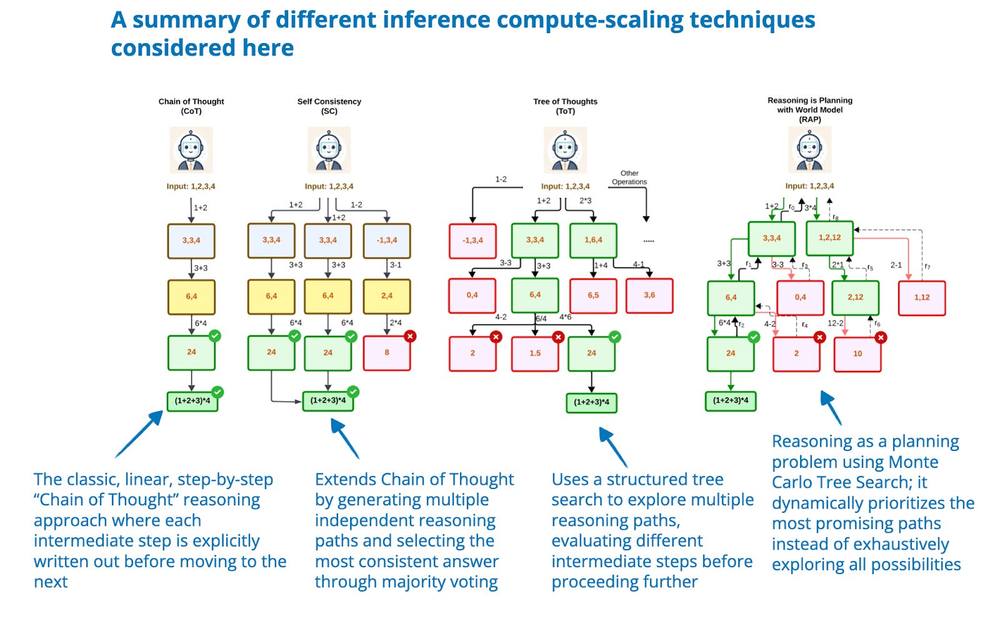
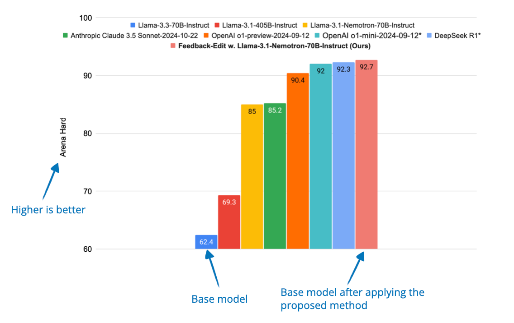

# Part 1: Inference-Time Compute Scaling Methods
在 2025 年，提高 LLM 的推理能力已成为最热门的话题之一，更强的推理能力使 LLM 能够处理更复杂的问题，从而在用户关心的各种任务上表现得更加出色。在过去几周，研究人员分享了大量新的策略来提升推理能力，包括 **推理时计算扩展**、**强化学习**、**监督微调** 和 **蒸馏**。Sebastian Raschka 博士的工作探讨了近年来针对推理优化的 LLM 研究进展，本篇博客重点关注自 DeepSeek R1 发布以来兴起的推理时计算扩展方法。

## 提升 LLM 推理能力的四种常见策略
作者给出了基于 LLM 的推理模型定义：能够通过生成中间步骤或者结构化“思维”过程解决多步骤问题的大语言模型。与只给出最终答案的简单问题解答不同，推理模型可以明显给出其思考过程，能够处理更为复杂的问题。

通常来说，有两种策略可以提升 LLM 的推理能力。一是提升训练时间；二是提升推理时间/算力 ( increasing inference compute, inference-time scaling or test-time scaling)。推理阶段是指模型在训练结束后，进行用户问题答案需要的资源（算力、时间等）。下图给出在数学问题解答方面，o1 的解答准确率可以通过提升其训练时间或者推理时间得到提升。[图片来源](https://openai.com/index/learning-to-reason-with-llms/)

为了更好地理解如何提升模型的推理能力，作者总结了四种常见的策略，如下图所示。具体介绍可见其这篇博客：[Understanding Reasoning LLMs](https://magazine.sebastianraschka.com/p/understanding-reasoning-llms)。

### 1.  Inference-time compute scaling

这类方法旨在在推理阶段提升模型的推理能力，无需重新训练或修改模型权重。其核心思想是以增加计算资源为代价换取更好的性能，从而使即使是固定的模型也能通过 **链式思维推理（Chain-of-Thought Reasoning）** 和各种 **采样策略** 等技术变得更加强大。

这种技术可以应用于任何 LLM。例如，OpenAI 利用强化学习开发了其 o1 模型，然后额外利用了推理时扩展技术。作者还提到，DeepSeek R1 论文明确将常见的推理时间时扩展方法（如基于过程奖励模型和基于蒙特卡洛树搜索的方法）归类为 "不成功的尝试"。这表明，DeepSeek 并没有明确使用这些技术，而只是让 R1 模型生成较长响应，这也是 V3 基本模型推理时扩展的一种隐含形式。不过，由于显式推理时扩展通常是在应用层而非 LLM 本身实现的，DeepSeek 承认他们可以轻松地将其纳入 R1 部署或应用中。

### 2. Pure reinforcement learning
这类方法专注于通过强化学习（RL）提升模型的推理能力。通常，训练过程依赖于可验证的奖励信号，例如数学或编程领域的反馈。虽然强化学习能够帮助模型发展更具策略性的思维和自我改进能力，但也伴随一些挑战，如奖励欺骗（reward hacking）、训练不稳定性（instability）以及高计算成本（high computational costs）。

### 3. Reinforcement learning and supervised fine-tuning
这种混合方法将强化学习（RL）与监督微调（SFT）结合，比单纯的 RL 更稳定、更具泛化性的方式提升模型能力。通常，模型先通过 SFT 在高质量指令数据上训练，然后再利用 RL 进行优化，以调整特定行为并提升推理能力。  

### 4. Supervised fine-tuning and model distillation
该方法通过在高质量标注数据集上进行指令微调（SFT）来提升模型的推理能力。如果这个高质量数据集是由更大的 LLM 生成的，那么这种方法在 LLM 领域通常被称为 **“知识蒸馏（Knowledge Distillation）”** 或简称 **“蒸馏（Distillation）”**。 不过，这与传统深度学习中的知识蒸馏略有不同。后者通常不仅使用教师模型的输出标签（labels），还使用其输出的 logits（即未归一化的概率分布）来训练一个较小的学生模型。

第 2）、3）、4）中的方法鼓励模型在输出中提供详细推理过程，这间接地导致推理阶段需要更大计算量，因为 LLM 生成每个 token 都需要计算资源，所以生成更多 token 会增加计算成本。在这篇博客中，作者主要介绍 inference-time compute scaling，关注可以直接控制生成 token 数量的技术，例如一些 additional sampling strategies，self-correction mechanisms等。作者重点关注了自 DeepSeek R1 发布以来的研究工作。DeepSeek 的推理模型研究路线如下图所示。

## Inference-time compute scaling methods
推理阶段扩展通过增加推理时的计算资源来提升 LLM 的推理能力。其核心理念可以用一个简单的类比来解释：人类在思考时间更充裕时，通常能给出更优质的回答，同样，LLM 也可以通过在生成过程中引导“更深入的思考”来提升推理能力。  

其中一种方法是**提示工程（Prompt Engineering）**，例如链式思维提示（Chain-of-Thought, CoT）。在 CoT 提示中，类似 “一步步思考”（think step by step）这样的短语可以引导模型生成中间推理步骤，从而提高在复杂问题上的准确性。但对于简单的问题，CoT 可能并不必要。 **需要注意的是，由于 CoT 提示会让模型生成更多的 token，这实际上会提高推理的计算成本**。

[An example of classic CoT prompting from the 2022 [Large Language Models are Zero-Shot Reasoners paper](https://arxiv.org/abs/2205.11916)]

另外一种方法是**投票和搜索策略**，例如多数投票（majority voting）或 beam search，这些方法通过筛选最佳输出来优化模型的回答质量。

[Different search-based methods rely on a process-reward-based model to select the best answer. Annotated figure from [Scaling LLM Test-Time Compute Optimally can be More Effective than Scaling Model Parameters
](https://arxiv.org/abs/2408.03314)]

在博客的剩余部分，作者重点介绍了最近在推理时间扩展中为提高 LLM 的推理能力而取得的研究进展。

### 1. [s1: Simple test-time scaling](https://arxiv.org/abs/2501.19393)
这篇工作引入了 "wait " tokens，可以被视为上述 "think step by step " 提示工程的更现代版本。工作包括两个关键部分：  

1. **创建一个精选的 SFT 训练集**，包含 1000 个带有推理轨迹（reasoning traces）的训练样本。  

2. **通过“budget forcing”来调节回答长度**，具体方式包括： 

   - 增加 "Wait" token，促使 LLM 生成更长的回答，自我验证并进行自我修正。  

   - 使用“思考结束”标记（Final Answer:）提前终止生成，确保回答在适当的时刻结束。  

“Budget forcing” 被视为一种**顺序推理扩展（sequential inference scaling）**技术，因为它仍然是通过生成逐个 token 得到输出内容。而相比之下，多数投票（majority voting）属于**并行推理扩展（parallel inference scaling）**，它通过整合多个独立的生成结果来优化答案。作者还发现，“Budget forcing”方法的效果优于其他推理扩展技术，例如多数投票。  

Sebastian Raschka 博士给出了这篇工作作者选择添加 "Wait" token 的猜测。他认为作者可能受 DeepSeek-R1 论文 中 “Aha moment” 现象的启发。在 DeepSeek-R1 研究中，LLM 生成了类似 “Wait, wait. Wait. That’s an aha moment I can flag here.” 的内容，表明强化学习本身可以诱导 LLM 形成推理行为。  

有趣的是，作者还尝试了其他 token，比如 "Hmm"，但最终发现 "Wait" 效果稍好。

### 2. [Test-Time Preference Optimization](https://arxiv.org/abs/2501.12895)
Test-time Preference Optimization (TPO) 是一个迭代过程，在推理阶段调整 LLM 输出以符合人类偏好，但不修改模型的底层权重。  

在每次迭代中，模型执行以下步骤：  

1. 生成多个回答：针对同一个提示词（prompt），生成多个不同的回答。  

2. 评分并筛选：使用奖励模型（reward model， RM）对回答进行评分，选出最高分（chosen）和最低分（rejected）的回答。  

3. 比较与评估：提示模型对“选中的回答”和“被拒绝的回答”进行对比和批判，分析优缺点。  

4. 优化输出：将这些批判性分析转化为**文本建议**，用于改进原始回答。  

通过不断重复执行步骤 1-4，模型能够逐步优化其回答，使其更符合人类的偏好。

### 3. [Thoughts Are All Over the Place](https://arxiv.org/abs/2501.18585)

作者发现了一种现象，称之为 “欠思考”（underthinking）。在 underthinking 情况下，o1 及类似 LLMs 在不同推理路径之间频繁切换，但未能充分探索潜在的正确路径，从而难以得出正确答案。这种行为导致推理深度不足，特别是在数学等高难度问题上的表现下降。作者在三个具有挑战性的测试集上进行了实验，并评估了两个代表性的开源 o1 类模型。结果表明，频繁切换思路与错误答案存在高度相关性。

为了解决 underthinking 问题，作者提出了一种方法，称为 **思维切换惩罚（Thought Switching Penalty, TIP）**。该方法通过调整“思维切换”相关 token 的 logits，抑制模型过早转换推理路径，从而鼓励更深入的推理探索。这一方法无需对模型进行微调（fine-tuning），并且在多个高难度测试集上实证提高了推理准确率。

### 4. [Trading Inference-Time Compute for Adversarial Robustness](https://arxiv.org/pdf/2501.18841)
作者对推理模型（OpenAI 的 o1-preview 和 o1-mini）在推理时增加计算量对其抗对抗攻击能力的影响进行了实验。实验发现，在多种攻击类型下，增加推理时的计算量通常会提高模型的鲁棒性。在许多情况下，随着测试时计算量的增加，攻击成功的样本比例趋近于零。然而，仍然存在一些重要的例外。例如，在涉及策略歧义或利用漏洞的情况下，推理能力提升所带来的鲁棒性增强是有限的。他们未对任务进行任何对抗性训练，而是通过允许模型在推理过程中消耗更多计算资源来提升推理能力，而不依赖于攻击的具体形式。结果表明，推理时计算量的增加有潜力提升大语言模型的对抗鲁棒性。此外，他们还探索了针对推理模型的新型攻击方式，如 "Think Less" 和 "Nerd Sniping" 攻击，可能会削弱推理能力提升所带来的鲁棒性增长。尽管这些研究结果表明扩展推理时计算量可以提升大语言模型的安全性，但仅靠这一方法并不能完全解决对抗鲁棒性问题。

### 5. [Chain-of-Associated-Thoughts](https://arxiv.org/pdf/2502.02390) 

随着 OpenAI-o1 的出现，“slow thinking” 技术受到了越来越多的关注，因为其推理过程更接近人类的思维方式。受到人类在思考过程中不断联想和补充知识能力的启发，作者提出了一种新颖的 **Chain-of-Associated-Thoughts, CoAT** 框架。该框架融合了蒙特卡洛树搜索（MCTS）算法与一种用于动态整合新关键信息的机制，称为“联想记忆”。通过将 MCTS 的结构化探索能力与联想记忆的自适应学习能力相结合，使 CoAT 不仅能够回溯并优化先前的推理结果，还能自适应地整合不断变化的信息，确保最终输出更加准确和全面。CoAT 显著扩展了 LLM 的搜索空间，使其能够探索多样化的推理路径，并在实时推理过程中动态更新知识库。  

### 6. [Step Back to Leap Forward](https://www.arxiv.org/pdf/2502.04404)

本文提出了一种自回溯（self-backtracking）机制，使 LLM 能够在训练和推理过程中学习何时以及在哪里进行回溯，从而提升推理能力。在训练过程中，模型学习识别并修正次优的推理路径，使用 **\<backtrack\>** 标记来指导回溯。而该方法的核心贡献在于推理时的树搜索机制，它利用模型学到的回溯能力来探索不同的解法。该探索过程**不依赖外部奖励模型**，不同于某些基于搜索的方法，而是完全依靠模型自身的回溯学习能力来优化推理路径。

### 7. [Scaling up Test-Time Compute with Latent Reasoning](https://arxiv.org/pdf/2502.05171)

作者提出一种新型的语言模型架构，该架构能够通过在潜在空间（latent space）中隐式推理来扩展测试时的计算能力。模型通过迭代一个循环块（recurrent block）来运行，从而在测试时可以展开到任意深度。这与主流的推理模型形成对比，后者通常通过生成更多的 token 来扩展计算能力。与基于 Chain-of-Thought（CoT）的方法不同，该方法无需专门的训练数据，可以在较小的上下文窗口内运行，并且能够捕捉难以用语言直接表示的推理类型。

然而，一个关键的缺点是缺乏明确的推理步骤，而这些步骤对人类的可解释性非常有用，也是 CoT 的一个主要优势。

### 8. [Can a 1B LLM Surpass a 405B LLM?](https://arxiv.org/pdf/2502.06703)
许多推理时计算扩展技术依赖于采样，这通常需要过程奖励模型（Process Reward Model, PRM）来选择最佳解。本论文系统性分析了推理时计算扩展如何与 PRM 和问题难度相互作用。研究人员提出了一种计算最优的扩展策略，该策略能够适应不同的 **PRM 选择、策略模型（policy model）和任务复杂度**。实验结果表明，在合适的推理时扩展方法下，一个 10 亿参数的模型可以超越 4050 亿参数的 Llama 3（未使用推理时扩展）。同样，研究还表明，一个70 亿参数的模型结合推理时计算扩展后，能够超越 DeepSeek-R1，同时保持更高的推理效率。  

### 9. [Learning to Reason from Feedback at Test-Time](https://arxiv.org/pdf/2502.15771)
本文探讨了一种在推理时让 LLM 从错误中学习的方法，而无需将失败的尝试存储在提示词中（这会增加计算成本）。传统的答案优化方法通常有两种：

- 顺序修正（Sequential Revision）：将之前的错误答案添加到上下文中，以此进行改进。

- 并行采样（Parallel Sampling）：不参考之前的尝试，直接生成多个新答案。

与这些方法不同，本研究提出了一种推理时更新模型权重的策略，使模型能够在推理过程中自适应调整，而无需依赖提示词存储错误答案。为此，作者引入了 OpTune——一个小型可训练优化器，它可以基于模型在上一次推理中的错误来更新权重。这使得模型能够记住自己犯过的错误，而无需在提示词中保留错误答案，从而提高推理效率并减少计算成本。

### 10. [Inference-Time Computations for LLM Reasoning and Planning](https://www.arxiv.org/abs/2502.12521)

本文对多种推理时计算扩展技术在推理和规划任务中的表现进行了基准测试，重点分析了这些技术在计算成本和性能之间的权衡。作者评估了多种技术——例如 Chain-of-Thought（CoT）、Tree-of-Thought（ToT） 和 Reasoning as Planning，并在包括 算术推理、逻辑推理、常识推理、算法推理 和 规划 等 11 种任务 上进行了评估。主要发现是，尽管推理时计算扩展可以提升推理能力，但没有任何单一技术能够在所有任务中始终优于其他方法。

### 11. [Inner Thinking Transformer](https://arxiv.org/abs/2502.13842)

Inner Thinking Transformer (ITT) 在推理过程中动态地分配更多的计算资源。与标准的基于 Transformer 的大语言模型（LLM）使用固定深度（即所有 token 使用相同数量的层）不同，ITT 采用了 Adaptive Token Routing，根据 token 的难度来分配更多计算资源。对于那些较为困难的 token，它们会在相同的层中多次传递，以进行额外的处理，从而增加这些困难 token 的推理计算预算。这种方法可以有效地将更多的计算资源集中到更复杂的推理任务上，提高推理性能和效率。

### 12. [Test Time Scaling for Code Generation](https://arxiv.org/abs/2502.14382)
推理时计算扩展可以通过以下几种方式实现：并行扩展（生成多个答案）、顺序扩展（迭代修正答案），或者两者结合。S* 是一种专门为代码生成 设计的推理时计算扩展方法，它同时提高了并行扩展（生成多个解决方案）和顺序扩展（迭代调试）的效果。通过这种方法，S* 能在代码生成过程中更有效地利用计算资源，提升生成质量和调试效率。

### 13. [Chain of Draft](https://arxiv.org/abs/2502.18600)
研究人员观察到，尽管推理型大语言模型（LLM）通常会生成冗长的逐步解释，但人类通常依赖于简洁的草稿，只捕捉关键信息。受到这一观察的启发，他们提出了 Chain of Draft (CoD)，一种提示策略，通过生成最小但信息量丰富的中间步骤来减少冗长性。因此，从某种意义上说，CoD 是一种 推理时计算扩展 方法，它通过生成更少的 tokens 来提高推理时计算的效率。

从结果来看，CoD（Chain of Draft）几乎与标准提示一样简洁，但其准确性与 Chain of Thought (CoT) 提示相当。 Sebastian Raschka 博士认为推理模型的一个优势是用户可以通过阅读推理过程来学习并更好地评估/信任回应。CoD 在某种程度上削弱了这一优势，因为它生成的中间步骤较少，使得推理过程不那么透明。然而，在那些不需要冗长中间步骤的场景中，CoD 可能非常有用，因为它在保持 CoT 准确性的同时，加速了生成过程。

### 14. [Better Feedback and Edit Models](https://arxiv.org/abs/2503.04378)

许多推理时计算扩展技术依赖于具有可验证答案的任务（例如数学和代码，这些可以进行验证），这使得它们难以应用于开放性任务，如写作和一般性问题解决。为了克服这一针对可验证答案的限制，研究人员开发了一个系统，其中一个模型生成初始回应，另一个模型提供反馈（“反馈模型”），第三个模型根据反馈对回应进行修正（“编辑模型”）。他们通过使用一个包含大量人工标注回应和反馈的数据集来训练这些专门的“反馈”和“编辑”模型。这些模型在推理时通过生成更好的反馈和更有效的编辑来帮助改进回应，从而提高回应的质量。

## The cost caveat
需要注意的是，推理时计算扩展会增加推理成本，因此是否选择使用小型模型并进行大量推理扩展，还是选择训练更大的模型并在较少或不进行推理扩展的情况下使用，这需要根据模型的使用频率来进行计算和权衡。例如，一个使用大量推理时计算扩展的 o1 模型，实际上仍然比一个可能更大的 GPT-4.5 模型（可能不使用推理时计算扩展）稍微便宜一些。

## Which technique?
然而，推理时计算扩展并不是万能钥匙。虽然像 蒙特卡洛树搜索（Monte Carlo Tree Search）、自回溯（self-backtracking） 和 动态深度扩展（dynamic-depth scaling） 等方法能够显著提高推理性能，但它们的效果仍然依赖于任务的性质和难度。正如早期的研究论文所指出的，**没有一种推理时计算扩展技术能够在所有任务中表现最佳**。

此外，这些方法中的许多在提高推理性能的同时，往往会牺牲响应延迟，而较慢的响应可能会让一些用户感到不满。

# Reference

[Sebastian Raschka's blog](https://magazine.sebastianraschka.com/p/state-of-llm-reasoning-and-inference-scaling)