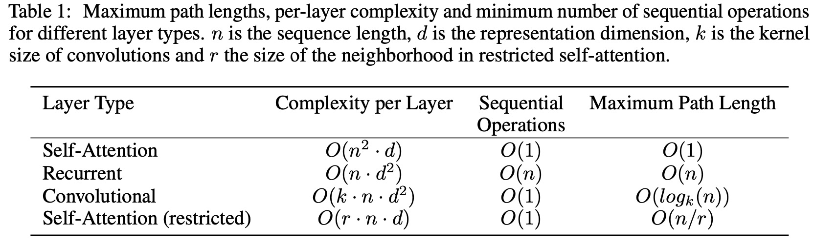
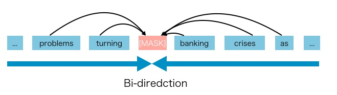
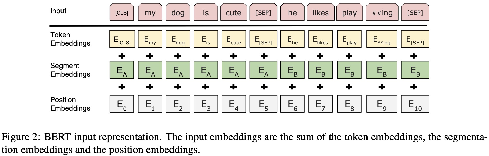
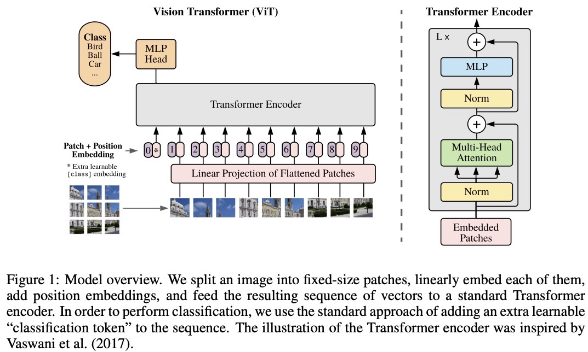
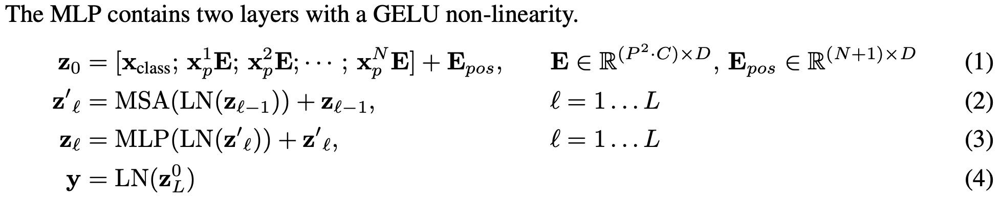
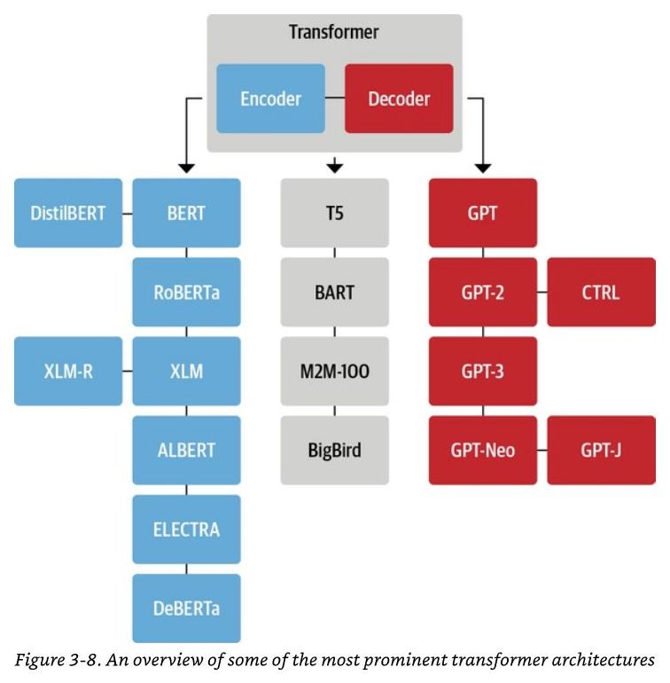

# Attention is all you need

## Comparison with RNN and CNN
RNN: 对于给定一个序列，从左向右进行计算。对于第$t$个词，会对应一个隐藏状态向量 $h_t$。该隐藏状态向量 $h_t$ 是由前一个词的隐藏状态向量 $h_{t-1}$ 和当前位置 $t$ 的输入词决定的。因此，历史信息可以通过隐藏状态 $h_{t-1}$ 传送到当下。

- 优点：可以处理时序信息。

- 缺点：（1）由于是序列计算，无法进行并行计算，计算性能较差。（2）如果时序很长，历史信息可以无法有效传输到后面。虽然可以设置较大的 $h_{t}$ 缓解该问题，但是存储 $h_t$ 会提升内存的需求。

CNN: 

- 优点：具有多个输出通道 (多个卷积核)，每个输出通道可以识别不同的模式。

- 缺点：对于较长的序列，卷积核只能观察到距离较近的像素点，否则需要进行多层卷积操作。

## Model Architecture

当前的时序模型主要是encoder-decoder的架构。对于一个序列表示 $(x_1, ..., x_n)$，encoder将该序列映射为一个连续表征 $\mathbf z = (\mathbf z_1,..., \mathbf z_n)$，其中 $\mathbf z_i \in R^d$, $d$ 为隐藏向量维度。对于encoder输出的 $\mathbf z$，decoder **依次** 生成输出序列 $(y_1, ..., y_m)$。

注意，对于encoder而言，可以看到整个输入句子。但是，对于decoder而言，无法观察到序列后面的词，因此词是按照自回归模式一个一个生成的，**过去时刻的输出也作为当前时刻的输入**。

### Encoder and Decoder Stacks

Encoder: 包含 $N=6$ 个layer，每个layer具有两个 sub-layers，其中第一个子层是一个 multi-head self-attention，第二个子层是一个position-wise fully connected feed-forward network (MLP)。对于每个子层，使用残差连接+layernorm，即Layernorm($x$ + sublayer($x$))。每层的输出维度统一为$d_{model}=512$。

Decoder: $N=6$个layers。每个layer具有三个sub-layers，并且每个子层都使用残差连接+layernorm。对于第一个子层的self-attention，由于不能获取之后的输入，因此使用masked MHA。

### Attention

Query: 需要查询的内容向量； 

Key: 可以认为是用于被查询的关键信息向量； 

Value: 通过将 query和 key进行匹配对比，可以获得不同value的权重，然后基于该权重对value进行加权获得输出向量。

Scaled dot-product attention:
$$
\begin{aligned}
\text{Attention}(Q,K,V) = \text{softmax}(\frac{QK^T}{\sqrt{d_k}}V),
\end{aligned}
$$
其中，query Q，key K 以及value V是等长的，都是 $d_k$. 

对于encoder，使用**self-attention**，query, key and value都是来自input embedding投影得到。

对于decoder, 使用**masked self-attention** 和 **cross-attention**。对于cross-attention，key和value来自encoder的输出，query是来自decoder的下一刻的输入得到。通过计算query和key的相似度，对value进行加权得到输出。

## **Position-wise** feed-forward networks
对于attention 外的sub-layers, 对于每一个position 的输入使用**同一个**MLP进行映射：
$$
\begin{aligned}
\text{FFN}(x) = \text{max}(0, xW_1 + b_1)W_2 + b_2.
\end{aligned}
$$
其中, $x$是一个 $512$ 的向量，inner-layer has dimensionality $d_{ff}=2048$，输出也是一个 $512$ 向量。

## 为什么需要除以$\sqrt{d_k}$
[ref1](https://mp.weixin.qq.com/s/h-24XRdJDDZDg65LTjXA0w)

1. 当维度 $d_k$ 比较大时，点积的大小会增大，元素的相对距离增大，进行softmax操作时，会推动softmax函数往仅有很小的梯度的方向靠拢，导致softmax 函数容易导致梯度消失问题。
2. 假设Q和K的均值为0，方差为1。它们的矩阵乘积将有均值为0，方差为$d_k$。因此，$d_k$ 的平方根被用于缩放（而非其他数值），因为，Q和K的矩阵乘积的均值本应该为0，方差本应该为1，这样会获得一个更平缓的softmax。
3. 也可以使用其他缩放方式，只要能做到每层参数的梯度保持在训练敏感的范围内，不要太大，不要太小。那么这个网络就比较好训练。

## Mask self-attention
为了不看到 $t$ 时刻之后的内容，对于点积矩阵的上半部分添加一个较小的数字，比如 $-1e10$，这样经过softmax函数后对应位置会变成零。

## MHA

对原始的Q, K, V，先通过一个linear layer映射到低维向量，然后进行scaled dot-product attention操作，得到h个输出向量，再将h个输出向量进行拼接，最后再通过一个linear layer回到$d_{model}$维度。

直接进行dot-product时，没有什么需要学习的参数。而使用MHA时，linear layer的投影参数 $W^Q, W^K, W^V$ 是需要学习的，因此可以学习到不同的模式信息。

计算公式：
$$
\begin{aligned}
\text{MultiHead}(Q,K,V) &= \text{concat}(\text{head}_{1}, \text{head}_{2},...,\text{head}_{h})W^O,\\
\text{head}_{i} &= \text{Attention}(QW_i^Q, KW^K_i, VW^V_i),
\end{aligned}
$$
其中, $W_i^Q \in \mathbb{R}^{d_{model} \times d_k}$, $W_i^K \in \mathbb{R}^{d_{model} \times d_k}$, $W_i^V \in \mathbb{R}^{d_{model} \times d_v}$, $W_i^O \in \mathbb{R}^{hd_v \times d_{model}}$. In this paper, they set  $h=8$, $d_k = d_v = d_{model}/h$.

## KV Cache 原理, MHA, MQA, GQA
[ref1](https://mp.weixin.qq.com/s/mKdliGu4WhUx4PHatBpewA)

[ref2](https://www.linsight.cn/3dc22f96.html)

## Positional Encoding
对于rnn而言，当前时刻的输入包含了上一时刻的输出，依次传递序列信息。而attention是考虑所有词之间的关联性，权重与序列信息无关，并没有将序列/位置信息考虑进去。如果将句子的词打乱，语义可能有所不同，但是attention 无法捕捉这种情况。在transformer中，通过将position进行encoding记录时序信息，然后和词的embedding相加作为输入。

<!-- $$
\begin{aligned}
PE(pos, 2i) &= sin(pos/10000^{2i/d_{model}}) \\
PE(pos, 2i+1) &= cos(pos/10000^{2i/d_{model}}) \\
\end{aligned}
$$ -->

pos is the index of the word in the sentence. (0-30)
$2i$ and $2i+1$ is the index of the column, d_model is the number of columns, it is a hyper-parameter(120). For each word(token), we encode it to a vector with dimension d_model according to its position.

Here we use denominator $10000^{2i/d_{model}}$ to make sure the positional encoding is different for different tokens. The sin and cos are periodic functions, if we don't use the denominator, then the positional encoding could be same for different tokens.

- If there are two different sentences with the same size, will the positional encodings be the same??  yes.

## Complexity

# BERT: Bidirectional Encoder Representations from Transformers

- GPT: 单向，使用过去的信息预测未来。
- ELMo: 基于rnn的架构，双向rnn, 在用到一些下游任务时，需要对架构进行调整。
- BERT: 相较于gpt, 可以使用左右侧信息，进行双向预测。相较于ELMo, 基于transformer架构，结构简单，只需要修改最上层。

Bert 结合了ELMo的双向性和gpt的transformer架构，将预测未来变成**完形填空**。

## Framework

Bert主要包括两部分，pre-training and fine-tuning。在pre-training阶段，模型在一个没有进行标注的数据上进行训练，是一个 self-supervised pre-training task。在fine-tuning阶段，用同一个Bert模型，但是模型首先被初始化为预训练的权重，然后再在有标注的数据上进行微调。每一个下游任务都会创建一个不同的模型进行微调。

Model architecture: a multi-layer bidirectional transformer encoder. 

**主要包括三个参数**

1. number of layers/ transformer blocks, i.e., $L$. 

2. hidden dimension, i.e., $H$ ($d_{model}$). 

3. the number of attention heads, i.e., $A$.

两个模型：
1. Bert $_{base}$: $L=12, H=768, A=12$, total parameters is $110M$.

2. Bert $_{large}$: $L=24, H=1024, A=16$, total parameters is $340M$.

**如何根据超参数设置计算所需要训练的参数量？**

对于transformer架构，输入是字典（句子）的大小，这里假设为$30k$。通过嵌入层得到输出，输出维度为 $H$ ($d_{model}$)。输出的embedding会喂给 transformer blocks，transformer block中包括两部分，分别是self-attention 和 mlp。 对于self-attention，dot-production 没有学习参数，但是对于 MHA，会对 Q, K, V分别通过一个 linear layer 映射到低维向量，然后进行 scaled dot-product attention 操作，得到 $A$ 个输出向量，再将 $A$ 个输出向量进行拼接，最后再通过一个 linear layer 回到 $H$ ($d_{model}$) 维度。在 MHA 中，头的个数乘以低维投影的维度 = $H$ ($d_{model}$)，因此低维投影部分的参数量为 $3 \times H \times H$。这里乘以 $3$ 的原因是 Q, K, V分别通过一个 linear layer 进行投影操作。同样，对于得到的低维投影向量进行拼接后还会进行一次投影，可学习参数量是 $H \times H$。因此，一个 self-attention 层的可学习参数量为 $ 4 \times H \times H = 4 H^2$ （观察上文中的MHA结构图，可以发现有 4 个linear模块）。接下来是 mlp, mlp 具有两个全连接层，第一个全连接层的输入输出是 $H \times 4H$，第二个全连接层的输入输出是 $4H \times H$，总共为 $8H^2$。因此，一个transformer block的可学习参数总共为 $12 H^2$。

假设模型有 $L$个blocks，那么该模型的可学习参数总量为 $30k \times H + L \times H^2 \times 12$。

对于Bert $_{base}$，$L=12, H=768, A=12$，根据公式计算得到：$30k \times 768 + 12 \times 768^2 \times 12 = 108,514,656 \approx 110M $。

**输入输出**

对于transformer而言，输入是一个序列对，编码器和解码器会分别输入一个序列。Bert只有一个编码器，输入是一个序列，可以是一段连续的文字，未必是真正语义上的句子，也可以包含两个句子。

论文使用 **WordPiece** embeddings。通常来讲，如果根据空格对句子进行划分，每个词为一个token，那么词字典会非常大，输入的嵌入层的token很多，增加可学习参数。WordPiece根据词出现的频率进行划分，如果一个词出现的频率不大，那么将该词切开，看它的一个子序列。如果它的某一个子序列出现的概率较大，那么只保留这个子序列。这种方式可以将一个较长的句子切分成出现频率较高的几个子序列，类似于词根，从而减少词典大小。

对于一个序列，序列的第一个词token永远是一个特殊的记号 [CLS]，表示 classification。这个词的作用是用来表示整个序列层面的信息。虽然该token被放在序列的开头，但是由于Bert使用的是transformer的编码器，依旧可以注意到整个序列中的词，所以可以放在第一个位置。

由于两个句子被连接到一起作为一个序列进行输入，有两种方式来区分不同的句子。一种是在句子后面添加一个特殊的标记token [SEP]。其次，添加一个可学习的嵌入层来表示每个token所属于的句子id。具体来说，如下图所示，对于一个输入的序列，共有三个嵌入层。首先第一个嵌入层token embedding 是对每个词元输出一个向量；第二个是 segment embedding层，该层的输入是 2，表示该词元属于哪个句子。第三个是 ***可学习的*** position embedding层，输入的是每个词元在该序列里的位置信息，从 0 开始。最终得到的输出是词元本身的嵌入+所属句子的嵌入+位置嵌入。

## Pre-training BERT
We do not use traditional left-to-right or right-to-left language models to pre-train BERT. Instead, we pre-train BERT using two unsupervised tasks, described in this section.

### Task #1: Masked LM
如果一个词元是由WordPiece生成，那么该词元有$15\%$的概率被随机替换为掩码 [Mask]。对于特殊词元，比如第一个词元[CLS]和中间分割词元[SEP]，就不进行替换。但是这种操作会带来一个问题，在训练的时候会有序列中的词元被替换为特殊token [Mask]，但是在 fine-tune 的时候，输入的序列不会包含 [Mask] 这种 token，从而导致两个输入数据的分布不一致。

为了减少这种情况，预训练时并不总是用实际的 [MASK] 标记来替换被掩码的词。训练数据生成器会随机选择 $15\%$ 的词元位置进行预测。如果第 $i$ 个标记被选中，那么该词元 (1) 有 $80\%$ 的概率被替换为 [MASK]；（2）$10\%$ 的概率替换为字典中的随机词元；（3）$10\%$ 的概率保持不变。模型会预测这 $15\%$ 的词元，而不是构建整个输入序列。用 $T_i$ 表示预测原始标记的$15\%$词元的交叉熵损失。

### Task #2: Next Sentence Prediction (NSP)
许多重要的下游任务，如问题解答（QA）和自然语言推断（NLI），都是基于对两个句子之间关系的理解。为了训练一个能理解句子关系的模型，本文预先训练了一个binarized next sentence prediction task。该任务可以从任何语料库中生成。具体来说，每个预训练的序列包含两个句子 A 和 B，$50\%$ 的情况下, B 是 A 后面的实际下一句（标记为 IsNext），$50\%$ 的情况下，B 是语料库中的随机句子（标记为 NotNext）。如下图所示。

其中，‘flight ##less’ 是一个词，但是该词出现的概率较低，所以WordPiece中被划分为两个词， '##'表示与前面词相连。
如图 1 所示，特殊标记[CLS]对应的输出向量 $C$ 用来进行下一个句子预测。

## Fine-tuning BERT

输入：对于每项任务，只需将任务的输入输出转换为Bert要求格式的输入，然后end-to-end微调所有参数即可。预训练阶段的句子 A 和句子 B 类似于：(1) 解析中的句子对；(2) 推断中的假设-前提对；(3) 问题解答中的问题-答案对；(4) 当进行文本分类时，句子+$\emptyset$。

输出：对于token-level tasks，比如问题解答。将每个词元的embedding fed into 一个输出层；对于分类任务，[CLS] 表示被fed into 一个输出层。然后end-to-end进行调参。

## Transformer 位置编码的几种方式 
[苏剑林：让研究人员绞尽脑汁的Transformer位置编码](https://www.kexue.fm/archives/8130)

# ViT (ICLR 2021)
paper: AN IMAGE IS WORTH 16X16 WORDS: TRANSFORMERS FOR IMAGE RECOGNITION AT SCALE

## Introduction

Transformer在cv中应用的难点：Transformer中一个self-attention的计算复杂度为$O(n^2)$。对于2d图像，如果简单地将图像拉成一维序列，每个像素点作为一个词元。对于一个$256 \times 256$的图像，那么self-attention的计算复杂度将会是 $(224 \times 224)^2 = 50176^2$。对于较大的图像，序列长度很长，计算复杂度很高。

在中小型数据集上，ViT的效果较弱，弱于ResNets。主要原因是Transformer不具备归纳偏置 (inductive bias) 能力。卷积神经网络具有归纳偏置能力，该能力类似于一种先验知识/假设。比如对于卷积神经网络来说，具有两个 inductive bias:

1. locality。卷积神经网络假设相邻区域具有相邻特征，因此通过滑动窗口进行学习。

2. translation equivariance，平移等价性。$f(g(x)) = g(f(x))$。在卷积神经网络中，无论是对图片中物体先进行平移再卷积，还是先卷积再平移，只要是对于同一个不变的输入，结果不变。卷积神经网络具备这两个归纳偏置能力，等同于拥有很多先验信息，可以在中小型数据集上表现不错。

通过在大数据集上进行预训练，作者发现，即使 transformer不具备归纳偏置能力，依旧具有很好的表现，且可以扩展到下游任务中。

以往的工作要么是将卷积神经网络和自注意力结合，要么直接用自注意力取代卷积神经网络。但是没有工作直接只用transformer到图像领域。因此，本文直接使用标准的transformer结构，只是对图片进行预处理，划分成块。

## Model Architecture

如 Figure 1所示，首先将原始图片划分为 $3 \times 3 = 9$ 个patch (token)，然后按照顺序组成一个序列，通过一个 linear layer得到patch embedding。为了表示每个 patch 在原始图片中的位置信息，类似于transformer，添加了一个 position embedding。然后通过一个标准的transformer encoder 得到输出。对于分类任务，仿照 BERT，在序列的开头添加一个特殊标记[CLS]， **位置为 0**。因为使用的 transformer 架构，该 token 可以注意到序列中其他 patch 的信息，所以可以根据该 token 的输出进行判断得到有效信息。

具体来说，对于大小为 $224 \times 224 \times 3$ 的图片，将其划分为 $16 \times 16 $ 大小的 patch，那么可以得到 $224^2/16^2 = 196$ 个 patch，每个 patch 的大小为 $16 \times 16 \times 3 = 768$。$196$ 个维度为 $768$ 的 token 通过 linear projection 得到 $196$ 个 patch embeddings。再加上特殊字符 [CLS] 对应的embedding，共有 $197$ 个 embeddings。通过将 patch embeddings 和 position embeddings 相加，得到的 transformer encoder 输入大小为 $197 \times 768$。

对于 transformer block，假设有 $12$ 个 head。通过将输入进行投影得到的 $Q$, $K$, $V$ 的大小为 $197 \times 64$ ($768/12 = 64$)。最后将 $12$ 个头的输出向量进行拼接得到 $197 \times 768$。过一层 layernorm 后将输出 fed into MLP layer。在 MLP 这层，会将维度放大 $4$ 倍，然后缩小投射回去。即 $197 \times 3012$ --> $197 \times 768$。

具体计算公式如下：

***How can I use ViT with a different resolution ?***

当输入更高分辨率的图像时 (e.g., $512 \times 512$)，论文会保持 patch size 不变，这将导致分割后得到的序列长度增加。尽管理论上 ViT 可以处理任意长度的序列，但是，位置编码会不同，预训练时的位置编码就没有用。针对这种情况，作者对预训练好的位置编码进行 2D 插值来扩充序列。

[github ref](https://github.com/huggingface/transformers/issues/12167)

***为什么不直接对 transformer 的 $n$ 个输出embeddings 进行 global average pooling，然后基于得到的特征进行分类预测？***

作者通过实验表示， global average pooling 方式和加 class token [CLS] 两种方式都可以。

## Position Embedding
在本文中，作者对比了四种对2D图像使用 position embedding 进行编码的方式：

1. 不提供位置信息；

2. 一维positional embedding：将输入的patch 按照栅格顺序 （从左到右按行读取） 进行编码。

3. 二维positional embedding：将输入视为二维的 patch 网格。在这种情况下，需要学习两组嵌入，每组嵌入的大小为 D/2 ($D = d_{model}$)，分别针对 X 轴和 Y 轴。然后，根据输入路径上的坐标，我们将 X 嵌入和 Y 嵌入拼接起来，得到该 patch 的最终位置嵌入 $D$ 维。

4. Relative positional embeddings：详见 [苏剑林：让研究人员绞尽脑汁的Transformer位置编码](https://www.kexue.fm/archives/8130)。

## 模型参数量以及显存间的计算

[现在 LLM 的大小为什都设计成 6/7B、13B 和 130B 几个档次？](https://mp.weixin.qq.com/s/OfgEoh5UXSqNBTMuTSC12w)

[如何根据模型参数量估计大模型微调和推理所需显存?](https://mp.weixin.qq.com/s/bhPo3FO_3AFQpgff-wmDoQ)

# MAE
[Masked Autoencoders Are Scalable Vision Learners](https://arxiv.org/pdf/2111.06377)

随机遮住大量的 patches， 然后在 pixel space 重构这些缺失的 patches，得到原始完整的图片。使用一个非对称的编码器和解码器的架构，非对称的原因是指：编码器只看到未被遮挡的 patches，这样会提高计算效率，降低内存需要。

**Masking:** 将图像划分为一个个不重叠的 patches，然后进行随机均匀采样少量 patches，并屏蔽（即去除）剩余的部分。

**Encoder:** Our encoder is a ViT but applied only on visible, unmasked patches. Just as in a standard ViT, our encoder embeds patches by a linear projection with added positional embeddings, and then processes the resulting set via a series of Transformer blocks. However, our encoder only operates on a small subset (e.g., 25%) of the full set. Masked patches are removed; no mask tokens are used. This allows us to train very large encoders with only a frac- tion of compute and memory

**Decoder:** The input to the MAE decoder is the full set of tokens consisting of (i) encoded visible patches, and (ii) mask tokens. See Figure 1. Each mask token is a shared, learned vector that indicates the presence of a missing patch to be predicted (每一个被盖住的块都被表示为同一个可学习的向量). We add **positional embeddings** to all tokens in this full set; without this, mask tokens would have no information about their location in the image. The decoder has another series of Transformer blocks. The MAE decoder is only used during pre-training to perform the image reconstruction task (only the encoder is used to produce image representations for recognition)

# Swin Transformer
[Swin Transformer: Hierarchical Vision Transformer using Shifted Windows](https://arxiv.org/pdf/2103.14030)

ViT 始终都是在全图上计算自注意力，计算复杂度是图片大小（像素数量）的平方级。Swin transformer 则是在小窗口内计算自注意力，只要窗口大小固定，自注意力的计算复杂度固定。Swin Transformer 的复杂度始终与图像的像素数量（而非图像的边长）成线性关系。

具体来说，假设图片大小为 $N \times N$，共有 $L = N^2$ 个像素。标准的 transformer 的计算复杂度为 $(N^2)^2 = L^2 = O(L^2)$。假设 swin transformer 的每个窗口固定大小为 $M \times M$，单个窗口的计算复杂度为 $(M^2)^2$。共有 $(N/M)^2$ 个窗口，那么总计算复杂度为 $(N/M)^2 * (M^2)^2 = N^2 M^2 = L \times M^2 = O(L)$。因此，swin transformer 可以将复杂度降低到 linear computation complexity （相较于图片像素数量）。

# Encoder vs. Decoder vs. Encoder-Decoder？

[模型总结](https://discuss.huggingface.co/t/suggestions-and-guidance-finetuning-bert-models-for-next-word-prediction/14043)

## 编码器模型 
基于编码器的模型专注于理解输入文本。它们通过在包含重建损坏输入任务的预训练（如掩码部门tokens）中，捕获丰富的上下文信息。**BERT**（双向编码器表示的变换器）是编码器模型的一个重要例子。在 BERT 中，部分输入标记会被特殊的 [MASK] 标记替代，模型通过周围的上下文预测这些被掩蔽的标记。这使得 BERT 能够学习双向表示，从而捕捉标记左侧和右侧的上下文。编码器模型在自然语言理解（NLU）任务中尤其有效，例如文本分类、情感分析和抽取式问答。这些任务受益于模型深刻理解和表示输入文本的能力。

BERT 可以利用双向语境进行预测 masked tokens，相较于自回归模型，使用双向信息可以提高性能。然而，BERT 在预训练时使用的 [MASK] 等人工符号在微调时并不存在于真实数据中，这就造成了预训练数据与微调数据分布之间的异质性。此外，由于预测的tokens在输入中被mask，BERT 无法像自回归那样使用乘积规则建立联合概率模型。换句话说，**BERT assumes the predicted tokens are independent of each other given the unmasked tokens, which is oversimplified as high-order, long-range dependency is prevalent in natural language. （在给定其他未被掩码的tokens时，BERT 对每个被掩盖的单词独立地进行预测，所有需要预测的token之间被假设是相互独立的）**

BERT（及其所有变体，如 RoBERTa、DistilBERT、ALBERT 等）和 XLM 就是编码器模型的例子。

**优点：**

1. **上下文依赖性：** 在BERT等Encoder模型中，模型可以同时获取左右两侧的上下文信息（双向上下文）。相比之下，像GPT这样的自回归模型只能访问当前位置之前的内容（单向上下文）。双向上下文对于理解文本中的复杂依赖关系和语义结构至关重要，因此Encoder模型在许多自然语言处理任务上表现优异。
2. **丰富的上下文理解：** Encoder模型擅长捕捉输入数据中的复杂模式和关系，尤其适合需要深入理解和分析的任务，比如命名实体识别、文本分类、阅读理解等。这使得模型能够更好地理解句子的语义和结构，从而在相关任务中表现出色。

**缺点：**

1. **输入噪声：**  BERT在预训练阶段使用了人工符号（如[MASK]）来掩盖部分输入单词，但这些符号在实际应用和微调时并不存在。这种差异导致了预训练和微调之间数据分布的异质性，影响模型的迁移能力。
2. **独立性假设：** BERT在预测被掩盖的单词时，假设每个掩盖的单词是独立于其他掩盖词的，只与未被掩盖的单词相关。例如，在句子“it shows that the housing crisis was turned into a banking crisis”中，如果掩盖了“banking”和“crisis”两个词，模型会分别预测它们，而不考虑二者之间的隐含关系。这种独立性假设限制了模型对掩盖词之间复杂依赖关系的捕捉，影响了在需要更精细理解的任务中的表现。

## 解码器模型 
基于解码器的模型（自回归模型）旨在执行文本生成任务。这些模型一次生成一个token，并使用之前生成的token作为上下文来预测下一个token。**GPT**（生成式预训练变换器）、GPT-2 和 GPT-3 是解码器模型的典型例子。这些模型在大规模语料库上进行预训练，以预测句子中的下一个词，从而能够生成连贯且语境相关的文本。解码器模型在自然语言生成（NLG）任务中表现出色，例如语言翻译、文本摘要和对话生成。它们生成流利且上下文适当的文本的能力使其成为从头生成内容任务的理想选择。

自回归语言模型利用上下文中的词来预测下一个词，通过估计文本语料库的概率分布来实现。具体来说，给定一个文本序列 $ x = (x_1, \ldots, x_T) $，自回归语言建模将似然分解为前向积：
$$
p(x) = \prod_{t=1}^{T} p(x_t | x_{<t})
$$

或者反向的形式：
$$
p(x) = \prod_{t=1}^{T} p(x_t | x_{>t})
$$

通常使用**多项式分布**（Multinomial Distribution）来建模下一个词的生成过程。这是因为语言模型的目标是根据先前的词预测当前词的概率，而语言中词汇的生成通常是一个离散事件。因此，给定上下文 $x_{<t} $，下一个词 $ x_t $ 的条件概率可以表示为：
$$
p(x_t \mid x_{<t}) = \text{softmax}(z_t),
$$
其中，$ z_t $ 是通过神经网络计算得到的未归一化的得分，通常代表每个词在词汇表中的相对可能性。通过使用 softmax 函数，这些得分被转换为一个有效的概率分布，保证所有可能词的概率和为 1。

在这种情况下，模型会学习每个条件分布的参数模型（例如神经网络）。由于自回归语言模型只训练编码单向上下文（要么是前向的，要么是后向的），因此它在建模深层双向上下文方面并不有效。下面的图示展示了前向和后向的方向性。

**优点：**

1. **生成能力强**：自回归语言模型非常适合生成式自然语言处理（NLP）任务。由于它们采用因果注意力机制来预测下一个标记，因此在内容生成方面自然适用。它们能够生成流畅且与上下文相关的文本，这使得它们在需要自然语言生成的任务中表现出色。
2. **训练数据生成简单**：训练这些模型的数据生成相对简单，因为目标只是预测给定序列中的下一个标记。这利用了语言数据的固有结构，使得数据准备过程更加高效。

**缺点：**

1. **上下文限制**：自回归语言模型只能使用前向上下文或后向上下文，这意味着它们不能同时利用双向上下文。这种限制可能会影响它们在需要深刻理解双向上下文的任务中的表现。例如，在处理复杂句子结构或含义依赖时，缺乏双向上下文可能导致理解不够准确。

### 编码器-解码器模型  
编码器-解码器模型（也称为seq2seq 模型）结合了编码器和解码器架构的优势。这些模型使用编码器处理和理解输入序列，使用解码器生成输出序列。这种架构在输入和输出都是序列的任务中特别有效，这些序列可能具有不同的长度或格式，甚至是不同的语言。 编码器将输入序列转换为固定长度的上下文向量或中间表示，捕捉输入的含义和上下文。解码器然后接收这个上下文向量，逐个标记地生成输出序列，通常采用类似于解码器模型中的自回归技术。  

- **T5 (Text-To-Text Transfer Transformer)**（文本到文本的迁移变换器）是编码器-解码器模型的一个显著例子。T5 将每个自然语言处理问题都视为一个文本到文本的问题，其中输入和输出都是文本序列。这种方法使 T5 能够应用于广泛的任务，包括翻译、摘要和问答。  
- **BART (Bidirectional and Auto-Regressive Transformers)**（双向自回归变换器）是另一个强大的编码器-解码器模型。BART 通过使用任意噪声函数破坏文本并学习重建原始文本进行预训练。这使得它在需要基于对输入的理解生成文本的任务（如摘要和对话生成）中非常有效。  
- **BigBird** 使用稀疏注意力机制来处理较长的序列。这使得它适合处理长文档的任务，如文档分类和长篇问答。

**优点：**

编码器-解码器模型能够同时处理输入的理解和输出的生成，使它们在以下任务中特别有效：

- 机器翻译：将一种语言翻译成另一种语言。

- 文本摘要：生成文本的简要概述。

- 对话生成：在对话系统中生成合适的回应。

**缺点：**

1. **计算资源需求高**：编码器-解码器模型通常参数量庞大，尤其是在处理复杂任务时。它们需要大量的计算资源和内存，训练和推理速度可能较慢。

2. **长序列处理能力有限**：虽然一些模型（如BigBird）专门针对长序列进行了优化，但传统的编码器-解码器模型在处理非常长的输入时仍然面临挑战，因为它们的输入长度受限。

3. **依赖于大量标注数据**：这些模型通常需要大量的高质量标注数据进行训练，这在某些领域可能难以获得。此外，训练过程中数据的多样性和质量直接影响模型的性能。

4. **对输入输出长度不匹配的敏感性**：编码器-解码器模型在处理输入和输出长度差异较大的任务时，可能会表现不佳。例如，当输入很长而输出很短时，模型可能难以有效地提取和生成信息。

## 总结
- 编码器模型在需要理解和解释文本的任务中表现出色。由于其能够捕捉双向上下文，这使得它们适用于理解整个句子或文档上下文至关重要的任务。例如，命名实体识别、情感分析和文本分类等任务都依赖于模型对输入文本的深刻理解。
- 解码器模型则非常擅长生成文本，因此非常适合创意任务，如故事生成、聊天机器人回复和文本补全等。它们通过利用先前生成的内容作为上下文来预测下一个词，从而能够生成流畅且与上下文相关的文本。
- 编码器-解码器模型提供了一种灵活的架构，可以处理广泛的任务，从机器翻译、文本摘要到复杂的问题回答和文档生成。这种模型能够同时理解和生成文本，使其在需要深刻理解和流利文本生成的任务中非常有效。

例如，在机器翻译中，编码器处理源语言的输入句子，生成一个上下文向量，而解码器则利用这个上下文向量生成目标语言的翻译。类似地，在文本摘要中，编码器阅读并理解原始文本，而解码器则生成一个简洁的摘要。这种架构的优势在于它能够结合理解和生成的能力，适用于多种自然语言处理任务。

# 目标检测的常用评估指标
## Intersection Over Union (IoU)

Image credits to [source.](https://jonathan-hui.medium.com/map-mean-average-precision-for-object-detection-45c121a31173)

IoU 越高，拟合效果越好。IoU 对任何大小和形状的物体都很有效。这一针对每个物体的指标与精确度和召回率共同构成了完整的物体检测指标--平均精确度 (mAP) 的基础。

### Average Precision (AP)
目标检测器会生成多个预测结果：每张图片可能包含多个被预测的目标，而需要进行推理的图片也很多。每个预测目标都会被赋予一个置信度，表示检测器对该预测的信心程度。我们可以选择不同的**置信度阈值**，以决定接受哪些预测结果。例如，若将阈值设置为 0.7，那么只接受置信度大于 0.7 的预测，低置信度的预测将被舍弃。由于可以选择的阈值很多，使用精确率-召回率曲线进行评估。

模型越好，其的精确度和召回率就越高：这会将曲线的边界推向顶部和右侧。可以用曲线下的面积来概括模型的性能。这样就得到了一个介于 0 和 1 之间的数值，数值越大越好。这个指标通常称为平均精度 (AP)。

### Mean Average Precision (mAP)
mAP 用来衡量模型的整体检测性能。它结合了精确率（precision）和召回率（recall），并对不同类别和不同阈值下的检测结果进行综合评价。这里的类别指的是目标检测任务中模型需要识别的不同目标种类或类型。例如，在物体检测任务中，每个目标物体都属于某个特定类别（如“人”、“车”、“猫”、“狗”等），这些类别就是检测任务中模型需要识别和区分的对象。

#### 计算过程

首先，我们只考虑单张图片和单个类别。假设网络在一张图片中预测了 10 个属于某一类别的目标：每个预测包含一个bounding boxes、预测的类别以及预测的置信度（即网络对其预测的信心）。

1. 使用IoU来决定每个预测是否正确。对于每个真实目标和相应的预测，如果同时满足：（1）预测的类别与真实类别匹配；（2）IoU 大于某个阈值。那么认为该预测是正确的（True Positive）。否则，该预测被认为是错误的（False Positive）。

2. 将所有的预测按置信度从高到低排序。在表格中，按置信度从高到低排列预测结果，右侧显示累积的精确率和召回率。

   

3. 根据这张表格，对于每个置信度（从最大到最小），计算出截至该点的精确度和召回率。将其绘制成图，然后得到该图像和类别的原始精确度-召回率曲线：
   

4. 将该曲线锯齿平滑化，从而绘制出网络针对该图像和类别的最终精确度-召回曲线。根据平滑后的精确度-召回率曲线计算平均精确度（曲线下的面积）：
   
 (Images credits to [source](https://cs230.stanford.edu/section/8/))

5. 对每张图像和每个类别的 AP 进行平均，从而得出模型在整个数据集的平均精度 mAP.

# 文本生成模型的常用评估指标
## 困惑度 Perplexity
Perplexity 衡量语言模型生成文本流畅性和质量的一个常见指标，反映模型对词序预测的准确性。它本质上是模型对给定文本的“不确定性”的度量。困惑度得分越低，说明语言模型在计算给定序列中可能出现的下一个单词时越自信，而困惑度得分越高，说明模型对词的预测较为不确定，生成的文本可能不流畅，或者不符合语言结构。

熵是随关于机变量的不可预测性或随机性的度量。对于一个离散随机变量 $x$，概率分布为 $p(x)$，其熵定义为
$$
H(x) = -\sum_x p(x) \log_2 p(x).
$$
基于此，困惑度定义为一个序列的负对数似然的指数平均。具体来说，假设模型为一段文本 $ (w_1, w_2, ..., w_N)$ 生成概率，困惑度定义为：
$$
\begin{aligned}
\text{Perplexity} &= 2^{-\frac{1}{N} \sum_{i=1}^{N} \log_2 P( w_1, w_2, ..., w_{i-1}, w_i)} \\
&= P(w_1, w_2, ..., w_{i-1}, w_i)^{-\frac{1}{N}} = \prod_{i=1}^{N} P(w_i | w_1, w_2, ..., w_{i-1})^{-\frac{1}{N}}.
\end{aligned}
$$
其中，$ P(w_i | w_1, w_2, ..., w_{i-1}) $ 是模型在前面 $i-1$ 个词的条件下预测第 $ i $ 个词的概率。

## 突发性 Burstiness
突发性意味着如果一个词在文档中使用了一次，那么它很可能会再次出现。这种现象称为突发性，它表明第二次及之后出现的词的重要性低于第一次出现的词。值得注意的是，词语的突发性与其语义内容呈正相关性：信息量更大的词也往往更加突发。突发性基本上衡量了一段内容的可预测性，体现在句子长度和结构的均一性上。

通过收集句子长度，将文本中的每个句子按照其包含的单词数计算长度。计算均值（句子长度的平均值）和方差（句子长度的波动程度）。突发性 **b** 的数学计算公式为：  
$$
b = \left( \frac{\sigma_{\tau}}{m_{\tau}} - 1 \right) \left( \frac{\sigma_{\tau}}{m_{\tau}} + 1 \right)^{-1}
$$
其中，**b** 的取值范围在 $[-1, 1]$ 之间。

一般来说，人工智能具有统一有规律的特点。因此可以假设人类作者的突发性高于 AI 的突发性:
$$
b_H - b_{AI} \geq 0
$$
其中，**b_H** 表示人类作者的平均突发性，**b_{AI}** 表示 AI（如某个特定的大型语言模型）的平均突发性。

总之：

- Perplexity 主要用于评估模型的语言流畅性，适合衡量语言模型在生成或预测下一个词时的能力。它衡量的是整个文本的语言建模性能。

- Burstiness 则侧重于文本中词语分布的不均匀性，尤其关注某些词或话题在文本中突然集中出现的现象。它更多地用于分析文本结构中的局部特征。

## BLEU
BLEU 是双语评估研究（Bilingual Evaluation Understudy）的缩写，**主要用于机器翻译**。它通过与一组参考译文进行比较来量化机器翻译文本的质量。BLEU 分数计算的关键是机器翻译文本中 n-grams （给定文本样本中 n 个单词的连续序列）的精确度。不过，为了防止因句子较短而高估精确度，BLEU 包含一个简短度惩罚因子。尽管 BLEU 被广泛使用，但值得注意的是，**BLEU 主要关注的是精确度，缺少召回率部分。**

对于 unigram (single word)，精度计算公式为
$$
\text{precision} = \frac{Number of correct words in machine translation}{Total words in machine translation}.
$$
**Unigram matches tend to measure adequacy while longer n-grams matches account for fluency.**
为避免夸大精度，BLEU 采用修正的精度计算方法。计算方式如下：

1. 对于 n-gram，计算预测序列中所有匹配的 n-gram 与该序列中所有n-gram的商。
$$
p_n = \frac{\sum_{n-gram \in \text{hypothesis}} \text{count}_{\text{match}}(n-gram)}{\sum_{n-gram \in \text{hypothesis}} \text{count}(n-gram)}.
$$
示例：

Image credits to [source.](https://aman.ai/primers/ai/evaluation-metrics/#example-1) 如图所示，对于unigram，计算得到的 $p_n = 7/9$.

2. 计算得到不同 n-grams 的精度，然后对其对数进行加权平均：
$$
\text{BLUE}_N = \text{BP} \exp(\sum_{n=1}^{N}w_n \log p_n).
$$
- 为了防止机器翻译生成的翻译过于简短，增加了简洁性惩罚 BP，BP 是参考序列和预测训练长度的函数。
$$
\text{BP} = \begin{cases} 
1 & \text{if } l_{hyp} > l_{ref} \\
e^{(1 - \frac{l_{ref}}{l_{hyp}})} & \text{if } l_{hyp} \geq l_{ref}
\end{cases}
$$
BLEU 分数是一个介于 0 和 1 之间的标量值，0.6 或 0.7 分是当前可以达到的较好的分数。

## ROUGE
ROUGE 分数代表 **Recall-Oriented Understudy for Gisting Evaluation**，最早在《ROUGE: A Package for Automatic Evaluation of Summaries》中提出，主要用于自动总结的评估，有时也用于机器翻译的评估。

ROUGE 的关键特征是其对召回率的重视，测量系统生成的摘要中有多少参考 n-gram 被找出。这使得 ROUGE 尤其适用于需要覆盖关键点的任务。ROUGE 的变体中，**ROUGE-N** 计算 n-gram 的重叠情况，**ROUGE-L** 使用最长公共子序列来衡量句子层级的结构相似性，**ROUGE-S** 则包含跳跃双字组的统计信息。

**ROUGE-N**:
$$
\text{ROUGE-N} = \frac{\text{Number of N-grams in both system and reference summary}}{\text{Total number of N-grams in reference summary}}
$$

**ROUGE-L**: 或称 **ROUGE-LCS**。 基于最长公共子序列（LCS）的长度进行评估。为了弥补纯召回率指标（如 ROUGE-N）的不足，ROUGE-L 通过计算 $F_{\beta}$ 分数，结合了精确率和召回率。

ROUGE-LCS的优势在于，它不仅仅关注 n-gram 的连续词汇重叠，还考虑了序列匹配（即重叠的词不一定需要按照相同顺序出现）。另一个更大的优势是，它自动包含最长的序列内的公共 n-gram，因此不需要预先定义 n-gram 的长度。
$$
\text{ROUGE-LCS} = \frac{(1 + \beta^2) R_{LCS} P_{LCS}}{R_{LCS} + \beta^2 P_{LCS}}
$$
其中：
- **LCS(reference, hypothesis)**：表示参考文本和生成文本的最长公共子序列。
- $R_{LCS}$：表示基于参考文本的 LCS 召回率，公式为 $\frac{LCS(reference, hypothesis)}{\ell_{unigram\_ref}} $。
- $P_{LCS}$：表示基于生成文本的 LCS 精确率，公式为 $ \frac{LCS(reference, hypothesis)}{\ell_{unigram\_hypothesis}} $。

示例：

Image credits to [source.](https://aman.ai/primers/ai/evaluation-metrics/#example-1)。在该例子中，
可以计算得到 $R_{LCS} = 7/10$, $P_{LCS} = 7/9$, $\text{ROUGE-LCS} = \frac{(1 + \beta^2) 49}{70 + \beta^2 63}$

## BERTScore
**BERTScore** 和 **MoverScore** 是两个用于评估文本生成任务（如机器翻译、文本摘要等）质量的指标，它们基于语义相似性，弥补了传统 n-gram 匹配方法（如 BLEU、ROUGE）的不足。这两者通过引入深度学习模型（特别是 BERT）来捕捉文本的语义信息，更加注重内容的语义一致性。

BERTScore是一种基于 BERT 预训练模型的文本评估方法。它通过计算生成文本和参考文本在语义上的相似性，避免了传统 n-gram 方法忽略语义匹配的不足。BERTScore 主要是通过比较句子的词嵌入（word embeddings）来衡量语义相似度。

### 关键步骤
1. **词嵌入表示**：使用 BERT 模型将生成文本和参考文本中的单词转换为高维的向量表示（嵌入表示）。

2. **相似性计算**：计算生成文本和参考文本中每个词的嵌入表示的余弦相似度（cosine similarity）。

3. **匹配**：为每个生成文本中的词找到参考文本中最相似的词，并基于余弦相似度进行匹配。对于候选句子中的每个token，选择与参考句子中任何token的余弦相似度得分最高的token，反之亦然。这些得分用于计算精确度、召回率和 F1 score。

4. **平均相似度**：基于这些匹配，对整个数据集的精确度、召回率和 F1 分数进行汇总，计算生成文本和参考文本之间的整体相似度分数。

### BERTScore 的优势
- 能够捕捉到词汇和语义之间的细微差别，特别适合于语义相似但词汇不完全相同的场景。

- 相比于 BLEU 和 ROUGE 等基于 n-gram 的方法，它更加关注语义层面的匹配，而不仅仅是词汇层面的匹配。

## MoverScore

**MoverScore** 是一种改进的文本相似度评估指标，它将**词移动距离（Word Mover's Distance, WMD）**与**BERT 嵌入**相结合，用来衡量生成文本和参考文本之间的语义差异。MoverScore 不仅考虑了词汇的相似性，还考虑了将生成文本中的词映射到参考文本中的最小代价。

### 关键步骤
1. **词嵌入表示**：与 BERTScore 类似，使用 BERT 模型将文本中的每个词转换为向量表示。

2. **计算词移动距离**：计算生成文本和参考文本之间的词嵌入的最小移动代价，即参考文本中的词映射到生成文本中的词需要“移动”多少距离。

3. **匹配得分**：基于词移动距离计算生成文本和参考文本的相似度分数，得分越高表示两者的语义越接近。

### MoverScore 的优势
- 结合了词嵌入的语义相似度和词移动距离，能有效捕捉句子层次的结构信息和语义变化。

- 对词序、句子结构、语义信息具有更高的鲁棒性，特别适用于更复杂的语言生成任务评估。

## 对比总结

- 语义匹配与标记相似性：MoverScore 使用单词移动距离（Word Mover's Distance）和预训练嵌入来衡量整体句子级语义相似性。相比之下，BERTScore 则侧重于使用上下文嵌入的标记级相似性。

- 评估目标：MoverScore 通过测量词嵌入之间的距离来提供精细的语义评估，而 BERTScore 则评估标记嵌入的精确度、召回率和 F1 分数。

- 对同义词的鲁棒性：MoverScore 依赖于嵌入距离，因此对同义词和意译具有固有的鲁棒性，而 BERTScore 通过上下文嵌入也能很好地处理同义词和意译。

总之，MoverScore 提供了一种sentence-level 语义相似性测量方法，可以捕捉句子的整体含义和结构，而 BERTScore 则提供了一种详细的token-level相似性评估方法，重点关注精确度、召回率和 F1 分数。

# References

- [沐神, 论文精读](https://github.com/mli/paper-reading)
- [The Annotated Transformer](http://nlp.seas.harvard.edu/2018/04/03/attention.html)
- [Attention is all you need](https://arxiv.org/pdf/1706.03762)

- <https://jalammar.github.io/illustrated-transformer/>

- [ViT](https://arxiv.org/pdf/2010.11929)

- [Swin Transformer: Hierarchical Vision Transformer using Shifted Windows](https://arxiv.org/pdf/2103.14030)
