# [UI-TARS: Pioneering Automated GUI Interaction with Native Agents](https://arxiv.org/abs/2501.12326v1)
## Introduction
GUI agent 是专门设计来在数字环境中执行任务的，这些环境依赖于图形元素，比如按钮、文本框和图像。通过利用先进的感知和推理能力，agent 能看懂界面、做出判断、执行操作，有可能实现：
任务自动化（让计算机代替人工完成复杂操作）、提升可访问性（帮助有障碍的用户更方便地使用软件）、优化工作流程（提高效率，减少人为操作）。

GUI agent 过去主要依赖结合文本表示（如 HTML 结构和可访问性树）的混合方法，尽管取得了一定进展，但存在平台不一致、冗长、可扩展性差等问题，且通常需要系统权限，限制了其通用性。
同时，许多现有 GUI agent 采用模块化的 agent 框架，依赖特定的视觉-语言模型和辅助工具实现推理、记忆等不同功能，虽然便于快速开发，但对专家知识和手工配置依赖较大，面对未知任务时适应性较差。
因此，研究趋势开始转向为 **native GUI agent** 模型：

- “纯视觉” GUI agent，即完全依赖界面截图进行操作，摆脱文本结构限制，更贴近人类认知方式；

- 从模块化**框架**过渡到端到端**模型**，将原本分散的组件整合为统一架构，通过大规模数据和反馈机制实现自我学习与适应，提高灵活性与鲁棒性。从理念上讲，**agent 框架（agent frameworks）是以“设计驱动”为核心，需要大量人工设计、工程实现和预设流程，来确保系统稳定运行、避免意外情况；而 agent 模型（agent models）则是“数据驱动”的，依靠大规模数据和不断的反馈进行学习与自我适应，具备更强的灵活性和泛化能力。**

Native GUI agent 在实际应用中往往表现不佳，这主要有两个原因：

- GUI 领域本身非常复杂。agent 不仅要具备强大的**感知能力 (perception)**，能准确理解信息密集的界面，还需要具备**推理和规划能力 (reasoning and planning)**，以便合理操作界面。此外，代理还需具备**记忆能力**，参考历史交互经验做出更优决策，并能够精确执行如点击坐标、文本输入等底层操作。

- 从模块化代理框架向端到端代理模型的转变面临**数据瓶颈 (data bottleneck)**。模块化系统各组件可独立训练，所需数据较易获取；而端到端模型则需要涵盖感知、推理、记忆与执行全过程的一体化数据，而这类高质量、包含专家知识的完整工作流数据过去很少被系统性记录，限制了模型的泛化能力和实际可用性。

## Evolution Path of GUI Agents
Figure 2 展示了 GUI Agents 发展的几个关键阶段。随着 agent 不断发展，人类干预程序越来越少，模型的通用能力越来越强。
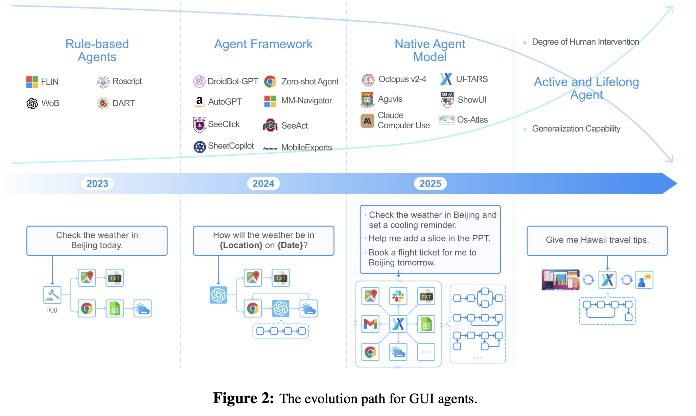

### Rule-based Agents
#### Stage 1: Rule-based Agents
早期的**基于规则的 agent（rule-based agents）**，如机器人流程自动化（RPA）系统，是为了在结构化环境中模仿人类操作而设计的，通常通过匹配**预定义规则**并调用 API 来完成任务。虽然它们在处理重复性高、流程明确的任务上效果不错，但由于完全依赖人为设定的规则和指令，缺乏学习能力，因此难以应对复杂或新颖的场景。一旦流程发生变化，就必须由人工重新配置。此外，这类代理通常需要系统级权限或 API 访问，这在许多受限环境下是不可行的，从而限制了其通用性和扩展性。
这些局限性突显了向**基于 GUI 的视觉 agent **转变的重要性。相比依赖底层系统访问，GUI 代理通过“看界面”来理解和操作，具备更强的灵活性与适应性，能在缺乏预设规则和权限的情况下自主应对未知界面和新任务。这种范式转变极大地拓宽了代理系统在实际应用中的可能性和使用范围。

###  From Modular Agent Framework to Native Agent Model
#### Stage 2: Agent Framework
Agent 系统利用先进基础模型（如 GPT-4 和 GPT-4o）的理解与推理能力，提升任务执行的灵活性，使代理更具适应性与模块化。早期尝试主要集中于调用 API 或执行代码的文本交互任务，代表性系统如 AutoGPT 和 LangChain 则通过整合外部工具和服务，实现了更动态的工作流程。这类框架通常通过设计任务特定的工作流与优化提示词（prompt engineering）来提升性能，同时加入如短期或长期记忆模块，增强自我改进与任务适应能力。例如，Cradle 记录任务经验以支持多任务处理，Agent Workflow Memory（AWM）模块则优化了记忆管理，提供更相关的操作指导。
为提高任务完成率，许多框架引入**反思式多步推理**策略，如 ReAct 框架通过将推理与行为结果结合，提升行动规划的灵活性。针对多模态任务，MMNavigator 和 SeeAct 等系统通过整合网页内容、任务目标与上下文行为，提升操作精度。
此外，**multi-agent** 协作也成为重要方向，例如 MobileExperts 通过 multi-agent 在移动设备上合作完成任务，如操作 APP、处理弹窗等。

尽管 agent framework 相较于基于规则的系统具有更强的适应性，但它们依然严重依赖**人工设计的工作流**（agentic workflow knowledge），这些知识通常通过提示词、脚本或工具使用规则外部编码而成，具有以下几个关键限制：

- 脆弱性与维护压力：一旦任务或界面发生变化，就需要开发者手动修改提示词或规则，过程繁琐且容易出错。  

- 学习方式割裂：大多数框架无法通过新经验自动更新模型参数，而是依赖静态的提示词和人工设计，导致一旦偏离原始任务域就难以适应。  

- 模块不兼容性：复杂任务需多个模块协同（如视觉解析、记忆、长程规划等），模块间通过提示词或中间代码沟通，稍有不一致就可能导致整体失败，且调试过程依赖专家。

Agent framework 本质上是“**设计驱动**”的系统，缺乏自我学习与泛化能力，长期依赖开发者的预设，难以应对未知变化或实现真正的智能演进。

#### Stage 3: Native Agent Model
与依赖人工规则的 agent framework 不同，native agent model 通过“方向性学习”（orientational learning）将工作流知识直接嵌入模型中，实现**端到端的学习与执行**，统一感知、推理、记忆和行动等能力，具备更强的适应性与扩展性。其核心优势包括：

- 整体学习与适应能力强：模型以统一策略学习感知、推理、记忆和行动，能根据新数据或演示自动更新全部知识，而非仅更新某个模块或提示词；
  
- 减少人工工程负担：模型通过大规模演示或交互数据学习任务流程，省去了人工设计规则和提示词的繁琐工作；
  
- 统一参数带来强泛化能力：在统一参数策略下，不同任务和界面之间的知识（如 UI 结构、导航策略）可迁移，提升在新场景下的泛化表现；
  
- 支持持续自我进化：native agent 适合持续学习，通过真实环境中的在线交互数据进行微调，不断提升应对新任务或变化界面的能力。

代表性工作如 Claude Computer-Use、Aguvis、ShowUI、OS-Atlas 和 Octopus v2-4 等，正在通过利用现实世界 GUI 数据来训练大规模视觉语言模型（VLM），推动 native agent 代理在图形界面交互领域的应用落地。

### Active and Lifelong Agent (Prospect)
#### Stage 4: Action and Lifelong Agent
Action and Lifelong Agent 是 GUI agents 发展的下一关键阶段。尽管 native agent model 具备较强的端到端学习能力，但仍依赖人工标注与专家指导，限制了其进一步发展。为突破这一瓶颈，**主动学习与终身学习范式**逐渐成为研究焦点。该阶段的 agent 具备以下核心特征：

- 主动学习能力：agent 能够主动与环境交互，提出任务、尝试执行，并评估结果；
  
- 自我奖励机制：agent 可根据任务完成情况设定内部奖励，从正向行为中强化学习；
  
- 连续反馈优化：通过持续试错与反馈循环，不断提升任务表现和问题解决策略；
  
- 自我发现与知识填补：agent 可识别自身知识盲区，并通过探索行为自主学习新技能；
  
- 类机器人持续学习方式：借鉴机器人中的终身学习理念，能从成功与失败中持续迭代，逐步泛化到更广泛的任务和环境中。

与 native agents 的关键区别在于：**终身代理具备自主学习能力，不再依赖外部监督或标注数据**，是真正意义上具备“自驱动认知成长”的智能体。这标志着从“人教智能”向“自主进化”的范式转变，是通用 GUI 智能体迈向通用智能的重要一步。

## Core Capabilities of Native Agent Model
Native agents 将传统 agent framework 中模块化的组件内化为核心能力，逐步向端到端结构转变。如图 3 所示，论文从四个关键方面来分析其能力构成：感知（perception）、动作执行（action）、推理（system-1 & system-2 thinking）和记忆（memory）。
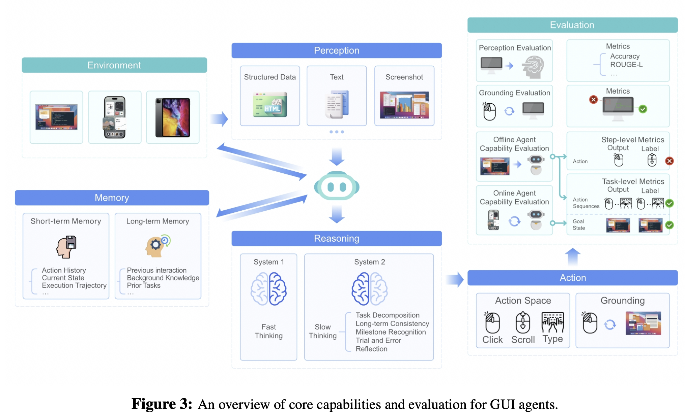

### 感知能力
感知能力是 GUI 智能体的核心，要求其能够精准理解图形界面，并动态适应界面的变化。现有方法主要分为三类：

- 结构化文本输入：早期方法依赖将 GUI 转换为 HTML、DOM 树或辅助性树等结构化文本形式，以便文本模型处理，例如 Agent-E 使用 DOM 蒸馏来提取关键信息，WebWISE 结合过滤后的 DOM 元素进行任务执行。

- 视觉截图输入：随着计算机视觉与多模态模型的发展，越来越多方法直接利用界面截图，结合 OCR 和 GUI 元素检测（如 ICONNet、DINO）提取图像中的交互元素，并增强语义理解。例如 SeeAct 将视觉元素与 HTML 内容进行对齐，提高识别精度。

- 综合建模方法：一些方法结合结构化文本、视觉截图与语义描述来构建更完整的感知模型，如 UGround 使用大规模 GUI 数据进行训练，OSCAR 基于 Windows 的 A11y 树进行语义增强，DUALVCR 同时融合视觉和 HTML 描述信息。

此外，**实时感知**是另一关键能力。GUI 界面是动态的，agent 需持续监控界面状态，如识别加载动画或异常情况，及时调整行为。

### 执行能力
Action 能力是 GUI 智能体的关键组成部分，要求具备多样性、精确性和适应性，以应对不同平台和场景的需求，主要包括以下几个方面：

- 统一且多样的动作空间：GUI 智能体需要在多种平台（如移动端、桌面应用、网页界面）中操作，而每个平台的交互方式各不相同。因此，建立一个统一的动作空间至关重要，将平台特有操作抽象为通用操作，如点击（click）、输入（type）、滚动（scroll）、拖拽（drag）等。此外，还可以整合语言智能体的操作方式，如 API 调用、代码执行、命令行指令等，增强智能体的通用性与扩展性。动作可以进一步划分为：atomic actions（单一步操作，如点击一个按钮）和 compositional actions（由多个 atomic 动作组成的操作序列，如登录操作（输入用户名 → 输入密码 → 点击登录）)。  

- 坐标对齐挑战：精准定位点击、滑动等操作的坐标是一个难点，原因包括：不同 GUI 布局间的差异、不同设备的分辨率与宽高比变化、页面内容的动态变化等。这要求智能体具备较强的视觉理解能力，能够从截图或实时界面中准确提取并推理出目标元素的位置。

鉴于许多操作在不同 GUI 上具有共通性，agent 可以将这些操作标准化处理，从而减少学习难度，促进在多平台间迁移与复用，提升适应效率。

### Reasoning with System 1&2 Thinking
为了胜任多样化的 GUI 任务，GUI 智能体需要具备 system 1 & system 2 的融合推理能力。对于常规操作，快速反应，提高效率；对于新颖或异常情况，应具备深入分析和规划能力，确保任务成功；

#### System 1 Reasoning
System 1 Reasoning 强调通过识别界面与已学知识，实现快速、直觉的响应行为，适用于日常、高频、熟悉的操作情景。比如按回车键提交表单、点击特定按钮进入下一流程等。适合处理单步、无需复杂逻辑的任务。局限性在于其依赖预设流程，无法应对复杂的多步骤任务或陌生场景，缺乏规划和反思能力；

#### System 2 Reasoning
System 2 Reasoning 具备结构化、逻辑化、多步骤思考能力，支持处理复杂任务。通常结合 Chain-of-Thought (CoT) 或 ReAct 等技术，显式构造中间思维步骤。关键能力包括：

- 任务分解（Task Decomposition）：将复杂目标拆解为若干子任务，有助于计划性执行；

- 长期一致性（Long-term Consistency）：在任务过程中持续回溯目标，保持流程不偏离；

- 阶段识别（Milestone Recognition）：实时评估当前进度，动态设定下一个目标；

- 试错机制（Trial-and-Error）：在不确定情境下尝试不同方案并调整；

- 反思机制（Reflection）：回顾先前行为，总结错误并优化未来表现。

### 记忆能力
记忆用于存储**显式知识**与**历史经验**，以辅助智能体在决策时参考过去的信息，实现更精准、上下文感知的行为选择。在传统 agent 框架中，记忆通常被划分为两个层级：短期记忆和长期记忆。

#### 短期记忆（Short-term Memory）
用于保存当前任务过程中的上下文信息，包含：动作历史、当前状态细节、任务执行路径。作用：增强任务执行过程中的实时感知与适应能力。代表工作：CoAT（Zhang et al., 2024d，通过语义化处理截图提取界面关键信息）、CoCo-Agent（Ma et al., 2024，通过环境感知机制记录布局与动态状态）。

#### 长期记忆（Long-term Memory）
用于持久化保存交互记录、任务流程与背景知识。支持跨任务的推理与决策，存储用户偏好、过往执行路径；代表工作：OS-copilot（Wu et al., 2024a，利用长期记忆积累用户偏好以优化任务执行）、Cradle（Tan et al., 2024，强化多任务能力，通过记忆过往任务经验实现泛化）、Song et al., 2024 提出 API 驱动的 web agent 框架，借助任务相关背景知识处理复杂网页任务。

与传统框架不同，native agent 模型通过**参数内部化**的方式整合长期经验：

- 无需显式存储模块：将长期任务执行经验直接编码进模型参数；
  
- 交互过程转化为内隐记忆：通过大规模训练数据，模型在内部“记住”执行策略；
  
- 激活机制：In-Context Learning（ICL）、Chain-of-Thought 推理（CoT）。触发已有的“内隐知识”，进行任务决策。

#### 显示知识（Explicit Knowledge）和 隐式知识（Implicit/Tacit Knowledge）

显示知识是指：可被清晰表达、书写、记录和传输的知识，通常是结构化或半结构化的形式。隐式知识是指不易明确表达的知识，通常是通过经验、习惯、直觉或长期学习积累形成的。对比如下：

| 特性           | 显示知识（Explicit）                | 隐式知识（Implicit/Tacit）           |
|----------------|--------------------------------------|----------------------------------------|
| 是否可表达     | ✔ 可清晰表达、记录                   | ✖ 难以明确表达                        |
| 存储方式       | 文档、结构化数据、规则               | 模型参数、历史经验、行为模式         |
| 可否迁移       | ✔ 易于迁移（跨任务/平台）             | ✖ 迁移需模型训练或对齐                |
| 表达形式       | HTML、API 文档、任务脚本              | 图像偏好、位置直觉、习惯性操作       |
| 学习来源       | 人工编写、结构数据、规则设定         | 模型训练、用户交互、试错探索         |
| 模型作用       | 提供直接指令与依据                   | 提升泛化与适应复杂场景能力           |

##  Capability Evaluation

1. 感知评估（Perception Evaluation）：评估智能体对用户界面（UI）知识的理解和环境感知能力，着重于智能体是否能够正确识别和理解界面上的信息。

2. 指令定位评估（Grounding Evaluation）：评估智能体根据给定指令，准确定位 GUI 元素的能力。 强调指令与界面元素之间的准确对应与理解。

3. 离线能力评估（Offline Agent Capability Evaluation）：在静态、预定义的环境中测试智能体的性能。环境状态固定（如截图或历史操作），智能体需给出正确的输出或动作，无需实时交互。

4. 在线能力评估（Online Agent Capability Evaluation）：在动态、交互式环境中测试智能体的行为表现。智能体可以实时与环境交互，通过执行动作影响环境状态，模拟真实世界场景。

## ScreenSpot、ScreenSpot v2 和 ScreenSpot Pro

1. ScreenSpot (Cheng et al., 2024)：第一个专注于**单步 GUI grounding **的跨平台评估基准。评估智能体在给定指令下，能否正确**定位一个界面元素**。  
可以覆盖多个操作系统和平台（如 Windows、macOS、移动端等），提供截图与自然语言指令，要求模型返回具体 UI 元素的位置，强调 **grounding precision** 而非交互或多步推理。

不足之处：存在部分**注释错误**和歧义指令；部分任务场景与真实用户操作略有脱节。

2. ScreenSpot v2 (Wu et al., 2024b)：对原版 ScreenSpot 的全面**重注释版本**，旨在修正错误与提升数据质量。**纠正了大量注释错误**（如误标的 UI 元素、歧义指令）；引入更加严格的标注标准和质量审核流程；
更适合用于训练和评估大型多模态模型（如 GPT-4V、Kosmos-2）。相比原版，v2 数据集**准确率更高**、**歧义更少**；被广泛用于 GUI-grounded LLM 预训练与微调（如 LLaVA-UI、Uni-GUI）。

3. ScreenSpot Pro (Li et al., 2025)：Pro 版是对前两个版本的重大升级，**面向真实办公与专业场景**的高分辨率多样化数据集。来自**真实用户任务**（如表格编辑、数据可视化、代码 IDE 操作等）；包含高分辨率、复杂布局的桌面截图；
指令更具上下文语义，模拟**真实人类交互**。

## UI-TARS
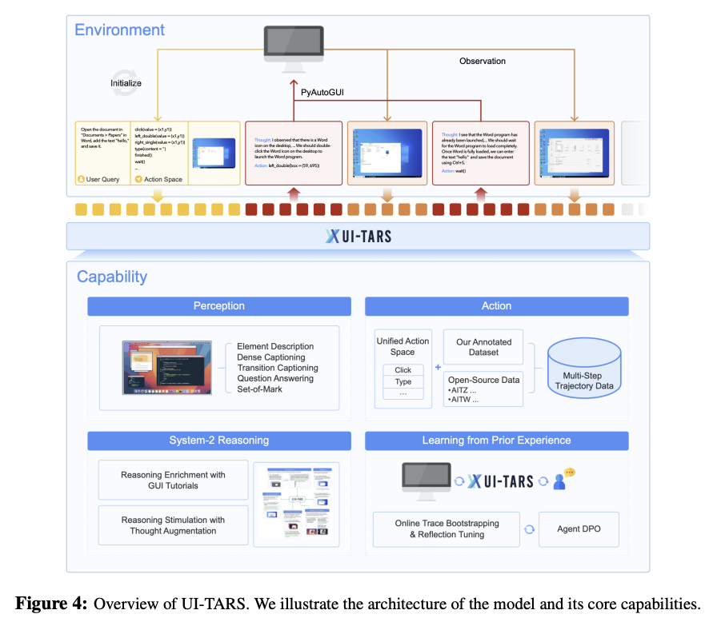

### Architecture Overview
UI-TARS 是一个用于多步 GUI 操作任务的智能体框架，其核心在于引入**观察-推理-行动**的闭环机制，以提高任务完成的准确性和反思性。

UI-TARS 在给定初始任务指令后，按时间步迭代执行：$(\text{instruction}, (o_1, a_1), (o_2, a_2), ..., (o_n, a_n))$，其中$o_i$为第 $i$ 步的观察结果 （如屏幕截图），$a_i$为 agent 在第 i 步执行的动作。

为了增强推理能力与决策的深思熟虑性，UI-TARS 在每个动作前引入了“思考”步骤：$(\text{instruction}, (o_1, t_1, a_1), (o_2, t_2, a_2), ..., (o_n, t_n, a_n))$，其中 $t_i$ 为第 $i$ 步的“思考”（thought）。这些 thoughts 是显式的推理过程，帮助模型更好地理解任务上下文和历史行为。

在每个时间步 $n$，模型输入包括 ：

- 初始任务指令；
  
- 最近的 N 条历史交互记录：$(o_{n−i}, t_{n−i}, a_{n−i})$，其中$i \in [1, N]$;
  
- 当前观察结果：$o_n$.

由于 token 限制（例如最大 sequence 长度为 32k），因此仅保留最近 $N$ 条完整记录作为输入，保证模型效率。

模型输出：
$$
P(t_n, a_n | \text{instruction}, t_1, a_1, (o_{n−i}, t_{n−i}, a_{n−i})_{i=1}^N, o_n).
$$

### Enhancing GUI Perception
改进 GUI 感知能力面临一系列独特挑战。一、screenshot 稀缺问题。与通用图像领域相比，GUI 专属的高质量截图数据相对较少，公开可用的大规模数据集也较为稀缺，这在很大程度上限制了模型的训练和泛化能力。二、GUI 图像本身具有高度的信息密度和结构化特征，通常包含大量小而精细的界面元素，这些元素被排列在复杂的布局中，彼此之间具有明确的空间关系和功能依赖。这种场景对模型的识别精度提出了更高的要求，尤其是需要准确感知界面中那些仅有 10×10 像素大小的小图标，这在高分辨率截图中尤为困难。

传统的感知框架往往采用分模块策略，如使用目标检测器、OCR 和布局分析等组件分别处理界面内容。但这类方法容易受到模块累积误差的影响，且在面对复杂、动态的界面时较难泛化。相比之下，原生智能体（native agents）采用端到端的方式，直接对原始截图进行统一建模。这一方式不仅能够有效利用大规模统一数据集提升整体感知效果，还具备更强的扩展性和泛化能力。

为了解决截图稀缺的问题，研究者构建了一个大规模的 GUI 数据集，涵盖来自网页、应用和操作系统的各类界面截图与结构化元数据。数据采集结合了自动爬虫和人工探索，涵盖了从主界面到深层嵌套页面的各种场景。在截图的同时，系统还通过专门的解析工具自动提取元素的类型、层级、位置和文本信息等，形成了标准格式的数据记录：包括截图本身、元素框（bounding box）以及丰富的元素元数据。数据构建采用自底向上的方法，从局部元素识别出发，逐步扩展到对整个界面的理解。这种策略在保证元素识别精度的同时，也有助于模型更好地捕捉界面整体布局的语义结构，在复杂 GUI 感知任务中实现更可靠的表现。

基于所采集的大规模 GUI 截图数据，研究者构建了五种核心任务数据，用以全面提升 UI-TARS 在界面理解与交互感知中的能力。

- **元素描述任务（Element Description）**。该任务旨在增强模型识别和理解界面中具体元素，尤其是体积小、难以识别的细节元素。每个元素的描述涵盖四个方面：其一是元素类型，例如按钮、文本框、滚动条等，根据视觉特征和系统元信息进行分类；其二是视觉描述，包含元素的形状、颜色、文本内容和风格等信息，直接从图像中提取；其三是位置信息，描述该元素在界面中相对于其他元素的空间位置；其四是功能说明，用以表示元素的预期功能及其可能的交互方式。这些描述基于截图解析工具提取的元数据，并通过多模态大模型生成，以训练 UI-TARS 自动枚举并理解截图中的全部可视元素。

- **密集描述任务（Dense Captioning）**。目标是让模型不仅能理解单个元素，还能全面掌握整个界面的结构和布局。UI-TARS 在训练中接收一张界面截图，输出完整、结构化的界面描述，内容涵盖所有元素、图像及其间的空间关系。对于缺乏元数据的嵌入式图像，模型会自动生成图像描述，最终整合所有描述信息，生成一段详尽的界面文字说明，最大程度保留界面原有结构。

- **状态转移描述任务（State Transition Captioning）**。用于识别和说明连续两个截图之间的视觉差异及其背后的交互原因。模型需判断某个动作（如点击或键入）是否发生，并识别出界面发生的具体变化。此外，训练数据还包含一些非交互性的状态转变，如动画、刷新或背景更新等，使模型能更细致地感知界面的动态行为。

- **问答任务（Question Answering, QA）**。该任务包含丰富多样的问答数据，覆盖界面理解、图像解释、元素定位和关系推理等内容。通过这种方式，模型不仅能够理解界面布局和元素语义，还能在此基础上处理抽象层次更高的查询，展现更强的灵活性与推理能力。

- **SoM（Set-of-Mark）机制**。进一步增强模型的元素定位与视觉理解能力。研究者在截图中根据元素坐标添加具有区分性的标记，这些标记在形状、颜色、大小上各不相同，提供直观的视觉引导。通过将 SoM 标注整合进密集描述与问答任务中，模型能够更好地关联标记与具体界面元素，实现更精确的定位与表达。

综上，这五个任务构成了 UI-TARS 的核心训练目标，从局部元素的理解到整体界面的感知，再到动态变化的追踪与高级推理能力的提升，系统地推动了 GUI 感知与交互智能的发展。

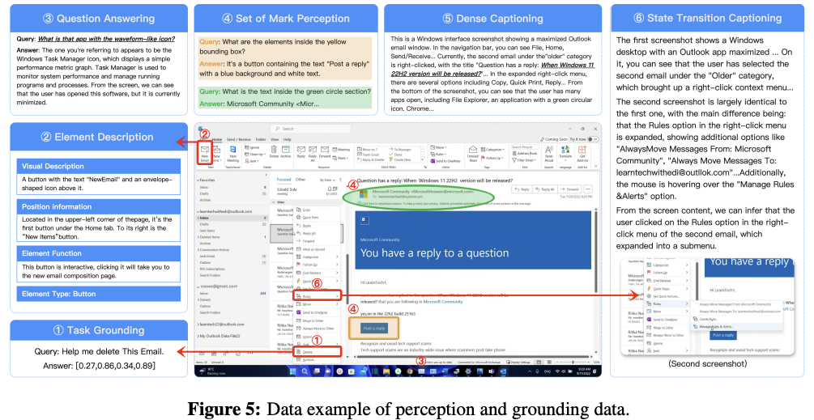

### Unified Action Modeling and Grounding
为了实现跨平台的一致操作与知识迁移，UI-TARS 构建了**统一的操作空间（Unified Action Space）**，对语义等价的动作进行了标准化。例如，在 Windows 系统中的“点击”和移动设备中的“轻触”在统一操作空间中被视为相同操作。此外，针对不同设备平台之间的特有差异，系统还引入了可选的、平台定制的操作，以确保在保持一致性的同时满足不同设备的操作需求。统一操作空间还包括两个终止操作：`Finished()` 表示任务完成，`CallUser()` 用于需要用户干预的场景，如登录或身份验证。
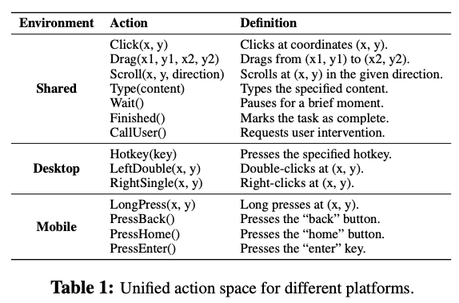

在多步任务执行中，训练模型的主要挑战之一是**高质量、多步骤的操作轨迹数据**稀缺。为此，研究团队构建了两个主要数据来源：首先是自建的标注数据集。研究者开发了专门的标注工具，在 PC 环境下记录用户在各类软件和网页中的实际操作行为。整个标注过程包括任务指令的创建与修订、执行过程的录制以及最终的质量过滤，从而确保数据的准确性和实用性；其次是整合多个开源数据集，如 MM-Mind2Web、GUIAct、AITW、AndroidControl 等。通过统一数据表示格式，将它们转换为兼容的标准操作轨迹，有效提升了数据的规模和多样性。

在提升模型的定位与交互能力方面，研究者进一步强调了“grounding”的重要性，即准确定位并交互特定的界面元素。相较于多步骤动作数据，grounding 数据更易扩展，因为其主要依赖于元素的视觉与位置属性。**UI-TARS 被训练为直接预测需要交互元素的坐标点**。具体而言，系统通过截图解析工具提取元素的类型、层级、边界框与文本信息，并以元素中心点坐标作为模型输出目标。训练过程中，模型输入包括 GUI 截图与其元素的文本描述，输出则是屏幕归一化的坐标，用以确保不同分辨率设备之间的兼容性。例如，对于“右上角红色按钮，文字为 Submit”的描述，模型需预测该按钮在图像中的精确位置。

为了进一步扩大 grounding 数据的规模与覆盖范围，研究团队还整合了多个公开数据集，包括 Seeclick、MultiUI、Rico-SCA、WidgetCaption、CLAY、UIBERT、OmniACT、AutoGUI 等，并统一为兼容格式。通过这些数据的融合，UI-TARS 在点击、拖动等操作中的定位准确性显著提升，有效增强了其在复杂场景下的交互执行能力。

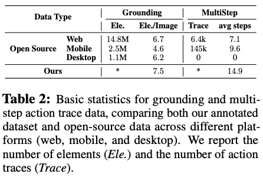

###  Infusing System-2 Reasoning
#### Reasoning Enrichment with GUI Tutorials
为了增强模型在图形用户界面（GUI）任务中的推理能力，研究者提出了一种基于教程内容的数据挖掘方法，利用互联网上公开的图文混排教程来构建推理增强数据。这些教程通常展示了用户在多种软件和网页环境中的详细交互过程，不仅体现了基础的 GUI 操作流程，也蕴含了任务执行过程中潜在的逻辑推理模式。因此，它们成为构建 GUI 领域推理能力的理想资源。

在数据源选择上，研究团队选取了两个知名的大规模图文预训练数据集 —— MINT 和 OmniCorpus。尽管这两个数据集规模庞大、覆盖面广，但仅有少部分内容真正符合 GUI 教程的标准。为此，团队设计了一套多阶段的数据筛选与优化流程，旨在高效提取高质量的 GUI 教程数据。

- 第一阶段是粗筛阶段，团队构建了一个 fastText 分类器，通过人工收集的优质 GUI 教程作为正样本，与从 MINT 和 OmniCorpus 中随机抽取的样本作为负样本进行训练。该分类器用于初步筛选，识别出可能为教程的数据片段，形成候选集。

- 随后进入精筛阶段，研究者引入了大语言模型（LLM）进行语义级别的判别，从候选集中剔除伪阳性样本。这一过程在多个轮次中迭代进行，显著提升了高质量样本的召回率，确保保留的数据在内容、形式和语义上均符合 GUI 教程的要求。

- 最后的数据清洗阶段，研究团队进一步去除了冗余、广告以及残留噪声。去重方法包括基于 URL 的规则匹配和局部敏感哈希（LSH）技术。此外，还借助 LLM 对所有文本内容进行重写，提升语言质量并消除不相关或低质量的表达。

通过这一完整的数据筛选与优化流程，最终整理出了约 600 万条高质量 GUI 教程数据。每条教程平均包含约 510 个文本 token 和 3.3 张图像。这批数据不仅大幅提升了模型对 GUI 操作流程的理解能力，也为注入更强的推理能力奠定了坚实的数据基础。

#### Reasoning Stimulation with Thought Augmentation
为了提升 UI-TARS 在任务执行中的推理能力，研究者对 grounding 阶段中收集的动作轨迹数据进行了增强。这些原始数据主要由观**察和动作序列**组成，例如 $(o_{i-1}, a_{i-1}, o_i, a_i, \dots)$，但缺乏明确的推理过程表示。为了弥合感知与动作之间的认知鸿沟，团队**引入了“思考（thought）”标注**，即**在每一步动作前添加推理内容，形成更新后的数据格式 $(o_{i-1}, t_{i-1}, a_{i-1}, o_i, t_i, a_i, \dots)$。这些“思考”不仅让模型的决策过程更加可解释，也促进了其对任务目标的对齐能力。

在构建这些推理内容时，研究者采用了两阶段的标注流程：

第一阶段称为 **ActRe（Action Reflection）**。该阶段基于视觉语言模型（VLM）进行迭代式生成。具体而言，对于每一步 $n$，其推理思考 $t_{n}$ 是通过向 VLM 提供任务指令、过去的观察和动作历史以及当前目标动作 $a_n$ 来生成的。随后，模型在加入当前思考的基础上生成下一步的推理 $t_{n+1}$，以此类推。这种生成方式保证了每一步的“思考”都建立在逻辑上下文之上，并且与目标动作保持一致性。
$$
t_n = \text{VLM}(\text{instruction}, (o_1, t_1, a_1), \dots, o_n, a_n)
$$

$$
t_{n+1} = \text{VLM}(\text{instruction}, (o_1, t_1, a_1), \dots, (o_n, t_n, a_n), o_{n+1}, a_{n+1})
$$

在 ActRe 的标注过程中，VLM 被引导去模拟“System-2”的思维模式，即更具 deliberation（深思熟虑）和逻辑分解能力的高阶推理策略。为此，研究者设计了以下几种核心的推理模式，以驱动模型进行更具逻辑性和目标导向的思考：

- **任务分解**：将复杂任务拆解为可管理的小任务，逐步推进整体目标的完成。
  
- **长期一致性**：在多步骤任务中保持目标导向，避免因上下文变化而偏离主线任务。
  
- **阶段性目标识别**：识别并确认中间阶段的目标是否达成，为后续任务提供明确的转折点。
  
- **试错机制**：在面对不确定情境（如搜索结果验证）时进行假设、测试和评估，提升适应性。
  
- **反思能力**：识别失败或错误的操作，及时调整策略，增强错误恢复与灵活决策能力。
  
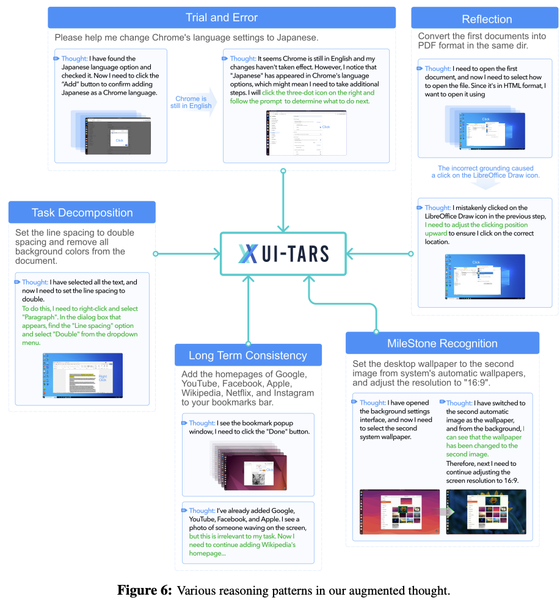

第二阶段，**思考自举（Thought Bootstrapping）** 机制，用于解决逆向标注（即已知动作再生成推理）中可能出现的“假因果”问题。在 ActRe 标注流程中，虽然模型根据已知动作生成相应的推理内容，但这种方式存在“**逆向合理化**”的风险：**生成的“思考”可能只是表面上与动作匹配，实际并未体现出真正的因果逻辑。这种“后验合理化”容易导致模型学习到的是如何解释一个动作，而不是决定该动作。这种逻辑缺失会削弱模型在面对未知任务时的泛化能力和决策一致性。**

为了解决这个问题，研究者引入了**思考自举机制**。该方法的核心思想是在不提前告知正确动作的前提下，**让模型生成多个候选的“思考–动作”对，随后选出那些能正确导向目标动作的推理**。这种方式强迫模型进行更真实的决策模拟，促使它依据当前上下文进行推理，而不是简单对给定动作进行合理化解释。具体而言，给定当前的观察 $o_n$ 和过去的轨迹信息，模型（使用 UI-TARS 的早期版本）生成多个候选对 $(\hat{t}_n^i, \hat{a}_n^i)$:
$$
\{(\hat{t}_n^1, \hat{a}_n^1), (\hat{t}_n^2, \hat{a}_n^2), \dots, (\hat{t}_n^k, \hat{a}_n^k)\}
\quad \text{where} \quad
(\hat{t}_n^i, \hat{a}_n^i) = \text{UI-TARS}_{\text{early}}(\text{instruction}, \dots, o_n)
$$
然后筛选出其中使得 $\hat{a}_n^i = a_n$ 的那一对，即该思考确实成功地推导出目标动作：
$$
(t_n, a_n) = \text{Select}(\hat{t}_n^i, \hat{a}_n^i), \quad \text{such that} \quad \hat{a}_n^i = a_n.
$$

此外，为增强语言鲁棒性和适应多语言用户环境，研究者在标注过程中加入了中英文双语版本的思考内容，扩展了语言多样性。在训练阶段，除了使用增强后的含思考轨迹，原始的无思考动作序列也被保留作为训练数据的一部分，以提供更全面的学习信号并增强模型的灵活性与兼容性。

### Learning from Prior Experience in Long-term Memory
与语言模型可以利用大量包含知识与推理模式的文本数据不同，GUI 中的用户交互和决策过程很少被记录或系统性组织起来。这种数据匮乏限制了 GUI agents 的可扩展性和任务泛化能力。为了解决这一问题，一个具有前景的方向是在**长期记忆中学习已有经验。通过捕捉并保留以往任务中的知识，智能体能够将这些历史经验用于未来的决策，使其行动更具适应性和效率**。在这个思路下，UI-TARS 被设计为能够持续从真实设备中的交互中动态学习。借助半自动化的数据收集、过滤和精炼流程，模型不断自我改进，同时最大限度地减少人工干预。长期记忆的使用使得 UI-TARS 能够积累知识，在不断训练迭代中逐步提升对新任务的适应能力。

#### Online Trace Bootstrapping
线轨迹自举机制。首先，通过结合人工编写与模型生成的任务指令获得一批多样化的任务目标。在每一轮迭代中，模型 $M_n$ 执行这些指令 $I_n$，在目标 GUI 环境（如虚拟 PC）中产生一批原始轨迹，记作：
$$
T_{\text{raw},n} = \{(o_1, t_1, a_1, o_2, t_2, a_2, \dots, o_n, t_n, a_n), \dots\}.
$$
随后，通过多层级过滤函数对其进行清洗：
$$
\text{Filter}(T_{\text{raw},n}, I_n) = T_{\text{filtered},n}.
$$
该过程分为三步：首先是基于规则的奖励机制，利用启发式规则剔除包含明显异常的轨迹（如无效点击）；然后是 VLM 对保留下来的轨迹进行评分，剔除得分低于阈值的部分；最后由人工审核员进一步筛查，指出轨迹中发生错误的步骤，截断其后无效动作，仅保留正确片段。最终得到的过滤轨迹集 $T_{\text{filtered},n}$ 被用于微调模型：
$$
M_{n+1} = \text{FineTune}(M_n, T_{\text{filtered},n}),
$$
与此同时，作者依据这些轨迹对任务指令集进行扩展与润色：
$$
I_{n+1} = \text{HumanRefine}(I_n, T_{\text{filtered},n}).
$$
每一轮都使用当前版本的模型 $M_{n+1}$ 来生成新轨迹，从而持续扩展数据规模，并提高数据质量与模型能力。

#### Reflection Tuning
在真实部署中，GUI agents 往往会陷入错误循环（如重复点击无响应按钮、误操作等），但大多数离线数据仅包含理想路径，缺乏错误与恢复机制的学习信号。为了解决这一问题，UI-TARS 引入 反思微调机制。

对于由 UI-TARS 生成的一条在线轨迹：
$
T = \text{instruction}, (o_1, t_1, a_1), (o_2, t_2, a_2), \ldots, (o_t, t_t, a_t)。
$
假设在第 $\tau$ 步发生了错误，即动作 $a_\tau$ 被判定为无效或次优。要求标注人员识别出该错误，并标注出正确的思考过程与对应的动作，记为 $t^*_\tau$ 和 $a^*_\tau$。这构成了一对错误纠正轨迹：
$$
T^- = \text{instruction}, (o_1, t_1, a_1), (o_2, t_2, a_2), \ldots, (o_\tau, t_\tau, a_\tau),
$$
$$
T^+ = \text{instruction}, (o_1, t_1, a_1), (o_2, t_2, a_2), \ldots, (o_\tau, t^*_\tau, a^*_\tau).
$$

此外，还要求标注者继续基于错误动作 $a_{\tau}$ 标注后续的步骤，模拟错误已经发生的真实情境。在生成下一步的思考过程 $t^*_{\tau+1}$ 时，标注者需考虑之前错误所造成的影响，给出一个补救动作 $a^*_{\tau+1}$，以重新校准任务的执行进度。例如，若上一步原本应将网页加入书签却误点击了关闭按钮，则下一步应为重新打开最近关闭的网页，并再次尝试点击“添加书签”按钮。因此形成了如下反思修正轨迹对：
$$
T^- = \text{instruction}, (o_1, t_1, a_1), (o_2, t_2, a_2), \ldots, (o_\tau, t_\tau, a_\tau), (o_{\tau+1}, t_{\tau+1}, a_{\tau+1}),
$$
$$
T^+ = \text{instruction}, (o_1, t_1, a_1), (o_2, t_2, a_2), \ldots, (o_\tau, t_\tau, a_\tau), (o_{\tau+1}, t^*_{\tau+1}, a^*_{\tau+1}).
$$

在训练中，作者仅使用正样本轨迹 $T^+$ 进行监督微调（SFT），并且只对修正步骤 $(t^*_\tau, a^*_\tau)$ 与 $(t^*_{\tau+1}, a^*_{\tau+1})$ 计算损失函数，跳过错误步骤 $(t_\tau, a_\tau)$ 的反向传播。通过这一过程，UI-TARS 能逐步学习如何识别自身的错误并进行修复，从而在面对不确定或动态环境时，具备更强的适应与调整能力。

#### Agent DPO
在前面的 Online Trace Bootstrapping 中，系统自然会生成大量错误步骤（即负样本）。而 Reflection Tuning 阶段中的 SFT 只使用了经过人工纠正的步骤（即正样本），忽略了这些负样本，这使得模型难以明确地学会“避免”错误行为。

为了解决这个问题，UI-TARS 引入了 Direct Preference Optimization（DPO）机制，该方法通过引入参考模型目标，显式学习“偏好”正确行为而非错误行为。这样，模型不仅能学习如何正确行动，也能有效地学习哪些行为不该执行。

设某一状态为 $s_\tau = (\text{instruction}, (o_1, t_1, a_1), \ldots, (o_{\tau-1}, t_{\tau-1}, a_{\tau-1}))$，在该状态下，agent 最初执行了错误动作 $a_\tau$，后被修正为更优的动作 $a'_\tau$。作者引入一个学习的奖励函数 $r_\theta(s, a)$，它衡量在状态 $s$ 下采取动作 $a$ 的合理性。根据 Bradley-Terry 模型，定义动作 $a'_\tau$ 相对于 $a_\tau$ 的偏好概率为：
$$
P_\theta(a'_\tau \succ a_\tau | s_\tau) = \frac{\exp(r_\theta(s_\tau, a'_\tau))}{\exp(r_\theta(s_\tau, a_\tau)) + \exp(r_\theta(s_\tau, a'_\tau))},
$$
其中，$a'_\tau \succ a_\tau$ 表示偏好修正后的动作 $a'_\tau$。

在训练时，作者采用 DPO 的优化目标，使用 SFT 模型 $\pi_{\text{SFT}}$ 作为参考，对偏好数据集进行训练，鼓励模型增加正确动作的概率，减少错误动作的概率。损失函数定义如下：
$$
\mathcal{L}_{\text{DPO}}(\theta) = - \mathbb{E}_\tau [ \log \sigma ( \beta \log \frac{\pi_\theta(a'_\tau | s_\tau)}{\pi_{\text{SFT}}(a'_\tau | s_\tau)} - \beta \log \frac{\pi_\theta(a_\tau | s_\tau)}{\pi_{\text{SFT}}(a_\tau | s_\tau)} ) ],
$$
其中：$\pi_\theta$：当前优化策略（即 DPO agent）；$\pi_{\text{SFT}}$：通过监督微调得到的策略；$\beta$：控制 DPO 策略与 SFT 策略之间差异程度的超参数；$\sigma$：sigmoid 函数，保证输出为合法的概率值  

### Training
为确保与 **Aguvis**（Xu 等，2024）和 **OS-Atlas**（Wu 等，2024b）等现有方法的公平对比，UI-TARS 采用相同的视觉语言模型骨干 **Qwen-2-VL**（Wang 等，2024c），并使用一个分三阶段的训练流程。该流程涵盖约 500 亿 tokens 的训练数据，旨在通过逐步引入更高质量的数据，提升模型在复杂推理任务中的表现：

1. **持续预训练阶段（Continual Pre-training Phase）**。在这一阶段，使用前面所提到的数据集（**不包括 reflection tuning 数据**）进行持续预训练，采用固定学习率。该阶段的目标是使模型全面掌握 GUI 操作所需的能力，包括感知、grounding 和行为轨迹等，从而确保对多种 GUI 元素和交互的广泛覆盖。

2. **退火阶段（Annealing Phase）**。预训练主要是大规模地“扫一遍”所有 GUI 相关的内容（包括感知、语义对齐、动作轨迹等），让模型具备**基础能力**。接下来在退火阶段**精调模型**，选取**高质量的数据子集**（包括感知、grounding、行为轨迹和 reflection tuning 数据）进行训练。通过“退火”策略逐步调整模型的学习动态，使模型在真实 GUI 场景中形成更聚焦的学习能力与更优的决策策略。该阶段结束后得到的模型被称为 **UI-TARS-SFT**。

3. **DPO 阶段（DPO Phase）**。最后阶段使用 online bootstrapping 产生的**反思修正样本对**进行 DPO 训练。该过程强化模型对最优行为的偏好，同时惩罚次优行为，使其在真实场景中做出更精确、具备上下文意识的决策。最终训练所得的模型命名为 **UI-TARS-DPO**。

## Experiment
在本节中，作者评估了 UI-TARS 模型在多个关键任务上的表现。该模型基于 Qwen-2-VL 进行训练，使用了约 500 亿 token 的数据，并构建了三个不同规模的模型版本：UI-TARS-2B、UI-TARS-7B 和 UI-TARS-72B。实验围绕三个核心维度展开：**感知能力（perception）**、**grounding **和** agent capabilities**。

在 OSWorld 基准上，作者同时评估了 UI-TARS 在退火阶段训练后的模型（UI-TARS-SFT）与经过 DPO 阶段进一步优化的模型（UI-TARS-DPO），因为该任务对决策能力的迭代优化尤为敏感。而在其他基准任务中，则主要报告 UI-TARS-SFT 的性能。

为了公平比较，作者选用了多个当前 sota 的基线模型进行对比，涵盖了商用大模型（如 GPT-4o、Claude-3.5-Sonnet、Gemini-1.5-Pro、Gemini-2.0）以及多个开源/学术模型（如 CogAgent、InternVL、Aria-UI、OS-Atlas、UGround、ShowUI 等），同时也纳入了同一系列的 QwenVL 模型和改进版本（如 Qwen2-VL、UIX-Qwen2-7B、Qwen-VL-Max 等）进行评估。实验还包含消融研究，用于探究“system 1 与 system 2 reasoning”对下游任务的贡献。**文中设置历史纪录条数 $N$ 固定为 5**。

### Perception Capability Evaluation
作者使用三个关键基准测试来评估 UI-TARS 模型的感知能力：VisualWebBench**、WebSRC 和 ScreenQA-short。

- VisualWebBench 用于评估模型对网页元素的理解与 grounding 能力，任务涵盖网页问答（QA）、OCR 识别以及动作预测。UI-TARS 在该基准上表现出色，其中 **UI-TARS-72B 版本得分为 82.8**，显著超越了 GPT-4o（78.5）和 Claude 3.5（78.2）。

- WebSRC 主要测试模型对网页语义内容和结构布局的理解能力。**UI-TARS-7B 在 WebSRC 上取得了领先的 93.6 分**，表明其在网页结构感知方面具有优势。

- ScreenQA-short 用于评估模型对移动端界面复杂布局和界面问题的理解能力。**UI-TARS-72B 在该基准上得分为 88.6**，再次展现其在视觉感知上的强大能力。
  
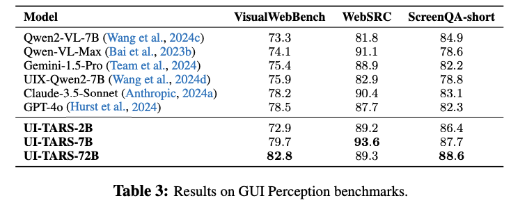

### Grounding Capability Evaluation
为了评估 UI-TARS 的 grounding 能力，作者采用了三个基准测试：ScreenSpot Pro、ScreenSpot 和 ScreenSpot v2。这些基准旨在评估模型在图形用户界面（GUI）中识别和定位元素的能力。

UI-TARS 在这三个基准上都显著优于现有方法。具体来看，在 ScreenSpot Pro 上，UI-TARS-72B 得分为 38.1，显著领先于 UGround-V1-7B（31.1）和 OS-Atlas-7B（18.9）。实验还发现，输入更高分辨率的图像可以显著提升模型在该数据集上的表现。

在 ScreenSpot 上，UI-TARS-7B 取得了 89.5 的领先成绩；而在 ScreenSpot v2 中，UI-TARS-7B 和 UI-TARS-72B 分别获得 91.6 和 90.3，均优于 OS-Atlas-7B 的 87.1，进一步验证了 UI-TARS 的鲁棒性。

此外，实验结果还表明，从 UI-TARS-2B 到 UI-TARS-7B，模型在三个 grounding 数据集上的性能都有显著提升。而从 7B 扩展到 72B 时，虽然在 ScreenSpot 和 ScreenSpot v2 上提升有限，但在高难度的 ScreenSpot Pro 上表现提升明显，说明 ScreenSpot v1 和 v2 可能不足以全面反映大规模模型在 grounding 能力上的潜力。

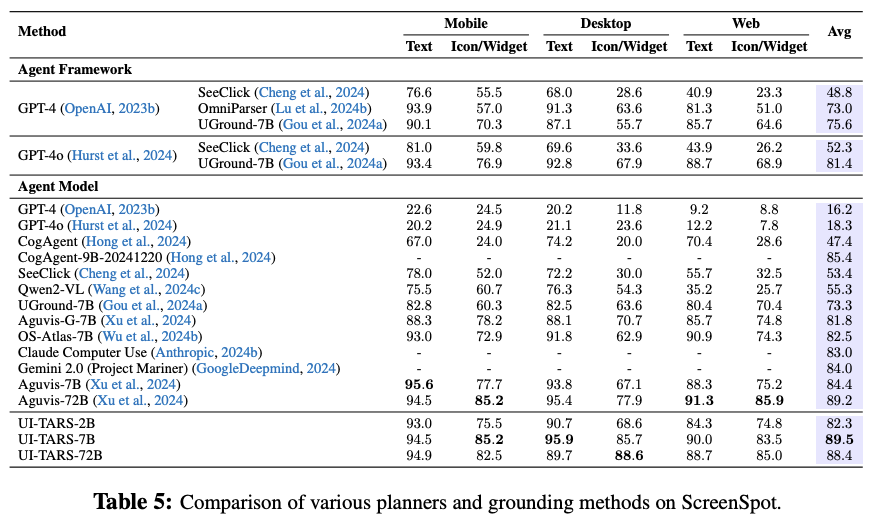

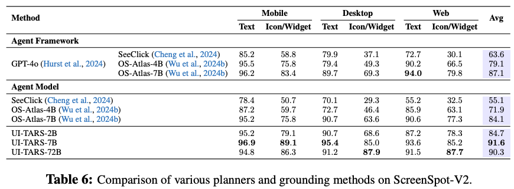

### Offline Agent Capability Evaluation
为了评估 UI-TARS 在 static, pre-defined environments 中的 GUI agent 能力，作者选用了三个代表性 benchmarks：**Multimodal Mind2Web**、**Android Control** 和 **GUI Odyssey**。

- **Multimodal Mind2Web** 用于构建和评估通用网页 agents，主要考查模型在网页场景下执行自然语言指令的能力。评估指标包括：元素识别准确率（Ele.Acc）、operation F1 分数（Op.F1）以及 step 成功率（Step SR）。实验结果（见表 7）显示，UI-TARS 的多个变体在所有关键指标上均超越了基于 GPT-4o/GPT-4V 等框架方法的模型，尤其是 UI-TARS-72B，表现达到了 SOTA（当前最佳）。

- **Android Control** 评估模型在移动端场景下的规划与执行能力。数据集中包含两类任务：（1）高阶任务要求模型自主规划多步操作；（2）低阶任务为每一步提供人工标注的明确操作指令。UI-TARS-7B 和 72B 在该基准上的表现均大幅超越此前最佳方法 OS-Atlas-7B，绝对提升高达 25（见表 8），说明其在多步骤任务中的推理和执行能力极强。

- **GUI Odyssey** 侧重于在移动设备上的跨应用导航任务，每个任务平均超过 15 步，涵盖多种导航场景，指令源自预定义模板。数据集包含在 Android 模拟器中由人工演示的真实操作数据，确保了高质量的元数据支持。UI-TARS 在该任务中同样展现出领先性能。

总体来看，UI-TARS 不仅在网页环境中取得显著成绩，在移动环境中的多步任务中也展现了强大的通用性和适应性。值得注意的是，虽然 Claude 在网页任务中表现良好，但在移动端表现明显不佳，说明其 GUI 操作能力尚未很好地迁移到移动领域。而 UI-TARS 则在网页和移动双场景中都能保持高水平，体现了其强大的泛化与跨域能力。

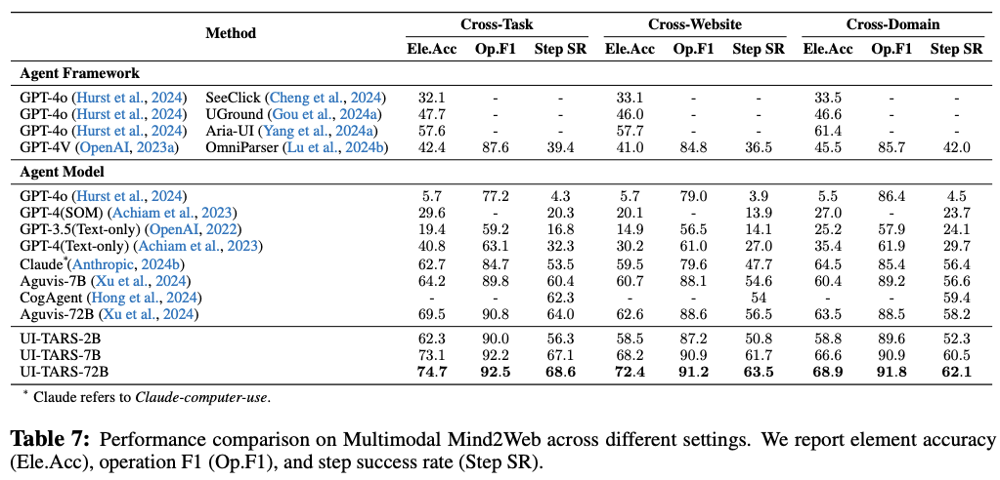

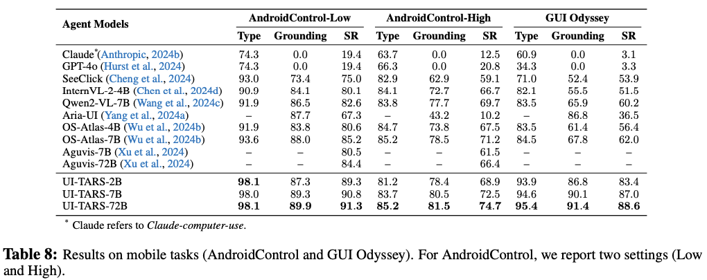

### Online Agent Capability Evaluation
在在线环境中，GUI agent 可实时执行操作、改变环境状态，这种动态模拟更贴近真实使用场景。为此，作者使用了两个主要基准环境：

1. **OSWorld**（Xie et al., 2024）。涵盖 Ubuntu、Windows 和 macOS 上的网页与桌面应用，包含 369 个真实任务。评估在“仅截图模式”下进行，任务执行上限为 15 或 50 步，取 3 次运行的平均得分以降低不确定性。若模型选择“CallUser”或未正确输出“Finish”，任务视为失败。

2. **AndroidWorld**（Rawles et al., 2024b）。基于真实 Android 模拟器的移动应用环境，包含 20 个 App、116 个任务。每次任务会因参数随机化而产生动态变化，适用于考察 agent 的泛化与规划能力。

1. OSWorld 上的表现（桌面任务）：**UI-TARS-7B-DPO：18.7**，**UI-TARS-72B-DPO：22.7**，远超 Claude（14.9）。**UI-TARS-72B-DPO（15 步交互次数）** 的表现几乎等同于 **Claude（50 步）**，说明其执行效率更高。在 50 步预算下，**UI-TARS-72B-DPO 达到 24.6**，刷新该基准 SOTA，超越所有现有代理系统（如 GPT-4o + Aria-UI）。

2. **AndroidWorld 上的表现（移动任务）**：**UI-TARS-72B-SFT：46.6**，超过 GPT-4o + Aria-UI（44.8）与 Aguvis-72B（26.1），展现出更强的泛化与适应能力。
   
3. **DPO 相比 SFT 的提升显著**：尤其在 OSWorld 上，加入负样本训练的 DPO 显著增强模型区分最优与次优动作的能力，提升推理精度。

4. **模型规模越大，效果越好**：UI-TARS-72B 明显优于 UI-TARS-7B，且这一差距在在线任务中比离线任务（见表 7 与表 8）更大。这表明大模型更能胜任 system 2 式的深度推理，有助于复杂决策。同时也揭示：**仅依赖离线任务评估可能低估模型在真实动态环境中的能力**。

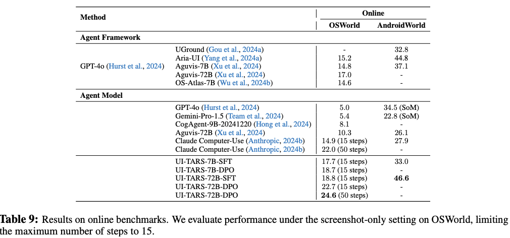

### Comparing System 1 and System 2 Reasoning
UI-TARS-7B 被训练来同时具备系统 1（直觉式）和系统 2（推理式）能力，但在实际推理过程中，通过 prompt engineering 来动态控制模型的推理方式，使其可以根据任务的需求偏向快速决策（系统 1）或更慎重的推理（系统 2）。

#### In-domain Evaluation
评估使用了三个 in-domain 的基准数据集：Multimodal Mind2Web（网页任务）、Android Control（移动设备控制）和 GUI Odyssey（跨应用导航）。为了提高评估效率，在 Android Control 和 GUI Odyssey 上随机采样了 1,000 个样本。评估使用了 Best-of-N（BoN）采样方法，在每个输入任务中，UI-TARS 生成 $N$ 个候选输出，$N$ 值分别设置为 1、16 和 64，通过多次尝试来评估模型表现的改进情况。评估指标为 Step Success Rate，即每个任务中模型在每一步是否成功完成任务。

如图 8 所示，当$N=1$时，System 2 推理在三个 in-domain 基准任务中的表现略逊于 System 1。尽管 System 2 推理通常被认为通过反思性、多步推理来提升任务执行效果，但结果显示，在仅生成一个候选输出的情况下，其复杂的推理链条可能反而带来副作用，例如提及不存在的对象或做出错误推断，增加了幻觉或行动失败的风险。由于缺乏候选输出的多样性，模型可能会固执地走上一条错误的推理路径，从而降低选出正确动作的概率。

然而，随着 $N$ 增加到 16 和 64，System 2 的优势开始显现。候选输出的多样性拓宽了决策空间，使模型有机会避开初始的次优推理路径。特别是，System 2 能够生成多个推理链，弥补了单样本条件下可能出现的错误，从而显著提升了整体表现。这表明，当样本数量足够时，System 2 那种更为深入的多步推理可以有效克服其初期劣势，展现出更强的任务执行能力。

**尽管系统 2 在具备足够输出多样性的情况下表现优越，但如何让它在只输出一个结果（如 Bo1）时也能实现最佳性能，仍是一个重大挑战**。未来理想的方向是，在不依赖大量候选样本的前提下，充分发挥系统 2 在真实场景中的推理优势。这可能通过强化微调等技术实现，引导模型在单次生成中就能以高置信度做出正确决策。

#### Out-of-domain Evaluation
在对 system 推理方式进行 Out-of-domain（OOD）评估时，研究者选择了 AndroidWorld 这一基准，该任务并未包含在 UI-TARS 的训练数据中。评估对象为 UI-TARS-7B 和 UI-TARS-72B，均采用 Bo1（单样本）策略。与 in-domain 评估结果形成鲜明对比的是，在 AndroidWorld 上，系统 2 推理显著优于系统 1 推理。

尽管在 Mind2Web、Android Control 和 GUI Odyssey 等 in-domain 任务中，System 1在 Bo1 设定下表现更稳定，而System 2可能因复杂推理带来幻觉或执行错误，但在 OOD 情境下，这种劣势被反转。System 2 更深入的推理过程在处理未见过的任务时展现出了更强的泛化能力。这表明，尽管System 2 在已知领域的执行效率尚有改进空间，其在真实世界中面向未知任务的适应性和推理潜力更为出色，展示了其在多样化、复杂环境中的广泛适用性与前景。

