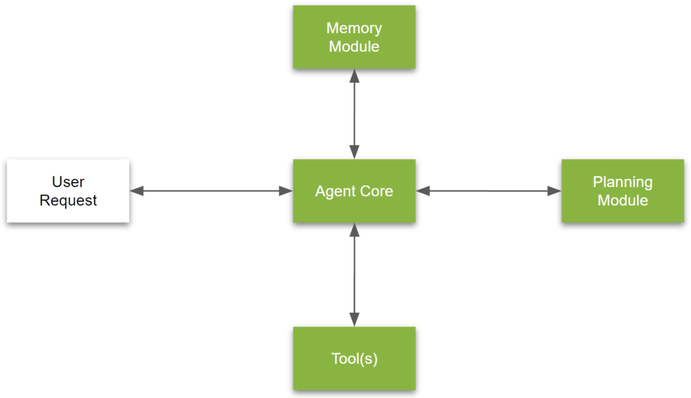

## 1. Agent 工作流程
当前大语言模型（LLM）的使用大多以“zero-shot”模式进行，模型通过逐词生成最终输出而不进行重新审查或完善。这一过程类似于让某人从头到尾一气呵成地写完一篇文章，而不进行任何修正。尽管在这种限制下，LLM仍表现出高度的有效性，但一种 agent 式、迭代的工作方式通常能带来更为稳健的结果。

在这种迭代框架中，LLM可以通过一系列有条理的步骤来完成任务，包括：

1. 为任务制定大纲；
2. 判断是否需要进行额外的网络搜索或研究；
3. 撰写初稿；
4. 审阅并识别潜在的薄弱环节或无关内容；
5. 基于发现的改进区域进行修订。

这种结构化的多步骤流程类似于人类作者在完善文本内容时采取的系统性方法。通过多次迭代，AI agent 能够比单次生成的方式更有效地提高结果质量。这一方法在推动更高精度和更高质量的生成任务中具有重要作用。

## 2. The Agent 框架

[Image credits to [source](https://developer.nvidia.com/blog/introduction-to-llm-agents/)]

### Agent core (LLM)
Agent Core 是 agent 的核心部分，充当主要的决策引擎，比如利用 OpenAI 的 GPT-4 来处理高级推理和动态任务管理。这个组件包括以下几个关键部分：

1. **决策引擎**：负责分析输入数据、记忆和目标，以生成合适的响应。

2. **目标管理系统**：根据任务进展不断更新 agent 的目标。

3. **集成总线**：管理记忆、工具和规划模块之间的信息流动，确保数据交换的连贯性。

Agent Core 利用 LLM 的能力完成任务，必要时生成新任务，并根据任务上下文的变化动态调整优先级。这种结构使得 agent 能够更灵活地适应任务环境的变化，从而有效地推进任务的完成。

### Memory Modules
记忆模块是 agent 框架中的基础部分，通过使用向量数据库（如 Pinecone、Weaviate、Chroma 等）提供任务相关数据的强大存储和检索机制。记忆模块通过以下方式提升 agent 的上下文感知能力和任务相关性：

1. **短期记忆（STM）**：管理临时数据，用于满足当前任务需求。短期记忆通过易于清理的堆栈或队列等易失性结构存储，以支持快速访问和频繁清除。

2. **长期记忆（LTM）**：使用向量数据库来持久化存储历史交互数据，使 agent 能够在较长时间内参考过去的对话或数据。长期记忆采用基于语义相似性的检索方式，以提高相关性，并结合数据的时间性和重要性，实现高效访问。

这种记忆架构使得 agent 能够在动态任务中保持对历史和当前上下文的理解，提升了任务的执行效果和智能性。

### Tools
工具模块为 agent 提供了执行任务的专业能力，通常使用 LangChain 框架来构建结构化的工作流程。工具模块包括以下几个主要部分：

1. **可执行工作流程**：基于 LangChain 定义，提供结构化和数据感知的任务处理方式，使 agent 能够有条理地完成任务。
   
2. **API 接口**：使 agent 能够安全地访问内部和外部数据源，扩展其功能范围，丰富了任务处理的资源和数据支持。

3. **中间件**：支持核心模块与工具之间的数据交换，负责数据格式转换、错误检查，并确保数据安全性。

LangChain 的集成使 agents 能够动态地与其环境交互，从而在处理不同任务时提供灵活性和适应性。这种结构化的工具模块极大地增强了 agents 的功能覆盖范围和操作精度。

### Planning Module
在复杂问题求解中，规划模块提供结构化方法，例如任务分解和反思，以帮助 agent 优化解决方案。在此模块中，任务管理系统使用双端队列（deque）数据结构，能够自主生成、管理和优先排序任务。该系统会根据任务完成情况和新生成的任务实时调整优先级，确保任务的执行始终与目标保持一致，推动任务进展更高效、更有条理。

## 3. 设计模式

常见agentic设计模式分类框架：

### Reflection（反思）
为了提升大语言模型的效果，一个关键方法是在其工作流程中引入反思机制。反思是一种自我评估和迭代改进的方式，使LLM能够自主识别输出中的不足，并基于反馈进行调整，最终提供更加精确、高效且符合用户需求的响应。通过这种结构化的迭代过程，LLM从典型的问答式互动转变为动态的持续改进循环。以下是反思工作流程的主要步骤和具体操作：

**1. 初始输出生成：** 在典型任务中（如代码编写），LLM首先会被提示生成一个初始响应，以完成特定目标（例如完成“任务X”）。该响应可以作为草稿，后续将接受进一步的审查。

**2. 自我评估和建设性反馈：**  生成初始输出后，可以引导LLM对其输出进行评估。例如，在代码生成的场景下，可提示它：
   > “以下是用于任务X的代码：[之前生成的代码]。仔细检查代码的正确性、风格和效率，并提供建设性的改进意见。”

   这个自我批评阶段使LLM能够识别自身输出中的缺陷，包括正确性、效率和风格方面的问题，从而发现需要改进的领域。

**3. 基于反馈的修订：** 在LLM生成了对其自身输出的反馈后， agent 工作流程将提示模型根据反馈进行修订。在此阶段，模型会结合初始输出和其生成的批评意见，生成反映出改进的修订版本。批评和重写的循环可重复多次，通过迭代提升最终输出的质量。

**4. 整合额外工具：** 为了进一步增强反思效果，可以为LLM配备辅助工具，帮助其定量评估自己的输出。例如：
   - **代码评估**：模型可以通过单元测试运行代码，验证其准确性。
   - **文本验证**：LLM可以通过互联网搜索或外部数据库进行事实核查，确保文本内容的准确性。
   
   当这些工具发现错误或不准确之处时，LLM能够根据差异生成额外反馈并提出改进建议，这种基于工具的反思使LLM的优化更加有效，将自我批评与外部验证相结合。

**5. 多 agent 框架增强反思流程：**  为优化反思过程，可以采用 multi-agent 框架。该配置中包括两个不同的 agents：
   - **输出生成 agent**：主要负责有效生成初始任务响应。
   - **批评 agent**：专门评估第一个 agent 的输出，提供建设性反馈以提升质量。

   通过两个 agent 的互动，LLM能够更好地识别并修正输出中的缺陷。这种协作引入了二级反思，使LLM能够获得单一 agent 设置中可能遗漏的见解。

### Function/Tool/API Calling (工具使用)
工具使用指的是LLM在响应过程中调用特定功能的能力，如执行代码、进行网页搜索或与生产力工具互动，从而使其功能扩展至传统语言生成之外。这种方法使得LLM能够通过选择性调用各种外部工具来处理更复杂的查询和多方面的任务。通过工具使用设计模式，LLM逐步从单一的语言生成系统演变为可以自主完成多种复杂任务的智能助手。

大型多模态模型的发展，如LLaVa、GPT-4V和Gemini，标志着工具使用的又一重要里程碑。在这些模型之前，LLM无法直接处理或操作图像，任何与图像相关的任务都必须委托给特定的计算机视觉功能，如物体识别或场景分析。而GPT-4在2023年引入的函数调用能力进一步推动了工具使用的发展，它建立了一个更为通用的功能接口，为一个多功能、多模态的AI生态系统奠定了基础，使得模型能够无缝集成文本、图像和其他数据类型。这一新功能的出现，促使了越来越多的LLM被设计来利用工具使用，扩展了其应用范围，并提升了其整体适应性。

#### 评估
为了确保工具使用功能能够满足各种现实场景的需求，必须对LLM的函数调用性能进行严格评估。此评估包括在Python和非Python编程环境中对模型性能的评估，重点是评估模型执行函数的能力、选择合适工具的能力，以及在对话上下文中判断何时需要调用特定函数的能力。评估的一个关键方面是测试模型根据用户提示准确调用函数的能力，以及判断某些函数是否适用或需要。

Berkeley Function-Calling Leaderboard (BFCL) 是由 UC Berkeley 创建的一个排行榜，用于评估和比较不同大语言模型在“函数调用”任务中的表现。它包含2,000个问题-函数-答案对，涵盖了多种编程语言（如Python、Java、JavaScript、REST API、SQL等）。这个排行榜专注于衡量LLM在执行外部工具或功能（例如编程、数据检索、计算等）时的能力。其目标是促进更高效、精准的模型开发，特别是在实际应用中，模型能够通过调用合适的外部工具来增强其功能，超越仅依赖语言生成的传统局限。

BFCL的评估内容涉及多个方面，主要包括：

(1) 函数调用的复杂。简单调用：单个函数的调用；多个函数调用：多个函数调用的组合；并行函数调用：要求模型能够同时调用多个函数，并且能够处理这些函数的并行执行。

(2) 函数相关性检测。该评估重点检查模型是否能够识别并排除与任务无关的函数，避免“幻觉”（即产生不相关或错误的输出）。如果模型使用了不相关的函数，应该能够返回错误信息。

(3) 编程语言分类。Python类评估：包括简单函数调用、多个函数调用、并行函数调用等不同场景的评估。非Python类评估：包括普通聊天功能、函数相关性检测、以及API调用和其他编程语言（如REST API、SQL、Java、JavaScript）的评估。

在评估模型性能时，使用了两种主要方法：

1. 抽象语法树（AST）评估。AST评估涉及解析模型生成的函数调用，并检查其结构是否符合预期输出。它验证函数名称、参数是否存在以及类型是否正确。AST评估适用于以下情况：
- **执行不可行**：当由于语言限制或其他原因无法执行代码时，AST评估仍然可以进行。
- **结果无法轻易执行**：当函数执行结果无法直接验证时，AST评估仍然有用。

2. 可执行函数评估。可执行函数评估通过执行模型生成的函数调用并将其输出与预期结果进行比较，来测试模型的实际应用能力。这种评估方法着重于以下几个方面：
- **函数调用能否成功运行**：验证函数是否可以被正确执行。
- **输出类型正确性**：确保函数返回的数据类型符合预期。
- **结构一致性**：函数输出的结构是否符合预期。

AST评估和可执行评估的结合确保了全面的评估，提供了模型输出的**语法正确性**和**功能正确性**的深入洞察。这两种方法互为补充，共同帮助测试模型在生成函数时的表现，确保其输出不仅符合预定的结构要求，也能够在实际运行中产生正确的结果。

#### Gorilla OpenFunctions-v2 LLM
Gorilla OpenFunctions-v2 是一个开源的大型语言模型（LLM），提供先进的功能调用能力，其性能可与 GPT-4 相媲美。该模型扩展了 LLM 的聊天能力，可以从自然语言指令生成可执行的 API 调用，并根据相关的 API 上下文执行任务。它支持多种编程语言和复杂的功能调用。通过它的多功能支持、并行调用、功能相关性检测等特性，用户可以轻松处理各种任务，显著提高工作效率和精度。

### Planning（规划）
Planning 是一种基础性的设计模式，赋予 LLM 自主制定和执行计划或策略的能力，用以完成任务。通过这种动态决策过程，AI 将广泛的目标分解为更小、更易管理的步骤，并按照结构化的顺序执行这些步骤，以产生连贯且通常复杂的输出。本文探讨了规划在 agent 型 AI 设计中的重要性，通过示例展示其功能，并分析其当前能力和局限性。

#### Planning vs. Deterministic Approaches
Planning 并非在每个 agent 工作流中都是必需的。对于一些较简单的任务或那些遵循预定顺序的任务，采用确定性的逐步方法就足够了。例如，如果一个 agent 被编程为反思并固定次数地修订其输出，它可以在无需适应性规划的情况下执行这一系列步骤。

然而，对于复杂或开放性任务，在任务执行过程中很难预定义所需的步骤顺序时，Planning 允许 AI 动态地决定合适的步骤。这种适应性的方法在任务中可能出现意外挑战或需要 agent 从多个工具和方法中选择最佳方案时尤为宝贵。通过这种方式，规划能够帮助 AI 在不断变化的环境中保持灵活性，并在复杂的任务中做出有效决策。

### Multi-agent Collaboration（多 agent 协作）
Multi-agent Collaboration 通过将复杂任务分解为易于管理的子任务来执行这些任务。通过将这些子任务分配给专门的 agent。每个 agent 都是软件工程师、产品经理、设计师、质量保证工程师等。多个 agent 协作，每个 agent 都执行特定的指定角色。这些 agent ，无论是通过以各种方式提示单个 LLM，还是通过使用多个 LLM，都能以量身定制的能力执行指定任务。例如，通过指示一个 LLM "编写清晰、高效的代码"，让它扮演 "软件工程师 "的角色，这样它就能只专注于这一方面，从而使其产出符合软件工程子任务的要求。

## 4. Benchmarks
尽管基于大型语言模型的智能体在多个领域中表现出色，但量化和客观评估这些智能体的性能仍然具有挑战性。为此，多个基准测试框架被设计用来评估 LLM 智能体的表现，常见的基准包括：

- **AgentBench**：一个开源框架，用于评估和比较多种基于 agent 的 AI 系统。

- **IGLU**：专注于评估 LLM 智能体在生成语言、执行任务等方面的表现。

- **ClemBench**：用于评估多功能任务和复杂环境中的 agent 表现。

- **ToolBench**：侧重于评估智能体在使用工具（如 API 调用、代码执行等）时的能力。

- **GentBench**：旨在评估智能体在生成和理解复杂指令的表现。

- **MLAgentBench**：专注于机器学习 agent 的评估框架，尤其是在自学习和环境适应性方面。

这些基准测试框架通常从多个维度对 LLM 智能体的表现进行评估，包括：

1. **效用（Utility）**：指任务完成的效果和效率，通常通过成功率和任务结果来衡量。

2. **社交能力（Sociability）**：语言沟通能力、合作与谈判能力、以及角色扮演的能力等。

3. **价值观（Values）**：包括智能体遵守道德和伦理标准、诚实性、无害性以及在特定情境下的适当性。

4. **持续进化能力（Ability to Evolve Continually）**：指智能体的持续学习、自我驱动学习能力，以及适应新环境的能力。

5. **对抗性鲁棒性（Adversarial Robustness）**：智能体对对抗性攻击的敏感度，通常通过对抗训练和人工监督等方法来增强鲁棒性。

6. **可信度（Trustworthiness）**：包括校准问题和训练数据的偏差对智能体可信度的影响，努力引导模型展示其思维过程或解释，以增强其可信度。

## 5. 构建和开发智能体的常用框架
以下是一些框架和库的介绍，适用于构建和开发智能体系统：

1. **AutoGen Studio**：AutoGen Studio 是微软研究院提供的一个低代码界面，用于快速原型设计 AI 智能体。它建立在 AutoGen 框架之上，除了原型设计外，还可以用于调试和评估多智能体工作流。

2. **AutoGen**：AutoGen 是微软开源的框架，用于构建 AI 智能体系统。它简化了事件驱动、分布式、可扩展且具有弹性的智能体应用的创建。用户可以利用该框架来快速开发和部署智能体系统。

3. **Swarm**：Swarm 是 OpenAI 提供的一个框架，旨在探索轻量级的多智能体编排。它强调在协作中使用少量资源和简单的设计，适用于构建多个智能体之间的协作系统。

4. **CrewAI**：CrewAI 是一个用于编排角色扮演和自主 AI 智能体的前沿框架。它通过促进协作智能，使得多个智能体能够无缝协作，共同应对复杂任务。

5. **Letta**：Letta 是一个开源框架，用于构建有状态的 LLM 应用程序。使用 Letta，用户可以构建具有高级推理能力和透明长期记忆的智能体。

6. **Llama Stack**：Llama Stack 是 Meta 提供的框架，它定义并标准化了生成性 AI 应用程序所需的构建块。该框架涵盖整个开发生命周期：从模型训练和微调，到产品评估，再到构建和运行生产环境中的 AI 智能体。

7. **AutoRAG**：AutoRAG 是一个用于寻找“你自己的数据”最优 RAG（Retrieval-Augmented Generation）管道的工具。它允许用户自动评估各种 RAG 模块，并使用自己的评估数据找到最适合自己用例的 RAG 管道。

8. **Beam**：Beam 是一个领先的智能体过程自动化平台，致力于通过自动化智能体的流程和操作，提高生产效率。

9. **AutoAgents**：AutoAgents 是一个新型框架，旨在动态生成和协调多智能体，使语言模型能够为各种任务构建适应性的 AI 团队。与传统系统依赖于静态预定义智能体不同，AutoAgents 可以自主生成任务特定的智能体，允许在多个领域灵活协作。该框架引入了草稿和执行阶段，用于处理复杂的任务环境并促进有效的角色分配和解决方案规划。

10. **BabyAGI**：BabyAGI 是一个广泛使用的、面向任务的自主智能体，用于处理多个领域的各种任务。它利用了包括 OpenAI 的 GPT-4 语言模型、Pinecone 向量搜索平台和 LangChain 框架等先进技术。BabyAGI 的核心组件如下：
    - **任务完成**：系统首先处理任务列表中的任务，结合 GPT-4 和 LangChain 的链式和智能体功能生成结果，必要时对结果进行优化，并存储在 Pinecone 中供未来参考。
    - **任务生成**：完成一个任务后，系统利用 GPT-4 创建新的任务，确保新任务不会与现有任务重复。
    - **任务优先级排序**：系统根据新生成任务的重要性重新排序任务列表，GPT-4 帮助系统进行优先级评估。

## 6. 智能体和多模态模型的区别
### **智能体（Agent）**
智能体（Agent）是一种能够自主感知环境、做出决策并执行行动的系统，广泛应用于不同领域，如机器人、自动化系统、游戏角色、虚拟助理等。

主要特点:

- **自主性**：智能体能够根据感知到的环境信息，独立进行决策和行动，而不需要外部持续的控制。

- **感知-决策-行动循环**：智能体能够感知外部环境（通过传感器或输入），根据某种规则或策略进行决策，并在环境中执行相应的行为。这是智能体的核心特性。

- **持续性**：智能体通常在持续的时间框架中工作，不断与环境互动。

- **适应性与学习**：有些智能体可以通过学习（如强化学习）在复杂的环境中不断优化其行为。

举例：

- 机器人智能体通过传感器感知周围环境，规划路径并自主导航。

- 自动驾驶汽车智能体根据道路情况实时调整驾驶策略。

- 游戏中的 AI 角色根据玩家行为做出回应并采取行动。

### **多模态 GPT**
多模态 GPT 是基于 **Transformer** 架构的预训练语言模型（GPT），它能够处理和生成多种模态的数据，如文本、图像、音频等。传统 GPT 模型专注于自然语言处理，而多模态 GPT 可以跨越多种模态，将它们结合在一起进行任务处理，如从文本生成图像、理解图文组合等。

主要特点：

- **多模态输入与输出**：多模态 GPT 可以处理多种类型的数据。例如，它可以接收图像和文本作为输入，然后生成文本描述，或根据文本输入生成相关图像。

- **基于 Transformer 架构**：多模态 GPT 继承了 GPT 的 Transformer 架构，通过大规模的预训练进行自监督学习，从而具备强大的生成和理解能力。

- **生成能力**：多模态 GPT 强调生成能力，尤其在需要跨模态任务时表现出色，如生成图像、音频或视频，或通过对话生成文本内容。

- **推理与回答**：它可以通过整合不同模态的数据进行复杂的推理和回答，适用于许多生成和理解任务，如图文理解、文本生成等。

举例：

- **DALL·E**：OpenAI 的 DALL·E 是多模态 GPT 的一个典型例子，能够根据文字描述生成高质量的图像。

- **CLIP**：CLIP 是一个多模态模型，可以理解图像和文本之间的关系，通过文本找到相关图像，或通过图像生成对应的文本描述。

### **智能体 vs 多模态 GPT：区别与联系**

区别：

- **核心功能**：
  - **智能体**：侧重于感知环境、决策与行动的闭环循环。智能体可以是物理的（如机器人），也可以是虚拟的（如自动化软件），并且通常需要与动态的环境进行交互。

  - **多模态 GPT**：主要用于处理和生成多种模态的数据（如图像、文本），侧重于模态间的数据理解和生成。它并不具备自主的决策和行动能力。

- **任务性质**：
  - **智能体**：通常任务是交互性的，智能体在动态环境中持续工作，例如自动驾驶、游戏角色 AI、机器人执行任务等。智能体不仅需要感知，还需要执行行动。

  - **多模态 GPT**：主要任务是生成式或理解式的。例如，生成图像、生成文本回答问题、或理解图文关系。它在一个静态输入的任务上更为强大，但并不在环境中主动采取行动。

- **学习机制**：
  - **智能体**：可能采用强化学习、进化算法等方法来在与环境的互动中学习最优策略。

  - **多模态 GPT**：使用大规模预训练进行自监督学习，主要依赖于大量的跨模态数据进行学习。

联系：

- **感知能力**：虽然智能体和多模态 GPT 的主要目标不同，但两者都涉及感知能力。智能体可以使用多模态感知（如视觉、听觉），而多模态 GPT 直接处理多种模态的数据输入。未来的智能体可能会集成多模态 GPT 模型，使其在处理复杂多模态数据（如图像、文本）时更加智能。
  
- **跨模态理解**：多模态 GPT 可以为智能体提供更强大的理解和生成能力。例如，一个多模态 GPT 模型可以嵌入到智能体中，使其能够通过文本描述生成视觉信息（如在机器人视觉系统中辅助感知）或根据视觉信息生成文本描述（如在自动驾驶中生成自然语言报告）。

- **语言生成**：某些智能体，例如聊天机器人，可以使用多模态 GPT 的生成能力来与用户进行自然语言交互，提供图像或文本回答。

### 总结

- **智能体** 是一个自主的实体，能够感知环境、决策和执行行动，强调的是行动循环和与环境的持续交互。

- **多模态 GPT** 是一个生成和理解多模态数据的语言模型，强调的是跨模态数据的处理和生成能力。

设计一个 AI 智能体（Agent）是一个系统化的过程，涉及多个阶段，包括任务定义、感知环境、决策机制、行动执行和学习改进等。以下是详细的步骤来帮助设计一个 AI 智能体：

- **明确任务与目标**：清楚智能体的作用和目标。

- **感知模块**：设计感知环境的方式，获取数据。

- **决策模块**：设计如何根据感知的数据做出决策，可以基于规则、规划、机器学习或强化学习。

- **行为执行模块**：设计如何执行智能体的决策。

- **学习与优化**：引入学习机制，让智能体能够根据经验或新数据不断改进。

- **反馈与评估**：持续评估智能体的表现，优化其任务执行效果。

# Reference

[Distilled AI](https://aman.ai/primers/ai/agents/#overview)

[[译] AI Agent 白皮书](https://arthurchiao.art/blog/ai-agent-white-paper-zh/#323-tree-of-thoughts-tot)

