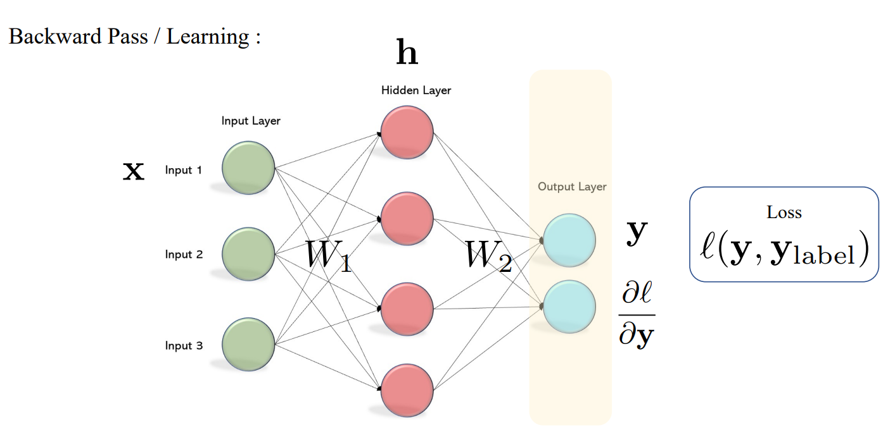
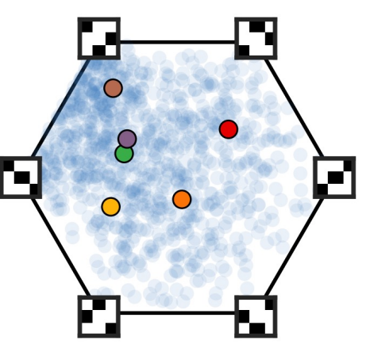
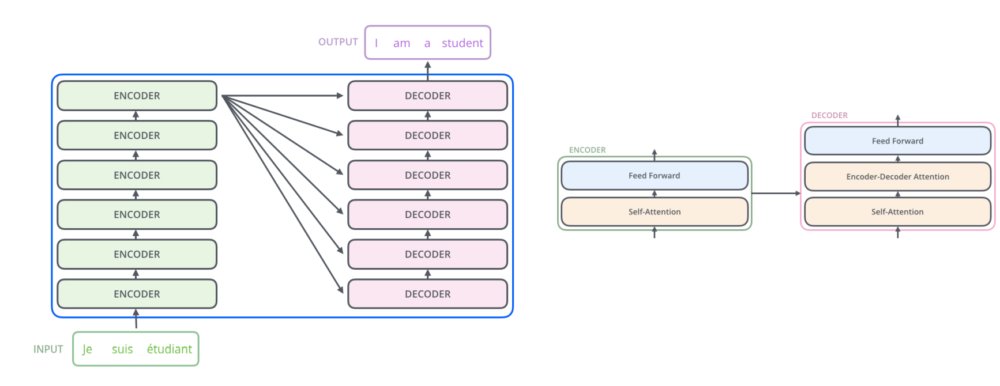
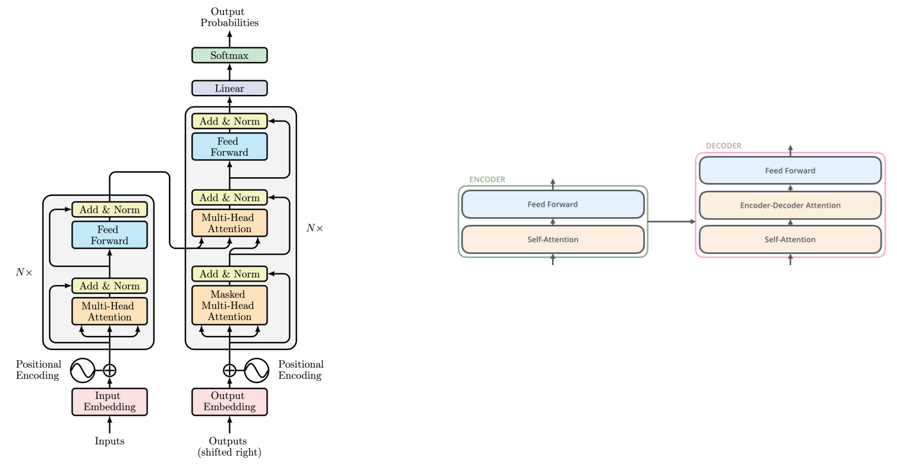
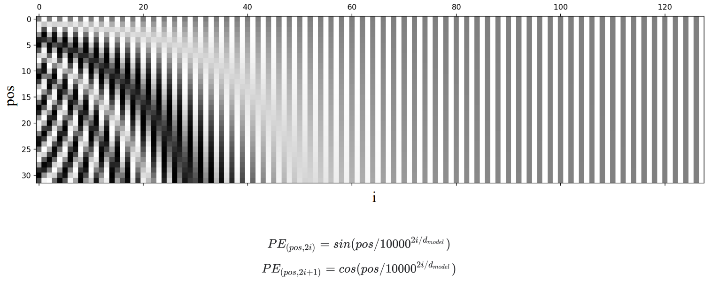
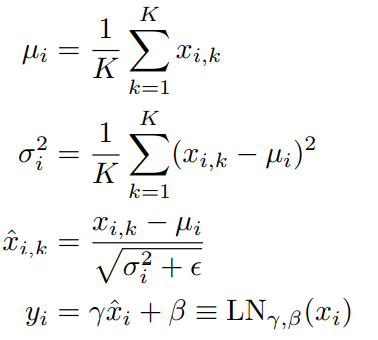

## Brief Intro to Deep Learning

Deep learning:
- Data: large datasets, e.g., ImageNet, etc.;
- Model: deep neural networks, e.g., ResNet-152, etc.;
- Learning algorithm: backpropagation, i.e., stochastic gradient descent (SGD).

In recurrent neural networks (RNNs): **same** neural network gets reused many times.
$$
h^t = F(x^t, h^{t-1}, W).
$$

Back propagation:
- Loss is always a scalar value;
- For the backward propogation, the gradient is in the form: $J^T v$, where $v$ is a vector, and $J$ is a Jacobian matrix, $T$ means transpose;
- For the forward propogation, the gradient is in the form: $J v$.
- In BF process, the shape of a Jacobian matrix is $m \times n$, where $m$ is the dimension of output, and $n$ is the dimension of input.
  
Consider Vector-by-Matrix Gradients:

Case 1: $\mathbf{z} = \mathbf{W}\mathbf{x}$, where $\mathbf x \in \mathbb{R}^{n \times 1}$, $\mathbf{W} \in \mathbb{R}^{m \times n}$, $\mathbf z \in \mathbb{R}^{m \times 1}$.
$$
\begin{aligned}
\frac{\partial \mathbf{z}}{\partial \mathbf{x}} &= \mathbf{W}, \\
\end{aligned}
$$

Case 2： $\mathbf{z} = \mathbf{x} \mathbf{W}$, where $\mathbf x \in \mathbb{R}^{1 \times m}$, $\mathbf{W} \in \mathbb{R}^{m \times n}$, $\mathbf z \in \mathbb{R}^{1 \times n}$.
$$
\begin{aligned}
\frac{\partial \mathbf{z}}{\partial \mathbf{x}} &= \mathbf{W}^T, \\
\end{aligned}
$$

Case 3: $\mathbf z = \mathbf x$, then $\frac{\partial \mathbf z}{\partial \mathbf x} = \mathbf{I}$.

Case 4: $\mathbf{X} \in \mathbb{R}^{m \times n}$, then $\frac{\partial scalar}{\partial \mathbf{X}}  \in \mathbb{R}^{m \times n}$, just as the same as the shape of $\mathbf{X}$.

Case 5: $\mathbf{Z} = \mathbf{X}\mathbf{W}$, where $\mathbf{X} \in \mathbb{R}^{m \times n}$, $\mathbf{W} \in \mathbb{R}^{n \times w}$. Assume $\frac{\partial Loss}{\partial \mathbf{Z}} = \mathbf{\delta} \in \mathbb{R}^{m \times w}$.
$$
\begin{aligned}
\frac{\partial Loss}{\partial \mathbf{X}} &= \mathbf{\delta} \mathbf{W}^T, \\
\frac{\partial Loss}{\partial \mathbf{W}} &= \mathbf{X}^T \mathbf{\delta}.
\end{aligned}
$$

Here we consider the simple example:
$$
\begin{aligned}
\mathbf h_1 = \mathbf x \mathbf{W}_1,  \qquad (1 \times 4) = (1 \times 3) \times (3 \times 4)\\
\hat{\mathbf y} = \mathbf h_1 \mathbf{W}_2, \qquad (1 \times 2) = (1 \times 4) \times (4 \times 2)\\
L = \|\hat{\mathbf y}\|_2^2. \qquad (1 \times 1) = (1 \times 2) \times (2 \times 1)
\end{aligned}
$$
Then, for the backward propagation process, we have:
$$
\begin{aligned}
\frac{\partial L}{\partial \hat{\mathbf y}} &= 2 \hat{\mathbf y}, \qquad (1 \times 2) = (1 \times 2) \\
\frac{\partial L}{\partial \mathbf{W}_2} &=  (\frac{\partial \hat{\mathbf y}}{\partial \mathbf{W}_2})^T \frac{\partial L}{\partial \hat{\mathbf y}}= \mathbf h_1^T  \frac{\partial L}{\partial \hat{\mathbf y}} = 2 \mathbf h_1^T \hat{\mathbf y}, \qquad (4 \times 2) = (4 \times 1) \times (1 \times 2)\\
\frac{\partial L}{\partial \mathbf h_1} &=  \frac{\partial L}{\partial \hat{\mathbf y}}\frac{\partial \hat{\mathbf y}}{\partial \mathbf h_1}=\frac{\partial L}{\partial \hat{\mathbf y}} \mathbf{W}_2^T = 2 \hat{\mathbf y} \mathbf{W}_2^T
, \qquad (1 \times 4) = (1 \times 2) \times (2 \times 4)\\
\frac{\partial L}{\partial \mathbf{W}_1} &=  (\frac{\partial \mathbf h_1}{\partial \mathbf{W}_1})^T [\frac{\partial L}{\partial \hat{\mathbf y}}\frac{\partial \hat{\mathbf y}}{\partial \mathbf h_1}] = \mathbf x^T \frac{\partial L}{\partial \mathbf h_1} = 2 \mathbf x^T \hat{\mathbf y} \mathbf{W}_2^T, \qquad (3 \times 4) = (3 \times 1) \times (1 \times 4) \\
\frac{\partial L}{\partial \mathbf x} &=  \frac{\partial L}{\partial \hat{\mathbf y}}\frac{\partial \hat{\mathbf y}}{\partial \mathbf h_1} \frac{\partial \mathbf h_1}{\partial \mathbf x} = 2\hat{\mathbf y} \mathbf{W}_2^T \mathbf{W}_1^T, \qquad (1 \times 3) = (1 \times 2) \times (2 \times 4) \times (4 \times 3)
\end{aligned}
$$

We can get similar results if $\mathbf x \in \mathbb{R}^{3 \times 1}$.

## Invariant and Equivariant

**Invariant**: A mathematical object (or a class of mathematical objects) remains unchanged after operations or transformations of a certain type are applied to the objects $F(g(x)) = F(x)$, e.g., max pooling;

- Symmetry Group: all transformations under which the object is invariant

**Equivariant**: Applying a transformation and then computing the function produces the same result as computing the function and then applying the transformation $F(g(x)) = g(F(x))$.

- Convolution is translation equivariant, i.e., Conv(Shift(X)) = Shift(Conv(X))!

- Global pooling gives you shift-invariance!

### Permutation Invariance 
Birkhoff Polytope:
$$
B_n = \{P \in \mathbb{R}^{n \times n} | \forall i, j, P_{ij} \geq 0, \sum_{i=1}^n P_{ij} = 1, \sum_{j=1}^n P_{ij} = 1\}
$$
This type of matrix is Doubly Stochastic Matrix.

Birkhoff–von Neumann Theorem:
1. Birkhoff Polytope is the convex hull of permutation matrices
2. Permutation matrices = Vertices of Birkhoff Polytope (S_n):

Assume $\mathbf{X} \in \mathbb{R}^{n \times 3}$, permutation matrix $\mathbf{P} \in \mathbb{R}^{n \times n}$. $\mathbf Y \in \mathbb{R}^{1 \times K}$ is the output probability of classes.

Permutation Invariance : $\mathbf Y = f(\mathbf{PX})$, $\forall \mathbf{P} \in S_n$.

Assume $\mathbf{H} \in \mathbb{R}^{n \times d}$ is the representations, and $\mathbf{H} = f(\mathbf{X})$, then,

Permutation Equivariance: $\mathbf{PH} = \mathbf{P}f(\mathbf{X}) = f(\mathbf{PX})$, where $\mathbf{P} \in S_n$ is a permutation matrix.

- equivariant first, then move to invariant.

Valid set funtions: the function is invariant to the order of the input.

Theorem: A function $f$ operating on a set $X$ having elements from a countable **universe**. If $f$ is a valid set function, then there exists a function $g$ such that $f(X) = \rho(\sum_{x \in X} \phi(x))$.

Proof: For the mapping: $f(X) \to R$, the domain of $f$ is all subsets in $X$. For example: if $X = \{a, b, c\}$, then the domain is a **power set** $\{\phi, a, b, c, \{a, b\}, \{a, c\}, \{b, c\}, \{a, b, c\}\}$.

Sufficiency: summation is permutation invariant!

Necessity: find an unique representation of any set and then map it:

why choose 4: base 3,4 ... are ok, but base 2 is not. Since base 2 cannot guarantee the uniqueness of the representation.

## Deep learning for Sequences
Applications:

- Language Model: $P(x^{t+1}| x^{t}, \cdots, x^1)$, where $x^{t+1}$ is the word we want to predict.

- Machine Translation.

Key challenges:

- Variable length input and output;
- Order change may be crucial for cognition;
- complex statistical dependencies (e.g. long-range ones).

### Transformer

The output representation of the final encoder is the input of each decoder.

The decoder includes self-attention and encoder-decoder attention. 
For the self-attention, it uses **masked multi-head attention**, why????

**How to encode the input sequence?** 

**Input embedding:** Construct the one-hot vector for each word. N words, each word will be mapping to a D dimension vector. Then, we can get a NxD matrix. D is the hyper-parameter.

- Will the input embedding manners affect the performance of the model?
  
    In general, we use the same vocabulary dictionary for the input embedding.

**positional encoding:** 

$$
\begin{aligned}
PE(pos, 2i) &= sin(pos/10000^{2i/d_{model}}) \\
PE(pos, 2i+1) &= cos(pos/10000^{2i/d_{model}}) \\
\end{aligned}
$$

pos is the index of the word in the sentence. (0-30)
$2i$ and $2i+1$ is the index of the column, d_model is the number of columns, it is a hyper-parameter(120). For each word(token), we encode it to a vector with dimension d_model according to its position.

Here we use denominator $10000^{2i/d_model}$ to make sure the positional encoding is different for different tokens. The sin and cos are periodic functions, if we don't use the denominator, then the positional encoding could be same for different tokens.

- If there are two different sentences with the same size, will the positional encodings be the same??  yes.

**Self attention:**
$X \in R^{tokes \times dim}$, $W_Q \in R^{dim \times dim}$,
$Q = XW_Q \in R^{tokens \times dim}$.

$softmax(\frac{QK^T}{\sqrt{dim}}) \in R^{tokens \times tokens}$ is the **attention matrix**, the dimension must be the same as the number of tokens.

we apply softmax in individual row, then the output of softmax is $tokens \times tokens$.

The final output dimension is $tokens \times dim$.

- Why does it need to divide by $\sqrt{dim}$?
  
  To keep the variance of each entry $QK^T[i,k]$ to be 1.  **[approach to 1]**. if we don't preserve the variance, then the gradient will be larger and larger, and the model will be unstable.

**Multi-head attention**
it can capture different dependency of the input sequence. One choice is to input the same input embedddings for each attention head, and then aggregate the output of each attention head. Another choice is to split the input embeddings into different parts, and then input different parts to different attention heads. (The problem is not a convex problem, thus the weights of each attention head may be different.)

**Layer normalization**

it is applied to each row of the output of multi-head attention. It is similar to batch normalization, but it is applied to each row, not each column.
we want to learn $\gamma$ and $\beta$, because we want to learn the distribution of each row.

**Masked multi-head attention in decoder**
The decoder must be autoregressive. We need to input the previous words to predict the next word and prevent attending from future. For a attention matrix, we can mask the upper triangle, then the values masked are zeros. But, if we mask the upper triangle, the sum of each row is not equal to 1, thus we need to adjust the attention matrix. Normally, the attention matrix is:
$$
\begin{aligned}
A = softmax(\frac{QK^T}{\sqrt{dim}})
\end{aligned}
$$
The dimension of the attention matrix is $outputtokens \times outputtokens$. If we mask $A_{ij}$, then the input of softmax function will be:
$$
\begin{aligned}
A_{ij} = \frac{\exp \frac{ \sum_k Q_{ik}K_{jk} - \infty}{\sqrt{dim}}}{\sum \exp()}
\end{aligned}
$$

Shifted right: we already generate one token, and we want to predict the next token, then we always focus on the right part of the output sequence.

**Cross attention**
it is used in the decoder. The input of the decoder is the output of the encoder. The encoder-decoder attention is similar to the self attention, but the query is the output of the decoder, and the key and value are the output of the encoder. Here the output of encoder is the embaddings, and the docoder can generate the key and value from the embeddings. Cross attention can capture the relationship between the input sentence and the output sentence.

## Graph Neural Networks Message Passing Models

Graph: multi-edges, nodes have types, edges have types.

- connectivity: adjacency list $G = (V, E)$ and adjacency matrix $A$. $|V| = n, |E| = m$. $A \in \mathbb{R}^{n \times n}$.
- features: node features $X$, edge features, graph features.

if you want to permute a graph, then you need to **left** multiply the permutation matrix to the adjacency matrix (change rows) and also right multiply the transpose permutation matrix to the adjacency matrix(change columns):
$$
\begin{aligned}
A' = PAP^T
\end{aligned}
$$

For a graph $A_1$, if there exists a permutation matrix $P$, such that $A_2 = PA_1P^T$, then $A_1$ and $A_2$ are graph isomorphic.

For a graph $A$, if there exists a permutation matrix $P$, such that $A = PAP^T$, then $A$ is graph automorphism.

Given graph data $(A, X)$ and $f(A, X) \in \mathbb{R}^{n \times d}$:

- invariance: $f(PAP^T, PX)=f(A, X)$, $\forall P \in S_n$.

- equivariance: $f(PAP^T, PX) = Pf(A, X)$, $\forall P \in S_n$.

Key challenges:

- unordered neighbors;
- variable size of neighbors;
- varying graph partitions.

### Message Passing in GNNs

Feedforward networks: layers do not share message passing module. [don't share weights]. Usually, we call it 'layers'.

Recurrent networks: layers share message passing module.[reuse weights]. Usually, we call it 'steps' instead of 'layers'.

Even if we increase the number of nodes and edges, the model can still work.

**ONLY USE ONE NETWORK FOR ALL NEIGHBORS**, same across edges. if we use different networks for each neighbor, changing the number of nodes will affect the model. The model is not invariant to the number of nodes.

For undirected graph, the message passing is symmetric, i.e., m_ij = m_ji. It doesn't related to the order of nodes. For directed graph, m_ij may not equal to m_ji.

We can also use transformers or gcn or LSTM to implement the message passing. Be careful that LSTM is not permutation invariant.

Tips: parallel message passing: compute messages for all nodes/edges and compute updates for all nodes in parallel. Use dense operators on GPUs.

privacy and robust to attack in gnn.

we can also use transformers in encoding graph structure as an attention mask.

## Graph Convolutional Networks

laplace operator is the eigenfuction, why?

For **undirected** graph, Graph Laplacian: $L = D - A$, where $D$ is the degree matrix, $A$ is the adjacency matrix.
Laplacian matrix can compute the difference between the node and its neighbors.
It is symmetric, diagonally dominant, positive semi-definite(eigenvalues are nonnegative), and the number of zero eigenvalues is the number of connected components.

- Translation group;
- Roto-translation group:
SO(n): $Q \in \mathbb{R}^{n \times n}, Q^TQ = Q Q^T = I, det(Q) = 1.$ 

$g = (X, R_\theta), g' = (X', R_{\theta'})$

$g \cdot g' = g \cdot g' (x_0) = g(R_{\theta'}x_0 + X') = R_{\theta}R_{\theta'}x_0 + R_{\theta}X' + X = (R_{\theta'}X' + X, R_{\theta + \theta'})$

- Scale-translation group.
- Affine group.

cross-correlations: $f \star g (x) = \int f(x'-x)g(x')dx'$, in mathmetics, the order of convolution is inverse to the order in DL.

## Autoregressive Models

Autoregressive model：
$$
\begin{aligned}
P(x_1, \cdots, x_n) = \prod_{i=1}^n P(x_i|x_1, \cdots, x_{i-1}) = \prod_{i=1}^n P(x_i|x_{<i})
\end{aligned}
$$

For images, each $x_i$ is a pixel value, e.g., {0,...,255}. n = height * width. Each term  $P(x_i|x_{<i})$ can be modeled by a single CNN/RNN/.... 

Why do we consider the same model for each term? Otherwise, the number of model is O(n).

PixelCNNs: conditioned on the pixels above and to the left of the pixel being predicted. At each step, we will mask the pixels below and right of the pixel being predicted. Then we use convolution on the image, but it will yield high computation cost.

PixelRNNs: vectorize the image as a sequence of pixels, and then use RNN to model the sequence.

Masked Filter: we mask the filter to make sure the convolution is autoregressive. But it will yield blind spots.

blind spots: the model cannot see the pixels below and right of the pixel being predicted.

resovle blind spots: use a stack of masked convolutions.

The cons of softmax: if the number of dimension is very large, then the softmax will be very small. Thus we use the discretized mixture logistic distribution:
$$
\begin{aligned}
P(x) = \sum_{k=1}^K \pi_k \sigma(\frac{x - \mu_k}{s_k})
\end{aligned}
$$
where $\sigma$ is the sigmoid function, $\pi_k$ is the weight of the $k$-th component, $\mu_k$ is the mean of the $k$-th component, $s_k$ is the scale of the $k$-th component.

Due to the sequential nature of autoregressive sampling, it is slow.

- will autoregressive model focus more on the nearby locations? yes, because we use masked convolutions.

- For directed graphs, we can generate the lower triangle of the adjacency matrix, and then generate the upper triangle.

## Generative Adversarial Networks (GANs)

Generative models: generate data from noise.

Min-max loss:
$$
\begin{aligned}
\min_{\theta} \max_{\phi}\mathbb{E}_{x \sim p_{data}(x)}[\log D_{\phi}(x)] + \mathbb{E}_{z \sim p_z(z)}[\log(1 - D_{\phi}(G_{\theta}(z)))]
\end{aligned}
$$
where $D$ is the discriminator, $G$ is the generator, $x$ is the real data, $z$ is the noise, $p_{data}$ is the distribution of the real data, $p_z$ is the distribution of the noise.

The fake images are generated from noise (normal distribution), we can not get the distribution of fake images. Why? Because the mapping from noise to fake images is not invertible. Thus, we cannot get the likelihood of the fake images.

GAN is also called likihood-free model. We cannot get the likelihood of the fake images. 

For GANs, we can get images through one forward pass, but for autoregressive model, we need to generate images pixel in a sequential manner.

The output of the discriminator is a scalar, the probability of the input image being real. The output of the generator is an image.

Fix generator, the optimal discriminator is:
$$
\begin{aligned}
D_{\phi}^*(x) = \frac{p_{data}(x)}{p_{data}(x) + p_{G_{\theta}}(x)}
\end{aligned}
$$
where $p_{G_{\theta}}(x)$ is the distribution of the fake images.
When $p_{G_{\theta}}(x) = p_{data}(x)$, then $D_{\phi}^*(x) = 0.5$. However, we don't know the distribution of the fake images and the distribution of the real images.

inner-loop is the discriminator, outer-loop is the generator. why?
focus more on the generator, because the discriminator is easy to train ??

## [paper] Graph convolutional autoencoders with co-learning of graph structure and node attributes

In this paper, they design the special graph encoder and decoder for the tasks undertaken by the graph autoencoders. The task of the encoder is to embed the nodes into a new space, and then the latent representation of each node is close to its neighbors[the encoder is a low-pass filter]. The decoder restores the original space from the embedded space by making the latent representation of each node away from its neighbors[the decoder is a high-pass filter].

In this paper, they encode both the graph structure and the node attributes in the latent space with an improved GCN, which is a **completely low-pass graph filter**. Then, to reconstruct the node attributes X , they design a new **high-pass graph decoder**. At the same time, we use the inner product layer to reconstruct the graph structure information. Last, the graph encoder and two sub-decoders are jointly optimized in a unified framework in such a way that each can be beneficial to the other and finally lead to a better graph embedding.

### Normalized adjacency matrix and Laplacian matrices

1, The normalized adjacency matrix is defined as:
$$\hat{A} = D^{-1/2}A D^{-1/2},$$
where $A$ is  the adjacency matrix of graph $G$. $D = diag(d)$, $d(i)$ is the degree of node $i$.

2, The normalized Laplacian matrix is defined as:
$$L_s = I - \hat{A} = I - D^{-1/2}A D^{-1/2}.$$
Note that $L_s = I - \hat{A} = D^{-1/2}(D - A) D^{-1/2} = D^{-1/2}L D^{-1/2}$, where $L = D - A$ is the unnormalized Laplacian matrix of graph $G$.

For the largest eigenvalue $\lambda^s$ of $A$ and the maximum degree $\Delta$ of a node in a graph, we have $ d_{avg} \leq \lambda^s \leq \Delta$.
Normalizing the adjacency matrix can make its largest eigenvalue 1.

3, Let $\alpha_1 \geq \alpha_2 \geq ... \geq \alpha_n$ be the eigenvalues of $\hat{A}$, $\lambda^s_1 \leq \lambda^s_2 \leq ... \leq \lambda^s_n$ be the eigenvalues of $L_s$, then 
$$ 1 = \alpha_1 \geq ... \geq \alpha_n \geq -1, \quad 0=\lambda^s_1 \leq ... \leq \lambda^s_n \leq 2.$$

### Graph convolutional networks

GCN generalizes the convolutional neural networks on non-Euclidean domains. It uses the first-order approximation of Chebyshev polynomials:
$$
g_{\theta} \star x \approx \theta (I_N + D^{-1/2}AD^{-1/2})X.
$$
The spectral radius of $(I_N + D^{-1/2}AD^{-1/2})$ is 2, and repeated application of this operator will cause numerical instabilities. To solve this problem, GCN uses a renormalization trick by adding a self-loop to each node, which is equivalent to adding the identity matrix $I_N$ to the adjacency matrix $A$: $\tilde{A} = A + I$, the associated degree matrix $\tilde{D} = D + I$. The new symmetrically normalized matrix is $\tilde{A}_{GCN} = \tilde{D}^{-1/2} \tilde{A} \tilde{D}^{-1/2}$. The one-layer GCN is 
$$
Z^{(m+1)} = \sigma(\tilde{A}_{GCN}Z^{(m)}W^{(m)}),
$$
where $Z^{(m)}$ is the latent representation matrix learned by the $m$-th layer, $Z^{(0)} = X$.

### Graph signal processing

In graph signal processing , the eigenvalues and eigenvectors of the graph Laplacian correspond to the frequencies and Fourier basis.

The graph laplacian is defined as $L = D-A$. By eigen-decomposition, $L = U \Lambda U^{-1}$, where $\Lambda = diag(\lambda_1, ..., \lambda_n)$, $U = (u_1, u_2, ..., u_n)$. The eigenvalues $\lambda_i, i \in [n]$ can be considered to be frequencies, and the associated eigenvectors $u_i, i \in [n]$ can be considered to be a Fourier basis.

A graph signal $f$ can be decomposed into a linear combination of basis signals $u_i$:
$$
f = Uc = \sum_{i=1}^n c_i u_i,
$$
where $c = (c_1, ..., c_n)^T$, $c_i$ is the coefficient of $u_i$, the magnitude of $c_i$ represents the importance of $u_i$ in $f$.

The smoothness of the basis signal $u_i$ is measured by the corresponding eigenvalue $\lambda_i$. The smaller the eigenvalue $\lambda_i$, the smoother the basis signal $u_i$.
$$
\sum_{e_{j,k} \in E} a_{j,k}[u_i(j) - u_i(k)]^2 = u_i^T L u_i = \lambda_i u_i^T u_i = \lambda_i.
$$

The basic idea of graph filtering is to design a proper graph filter to produce the required signals for the downstream tasks. A graph filter is a function that takes a graph signal as input and **outputs a new signal**. A linear graph filter can be represented as a matrix $G \in \mathbb{R}^{N \times N}$, which is defined as
$$
G = U p(\Lambda) U^{-1},
$$
where $p(\Lambda) = diag(p(\lambda_1), ..., p(\lambda_n))$. $p(\cdot)$ is the frequency response function.

The output signal can be written as
$$
y = Gf = U p(\Lambda) U^{-1} Uc = U p(\Lambda) c = \sum_{i=1}^n p(\lambda_i) c_i u_i.
$$

Definition 1 (completely low-pass graph filter). A completely low-pass graph filter is a graph filter whose frequency response function $p(\cdot): \mathbb{R} \to \mathbb{R}^{+}$ is a decreasing function with $\lambda$.

- According to definition 1, the completely low-pass graph filter obtains a smooth graph output signal $y$ that consists of mostly low-frequency basis signals, and as a result, the latent representation of each node is close to its neighbors.

Definition 2 (completely high-pass graph filter). A completely high-pass graph filter is a graph filter whose frequency response function $p(\cdot): \mathbb{R} \to \mathbb{R}^{+}$ is an increasing function with $\lambda$.

According to definition 2, the completely high-pass graph filter obtains an unsmooth graph output signal $y$ that consists of mostly high-frequency basis signals, which makes the latent representation of each node far away from its neighbors.

For GCN, the graph filter of GCN is
$$
\tilde{A}_{GCN} = \tilde{D}^{-1/2} \tilde{A} \tilde{D}^{-1/2} = I - L_s = U (I - \Lambda^s) U^{-1}.
$$
The frequency response function of GCN is $p(\lambda^s_i) = 1 - \lambda_i^s$. Since the range of $\lambda_i^s$ is $[0, 2]$, the frequency response function of GCN is a decreasing function with $\lambda_i^s$. GCN is completely low-pass graph filter when $\lambda_i^s \in [0, 1]$, but not in $[1, 2]$. When $\lambda_i^s \in [1, 2]$, $p(\lambda^s_i)$ will take a negative value that will introduce noise and undermine the performance. Thus, GCN is not a completely low-pass graph filter.

## The difference between Adam and AdamW

<https://towardsdatascience.com/why-adamw-matters-736223f31b5d>

## Why regularization can reduce overfitting?

<http://neuralnetworksanddeeplearning.com/chap3.html#regularization>

## Cosine decay schedule with warm up period

Loshchilov and Hutter, SGDR: Stochastic Gradient Descent with Warm Restarts. ICLR 2017. <https://arxiv.org/abs/1608.03983>

<https://scorrea92.medium.com/cosine-learning-rate-decay-e8b50aa455b>
 

## Reference

[EECE 571F (2023 Winter Term 1): Deep Learning with Structures](
https://lrjconan.github.io/UBC-EECE571F-DL-Structures/)

http://cs231n.stanford.edu/slides/2018/cs231n_2018_ds02.pdf

<https://jalammar.github.io/illustrated-transformer/>

[UvA - An Introduction to Group Equivariant Deep Learning
](https://uvagedl.github.io/)

Jie Wang, Jiye Liang, Kaixuan Yao, Jianqing Liang, Dianhui Wang,Graph convolutional autoencoders with co-learning of graph structure and node attributes,Pattern Recognition,Volume 121,2022,108215,ISSN 0031-3203, <https://doi.org/10.1016/j.patcog.2021.108215>.

<https://people.orie.cornell.edu/dpw/orie6334/Fall2016/lecture7.pdf>