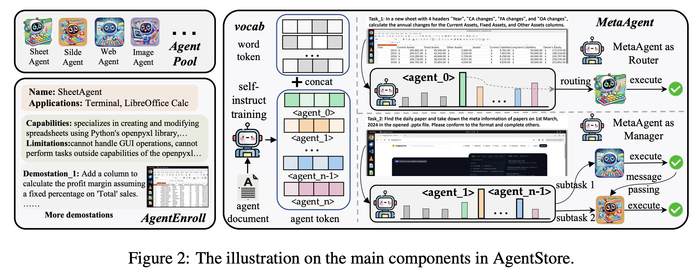
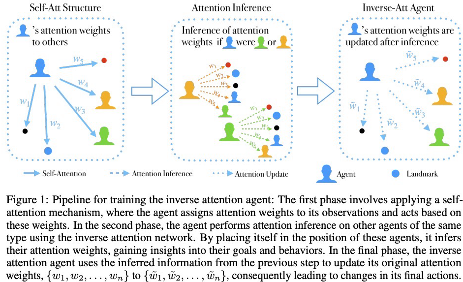
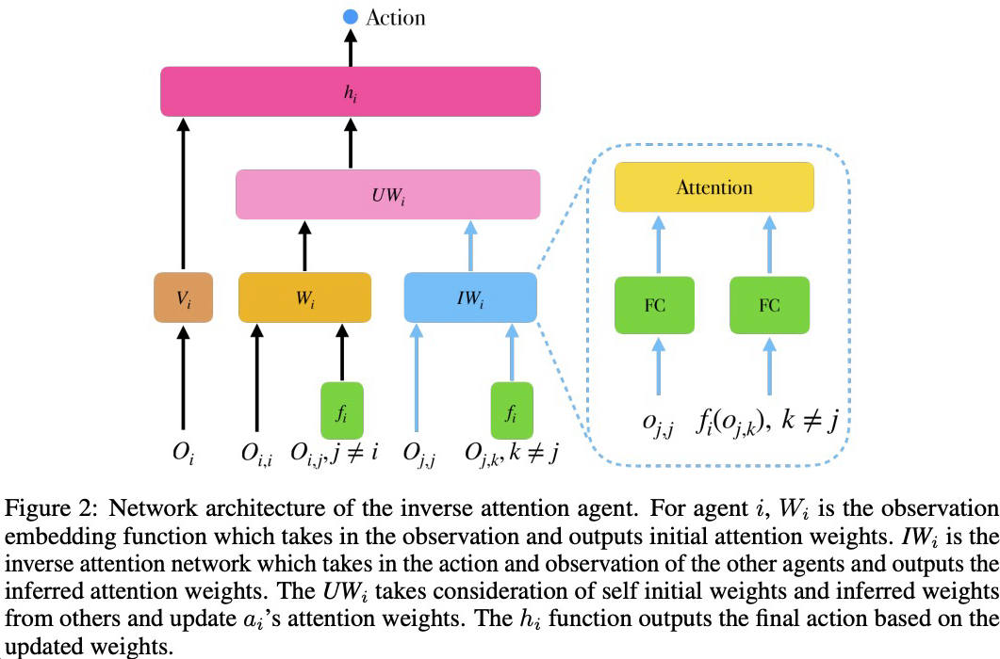
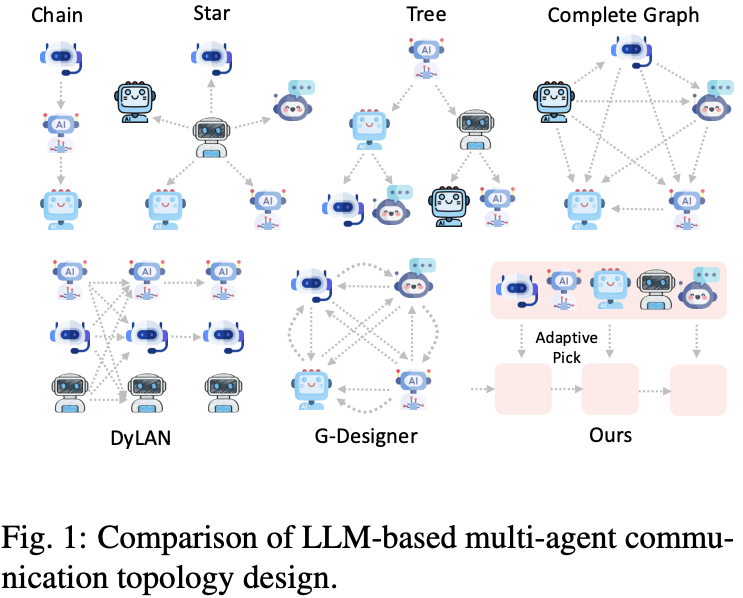
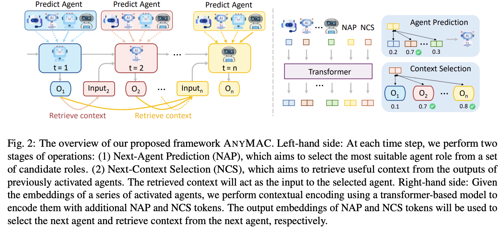
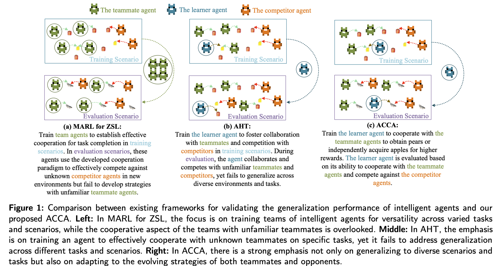

# [(20231121)（Benchmark） GAIA: A Benchmark for General AI Assistants](https://huggingface.co/gaia-benchmark)
本文提出了 GAIA，这是一个面向通用人工智能助手（General AI Assistants）的全新评测基准，其目标是评估人工智能系统在迈向通用人工智能（AGI）过程中的关键能力。如果一个系统能够高质量地完成 GAIA 所设定的任务，将标志着 AI 研究在通用性方面迈出具有里程碑意义的一步。GAIA 所提出的问题来源于现实世界，涵盖推理、多模态理解、网页浏览和通用工具使用等基础能力。这些任务对人类而言直观简单，但对目前最先进的 AI 模型依然具有很大挑战。例如，GPT-4 搭配插件仅能在 GAIA 上达到 15% 的正确率，而普通人类答题者则达到 92%，这与当前大型语言模型在法律、化学等专业领域超越人类的趋势形成鲜明对比。GAIA 的设计理念不同于当前主流 AI 基准测试趋向设定对人类愈加困难的任务，而是强调系统应在类似人类的常识性和现实任务中展现出稳健性和泛化能力。作者认为，**通用人工智能的出现不取决于模型是否能在专业领域胜过专家，而是取决于它是否具备像普通人一样解决广泛日常任务的能力**。为此，作者依据 GAIA 的方法论设计了包含 466 个高质量问题的数据集，题目内容注重多模态融合、跨领域知识和真实世界任务的复杂性，均附有标准答案以便训练与评估。

# [(202412) AgentStore: Scalable Integration of Heterogeneous Agents As Specialized Generalist Computer Assistant](https://arxiv.org/abs/2410.18603)

近年来，针对多智能体系统（Multi-Agent Systems），研究者提出了多种方法（Park 等人，2023；Sun 等人，2023；Wu 等人，2023；Hong 等人，2023）以促进多智能体间的有效协作与通信，从而克服幻觉问题并确保结果的确定性和可信度。这些方法在自动化编码等领域已展现出良好效果，但仍存在两大局限性：  

1. **智能体数量固定与角色预先定义**：现有方法采用固定数量的智能体且角色预先设定，缺乏对智能体动态集成的支持；  

2. **智能体同质性**：智能体通常为同种类型，限制了多样性，进而约束了系统能力范围。  

为此，本文提出 AgentStore，旨在通过动态集成异构代理实现计算机任务自动化。该平台支持用户集成第三方代理，使系统能够持续丰富功能并适应快速演进的操作系统。

## 研究框架
AgentStore 主要由三个核心组件构成：智能体池（AgentPool）、智能体注册模块（AgentEnroll）和元智能体（MetaAgent）。智能体池存储所有具备特定功能的智能体；智能体注册模块定义了将新智能体添加到智能体池的集成协议；元智能体则从智能体池中选择最合适的一个或多个智能体，独立或协同完成任务。 

- 智能体池（AgentPool）：智能体池是 AgentStore 内所有可用智能体的集合。为构建 AgentStore，作者在智能体池中整合了 20 多个功能不同的智能体。这些智能体涵盖单模态到多模态类型，包括开源和闭源模型，交互形式既有命令行界面（CLI），也有图形用户界面（GUI）。其多样化的能力覆盖了日常生活和专业工作中的常见应用与任务。

- 智能体注册模块（AgentEnroll）：当开发者创建新的操作系统智能体并希望将其集成到 AgentStore 时，必须以标准化格式注册智能体信息。为确保集成过程的一致性，作者制定了智能体集成协议。在注册过程中，开发者需填写预定义表格，详细说明智能体的功能、局限性、交互应用以及功能演示（见上图）。形式上，所有已注册智能体的集合表示为 $A = {(a_1, d_1),(a_2, d_2), ...,(a_n, d_n)}$，其中每个智能体 $a_i$ 的完整注册表格构成文档 $d_i$。

- 元智能体（MetaAgent）：作为 AgentStore 的核心，元智能体充当平台管理者。如图右侧所示，当用户提出任务时，元智能体将任务描述与系统状态（包括屏幕截图、终端输出、无障碍树等）相结合，从智能体池中选择合适的智能体来完成任务。这主要涉及两项功能：其一，当单个智能体可处理任务时，元智能体会选择最合适的智能体；其二，当需要多个智能体协作时，元智能体将任务拆分为子任务，并分配给相应智能体，以确保任务高效完成。

## 元智能体
作者采用功能强大的开源多模态大语言模型（MLLM）作为元智能体 M 的基础，使其能够处理涵盖任务描述和操作系统截图的多模态信息。给定所有已注册智能体集合 $A$，元智能体的目标是调用其中的子智能体集合以实现计算机任务自动化。由于 AgentStore 中的智能体数量动态增长并可能达到大规模，传统方法如上下文学习（ICL，In-Context Learning）和全量微调（FT，Fine-Tuning）分别因上下文长度超限和再训练成本过高而不再适用。为此，作者提出** AgentToken 策略**，该策略无需冗长上下文，并显著降低新增智能体时元智能体的再训练成本。  

在元智能体的词汇表中，将已注册智能体编码为特殊 token。具体而言，智能体 token 被参数化为嵌入矩阵 $W_A \in \mathbb{R}^{|A| \times d}$，并拼接到原始词 token $W_V \in \mathbb{R}^{|V| \times d}$ 上。假设智能体 token $W_A$ 已训练完成，两者的拼接结果构成元智能体新的 language modeling head。此时，元智能体通过以下概率预测下一个 token：  
$$
P_M(t_i | t_{<i}) = \text{softmax}([W_V; W_A] \cdot h_{i-1}),
$$  
其中下一个 token $t_i$ 可以是词 token 或智能体 token（即 $t_i \in V \cup A$），$h_{i-1} \in \mathbb{R}^d$ 为最后一个隐藏状态。  

在此框架下，AgentToken 策略使元智能体能够实现两大核心功能： 

1. **元智能体作为 Router**：通过最大化条件概率获取最可能的下一个 token：  
$$
t_i^* = \arg \max_{t \in V \cup A} P_M(t_i | t_{<i}).
$$  
若预测为智能体 token（$t_i^* \in A$），元智能体将停止解码并调用对应智能体执行任务。该方法使元智能体在单个智能体可完成任务时，能够预测最合适的智能体。  

2. **任务拆分与多智能体协作（Manager 模式）**：当任务需要多个智能体时，**已训练的智能体 token 常出现在下一个 token 预测的高概率候选集中**。基于此观察，作者将元智能体的预测从单 token 扩展为多 token 模式：  
$$
T_i^* = \text{TopK}_{t \in A} ( P_M(t_i | t_{<i}), K),
$$  
其中，$\text{TopK}(\cdot)$ 函数从智能体 token 集合 $A$ 中返回概率最高的 $K$ 个 token，对应与任务最相关的 $K$ 个智能体。  

元智能体在获取 $K$ 个候选智能体后，将切换至**管理器模式**，通过以下步骤实现任务拆解与分配：  

- **上下文提示生成**：利用所选智能体的注册文档（即 $d_i$，包含功能描述、局限性、交互示例等）构建新的上下文提示，明确如何为复杂任务生成子任务并分配给对应智能体。  

- **任务拆解逻辑**：通过提示引导智能体协作，例如将“批量处理图像并生成报告”任务拆分为“图像裁剪智能体”“色彩调整智能体”和“文档生成智能体”的子任务链。  

**这种先选择智能体再根据智能体文档进行任务划分的方式，将任意规模的输入（任务描述）映射为固定大小的输出（$K$ 个智能体 token）。**

### 模式切换策略  
元智能体的 Router 模式与 Manager 模式可通过**手动或自动方式**切换：  

- **自动切换**：基于思维链（CoT, Wei et al., 2022）分析任务复杂度：  
  
  - 若任务可由单一智能体完成（如“打开计算器”），保持路由器模式，直接调用对应智能体 token；  
  
  - 若任务需多步骤协作（如“使用 Excel 处理数据并生成 PPT 图表”），触发管理器模式，选择并协调多个智能体。
    
- **手动切换**：支持用户通过指令（如“请使用协作模式”）强制指定模式。  

实验表明，基础元智能体无需额外训练即可通过任务语义分析实现模式切换的二分类决策，且准确率满足实际应用需求。  

## TRAINING AGENTTOKEN WITH SELF-INSTRUCT
###  数据生成
智能体 token 对应的嵌入矩阵 $W_A$ 是唯一的可调参数，仅引入极小的额外训练开销。然而，训练这些 token 需要大量包含**任务描述**和**初始操作系统状态**的智能体演示数据。作者提出基于**自指令学习（self-instruct）**的自动化流程，利用元智能体自身生成的演示数据对 $W_A$ 进行调优。  

整体流程采用迭代算法，从有限的原始演示集合 $S_i = {(y_k)}_{k=1}^{n_i}$ 和智能体文档 $c_i$ 出发，逐步扩展高质量演示数据。核心步骤如下：  

#### 1. 初始演示数据生成
使用现有演示数据 $S_i$ 和智能体描述 $c_i$ 向元智能体 $M$ 发起 prompt，生成新的演示数据 $S'_i = M(S_i, c_i)$，其中 $S'_i$ 包含元智能体基于文档语义和现有演示逻辑生成的新任务-状态对。  

#### 2. 演示质量过滤与优化
为确保生成演示的**一致性**和**多样性**，采用 BERTScore 对所有新生成的演示 $y' \in S'_i$ 进行评估，并通过贪心算法迭代过滤元素，得到精炼集合 $S^{\text{new}}_i \subseteq S'_i$。过滤条件为：  
$$
\tau_1 \leq \text{BERTScore}(y_k, y_j) \leq \tau_2, \quad \forall y_k, y_j \in S_i \cup S^{\text{new}}_i \ \text{且} \ k \neq j,
$$ 

- 下限 $\tau_1$：避免生成与现有演示语义无关的输出；
    
- 上限 $\tau_2$：确保演示之间具有足够的多样性，覆盖不同任务场景。  

#### 3. 数据增强与迭代引导 
将过滤后的演示数据集合 $S^{\text{new}}_i$ 合并到原始集合中（即 $S_i = S_i \cup S^{\text{new}}_i$），形成增强后的演示数据集。元智能体基于新的 $S_i$ 进一步生成更多示例，重复上述 BERTScore 引导的过滤过程，直至生成足够数量的演示数据以满足 $W_A$ 的训练需求。  

### 基于自生成数据的训练机制  
在训练过程中，演示集合 $S_i$ 中的每个任务描述和初始状态作为输入前缀，其后附加智能体 token Agent $i$ 作为下一个 token 预测的真实标签。具体而言，AgentToken 的训练目标为：  
$$
\mathcal{L}(W_A) = \sum_{i=1}^{|A|} \sum_{y_j \in S_i} -\log P(\langle \text{Agent } i \rangle | y_j),
$$  
其中嵌入矩阵 $W_A$ 是智能体池 $A$ 中所有智能体唯一的可调参数。  

question: 当需要多个智能体时，先选择固定数目的 agents，然后将任务进行分解再划分。如何选择 k 个 agents？这 k 个 agents 一定和任务相关吗？在进行选择时，为什么不基于任务进行选择？

# [（ICLR 2025）（多智能体） Inverse Attention Agents for Multi-Agent Systems](https://openreview.net/forum?id=OaoDVZntGe)
多智能体强化学习（MARL）目前存在的一个局限性为：虽然通过一起训练后的多智能体展现出熟练的协调能力，但在与不熟悉的 agent 合作时，它们的性能会明显下降。传统的 Theory of Mind (ToM) 研究关注的是智能体对他人“信念、欲望”等心理状态的推理，该研究将其“注意力”机制引入 MARL 中，通过端到端的注意力识别网络，提升多智能体系统中的认知建模能力与协作效果。

## 马尔可夫博弈
多智能体马尔可夫决策过程（Multi-Agent MDPs，Littman, 1994）的状态转移与奖励依赖于所有智能体的联合动作。一个包含 $N$ 个智能体的马尔可夫博弈形式上定义为：

* 状态集合：$\mathcal{S}$.

* 每个智能体 $i$ 的动作集合：$\mathcal{A}_i$.

* 状态转移函数：
  $$
  T: \mathcal{S} \times \mathcal{A}_1 \times \cdots \times \mathcal{A}_N \rightarrow \Delta(\mathcal{S}).
  $$
其中，$\Delta(\mathcal{S})$ 表示在状态集合上的概率分布。

* 每个智能体 $i$ 的奖励函数：
  $$
  R_i: \mathcal{S} \times \mathcal{A}_1 \times \cdots \times \mathcal{A}_N \rightarrow \mathbb{R}.
  $$
每个智能体的目标是通过最大化其期望的累积折扣奖励：
$$
\mathbb{E} [ \sum_{t=0}^{\infty} \gamma^t R_i(s_t, a_{1,t}, \ldots, a_{N,t}) ].
$$
来学习一个策略 $\pi_i : \mathcal{S} \rightarrow \Delta(\mathcal{A}_i)$。该策略定义了在当前状态下，智能体采取各个动作的概率分布，旨在优化其在当前环境下的长期收益。

## 方法介绍

- 阶段一：自注意力策略建模（Self-Attention Policy）。使用 Transformer 中的 **self-attention** 机制构建策略函数；每个智能体通过计算自身对多个目标的注意力权重（attention weights）决定采取的动作；目的是让智能体能够在内部根据对不同任务或目标的关注度进行行为决策。在这一步，通过优化历史行动策略，来获取每个智能体对多个目标的注意力权重数据。

- 阶段二：推理他人注意力（Inverse Attention Inference）。使用 **逆注意力网络（Inverse Attention Network）** 推理其它智能体的注意力：通过换位思考，智能体设想自己处于其他同种类型智能体的位置，依据观察到的行为和环境状态，反推出它们对不同目标的注意力权重；这是模仿“心智理论”（Theory of Mind）的关键步骤。在这一步，根据上一步获得的（目标、注意力权重）数据，去训练一个 attention 网络。然后基于训练后的 attention 网络，代入其他智能体的观测结果/环境状态，得到它们对不同目标的注意力权重。

- 阶段三：更新自身注意力权重。将第二阶段推理出的其他智能体对不同目标的注意力权重作为输入；智能体据此 **更新自身的注意力权重**，从而调整其对各个目标的重视程度；更新后的注意力权重将影响最终动作选择，实现更高层次的协作或对抗行为。

# [(2024 ACL) Experiential Co-Learning of Software-Developing Agents](https://aclanthology.org/2024.acl-long.305/)

# [(202505) EcoAgent: An Efficient Edge-Cloud Collaborative Multi-Agent Framework for Mobile Automation](https://arxiv.org/abs/2505.05440)

# [(2025 ACL) Optima: Optimizing Effectiveness and Efficiency for LLM-Based Multi-Agent System](https://arxiv.org/abs/2410.08115)

# [(202505) Multi-Agent Collaboration via Evolving Orchestration](https://arxiv.org/abs/2505.19591)

# [(202505) Cross-Task Experiential Learning on LLM-based Multi-Agent Collaboration](https://arxiv.org/abs/2505.23187)

# [(202503) MAS-GPT: Training LLMs to Build LLM-based Multi-Agent Systems](https://arxiv.org/pdf/2503.03686)

# [(202506) AgentOrchestra: A Hierarchical Multi-Agent Framework for General-Purpose Task Solving](https://www.arxiv.org/pdf/2506.12508)
近年来，LLMs 的智能体系统在解决复杂任务方面展现出强大能力，但现有方法普遍缺乏协调多个专用智能体的机制，且在新领域中的泛化能力有限。为此，本文提出了 AgentOrchestra——一个面向通用任务求解的分层多智能体框架。该系统借鉴指挥家协调交响乐团的方式，融合高层规划与模块化智能体协作，强调可扩展性、多模态处理、模块化设计与智能体协调能力。框架核心是一个中央规划智能体，负责将复杂目标拆解为子任务，并将其分配给具备不同专长的子智能体。这些子智能体拥有通用的编程与分析工具，能够执行各种现实任务，如数据分析、文件操作、网页导航以及动态多模态环境中的交互式推理。AgentOrchestra 通过明确的子目标设定、智能体间通信以及角色动态分配，实现了灵活的任务调度与协作。在三个主流基准数据集上进行评估，涵盖网页搜索、跨模态推理等现实任务，实验结果表明，AgentOrchestra 在任务成功率与适应能力方面均优于传统的扁平化或单体式智能体系统。这一研究凸显了分层架构与角色专精机制在构建可扩展、通用的 LLM 智能体系统中的有效性。

# [(202506) AnyMAC: Cascading Flexible Multi-Agent Collaboration via Next-Agent Prediction](https://www.arxiv.org/pdf/2506.17784)

## Related Work
为支持多智能体之间的协作，研究者们探索了多种通信结构（如链式、树状、星形、全连接、随机图以及可学习的拓扑结构），以适应不同任务复杂性与通信开销的需求。这些结构旨在在性能与效率之间取得平衡，并根据任务或输入查询调整通信方式。近年来，学习型拓扑结构的引入使智能体通信图能够动态生成，标志着从固定流程向更灵活、任务感知的通信系统转变，进一步释放了大语言模型群体智能的潜力。

尽管取得了诸多进展，当前基于图的通信结构仍存在根本性限制。首先，它们在每轮通信中通常采用静态拓扑结构：一旦通信图确定，所有智能体即只能遵循固定的通信模式运行，缺乏在推理过程中的动态调整能力。这种限制导致无法对某些关键智能体（如擅长 Python 编程的专家代理）在任务多个阶段进行重复调用，尤其是在需要多轮反馈或递归推理的复杂任务中，这会造成效率低下或推理路径不优。为了保证消息流的有向无环性（DAG），许多设计不得不进一步收缩通信拓扑的空间，限制了智能体间更灵活、更动态的合作方式。其次，现有方法多数仅允许信息在图中相邻智能体间传递，即每个智能体只能接收到邻居节点的消息。在诸如树状结构中，这导致下游智能体常常无法访问平行分支的结果，从而错失关键的上下文信息，影响整体推理质量。这种对全局信息流的限制，使得智能体难以建立全面的认知，影响了集体智能在复杂任务中的表现。

为解决当前多智能体通信结构中的限制，本文提出了全新的多智能体协作框架 **ANYMAC**，其核心思想是以**顺序通信协议**取代传统的图结构建模方式，从而实现更灵活、更高效的智能体协同。ANYMAC 引入了两个关键创新设计：

（1）**下一智能体预测（Next-Agent Prediction）**：系统通过逐步预测的方式动态决定下一个要激活的智能体。这种顺序式设计跳出了图结构的限制，允许在不同任务中灵活调整智能体的调用顺序与频次，实现智能体的重复使用与个性化调度。

（2）**下一上下文选择（Next-Context Selection）**：该机制允许每一步自由访问所有历史步骤中任意智能体的输出，从而实现全局信息的灵活获取。信息的传递不再受限于固定的图边或线性顺序，而是基于任务需求动态选择最相关的上下文，实现更加丰富且适应性强的通信流程。

ANYMAC 的这两项设计共同构建出一种**任务自适应、上下文可控的通信范式**，显著提升了多智能体系统在复杂任务中的表现。大量基准实验结果表明，该方法在准确率与计算效率（尤其是 token 消耗）方面均优于现有最先进的通信拓扑结构，验证了其在多智能体协作中的优势与实用性。

## Problem Formulation

本文提出的 ANYMAC 框架将多智能体通信过程建模为一个顺序决策流程，核心思想是将通信流程表示为一个由语言模型驱动的智能体序列：
$$
S = [a_1, a_2, \ldots, a_T]
$$
其中，每个元素 $a_t$ 表示第 $t$ 步被选中的智能体。该设计允许智能体在任务中被多次复用，并可根据具体任务动态调整智能体的调用顺序。

每个智能体 $a_t$ 包含以下组成部分：
$$
a_t = \{\text{Base}_t, \text{Role}_t, \text{State}_t, \text{Tool}_t\}
$$

* $\text{Base}_t$：该智能体底层使用的语言模型实例；
  
* $\text{Role}_t$：当前所承担的角色（如分析员、程序员等）；
  
* $\text{State}_t$：记录智能体的记忆与交互历史；
  
* $\text{Tool}_t$：可选的插件工具，如计算器、搜索引擎、文件检索器等。

对于初始任务查询 $Q$，通信序列在 $T$ 步中依次展开。每一步 $t$ 包括如下三个阶段：

#### 1. 上下文选择与提示生成
在每一步，系统会组合原始查询和之前生成的部分响应构建提示：
$$
P^{(t)}_R = \text{Select}(\{O^{(1)}, \ldots, O^{(t-1)}\})
$$
其中，$O^{(i)}$ 是第 $i$ 步由智能体生成的响应，Select 是一个可学习模块，用于从历史输出中筛选最相关的信息构建当前上下文。

#### 2. 智能体执行
选中的智能体根据如下提示进行响应生成：
$$
O^{(t)} = a_t (P^{(t)}_{\text{sys}}, P^{(t)}_{\text{usr}}, P^{(t)}_R)
$$
* $P^{(t)}_{\text{sys}}$ 包含角色 $\text{Role}_t$ 和状态 $\text{State}_t$；
  
* $P^{(t)}_{\text{usr}}$ 是用户提示，包含任务查询与操作说明；
  
* $P^{(t)}_R$ 为从历史中选出的上下文响应。

#### 3. 编码与预测机制
* **Encoding 阶段**：将任务查询 $Q$、候选角色集 $R$ 以及历史对话 $H_{t-1}$ 编码为 Token 并输入 Transformer 模型，生成上下文嵌入。
  
* **Prediction 阶段**：基于上下文嵌入，系统执行两个预测：

  * **Next Agent Prediction (NAP)**：预测下一个最合适的智能体 $a_t$；
  
  * **Next Context Selection (NCS)**：从历史响应中选出与当前任务最相关的信息作为提示输入。

这一序列将持续进行，直到达到终止条件。最后由一个裁决智能体对所有响应进行聚合，输出最终答案：
$$
a^{(T)} = \text{FinalAggregator}(\{O^{(1)}, \ldots, O^{(T)}\}).
$$
该顺序式协作框架突破了传统图结构在通信拓扑上的刚性约束，支持智能体重复使用与灵活的信息路由，实现更高效、更具适应性的多智能体推理流程。实验证明，ANYMAC 在多个基准测试中，在准确率和 token 消耗效率方面均优于现有最先进的方法。

# [(202506) Generalizable Agent Modeling for Agent Collaboration-Competition Adaptation with MultiRetrieval and Dynamic Generation](https://arxiv.org/pdf/2506.16718)

这三种方法分别代表了多智能体系统中关于协作与泛化能力研究的不同方向，具体如下：

#### (a) MARL for ZSL（多智能体强化学习用于零样本学习）
在训练阶段，让一组智能体在特定任务和场景中建立高效的协作策略，以完成任务。这些智能体能够在评估阶段利用已有的协作范式，在新环境中与陌生对手竞争。虽然具备一定的泛化能力，但在遇到\*\*陌生队友（unfamiliar teammates）\*\*时，缺乏动态协作能力，无法建立新的合作关系。

#### (b) AHT（Ad Hoc Teamwork，即临时团队协作）
训练智能体与未知的队友进行有效合作，同时在特定任务中对抗竞争对手。强调智能体与陌生队友的协作能力，提升临时合作的适应性。尽管可与陌生队友配合完成任务，但缺乏对任务和环境多样性的泛化能力，无法适应变化的任务场景。

#### (c) ACCA（Ad Hoc Collaboration and Competition Agent，即临时协作与竞争智能体）
在训练过程中，智能体既可与队友协作（如共同获取“梨”），也能自主行动（如独立获取“苹果”）以获得更高奖励。同时具备跨任务、跨环境的泛化能力；能够动态适应队友和对手的策略变化；在评估阶段，能够灵活处理协作与竞争双重需求。
ACCA综合了 MARL 的泛化优势与 AHT 的协作能力，并进一步提升了在动态多智能体环境中的通用适应性和策略弹性。
