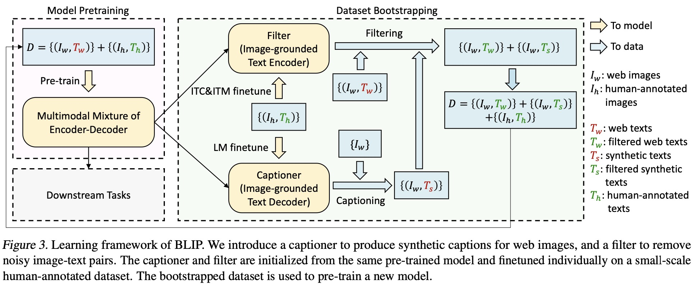

# 基本概念
### 短期消费指标
1. 点击率：点击次数/曝光次数。
2. 点赞率：点赞次数/点击次数。
3. 收藏率：收藏次数/点击次数。
4. 转发率：转发次数/点击次数。
5. 阅读完成率：滑动到底次数/点击次数 $\times$ f(笔记长度)，其中使用归一化函数f的原因是长度越长的笔记的阅读完成难度更高。

### 北极星指标（根本标准，线上指标）
1. 用户规模：日活用户数（DAU)，月活用户数（MAU)。
2. 消费：人均使用推荐的时长、人均阅读笔记的数量。
3. 发布：发布渗透率，人均发布量。

### 实验流程
1. 离线实验：收集历史数据，在历史数据上做训练、测试。算法没有部署到产品中，没有跟用户交互，未必可靠，不占用线上资源，
2. 小流量AB测试：把算法部署到实际产品中，将用户分为实验组和对照组，实验组用新策略，对照组使用旧策略，对比两者的业务指标。
3. 全流量上线：如果新策略显著优于旧策略，可以加大流量，全面部署。

### 推荐系统架构基本概念
1. item：代表信息的容器，可以是一个视频、文章、商品、广告等等。
2. 消费：用户浏览item所承载的信息，然后发生一系列的消费行为，比如播放、点赞、收藏、关注、转发、购买等等。
3. 分发：决定将哪些item与用户匹配，展示给用户进行消费的过程。
4. 打包：将用户能够浏览的信息拼接封装到item这个容器中展示给用户的过程。
5. user：消费或者生产item的用户。
6. 候选：准备推荐给用户消费的item数据索引集合。
7. 预估：深度学习模型的前向传播过程，计算概率值等信息。
8. 召回：信息检索的一个过程，通过一个key获得一堆相关的id。
9. 排序：对召回的id，按照某种分值进行排序。
10. 数据流：数据整个生命周期的处理过程。
11. 特征：物理上客观事物所蕴含信息的数学表达。
12. 样本：用于机器学习模型训练的数据。

# 推荐系统架构
推荐系统的链路：从上亿物品中进行召回得到几千个物品，然后进行粗排得到几百个物品，再经过精排对几百个物品进行打分，最后重排得到几十个物品。

## 构建过程
### 候选构建
当文章、视频等内容(item)在发布平台(item DB)发布时，经过一些审核与处理后需要将item存储为易于推荐系统查询等格式，通常包括正排索引+倒排索引两种方式。

- 正排索引：以itemID为key，然后将一些相关的属性进行序列化后，存储为key-value形式。
- 倒排索引：以某个属性或者计算的tag为key，value是itemID，存储为key-value形式。

候选集合本质上是一个易于推荐引擎查询数据的索引结构，提供基础的数据支撑。

### 特征工程
从复杂数据中提取的数学化信息。通过进行特征抽取，可以选择对模型有贡献的属性，并对其进行预处理等，得到最终的特征后持久化地存储到专用的特征存储服务中，并更新一部分正排信息，用于对外提供特征的在线查询。

### 召回系统
如果用户特征和item特征在同一空间，基于用户的兴趣特征与item特征之间的相关性，比如余弦相似度等，选取最有可能排序在前面的item，返回top k 的结果。
真实的召回系统通常要多种召回通道，不同通道关注不同的层面，并行使用，然后将结果统一合并（比如使用蛇形合并）。

召回通道：协同过滤、双塔模型、关注的作者等等。 

### 排序系统
每次召回通常会返回上千条内容（具体数字看具体场景），如果将每条内容都放到大规模模型中进行预估，这会导致推荐的延迟性。因此，会将排序阶段分为粗排和精排两部分。
首先，在粗排阶段，会使用一些小规模模型进行快速预估打分，将上千条内容在短时间内过滤为几百条。
然后，在精排阶段，这几百条item会通过一个较大的模型进行预估。这些item特征会组成模型的输入，通过前向传播得到一个输出。比如输出一个分值，该分值表示用户观看该内容后会使得使用时长得到增长。

粗排筛选+精排打分的搭配，可以使得排序结果在毫秒内返回。

### 重排（混排）系统
推荐系统需要考虑推荐内容的多样性，并且需要满足一定的运营能力。为了降低推荐内容的相似性，需要有一定的打散模型，能够在精排阶段选出的几百条内容中得到使得整体收益最大的一个排列组合。

具体做法有：通过规则系统（比如选取top k个item）和精排打分作为剪枝依据，使用dfs遍历每一种可能的排序组合形式。将每一种排序组合作为输入，通过一个重排模型，得到对该排序list的打分。最终选择得分最高的一个list进行返回。

混排：根据一定的规则，插入广告等，然后遍历所有可能的排序方式（比如广告数量、插入顺序等），最后返回得分最高的一个排序方式。

总之，先进行多样性抽样（MMR,DPP等），从几百篇中选取几十篇。然后用规则打散相似笔记。再插入广告、运营推广等内容，根据生态要求调整排序。
 
### 消重系统
用户在一段时间内不能看到相同的内容，因此需要一个系统记录当前用户已浏览过的内容，并在召回后将其过滤掉。进而保证了送入排序阶段的内容都是用户没有浏览过的新内容。

## 召回
### 基于物品等协同过滤（ItemCF)
ItemCF: 在给用户推荐item时，综合考虑新item与用户已使用item之间的相似度以及用户对已使用item的喜好程度。

已知用户user对物品 $item_j(j = 1,...,n)$的喜好打分 $like(user, item_j)$，并且可以计算得到新的item与 $item_j(j = 1,...,n)$ 之间的相似度 $sim(item_j, item)$，简单的预估计算公式为：
$$
\sum_j like(user, item_j) \times sim(item_j, item).
$$

关于物品的相似度，可以根据受众用户相似度（交集）等计算得到。

事先离线计算（需要维护两个索引，计算量大）：

1. 用户-物品索引：记录每个用户最近点击、交互过的物品id（格式为：用户-物品id+喜好分数列表）。对于给定的任意用户id,可以找到他最近感兴趣的物品列表。

2. 物品-物品索引：计算物品之间两两相似度，对于任意物品，可以快速返回与它最相似的k个物品。格式为：物品-物品id+相似度列表）

线上召回（利用两个索引，计算量相对较小）：

1. 对于给定的用户id，通过用户-物品索引，找到用户近似感兴趣的物品列表。

2. 对于列表中的每个物品，通过物品-物品的索引，找到top-$k$相似物品。

3. 假设列表中有$n$个物品，那么取回的相似物品最多有 $nk$个，通过上述公式预估用户对物品的兴趣分数。

4. 返回分数最高的top-$k$的物品，作为推荐结果。

### Swing 模型

### 基于用户的协同过滤（UserCF)

### 离散特征处理

### 矩阵补充、最近邻查找

### 双塔模型

### 地理位置召回、位置召回、缓存召回

## 实时样本拼接
样本拼接是用来生成模型必须的样本数据集，供实时和离线训练/验证使用。对于推荐来说，需要将用户对item的发生事件进行上报（埋点），用于数据分析和样本拼接。

埋点事件：客户端或者服务端在特定时机上报特定参数组成的结构化数据，通常包括事件以及事件的属性，即用户-item-事件。

用户行为：客户端上报的埋点数据经过数据平台转化为用户行为日志，通常称之为useraction。埋点事件和用户行为是多对多的关系。

<!--  -->

# Reference
[硬核课堂](https://hardcore.feishu.cn/wiki/wikcn9i4sfdTkxVX0DYrMMbNBpd)

